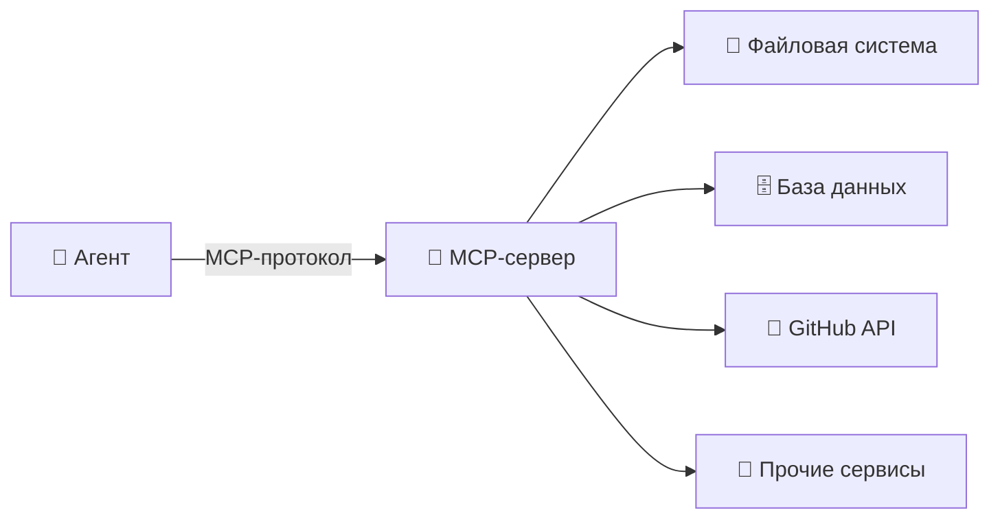
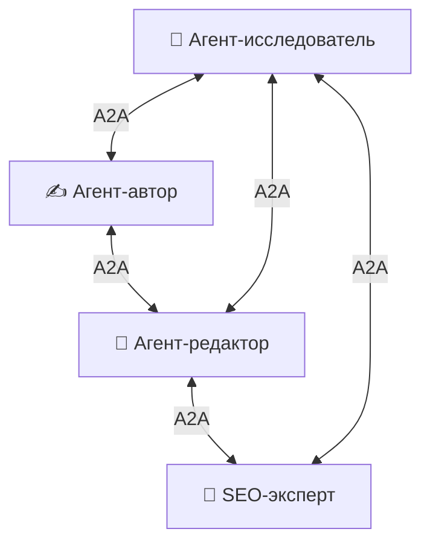
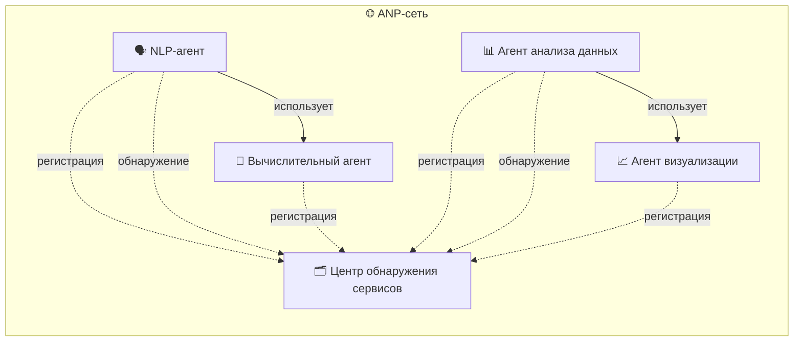
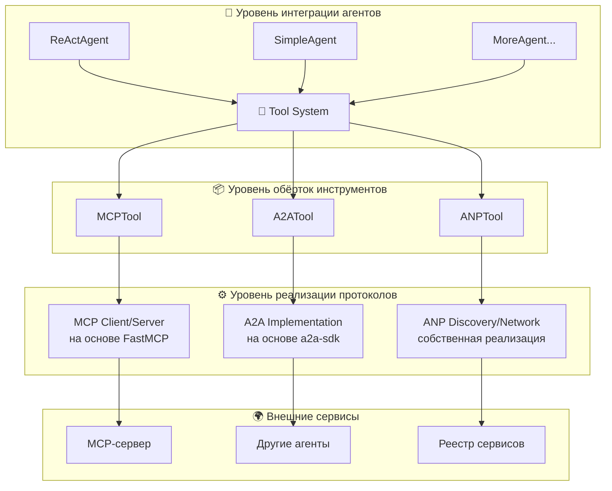
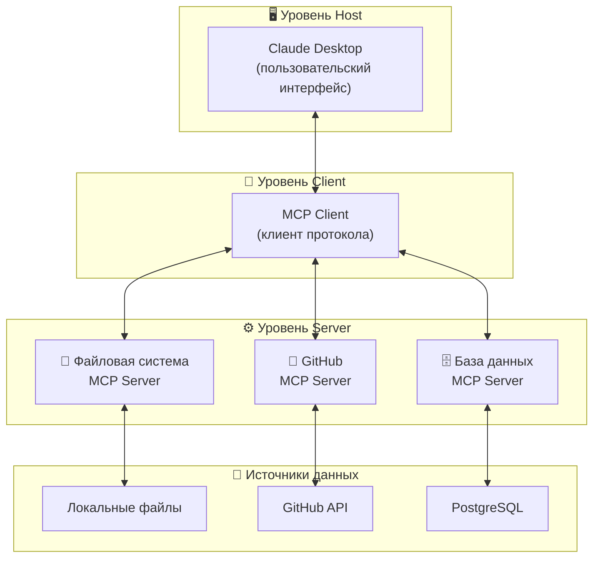
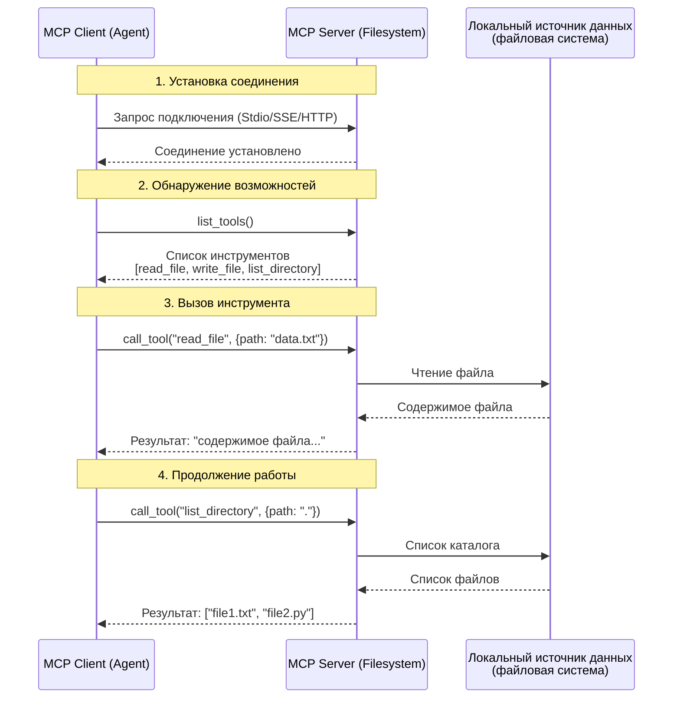
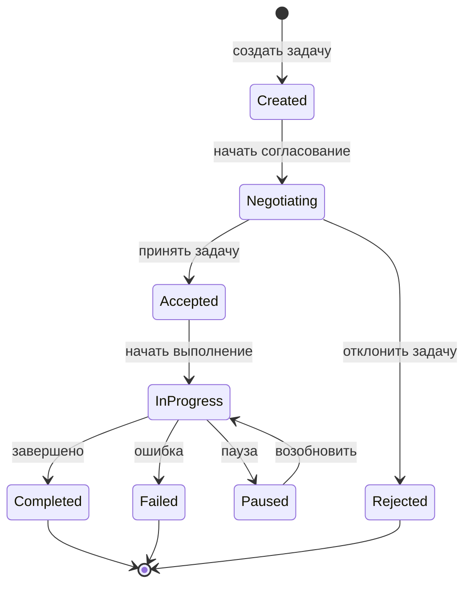
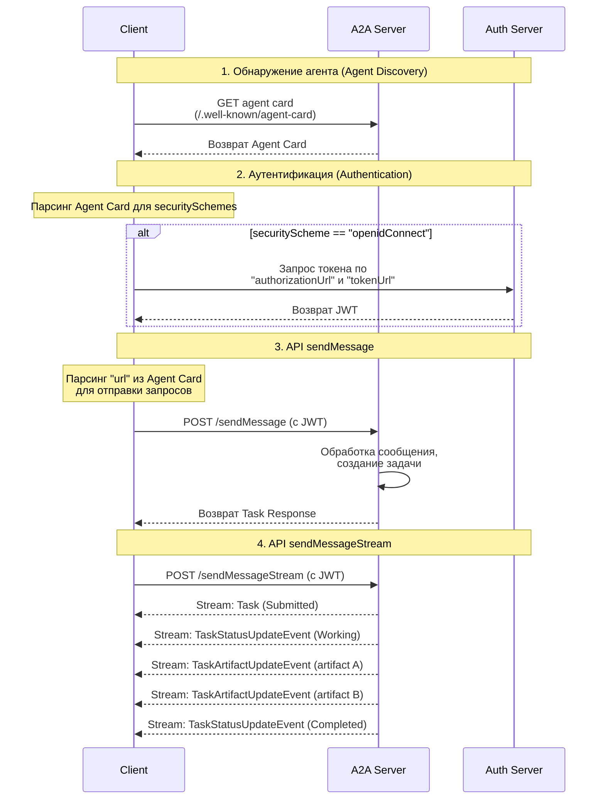
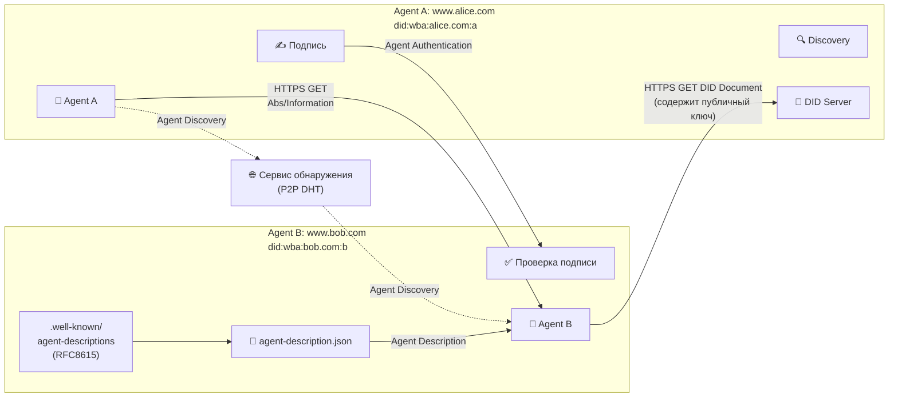

# Глава 10: Протоколы взаимодействия агентов

В предыдущих главах мы построили полноценных автономных агентов с возможностями рассуждения, вызова инструментов и памяти. Однако при попытке создавать более сложные AI-системы закономерно возникают вопросы: **Как агентам эффективно взаимодействовать с внешним миром? Как несколько агентов могут сотрудничать друг с другом?**

Именно эту проблему призваны решить протоколы взаимодействия агентов. В данной главе в фреймворк HelloAgents вводятся три протокола: **MCP (Model Context Protocol)** — для стандартизированной коммуникации между агентами и инструментами, **A2A (Agent-to-Agent Protocol)** — для одноранговой коллаборации агентов, и **ANP (Agent Network Protocol)** — для построения крупномасштабных агентных сетей. Все три протокола вместе образуют инфраструктурный слой взаимодействия агентов.

Изучив эту главу, вы овладеете философией проектирования и практическими навыками применения протоколов взаимодействия агентов, поймёте различия в дизайне трёх mainstream-протоколов и научитесь выбирать подходящий протокол для решения практических задач.

## 10.1 Основы протоколов взаимодействия агентов

### 10.1.1 Зачем нужны протоколы взаимодействия

Вспомним ReAct-агента из Главы 7, уже обладающего мощными возможностями рассуждения и вызова инструментов. Рассмотрим типичный сценарий использования:

```python
from hello_agents import ReActAgent, HelloAgentsLLM
from hello_agents.tools import CalculatorTool, SearchTool

llm = HelloAgentsLLM()
agent = ReActAgent(name="AI-ассистент", llm=llm)
agent.add_tool(CalculatorTool())
agent.add_tool(SearchTool())

# Агент может самостоятельно решать задачи
response = agent.run("Найди последние новости об AI и подсчитай суммарную капитализацию связанных компаний")
```

Этот агент работает хорошо, но сталкивается с тремя фундаментальными ограничениями. Первое — **дилемма интеграции инструментов**: каждый раз при обращении к новому внешнему сервису (GitHub API, база данных, файловая система) необходимо писать специализированный класс Tool. Это трудоёмко, а инструменты от разных разработчиков несовместимы друг с другом. Второе — **узкое место расширения возможностей**: способности агента ограничены предопределённым набором инструментов — он не может динамически обнаруживать и использовать новые сервисы. Наконец — **отсутствие коллаборации**: когда задача достаточно сложна, чтобы требовать сотрудничества нескольких специализированных агентов (исследователь + автор + редактор), координировать их работу приходится вручную.

Рассмотрим это на более конкретном примере. Допустим, нам нужен интеллектуальный исследовательский ассистент, которому требуются:

```python
# Традиционный подход: ручная интеграция каждого сервиса
class GitHubTool(BaseTool):
    """Нужно вручную написать адаптер для GitHub API"""
    def run(self, repo_url):
        # Много кода для вызова API...
        pass

class DatabaseTool(BaseTool):
    """Нужно вручную написать адаптер для базы данных"""
    def run(self, query):
        # Код подключения и запроса к БД...
        pass

class WeatherTool(BaseTool):
    """Нужно вручную написать адаптер для Weather API"""
    def run(self, location):
        # Код вызова Weather API...
        pass

# Для каждого нового сервиса процесс повторяется
agent.add_tool(GitHubTool())
agent.add_tool(DatabaseTool())
agent.add_tool(WeatherTool())
```

Этот подход имеет очевидные проблемы: дублирование кода (каждый инструмент должен обрабатывать HTTP-запросы, ошибки, аутентификацию), сложность сопровождения (изменения API требуют правок во всех связанных инструментах), невозможность повторного использования (инструменты от других разработчиков нельзя использовать напрямую), плохая масштабируемость.

**Ключевая ценность протоколов взаимодействия** — именно в решении этих проблем. Протоколы предоставляют набор стандартизированных спецификаций интерфейсов, позволяющих агентам получать доступ к различным внешним сервисам единообразным способом, без необходимости писать специализированные адаптеры для каждого сервиса. Это похоже на протокол TCP/IP в Интернете: он позволяет разным устройствам общаться между собой без написания специализированного кода коммуникации для каждого типа устройств.

С протоколами взаимодействия приведённый выше код упрощается до:

```python
from hello_agents.tools import MCPTool

# Подключение к MCP-серверу, автоматическое получение всех инструментов
mcp_tool = MCPTool()  # Встроенный сервер предоставляет базовые инструменты

# Или подключение к специализированным MCP-серверам
github_mcp = MCPTool(server_command=["npx", "-y", "@modelcontextprotocol/server-github"])
database_mcp = MCPTool(server_command=["python", "database_mcp_server.py"])

# Агент автоматически получает все возможности без написания адаптеров
agent.add_tool(mcp_tool)
agent.add_tool(github_mcp)
agent.add_tool(database_mcp)
```

Протоколы взаимодействия приносят фундаментальные изменения: **стандартизированные интерфейсы** позволяют разным сервисам предоставлять единый способ доступа; **интероперабельность** обеспечивает бесшовную интеграцию инструментов от разных разработчиков; **динамическое обнаружение** позволяет агентам находить новые сервисы и возможности во время выполнения; **масштабируемость** упрощает добавление новых функциональных модулей.

### 10.1.2 Сравнение философий проектирования трёх протоколов

Протоколы взаимодействия агентов — не единое решение, а ряд стандартов, разработанных для разных сценариев коммуникации. В этой главе в качестве примеров для практики используются три наиболее популярных протокола: MCP, A2A и ANP.

**(1) MCP: мост между агентами и инструментами**

MCP (Model Context Protocol) предложен командой Anthropic<sup>[1]</sup>. Ключевая философия проектирования — **стандартизировать способ коммуникации между агентами и внешними инструментами/ресурсами**. Представьте, что вашему агенту нужен доступ к различным сервисам: файловой системе, базам данных, GitHub, Slack и т. д. Традиционный подход — писать специализированные адаптеры для каждого сервиса, что трудоёмко и сложно в сопровождении. MCP определяет единую спецификацию протокола, позволяя обращаться ко всем сервисам одинаковым образом.

Философия проектирования MCP — «разделение контекста». Это не просто RPC-протокол (Remote Procedure Call): что важнее, он позволяет агентам и инструментам совместно использовать богатую контекстную информацию. Когда агент обращается к репозиторию кода, MCP-сервер может предоставить не только содержимое файлов, но и контекстную информацию о структуре кода, зависимостях, истории коммитов — что позволяет агенту принимать более интеллектуальные решения.


*Рисунок 10.1 Философия проектирования MCP*

**(2) A2A: диалог между агентами**

Протокол A2A (Agent-to-Agent Protocol) предложен командой Google<sup>[2]</sup>. Ключевая философия — **реализация одноранговой коммуникации между агентами**. В отличие от MCP, ориентированного на коммуникацию агентов с инструментами, A2A фокусируется на том, как агенты сотрудничают друг с другом. Такая архитектура позволяет агентам вести диалог, согласовывать условия и сотрудничать, подобно человеческим командам.

Философия A2A — «одноранговая коммуникация». В сети A2A каждый агент одновременно является поставщиком и потребителем сервисов. Агенты могут активно инициировать запросы и отвечать на запросы других агентов. Такая P2P-архитектура устраняет узкое место централизованного координатора.


*Рисунок 10.2 Философия проектирования A2A*

**(3) ANP: инфраструктура агентных сетей**

ANP (Agent Network Protocol) — концептуальный протокольный фреймворк<sup>[3]</sup>, поддерживаемый open-source сообществом и пока не имеющий зрелой экосистемы. Ключевая философия — **построение инфраструктуры для крупномасштабных агентных сетей**. Если MCP решает вопрос «как получить доступ к инструментам», а A2A — «как вести диалог с другими агентами», то ANP отвечает на вопрос «как обнаруживать и подключать агентов в крупномасштабных сетях».

Философия ANP — «децентрализованное обнаружение сервисов». В сети, содержащей сотни или тысячи агентов, ANP предоставляет механизмы регистрации, обнаружения и маршрутизации сервисов, позволяя агентам динамически обнаруживать другие сервисы в сети без необходимости предварительной настройки всех соединений.


*Рисунок 10.3 Философия проектирования ANP*

Сравнительная таблица трёх протоколов (Таблица 10.1):

*Таблица 10.1 Сравнение трёх протоколов*

| Измерение | MCP | A2A | ANP |
|-----------|-----|-----|-----|
| **Цель проектирования** | Стандартизированная коммуникация агентов с инструментами/ресурсами | Одноранговая коммуникация между агентами | Обнаружение сервисов в крупномасштабных агентных сетях |
| **Режим коммуникации** | Клиент-сервер (C/S) | Одноранговая сеть (P2P) | Одноранговая сеть (P2P) |
| **Ключевой механизм** | Спецификация протокола | Одноранговая коллаборация | Децентрализация |
| **Сценарии применения** | Доступ к внешним инструментам и источникам данных | Коллаборация агентов и делегирование задач | Крупномасштабные экосистемы агентов |
| **Расширяемость** | Через добавление MCP-серверов | Через добавление узлов-агентов | Поддержка динамического расширения |
| **Состояние реализации** | Зрелая реализация (FastMCP) | Доступен официальный SDK | Концептуальный фреймворк |

**(4) Как выбрать подходящий протокол?**

Текущие протоколы всё ещё находятся на ранних стадиях развития. Экосистема MCP относительно зрелая, хотя актуальность различных инструментов зависит от сопровождающих. Рекомендуется выбирать MCP-инструменты, поддерживаемые крупными компаниями.

Ключ к выбору протокола — понимание своих потребностей:

- Если агенту нужен доступ к внешним сервисам (файлы, базы данных, API) — выбирайте **MCP**
- Если нужна коллаборация нескольких агентов для выполнения задач — выбирайте **A2A**
- Если нужно построить крупномасштабную экосистему агентов — рассмотрите **ANP**

### 10.1.3 Архитектура протоколов взаимодействия в HelloAgents

Разобравшись с философиями проектирования трёх протоколов, посмотрим, как их реализовать и использовать во фреймворке HelloAgents. Цель проектирования: **дать разработчикам возможность использовать протоколы максимально просто, сохраняя достаточную гибкость для сложных сценариев**.

Архитектура протоколов взаимодействия HelloAgents (Рисунок 10.4) использует трёхуровневый дизайн: уровень реализации протоколов, уровень обёрток инструментов и уровень интеграции агентов.


*Рисунок 10.4 Дизайн протоколов взаимодействия в HelloAgents*

**(1) Уровень реализации протоколов**: содержит конкретные реализации трёх протоколов. MCP реализован на основе библиотеки FastMCP, обеспечивая функциональность клиента и сервера; A2A реализован на основе официального a2a-sdk от Google; ANP — наша собственная лёгкая реализация, предоставляющая функции обнаружения сервисов и управления сетью.

**(2) Уровень обёрток инструментов**: оборачивает реализации протоколов в единый интерфейс Tool. MCPTool, A2ATool и ANPTool наследуются от BaseTool, предоставляя унифицированный метод `run()`. Такой дизайн позволяет агентам работать с разными протоколами одинаковым образом.

**(3) Уровень интеграции агентов**: точка интеграции агентов и протоколов. Все агенты (ReActAgent, SimpleAgent и др.) используют инструменты протоколов через Tool System, не заботясь о деталях реализации протоколов.

### 10.1.4 Цели обучения и быстрое знакомство

Сначала посмотрим на учебное содержание Главы 10:

```
hello_agents/
├── protocols/                          # Модуль протоколов взаимодействия
│   ├── mcp/                            # Реализация MCP (Model Context Protocol)
│   │   ├── client.py                   # MCP-клиент (поддерживает 5 методов транспорта)
│   │   ├── server.py                   # MCP-сервер (обёртка FastMCP)
│   │   └── utils.py                    # Утилиты (create_context/parse_context)
│   ├── a2a/                            # Реализация A2A (Agent-to-Agent Protocol)
│   │   └── implementation.py           # Сервер/клиент A2A (на основе a2a-sdk)
│   └── anp/                            # Реализация ANP (Agent Network Protocol)
│       └── implementation.py           # Обнаружение/регистрация сервисов ANP
└── tools/builtin/                      # Модуль встроенных инструментов
    └── protocol_tools.py               # Обёртки протоколов (MCPTool/A2ATool/ANPTool)
```

Перед практической работой подготовим среду разработки:

```bash
# Установка фреймворка HelloAgents (версия для Главы 10)
pip install "hello-agents[protocol]==0.2.2"

# Установка NodeJS, см. документацию в Additional-Chapter
```

Познакомимся с базовой функциональностью трёх протоколов на простейшем коде:

```python
from hello_agents.tools import MCPTool, A2ATool, ANPTool

# 1. MCP: доступ к инструментам
mcp_tool = MCPTool()
result = mcp_tool.run({
    "action": "call_tool",
    "tool_name": "add",
    "arguments": {"a": 10, "b": 20}
})
print(f"Результат вычисления MCP: {result}")  # Вывод: 30.0

# 2. ANP: обнаружение сервисов
anp_tool = ANPTool()
anp_tool.run({
    "action": "register_service",
    "service_id": "calculator",
    "service_type": "math",
    "endpoint": "http://localhost:8080"
})
services = anp_tool.run({"action": "discover_services"})
print(f"Обнаруженные сервисы: {services}")

# 3. A2A: коммуникация агентов
a2a_tool = A2ATool("http://localhost:5000")
print("Инструмент A2A успешно создан")
```

Этот простой пример демонстрирует ключевую функциональность трёх протоколов. В следующих разделах мы детально изучим каждый протокол.

## 10.2 MCP на практике

Теперь погрузимся в MCP и освоим, как дать агентам доступ к внешним инструментам и ресурсам.

### 10.2.1 Введение в концепции протокола MCP

**(1) MCP: «USB-C» для агентов**

Представьте, что вашему агенту одновременно нужно:
- Читать документы из локальной файловой системы
- Запрашивать базы данных PostgreSQL
- Искать код на GitHub
- Отправлять сообщения в Slack
- Обращаться к Google Drive

Традиционно под каждый сервис пишется свой адаптерный код с обработкой разных API, методов аутентификации, ошибок и т. д. Это трудоёмко и сложно в сопровождении. Кроме того, реализации function calling у разных LLM-платформ существенно различаются, и при смене модели приходится переписывать много кода.

Появление MCP изменило всё. Подобно тому, как USB-C унифицировал способы подключения различных устройств, **MCP унифицировал способы взаимодействия агентов с внешними инструментами**. Независимо от того, используете ли вы Claude, GPT или другие модели — если они поддерживают протокол MCP, они могут бесшовно получать доступ к одним и тем же инструментам и ресурсам.

**(2) Архитектура MCP**

Протокол MCP использует трёхуровневую архитектуру: Host (хост), Client (клиент) и Servers (серверы). Рассмотрим взаимодействие этих компонентов на сценарии из Рисунка 10.5.

Предположим, вы используете Claude Desktop и спрашиваете: «Какие документы на рабочем столе?»


*Рисунок 10.5 Демонстрация кейса MCP*

**Обязанности трёхуровневой архитектуры:**

1. **Host (уровень хоста)**: Claude Desktop выступает хостом, принимает вопросы пользователя и взаимодействует с моделью Claude. Хост — интерфейс, с которым напрямую работает пользователь.

2. **Client (уровень клиента)**: когда модель Claude решает, что нужен доступ к файловой системе, активируется встроенный в хост MCP-клиент, устанавливающий соединение с соответствующим MCP-сервером, отправляющий запросы и получающий ответы.

3. **Server (уровень сервера)**: вызывается MCP-сервер файловой системы, выполняется операция сканирования файлов, возвращается список найденных документов.

**Полный поток взаимодействия:** вопрос пользователя → Claude Desktop (Host) → анализ модели Claude → требуется информация о файлах → MCP-клиент → MCP-сервер файловой системы → выполнение операции → возврат результата → Claude генерирует ответ → отображение в Claude Desktop

**(3) Ключевые возможности MCP**

Протокол MCP предоставляет три ключевые возможности (Таблица 10.2), образующие полноценный фреймворк доступа к инструментам:

*Таблица 10.2 Ключевые возможности MCP*

| Возможность | Описание | Сценарии использования | Примеры |
|-------------|----------|------------------------|---------|
| **Tools** (инструменты) | Исполняемые функции, аналог вызова функций | Выполнение операций, обработка данных | `read_file`, `search_code`, `send_email` |
| **Resources** (ресурсы) | Доступные данные, аналог файловой системы | Чтение данных, подписка на изменения | Содержимое файлов, записи БД, ответы API |
| **Prompts** (подсказки) | Предопределённые шаблоны промптов | Стандартизация задач, лучшие практики | Промпт для код-ревью, промпт для генерации документации |

Разница между тремя возможностями: **Tools — активны** (выполняют операции), **Resources — пассивны** (предоставляют данные), **Prompts — инструктивны** (предоставляют шаблоны).

**(4) Рабочий процесс MCP**

Рассмотрим полный рабочий процесс MCP на конкретном примере (Рисунок 10.6):


*Рисунок 10.6 Демонстрация рабочего процесса MCP*

Ключевой вопрос: **Как Claude (или другие LLM) решает, какие инструменты использовать?**

Когда пользователь задаёт вопрос, полный процесс выбора инструментов таков:

1. **Фаза обнаружения инструментов**: после подключения MCP-клиента к серверу вызывается `list_tools()` для получения описания всех доступных инструментов
2. **Построение контекста**: клиент преобразует список инструментов в формат, понятный LLM, и добавляет его в системный промпт
3. **Рассуждение модели**: LLM анализирует вопрос пользователя и доступные инструменты, решая, вызывать ли их и какие
4. **Выполнение инструмента**: если LLM решает использовать инструмент, клиент выполняет его через MCP-сервер и получает результат
5. **Интеграция результата**: результат выполнения инструмента отправляется обратно в LLM, который формирует финальный ответ

Этот процесс **полностью автоматизирован**, и LLM принимает решения об использовании инструментов исходя из качества их описаний. Поэтому написание чётких и точных описаний инструментов критически важно.

**(5) Отличия MCP от Function Calling**

Многие разработчики спрашивают: **я уже использую Function Calling, зачем мне MCP?** Рассмотрим их различия (Таблица 10.3).

*Таблица 10.3 Сравнение Function Calling и MCP*

| Измерение | Function Calling | MCP |
|-----------|------------------|-----|
| **Суть** | Одна из возможностей LLM | Стандартизированный коммуникационный протокол |
| **Уровень действия** | Уровень модели | Уровень инфраструктуры |
| **Решаемая задача** | Сообщить LLM, «как вызывать функции» | Описать, «как соединять инструменты и модель» |
| **Стандартизация** | Реализация различается у каждого провайдера модели | Единая спецификация протокола |
| **Переиспользование инструментов** | Нужно переписывать для каждого приложения | Инструменты сообщества можно использовать напрямую |

**Метод 1: использование Function Calling**

```python
# Шаг 1: Определяем функции для каждого LLM-провайдера
# Формат OpenAI
openai_tools = [
    {
        "type": "function",
        "function": {
            "name": "search_github",
            "description": "Поиск репозиториев GitHub",
            "parameters": {
                "type": "object",
                "properties": {
                    "query": {"type": "string", "description": "Ключевые слова поиска"}
                },
                "required": ["query"]
            }
        }
    }
]

# Формат Claude
claude_tools = [
    {
        "name": "search_github",
        "description": "Поиск репозиториев GitHub",
        "input_schema": {  # Обратите внимание: не parameters
            "type": "object",
            "properties": {
                "query": {"type": "string", "description": "Ключевые слова поиска"}
            },
            "required": ["query"]
        }
    }
]
```

**Метод 2: использование MCP**

```python
from hello_agents.protocols import MCPClient

# Шаг 1: Подключаемся к предоставляемому сообществом MCP-серверу (не нужно реализовывать самостоятельно)
github_client = MCPClient([
    "npx", "-y", "@modelcontextprotocol/server-github"
])

# Шаг 2: Унифицированный метод вызова (не зависит от модели)
async with github_client:
    # Автоматическое обнаружение инструментов
    tools = await github_client.list_tools()

    # Вызов инструмента (стандартизированный интерфейс)
    result = await github_client.call_tool(
        "search_repositories",
        {"query": "AI agents"}
    )
```

Function Calling и MCP не конкурируют, а дополняют друг друга. Function Calling — базовая возможность LLM, отражающая интеллект модели: когда вызывать функции и как генерировать параметры. MCP — инфраструктурный протокол, решающий инженерную задачу стандартизированного описания и вызова инструментов.

Можно провести простую аналогию: Function Calling — это навык «уметь звонить по телефону», а MCP — глобальный «стандарт телефонной связи», гарантирующий, что любой телефон может дозвониться до другого.

### 10.2.2 Использование MCP-клиента

HelloAgents реализует полноценную клиентскую функциональность MCP на основе FastMCP 2.0. Предоставляются как асинхронный, так и синхронный API. Для большинства приложений рекомендуется асинхронный API.

**(1) Подключение к MCP-серверу**

MCP-клиент поддерживает несколько способов подключения. Наиболее распространённый — режим Stdio (коммуникация с локальными процессами через стандартный ввод/вывод):

```python
import asyncio
from hello_agents.protocols import MCPClient

async def connect_to_server():
    # Метод 1: Подключение к предоставляемому сообществом серверу файловой системы
    client = MCPClient([
        "npx", "-y",
        "@modelcontextprotocol/server-filesystem",
        "."  # Указываем корневую директорию
    ])

    # Используем async with для корректного закрытия соединения
    async with client:
        tools = await client.list_tools()
        print(f"Доступные инструменты: {[t['name'] for t in tools]}")

    # Метод 2: Подключение к кастомному Python MCP-серверу
    client = MCPClient(["python", "my_mcp_server.py"])
    async with client:
        pass

asyncio.run(connect_to_server())
```

**(2) Обнаружение доступных инструментов**

```python
async def discover_tools():
    client = MCPClient(["npx", "-y", "@modelcontextprotocol/server-filesystem", "."])

    async with client:
        tools = await client.list_tools()

        print(f"Сервер предоставляет {len(tools)} инструментов:")
        for tool in tools:
            print(f"\nНазвание инструмента: {tool['name']}")
            print(f"Описание: {tool.get('description', 'Нет описания')}")

            if 'inputSchema' in tool:
                schema = tool['inputSchema']
                if 'properties' in schema:
                    print("Параметры:")
                    for param_name, param_info in schema['properties'].items():
                        param_type = param_info.get('type', 'any')
                        param_desc = param_info.get('description', '')
                        print(f"  - {param_name} ({param_type}): {param_desc}")

asyncio.run(discover_tools())
```

**(3) Вызов инструментов**

```python
async def use_tools():
    client = MCPClient(["npx", "-y", "@modelcontextprotocol/server-filesystem", "."])

    async with client:
        # Чтение файла
        result = await client.call_tool("read_file", {"path": "my_README.md"})
        print(f"Содержимое файла:\n{result}")

        # Список директории
        result = await client.call_tool("list_directory", {"path": "."})
        print(f"Файлы в текущей директории: {result}")

        # Запись файла
        result = await client.call_tool("write_file", {
            "path": "output.txt",
            "content": "Hello from MCP!"
        })
        print(f"Результат записи: {result}")

asyncio.run(use_tools())
```

Безопасный вызов MCP-сервисов:

```python
async def safe_tool_call():
    client = MCPClient(["npx", "-y", "@modelcontextprotocol/server-filesystem", "."])

    async with client:
        try:
            result = await client.call_tool("read_file", {"path": "nonexistent.txt"})
            print(result)
        except Exception as e:
            print(f"Вызов инструмента не удался: {e}")

asyncio.run(safe_tool_call())
```

**(4) Доступ к ресурсам**

```python
# Список доступных ресурсов
resources = client.list_resources()
print(f"Доступные ресурсы: {[r['uri'] for r in resources]}")

# Чтение ресурса
resource_content = client.read_resource("file:///path/to/resource")
print(f"Содержимое ресурса: {resource_content}")
```

**(5) Использование шаблонов промптов**

```python
# Список доступных промптов
prompts = client.list_prompts()
print(f"Доступные промпты: {[p['name'] for p in prompts]}")

# Получение содержимого промпта
prompt = client.get_prompt("code_review", {"language": "python"})
print(f"Содержимое промпта: {prompt}")
```

**(6) Полный пример: использование GitHub MCP-сервиса**

```python
"""
Пример GitHub MCP-сервиса

Примечание: необходимо задать переменную окружения
    Windows: $env:GITHUB_PERSONAL_ACCESS_TOKEN="your_token_here"
    Linux/macOS: export GITHUB_PERSONAL_ACCESS_TOKEN="your_token_here"
"""

from hello_agents.tools import MCPTool

# Создаём инструмент GitHub MCP
github_tool = MCPTool(
    server_command=["npx", "-y", "@modelcontextprotocol/server-github"]
)

# 1. Список доступных инструментов
print("📋 Доступные инструменты:")
result = github_tool.run({"action": "list_tools"})
print(result)

# 2. Поиск репозиториев
print("\n🔍 Поиск репозиториев:")
result = github_tool.run({
    "action": "call_tool",
    "tool_name": "search_repositories",
    "arguments": {
        "query": "AI agents language:python",
        "page": 1,
        "perPage": 3
    }
})
print(result)
```

### 10.2.3 Методы транспорта MCP

Важная особенность протокола MCP — **независимость от транспорта**. HelloAgents, основанный на FastMCP 2.0, поддерживает пять методов транспорта.

**(1) Обзор методов транспорта**

*Таблица 10.4 Сравнение методов транспорта MCP*

| Метод транспорта | Сценарии применения | Преимущества | Недостатки |
|------------------|---------------------|--------------|------------|
| **Memory** | Юнит-тесты, быстрое прототипирование | Нет I/O, нет сетевых накладных расходов | Только в пределах одного процесса |
| **Stdio** | Локальная разработка, CLI-инструменты | Простота, не нужна сетевая настройка | Только локально, возможны проблемы совместимости |
| **HTTP** | Production, удалённые сервисы | Универсальность, дружественен к файрволам | Нет потоковой передачи, выше задержка |
| **SSE** | Реальное время, потоковые ответы | Поддержка server push | Однонаправленная связь, нужен HTTP-сервер |
| **StreamableHTTP** | Потоковая HTTP-коммуникация | Двунаправленный поток + совместимость с HTTP | Требуется поддержка специфичного сервера |

**(2) Примеры использования методов транспорта**

```python
from hello_agents.tools import MCPTool

# 1. Memory Transport — транспорт в памяти (для тестирования)
mcp_tool = MCPTool()

# 2. Stdio Transport — транспорт через стандартный ввод/вывод (локальная разработка)
mcp_tool = MCPTool(server_command=["python", "examples/mcp_example_server.py"])

# 3. Stdio Transport с параметрами
mcp_tool = MCPTool(server_command=["python", "examples/mcp_example_server.py", "--debug"])

# 4. Stdio Transport — сервер сообщества (через npx)
mcp_tool = MCPTool(server_command=["npx", "-y", "@modelcontextprotocol/server-filesystem", "."])

# 5. HTTP/SSE/StreamableHTTP Transport
# Примечание: MCPTool предназначен главным образом для Stdio и Memory.
# Для HTTP/SSE рекомендуется использовать MCPClient напрямую.
```

**(3) Memory Transport**

Сценарий: модульное тестирование, быстрое прототипирование.

```python
from hello_agents.tools import MCPTool

mcp_tool = MCPTool()

result = mcp_tool.run({"action": "list_tools"})
print(result)

result = mcp_tool.run({
    "action": "call_tool",
    "tool_name": "add",
    "arguments": {"a": 10, "b": 20}
})
print(result)
```

**(4) Stdio Transport**

Сценарий: локальная разработка, отладка, Python-скрипты.

```python
from hello_agents.tools import MCPTool

# Метод 1: кастомный Python-сервер
mcp_tool = MCPTool(server_command=["python", "my_mcp_server.py"])

# Метод 2: сервер сообщества (файловая система)
mcp_tool = MCPTool(server_command=["npx", "-y", "@modelcontextprotocol/server-filesystem", "."])

result = mcp_tool.run({"action": "list_tools"})
print(result)

result = mcp_tool.run({
    "action": "call_tool",
    "tool_name": "read_file",
    "arguments": {"path": "README.md"}
})
print(result)
```

**(5) HTTP Transport**

Сценарий: производственная среда, удалённые сервисы, микросервисная архитектура.

```python
import asyncio
from hello_agents.protocols import MCPClient

async def test_http_transport():
    client = MCPClient("http://api.example.com/mcp")

    async with client:
        tools = await client.list_tools()
        print(f"Инструменты удалённого сервера: {len(tools)} штук")

        result = await client.call_tool("process_data", {
            "data": "Hello, World!",
            "operation": "uppercase"
        })
        print(f"Результат удалённой обработки: {result}")

# Требуется реальный HTTP MCP-сервер
# asyncio.run(test_http_transport())
```

### 10.2.4 Использование MCP-инструментов в агентах

HelloAgents предоставляет обёртку `MCPTool`, позволяющую бесшовно интегрировать MCP-серверы в цепочку инструментов агента.

**(1) Механизм автоматического расширения MCP-инструментов**

`MCPTool` в HelloAgents обладает особенностью **автоматического расширения**: при добавлении MCP-инструмента в агент он автоматически разворачивает все инструменты MCP-сервера в независимые инструменты.

**Метод 1: Встроенный демо-сервер**

```python
from hello_agents import SimpleAgent, HelloAgentsLLM
from hello_agents.tools import MCPTool

agent = SimpleAgent(name="Ассистент", llm=HelloAgentsLLM())

mcp_tool = MCPTool(name="calculator")
agent.add_tool(mcp_tool)
# ✅ MCP-инструмент 'calculator' развёрнут в 6 независимых инструментов

response = agent.run("Вычисли 25 умножить на 16")
print(response)  # Вывод: Результат 25 × 16 = 400
```

**Инструменты после автоматического расширения**:
- `calculator_add` — калькулятор сложения
- `calculator_subtract` — калькулятор вычитания
- `calculator_multiply` — калькулятор умножения
- `calculator_divide` — калькулятор деления
- `calculator_greet` — дружеское приветствие
- `calculator_get_system_info` — получение системной информации

**Метод 2: Подключение к внешним MCP-серверам**

```python
from hello_agents import SimpleAgent, HelloAgentsLLM
from hello_agents.tools import MCPTool

agent = SimpleAgent(name="Файловый ассистент", llm=HelloAgentsLLM())

# Пример 1: Сервер файловой системы от сообщества
fs_tool = MCPTool(
    name="filesystem",
    description="Доступ к локальной файловой системе",
    server_command=["npx", "-y", "@modelcontextprotocol/server-filesystem", "."]
)
agent.add_tool(fs_tool)

# Пример 2: Кастомный Python MCP-сервер
custom_tool = MCPTool(
    name="custom_server",
    description="Сервер с бизнес-логикой",
    server_command=["python", "my_mcp_server.py"]
)
agent.add_tool(custom_tool)

response = agent.run("Прочитай файл my_README.md и кратко изложи его содержание")
print(response)
```

При использовании нескольких MCP-серверов обязательно указывайте разные `name` для каждого MCPTool. Это имя используется как префикс для развёрнутых инструментов во избежание конфликтов.

**(2) Практический кейс: интеллектуальный документальный ассистент**

```python
"""
Интеллектуальный документальный ассистент с коллаборацией нескольких агентов

Два SimpleAgent с разделением обязанностей:
- Agent1: эксперт по поиску на GitHub
- Agent2: эксперт по генерации документов
"""
from hello_agents import SimpleAgent, HelloAgentsLLM
from hello_agents.tools import MCPTool
from dotenv import load_dotenv

load_dotenv(dotenv_path="../HelloAgents/.env")

print("="*70)
print("Интеллектуальный документальный ассистент с коллаборацией нескольких агентов")
print("="*70)

# Агент 1: Эксперт по поиску на GitHub
github_searcher = SimpleAgent(
    name="Эксперт по поиску GitHub",
    llm=HelloAgentsLLM(),
    system_prompt="""Вы — эксперт по поиску GitHub.
Ваша задача — искать репозитории и возвращать структурированные результаты:
- Название репозитория
- Краткое описание

Будьте лаконичны, без лишних пояснений."""
)

github_tool = MCPTool(
    name="gh",
    server_command=["npx", "-y", "@modelcontextprotocol/server-github"]
)
github_searcher.add_tool(github_tool)

# Агент 2: Эксперт по генерации документов
document_writer = SimpleAgent(
    name="Эксперт по генерации документов",
    llm=HelloAgentsLLM(),
    system_prompt="""Вы — эксперт по генерации документов.
Ваша задача — создавать структурированные Markdown-отчёты.

Отчёт должен включать:
- Заголовок
- Введение
- Основное содержание (по пунктам)
- Итоги

Выводите полное содержимое отчёта в формате Markdown напрямую."""
)

fs_tool = MCPTool(
    name="fs",
    server_command=["npx", "-y", "@modelcontextprotocol/server-filesystem", "."]
)
document_writer.add_tool(fs_tool)

try:
    # Шаг 1: Поиск на GitHub
    search_results = github_searcher.run(
        "Найди репозитории GitHub об 'AI agent', верни топ-5 наиболее релевантных"
    )

    # Шаг 2: Генерация отчёта
    report_task = f"""
На основе следующих результатов поиска GitHub создай Markdown-отчёт:

{search_results}

Требования к отчёту:
1. Заголовок: # Исследовательский отчёт по AI Agent-фреймворкам
2. Введение: опиши, что это обзор проектов GitHub об AI Agents
3. Основные находки: перечисли найденные проекты и их особенности
4. Итоги: выдели общие характеристики этих проектов
"""
    report_content = document_writer.run(report_task)

    import os
    with open("report.md", "w", encoding="utf-8") as f:
        f.write(report_content)
    print("✅ Отчёт сохранён в report.md")

except Exception as e:
    print(f"\n❌ Ошибка: {e}")
```

### 10.2.5 Экосистема сообщества MCP

Огромное преимущество протокола MCP — **богатая экосистема сообщества**. Anthropic и разработчики-энтузиасты создали множество готовых MCP-серверов. Это означает, что не нужно писать адаптеры с нуля.

Три ресурса для экосистемы MCP-сообщества:

1. **Awesome MCP Servers** — список MCP-серверов, поддерживаемый сообществом
2. **MCP Servers Website** (mcpservers.org) — официальный каталог MCP-серверов
3. **Official MCP Servers** — серверы, официально поддерживаемые Anthropic

*Таблица 10.5 Популярные официальные MCP-серверы*

| Имя сервера | Функция | NPM-пакет | Сценарии использования |
|-------------|---------|-----------|------------------------|
| **filesystem** | Доступ к файловой системе | `@modelcontextprotocol/server-filesystem` | Чтение/запись локальных файлов, операции с каталогами |
| **github** | GitHub API | `@modelcontextprotocol/server-github` | Поиск репозиториев, чтение кода |
| **postgres** | База данных PostgreSQL | `@modelcontextprotocol/server-postgres` | Запросы к БД, анализ данных |
| **sqlite** | База данных SQLite | `@modelcontextprotocol/server-sqlite` | Лёгкие операции с БД |
| **slack** | Slack | `@modelcontextprotocol/server-slack` | Отправка сообщений, чтение каналов |
| **google-drive** | Google Drive | `@modelcontextprotocol/server-google-drive` | Доступ к облачным документам |
| **brave-search** | Поиск Brave | `@modelcontextprotocol/server-brave-search` | Веб-поиск, получение актуальной информации |
| **fetch** | Веб-скрапинг | `@modelcontextprotocol/server-fetch` | Получение содержимого страниц, извлечение данных |

*Таблица 10.6 Популярные MCP-серверы сообщества*

| Имя сервера | Функция | Пакет/репозиторий | Особенности |
|-------------|---------|-------------------|-------------|
| **Playwright** | Автоматизация браузера | `@playwright/mcp` | Автоматизация веб-взаимодействий, скриншоты, заполнение форм |
| **Puppeteer** | Управление браузером | `mcp-server-puppeteer` | Веб-автоматизация, генерация PDF |
| **Screenpipe** | Запись экрана | `mediar-ai/screenpipe` | Запись и индексация всего экрана, поиск по времени |
| **Obsidian** | Управление заметками | `calcalva/mcp-obsidian` | Чтение и поиск Markdown-заметок, управление базой знаний |
| **Notion** | Совместные документы | `Badhansen/notion-mcp` | Управление задачами, операции с БД |
| **Jira** | Управление проектами | `nguyenvanduocit/jira-mcp` | Управление задачами, планирование спринтов, автоматизация workflow |
| **Tavily** | AI-поиск | `kshern/mcp-tavily` | API поиска, оптимизированный для AI |
| **YouTube** | Видеоконтент | `anaisbetts/mcp` | Получение субтитров, метаданных видео |
| **Spotify** | Управление музыкой | `marcelmarais/Spotify` | Управление воспроизведением, генерация плейлистов, поиск по контенту |
| **Wolfram Alpha** | Вычисления и знания | `ricoff/mcp-wolframalpha` | Математика, научные данные, актуальные знания |
| **Sentry** | Трекинг ошибок | `getsentry/sentry-mcp` | Мониторинг ошибок, анализ производительности |
| **Grafana** | Визуализация мониторинга | `grafana/mcp-grafana` | Запросы к дашбордам, запросы к источникам данных |

Несколько интересных кейсов:

1. **Автоматизированное веб-тестирование (Playwright)**
   ```python
   playwright_tool = MCPTool(
       name="playwright",
       server_command=["npx", "-y", "@playwright/mcp"]
   )
   ```

2. **Интеллектуальный заметочник (Obsidian + Perplexity)** — поиск новостей, структурирование в заметки, сохранение в базу знаний.

3. **Автоматизация управления проектами (Jira + GitHub)** — синхронизация задач и коммитов.

4. **Рабочий процесс создания контента (YouTube + Notion + Spotify)** — транскрипты, резюме, база данных Notion.

## 10.3 A2A на практике

A2A (Agent-to-Agent) — протокол, поддерживающий прямую коммуникацию и коллаборацию между агентами.

### 10.3.1 Мотивация проектирования протокола

Если MCP решил взаимодействие агентов с инструментами, то A2A решает проблему коллаборации между агентами. В задаче, требующей сотрудничества нескольких специализированных агентов (исследователь, автор, редактор), им необходимы коммуникация, делегирование задач, согласование возможностей и синхронизация состояний.

Традиционные решения с центральным координатором (звёздная топология) имеют три главные проблемы:

- **Единая точка отказа**: сбой координатора приводит к остановке всей системы.
- **Узкое место производительности**: вся коммуникация идёт через центральный узел, ограничивая параллелизм.
- **Сложность масштабирования**: добавление или изменение агентов требует изменения центральной логики.

Протокол A2A использует одноранговую (P2P) архитектуру (сетчатая топология), позволяющую агентам общаться напрямую. Ключевые абстракции протокола — **Task** и **Artifact** (Таблица 10.7).

*Таблица 10.7 Ключевые концепции A2A*

| Концепция | Описание | Ключевое отличие от MCP | Пример |
|-----------|----------|--------------------------|--------|
| **Task** (задача) | Единица делегирования между агентами | Более высокий уровень абстракции, чем Tool | «Написать статью об AI» |
| **Artifact** (артефакт) | Результат выполнения задачи | Более структурирован, чем Resource | Текст статьи, аналитический отчёт |
| **Message** (сообщение) | Полезная нагрузка коммуникации между агентами | Содержит семантическую информацию | «Задача выполнена на 50%» |
| **Part** (часть) | Составной элемент сообщения | Поддерживает мультимодальный контент | Текст, изображение, файл |
| **Agent Card** | Документ описания агента | Аналог объявления инструмента в MCP | JSON-объявление возможностей |

A2A определяет стандартизированный жизненный цикл задач (Рисунок 10.7): создание, согласование, делегирование, выполнение, завершение, отказ.


*Рисунок 10.7 Жизненный цикл задачи A2A*

Жизненный цикл запроса A2A включает четыре основных шага: обнаружение агента, аутентификация, API отправки сообщения и API потоковой передачи сообщений (Рисунок 10.8).


*Рисунок 10.8 Жизненный цикл запроса A2A*

### 10.3.2 A2A на практике

Большинство существующих реализаций A2A — это `Sample Code`, и даже Python-реализации довольно громоздки. Поэтому мы используем подход, имитирующий идеи протокола через A2A-SDK.

**(1) Создание простого A2A-агента**

```python
from hello_agents.protocols.a2a.implementation import A2AServer, A2A_AVAILABLE

def create_calculator_agent():
    """Создаёт агент-калькулятор"""
    if not A2A_AVAILABLE:
        print("❌ A2A SDK не установлен, выполните: pip install a2a-sdk")
        return None

    print("🧮 Создаём агент-калькулятор")

    calculator = A2AServer(
        name="calculator-agent",
        description="Профессиональный агент математических вычислений",
        version="1.0.0",
        capabilities={
            "math": ["сложение", "вычитание", "умножение", "деление"],
            "advanced": ["степень", "корень", "факториал"]
        }
    )

    @calculator.skill("add")
    def add_numbers(query: str) -> str:
        """Сложение"""
        try:
            parts = query.replace("вычисли", "").replace("плюс", "+").replace("и", "+")
            if "+" in parts:
                numbers = [float(x.strip()) for x in parts.split("+")]
                result = sum(numbers)
                return f"Результат: {' + '.join(map(str, numbers))} = {result}"
            else:
                return "Используйте формат: вычисли 5 + 3"
        except Exception as e:
            return f"Ошибка вычисления: {e}"

    @calculator.skill("multiply")
    def multiply_numbers(query: str) -> str:
        """Умножение"""
        try:
            parts = query.replace("вычисли", "").replace("умножить на", "*").replace("×", "*")
            if "*" in parts:
                numbers = [float(x.strip()) for x in parts.split("*")]
                result = 1
                for num in numbers:
                    result *= num
                return f"Результат: {' × '.join(map(str, numbers))} = {result}"
            else:
                return "Используйте формат: вычисли 5 * 3"
        except Exception as e:
            return f"Ошибка вычисления: {e}"

    @calculator.skill("info")
    def get_info(query: str) -> str:
        """Получить информацию об агенте"""
        return f"Я {calculator.name}, умею выполнять математические вычисления. Доступные навыки: {list(calculator.skills.keys())}"

    print(f"✅ Агент-калькулятор создан, доступные навыки: {list(calculator.skills.keys())}")
    return calculator

calc_agent = create_calculator_agent()
if calc_agent:
    print("\n🧪 Тестирование навыков агента:")
    test_queries = [
        "Получить информацию",
        "Вычисли 10 + 5",
        "Вычисли 6 * 7"
    ]

    for query in test_queries:
        if "информацию" in query.lower():
            result = calc_agent.skills["info"](query)
        elif "+" in query:
            result = calc_agent.skills["add"](query)
        elif "*" in query:
            result = calc_agent.skills["multiply"](query)
        else:
            result = "Неизвестный тип запроса"

        print(f"  📝 Запрос: {query}")
        print(f"  🤖 Ответ: {result}")
        print()
```

**(2) Кастомный A2A-агент**

```python
from hello_agents.protocols.a2a.implementation import A2AServer, A2A_AVAILABLE

def create_custom_agent():
    """Создаёт кастомный агент"""
    if not A2A_AVAILABLE:
        print("Установите A2A SDK: pip install a2a-sdk")
        return None

    agent = A2AServer(
        name="my-custom-agent",
        description="Мой кастомный агент",
        capabilities={"custom": ["skill1", "skill2"]}
    )

    @agent.skill("greet")
    def greet_user(name: str) -> str:
        """Приветствует пользователя"""
        return f"Привет, {name}! Я кастомный агент."

    @agent.skill("calculate")
    def simple_calculate(expression: str) -> str:
        """Простое вычисление"""
        try:
            allowed_chars = set('0123456789+-*/(). ')
            if all(c in allowed_chars for c in expression):
                result = eval(expression)
                return f"Результат: {expression} = {result}"
            else:
                return "Ошибка: поддерживаются только базовые математические операции"
        except Exception as e:
            return f"Ошибка вычисления: {e}"

    return agent

custom_agent = create_custom_agent()
if custom_agent:
    print("Тест навыка приветствия:")
    result1 = custom_agent.skills["greet"]("Иван")
    print(result1)

    print("\nТест навыка вычисления:")
    result2 = custom_agent.skills["calculate"]("10 + 5 * 2")
    print(result2)
```

### 10.3.3 Инструменты HelloAgents A2A

HelloAgents предоставляет унифицированный интерфейс A2A-инструментов.

**(1) Создание A2A-сервера агента**

```python
from hello_agents.protocols import A2AServer
import threading
import time

researcher = A2AServer(
    name="researcher",
    description="Агент, ответственный за поиск и анализ материалов",
    version="1.0.0"
)

@researcher.skill("research")
def handle_research(text: str) -> str:
    """Обрабатывает исследовательские запросы"""
    import re
    match = re.search(r'research\s+(.+)', text, re.IGNORECASE)
    topic = match.group(1).strip() if match else text

    result = {
        "topic": topic,
        "findings": f"Результаты исследования по теме {topic}...",
        "sources": ["Источник 1", "Источник 2", "Источник 3"]
    }
    return str(result)

def start_server():
    researcher.run(host="localhost", port=5000)

if __name__ == "__main__":
    server_thread = threading.Thread(target=start_server, daemon=True)
    server_thread.start()
    print("✅ Сервис агента-исследователя запущен по адресу http://localhost:5000")
    try:
        while True:
            time.sleep(1)
    except KeyboardInterrupt:
        print("\nСервис остановлен")
```

**(2) Создание A2A-клиента агента**

```python
from hello_agents.protocols import A2AClient

client = A2AClient("http://localhost:5000")

response = client.execute_skill("research", "research применение AI в медицине")
print(f"Получен ответ: {response.get('result')}")
```

**(3) Создание сети агентов**

```python
from hello_agents.protocols import A2AServer, A2AClient
import threading
import time

researcher = A2AServer(name="researcher", description="Исследователь")

@researcher.skill("research")
def do_research(text: str) -> str:
    import re
    match = re.search(r'research\s+(.+)', text, re.IGNORECASE)
    topic = match.group(1).strip() if match else text
    return str({"topic": topic, "findings": f"Результаты по теме {topic}"})

writer = A2AServer(name="writer", description="Автор")

@writer.skill("write")
def write_article(text: str) -> str:
    import re
    match = re.search(r'write\s+(.+)', text, re.IGNORECASE)
    content = match.group(1).strip() if match else text

    try:
        data = eval(content)
        topic = data.get("topic", "Неизвестная тема")
        findings = data.get("findings", "Нет результатов")
    except:
        topic = "Неизвестная тема"
        findings = content

    return f"# {topic}\n\nНа основе исследования: {findings}\n\nСодержание статьи..."

editor = A2AServer(name="editor", description="Редактор")

@editor.skill("edit")
def edit_article(text: str) -> str:
    import re
    match = re.search(r'edit\s+(.+)', text, re.IGNORECASE)
    article = match.group(1).strip() if match else text

    result = {
        "article": article + "\n\n[Отредактировано и оптимизировано]",
        "feedback": "Статья хорошего качества",
        "approved": True
    }
    return str(result)

threading.Thread(target=lambda: researcher.run(port=5000), daemon=True).start()
threading.Thread(target=lambda: writer.run(port=5001), daemon=True).start()
threading.Thread(target=lambda: editor.run(port=5002), daemon=True).start()
time.sleep(2)

researcher_client = A2AClient("http://localhost:5000")
writer_client = A2AClient("http://localhost:5001")
editor_client = A2AClient("http://localhost:5002")

def create_content(topic):
    research = researcher_client.execute_skill("research", f"research {topic}")
    research_data = research.get('result', '')

    article = writer_client.execute_skill("write", f"write {research_data}")
    article_content = article.get('result', '')

    final = editor_client.execute_skill("edit", f"edit {article_content}")
    return final.get('result', '')

result = create_content("применение AI в медицине")
print(f"\nФинальный результат:\n{result}")
```

### 10.3.4 Использование A2A-инструментов в агентах

**(1) Использование обёртки A2ATool**

```python
from hello_agents import SimpleAgent, HelloAgentsLLM
from hello_agents.tools import A2ATool
from dotenv import load_dotenv

load_dotenv()
llm = HelloAgentsLLM()

# Предполагаем, что сервис агента-исследователя уже запущен на http://localhost:5000

coordinator = SimpleAgent(name="Координатор", llm=llm)

researcher_tool = A2ATool(
    name="researcher",
    description="Агент-исследователь, умеет искать и анализировать материалы",
    agent_url="http://localhost:5000"
)
coordinator.add_tool(researcher_tool)

response = coordinator.run("Попроси исследователя изучить применение AI в образовании")
print(response)
```

**(2) Практический кейс: интеллектуальная система клиентской поддержки**

```python
from hello_agents import SimpleAgent, HelloAgentsLLM
from hello_agents.tools import A2ATool
from hello_agents.protocols import A2AServer
import threading
import time
from dotenv import load_dotenv

load_dotenv()
llm = HelloAgentsLLM()

# 1. Технический эксперт
tech_expert = A2AServer(name="tech_expert", description="Технический эксперт")

@tech_expert.skill("answer")
def answer_tech_question(text: str) -> str:
    import re
    match = re.search(r'answer\s+(.+)', text, re.IGNORECASE)
    question = match.group(1).strip() if match else text
    return f"Технический ответ: по вопросу '{question}' рекомендую обратиться к нашей технической документации..."

# 2. Консультант по продажам
sales_advisor = A2AServer(name="sales_advisor", description="Консультант по продажам")

@sales_advisor.skill("answer")
def answer_sales_question(text: str) -> str:
    import re
    match = re.search(r'answer\s+(.+)', text, re.IGNORECASE)
    question = match.group(1).strip() if match else text
    return f"Ответ по продажам: по вопросу '{question}' у нас есть специальные предложения..."

threading.Thread(target=lambda: tech_expert.run(port=6000), daemon=True).start()
threading.Thread(target=lambda: sales_advisor.run(port=6001), daemon=True).start()
time.sleep(2)

# 3. Ресепшионист
receptionist = SimpleAgent(
    name="Ресепшионист",
    llm=llm,
    system_prompt="""Вы — ресепшионист клиентской поддержки:
1. Анализируете тип вопроса клиента (технический или по продажам)
2. Перенаправляете к соответствующему эксперту
3. Организуете ответ эксперта

Будьте вежливы и профессиональны."""
)

tech_tool = A2ATool(
    agent_url="http://localhost:6000",
    name="tech_expert",
    description="Технический эксперт, отвечает на технические вопросы"
)
receptionist.add_tool(tech_tool)

sales_tool = A2ATool(
    agent_url="http://localhost:6001",
    name="sales_advisor",
    description="Консультант по продажам, отвечает на вопросы о ценах и покупке"
)
receptionist.add_tool(sales_tool)

def handle_customer_query(query):
    print(f"\nЗапрос клиента: {query}")
    print("=" * 50)
    response = receptionist.run(query)
    print(f"\nОтвет поддержки: {response}")
    print("=" * 50)

if __name__ == "__main__":
    handle_customer_query("Как вызвать ваш API?")
    handle_customer_query("Сколько стоит корпоративная версия?")
```

## 10.4 ANP на практике

После того как MCP решил вызов инструментов, а A2A — одноранговую коллаборацию агентов, ANP сосредоточен на задачах управления агентами в крупномасштабных открытых сетевых средах.

### 10.4.1 Цели протокола

Когда сеть содержит большое количество агентов с разными функциями (обработка текста, распознавание изображений, анализ данных и т. д.), система сталкивается с рядом проблем:

- **Обнаружение сервисов**: при поступлении новой задачи — как быстро найти агентов, способных с ней справиться?
- **Интеллектуальная маршрутизация**: если несколько агентов могут выполнить задачу — как выбрать наиболее подходящего (например, по нагрузке, стоимости)?
- **Динамическое масштабирование**: как сделать только что подключившихся агентов доступными для обнаружения другими участниками?

Цель проектирования ANP — предоставить стандартизированный механизм для решения этих проблем обнаружения сервисов, выбора маршрутов и масштабируемости сети.

*Таблица 10.8 Ключевые концепции ANP*

| Концепция | Описание | Пример |
|-----------|----------|--------|
| **ANP Discovery** | Сервис обнаружения для регистрации и поиска агентов в сети | Центральный сервер или P2P DHT-сеть |
| **Service Info** | Описание возможностей сервиса агента, адреса и метаданных | `{"agent_id": "nlp-agent-01", ...}` |
| **ANP Network** | Сеть агентов, соединённая спецификацией протокола, управляет коммуникацией между узлами | — |
| **Capability** | Функциональная способность агента | `"text.analysis"`, `"image.processing"` |
| **Metadata** | Динамические или статические метаданные сервиса, помогают принимать решения | Метрики производительности, версия, информация о ПО |


*Рисунок 10.9 Общий процесс ANP*

Основные шаги в архитектуре ANP:

**1. Обнаружение сервисов и сопоставление:** Агент A использует публичный сервис обнаружения для семантического или функционального поиска Агента B. Сервис обнаружения устанавливает индекс путём предварительного сканирования стандартных конечных точек (`.well-known/agent-descriptions`), доступных каждому агенту.

**2. Верификация идентификации на основе DID:** При начале взаимодействия Агент A подписывает запрос приватным ключом, содержащий его DID. Агент B после получения запроса парсит DID, получает соответствующий публичный ключ и проверяет подлинность подписи.

**3. Стандартизированное выполнение сервисов:** После прохождения верификации обе стороны обмениваются данными или вызывают сервисы согласно предопределённым стандартным интерфейсам.

### 10.4.2 Использование обнаружения сервисов ANP

**(1) Создание центра обнаружения сервисов**

```python
from hello_agents.protocols import ANPDiscovery, register_service

discovery = ANPDiscovery()

register_service(
    discovery=discovery,
    service_id="nlp_agent_1",
    service_name="NLP-эксперт A",
    service_type="nlp",
    capabilities=["text_analysis", "sentiment_analysis", "ner"],
    endpoint="http://localhost:8001",
    metadata={"load": 0.3, "price": 0.01, "version": "1.0.0"}
)

register_service(
    discovery=discovery,
    service_id="nlp_agent_2",
    service_name="NLP-эксперт B",
    service_type="nlp",
    capabilities=["text_analysis", "translation"],
    endpoint="http://localhost:8002",
    metadata={"load": 0.7, "price": 0.02, "version": "1.1.0"}
)

print("✅ Регистрация сервисов завершена")
```

**(2) Обнаружение сервисов**

```python
from hello_agents.protocols import discover_service

nlp_services = discover_service(discovery, service_type="nlp")
print(f"Найдено {len(nlp_services)} NLP-сервисов")

best_service = min(nlp_services, key=lambda s: s.metadata.get("load", 1.0))
print(f"Лучший сервис: {best_service.service_name} (нагрузка: {best_service.metadata['load']})")
```

**(3) Построение сети агентов**

```python
from hello_agents.protocols import ANPNetwork

network = ANPNetwork(network_id="ai_cluster")

for service in discovery.list_all_services():
    network.add_node(service.service_id, service.endpoint)

network.connect_nodes("nlp_agent_1", "nlp_agent_2")

stats = network.get_network_stats()
print(f"✅ Сеть построена, всего {stats['total_nodes']} узлов")
```

### 10.4.3 Практический кейс

Система балансировки нагрузки:

```python
from hello_agents.protocols import ANPDiscovery, register_service
from hello_agents import SimpleAgent, HelloAgentsLLM
from hello_agents.tools.builtin import ANPTool
import random
from dotenv import load_dotenv

load_dotenv()
llm = HelloAgentsLLM()

discovery = ANPDiscovery()

for i in range(10):
    register_service(
        discovery=discovery,
        service_id=f"compute_node_{i}",
        service_name=f"Вычислительный узел {i}",
        service_type="compute",
        capabilities=["data_processing", "ml_training"],
        endpoint=f"http://node{i}:8000",
        metadata={
            "load": random.uniform(0.1, 0.9),
            "cpu_cores": random.choice([4, 8, 16]),
            "memory_gb": random.choice([16, 32, 64]),
            "gpu": random.choice([True, False])
        }
    )

print(f"✅ Зарегистрировано {len(discovery.list_all_services())} вычислительных узлов")

scheduler = SimpleAgent(
    name="Планировщик задач",
    llm=llm,
    system_prompt="""Вы — интеллектуальный планировщик задач:
1. Анализируете требования задачи
2. Выбираете наиболее подходящий вычислительный узел
3. Распределяете задачи

При выборе учитывайте: нагрузку, количество ядер CPU, память, GPU."""
)

anp_tool = ANPTool(
    name="service_discovery",
    description="Инструмент обнаружения сервисов для поиска и выбора вычислительных узлов",
    discovery=discovery
)
scheduler.add_tool(anp_tool)

def assign_task(task_description):
    print(f"\nЗадача: {task_description}")
    print("=" * 50)

    response = scheduler.run(f"""
    Выберите наиболее подходящий узел для следующей задачи:
    {task_description}

    Требования:
    1. Перечислите все доступные узлы
    2. Проанализируйте характеристики каждого
    3. Выберите наиболее подходящий
    4. Объясните выбор
    """)

    print(response)
    print("=" * 50)

assign_task("Обучить крупную модель глубокого обучения, требуется GPU")
assign_task("Обработать большой объём текстовых данных, требуется большой объём памяти")
```

## 10.5 Создание кастомных MCP-серверов

В предыдущих разделах мы научились использовать существующие MCP-сервисы. Теперь рассмотрим, как создать собственный MCP-сервер.

### 10.5.1 Первый MCP-сервер

**(1) Зачем создавать кастомный MCP-сервер?**

Основные мотивации:
- **Инкапсуляция бизнес-логики**: оборачивание корпоративных процессов в стандартизированные MCP-инструменты.
- **Доступ к приватным данным**: безопасный интерфейс для внутренних баз данных, недоступных публично.
- **Оптимизация производительности**: глубокая оптимизация для высокочастотных вызовов.
- **Расширение возможностей**: реализация функций, отсутствующих в стандартных MCP-сервисах.

**(2) Учебный кейс: MCP-сервер запроса погоды**

```python
#!/usr/bin/env python3
"""MCP-сервер запроса погоды"""

import json
import requests
import os
from datetime import datetime
from typing import Dict, Any
from hello_agents.protocols import MCPServer

weather_server = MCPServer(name="weather-server", description="Сервис запроса реальной погоды")

CITY_MAP = {
    "Москва": "Moscow", "Санкт-Петербург": "Saint Petersburg",
    "Новосибирск": "Novosibirsk", "Екатеринбург": "Yekaterinburg",
    "Казань": "Kazan", "Нижний Новгород": "Nizhny Novgorod"
}


def get_weather_data(city: str) -> Dict[str, Any]:
    """Получает данные о погоде с wttr.in"""
    city_en = CITY_MAP.get(city, city)
    url = f"https://wttr.in/{city_en}?format=j1"
    response = requests.get(url, timeout=10)
    response.raise_for_status()
    data = response.json()
    current = data["current_condition"][0]

    return {
        "city": city,
        "temperature": float(current["temp_C"]),
        "feels_like": float(current["FeelsLikeC"]),
        "humidity": int(current["humidity"]),
        "condition": current["weatherDesc"][0]["value"],
        "wind_speed": round(float(current["windspeedKmph"]) / 3.6, 1),
        "visibility": float(current["visibility"]),
        "timestamp": datetime.now().strftime("%Y-%m-%d %H:%M:%S")
    }


def get_weather(city: str) -> str:
    """Получить текущую погоду для указанного города"""
    try:
        weather_data = get_weather_data(city)
        return json.dumps(weather_data, ensure_ascii=False, indent=2)
    except Exception as e:
        return json.dumps({"error": str(e), "city": city}, ensure_ascii=False)


def list_supported_cities() -> str:
    """Список всех поддерживаемых городов"""
    result = {"cities": list(CITY_MAP.keys()), "count": len(CITY_MAP)}
    return json.dumps(result, ensure_ascii=False, indent=2)


def get_server_info() -> str:
    """Получить информацию о сервере"""
    info = {
        "name": "Сервер погоды MCP",
        "version": "1.0.0",
        "tools": ["get_weather", "list_supported_cities", "get_server_info"]
    }
    return json.dumps(info, ensure_ascii=False, indent=2)


weather_server.add_tool(get_weather)
weather_server.add_tool(list_supported_cities)
weather_server.add_tool(get_server_info)


if __name__ == "__main__":
    weather_server.run()
```

**(3) Тестирование кастомного MCP-сервера**

```python
#!/usr/bin/env python3
"""Тестирование MCP-сервера погоды"""

import asyncio
import json
import sys
import os

sys.path.insert(0, os.path.join(os.path.dirname(__file__), '..', 'HelloAgents'))
from hello_agents.protocols.mcp.client import MCPClient


async def test_weather_server():
    server_script = os.path.join(os.path.dirname(__file__), "14_weather_mcp_server.py")
    client = MCPClient(["python", server_script])

    try:
        async with client:
            info = json.loads(await client.call_tool("get_server_info", {}))
            print(f"Сервер: {info['name']} v{info['version']}")

            cities = json.loads(await client.call_tool("list_supported_cities", {}))
            print(f"Поддерживаемые города: {cities['count']} городов")

            weather = json.loads(await client.call_tool("get_weather", {"city": "Москва"}))
            if "error" not in weather:
                print(f"\nПогода в Москве: {weather['temperature']}°C, {weather['condition']}")

            print("\n✅ Все тесты пройдены!")

    except Exception as e:
        print(f"❌ Тест не пройден: {e}")


if __name__ == "__main__":
    asyncio.run(test_weather_server())
```

**(4) Использование кастомного MCP-сервера в агенте**

```python
"""Использование MCP-сервера погоды в агенте"""

import os
from dotenv import load_dotenv
from hello_agents import SimpleAgent, HelloAgentsLLM
from hello_agents.tools import MCPTool

load_dotenv()


def create_weather_assistant():
    """Создаёт ассистента по погоде"""
    llm = HelloAgentsLLM()

    assistant = SimpleAgent(
        name="Ассистент по погоде",
        llm=llm,
        system_prompt="""Вы — ассистент по погоде, умеете запрашивать погоду в городах.
Используйте инструмент get_weather для запроса погоды, поддерживаются названия городов на русском языке."""
    )

    server_script = os.path.join(os.path.dirname(__file__), "14_weather_mcp_server.py")
    weather_tool = MCPTool(server_command=["python", server_script])
    assistant.add_tool(weather_tool)

    return assistant


def demo():
    """Демонстрация"""
    assistant = create_weather_assistant()

    print("\nЗапрос погоды в Москве:")
    response = assistant.run("Какая сегодня погода в Москве?")
    print(f"Ответ: {response}\n")


if __name__ == "__main__":
    demo()
```

### 10.5.2 Публикация MCP-сервера

Мы создали реальный MCP-сервер запроса погоды. Теперь опубликуем его на платформе Smithery, чтобы разработчики по всему миру могли использовать наш сервис.

**(1) Что такое Smithery?**

[Smithery](https://smithery.ai/) — официальная платформа публикации MCP-серверов, аналог PyPI для Python или npm для Node.js. Через Smithery пользователи могут:

- 🔍 Обнаруживать и искать MCP-серверы
- 📦 Устанавливать MCP-серверы в один клик
- 📊 Просматривать статистику использования и рейтинги
- 🔄 Автоматически получать обновления серверов

**(2) Подготовка к публикации**

Стандартная структура проекта:

```
weather-mcp-server/
├── README.md           # Документация проекта
├── LICENSE             # Лицензия
├── Dockerfile          # Конфигурация Docker (рекомендуется)
├── pyproject.toml      # Конфигурация Python-проекта (обязательно)
├── requirements.txt    # Зависимости Python
├── smithery.yaml       # Конфигурация Smithery (обязательно)
└── server.py           # Основной файл MCP-сервера
```

`smithery.yaml` — файл конфигурации платформы Smithery:

```yaml
name: weather-mcp-server
displayName: Weather MCP Server
description: MCP-сервер запроса погоды в реальном времени
version: 1.0.0
author: HelloAgents Team
license: MIT
categories:
  - weather
  - data
tags:
  - weather
  - real-time
  - helloagents
runtime: container
build:
  dockerfile: Dockerfile
tools:
  - name: get_weather
    description: Получить текущую погоду для города
  - name: list_supported_cities
    description: Список всех поддерживаемых городов
  - name: get_server_info
    description: Получить информацию о сервере
```

`pyproject.toml`:

```toml
[build-system]
requires = ["setuptools>=61.0", "wheel"]
build-backend = "setuptools.build_meta"

[project]
name = "weather-mcp-server"
version = "1.0.0"
description = "MCP-сервер запроса погоды в реальном времени"
readme = "README.md"
license = {text = "MIT"}
requires-python = ">=3.10"
dependencies = [
    "hello-agents>=0.2.1",
    "requests>=2.31.0",
]
```

`Dockerfile`:

```dockerfile
FROM python:3.12-slim-bookworm as base

WORKDIR /app

COPY pyproject.toml requirements.txt ./
COPY server.py ./

RUN pip install --no-cache-dir --upgrade pip && \
    pip install --no-cache-dir -r requirements.txt

ENV PYTHONUNBUFFERED=1
ENV PORT=8081

EXPOSE 8081

CMD ["python", "server.py"]
```

**(3) Публикация на Smithery**

Откройте браузер и перейдите на [https://smithery.ai/](https://smithery.ai/). Войдите через аккаунт GitHub. Нажмите кнопку «Publish Server», укажите URL вашего репозитория GitHub и дождитесь публикации.

<div align="center">
  
  <p>Рисунок 10.10 Страница успешной публикации на Smithery</p>
</div>

После успешной публикации пользователи могут использовать ваш сервер тремя способами:

```bash
# Метод 1: Через Smithery CLI
npm install -g @smithery/cli
smithery install weather-mcp-server
```

```json
// Метод 2: Конфигурация в Claude Desktop
{
  "mcpServers": {
    "weather": {
      "command": "smithery",
      "args": ["run", "weather-mcp-server"]
    }
  }
}
```

```python
# Метод 3: Использование в HelloAgents
from hello_agents import SimpleAgent, HelloAgentsLLM
from hello_agents.tools.builtin.protocol_tools import MCPTool

agent = SimpleAgent(name="Ассистент по погоде", llm=HelloAgentsLLM())

weather_tool = MCPTool(
    server_command=["smithery", "run", "weather-mcp-server"]
)
agent.add_tool(weather_tool)

response = agent.run("Какая сегодня погода в Москве?")
```

<div align="center">
  
  <p>Рисунок 10.11 Успешно опубликованный MCP-инструмент на Smithery</p>
</div>

## 10.6 Итоги главы

В этой главе систематически рассмотрены три ключевых протокола взаимодействия агентов: MCP, A2A и ANP — их философии проектирования, сценарии применения и практические методы.

**Позиционирование протоколов:**

- **MCP (Model Context Protocol)**: мост между агентами и инструментами, предоставляет единый интерфейс доступа к инструментам, подходит для расширения возможностей отдельных агентов.
- **A2A (Agent-to-Agent Protocol)**: система диалога между агентами, поддерживает прямую коммуникацию и согласование задач, подходит для тесного сотрудничества в малых командах.
- **ANP (Agent Network Protocol)**: «Интернет» для агентов, предоставляет механизмы обнаружения сервисов, маршрутизации и балансировки нагрузки, подходит для построения крупномасштабных открытых агентных сетей.

**Интеграционное решение HelloAgents**

В фреймворке `HelloAgents` все три протокола абстрагированы как инструменты (Tool), обеспечивая бесшовную интеграцию:

```python
from hello_agents.tools import MCPTool, A2ATool, ANPTool

# Все протоколы добавляются к агенту как Tools
agent.add_tool(MCPTool(...))
agent.add_tool(A2ATool(...))
agent.add_tool(ANPTool(...))
```

**Практические рекомендации:**

- Приоритизируйте зрелые MCP-сервисы сообщества для снижения избыточной разработки.
- Выбирайте протоколы в зависимости от масштаба системы: для небольших сценариев коллаборации — A2A, для крупных сетей — ANP.

После изучения этой главы рекомендуется:

1. **Практика**:
   - Создайте собственный MCP-сервер
   - Разработайте системы мультиагентной коллаборации с использованием протоколов
   - Изучите комбинирование MCP, A2A и ANP

2. **Углублённое изучение**:
   - Официальная документация MCP: https://modelcontextprotocol.io
   - Официальная документация A2A: https://a2a-protocol.org/latest/
   - Официальная документация ANP: https://agent-network-protocol.com/guide/

3. **Участие в сообществе**:
   - Вносите новые MCP-сервисы в сообщество
   - Делитесь своими кейсами реализации агентов

**Поздравляем с завершением Главы 10!**

Теперь вы освоили ключевые знания протоколов взаимодействия агентов. Продолжайте в том же духе! 🚀

## Упражнения

> **Примечание**: часть упражнений не имеет стандартных ответов. Акцент сделан на формировании всестороннего понимания и практических навыков в области протоколов взаимодействия агентов.

1. В этой главе рассмотрены три протокола: MCP, A2A и ANP. Проанализируйте:

   - В разделе 10.1.2 сравниваются философии проектирования трёх протоколов. Почему MCP делает акцент на «разделении контекста», A2A — на «диалоговой коллаборации», а ANP — на «сетевой топологии»? Какие ключевые проблемы решает каждая философия?
   - Предположим, вам нужна «интеллектуальная система клиентской поддержки» с функциями: доступ к базам данных, коллаборация нескольких специализированных агентов, поддержка масштабируемых запросов. Выберите наиболее подходящий протокол для каждой функции.
   - Можно ли комбинировать три протокола? Спроектируйте практический сценарий одновременного использования MCP, A2A и ANP для построения полноценной агентной системы.

2. MCP — стандартный протокол взаимодействия агентов с инструментами. На основе раздела 10.2:

   - Расширьте реализацию, добавив новый MCP-сервер с инструментами: запрос к базе данных, визуализация данных, генерация отчётов.
   - В протоколе MCP есть концепции «Resources» и «Prompts». Ознакомьтесь с официальной документацией и спроектируйте сценарий использования всех трёх ключевых концепций.
   - MCP использует JSON-RPC 2.0 и коммуникацию через stdio. Проанализируйте преимущества и ограничения этого дизайна.

3. A2A поддерживает диалоговую коллаборацию агентов. На основе раздела 10.3:

   - В кейсе «исследовательской команды» добавьте третьего агента «Рецензент», который может оценивать качество и давать замечания. Спроектируйте процесс коллаборации трёх агентов.
   - Спроектируйте механизм разрешения конфликтов при несогласии агентов: добавьте типы сообщений «переговоры» и «голосование».

4. ANP поддерживает крупномасштабные агентные сети. На основе раздела 10.4:

   - Спроектируйте «интеллектуальный алгоритм маршрутизации», выбирающий оптимальный путь на основе типа задачи, возможностей агентов и нагрузки сети.
   - Если критический агент (управление трафиком) выходит из строя — как система должна реагировать? Спроектируйте «механизм отказоустойчивости».

5. Безопасность и конфиденциальность — ключевые вопросы в практическом применении протоколов:

   - Если MCP-сервер предоставляет опасные операции (удаление файлов, выполнение системных команд) — как спроектировать механизм контроля доступа?
   - Спроектируйте решение «сквозного шифрования» для коммуникации A2A и ANP.
   - Спроектируйте «систему оценки доверия», динамически оценивающую надёжность каждого агента.

## Литература

[1] Anthropic. (2024). *Model Context Protocol*. Retrieved October 7, 2025, from https://modelcontextprotocol.io/

[2] The A2A Project. (2025). *A2A Protocol: An open protocol for agent-to-agent communication*. Retrieved October 7, 2025, from https://a2a-protocol.org/

[3] Chang, G., Lin, E., Yuan, C., Cai, R., Chen, B., Xie, X., & Zhang, Y. (2025). *Agent Network Protocol technical white paper*. arXiv. https://doi.org/10.48550/arXiv.2508.00007
