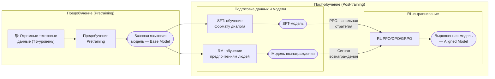
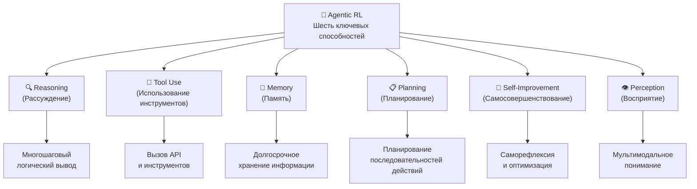
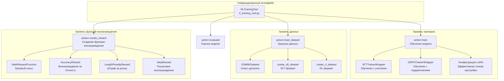
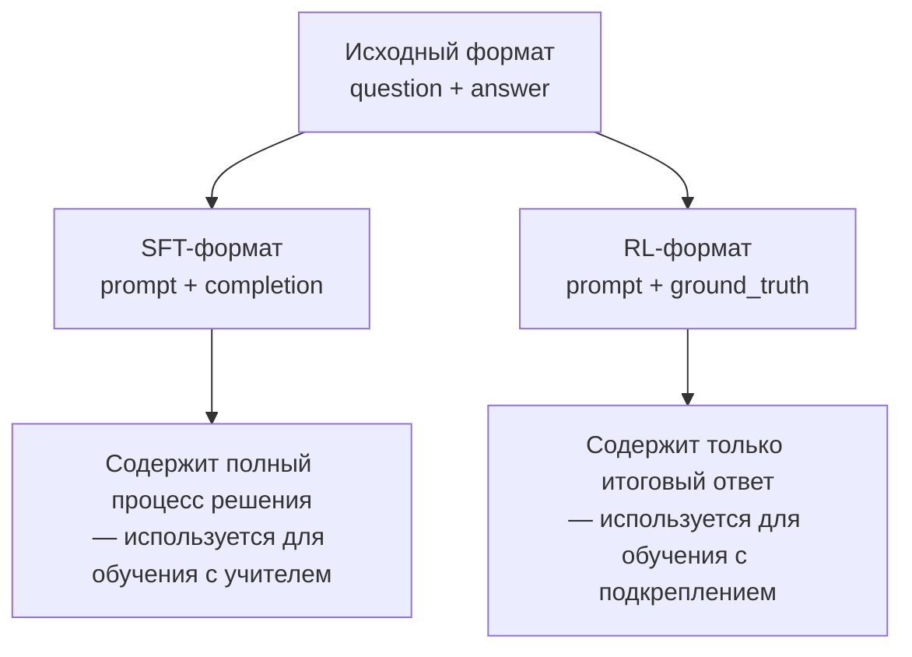
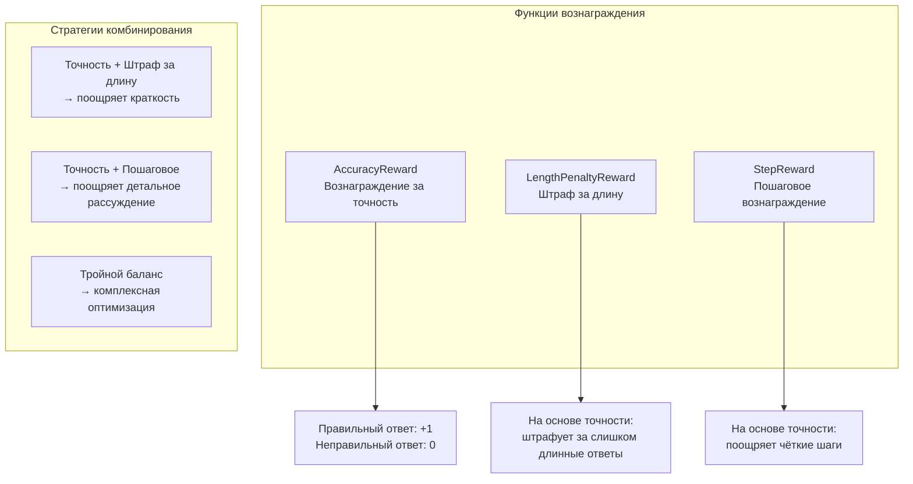
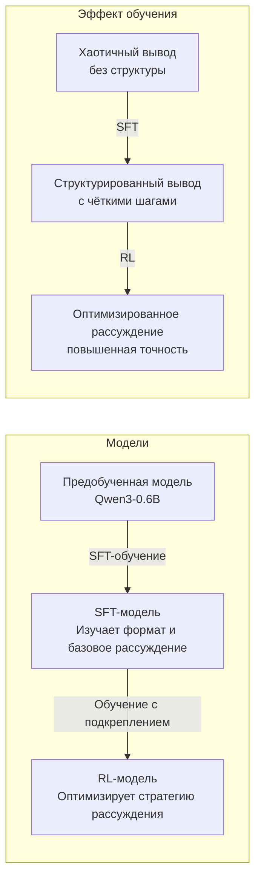
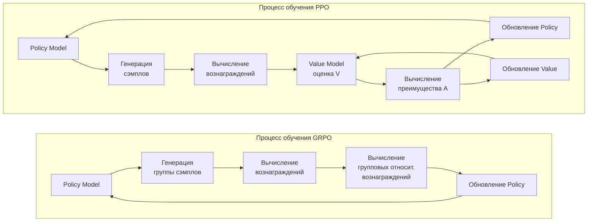
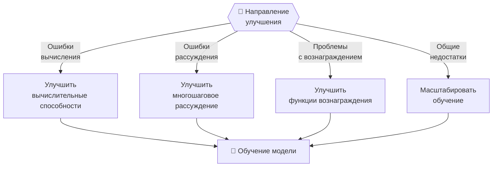
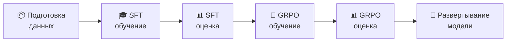

# Глава 11: Agentic-RL

## 11.1 От обучения LLM к Agentic RL

В предыдущих главах мы реализовали различные парадигмы агентов и протоколы коммуникации. Однако при решении сложных задач агенты справляются с ними плохо, что закономерно порождает вопросы: **как сделать агентов с более мощными способностями к рассуждению? Как научить агентов лучше пользоваться инструментами? Как сделать агентов способными к самосовершенствованию?**

Именно эти вопросы является ключевой проблемой, которую призван решить Agentic RL — обучение агентов на основе обучения с подкреплением. В этой главе мы добавим возможности RL-обучения во фреймворк HelloAgents, что позволит вам обучать агентов с продвинутыми способностями: рассуждением и работой с инструментами. Мы начнём с основ обучения LLM и постепенно перейдём к практическим техникам — Supervised Fine-Tuning (SFT) и Group Relative Policy Optimization (GRPO), — завершив всё построением полного пайплайна обучения агента.

### 11.1.1 От обучения с подкреплением к Agentic RL

В разделе 2.4.2 главы 2 мы рассмотрели агентов на основе обучения с подкреплением. Обучение с подкреплением (Reinforcement Learning, RL) — это парадигма обучения, ориентированная на решение задач последовательного принятия решений. Она позволяет максимизировать долгосрочные вознаграждения за счёт прямого взаимодействия агентов со средой — методом «проб и ошибок».

Применим эту схему к LLM-агентам. Рассмотрим агента для решения математических задач, которому нужно ответить на такой вопрос:

```
Вопрос: Утки Джанет несут 16 яиц в день. Каждое утро она съедает три
яйца на завтрак и каждый день печёт кексы для друзей, используя ещё
четыре яйца. Остаток она продаёт на фермерском рынке по $2 за свежее
утиное яйцо. Сколько долларов она зарабатывает на рынке каждый день?
```

Задача требует многошагового рассуждения: сначала вычислить количество оставшихся яиц (16 − 3 − 4 = 9), затем посчитать доход (9 × 2 = 18). Эту задачу можно сопоставить с фреймворком обучения с подкреплением:

- **Агент**: система рассуждений на основе LLM
- **Среда**: математические задачи и система верификации
- **Состояние**: текущее описание задачи и накопленные шаги рассуждения
- **Действие**: генерация следующего шага рассуждения или итогового ответа
- **Вознаграждение**: правильность ответа (правильно +1, неправильно 0)

Традиционные методы обучения с учителем имеют три ключевых ограничения: качество данных полностью определяет качество обучения, и модели могут лишь имитировать обучающие данные, но не превзойти их; отсутствует способность к исследованию — модель пассивно воспроизводит пути, заданные людьми; наконец, сложно оптимизировать долгосрочные цели, так как точно настроить промежуточные шаги многоступенчатого рассуждения затруднительно.

Обучение с подкреплением открывает новые возможности. Позволяя агентам самостоятельно генерировать несколько вариантов ответа и получать вознаграждения по результату, они могут научиться определять, какие пути рассуждения лучше, какие шаги критичны, и даже находить более эффективные методы решения, чем предлагаемые человеческими аннотациями<sup>[8]</sup>. В этом и состоит ключевая идея Agentic RL: рассматривать LLM как обучаемую политику, встроенную в цикл «восприятие — решение — действие» агента, и оптимизировать выполнение многошаговых задач с помощью обучения с подкреплением.

### 11.1.2 Ландшафт обучения LLM

Прежде чем погружаться в Agentic RL, необходимо разобраться в полном процессе обучения LLM. Создание мощной LLM (например, GPT, Claude, Qwen) обычно проходит через два основных этапа: предобучение и пост-обучение. Как показано на рисунке 11.1, эти два этапа составляют полный путь эволюции LLM — от «языковой модели» до «разговорного ассистента».



*Рисунок 11.1 Ландшафт обучения LLM*

**Этап предобучения** — первый этап обучения LLM, цель которого — научить модель базовым языковым паттернам и знаниям о мире. На этом этапе используются огромные массивы текстовых данных (как правило, объёмом в терабайты), а модель обучается методом самообучения: обучающий сигнал конструируется из самого текста, например путём предсказания следующего слова по предыдущему контексту. Наиболее распространённая задача предобучения — каузальное языковое моделирование (Causal Language Modeling), известное также как предсказание следующего токена.

Для текстовой последовательности $x_1, x_2, ..., x_t$ модель должна предсказать следующее слово $x_{t+1}$:

$$
\mathcal{L}_{\text{pretrain}} = -\sum_{t=1}^{T} \log P(x_t | x_1, x_2, ..., x_{t-1}; \theta)
$$

Здесь $\theta$ — параметры модели, $P(x_t | x_1, ..., x_{t-1}; \theta)$ — вероятностное распределение следующего слова, предсказываемого моделью. Цель — минимизировать отрицательное логарифмическое правдоподобие, то есть максимизировать вероятность предсказания правильного слова. Например, при тексте «Кот сидел на» модель должна предсказать, что следующим словом с наибольшей вероятностью является «коврике». Обучаясь на огромных массивах текстов, модель постепенно усваивает грамматические правила (какие последовательности слов допустимы), семантические знания (связи между словами), знания о мире (фактическую информацию о мире) и базовые способности к рассуждению.

Этап предобучения характеризуется: огромным объёмом данных, высокой вычислительной стоимостью, выработкой общих способностей к пониманию и генерации языка, использованием самообучающих целей, построенных на неразмеченных текстах (а не на данных с разметкой для конкретных задач).

**Этап пост-обучения** призван устранить недостатки предобученных моделей. Несмотря на мощные языковые возможности, предобученные модели — лишь модели «предсказания следующего слова». Они не умеют следовать инструкциям человека, давать полезные, безвредные и честные ответы, отказывать в неприемлемых запросах и вести диалог с людьми в разговорном режиме. Этап пост-обучения решает эти проблемы, выравнивая модель с предпочтениями и ценностями человека.

Пост-обучение обычно включает три шага. Первый шаг — **Supervised Fine-Tuning (SFT, тонкая настройка с учителем)**<sup>[15]</sup> — цель которого научить модель следовать инструкциям и форматам диалога. Обучающие данные состоят из пар (запрос, ответ), а цель обучения аналогична предобучению — максимизировать вероятность правильного вывода:

$$
\mathcal{L}_{\text{SFT}} = -\sum_{i=1}^{N} \log P(y_i | x_i; \theta)
$$

Здесь $x_i$ — входной запрос, $y_i$ — ожидаемый ответ, $N$ — количество обучающих примеров. Особенности SFT: небольшой объём данных, требуется ручная разметка, быстрые результаты, основная задача — усвоение форматов и базовых возможностей.

Второй шаг — **Reward Modeling (RM, моделирование вознаграждений)**. Хотя SFT-модели могут следовать инструкциям, качество генерируемых ответов неодинаково. Нужен способ оценивать качество ответов — именно это и делает модель вознаграждения<sup>[13,14]</sup>. Данные для обучения модели вознаграждений состоят из данных о предпочтениях: для каждого вопроса даны два ответа — лучший (chosen) и худший (rejected). Цель обучения модели вознаграждений — усвоить предпочтения человека:

$$
\mathcal{L}_{\text{RM}} = -\mathbb{E}_{(x, y_w, y_l)} [\log \sigma(r_\phi(x, y_w) - r_\phi(x, y_l))]
$$

Здесь $r_\phi(x, y)$ — модель вознаграждения, принимающая пару (запрос, ответ) и возвращающая оценку качества; $y_w$ — лучший ответ, $y_l$ — худший ответ, $\sigma$ — сигмоида. Цель — заставить модель вознаграждения присваивать более высокие баллы лучшим ответам.

Третий шаг — **тонкая настройка с помощью обучения с подкреплением**. Имея модель вознаграждений, мы можем применить обучение с подкреплением для оптимизации языковой модели с целью генерации более качественных ответов. Наиболее классический алгоритм — PPO (Proximal Policy Optimization)<sup>[1]</sup>, с целевой функцией:

$$
J_{\text{PPO}} = \mathbb{E}_{x, y \sim \pi_\theta} [r_\phi(x, y)] - \beta \cdot D_{KL}(\pi_\theta || \pi_{\text{ref}})
$$

Здесь $\pi_\theta$ — текущая политика (языковая модель), $\pi_{\text{ref}}$ — эталонная политика (в данном случае — SFT-модель), $r_\phi(x, y)$ — оценка модели вознаграждений, $D_{KL}$ — KL-дивергенция, предотвращающая слишком сильное отклонение модели, $\beta$ — коэффициент баланса. Смысл этой целевой функции: максимизировать вознаграждение, не отклоняясь слишком далеко от исходной модели.

Традиционный RLHF (Reinforcement Learning from Human Feedback, обучение с подкреплением на основе обратной связи от человека)<sup>[5]</sup> требует большого количества ручной разметки предпочтений, что дорогостояще. Для снижения затрат исследователи предложили RLAIF (Reinforcement Learning from AI Feedback, обучение с подкреплением на основе обратной связи от ИИ)<sup>[7]</sup>, использующий мощные AI-модели (например, GPT-4) вместо людей-разметчиков. Рабочий процесс RLAIF: SFT-модель генерирует несколько вариантов ответа; мощная AI-модель оценивает и ранжирует ответы; оценки AI используются для обучения модели вознаграждений; модель вознаграждений применяется для обучения с подкреплением. Эксперименты показывают, что эффективность RLAIF близка к RLHF или даже превосходит его, при значительно более низких затратах<sup>[11]</sup>.

### 11.1.3 Ключевая философия Agentic RL

Разобравшись с базовым процессом обучения LLM, рассмотрим отличие Agentic RL от традиционных методов. Традиционное пост-обучение (которое мы называем PBRFT: Preference-Based Reinforcement Fine-Tuning) в основном фокусируется на оптимизации качества одношагового диалога: для заданного вопроса пользователя модель генерирует ответ, затем получает вознаграждение в зависимости от его качества. Такой подход подходит для оптимизации разговорных ассистентов, но для агентных задач, требующих многошагового рассуждения, использования инструментов и долгосрочного планирования, он оказывается недостаточным.

**Agentic RL** — новая парадигма, которая рассматривает LLM как обучаемую политику, встроенную в цикл последовательного принятия решений. В этой системе агентам нужно взаимодействовать с внешним миром в динамических средах, выполнять многошаговые действия для решения сложных задач, получать промежуточную обратную связь для управления последующими решениями и оптимизировать долгосрочные накопленные вознаграждения, а не одношаговые.

Разберём это различие на конкретном примере. В сценарии PBRFT пользователь спрашивает «Объясни, что такое обучение с подкреплением»; модель генерирует полный ответ, который затем оценивается напрямую по качеству. В сценарии Agentic RL пользователь просит «Помоги проанализировать качество кода этого репозитория на GitHub», и агент должен пройти несколько шагов: сначала вызвать GitHub API, получить структуру репозитория и список файлов — +0,1 к вознаграждению; затем прочитать основные файлы кода — +0,1; затем провести обоснованный анализ качества кода — +0,2; наконец, сгенерировать качественный отчёт об анализе — +0,6. Итоговое вознаграждение — сумма всех шагов: 1,0.

Ключевые характеристики Agentic RL: многошаговое взаимодействие, каждое действие изменяет состояние среды, на каждом шаге можно получать обратную связь, оптимизация общего качества выполнения задачи.

Обучение с подкреплением обычно формализуется в рамках марковского процесса принятия решений (MDP). MDP определяется пятёркой $(S, A, P, R, \gamma)$: пространство состояний $S$, пространство действий $A$, функция перехода $P(s'|s,a)$, функция вознаграждения $R(s,a)$ и дисконтирующий коэффициент $\gamma$. В таблице 11.1 приведено сравнение PBRFT и Agentic RL с точки зрения MDP.

| Измерение | PBRFT | Agentic RL |
|-----------|-------|------------|
| Состояние | Единственный промпт *s₀* | Динамическая эволюция *sₜ* |
| Действие | Генерация текста | Текст + инструменты + операции со средой |
| Переход | Нет переходов | Состояние меняется вместе с действиями |
| Вознаграждение | Одношаговое *r(s₀, y)* | Накопленное Σₜ γᵗ r(sₜ, aₜ) |
| Время | T = 1 | T ≫ 1 |
| Цель | Краткосрочное качество | Долгосрочный успех |

*Таблица 11.1 Сравнение PBRFT и Agentic RL*

С точки зрения **состояния**: в PBRFT состояние $s_0$ состоит только из запроса пользователя, временной горизонт $T=1$ (один шаг), состояние не меняется: $s_0 = \text{prompt}$. В Agentic RL состояние $s_t$ включает историческое наблюдения и контекст, временной горизонт $T \gg 1$ (множество шагов), состояние эволюционирует с действиями: $s_t = (\text{prompt}, o_1, o_2, ..., o_t)$, где $o_t$ — наблюдение на шаге $t$ (например, результаты вызова инструментов, обратная связь от среды и т. д.).

С точки зрения **действий**: в PBRFT пространство действий включает только генерацию текста, один тип действий: $a = y \sim \pi_\theta(y|s_0)$. В Agentic RL пространство действий включает генерацию текста, вызов инструментов, операции со средой и другие типы: $a_t \in \{a_t^{\text{text}}, a_t^{\text{tool}}\}$, например $a_t^{\text{text}}$ — генерация цепочки рассуждений или ответа, $a_t^{\text{tool}}$ — вызов калькулятора, поисковика и других инструментов.

С точки зрения **функции перехода**: в PBRFT перехода состояния нет: $P(s'|s,a) = \delta(s' - s_{\text{terminal}})$. В Agentic RL состояние динамически меняется в зависимости от действий и среды: $s_{t+1} \sim P(s_{t+1}|s_t, a_t)$, например после вызова инструмента поиска состояние будет включать результаты поиска.

С точки зрения **вознаграждения**: в PBRFT только одношаговое вознаграждение $r(s_0, a)$, выдаваемое лишь в конце задачи: $R_{\text{PBRFT}} = r(s_0, y)$, обычно даваемое моделью вознаграждений: $r(s_0, y) = r_\phi(s_0, y)$. В Agentic RL многошаговые вознаграждения $r(s_t, a_t)$ могут выдаваться на промежуточных шагах:

$$
R_{\text{Agentic}} = \sum_{t=0}^{T} \gamma^t r(s_t, a_t)
$$

Здесь $\gamma \in [0,1]$ — дисконтирующий коэффициент, $r(s_t, a_t)$ может быть разреженным вознаграждением (только при завершении задачи, например, правильный ответ +1), плотным вознаграждением (на каждом шаге, например, успешный вызов инструмента +0,1) или их комбинацией.

С точки зрения **целевой функции**: PBRFT максимизирует ожидаемое одношаговое вознаграждение:

$$
J_{\text{PBRFT}}(\theta) = \mathbb{E}_{s_0, y \sim \pi_\theta} [r(s_0, y)]
$$

Agentic RL максимизирует накопленное дисконтированное вознаграждение:

$$
J_{\text{Agentic}}(\theta) = \mathbb{E}_{\tau \sim \pi_\theta} \left[\sum_{t=0}^{T} \gamma^t r(s_t, a_t)\right]
$$

Здесь $\tau = (s_0, a_0, s_1, a_1, ..., s_T)$ — полная траектория.

Этот переход — не просто разница в технических деталях, а принципиальный сдвиг в мышлении. Мышление PBRFT: «как заставить модель генерировать лучшие одиночные ответы» — оптимизация качества ответа, фокус на языковом выражении, одношаговые решения. Мышление Agentic RL: «как заставить агентов решать сложные задачи» — оптимизация выполнения задачи, фокус на стратегии действий, многошаговое планирование. Этот переход позволяет LLM эволюционировать от «разговорного ассистента» к «автономному агенту», способному активно искать информацию, знать, когда и как использовать внешние инструменты, совершать кажущиеся «обходными» промежуточные шаги ради конечной цели и учиться на ошибках.

Agentic RL стремится наделить LLM-агентов шестью ключевыми способностями, показанными на рисунке 11.2.



*Рисунок 11.2 Шесть ключевых способностей Agentic RL*

**Рассуждение** — процесс логического вывода заключений из данной информации, ключевая способность агентов. Традиционные методы CoT-подсказок опираются на few-shot примеры с ограниченной обобщаемостью; SFT может лишь имитировать паттерны рассуждений из обучающих данных, но не способен к инновациям. Преимущество обучения с подкреплением в том, что оно позволяет обучиться эффективным стратегиям рассуждения методом проб и ошибок, обнаруживать пути рассуждений, которых нет в обучающих данных, учиться понимать, когда нужно глубокое обдумывание, а когда достаточно быстрого ответа. Задачи рассуждения моделируются как задачи последовательного принятия решений: для вопроса $q$ агент должен сгенерировать цепочку рассуждений $c = (c_1, c_2, ..., c_n)$ и итоговый ответ $a$. Функция вознаграждения обычно определяется как $r(q, c, a) = 1$, если $a = a^*$, иначе $0$, с целью обучения $\max_\theta \mathbb{E}_{q, (c,a) \sim \pi_\theta} [r(q, c, a)]$. Таким образом, модель учится генерировать высококачественные цепочки рассуждений, а не просто запоминать ответы.

**Использование инструментов** — способность агента вызывать внешние инструменты для выполнения задач. В задачах работы с инструментами пространство действий расширяется до $a_t \in \{a_t^{\text{think}}, a_t^{\text{tool}}\}$, где $a_t^{\text{think}}$ — генерация мыслительного процесса, $a_t^{\text{tool}} = (\text{tool\_name}, \text{arguments})$ — вызов инструментов. Обучение с подкреплением позволяет агентам научиться определять, когда использовать инструменты, какой инструмент выбрать и как комбинировать несколько инструментов. Например, при решении математических задач агентам нужно научиться: когда пользоваться калькулятором, когда — интерпретатором кода, а когда рассуждать напрямую.

**Память** — способность агента сохранять и использовать прошлую информацию, критически важная для долгосрочных задач. Контекстное окно LLM ограничено, а статические стратегии извлечения (например, RAG) не поддаются оптимизации под задачу. Обучение с подкреплением позволяет агентам научиться управлению памятью: решать, какую информацию стоит запомнить, когда обновлять память и когда удалять устаревшую информацию. Это напоминает рабочую память человека: мы активно управляем информацией в голове, удерживая важное и забывая лишнее.

**Планирование** — способность формировать последовательности действий для достижения целей. Традиционный CoT — линейное мышление без возможности возврата; подсказки используют статические шаблоны планирования, которые сложно адаптировать к новым ситуациям. Обучение с подкреплением позволяет агентам научиться динамическому планированию: обнаруживать эффективные последовательности действий методом проб и ошибок, учиться балансировать краткосрочные и долгосрочные выгоды. Например, в многошаговых задачах агентам может потребоваться сначала выполнить кажущиеся «обходными» шаги — например, собрать информацию, — а затем уже завершить задачу.

**Самосовершенствование** — способность агента анализировать свои выходные данные, исправлять ошибки и оптимизировать стратегии. Обучение с подкреплением позволяет агентам научиться саморефлексии: выявлять собственные ошибки, анализировать причины неудач и корректировать стратегии. Это позволяет агентам непрерывно совершенствоваться без участия человека — подобно принципу «учиться на ошибках».

**Восприятие** — способность понимать мультимодальную информацию. Например, обучение с подкреплением может усилить визуальные способности рассуждения: модели учатся использовать визуальные инструменты и планировать в визуальном пространстве. Это позволяет агентам не только понимать текст, но и воспринимать визуальный мир и действовать в нём.

### 11.1.4 Дизайн Agentic RL во фреймворке HelloAgents

Понимая ключевую философию Agentic RL, рассмотрим, как реализовать эти возможности во фреймворке HelloAgents.

В части технологий мы интегрировали фреймворк TRL (Transformer Reinforcement Learning)<sup>[9]</sup> и выбрали модель Qwen3-0.6B<sup>[10]</sup>. TRL — это библиотека обучения с подкреплением от Hugging Face: зрелая, стабильная, с полным набором функций и удобной интеграцией. Qwen3-0.6B — небольшая языковая модель от Alibaba Cloud: с 0,6 млрд параметров подходит для обучения на обычных GPU, обладает отличными характеристиками, является открытой и бесплатной.

Модуль Agentic RL в HelloAgents использует четырёхуровневую архитектуру, показанную на рисунке 11.3.



*Рисунок 11.3 Архитектура Agentic RL в HelloAgents*

Нижний уровень — **уровень данных (Dataset Layer)**: классы `GSM8KDataset`, функции `create_sft_dataset()` и `create_rl_dataset()`, отвечающие за загрузку данных и преобразование форматов. Второй уровень — **уровень функций вознаграждения (Reward Function Layer)**: базовый класс `MathRewardFunction`, вознаграждение за точность `AccuracyReward`, штраф за длину `LengthPenaltyReward`, пошаговое вознаграждение `StepReward` и удобные функции создания `create_*_reward()`, определяющие, что считается хорошим поведением. Третий уровень — **уровень тренера (Trainer Layer)**: `SFTTrainerWrapper` и `GRPOTrainerWrapper`, отвечающие за конкретную логику обучения и поддержку LoRA. Верхний уровень — **уровень унифицированного интерфейса (Unified Interface Layer)**: единый инструмент обучения `RLTrainingTool`, поддерживающий четыре операции: `action="train"` (обучение модели), `action="load_dataset"` (загрузка датасета), `action="create_reward"` (создание функции вознаграждения), `action="evaluate"` (оценка модели).

### 11.1.5 Пример быстрого старта

Прежде чем углубляться в теорию, давайте быстро познакомимся с полным процессом обучения. Поскольку в этой главе много теоретического содержания, а практическая отладка весьма утомительна, мы фокусируемся на обучении применению, а не на конструировании инструментов. Сначала установите фреймворк HelloAgents:

```bash
# Установка фреймворка HelloAgents (версия главы 11)
pip install "hello-agents[rl]==0.2.5"

# Или установка из исходников
cd HelloAgents
pip install -e ".[rl]"
```

Затем запустите пример быстрого обучения:

```python
import sys
import json

from hello_agents.tools import RLTrainingTool

# Создание инструмента RL-обучения
rl_tool = RLTrainingTool()

# 1. Быстрый тест: SFT-обучение (10 примеров, 1 эпоха)
sft_result_str = rl_tool.run({
    "action": "train",
    "algorithm": "sft",
    "model_name": "Qwen/Qwen3-0.6B",
    "output_dir": "./models/quick_test_sft",
    "max_samples": 10,      # Только 10 примеров для быстрого теста
    "num_epochs": 1,        # Только 1 эпоха
    "batch_size": 2,
    "use_lora": True        # Использовать LoRA для ускорения обучения
})

sft_result = json.loads(sft_result_str)
print(f"\n✓ SFT-обучение завершено, модель сохранена в: {sft_result['output_dir']}")

# 2. GRPO-обучение (5 примеров, 1 эпоха)
grpo_result_str = rl_tool.run({
    "action": "train",
    "algorithm": "grpo",
    "model_name": "Qwen/Qwen3-0.6B",  # Используем базовую модель
    "output_dir": "./models/quick_test_grpo",
    "max_samples": 5,       # Только 5 примеров для быстрого теста
    "num_epochs": 1,
    "batch_size": 2,        # Должно делиться на num_generations(8)
    "use_lora": True
})

grpo_result = json.loads(grpo_result_str)
print(f"\n✓ GRPO-обучение завершено, модель сохранена в: {grpo_result['output_dir']}")

# 3. Оценка модели
eval_result_str = rl_tool.run({
    "action": "evaluate",
    "model_path": "./models/quick_test_grpo",
    "max_samples": 10,      # Оценка на 10 тестовых примерах
    "use_lora": True
})

eval_result = json.loads(eval_result_str)
print(f"\n✓ Оценка завершена:")
print(f"  - Точность: {eval_result['accuracy']}")
print(f"  - Среднее вознаграждение: {eval_result['average_reward']}")
print(f"  - Тестовых примеров: {eval_result['num_samples']}")

print("\n" + "=" * 50)
print("🎉 Поздравляем! Вы обучили свою первую модель Agentic RL!")
print("=" * 50)
print(f"\nПути к моделям:")
print(f"  SFT-модель: {sft_result['output_dir']}")
print(f"  GRPO-модель: {grpo_result['output_dir']}")
```

Этот пример быстрого старта демонстрирует полный процесс обучения: SFT-обучение учит модель базовым форматам рассуждения и диалога; GRPO-обучение оптимизирует стратегии рассуждения с помощью обучения с подкреплением для повышения точности; оценка модели измеряет эффективность обучения на тестовом наборе. Нормально, если точность после выполнения будет очень низкой — ведь модель видела лишь 0,7% обучающих примеров и прошла только одну эпоху.

## 11.2 Датасеты и функции вознаграждения

Датасеты и функции вознаграждения — два краеугольных камня обучения с подкреплением. Датасеты определяют задачи, которым агенту нужно обучиться, а функции вознаграждения определяют, что такое хорошее поведение. В этом разделе мы научимся подготавливать обучающие данные и проектировать функции вознаграждения.

### 11.2.1 Датасет GSM8K для математических рассуждений

Математические рассуждения — идеальная задача для оценки способностей LLM к рассуждению. Во-первых, математические задачи имеют чёткие правильные ответы, которые можно проверить автоматически, без ручной разметки или сложных моделей вознаграждений. Во-вторых, решение математических задач требует декомпозиции и пошаговых вычислений — типичный сценарий многошагового рассуждения. Наконец, усвоенные навыки рассуждения хорошо переносятся на другие области. В отличие от этого, открытые вопросы (например, «Как научиться программировать?») трудно объективно оценить и требуют обширной ручной разметки.

GSM8K (Grade School Math 8K)<sup>[4]</sup> — высококачественный датасет математических задач уровня начальной школы. Как показано в таблице 11.2, датасет содержит 7 473 обучающих примера и 1 319 тестовых, уровень сложности соответствует начальной школе (2–8 классы), тип задач — текстовые задачи, требующие 2–8 шагов рассуждения для получения ответа.

| Характеристика | Значение |
|----------------|----------|
| Размер обучающей выборки | 7 473 задачи |
| Размер тестовой выборки | 1 319 задач |
| Уровень сложности | Начальная школа (2–8 классы) |
| Тип задач | Текстовые задачи (Word problems) |
| Шагов рассуждения | 2–8 шагов |
| Тип ответа | Числовой |

*Таблица 11.2 Статистика датасета GSM8K*

Рассмотрим типичную задачу из GSM8K:

```
Вопрос: В апреле Наталья продала скрепки 48 своим друзьям, а в мае продала
      вдвое меньше скрепок. Сколько скрепок в сумме продала Наталья
      в апреле и мае?

Ответ: В мае Наталья продала 48/2 = <<48/2=24>>24 скрепки.
      В сумме Наталья продала 48+24 = <<48+24=72>>72 скрепки в апреле и мае.
      #### 72

Итоговый ответ: 72
```

Задача требует двух шагов рассуждения: сначала вычислить количество проданных в мае (половина от 48), затем посчитать итог (апрель + май). Маркер `<<48/2=24>>` в ответе обозначает промежуточный шаг вычисления, а `#### 72` — итоговый ответ.

Датасет GSM8K нужно преобразовать в различные форматы для разных методов обучения, как показано на рисунке 11.4.



*Рисунок 11.4 Преобразование форматов данных GSM8K*

**Исходный формат** поступает непосредственно из датасета: содержит вопрос и ответ (с шагами решения), подходит для чтения человеком. **SFT-формат** используется для тонкой настройки с учителем: вопрос преобразуется в prompt в формате диалога, а полное решение — в completion. Например:

```python
{
    "prompt": "<|im_start|>user\nВ апреле Наталья продала скрепки...<|im_end|>\n<|im_start|>assistant\n",
    "completion": "Решим задачу пошагово.\n\nШаг 1: ...\n\nИтоговый ответ: 72<|im_end|>"
}
```

Ключевые моменты: используется шаблон диалога модели (например, маркер `<|im_start|>` для Qwen), prompt содержит вопрос пользователя, completion — полный процесс решения и ответ. Так модель учится правильно форматировать вывод и рассуждать пошагово.

**RL-формат** используется для обучения с подкреплением: предоставляются только вопрос и правильный ответ без процесса решения. Например:

```python
{
    "prompt": "<|im_start|>user\nВ апреле Наталья продала скрепки...<|im_end|>\n<|im_start|>assistant\n",
    "ground_truth": "72"
}
```

Ключевые моменты: prompt тот же, что в SFT, но ground_truth содержит только итоговый ответ (для вычисления вознаграждения), и модель должна самостоятельно генерировать полный процесс рассуждения. Такой дизайн вынуждает модель учиться автономному рассуждению, а не просто запоминать ответы.

Как показано в таблице 11.3, три формата выполняют разные функции.

| Формат | Назначение | Содержимое метки | Особенность |
|--------|------------|-----------------|-------------|
| Исходный | Хранение данных | answer (с шагами) | Читаем человеком |
| SFT | Обучение с учителем | Полный ответ | Изучение формата |
| RL | Обучение с подкреплением | Только ответ | Автономное рассуждение |

*Таблица 11.3 Сравнение форматов данных*

HelloAgents предоставляет удобные функции загрузки датасетов. Загрузим и просмотрим датасет через код:

```python
from hello_agents.tools import RLTrainingTool
import json

# Создаём инструмент
rl_tool = RLTrainingTool()

# 1. Загрузка датасета в SFT-формате
sft_result = rl_tool.run({
    "action": "load_dataset",
    "format": "sft",
    "max_samples": 5  # Загружаем только 5 примеров для просмотра
})
sft_data = json.loads(sft_result)

print(f"Размер датасета: {sft_data['dataset_size']}")
print(f"Формат данных: {sft_data['format']}")
print(f"Ключи примера: {sft_data['sample_keys']}")

# 2. Загрузка датасета в RL-формате
rl_result = rl_tool.run({
    "action": "load_dataset",
    "format": "rl",
    "max_samples": 5
})
rl_data = json.loads(rl_result)

print(f"Размер датасета: {rl_data['dataset_size']}")
print(f"Формат данных: {rl_data['format']}")
print(f"Ключи примера: {rl_data['sample_keys']}")
```

Как видим, SFT-формат содержит полные процессы решения для обучения с учителем; RL-формат — только итоговые ответы, и модели нужно самостоятельно генерировать процесс рассуждения. Параметр `max_samples` контролирует количество загружаемых примеров и удобен для быстрого тестирования.

### 11.2.2 Проектирование функций вознаграждения

Функции вознаграждения — ядро обучения с подкреплением, определяющее, что такое «хорошее поведение». Правильная функция вознаграждения помогает агентам освоить верные стратегии, а неправильная может привести к неудаче обучения или закреплению неверного поведения.

В обучении с подкреплением функция вознаграждения $r(s, a)$ или $r(s, a, s')$ назначает числовое вознаграждение каждому действию агента. Цель агента — максимизировать накопленное вознаграждение:

$$
J(\theta) = \mathbb{E}_{\tau \sim \pi_\theta} \left[\sum_{t=0}^{T} \gamma^t r(s_t, a_t)\right]
$$

Для задач математических рассуждений это упрощается до:

$$
r(q, a) = f(a, a^*)
$$

Здесь $q$ — вопрос, $a$ — ответ, сгенерированный моделью, $a^*$ — правильный ответ, $f$ — функция оценки.

Дизайн функции вознаграждения напрямую влияет на эффективность обучения. Хорошие функции вознаграждения должны чётко определять понятие успеха, обеспечивать градиентный сигнал, не порождать чрезмерной дисперсии, быть удобными для настройки и комбинирования. Плохие функции вознаграждения могут выдавать вознаграждение только в конце задачи без промежуточной обратной связи, порождать «хакинг вознаграждения» (когда агенты находят «читерские» способы получить высокое вознаграждение), иметь взаимоисключающие цели или чрезмерную дисперсию, мешающую сходимости.

HelloAgents предоставляет три встроенных функции вознаграждения, которые можно использовать по отдельности или комбинировать, как показано на рисунке 11.5.



*Рисунок 11.5 Дизайн функций вознаграждения*

**(1) Вознаграждение за точность**

Вознаграждение за точность (AccuracyReward) — наиболее базовая функция вознаграждения, оценивающая только правильность ответа. Математическое определение:

$$
r_{\text{acc}}(a, a^*) = \begin{cases}
1 & \text{если } a = a^* \\
0 & \text{иначе}
\end{cases}
$$

Здесь $a$ — ответ, сгенерированный моделью, $a^*$ — правильный ответ. Это бинарная функция вознаграждения: за правильный ответ — 1, за неправильный — 0.

Реализация требует обработки извлечения и сравнения ответов. Вывод модели может содержать большое количество текста; нужно извлечь итоговый ответ. Распространённые методы извлечения: поиск числа после «Итоговый ответ:», числа после маркера «####», использование регулярных выражений для извлечения последнего числа. При сравнении ответов нужно учитывать числовую точность (72,0 и 72 должны считаться одинаковыми), перевод единиц (1000 и 1k) и различия в формате («72» и «семьдесят два»).

Пример использования:

```python
from hello_agents.tools import RLTrainingTool
import json
rl_tool = RLTrainingTool()

# Создание функции вознаграждения за точность
reward_result = rl_tool.run({
    "action": "create_reward",
    "reward_type": "accuracy"
})
reward_data = json.loads(reward_result)

print(f"Тип вознаграждения: {reward_data['reward_type']}")
print(f"Описание: {reward_data['description']}")

# Примечание: операция create_reward возвращает информацию о конфигурации,
# фактическая функция вознаграждения будет автоматически создана при обучении
```

Вывод:

```json
Prediction: 72, Ground truth: 72, Reward: 1.0
Prediction: 72.0, Ground truth: 72, Reward: 1.0
Prediction: 73, Ground truth: 72, Reward: 0.0
```

Преимущества вознаграждения за точность: просто и понятно, легко реализовать и осмыслить, подходит для задач с чёткими правильными ответами. Недостатки: разреженное вознаграждение — только полностью правильные ответы получают награду; невозможно различить «почти правильно» и «полностью неверно»; в начале обучения может не хватать эффективной обратной связи.

**(2) Штраф за длину**

Штраф за длину (LengthPenaltyReward) поощряет модель генерировать краткие ответы, избегая многословия. Математическое определение:

$$
r_{\text{length}}(a, a^*, l) = r_{\text{acc}}(a, a^*) - \alpha \cdot \max(0, l - l_{\text{target}})
$$

Здесь $l$ — длина сгенерированного текста (в символах или токенах), $l_{\text{target}}$ — целевая длина, $\alpha$ — коэффициент штрафа (по умолчанию 0,001). Штраф за длину применяется только при правильном ответе — чтобы модель не генерировала неправильные короткие ответы ради снижения штрафа.

Логика дизайна: если ответ неправильный — вознаграждение 0 (независимо от длины); если ответ правильный и длина разумная — вознаграждение 1; если ответ правильный, но слишком длинный — вознаграждение $1 - \alpha \cdot (l - l_{\text{target}})$. Например, при целевой длине 200 символов, фактической длине 500 символов и коэффициенте штрафа 0,001 вознаграждение: $1 - 0,001 \times (500 - 200) = 0,7$.

Пример использования:

```python
# Создание функции вознаграждения со штрафом за длину
reward_result = rl_tool.run({
    "action": "create_reward",
    "reward_type": "length_penalty",
    "max_length": 1024,      # Максимальная длина
    "penalty_weight": 0.001  # Вес штрафа
})
reward_data = json.loads(reward_result)

print(f"Тип вознаграждения: {reward_data['reward_type']}")
print(f"Описание: {reward_data['description']}")
print(f"Макс. длина: {reward_data['max_length']}")
print(f"Вес штрафа: {reward_data['penalty_weight']}")
```

Вывод:

```
Prediction: 72, Ground truth: 72, Length: 50, Reward: 1.000
Prediction: 72, Ground truth: 72, Length: 200, Reward: 1.000
Prediction: 72, Ground truth: 72, Length: 500, Reward: 0.700
Prediction: 73, Ground truth: 72, Length: 50, Reward: 0.000
```

Преимущества штрафа за длину: поощряет краткость, предотвращает генерацию лишнего контента, позволяет контролировать стоимость рассуждения (короткий вывод — меньше потребляемых токенов). Недостатки: может подавлять детальное рассуждение, требует тщательной настройки коэффициента штрафа, оптимальная длина сильно варьируется в зависимости от задачи.

**(3) Пошаговое вознаграждение**

Пошаговое вознаграждение (StepReward) поощряет модель генерировать чёткие шаги рассуждения, повышая интерпретируемость. Математическое определение:

$$
r_{\text{step}}(a, a^*, s) = r_{\text{acc}}(a, a^*) + \beta \cdot s
$$

Здесь $s$ — количество обнаруженных шагов рассуждения, $\beta$ — коэффициент пошагового вознаграждения (по умолчанию 0,1). Пошаговые вознаграждения также выдаются только при правильном ответе.

Методы обнаружения шагов: поиск маркеров «Шаг 1:», «Шаг 2:», подсчёт символов новой строки, использование регулярных выражений для сопоставления с шаблонами рассуждения. Например, правильный ответ с тремя чёткими шагами получает вознаграждение $1 + 0,1 \times 3 = 1,3$.

Пример использования:

```python
# Создание функции пошагового вознаграждения
reward_result = rl_tool.run({
    "action": "create_reward",
    "reward_type": "step",
    "step_bonus": 0.1  # 0.1 вознаграждения за каждый шаг
})
reward_data = json.loads(reward_result)

print(f"Тип вознаграждения: {reward_data['reward_type']}")
print(f"Описание: {reward_data['description']}")
print(f"Бонус за шаг: {reward_data['step_bonus']}")
```

Вывод:

```
Prediction: 72, Ground truth: 72, Steps: 0, Reward: 1.00
Prediction: 72, Ground truth: 72, Steps: 2, Reward: 1.20
Prediction: 72, Ground truth: 72, Steps: 5, Reward: 1.50
Prediction: 73, Ground truth: 72, Steps: 5, Reward: 0.00
```

Преимущества пошагового вознаграждения: поощряет интерпретируемое рассуждение, генерируемые ответы легче проверять и отлаживать, помогает модели усвоить систематическое мышление. Недостатки: модель может генерировать лишние шаги ради дополнительных вознаграждений, нужно балансировать количество шагов и качество ответа, обнаружение шагов может быть неточным.

На практике мы обычно комбинируем несколько функций вознаграждения для балансировки разных целей. Распространённые стратегии комбинирования:

**Точность + штраф за длину**: поощряет краткие правильные ответы, подходит для диалоговых систем и систем вопрос-ответ. Формула:

$$
r = r_{\text{acc}} - \alpha \cdot \max(0, l - l_{\text{target}})
$$

**Точность + пошаговое вознаграждение**: поощряет детальный процесс рассуждения, подходит для образовательных сценариев и объяснимого ИИ. Формула:

$$
r = r_{\text{acc}} + \beta \cdot s
$$

**Тройной баланс**: комплексно оптимизирует качество ответа, краткость и интерпретируемость. Формула:

$$
r = r_{\text{acc}} - \alpha \cdot \max(0, l - l_{\text{target}}) + \beta \cdot s
$$

Веса $\alpha$ и $\beta$ требуют тщательной настройки во избежание доминирования одной цели.

Пример использования:

```python
# Комбинированная функция вознаграждения: точность + штраф за длину + пошаговое
# Примечание: RLTrainingTool поддерживает один тип вознаграждения за раз.
# Комбинированные вознаграждения задаются через параметр reward_fn в конфигурации обучения.

# Вознаграждение за точность
accuracy_result = rl_tool.run({
    "action": "create_reward",
    "reward_type": "accuracy"
})
print("Вознаграждение за точность:", json.loads(accuracy_result)['description'])

# Вознаграждение со штрафом за длину
length_result = rl_tool.run({
    "action": "create_reward",
    "reward_type": "length_penalty",
    "max_length": 1024,
    "penalty_weight": 0.001
})
print("Штраф за длину:", json.loads(length_result)['description'])

# Пошаговое вознаграждение
step_result = rl_tool.run({
    "action": "create_reward",
    "reward_type": "step",
    "step_bonus": 0.1
})
print("Пошаговое вознаграждение:", json.loads(step_result)['description'])
```

Вывод:

```
Комбинированное вознаграждение: 1.200
  - Точность: 1.0
  - Штраф за длину: -0.100
  - Пошаговое вознаграждение: +0.3
```

Как показано в таблице 11.4, разные функции вознаграждения подходят для разных сценариев применения.

| Функция вознаграждения | Преимущества | Недостатки | Применение |
|------------------------|-------------|------------|------------|
| Точность (AccuracyReward) | Просто и понятно | Разреженное вознаграждение | Базовое обучение |
| Штраф за длину (LengthPenaltyReward) | Поощряет краткость | Может подавлять рассуждение | Диалоговые системы |
| Пошаговое (StepReward) | Высокая интерпретируемость | Возможна избыточность шагов | Образовательные приложения |
| Комбинированное | Комплексная оптимизация | Сложная настройка | Производственная среда |

*Таблица 11.4 Сравнение функций вознаграждения*

### 11.2.3 Пользовательские датасеты и функции вознаграждения

Хотя HelloAgents предоставляет датасет GSM8K и стандартные функции вознаграждения, на практике может понадобиться использовать собственные датасеты или разрабатывать специфические функции вознаграждения. В этом разделе рассмотрим, как расширить фреймворк.

Прежде чем использовать пользовательские датасеты, нужно понять требования к данным для двух форматов обучения:

**SFT-формат**: для тонкой настройки с учителем, необходимы следующие поля:
- `prompt`: входной запрос (содержит системные и пользовательские сообщения)
- `completion`: ожидаемый вывод
- `text`: полный текст диалога (опционально)

**RL-формат**: для обучения с подкреплением, необходимы следующие поля:
- `question`: исходный вопрос
- `prompt`: входной запрос (содержит системные и пользовательские сообщения)
- `ground_truth`: правильный ответ
- `full_answer`: полный ответ (включая процесс рассуждения)

**(1) Преобразование с помощью format_math_dataset**

Самый простой способ — подготовить сырые данные с полями `question` и `answer`, затем использовать функцию `format_math_dataset()` для автоматического преобразования:

```python
from datasets import Dataset
from hello_agents.rl import format_math_dataset

# 1. Подготовка сырых данных
custom_data = [
    {
        "question": "Сколько будет 2+2?",
        "answer": "2+2=4. #### 4"
    },
    {
        "question": "Сколько будет 5*3?",
        "answer": "5*3=15. #### 15"
    },
    {
        "question": "Сколько будет 10+7?",
        "answer": "10+7=17. #### 17"
    }
]

# 2. Преобразование в объект Dataset
raw_dataset = Dataset.from_list(custom_data)

# 3. Преобразование в SFT-формат
sft_dataset = format_math_dataset(
    dataset=raw_dataset,
    format_type="sft",
    model_name="Qwen/Qwen3-0.6B"
)
print(f"SFT-датасет: {len(sft_dataset)} примеров")
print(f"Поля: {sft_dataset.column_names}")

# 4. Преобразование в RL-формат
rl_dataset = format_math_dataset(
    dataset=raw_dataset,
    format_type="rl",
    model_name="Qwen/Qwen3-0.6B"
)
print(f"RL-датасет: {len(rl_dataset)} примеров")
print(f"Поля: {rl_dataset.column_names}")
```

**(2) Передача пользовательского датасета напрямую**

При использовании RLTrainingTool можно передать пользовательский датасет напрямую через параметр `custom_dataset`:

```python
from hello_agents.tools import RLTrainingTool

rl_tool = RLTrainingTool()

# SFT-обучение
result = rl_tool.run({
    "action": "train",
    "algorithm": "sft",
    "model_name": "Qwen/Qwen3-0.6B",
    "output_dir": "./models/custom_sft",
    "num_epochs": 3,
    "batch_size": 4,
    "use_lora": True,
    "custom_dataset": sft_dataset  # Передаём пользовательский датасет напрямую
})

# GRPO-обучение
result = rl_tool.run({
    "action": "train",
    "algorithm": "grpo",
    "model_name": "Qwen/Qwen3-0.6B",
    "output_dir": "./models/custom_grpo",
    "num_epochs": 2,
    "batch_size": 2,
    "use_lora": True,
    "custom_dataset": rl_dataset  # Передаём пользовательский датасет напрямую
})
```

**(3) Регистрация пользовательского датасета (рекомендуется)**

Для датасетов, которые используются несколько раз, рекомендуется регистрация:

```python
# 1. Регистрация датасета
rl_tool.register_dataset("my_math_dataset", rl_dataset)

# 2. Использование зарегистрированного датасета
result = rl_tool.run({
    "action": "train",
    "algorithm": "grpo",
    "dataset": "my_math_dataset",  # Используем имя зарегистрированного датасета
    "output_dir": "./models/custom_grpo",
    "num_epochs": 2,
    "use_lora": True
})
```

Функции вознаграждения используются для оценки качества ответов, генерируемых моделью. Пользовательские функции вознаграждения должны соответствовать следующей сигнатуре:

```python
from typing import List
import re

def custom_reward_function(
    completions: List[str],
    **kwargs
) -> List[float]:
    """
    Пользовательская функция вознаграждения

    Args:
        completions: Список текстов completion, сгенерированных моделью
        **kwargs: Прочие параметры, обычно включающие:
            - ground_truth: Список правильных ответов
            - Другие поля датасета

    Returns:
        Список значений вознаграждений (каждое в диапазоне 0.0–1.0)
    """
    ground_truths = kwargs.get("ground_truth", [])
    rewards = []

    for completion, truth in zip(completions, ground_truths):
        reward = 0.0

        # Извлечение ответа
        numbers = re.findall(r'-?\d+\.?\d*', completion)
        if numbers:
            try:
                pred = float(numbers[-1])
                truth_num = float(truth)
                error = abs(pred - truth_num)

                # Разные вознаграждения в зависимости от ошибки
                if error < 0.01:
                    reward = 1.0  # Абсолютно верно
                elif error < 1.0:
                    reward = 0.8  # Очень близко
                elif error < 5.0:
                    reward = 0.5  # Близко

                # Бонус за показ шагов рассуждения
                if "step" in completion.lower() or "=" in completion:
                    reward += 0.1

            except ValueError:
                reward = 0.0

        rewards.append(min(reward, 1.0))  # Ограничиваем максимум до 1.0

    return rewards
```

Есть два способа использовать пользовательские функции вознаграждения:

**(1) Передача напрямую**

```python
result = rl_tool.run({
    "action": "train",
    "algorithm": "grpo",
    "model_name": "Qwen/Qwen3-0.6B",
    "output_dir": "./models/custom_grpo",
    "custom_dataset": rl_dataset,
    "custom_reward": custom_reward_function  # Передаём функцию вознаграждения напрямую
})
```

**(2) Регистрация (рекомендуется)**

```python
# 1. Регистрация функции вознаграждения
rl_tool.register_reward_function("my_reward", custom_reward_function)

# 2. Использование зарегистрированной функции
result = rl_tool.run({
    "action": "train",
    "algorithm": "grpo",
    "dataset": "my_math_dataset",
    "output_dir": "./models/custom_grpo"
    # Функция вознаграждения будет автоматически использована из зарегистрированной
})
```

Вот полный пример пользовательского датасета и функции вознаграждения:

```python
from datasets import Dataset
from hello_agents.tools import RLTrainingTool
from hello_agents.rl import format_math_dataset
import re
from typing import List

# 1. Подготовка пользовательских данных
custom_data = [
    {"question": "Сколько будет 2+2?", "answer": "2+2=4. #### 4"},
    {"question": "Сколько будет 5+3?", "answer": "5+3=8. #### 8"},
    {"question": "Сколько будет 10+7?", "answer": "10+7=17. #### 17"}
]

# 2. Преобразование в формат обучения
raw_dataset = Dataset.from_list(custom_data)
rl_dataset = format_math_dataset(raw_dataset, format_type="rl")

# 3. Определение пользовательской функции вознаграждения
def tolerant_reward(completions: List[str], **kwargs) -> List[float]:
    """Функция вознаграждения с допуском на ошибку"""
    ground_truths = kwargs.get("ground_truth", [])
    rewards = []

    for completion, truth in zip(completions, ground_truths):
        numbers = re.findall(r'-?\d+\.?\d*', completion)
        if numbers:
            try:
                pred = float(numbers[-1])
                truth_num = float(truth)
                error = abs(pred - truth_num)

                if error < 0.01:
                    reward = 1.0
                elif error < 5.0:
                    reward = 0.5
                else:
                    reward = 0.0
            except ValueError:
                reward = 0.0
        else:
            reward = 0.0

        rewards.append(reward)

    return rewards

# 4. Создание инструмента и регистрация
rl_tool = RLTrainingTool()
rl_tool.register_dataset("my_dataset", rl_dataset)
rl_tool.register_reward_function("my_dataset", tolerant_reward)

# 5. Обучение
result = rl_tool.run({
    "action": "train",
    "algorithm": "grpo",
    "model_name": "Qwen/Qwen3-0.6B",
    "dataset": "my_dataset",
    "output_dir": "./models/custom_grpo",
    "num_epochs": 2,
    "batch_size": 2,
    "use_lora": True
})
```

## 11.3 SFT-обучение

Supervised Fine-Tuning (SFT, тонкая настройка с учителем) — первый шаг обучения с подкреплением и важнейшая основа. SFT позволяет модели усвоить базовый формат задач, паттерны диалога и начальные способности к рассуждению. Без фундамента SFT прямое обучение с подкреплением нередко заканчивается неудачей — ведь модель не знает даже базового формата вывода.

### 11.3.1 Зачем нужен SFT

Перед запуском обучения с подкреплением необходимо сначала провести SFT-обучение. Дело в том, что, несмотря на мощные языковые возможности, предобученные модели не умеют выполнять конкретные задачи. Целевая функция предобученных моделей — предсказывать следующее слово, а не решать математические задачи или пользоваться инструментами. Вывод предобученных моделей — свободный текст, тогда как нам нужен структурированный (например, «Шаг 1: ..., Шаг 2: ..., Итоговый ответ: ...»). Предобученные модели не видели данных, связанных с задачей, и не знают, что такое «хороший» процесс рассуждения.

Роль SFT — обучить модель базовым правилам задачи. Во-первых, усвоить формат вывода, то есть научить модель структурировать ответы (использовать маркеры «Шаг 1», «Итоговый ответ»). Во-вторых, усвоить паттерны рассуждения — обучиться на примерах декомпозиции задач и пошаговым выводам. В-третьих, установить базовый уровень возможностей, обеспечив разумную отправную точку для последующего обучения с подкреплением. Наконец, сократить пространство исследования — обучение с подкреплением не начинает с нуля, а оптимизирует на основе SFT.

Разберём важность SFT на сравнительном эксперименте. Предположим, мы сразу используем предобученную модель для решения задач GSM8K:

```python
from transformers import AutoTokenizer, AutoModelForCausalLM

# Загружаем предобученную модель
model_name = "Qwen/Qwen3-0.6B"
tokenizer = AutoTokenizer.from_pretrained(model_name)
model = AutoModelForCausalLM.from_pretrained(model_name)

# Тестовый вопрос
question = """В апреле Наталья продала скрепки 48 своим друзьям, а в мае продала
вдвое меньше скрепок. Сколько скрепок в сумме продала Наталья в апреле и мае?"""

# Формируем входные данные
prompt = f"<|im_start|>user\n{question}<|im_end|>\n<|im_start|>assistant\n"
inputs = tokenizer(prompt, return_tensors="pt")

# Генерируем ответ
outputs = model.generate(**inputs, max_new_tokens=200)
response = tokenizer.decode(outputs[0], skip_special_tokens=False)

print("Ответ предобученной модели:")
print(response)
```

Вывод предобученной модели может выглядеть так:

```bash
<|im_start|>user
В апреле Наталья продала скрепки 48 своим друзьям, а в мае продала вдвое меньше...
<|im_end|>
<|im_start|>assistant
Могу помочь с этим. Позвольте подумать над задачей. Наталья продавала скрепки друзьям.
В апреле она продала 48 штук. В мае — вдвое меньше. Нужно выяснить, сколько она
продала в мае, и сложить. Но я не уверен, как вычислить половину от 48. Может,
воспользоваться калькулятором? Или просто оценить примерно...
```

Видно, что предобученная модель понимает вопрос, но вывод очень многословен, не структурирован, не содержит чёткого ответа, а процесс рассуждения запутан. Такой вывод нельзя использовать для обучения с подкреплением: из него нельзя извлечь ответ, невозможно оценить качество и обеспечить эффективный сигнал вознаграждения.

Теперь посмотрим на модель после SFT:

```python
# Загружаем SFT-модель (предполагаем, что уже обучена)
sft_model_path = "./models/sft_model"
sft_model = AutoModelForCausalLM.from_pretrained(sft_model_path)

# Используем тот же вопрос
outputs = sft_model.generate(**inputs, max_new_tokens=200)
response = tokenizer.decode(outputs[0], skip_special_tokens=False)

print("Ответ SFT-модели:")
print(response)
```

Вывод SFT-модели:

```bash
<|im_start|>user
В апреле Наталья продала скрепки 48 своим друзьям...<|im_end|>
<|im_start|>assistant
Решим задачу пошагово.

Шаг 1: Вычислим количество скрепок, проданных в мае
В мае Наталья продала вдвое меньше, чем в апреле.
Скрепки в мае = 48 / 2 = 24

Шаг 2: Вычислим общее количество скрепок
Итого = апрель + май = 48 + 24 = 72

Итоговый ответ: 72<|im_end|>
```

Видно, что вывод SFT-модели имеет чёткую структуру (маркеры «Шаг 1», «Шаг 2», «Итоговый ответ»), правильное рассуждение, чёткий ответ и унифицированный формат. Такой вывод можно использовать для обучения с подкреплением: из него можно извлечь ответ, вычислить вознаграждение и оптимизировать стратегию.

Как показано на рисунке 11.6, SFT — это мост от предобученных моделей к обучению с подкреплением.



*Рисунок 11.6 Роль SFT в пайплайне обучения*

### 11.3.2 LoRA: параметрически эффективная тонкая настройка

Полная тонкая настройка всей модели требует значительных вычислительных ресурсов и памяти. Для Qwen3-0.6B (0,6 млрд параметров) полная настройка требует около 12 ГБ памяти (FP16) или 24 ГБ (FP32). Для более крупных моделей (7B, 13B) полная настройка практически невозможна на потребительских GPU.

LoRA (Low-Rank Adaptation)<sup>[3]</sup> — это метод параметрически эффективной тонкой настройки, при котором обучается лишь небольшое количество дополнительных параметров при замороженных исходных. Ключевая идея LoRA: изменения параметров при тонкой настройке модели можно представить матрицами низкого ранга.

Пусть исходная весовая матрица модели $W \in \mathbb{R}^{d \times k}$, а настроенные веса $W' = W + \Delta W$. LoRA предполагает, что $\Delta W$ разлагается в произведение двух матриц низкого ранга:

$$
\Delta W = BA
$$

Где $B \in \mathbb{R}^{d \times r}$, $A \in \mathbb{R}^{r \times k}$, $r \ll \min(d, k)$ — ранг.

При прямом проходе вывод:

$$
h = Wx + \Delta Wx = Wx + BAx
$$

Исходные параметры модели $W$ заморожены, обучаются только $B$ и $A$.

Сравнение числа параметров: исходная модель — $d \times k$ параметров, LoRA — $d \times r + r \times k = r(d + k)$ параметров. При $r \ll \min(d, k)$ число параметров LoRA намного меньше. Например, при $d=4096, k=4096, r=8$: исходная модель — $4096 \times 4096 = 16\,777\,216$ параметров, LoRA — $8 \times (4096 + 4096) = 65\,536$ параметров — сокращение в 256 раз!

Преимущества LoRA: значительно меньший расход памяти, более высокая скорость обучения, простое развёртывание и предотвращение переобучения. Однако эффективность обучения, как правило, несколько ниже, чем при полной настройке параметров.

Как показано в таблице 11.5, сравнение эффекта LoRA при разных масштабах модели.

| Модель | Полные параметры | Параметры LoRA (r=8) | Видеопамять (полная) | Видеопамять (LoRA) |
|--------|-----------------|----------------------|---------------------|-------------------|
| Qwen3-0.6B | 0.6B | 2.4M | 12 ГБ | 4 ГБ |
| Qwen3-1.5B | 1.5B | 6.0M | 24 ГБ | 8 ГБ |
| Qwen3-7B | 7B | 28M | 112 ГБ | 28 ГБ |

*Таблица 11.5 Сравнение LoRA и полной тонкой настройки*

Ключевые гиперпараметры LoRA: **ранг (r)** — управляет рангом матриц LoRA; чем больше, тем выше выразительность, но и больше параметров; типичные значения 4–64, по умолчанию 8. **Alpha ($\alpha$)** — коэффициент масштабирования LoRA; фактическое обновление $\Delta W = \frac{\alpha}{r} BA$, управляет силой влияния LoRA; типичное значение равно рангу. **target_modules** — задаёт, к каким слоям применяется LoRA; обычно выбираются слои внимания (q_proj, k_proj, v_proj, o_proj), возможно также включение слоёв MLP (gate_proj, up_proj, down_proj).

### 11.3.3 Практика SFT-обучения

Проведём SFT-обучение с помощью HelloAgents. Полный процесс включает: подготовку датасета, настройку LoRA, установку параметров обучения, запуск обучения и сохранение модели.

Базовый пример обучения:

```python
from hello_agents.tools import RLTrainingTool

# Создаём инструмент обучения
rl_tool = RLTrainingTool()

# SFT-обучение
result = rl_tool.run({
    # Конфигурация обучения
    "action": "train",
    "algorithm": "sft",

    # Конфигурация модели
    "model_name": "Qwen/Qwen3-0.6B",
    "output_dir": "./models/sft_model",

    # Конфигурация данных
    "max_samples": 100,     # Используем 100 примеров для быстрого теста

    # Параметры обучения
    "num_epochs": 3,        # 3 эпохи
    "batch_size": 4,        # Размер батча
    "learning_rate": 5e-5,  # Скорость обучения

    # Конфигурация LoRA
    "use_lora": True,       # Использовать LoRA
    "lora_rank": 8,         # Ранг LoRA
    "lora_alpha": 16,       # Alpha LoRA
})

print(f"\n✓ Обучение завершено!")
print(f"  - Путь сохранения модели: {result['model_path']}")
print(f"  - Обучающих примеров: {result['num_samples']}")
print(f"  - Эпох обучения: {result['num_epochs']}")
print(f"  - Итоговый loss: {result['final_loss']:.4f}")
```

Если loss постепенно снижается в процессе обучения — модель обучается нормально.

**(1) Подробно о параметрах обучения**

Разберём значение каждого параметра и рекомендации по настройке.

**Параметры данных**:

- `max_samples`: Количество обучающих примеров. Для быстрого тестирования — 100–1000 примеров; для полного обучения рекомендуется использовать все данные (7473 примера). Больше данных обычно даёт лучший результат, но и обучение занимает больше времени.
- `split`: Разбивка датасета, по умолчанию «train». Можно задать «train[:1000]» для использования только первых 1000 примеров.

**Параметры обучения**:

- `num_epochs`: Количество эпох. 1 эпоха — один полный проход по датасету. Слишком мало (1–2 эпохи) может привести к недообучению, слишком много (>10) — к переобучению. Рекомендуется начинать с 3 эпох, отслеживать кривую loss и корректировать.
- `batch_size`: Количество примеров на одно обновление. Больше — стабильнее, но требует больше памяти. Рекомендуется подбирать под доступную память: 4 ГБ → batch_size=1–2, 8 ГБ → 4–8, 16 ГБ → 8–16.
- `learning_rate`: Скорость обучения, управляет шагом обновления параметров. Слишком маленькая (1e-6) — медленная сходимость, слишком большая (1e-3) — возможна расходимость. Для SFT рекомендуется 5e-5, для LoRA можно немного увеличить (1e-4).

**Параметры LoRA**:

- `use_lora`: Использовать ли LoRA. Рекомендуется всегда включать, если нет достаточного объёма памяти.
- `lora_rank`: Ранг LoRA, управляет выразительностью. 4–8 подходит для небольших задач, 16–32 — для сложных, 64 — для крупномасштабной тонкой настройки.
- `lora_alpha`: Коэффициент масштабирования LoRA, обычно устанавливается в 2 раза больше ранга. При rank=8, alpha=16; при rank=16, alpha=32.

**Параметры оптимизатора**:

- `optimizer`: Тип оптимизатора, по умолчанию «adamw». AdamW — наиболее распространённый выбор; можно попробовать «sgd» или «adafactor».
- `weight_decay`: Затухание весов, предотвращает переобучение. По умолчанию 0,01, можно попробовать 0,001–0,1.
- `warmup_ratio`: Доля шагов для прогрева скорости обучения. В первые warmup_ratio шагов скорость линейно растёт, затем линейно убывает. По умолчанию 0,1 (прогрев на первых 10% шагов).

**(2) Полный пример обучения**

Проведём полное SFT-обучение на всех данных с применением лучших практик:

```python
from hello_agents.tools import RLTrainingTool

rl_tool = RLTrainingTool()

# Полное SFT-обучение
result = rl_tool.run({
    "action": "train",
    "algorithm": "sft",

    # Конфигурация модели
    "model_name": "Qwen/Qwen3-0.6B",
    "output_dir": "./models/sft_full",

    # Конфигурация данных
    "max_samples": None,    # Используем все данные (7473 примера)

    # Параметры обучения
    "num_epochs": 3,
    "batch_size": 8,
    "learning_rate": 5e-5,
    "warmup_ratio": 0.1,
    "weight_decay": 0.01,

    # Конфигурация LoRA
    "use_lora": True,
    "lora_rank": 16,        # Используем больший ранг
    "lora_alpha": 32,
    "lora_target_modules": ["q_proj", "k_proj", "v_proj", "o_proj"],

    # Прочие настройки
    "save_steps": 500,      # Сохранение каждые 500 шагов
    "logging_steps": 100,   # Логирование каждые 100 шагов
    "eval_steps": 500,      # Оценка каждые 500 шагов
})

print(f"Обучение завершено! Модель сохранена в: {result['model_path']}")
```

Эта конфигурация подходит для обучения на GPU с 8 ГБ памяти; ориентировочное время — 30–60 минут.

**(3) Мониторинг и отладка обучения**

В процессе обучения нужно отслеживать три ключевых метрики. **Loss** должен постепенно снижаться; если не снижается — возможно, слишком маленькая скорость обучения или проблемы с данными; если снижается, а затем растёт — слишком большая скорость обучения или переобучение. **Норма градиента** должна оставаться в разумном диапазоне 0,1–10; слишком большая (>100) указывает на взрыв градиента — нужно снизить скорость обучения; слишком маленькая (<0,01) — на затухание градиента, следует проверить конфигурацию модели. **Скорость обучения** должна изменяться согласно стратегии прогрева: линейно расти в первые 10% шагов, затем линейно снижаться до 0.

Типичные проблемы и решения: при нехватке памяти — уменьшить batch_size или max_length, использовать накопление градиентов или модель меньшего размера; при медленном обучении — увеличить batch_size, снизить частоту логирования или использовать обучение в смешанной точности; при непадающем loss — увеличить скорость обучения, проверить формат данных или добавить эпохи; при переобучении — увеличить weight_decay, уменьшить число эпох или добавить данных.

### 11.3.4 Оценка модели

После завершения обучения необходимо оценить его эффективность. Метрики оценки:

- **Точность**: доля полностью правильных ответов, наиболее прямой показатель, диапазон 0–1, чем больше — тем лучше.
- **Среднее вознаграждение**: среднее вознаграждение по всем примерам, комплексно учитывающее точность, длину, шаги и другие факторы; диапазон зависит от дизайна функции вознаграждения.
- **Качество рассуждений**: чёткость и логичность процесса рассуждения; требует ручной оценки или специализированных моделей.

Оценка моделей с помощью HelloAgents:

```python
from hello_agents.tools import RLTrainingTool

rl_tool = RLTrainingTool()

# Оценка SFT-модели
eval_result = rl_tool.run({
    "action": "evaluate",
    "model_path": "./models/sft_full",
    "max_samples": 100,     # Оцениваем на 100 тестовых примерах
    "use_lora": True,
})

eval_data = json.loads(eval_result)
print(f"\nРезультаты оценки:")
print(f"  - Точность: {eval_data['accuracy']}")
print(f"  - Среднее вознаграждение: {eval_data['average_reward']}")
print(f"  - Тестовых примеров: {eval_data['num_samples']}")
```

Для небольших моделей вроде Qwen3-0.6B нормальная точность на GSM8K после SFT — 40–50%. С помощью обучения с подкреплением её можно поднять до 60–70%.

Для лучшего понимания эффекта SFT сравним модели на разных этапах:

```python
# Оценка предобученной модели (без SFT)
base_result = rl_tool.run({
    "action": "evaluate",
    "model_path": "Qwen/Qwen3-0.6B",
    "max_samples": 100,
    "use_lora": False,
})
base_data = json.loads(base_result)

# Оценка SFT-модели
sft_result = rl_tool.run({
    "action": "evaluate",
    "model_path": "./models/sft_full",
    "max_samples": 100,
    "use_lora": True,
})
sft_data = json.loads(sft_result)

# Сравнение результатов
print("Сравнение моделей:")
print(f"Точность предобученной модели: {base_data['accuracy']}")
print(f"Точность SFT-модели: {sft_data['accuracy']}")
```

В этом разделе мы изучили: важность SFT (обучение формату, установка базового уровня), принципы LoRA (разложение низкого ранга, эффективность параметров), практику SFT-обучения (конфигурация параметров, мониторинг) и оценку модели (точность, сравнительный анализ).

## 11.4 GRPO-обучение

После завершения SFT-обучения мы получаем модель, способную генерировать структурированные ответы. Однако SFT-модель лишь «имитирует» процесс рассуждения из обучающих данных и не научилась по-настоящему «думать». Обучение с подкреплением позволяет модели оптимизировать стратегии рассуждения методом проб и ошибок, превосходя тем самым качество обучающих данных.

### 11.4.1 От PPO к GRPO

В области обучения с подкреплением PPO (Proximal Policy Optimization)<sup>[1]</sup> — один из наиболее классических алгоритмов. PPO обеспечивает стабильность обучения, ограничивая величину обновлений политики. Однако PPO имеет ряд проблем при обучении LLM: требует обучения модели ценности (Value Model), что усложняет процесс и увеличивает расход памяти; необходимо одновременно поддерживать четыре модели (Policy Model, Reference Model, Value Model, Reward Model), что усложняет инженерную реализацию; обучение нестабильно — возможен коллапс вознаграждения или деградация политики.

GRPO (Group Relative Policy Optimization)<sup>[2]</sup> — упрощённый вариант PPO, специально разработанный для LLM. Ключевая идея GRPO: не нужна модель ценности — вместо неё используются групповые относительные вознаграждения; упрощённый процесс обучения, требующий только Policy Model и Reference Model; повышенная стабильность обучения, снижающая риск коллапса вознаграждения.

Разберём принципы GRPO через математические формулы. Целевая функция PPO:

$$
J_{\text{PPO}}(\theta) = \mathbb{E}_{s,a \sim \pi_\theta} \left[ \min\left( \frac{\pi_\theta(a|s)}{\pi_{\text{old}}(a|s)} A(s,a), \text{clip}\left(\frac{\pi_\theta(a|s)}{\pi_{\text{old}}(a|s)}, 1-\epsilon, 1+\epsilon\right) A(s,a) \right) \right]
$$

Где $A(s,a)$ — функция преимущества, требующая оценки через Value Model:

$$
A(s,a) = Q(s,a) - V(s) = r(s,a) + \gamma V(s') - V(s)
$$

Целевая функция GRPO упрощается до:

$$
J_{\text{GRPO}}(\theta) = \mathbb{E}_{s,a \sim \pi_\theta} \left[ \frac{\pi_\theta(a|s)}{\pi_{\text{ref}}(a|s)} \cdot (r(s,a) - \bar{r}_{\text{group}}) \right] - \beta \cdot D_{KL}(\pi_\theta || \pi_{\text{ref}})
$$

Где $\bar{r}_{\text{group}}$ — среднее вознаграждение группы, $\beta$ — коэффициент штрафа KL-дивергенции. Ключевые отличия: GRPO использует $r(s,a) - \bar{r}_{\text{group}}$ вместо функции преимущества $A(s,a)$ — без нужды в Value Model; использует групповые относительные вознаграждения, снижая дисперсию; добавляет штраф KL-дивергенции, предотвращая слишком сильное отклонение политики.

Как показано на рисунке 11.7, сравнение процессов обучения PPO и GRPO.



*Рисунок 11.7 Сравнение процессов обучения PPO и GRPO*

Видно, что GRPO исключает обучение Value Model, существенно упрощая процесс.

Как показано в таблице 11.6, подробное сравнение PPO и GRPO.

| Измерение | PPO | GRPO |
|-----------|-----|------|
| Количество моделей | 4 (Policy, Ref, Value, Reward) | 2 (Policy, Ref) |
| Оценка преимущества | Value Model | Групповые относительные вознаграждения |
| Потребление видеопамяти | Высокое (требует Value Model) | Низкое (без Value Model) |
| Стабильность обучения | Средняя | Достаточно высокая |
| Сложность реализации | Высокая | Низкая |
| Область применения | Универсальный RL | Дообучение LLM |

*Таблица 11.6 Сравнение PPO и GRPO*

Для обучения LLM GRPO является лучшим выбором: он проще, стабильнее и потребляет меньше памяти.

### 11.4.2 Практика GRPO-обучения

Проведём GRPO-обучение с помощью HelloAgents. Предварительное условие — завершённое SFT-обучение, поскольку GRPO требует разумной начальной политики.

Базовый пример GRPO-обучения:

```python
from hello_agents.tools import RLTrainingTool

# Создаём инструмент обучения
rl_tool = RLTrainingTool()

# GRPO-обучение
result = rl_tool.run({
    # Конфигурация обучения
    "action": "train",
    "algorithm": "grpo",

    # Конфигурация модели
    "model_name": "./models/sft_full",  # Начинаем с SFT-модели
    "output_dir": "./models/grpo_model",

    # Конфигурация данных
    "max_samples": 100,     # 100 примеров для быстрого теста

    # Параметры обучения
    "num_epochs": 3,
    "batch_size": 4,
    "learning_rate": 1e-5,  # Скорость обучения GRPO обычно меньше, чем у SFT

    # Специфические параметры GRPO
    "num_generations": 4,   # Генерировать 4 ответа на вопрос
    "kl_coef": 0.05,        # Коэффициент штрафа KL-дивергенции

    # Конфигурация LoRA
    "use_lora": True,
    "lora_rank": 16,
    "lora_alpha": 32,

    # Конфигурация функции вознаграждения
    "reward_type": "accuracy",  # Используем вознаграждение за точность
})

print(f"\n✓ Обучение завершено!")
print(f"  - Путь сохранения модели: {result['model_path']}")
print(f"  - Обучающих примеров: {result['num_samples']}")
print(f"  - Эпох обучения: {result['num_epochs']}")
print(f"  - Среднее вознаграждение: {result['average_reward']:.4f}")
```

Если в процессе GRPO-обучения среднее вознаграждение постепенно растёт, а KL-дивергенция остаётся в разумных пределах — обучение идёт нормально.

У GRPO есть ряд специфических параметров, которые нужно понять и настроить.

**Параметры генерации**:

- `num_generations`: Количество генерируемых ответов на вопрос. Больше — лучше, но вычислительная стоимость также выше. Типичные значения 4–8. Цель генерации нескольких ответов — вычисление групповых относительных вознаграждений и повышение разнообразия обучающих сигналов.
- `max_new_tokens`: Максимальное число токенов на ответ. Слишком маленькое — ответ будет усечён, слишком большое — лишние вычисления. Рекомендуется 256–512.
- `temperature`: Температура генерации, управляет случайностью. 0 — жадное декодирование, 1 — стандартная выборка. Для GRPO рекомендуется 0,7–1,0 для сохранения исследовательского поведения.

**Параметры оптимизации**:

- `learning_rate`: Скорость обучения GRPO обычно меньше, чем у SFT — чтобы не уходить слишком далеко от SFT-модели. Рекомендуется 1e-5 до 5e-5.
- `kl_coef`: Коэффициент штрафа KL-дивергенции, управляет величиной обновлений политики. Слишком маленький (0,01) — политика может уйти слишком далеко; слишком большой (0,5) — ограничивает обучение. Рекомендуется 0,05–0,1.
- `clip_range`: Диапазон обрезки соотношения политик, аналог epsilon в PPO. Рекомендуется 0,2.

**Параметры вознаграждения**:

- `reward_type`: Тип функции вознаграждения: «accuracy», «length_penalty», «step» или «combined».
- `reward_config`: Дополнительная конфигурация функции вознаграждения, например целевая длина для штрафа за длину, коэффициент для пошагового вознаграждения и т. д.

Проведём полное GRPO-обучение на всех данных с лучшими практиками:

```python
from hello_agents.tools import RLTrainingTool

rl_tool = RLTrainingTool()

# Полное GRPO-обучение
result = rl_tool.run({
    "action": "train",
    "algorithm": "grpo",

    # Конфигурация модели
    "model_name": "./models/sft_full",
    "output_dir": "./models/grpo_full",

    # Конфигурация данных
    "max_samples": None,    # Используем все данные

    # Параметры обучения
    "num_epochs": 3,
    "batch_size": 4,
    "learning_rate": 1e-5,
    "warmup_ratio": 0.1,

    # Специфические параметры GRPO
    "num_generations": 4,
    "max_new_tokens": 512,
    "temperature": 0.8,
    "kl_coef": 0.05,
    "clip_range": 0.2,

    # Конфигурация LoRA
    "use_lora": True,
    "lora_rank": 16,
    "lora_alpha": 32,

    # Конфигурация функции вознаграждения
    "reward_type": "combined",
    "reward_config": {
        "components": [
            {"type": "accuracy", "weight": 1.0},
            {"type": "length_penalty", "weight": 0.5, "target_length": 200},
            {"type": "step", "weight": 0.3, "step_bonus": 0.1}
        ]
    },

    # Прочие настройки
    "save_steps": 500,
    "logging_steps": 100,
})

print(f"Обучение завершено! Модель сохранена в: {result['model_path']}")
```

### 11.4.3 Анализ процесса GRPO-обучения

Разберём процесс GRPO-обучения детально, чтобы понять, что происходит на каждом шаге.

**(1) Цикл обучения**

Цикл обучения GRPO включает следующие шаги:

1. **Фаза выборки**: для каждого вопроса используем текущую политику для генерации нескольких ответов (`num_generations`). Эти ответы образуют «группу» для вычисления относительных вознаграждений.

2. **Вычисление вознаграждений**: вычисляем вознаграждение $r_i$ для каждого сгенерированного ответа. Вознаграждения могут быть за точность, штраф за длину, пошаговыми или их комбинацией.

3. **Относительное вознаграждение**: вычисляем среднее вознаграждение группы $\bar{r} = \frac{1}{N}\sum_{i=1}^{N} r_i$, затем относительное вознаграждение $\hat{r}_i = r_i - \bar{r}$. Преимущество: снижение дисперсии вознаграждений, более стабильное обучение.

4. **Обновление политики**: используем относительные вознаграждения для обновления политики, добавляя штраф KL-дивергенции во избежание слишком сильного отклонения от референсной модели.

5. **Повторение**: повторяем описанные шаги до завершения всех эпох обучения.

Разберём на конкретном примере:

```python
# Предположим, у нас есть вопрос
question = "Сколько будет 48 + 24?"

# Генерируем 4 ответа
answers = [
    "48 + 24 = 72. Итоговый ответ: 72",         # Правильно
    "48 + 24 = 72. Итоговый ответ: 72",         # Правильно
    "48 + 24 = 70. Итоговый ответ: 70",         # Неправильно
    "Дайте подумаю... 72. Итоговый ответ: 72"   # Правильно, но многословно
]

# Вычисляем вознаграждения (точность + штраф за длину)
rewards = [1.0, 1.0, 0.0, 0.8]  # 4-й ответ штрафуется за многословие

# Вычисляем среднее вознаграждение группы
avg_reward = (1.0 + 1.0 + 0.0 + 0.8) / 4  # = 0.7

# Вычисляем относительные вознаграждения
relative_rewards = [
    1.0 - 0.7,  # = 0.3  — правильно и кратко, положительное
    1.0 - 0.7,  # = 0.3  — правильно и кратко, положительное
    0.0 - 0.7,  # = -0.7 — неправильно, отрицательное
    0.8 - 0.7   # = 0.1  — правильно, но многословно, небольшое
]

# Обновление политики: повышаем вероятность первых двух ответов,
# понижаем вероятность третьего
```

Механизм относительного вознаграждения побуждает модель генерировать ответы «лучше среднего», а не просто стремиться к максимальному вознаграждению. Это снижает дисперсию и улучшает стабильность обучения.

**(2) Штраф KL-дивергенции**

Штраф KL-дивергенции — ключевой компонент GRPO, предотвращающий слишком сильное отклонение политики от референсной модели. KL-дивергенция определяется как:

$$
D_{KL}(\pi_\theta || \pi_{\text{ref}}) = \mathbb{E}_{s,a \sim \pi_\theta} \left[ \log \frac{\pi_\theta(a|s)}{\pi_{\text{ref}}(a|s)} \right]
$$

На практике KL-дивергенция вычисляется для каждого токена, затем суммируется:

$$
D_{KL} = \sum_{t=1}^{T} \log \frac{\pi_\theta(a_t|s, a_{<t})}{\pi_{\text{ref}}(a_t|s, a_{<t})}
$$

Чем больше KL-дивергенция, тем сильнее отличие текущей политики от референсной. Добавляя штрафной член $-\beta \cdot D_{KL}$, мы ограничиваем величину обновлений политики, не давая «забыть» знания, полученные на этапе SFT.

Выбор `kl_coef` ($\beta$) важен:
- Слишком маленький (0,01): политика может уйти слишком далеко, что приведёт к потере формата вывода или снижению качества
- Слишком большой (0,5): обновления политики ограничены, обучение замедляется, сложно превзойти SFT-модель
- Рекомендуемый (0,05–0,1): баланс исследования и стабильности

**(3) Мониторинг обучения**

В процессе GRPO-обучения нужно отслеживать следующие метрики:

- **Среднее вознаграждение**: должно постепенно расти. Если не растёт — возможно, слишком маленькая скорость обучения, слишком большой KL-штраф или нерациональный дизайн функции вознаграждения. Если растёт, а затем падает — возможно переобучение или коллапс вознаграждения.

- **KL-дивергенция**: должна оставаться в разумном диапазоне (0,01–0,1). Если слишком большая (>0,5) — политика уходит слишком далеко, нужно увеличить kl_coef или снизить скорость обучения. Если слишком маленькая (<0,001) — политика почти не обновляется, нужно уменьшить kl_coef или увеличить скорость обучения.

- **Точность**: должна постепенно улучшаться — наиболее интуитивный показатель реальных возможностей модели.

- **Качество генерации**: нужна ручная проверка генерируемых ответов для обеспечения правильного формата и чёткого рассуждения.

HelloAgents интегрирует два популярных инструмента мониторинга обучения: Weights & Biases (wandb) и TensorBoard.

**Способ 1: Weights & Biases (рекомендуется)**

Weights & Biases — наиболее популярная платформа отслеживания экспериментов машинного обучения, предоставляющая мощные средства визуализации и управления экспериментами.

```python
import os

# 1. Настройка wandb (нужна предварительная регистрация: https://wandb.ai)
os.environ["WANDB_PROJECT"] = "hello-agents-grpo"  # Имя проекта
os.environ["WANDB_LOG_MODEL"] = "false"            # Не загружать файлы модели

# 2. Включаем wandb в конфигурации обучения
result = rl_tool.run({
    "action": "train",
    "algorithm": "grpo",
    "model_name": "Qwen/Qwen3-0.6B",
    "output_dir": "./models/grpo_monitored",
    "num_epochs": 2,
    "batch_size": 2,
    "use_lora": True,
    # wandb автоматически логирует все метрики обучения
})

# После завершения обучения посетите https://wandb.ai для просмотра кривых
```

wandb автоматически логирует следующие метрики:
- `train/reward`: среднее вознаграждение
- `train/kl`: KL-дивергенция
- `train/loss`: loss обучения
- `train/learning_rate`: скорость обучения
- `train/epoch`: эпоха обучения

**Способ 2: TensorBoard**

TensorBoard — инструмент визуализации от TensorFlow, поддерживающий также обучение на PyTorch.

```python
# 1. Логи TensorBoard автоматически создаются в output_dir во время обучения
result = rl_tool.run({
    "action": "train",
    "algorithm": "grpo",
    "model_name": "Qwen/Qwen3-0.6B",
    "output_dir": "./models/grpo_tb",
    "num_epochs": 2,
    "batch_size": 2,
    "use_lora": True,
})

# 2. Запускаем TensorBoard для просмотра кривых
# Выполните в командной строке:
# tensorboard --logdir=./models/grpo_tb
# Затем откройте http://localhost:6006
```

**Способ 3: Офлайн-мониторинг (без внешних инструментов)**

Если вы не хотите использовать wandb или TensorBoard, можно отслеживать обучение через логи:

```python
# Процесс обучения выводит подробные логи
result = rl_tool.run({
    "action": "train",
    "algorithm": "grpo",
    "model_name": "Qwen/Qwen3-0.6B",
    "output_dir": "./models/grpo_simple",
    "num_epochs": 2,
    "batch_size": 2,
    "use_lora": True,
})

# Пример лога:
# Epoch 1/2 | Step 100/500 | Reward: 0.45 | KL: 0.023 | Loss: 1.234
# Epoch 1/2 | Step 200/500 | Reward: 0.52 | KL: 0.031 | Loss: 1.156
# ...
```

В процессе GRPO-обучения могут возникнуть следующие проблемы. Если **вознаграждение не растёт** — возможно, слишком маленькая скорость обучения или слишком большой KL-штраф, нерациональная функция вознаграждения или плохое качество SFT-модели. В этом случае: увеличить скорость обучения (с 1e-5 до 5e-5), уменьшить kl_coef (с 0,1 до 0,05), проверить функцию вознаграждения или переобучить SFT-модель.

Если **KL-дивергенция взрывается** (превышает 0,5 или даже 1,0), что приводит к нарушению формата — как правило, это связано со слишком большой скоростью обучения или слишком маленьким KL-штрафом, либо агрессивной функцией вознаграждения. Можно снизить скорость обучения (с 5e-5 до 1e-5), увеличить kl_coef (с 0,05 до 0,1), скорректировать функцию вознаграждения или использовать обрезку градиентов.

Если **качество генерации деградирует** (точность растёт, но формат нарушен, рассуждения неясны) — возможно, функция вознаграждения учитывает только точность, игнорируя другие метрики; KL-штраф слишком мал и модель уходит далеко от SFT; или происходит переобучение. В этом случае: использовать комбинированную функцию вознаграждения для одновременной оптимизации нескольких метрик, увеличить kl_coef для поддержания согласованности, уменьшить число эпох или добавить данных.

GRPO-обучение потребляет больше памяти, чем SFT, поскольку необходимо одновременно генерировать несколько ответов и хранить выводы референсной модели, что чревато нехваткой памяти. Можно уменьшить num_generations (с 8 до 4), batch_size (с 4 до 2) или max_new_tokens (с 512 до 256), либо использовать контрольные точки градиента и обучение в смешанной точности.

## 11.5 Оценка и анализ модели

После завершения обучения необходимо всесторонне оценить производительность модели — не ограничиваться единственной метрикой точности, но и глубоко анализировать качество рассуждений, паттерны ошибок, способность к обобщению и т. д. В этом разделе рассмотрим, как систематически оценивать и анализировать модели Agentic RL.

### 11.5.1 Система метрик оценки

Хорошая система оценки должна быть многомерной — измерять возможности модели с разных сторон. Разделим метрики оценки на три категории: метрики точности, метрики эффективности и метрики качества.

**(1) Метрики точности**

Метрики точности измеряют, может ли модель приходить к правильным ответам.

**Точность (Accuracy)**: наиболее базовая метрика — доля полностью правильных ответов. Формула вычисления:
$$
\text{Accuracy} = \frac{\text{Число правильных ответов}}{\text{Общее число вопросов}}
$$

Преимущества: просто и наглядно, удобно для понимания и сравнения. Недостатки: невозможно различить «почти правильно» и «полностью неверно»; может быть слишком грубой метрикой для сложных задач.

**Top-K точность (Accuracy@K)**: генерируется K ответов; считается правильным, если хотя бы один из них верен. Формула:
$$
\text{Accuracy@K} = \frac{\text{Число вопросов хотя бы с одним правильным ответом}}{\text{Общее число вопросов}}
$$

Эта метрика отражает «потенциал» модели — способность находить правильные ответы при многократной выборке.

**Числовая ошибка**: для математических задач можно вычислить отклонение предсказанного значения от истинного. Формула:

$$
\text{Error} = \frac{1}{N} \sum_{i=1}^{N} |y_i - \hat{y}_i|
$$

Эта метрика позволяет различать «почти правильно» (например, предсказано 72,5, истинное 72) и «полностью неверно» (например, предсказано 100, истинное 72).

**(2) Метрики эффективности**

Метрики эффективности измеряют стоимость генерации ответов.

**Средняя длина**: среднее число токенов в сгенерированных ответах. Формула:

$$
\text{Avg Length} = \frac{1}{N} \sum_{i=1}^{N} |y_i|
$$

Более короткие ответы означают меньшую стоимость инференса и более высокую скорость отклика.

**Шаги рассуждения**: количество шагов рассуждения в ответах. Формула:

$$
\text{Avg Steps} = \frac{1}{N} \sum_{i=1}^{N} s_i
$$

Разумное количество шагов (2–5) указывает, что модель умеет систематически декомпозировать задачи; слишком много шагов может говорить об избыточном рассуждении.

**Время инференса**: время, необходимое для генерации одного ответа. Эта метрика важна при реальном развёртывании и влияет на пользовательский опыт.

**(3) Метрики качества**

Метрики качества измеряют читаемость и объяснимость ответов.

**Корректность формата**: соответствует ли ответ ожидаемому формату (например, содержит ли маркеры «Шаг 1», «Итоговый ответ»). Формула:
$$
\text{Format Correctness} = \frac{\text{Число ответов с правильным форматом}}{\text{Общее число ответов}}
$$

Правильный формат — базовое требование; ответы с нарушенным форматом сложно использовать, даже если результат верен.

**Связность рассуждений**: логически ли связаны шаги рассуждения. Эта метрика обычно требует ручной оценки или специализированных моделей.

**Объяснимость**: насколько ответы понятны и верифицируемы. Ответы с чёткими шагами более объяснимы, чем ответы, дающие результат напрямую.

Как показано в таблице 11.7, сравнение различных метрик.

| Категория | Метрика | Преимущества | Недостатки |
|-----------|---------|-------------|------------|
| Точность | Accuracy | Просто и наглядно | Слишком грубая оценка |
| Точность | Accuracy@K | Отражает потенциал | Требует многократной выборки |
| Точность | Numerical Error | Детальная оценка | Применима только для числовых задач |
| Эффективность | Avg Length | Отражает стоимость инференса | Не учитывает качество |
| Эффективность | Avg Steps | Отражает стиль рассуждения | Сложно квантифицировать |
| Качество | Format Correctness | Легко проверить | Не гарантирует правильность |
| Качество | Coherence | Комплексная оценка | Требует ручного труда |

*Таблица 11.7 Сравнение метрик оценки*

### 11.5.2 Практика оценки

HelloAgents предоставляет комплексную функциональность оценки, позволяя вычислять несколько метрик одновременно.

```python
from hello_agents.tools import RLTrainingTool

rl_tool = RLTrainingTool()

# Комплексная оценка
print("=" * 50)
print("Комплексная оценка GRPO-модели")
print("=" * 50)

result = rl_tool.run({
    "action": "evaluate",
    "model_path": "./models/grpo_full",
    "max_samples": 200,
    "use_lora": True,

    # Конфигурация оценки
    "metrics": [
        "accuracy",           # Точность
        "accuracy_at_k",      # Top-K точность
        "average_length",     # Средняя длина
        "average_steps",      # Среднее число шагов
        "format_correctness", # Корректность формата
    ],
    "k": 3,  # Top-3 точность
})

# Разбираем результаты
eval_data = json.loads(result)

# Выводим результаты
print(f"\nРезультаты оценки:")
print(f"  Точность: {eval_data['accuracy']}")
print(f"  Среднее вознаграждение: {eval_data['average_reward']}")
print(f"  Тестовых примеров: {eval_data['num_samples']}")
```

Сравним производительность предобученной модели, SFT-модели и GRPO-модели:

```python
# Оцениваем три модели
models = [
    ("Предобученная модель", "Qwen/Qwen3-0.6B", False),
    ("SFT-модель", "./models/sft_full", True),
    ("GRPO-модель", "./models/grpo_full", True),
]

results = []
for name, path, use_lora in models:
    print(f"\nОцениваем {name}...")
    result = rl_tool.run({
        "action": "evaluate",
        "model_path": path,
        "max_samples": 200,
        "use_lora": use_lora,
        "metrics": ["accuracy", "average_length", "format_correctness"],
    })
    results.append((name, result))

# Выводим таблицу сравнения
print("\n" + "=" * 70)
print(f"{'Модель':<20} {'Точность':<12} {'Ср. длина':<15} {'Формат':<12}")
print("=" * 70)
for name, result in results:
    print(f"{name:<20} {result['accuracy']:<12.2%} {result['average_length']:<15.1f} {result['format_correctness']:<12.2%}")
print("=" * 70)
```

### 11.5.3 Анализ ошибок

Знать только точность недостаточно — нужно глубоко анализировать, на каких типах задач модель ошибается, чтобы направлять дальнейшие улучшения. Ошибки модели делятся на четыре категории: **ошибки вычисления** (шаги рассуждения верны, но вычисление неправильно, например «48/2=25»; указывает на недостаточные способности к числовым вычислениям); **ошибки рассуждения** (логические ошибки в рассуждении, приводящие к неправильному подходу, например сначала складывают, потом делят вместо обратного; указывает на недостаточные способности к логическому мышлению); **ошибки понимания** (неправильное понимание вопроса, например вопрос о «сумме», а вычислена только часть; указывает на недостаточное понимание языка); **ошибки формата** (ответ правильный, но не соответствует требованиям формата, например отсутствует маркер «Итоговый ответ:»; указывает на недостаточное усвоение формата).

Пример анализа ошибок:

```python
from hello_agents.tools import RLTrainingTool

rl_tool = RLTrainingTool()

# Оценка с сохранением ошибочных примеров
result = rl_tool.run({
    "action": "evaluate",
    "model_path": "./models/grpo_full",
    "max_samples": 200,
    "use_lora": True,
    "return_details": True,  # Возвращаем подробные результаты
})

# Анализируем ошибочные примеры
errors = result['errors']  # Список ошибочных примеров
print(f"Всего ошибок: {len(errors)}")

# Классификация по типу ошибки
error_types = {
    "Ошибка вычисления": 0,
    "Ошибка рассуждения": 0,
    "Ошибка понимания": 0,
    "Ошибка формата": 0,
}

for error in errors:
    question = error['question']
    prediction = error['prediction']
    ground_truth = error['ground_truth']

    # Простая логика классификации ошибок (на практике может потребоваться более сложный анализ)
    if "Итоговый ответ:" not in prediction:
        error_types["Ошибка формата"] += 1
    elif "Шаг" in prediction:
        # Есть шаги рассуждения — возможно, ошибка вычисления или рассуждения
        error_types["Ошибка вычисления"] += 1
    else:
        error_types["Ошибка понимания"] += 1

# Выводим распределение ошибок
print("\nРаспределение по типам ошибок:")
for error_type, count in error_types.items():
    percentage = count / len(errors) * 100
    print(f"  {error_type}: {count} ({percentage:.1f}%)")
```

Пример вывода:

```bash
Всего ошибок: 76

Распределение по типам ошибок:
  Ошибка вычисления: 32 (42.1%)
  Ошибка рассуждения: 18 (23.7%)
  Ошибка понимания: 22 (28.9%)
  Ошибка формата: 4 (5.3%)
```

Как видим, ошибки вычисления — основной тип (42,1%), что указывает на недостаточно развитые способности к числовым вычислениям. Ошибки формата редки (5,3%) — SFT-обучение было эффективным. Можно также проанализировать производительность модели на задачах разной сложности:

```python
# Группировка по числу шагов рассуждения
step_groups = {
    "Лёгкие (1–2 шага)": [],
    "Средние (3–4 шага)": [],
    "Сложные (5+ шагов)": [],
}

for sample in result['details']:
    steps = sample['ground_truth_steps']  # Число шагов в правильном ответе
    correct = sample['correct']

    if steps <= 2:
        step_groups["Лёгкие (1–2 шага)"].append(correct)
    elif steps <= 4:
        step_groups["Средние (3–4 шага)"].append(correct)
    else:
        step_groups["Сложные (5+ шагов)"].append(correct)

# Вычисляем точность для каждой группы
print("\nТочность при разных уровнях сложности:")
for group_name, results in step_groups.items():
    if len(results) > 0:
        accuracy = sum(results) / len(results)
        print(f"  {group_name}: {accuracy:.2%} ({len(results)} примеров)")
```

Пример вывода:

```bash
Точность при разных уровнях сложности:
  Лёгкие (1–2 шага): 78.50% (85 примеров)
  Средние (3–4 шага): 58.30% (96 примеров)
  Сложные (5+ шагов): 31.60% (19 примеров)
```

Видно, что модель хорошо справляется с лёгкими задачами (78,5%), но плохо — со сложными (31,6%). Это указывает на необходимость улучшения способностей к многошаговым рассуждениям.

### 11.5.4 Направления улучшений

На основе результатов оценки и анализа можно определить направления улучшения модели, как показано на рисунке 11.8.



*Рисунок 11.8 Процесс итеративного улучшения модели*

Это непрерывный итерационный процесс: обучение модели → оценка производительности → анализ ошибок → выявление проблем → выбор направления улучшения → переобучение. Через множество итераций производительность модели непрерывно растёт.

## 11.6 Практика полного пайплайна обучения

В предыдущих разделах мы по отдельности изучили подготовку данных, SFT-обучение, GRPO-обучение и оценку модели. Теперь объединим эти знания для реализации полного сквозного пайплайна Agentic RL.

### 11.6.1 Сквозной пайплайн обучения

Полный пайплайн обучения Agentic RL включает следующие этапы: подготовка данных, SFT-обучение, оценка SFT, GRPO-обучение, оценка GRPO и развёртывание модели. Показано на рисунке 11.9.



*Рисунок 11.9 Сквозной пайплайн обучения*

Реализуем этот пайплайн через полный скрипт:

```python
"""
Полный пайплайн обучения Agentic RL
Сквозной пример от подготовки данных до развёртывания модели
"""

from hello_agents.tools import RLTrainingTool
import json
from datetime import datetime

class AgenticRLPipeline:
    """Пайплайн обучения Agentic RL"""

    def __init__(self, config_path="config.json"):
        """
        Инициализация пайплайна

        Args:
            config_path: Путь к конфигурационному файлу
        """
        self.rl_tool = RLTrainingTool()
        self.config = self.load_config(config_path)
        self.results = {}

    def load_config(self, config_path):
        """Загрузка конфигурационного файла"""
        with open(config_path, 'r') as f:
            return json.load(f)

    def log(self, message):
        """Логирование сообщения"""
        timestamp = datetime.now().strftime("%Y-%m-%d %H:%M:%S")
        print(f"[{timestamp}] {message}")

    def stage1_prepare_data(self):
        """Этап 1: Подготовка данных"""
        self.log("=" * 50)
        self.log("Этап 1: Подготовка данных")
        self.log("=" * 50)

        result = self.rl_tool.run({
            "action": "load_dataset",
            "format": "sft",
            "max_samples": self.config["data"]["max_samples"],
        })

        dataset_info = json.loads(result)

        self.log(f"✓ Датасет загружен")
        self.log(f"  - Примеров: {dataset_info['dataset_size']}")
        self.log(f"  - Формат: {dataset_info['format']}")
        self.log(f"  - Столбцы данных: {', '.join(dataset_info['sample_keys'])}")

        self.results["data"] = dataset_info
        return dataset_info

    def stage2_sft_training(self):
        """Этап 2: SFT-обучение"""
        self.log("\n" + "=" * 50)
        self.log("Этап 2: SFT-обучение")
        self.log("=" * 50)

        sft_config = self.config["sft"]

        result = self.rl_tool.run({
            "action": "train",
            "algorithm": "sft",
            "model_name": self.config["model"]["base_model"],
            "output_dir": sft_config["output_dir"],
            "max_samples": self.config["data"]["max_samples"],
            "num_epochs": sft_config["num_epochs"],
            "batch_size": sft_config["batch_size"],
            "use_lora": True,
            "use_wandb": self.config.get("monitoring", {}).get("use_wandb", False),
            "use_tensorboard": self.config.get("monitoring", {}).get("use_tensorboard", True),
            "wandb_project": self.config.get("monitoring", {}).get("wandb_project", None),
        })

        result_data = json.loads(result)

        self.log(f"✓ SFT-обучение завершено")
        self.log(f"  - Путь к модели: {result_data['output_dir']}")
        self.log(f"  - Статус: {result_data['status']}")

        self.results["sft_training"] = result_data
        return result_data["output_dir"]

    def stage3_sft_evaluation(self, model_path):
        """Этап 3: Оценка SFT"""
        self.log("\n" + "=" * 50)
        self.log("Этап 3: Оценка SFT")
        self.log("=" * 50)

        result = self.rl_tool.run({
            "action": "evaluate",
            "model_path": model_path,
            "max_samples": self.config["eval"]["max_samples"],
            "use_lora": True,
        })
        eval_data = json.loads(result)

        self.log(f"✓ Оценка SFT завершена")
        self.log(f"  - Точность: {eval_data['accuracy']}")
        self.log(f"  - Среднее вознаграждение: {eval_data['average_reward']}")

        self.results["sft_evaluation"] = eval_data
        return eval_data

    def stage4_grpo_training(self, sft_model_path):
        """Этап 4: GRPO-обучение"""
        self.log("\n" + "=" * 50)
        self.log("Этап 4: GRPO-обучение")
        self.log("=" * 50)

        grpo_config = self.config["grpo"]

        result = self.rl_tool.run({
            "action": "train",
            "algorithm": "grpo",
            "model_name": sft_model_path,
            "output_dir": grpo_config["output_dir"],
            "max_samples": self.config["data"]["max_samples"],
            "num_epochs": grpo_config["num_epochs"],
            "batch_size": grpo_config["batch_size"],
            "use_lora": True,
            "use_wandb": self.config.get("monitoring", {}).get("use_wandb", False),
            "use_tensorboard": self.config.get("monitoring", {}).get("use_tensorboard", True),
            "wandb_project": self.config.get("monitoring", {}).get("wandb_project", None),
        })

        result_data = json.loads(result)

        self.log(f"✓ GRPO-обучение завершено")
        self.log(f"  - Путь к модели: {result_data['output_dir']}")
        self.log(f"  - Статус: {result_data['status']}")

        self.results["grpo_training"] = result_data
        return result_data["output_dir"]

    def stage5_grpo_evaluation(self, model_path):
        """Этап 5: Оценка GRPO"""
        self.log("\n" + "=" * 50)
        self.log("Этап 5: Оценка GRPO")
        self.log("=" * 50)

        result = self.rl_tool.run({
            "action": "evaluate",
            "model_path": model_path,
            "max_samples": self.config["eval"]["max_samples"],
            "use_lora": True,
        })
        eval_data = json.loads(result)

        self.log(f"✓ Оценка GRPO завершена")
        self.log(f"  - Точность: {eval_data['accuracy']}")
        self.log(f"  - Среднее вознаграждение: {eval_data['average_reward']}")

        self.results["grpo_evaluation"] = eval_data
        return eval_data

    def stage6_save_results(self):
        """Этап 6: Сохранение результатов"""
        self.log("\n" + "=" * 50)
        self.log("Этап 6: Сохранение результатов")
        self.log("=" * 50)

        results_path = "training_results.json"
        with open(results_path, 'w') as f:
            json.dump(self.results, f, indent=2)

        self.log(f"✓ Результаты сохранены в: {results_path}")

    def run(self):
        """Запуск полного пайплайна"""
        try:
            self.stage1_prepare_data()
            sft_model_path = self.stage2_sft_training()
            self.stage3_sft_evaluation(sft_model_path)
            grpo_model_path = self.stage4_grpo_training(sft_model_path)
            self.stage5_grpo_evaluation(grpo_model_path)
            self.stage6_save_results()

            self.log("\n" + "=" * 50)
            self.log("✓ Пайплайн обучения завершён!")
            self.log("=" * 50)

        except Exception as e:
            self.log(f"\n✗ Обучение завершилось с ошибкой: {str(e)}")
            raise

# Пример использования
if __name__ == "__main__":
    config = {
        "model": {
            "base_model": "Qwen/Qwen3-0.6B"
        },
        "data": {
            "max_samples": 1000
        },
        "sft": {
            "output_dir": "./models/sft_model",
            "num_epochs": 3,
            "batch_size": 8,
        },
        "grpo": {
            "output_dir": "./models/grpo_model",
            "num_epochs": 3,
            "batch_size": 4,
        },
        "eval": {
            "max_samples": 200,
            "sft_accuracy_threshold": 0.40
        },
        "monitoring": {
            "use_wandb": False,
            "use_tensorboard": True,
            "wandb_project": "agentic-rl-pipeline"
        }
    }

    with open("config.json", 'w') as f:
        json.dump(config, f, indent=2)

    pipeline = AgenticRLPipeline("config.json")
    pipeline.run()
```

Запустив этот скрипт, вы увидите полный процесс обучения.

Советы по запуску:

**Начинайте с малого**: не запускайте обучение сразу на всех данных. Сначала используйте 100–1000 примеров для быстрой итерации, проверьте процесс и параметры, и только после подтверждения эффективности масштабируйте. Это сэкономит значительное время и вычислительные ресурсы.

**Проверка качества данных**: перед обучением проверьте качество данных — правильность формата, точность ответов, отсутствие дублирующихся примеров. Можно использовать следующий код:

```python
def check_data_quality(dataset):
    """Проверка качества данных"""
    issues = []

    required_fields = ["prompt", "completion"]
    for field in required_fields:
        if field not in dataset.column_names:
            issues.append(f"Отсутствует поле: {field}")

    for i, sample in enumerate(dataset):
        if not sample["prompt"] or not sample["completion"]:
            issues.append(f"Пример {i} содержит пустые значения")

    prompts = [s["prompt"] for s in dataset]
    duplicates = len(prompts) - len(set(prompts))
    if duplicates > 0:
        issues.append(f"Обнаружено {duplicates} дублирующихся примеров")

    return issues

issues = check_data_quality(dataset)
if issues:
    print("Проблемы с качеством данных:")
    for issue in issues:
        print(f"  - {issue}")
else:
    print("✓ Проверка качества данных пройдена")
```

**Аугментация данных**: при недостаточном объёме данных рассмотрите аугментацию — перефразирование вопросов (с сохранением ответов), генерацию похожих вопросов или обратный перевод. Но следите за качеством данных и не допускайте внесения шума.

### 11.6.2 Подбор гиперпараметров

Подбор гиперпараметров — ключ к повышению производительности модели. Ниже представлены распространённые стратегии.

**(1) Полный перебор (Grid Search)**

Grid Search — простейший метод подбора: перебираются все комбинации параметров и выбирается лучшая.

```python
param_grid = {
    "learning_rate": [1e-5, 5e-5, 1e-4],
    "lora_rank": [8, 16, 32],
    "kl_coef": [0.05, 0.1, 0.2],
}

best_accuracy = 0
best_params = None

for lr in param_grid["learning_rate"]:
    for rank in param_grid["lora_rank"]:
        for kl in param_grid["kl_coef"]:
            print(f"Тестируем параметры: lr={lr}, rank={rank}, kl={kl}")

            result = rl_tool.run({
                "action": "train",
                "algorithm": "grpo",
                "learning_rate": lr,
                "lora_rank": rank,
                "kl_coef": kl,
                # Прочие параметры...
            })

            eval_result = rl_tool.run({
                "action": "evaluate",
                "model_path": result["model_path"],
            })

            if eval_result["accuracy"] > best_accuracy:
                best_accuracy = eval_result["accuracy"]
                best_params = {"lr": lr, "rank": rank, "kl": kl}

print(f"Лучшие параметры: {best_params}")
print(f"Лучшая точность: {best_accuracy:.2%}")
```

Преимущества: прост и нагляден, позволяет найти глобальный оптимум. Недостатки: высокая вычислительная стоимость, непрактично при большом числе параметров.

**(2) Случайный поиск (Random Search)**

Random Search случайным образом выбирает комбинации параметров — более эффективен, чем полный перебор.

```python
import random

param_ranges = {
    "learning_rate": (1e-6, 1e-4),
    "lora_rank": [4, 8, 16, 32, 64],
    "kl_coef": (0.01, 0.5),
}

best_accuracy = 0
best_params = None

N = 10
for i in range(N):
    lr = 10 ** random.uniform(-6, -4)
    rank = random.choice(param_ranges["lora_rank"])
    kl = random.uniform(0.01, 0.5)

    print(f"[{i+1}/{N}] Тестируем: lr={lr:.2e}, rank={rank}, kl={kl:.3f}")
    # Обучение и оценка...

print(f"Лучшие параметры: {best_params}")
print(f"Лучшая точность: {best_accuracy:.2%}")
```

Преимущества: высокая эффективность, подходит для больших пространств параметров. Недостатки: может пропустить оптимальное решение.

**(3) Байесовская оптимизация**

Байесовская оптимизация использует вероятностные модели для управления поиском — более интеллектуальный подход. Можно использовать библиотеки типа Optuna:

```python
import optuna

def objective(trial):
    """Целевая функция оптимизации"""
    lr = trial.suggest_loguniform("learning_rate", 1e-6, 1e-4)
    rank = trial.suggest_categorical("lora_rank", [8, 16, 32])
    kl = trial.suggest_uniform("kl_coef", 0.01, 0.5)

    result = rl_tool.run({
        "action": "train",
        "algorithm": "grpo",
        "learning_rate": lr,
        "lora_rank": rank,
        "kl_coef": kl,
        # Прочие параметры...
    })

    eval_result = rl_tool.run({
        "action": "evaluate",
        "model_path": result["model_path"],
    })

    return eval_result["accuracy"]

study = optuna.create_study(direction="maximize")
study.optimize(objective, n_trials=20)

print(f"Лучшие параметры: {study.best_params}")
print(f"Лучшая точность: {study.best_value:.2%}")
```

Преимущества: высокая выборочная эффективность, быстро находит хорошие параметры. Недостатки: сложная реализация, требует дополнительных библиотек.

Как показано в таблице 11.8, сравнение различных методов подбора.

| Метод | Преимущества | Недостатки | Область применения |
|-------|-------------|------------|-------------------|
| Полный перебор (Grid Search) | Прост, находит глобальный оптимум | Высокая вычислительная стоимость | Мало параметров (2–3) |
| Случайный поиск (Random Search) | Высокая эффективность | Может пропустить оптимум | Много параметров (4–6) |
| Байесовская оптимизация | Высокая выборочная эффективность | Сложная реализация | Ограниченные вычислительные ресурсы |

*Таблица 11.8 Сравнение методов подбора гиперпараметров*

### 11.6.3 Распределённое обучение

С ростом объёма данных и масштаба модели обучение на одном GPU становится очень медленным. В этом случае необходимо использовать распределённое обучение для ускорения процесса. HelloAgents основан на TRL и Hugging Face Accelerate и нативно поддерживает многокарточное и многоузловое распределённое обучение.

**Рекомендации по выбору конфигурации**:

- **Одна машина, несколько GPU (2–8 карт)**: использовать DDP — просто и эффективно
- **Большие модели (>7B)**: использовать DeepSpeed ZeRO-2 или ZeRO-3
- **Многоузловой кластер**: использовать DeepSpeed ZeRO-3 + Offload

**(1) Настройка Accelerate**

Сначала создайте конфигурационный файл Accelerate. Выполните команду:

```bash
accelerate config
```

Выберите конфигурацию согласно подсказкам:

```
In which compute environment are you running?
> This machine

Which type of machine are you using?
> multi-GPU

How many different machines will you use?
> 1

Do you wish to optimize your script with torch dynamo?
> NO

Do you want to use DeepSpeed?
> YES

Which DeepSpeed config file do you want to use?
> ZeRO-2

How many GPU(s) should be used for distributed training?
> 4
```

Конфигурационный файл будет создан по пути `~/.cache/huggingface/accelerate/default_config.yaml`.

**(2) Обучение с DDP**

**Параллелизм данных (DDP)** — простейшее распределённое решение: каждый GPU хранит полную копию модели, данные разбиваются между GPU.

**Конфигурационный файл Accelerate** (`multi_gpu_ddp.yaml`):

```yaml
compute_environment: LOCAL_MACHINE
distributed_type: MULTI_GPU
num_processes: 4  # Количество GPU
machine_rank: 0
num_machines: 1
gpu_ids: all
mixed_precision: fp16
```

**Скрипт обучения** (изменений не требует):

```python
from hello_agents.tools import RLTrainingTool

rl_tool = RLTrainingTool()

result = rl_tool.run({
    "action": "train",
    "algorithm": "grpo",
    "model_name": "Qwen/Qwen3-0.6B",
    "output_dir": "./models/grpo_ddp",
    "num_epochs": 3,
    "batch_size": 4,  # Размер батча на один GPU
    "use_lora": True,
})
```

**Запуск обучения**:

```bash
# С конфигурационным файлом
accelerate launch --config_file multi_gpu_ddp.yaml train_script.py

# Или напрямую с параметрами
accelerate launch --num_processes 4 --mixed_precision fp16 train_script.py
```

**(3) Обучение с DeepSpeed ZeRO**

**DeepSpeed ZeRO** значительно снижает потребление памяти за счёт шардирования состояний оптимизатора, градиентов и параметров модели, поддерживая более крупные модели и батчи.

**Конфигурационный файл ZeRO-2** (`deepspeed_zero2.yaml`):

```yaml
compute_environment: LOCAL_MACHINE
distributed_type: DEEPSPEED
num_processes: 4
machine_rank: 0
num_machines: 1
gpu_ids: all
mixed_precision: fp16
deepspeed_config:
  gradient_accumulation_steps: 4
  gradient_clipping: 1.0
  offload_optimizer_device: none
  offload_param_device: none
  zero3_init_flag: false
  zero_stage: 2
```

**Конфигурационный файл ZeRO-3** (`deepspeed_zero3.yaml`):

```yaml
compute_environment: LOCAL_MACHINE
distributed_type: DEEPSPEED
num_processes: 4
machine_rank: 0
num_machines: 1
gpu_ids: all
mixed_precision: fp16
deepspeed_config:
  gradient_accumulation_steps: 4
  gradient_clipping: 1.0
  offload_optimizer_device: cpu  # Выгружаем состояния оптимизатора на CPU
  offload_param_device: cpu      # Выгружаем параметры на CPU
  zero3_init_flag: true
  zero_stage: 3
```

**Запуск обучения**:

```bash
# ZeRO-2
accelerate launch --config_file deepspeed_zero2.yaml train_script.py

# ZeRO-3
accelerate launch --config_file deepspeed_zero3.yaml train_script.py
```

Как показано в таблице 11.9, сравнение потребления памяти при обучении модели Qwen3-0.6B разными методами:

| Конфигурация | Видеопамять на карту | Поддерживаемый batch size |
|--------------|---------------------|--------------------------|
| Один GPU | 8 ГБ | 2 |
| DDP (4 карты) | 8 ГБ | 2 (на карту) |
| ZeRO-2 (4 карты) | 6 ГБ | 4 (на карту) |
| ZeRO-3 (4 карты) | 4 ГБ | 8 (на карту) |

*Таблица 11.9 Сравнение потребления памяти (модель Qwen3-0.6B)*

**(4) Многоузловое обучение**

Для сверхмасштабного обучения можно использовать несколько узлов (машин).

**Конфигурация главного узла** (`multi_node_main.yaml`):

```yaml
compute_environment: LOCAL_MACHINE
distributed_type: DEEPSPEED
num_processes: 16  # 4 узла × 4 GPU
machine_rank: 0    # Главный узел
num_machines: 4
main_process_ip: 192.168.1.100
main_process_port: 29500
gpu_ids: all
mixed_precision: fp16
deepspeed_config:
  zero_stage: 3
  offload_optimizer_device: cpu
  offload_param_device: cpu
```

**Конфигурация рабочих узлов** (изменить `machine_rank` на 1, 2, 3):

```yaml
machine_rank: 1  # Рабочий узел 1
# Прочие настройки аналогичны
```

**Запуск обучения**:

```bash
# На главном узле
accelerate launch --config_file multi_node_main.yaml train_script.py

# На рабочем узле 1
accelerate launch --config_file multi_node_worker1.yaml train_script.py

# На рабочем узле 2
accelerate launch --config_file multi_node_worker2.yaml train_script.py

# На рабочем узле 3
accelerate launch --config_file multi_node_worker3.yaml train_script.py
```

**(5) Лучшие практики распределённого обучения**

**1. Корректировка размера батча**

В распределённом обучении общий размер батча = `per_device_batch_size × num_gpus × gradient_accumulation_steps`

```python
# 1 GPU: batch_size=4, gradient_accumulation=4, total_batch=16
# 4 GPU DDP: batch_size=4, gradient_accumulation=1, total_batch=16 (одинаково)
```

**2. Масштабирование скорости обучения**

Используйте правило линейного масштабирования: `lr_new = lr_base × sqrt(total_batch_size_new / total_batch_size_base)`

```python
# Базовый случай: 1 GPU, batch=16, lr=5e-5
# 4 GPU: batch=64, lr=5e-5 × sqrt(64/16) = 1e-4
```

**3. Мониторинг и отладка**

```python
# Включить подробное логирование
export ACCELERATE_LOG_LEVEL=INFO

# Включить отладку NCCL (для многоузлового обучения)
export NCCL_DEBUG=INFO

# Проверить загрузку GPU
watch -n 1 nvidia-smi
```

### 11.6.4 Производственное развёртывание

После завершения обучения модель необходимо развернуть в производственной среде. Ниже представлены рекомендации по развёртыванию.

**(1) Экспорт модели**

Слияние весов LoRA с базовой моделью упрощает развёртывание:

```python
from transformers import AutoModelForCausalLM, AutoTokenizer
from peft import PeftModel

# Загружаем базовую модель
base_model = AutoModelForCausalLM.from_pretrained("Qwen/Qwen3-0.6B")

# Загружаем веса LoRA
model = PeftModel.from_pretrained(base_model, "./models/grpo_model")

# Сливаем веса
merged_model = model.merge_and_unload()

# Сохраняем объединённую модель
merged_model.save_pretrained("./models/merged_model")

# Сохраняем токенайзер
tokenizer = AutoTokenizer.from_pretrained("Qwen/Qwen3-0.6B")
tokenizer.save_pretrained("./models/merged_model")

print("✓ Модель экспортирована в: ./models/merged_model")
```

**(2) Оптимизация инференса**

Используйте квантизацию и другие техники оптимизации для ускорения инференса:

```python
from transformers import AutoModelForCausalLM, AutoTokenizer
import torch

# Загружаем модель (с 8-битной квантизацией)
model = AutoModelForCausalLM.from_pretrained(
    "./models/merged_model",
    load_in_8bit=True,  # 8-битная квантизация
    device_map="auto",  # Автоматическое распределение по устройствам
)

tokenizer = AutoTokenizer.from_pretrained("./models/merged_model")

def generate_answer(question):
    prompt = f"<|im_start|>user\n{question}<|im_end|>\n<|im_start|>assistant\n"
    inputs = tokenizer(prompt, return_tensors="pt").to(model.device)

    outputs = model.generate(
        **inputs,
        max_new_tokens=512,
        temperature=0.7,
        do_sample=True,
    )

    response = tokenizer.decode(outputs[0], skip_special_tokens=False)
    return response

question = "Сколько будет 48 + 24?"
answer = generate_answer(question)
print(answer)
```

**(3) API-сервис**

Создание сервиса инференса с использованием FastAPI:

```python
from fastapi import FastAPI
from pydantic import BaseModel
from transformers import AutoModelForCausalLM, AutoTokenizer

app = FastAPI()

model = AutoModelForCausalLM.from_pretrained("./models/merged_model")
tokenizer = AutoTokenizer.from_pretrained("./models/merged_model")

class Question(BaseModel):
    text: str
    max_tokens: int = 512

class Answer(BaseModel):
    text: str
    confidence: float

@app.post("/generate", response_model=Answer)
def generate(question: Question):
    """Генерация ответа"""
    prompt = f"<|im_start|>user\n{question.text}<|im_end|>\n<|im_start|>assistant\n"
    inputs = tokenizer(prompt, return_tensors="pt")

    outputs = model.generate(
        **inputs,
        max_new_tokens=question.max_tokens,
        temperature=0.7,
        return_dict_in_generate=True,
        output_scores=True,
    )

    response = tokenizer.decode(outputs.sequences[0], skip_special_tokens=False)
    confidence = 0.8  # Упрощённая версия; реально вычисляется по вероятностям вывода

    return Answer(text=response, confidence=confidence)

# Запуск: uvicorn api:app --host 0.0.0.0 --port 8000
```

## 11.7 Резюме главы

В этой главе мы систематически изучили теорию и практику Agentic RL — от базовых концепций до полного пайплайна обучения, от подготовки данных до развёртывания модели. Подведём итоги.

**(1) Суть Agentic RL**

Agentic RL рассматривает LLM как обучаемую политику, встроенную в цикл «восприятие — решение — действие» агента, и оптимизирует производительность агента в многошаговых задачах с помощью обучения с подкреплением. Ключевые отличия от традиционного PBRFT:

- **Характер задачи**: от оптимизации одношагового диалога к многошаговому последовательному принятию решений
- **Пространство состояний**: от статичных запросов к динамически эволюционирующим состояниям среды
- **Пространство действий**: от чистой генерации текста к тексту + инструменты + операции со средой
- **Дизайн вознаграждения**: от оценки качества одного шага к долгосрочным накопленным возвратам
- **Цель оптимизации**: от краткосрочного качества ответа к долгосрочному успеху задачи

**(2) Шесть ключевых способностей**

Agentic RL направлен на развитие шести ключевых способностей агентов:

1. **Рассуждение**: многошаговые логические выводы, обучение стратегиям рассуждения
2. **Использование инструментов**: вызов API/инструментов, обучение тому, когда и как их использовать
3. **Память**: долгосрочное хранение информации, обучение управлению памятью
4. **Планирование**: планирование последовательностей действий, обучение динамическому планированию
5. **Самосовершенствование**: саморефлексия и оптимизация, обучение на ошибках
6. **Восприятие**: мультимодальное понимание, визуальное рассуждение и использование инструментов

**(3) Пайплайн обучения**

Полный пайплайн обучения Agentic RL включает:

1. **Предобучение**: усвоение языковых знаний на больших текстовых корпусах (обычно используются готовые предобученные модели)
2. **Тонкая настройка с учителем (SFT)**: усвоение формата задачи и базовых способностей к рассуждению
3. **Обучение с подкреплением (RL)**: оптимизация стратегий рассуждения методом проб и ошибок, выход за пределы качества обучающих данных

При этом SFT — фундамент, RL — надстройка. Без фундамента SFT RL с трудом достигает успеха; без оптимизации RL модели могут лишь имитировать обучающие данные.

Если вы хотите глубоко изучить Agentic RL, рекомендуется следующий путь:

**Базовый уровень**

1. **Основы RL**: изучите базовые концепции — MDP, градиент политики, PPO
2. **Основы LLM**: разберитесь в технологиях Transformer, предобучение, тонкая настройка
3. **Практика HelloAgents**: запустите примеры кода из этой главы, освойте полный пайплайн

**Продвинутый уровень**

1. **Углублённое изучение TRL**: изучите реализацию библиотеки TRL, разберитесь в деталях алгоритмов SFT и GRPO
2. **Пользовательские датасеты**: обучайте модели на собственных данных
3. **Пользовательские функции вознаграждения**: проектируйте функции вознаграждения для своих задач
4. **Подбор параметров**: систематически подбирайте гиперпараметры, повышайте производительность

**Экспертный уровень**

1. **Многошаговые рассуждения**: исследуйте задачи рассуждения на длинных последовательностях
2. **Обучение использованию инструментов**: учите агентов работе с инструментами
3. **Мультиагентность**: исследуйте взаимодействие нескольких агентов
4. **Передовые статьи**: читайте последние исследовательские работы, следите за прогрессом на переднем крае

Надеемся, что эта глава поможет вам понять и освоить технологию Agentic RL, применить эти знания в ваших собственных проектах и создавать более интеллектуальные агентные системы!

## Литература

[1] Schulman, J., Wolski, F., Dhariwal, P., Radford, A., & Klimov, O. (2017). Proximal Policy Optimization Algorithms. *arXiv preprint arXiv:1707.06347*.

[2] Shao, Z., Wang, P., Zhu, Q., Xu, R., Song, J., Zhang, M., ... & Guo, D. (2024). DeepSeekMath: Pushing the Limits of Mathematical Reasoning in Open Language Models. *arXiv preprint arXiv:2402.03300*.

[3] Hu, E. J., Shen, Y., Wallis, P., Allen-Zhu, Z., Li, Y., Wang, S., ... & Chen, W. (2021). LoRA: Low-Rank Adaptation of Large Language Models. *arXiv preprint arXiv:2106.09685*.

[4] Cobbe, K., Kosaraju, V., Bavarian, M., Chen, M., Jun, H., Kaiser, L., ... & Schulman, J. (2021). Training Verifiers to Solve Math Word Problems. *arXiv preprint arXiv:2110.14168*.

[5] Ouyang, L., Wu, J., Jiang, X., Almeida, D., Wainwright, C., Mishkin, P., ... & Lowe, R. (2022). Training language models to follow instructions with human feedback. *Advances in Neural Information Processing Systems*, 35, 27730–27744.

[6] Rafailov, R., Sharma, A., Mitchell, E., Ermon, S., Manning, C. D., & Finn, C. (2023). Direct Preference Optimization: Your Language Model is Secretly a Reward Model. *arXiv preprint arXiv:2305.18290*.

[7] Lee, H., Phatale, S., Mansoor, H., Lu, K., Mesnard, T., Bishop, C., ... & Rastogi, A. (2023). RLAIF: Scaling Reinforcement Learning from Human Feedback with AI Feedback. *arXiv preprint arXiv:2309.00267*.

[8] Wei, J., Wang, X., Schuurmans, D., Bosma, M., Ichter, B., Xia, F., ... & Zhou, D. (2022). Chain-of-Thought Prompting Elicits Reasoning in Large Language Models. *Advances in Neural Information Processing Systems*, 35, 24824–24837.

[9] von Werra, L., Belkada, Y., Tunstall, L., Beeching, E., Thrush, T., Lambert, N., & Huang, S. (2020). TRL: Transformer Reinforcement Learning. *GitHub repository*. https://github.com/huggingface/trl

[10] Qwen Team. (2025). Qwen3 Technical Report. *arXiv preprint arXiv:2505.09388*.

[11] Bai, Y., Jones, A., Ndousse, K., Askell, A., Chen, A., DasSarma, N., ... & Kaplan, J. (2022). Training a Helpful and Harmless Assistant with Reinforcement Learning from Human Feedback. *arXiv preprint arXiv:2204.05862*.

[12] Wang, X., Wei, J., Schuurmans, D., Le, Q., Chi, E., Narang, S., ... & Zhou, D. (2022). Self-Consistency Improves Chain of Thought Reasoning in Language Models. *arXiv preprint arXiv:2203.11171*.

[13] Christiano, P. F., Leike, J., Brown, T., Martic, M., Legg, S., & Amodei, D. (2017). Deep Reinforcement Learning from Human Preferences. *Advances in Neural Information Processing Systems*, 30.

[14] Stiennon, N., Ouyang, L., Wu, J., Ziegler, D., Lowe, R., Voss, C., ... & Christiano, P. F. (2020). Learning to summarize with human feedback. *Advances in Neural Information Processing Systems*, 33, 3008–3021.

[15] Ziegler, D. M., Stiennon, N., Wu, J., Brown, T. B., Radford, A., Amodei, D., ... & Irving, G. (2019). Fine-Tuning Language Models from Human Preferences. *arXiv preprint arXiv:1909.08593*.

## Упражнения

> **Примечание**: Часть упражнений не имеет стандартных ответов; акцент делается на выработке у учащихся комплексного понимания и практических навыков в области Agentic RL и обучения агентов.

1. В этой главе рассмотрена эволюция от обучения LLM к Agentic RL. Проанализируйте следующее:

   - В таблице 11.1 раздела 11.1.3 сравниваются различия PBRFT (Preference-Based Reinforcement Fine-Tuning) и Agentic RL в рамках MDP. Объясните подробно: почему пространство состояний Agentic RL $s_t = (\text{prompt}, o_1, o_2, ..., o_t)$ включает исторические наблюдения, тогда как состояние PBRFT $s_0 = \text{prompt}$ содержит только исходный запрос? Как это различие влияет на процесс обучения и итоговые результаты?
   - Предположим, вы хотите обучить «интеллектуального ассистента по отладке кода», который должен: (1) анализировать код и находить ошибки; (2) обращаться к документации для понимания API; (3) исправлять код; (4) запускать тесты для проверки исправления. Опишите эту задачу в терминах фреймворка RL, чётко определив пространство состояний, пространство действий, функцию вознаграждения и функцию перехода состояний.
   - В разделе 11.1.1 упомянуто ограничение традиционного обучения с учителем — «сложность оптимизации долгосрочных целей». Спроектируйте конкретную многошаговую задачу рассуждения (например, математическое доказательство, решение сложной задачи), демонстрирующую, почему обучение с учителем не справляется с оптимизацией промежуточных шагов, тогда как RL решает эту проблему через отложенные вознаграждения.

2. SFT и GRPO — два ключевых метода обучения в этой главе. Основываясь на разделах 11.2 и 11.3, поразмышляйте:

   > **Примечание**: практическое задание — рекомендуется выполнить на практике

   - В коде SFT-обучения раздела 11.2.4 мы применяли технологию LoRA для сокращения числа обучаемых параметров. Проанализируйте: в чём ключевая идея LoRA? Почему с малым числом параметров (например, 0,16%) можно достичь эффекта, близкого к полной тонкой настройке? В каких случаях следует предпочесть LoRA полной тонкой настройке?
   - Какие преимущества имеет алгоритм GRPO (раздел 11.3) по сравнению с традиционным PPO? Сравните процессы обучения обоих алгоритмов, проанализировав, как GRPO упрощает процесс и повышает стабильность через «групповые относительные вознаграждения». При применении GRPO к другим задачам (например, генерация кода, оптимизация диалогов) какие корректировки необходимы?
   - На основе кода раздела 11.2.5 расширьте пайплайн SFT-обучения, добавив следующие функции: (1) поддержку обучения на многоходовых диалоговых данных; (2) стратегии аугментации данных (синонимическая перефразировка, регулировка сложности); (3) визуализированный мониторинг процесса обучения (кривые loss, оценка качества примеров).

3. Проектирование функций вознаграждения — ключевая задача Agentic RL. Основываясь на разделе 11.3.3, выполните следующее практическое задание:

   > **Примечание**: практическое задание — рекомендуется выполнить на практике

   - В разделе 11.3.3 для задач GSM8K мы спроектировали простое бинарное вознаграждение (правильно +1, неправильно 0). Разработайте более детальную функцию вознаграждения, которая: (1) выдаёт частичные вознаграждения за частично верные ответы; (2) оценивает обоснованность процесса рассуждения; (3) штрафует за чрезмерно многословные или неэффективные пути решения. Как реализовать такую функцию?
   - Проектирование функции вознаграждения часто требует специальных знаний. Разработайте функции вознаграждения для трёх различных агентных задач: (1) ассистент по генерации кода (учитывать корректность, читаемость, эффективность); (2) агент поддержки клиентов (учитывать процент решённых проблем, удовлетворённость пользователей, время ответа); (3) игровой ИИ (учитывать процент побед, разнообразие стратегий, устойчивость к противодействию).
   - На практике функции вознаграждения могут страдать от «хакинга вознаграждения»: агенты находят лазейки для получения высокого вознаграждения, не решая задачу по существу. Приведите примеры этого явления и разработайте механизмы защиты.

4. В кейсе «Обучение агента математических рассуждений» раздела 11.4 показан полный пайплайн обучения. Проанализируйте:

   - В кейсе для обучения и оценки использовался датасет GSM8K. Проанализируйте: каковы его характеристики? Для развития каких навыков рассуждения он подходит? Если обучать агента для более сложных математических задач (высшая математика, математические доказательства), как следует расширить датасет и методы обучения?
   - По результатам обучения раздела 11.4.3 наблюдается рост точности на обучающем наборе, но существует риск переобучения. Разработайте план «оценки способности к обобщению»: как проверить, что модель действительно научилась математическому рассуждению, а не просто запомнила обучающие данные? Как повысить способность к обобщению с помощью регуляризации, аугментации данных и других техник?
   - Обучение в кейсе проводилось в офлайн-режиме (на заранее собранных датасетах). Разработайте план «онлайн-обучения»: агент непрерывно собирает обратную связь от пользователей в процессе реальной эксплуатации и автоматически обновляет модель. Какие технические проблемы нужно учесть (контроль качества данных, катастрофическое забывание, обеспечение безопасности)?

5. Одним из важных применений Agentic RL является обучение агентов использованию инструментов. Подумайте:

   - В разделе 11.1.3 упомянуто, что Agentic RL подходит для оптимизации задач, «требующих многошагового рассуждения, использования инструментов, долгосрочного планирования». Разработайте план обучения «использованию инструментов»: имея набор инструментов (поисковик, калькулятор, интерпретатор кода), как обучить агентов выбирать подходящие инструменты в нужный момент? Как следует проектировать функцию вознаграждения?
   - Использование инструментов часто предполагает сложные зависимости (например, «нужно сначала вызвать инструмент A для получения информации, только потом — инструмент B»). Разработайте план «иерархического обучения с подкреплением»: политика высокого уровня отвечает за планирование задачи, политика низкого уровня — за вызовы инструментов. Как обучать эту иерархическую структуру? Как координировать цели оптимизации на разных уровнях?
   - На практике инструментов может быть очень много (более 50 API), и прямое обучение может столкнуться с «низкой эффективностью исследования». Разработайте план «обучения с учебным планом»: начать обучение с простых задач (мало инструментов), постепенно повышая сложность задач и число инструментов. Как проектировать последовательность учебного плана? Как оценить готовность агента к переходу на следующий уровень?


