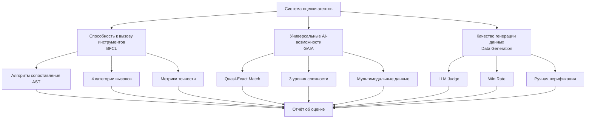
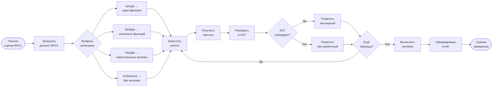
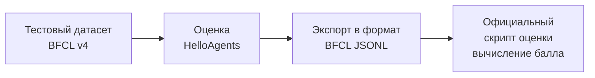
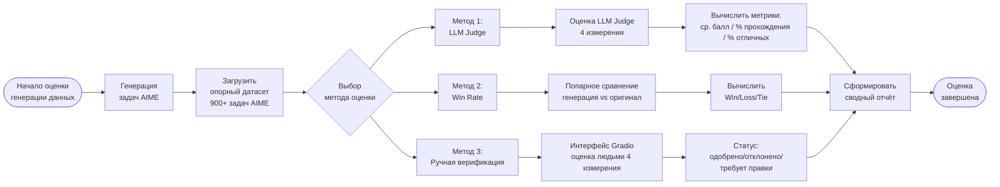
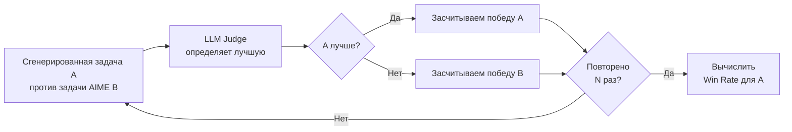

# Глава 12: Оценка производительности агентов

В предыдущих главах мы построили ключевую функциональность фреймворка HelloAgents: реализовали различные парадигмы агентов, систему инструментов, механизмы памяти и обучение с подкреплением. При разработке агентных систем неизбежно возникает центральный вопрос: **как объективно оценить производительность агента?** Конкретно нам необходимо ответить на следующие вопросы:

1. Обладает ли агент ожидаемыми способностями?
2. Как он справляется с задачами разного типа?
3. Каков его уровень в сравнении с другими агентами?

В этой главе мы добавим в HelloAgents **систему оценки производительности (Evaluation System)**. Мы разберём теоретические основы оценки агентов и реализуем инструменты для её проведения.

## 12.1 Основы оценки агентов

### 12.1.1 Зачем нужна оценка агентов

Наш текущий SimpleAgent уже обладает развитыми способностями к рассуждению и вызову инструментов. Рассмотрим типичный сценарий использования:

```python
from hello_agents import SimpleAgent, HelloAgentsLLM
from hello_agents.tools import SearchTool

# Создаём LLM и агента
llm = HelloAgentsLLM()

# Системный промпт с акцентом на использование инструментов
system_prompt = """Ты AI-ассистент, способный использовать инструмент поиска для получения актуальной информации.

Когда требуется поиск информации, используй следующий формат:
[TOOL_CALL:search:поисковый_запрос]

Примеры:
- [TOOL_CALL:search:последние новости об AI]
- [TOOL_CALL:search:учебник по Python]

Перед ответом на вопрос сначала воспользуйся инструментом поиска для получения актуальных данных."""

agent = SimpleAgent(name="AI-ассистент", llm=llm, system_prompt=system_prompt)

# Добавляем инструмент поиска
agent.add_tool(SearchTool())

# Пример: ответ на вопрос с использованием поиска
response = agent.run("Каковы последние тенденции в развитии AI-технологий?")
print(f"\nОтвет: {response}")
```

Этот агент работает корректно, однако перед нами стоит принципиальная проблема: как объективно оценить его производительность? Если мы оптимизируем промпт или сменим модель LLM, как понять, действительно ли произошло улучшение? Как гарантировать надёжность агента перед развёртыванием в продакшн? Все эти вопросы требуют систематической оценки.

Ключевая ценность оценки агентов состоит в предоставлении стандартизированных методов для измерения его возможностей. Благодаря оценке мы можем количественно выражать производительность в конкретных числовых показателях, объективно сравнивать разные варианты проектирования, своевременно выявлять слабые места агента в определённых сценариях и демонстрировать его надёжность пользователям.

В отличие от традиционного тестирования программного обеспечения, оценка агентов сопряжена с особыми трудностями. Первая — недетерминированность вывода: один и тот же вопрос может иметь несколько правильных ответов, и простой проверкой «верно/неверно» здесь не обойтись. Вторая — разнообразие критериев оценки: разные задачи требуют разных подходов; вызов инструментов предполагает проверку сигнатур функций, а задачи вопрос-ответ — оценку семантического сходства. Третья — высокая стоимость оценки: каждый прогон требует большого числа API-вызовов, и затраты могут достигать сотен и более рублей.

Для решения этих проблем академическое и промышленное сообщества разработали несколько стандартизированных **бенчмарков (Benchmark)**. Они предоставляют унифицированные наборы данных, метрики и методы оценки, позволяя сравнивать разные агентные системы на одних и тех же условиях.

### 12.1.2 Обзор основных бенчмарков

В области оценки агентов сформировался ряд влиятельных стандартных тестов. Ниже представлены наиболее распространённые бенчмарки и метрики.

**(1) Оценка способности к вызову инструментов**

Вызов инструментов — одна из ключевых возможностей агента. Агент должен понимать намерение пользователя, выбирать подходящий инструмент и корректно конструировать вызов функции. Релевантные бенчмарки:

- **BFCL (Berkeley Function Calling Leaderboard)**<sup>[1]</sup>: разработан в UC Berkeley; содержит более 1120 тестовых образцов, охватывает четыре категории — simple, multiple, parallel, irrelevance; использует алгоритм сопоставления AST; набор данных умеренного объёма с активным сообществом.
- **ToolBench**<sup>[2]</sup>: разработан в Университете Цинхуа; содержит более 16 000 сценариев реальных API-вызовов, охватывает сложные случаи использования инструментов из реального мира.
- **API-Bank**<sup>[3]</sup>: разработан в Microsoft Research; содержит 53 распространённых API-инструмента; специализируется на оценке понимания агентом документации API и способности к вызовам.

**(2) Оценка общих способностей**

Оценивает комплексную производительность агента в задачах реального мира, включая многошаговое рассуждение, использование знаний, мультимодальное понимание и другие возможности:

- **GAIA (General AI Assistants)**<sup>[4]</sup>: разработан совместно Meta AI и Hugging Face; содержит 466 вопросов из реального мира, разделённых на три уровня сложности (Level 1/2/3); оценивает многошаговое рассуждение, использование инструментов, обработку файлов, просмотр веб-страниц и другие возможности; использует алгоритм квазиточного совпадения (Quasi Exact Match); задачи реалистичны и носят комплексный характер.
- **AgentBench**<sup>[5]</sup>: разработан в Университете Цинхуа; содержит задачи из 8 различных областей; всесторонне оценивает общие способности агента.
- **WebArena**<sup>[6]</sup>: разработан в CMU; оценивает способность агента выполнять задачи в реальных веб-средах и взаимодействовать с веб-страницами.

**(3) Оценка кооперации мультиагентных систем**

Оценивает способность нескольких агентов работать совместно:

- **ChatEval**<sup>[7]</sup>: оценивает качество диалоговых систем на основе мультиагентного взаимодействия.
- **SOTOPIA**<sup>[8]</sup>: оценивает социальное взаимодействие агентов.
- **Пользовательские сценарии кооперации**: задачи оценки, разработанные под конкретные прикладные сценарии.

**(4) Распространённые метрики оценки**

Разные бенчмарки используют разные метрики. К наиболее распространённым относятся:

- **Метрики точности**: Accuracy (точность), Exact Match (точное совпадение), F1 Score (F1-мера) — для измерения правильности ответов.
- **Метрики эффективности**: Response Time (время ответа), Token Usage (расход токенов) — для измерения скорости выполнения.
- **Метрики устойчивости**: Error Rate (частота ошибок), Failure Recovery (восстановление после сбоев) — для измерения отказоустойчивости.
- **Метрики кооперации**: Communication Efficiency (эффективность коммуникации), Task Completion (степень выполнения задач) — для измерения эффективности совместной работы.

### 12.1.3 Проектирование системы оценки HelloAgents

С учётом кривой обучения и практической применимости в данной главе основное внимание уделяется следующим сценариям оценки:

1. **BFCL**: оценка способности к вызову инструментов
   - Обоснование выбора: умеренный объём набора данных, чёткие метрики, активное сообщество
   - Применимость: оценка точности вызовов функций агентом

2. **GAIA**: оценка способностей универсального AI-ассистента
   - Обоснование выбора: реалистичные задачи, дифференцированная сложность, высокая комплексность
   - Применимость: оценка способности агента решать комплексные проблемы

3. **Оценка качества генерации данных**: оценка качества данных, генерируемых LLM
   - Обоснование выбора: позволяет на практике освоить полный цикл создания данных агентом и их оценки
   - Применимость: оценка качества генерируемых обучающих и тестовых данных
   - Методы оценки: LLM Judge, Win Rate, ручная верификация

На основе этих трёх сценариев мы построим полноценную систему оценки. На рисунке 12.1 показана архитектура системы оценки HelloAgents.



*Рисунок 12.1 Архитектура системы оценки HelloAgents*

### 12.1.4 Цели обучения и быстрый старт

Рассмотрим структуру учебных материалов двенадцатой главы:

```
hello_agents/
├── evaluation/                         # Модуль оценки
│   └── benchmarks/                     # Реализации бенчмарков
│       ├── bfcl/                       # Реализация оценки BFCL
│       │   ├── dataset.py              # Загрузчик датасета BFCL
│       │   ├── evaluator.py            # Оценщик BFCL (сопоставление AST)
│       │   ├── metrics.py              # Метрики BFCL
│       │   └── ast_matcher.py          # Алгоритм сопоставления AST
│       ├── gaia/                       # Реализация оценки GAIA
│       │   ├── dataset.py              # Загрузчик датасета GAIA
│       │   ├── evaluator.py            # Оценщик GAIA (квазиточное совпадение)
│       │   ├── metrics.py              # Метрики GAIA
│       │   └── quasi_exact_match.py    # Алгоритм квазиточного совпадения
│       └── data_generation/            # Реализация оценки генерации данных
│           ├── dataset.py              # Загрузчик датасета AIME
│           ├── llm_judge.py            # Оценщик LLM Judge
│           └── win_rate.py             # Оценщик Win Rate
└── tools/builtin/                      # Модуль встроенных инструментов
    ├── bfcl_evaluation_tool.py         # Инструмент оценки BFCL
    ├── gaia_evaluation_tool.py         # Инструмент оценки GAIA
    ├── llm_judge_tool.py               # Инструмент LLM Judge
    └── win_rate_tool.py                # Инструмент Win Rate
```

Цель обучения этой главы — освоить применение инструментов оценки. Подготовим среду разработки:

```bash
# Установка фреймворка HelloAgents (версия для главы 12)
pip install "hello-agents[evaluation]==0.2.7"

# Установка переменных окружения
export HF_TOKEN="your_huggingface_token"     # для датасета GAIA (шаги настройки описаны ниже)

# Официальный пакет bfcl-eval требует numpy<=2.0.0, что конфликтует с основными
# зависимостями HelloAgents, поэтому устанавливаем его отдельно
pip install "numpy==1.26.4" bfcl-eval
```

В последующих разделах мы подробно рассмотрим каждый метод оценки.

## 12.2 BFCL: оценка способности к вызову инструментов

### 12.2.1 Введение в бенчмарк BFCL

BFCL (Berkeley Function Calling Leaderboard) — бенчмарк для оценки способности к вызову функций, разработанный Калифорнийским университетом в Беркли<sup>[1]</sup>. Вызов инструментов (Tool Calling) — одна из ключевых возможностей агентных систем. Агент должен выполнять следующие задачи:

1. **Понимание требований задачи**: извлечение ключевой информации из естественно-языкового описания пользователя
2. **Выбор подходящего инструмента**: выбор наиболее подходящего инструмента из доступного набора
3. **Конструирование вызова функции**: корректное заполнение имени функции и аргументов
4. **Обработка сложных сценариев**: поддержка вызовов нескольких функций, параллельных вызовов и других продвинутых случаев

Бенчмарк BFCL включает четыре категории с возрастающей сложностью: от базового вызова одной функции (Simple) до сценариев с несколькими функциями (Multiple), параллельного вызова (Parallel) и ситуаций, когда нужно определить, требуется ли вызов функции вообще (Irrelevance). Эти четыре категории охватывают различные сценарии вызова инструментов в реальных приложениях, как показано в таблице 12.1.

*Таблица 12.1 Четыре категории бенчмарка BFCL*

| Категория | Описание | Пример |
|-----------|----------|--------|
| **Simple** | Простой вызов одной функции | «Узнай погоду в Москве сегодня» → `get_weather(city="Москва")` |
| **Multiple** | Требует вызова нескольких разных функций | «Узнай погоду и поставь напоминание» → `get_weather()` + `set_reminder()` |
| **Parallel** | Требует параллельного вызова нескольких функций | «Узнай погоду в Москве и Питере одновременно» → параллельный вызов `get_weather()` |
| **Irrelevance** | Распознаёт ситуации, не требующие вызова функций | «Привет» → функции не вызываются |

Процесс оценки BFCL следует стандартному рабочему процессу бенчмаркинга: сначала загружается датасет и выбирается категория оценки, затем запускается агент для получения прогнозов, далее прогнозы разбираются в абстрактные синтаксические деревья (AST), и наконец алгоритм сопоставления AST определяет корректность прогноза. Весь процесс проходит по всем тестовым образцам, в итоге вычисляются метрики точности и формируется отчёт. Полный процесс оценки показан на рисунке 12.2.



*Рисунок 12.2 Схема процесса оценки BFCL*

**(1) Структура датасета BFCL**

Датасет BFCL использует формат JSON. Каждый тестовый образец содержит следующие поля:

```json
{
  "id": "simple_001",
  "question": "What's the weather like in Beijing today?",
  "function": [
    {
      "name": "get_weather",
      "description": "Get the current weather for a location",
      "parameters": {
        "type": "object",
        "properties": {
          "location": {
            "type": "string",
            "description": "The city name"
          }
        },
        "required": ["location"]
      }
    }
  ],
  "ground_truth": [
    {
      "name": "get_weather",
      "arguments": {
        "location": "Beijing"
      }
    }
  ]
}
```

**Описание ключевых полей:**

- `question`: запрос пользователя на естественном языке
- `function`: список доступных функций (включая сигнатуры и описания)
- `ground_truth`: эталонный ответ (ожидаемый вызов функции)

**(2) Описание сопоставления AST**

BFCL использует **сопоставление AST (Abstract Syntax Tree Matching)** в качестве основного алгоритма оценки, поэтому ниже кратко описана стратегия оценки.

BFCL применяет абстрактные синтаксические деревья для интеллектуального сопоставления вместо простого сравнения строк. Ключевая идея сопоставления AST: **разобрать вызов функции в синтаксическое дерево, затем сравнить структуру и значения узлов дерева**.

Для прогнозируемого вызова функции $P$ и эталонного ответа $G$ функция сопоставления AST определяется следующим образом:

$$
\text{AST\_Match}(P, G) = \begin{cases}
1 & \text{если } \text{AST}(P) \equiv \text{AST}(G) \\
0 & \text{иначе}
\end{cases}
$$

где $\text{AST}(x)$ обозначает разбор вызова функции в абстрактное синтаксическое дерево, а $\equiv$ означает эквивалентность синтаксических деревьев.

Два синтаксических дерева считаются эквивалентными при выполнении трёх ключевых условий: имена функций должны полностью совпадать (точное сопоставление), множество пар «ключ-значение» аргументов должно быть равным (с игнорированием порядка), и значение каждого аргумента должно быть семантически эквивалентным (например, `2+3` эквивалентно `5`). При сопоставлении имён функций требуется точное строковое совпадение: `get_weather` и `get_temperature` считаются разными функциями. Сопоставление аргументов использует AST для интеллектуального сравнения: допускается произвольный порядок аргументов (`f(a=1, b=2)` эквивалентно `f(b=2, a=1)`), эквивалентные выражения (`f(x=2+3)` эквивалентно `f(x=5)`) и разные строковые представления (`f(s="hello")` эквивалентно `f(s='hello')`). Для сценариев с несколькими вызовами функций алгоритм требует одинакового числа вызовов, каждый вызов должен совпасть, но порядок вызовов может быть произвольным (используется сопоставление как множеств).

**Примеры сопоставления AST:**

```python
# Пример 1: другой порядок аргументов (совпадение успешно)
прогноз: get_weather(city="Beijing", unit="celsius")
эталон:  get_weather(unit="celsius", city="Beijing")
результат: ✅ совпадение успешно

# Пример 2: эквивалентное выражение (совпадение успешно)
прогноз: calculate(x=2+3)
эталон:  calculate(x=5)
результат: ✅ совпадение успешно

# Пример 3: неверное имя функции (совпадение не удалось)
прогноз: get_temperature(city="Beijing")
эталон:  get_weather(city="Beijing")
результат: ❌ совпадение не удалось

# Пример 4: неверное значение аргумента (совпадение не удалось)
прогноз: get_weather(city="Shanghai")
эталон:  get_weather(city="Beijing")
результат: ❌ совпадение не удалось
```

**(3) Метрики оценки BFCL**

BFCL использует следующие метрики для оценки производительности агента.

**1. Точность (Accuracy)**

Точность — ключевая метрика, определяемая как доля образцов с успешным сопоставлением AST:

$$
\text{Accuracy} = \frac{1}{N} \sum_{i=1}^{N} \text{AST\_Match}(P_i, G_i)
$$

где:
- $N$ — общее число образцов
- $P_i$ — прогноз для $i$-го образца
- $G_i$ — эталонный ответ для $i$-го образца
- $\text{AST\_Match}(P_i, G_i) \in \{0, 1\}$ — функция сопоставления AST

**2. Коэффициент сопоставления AST (AST Match Rate)**

Совпадает с точностью, подчёркивает использование алгоритма сопоставления AST:

$$
\text{AST Match Rate} = \text{Accuracy}
$$

**3. Точность по категориям (Category-wise Accuracy)**

Для каждой категории $c \in \{\text{simple}, \text{multiple}, \text{parallel}, \ldots\}$ вычисляется точность по этой категории:

$$
\text{Accuracy}_c = \frac{1}{|D_c|} \sum_{i \in D_c} \text{AST\_Match}(P_i, G_i)
$$

где $D_c$ — множество образцов категории $c$, $|D_c|$ — число образцов в этой категории.

**4. Взвешенная точность (Weighted Accuracy)**

С учётом весовых коэффициентов сложности по категориям:

$$
\text{Weighted Accuracy} = \sum_{c} w_c \cdot \text{Accuracy}_c
$$

где $w_c$ — весовой коэффициент категории $c$, при этом $\sum_c w_c = 1$.

**5. Доля ошибок (Error Rate)**

Доля образцов с некорректным вызовом функции:

$$
\text{Error Rate} = 1 - \text{Accuracy} = \frac{1}{N} \sum_{i=1}^{N} (1 - \text{AST\_Match}(P_i, G_i))
$$

**Интерпретация метрик:**

- **Accuracy = 1.0**: все образцы полностью верны
- **Accuracy = 0.8**: 80% образцов верны, 20% ошибочны
- **Accuracy = 0.0**: все образцы ошибочны

**Пример точности по категориям:**

```python
# Предположим следующие результаты оценки
simple_accuracy = 0.95      # категория Simple: 95% верных
multiple_accuracy = 0.82    # категория Multiple: 82% верных
parallel_accuracy = 0.68    # категория Parallel: 68% верных

# Взвешенная точность (предполагаем равные веса)
weighted_accuracy = (0.95 + 0.82 + 0.68) / 3  # = 0.817
```

**(4) Официальный инструмент оценки BFCL**

BFCL предоставляет официальный CLI-инструмент для проведения оценки:

```bash
# Установка инструмента оценки BFCL
pip install bfcl

# Запуск официальной оценки
bfcl evaluate \
    --model-result-path ./results.json \
    --test-category simple_python
```

Преимущества официального инструмента оценки: использует официальный алгоритм сопоставления AST, результаты полностью соответствуют таблице лидеров, поддерживает все категории BFCL v4 и автоматически генерирует детальные отчёты.

### 12.2.2 Получение датасета BFCL

Датасет BFCL доступен следующими способами.

**Метод 1: клонирование официального репозитория GitHub (рекомендуется)**

Наиболее надёжный способ для получения полного датасета вместе с эталонными ответами:

```bash
# Клонируем репозиторий BFCL
git clone https://github.com/ShishirPatil/gorilla.git temp_gorilla
cd temp_gorilla/berkeley-function-call-leaderboard

# Просматриваем датасет BFCL v4
ls bfcl_eval/data/
# Вывод: BFCL_v4_simple_python.json  BFCL_v4_multiple.json  BFCL_v4_parallel.json  ...

# Просматриваем эталонные ответы
ls bfcl_eval/data/possible_answer/
# Вывод: BFCL_v4_simple_python.json  BFCL_v4_multiple.json  ...
```

Обоснование рекомендации: содержит полные эталонные ответы (ground truth), формат данных полностью соответствует официальному инструменту оценки, позволяет напрямую использовать официальные скрипты оценки, поддерживает последнюю версию BFCL v4.

**Метод 2: загрузка официальных данных через HelloAgents**

После клонирования репозитория загружаем данные через HelloAgents:

```python
from hello_agents.evaluation import BFCLDataset

# Загружаем официальные данные BFCL
dataset = BFCLDataset(
    bfcl_data_dir="./temp_gorilla/berkeley-function-call-leaderboard/bfcl_eval/data",
    category="simple_python"  # категория BFCL v4
)

# Загружаем данные (тестовые данные и эталонные ответы)
data = dataset.load()

print(f"✅ Загружено {len(data)} тестовых образцов")
print(f"✅ Загружено {len(dataset.ground_truth)} эталонных ответов")
# Вывод:
# ✅ Загружено 400 тестовых образцов
# ✅ Загружено 400 эталонных ответов
```

Принцип работы загрузчика: сначала загружает тестовые данные из `bfcl_eval/data/`, затем загружает эталонные ответы из `bfcl_eval/data/possible_answer/`, автоматически объединяет тестовые данные с эталонными ответами и сохраняет оригинальный формат данных BFCL. Категории датасета BFCL v4 приведены в таблице 12.2.

*Таблица 12.2 Категории датасета BFCL v4*

| Категория | Имя файла | Описание | Образцов |
|-----------|-----------|----------|----------|
| simple_python | BFCL_v4_simple_python.json | Простые вызовы функций Python | 400 |
| simple_java | BFCL_v4_simple_java.json | Простые вызовы функций Java | 400 |
| simple_javascript | BFCL_v4_simple_javascript.json | Простые вызовы функций JavaScript | 400 |
| multiple | BFCL_v4_multiple.json | Вызовы нескольких функций | 240 |
| parallel | BFCL_v4_parallel.json | Параллельные вызовы функций | 280 |
| parallel_multiple | BFCL_v4_parallel_multiple.json | Параллельные вызовы нескольких функций | 200 |
| irrelevance | BFCL_v4_irrelevance.json | Нерелевантные запросы | 200 |
| live_simple | BFCL_v4_live_simple.json | Простые запросы от пользователей | 150 |
| multi_turn_base | BFCL_v4_multi_turn_base.json | Базовые многоходовые диалоги | 100 |

Доступные категории также можно посмотреть программно:

```python
# Получаем все поддерживаемые категории
categories = dataset.get_available_categories()
print(f"Поддерживаемые категории: {categories}")
# Вывод: ['simple_python', 'simple_java', 'simple_javascript', 'multiple', ...]
```

### 12.2.3 Реализация оценки BFCL в HelloAgents

Рассмотрим, как реализовать оценку BFCL в рамках фреймворка HelloAgents. Предусмотрено три способа использования.

**Способ 1: использование BFCLEvaluationTool (рекомендуется)**

Самый простой способ — одна строка кода для выполнения оценки, генерации отчёта и официальной оценки:

```python
from hello_agents import SimpleAgent, HelloAgentsLLM
from hello_agents.tools import BFCLEvaluationTool

# 1. Создаём оцениваемого агента
llm = HelloAgentsLLM()
agent = SimpleAgent(name="TestAgent", llm=llm)

# 2. Создаём инструмент оценки BFCL
bfcl_tool = BFCLEvaluationTool()

# 3. Запускаем оценку (автоматически выполняет все шаги)
results = bfcl_tool.run(
    agent=agent,
    category="simple_python",  # категория оценки
    max_samples=5               # число образцов (0 = все)
)

# 4. Просматриваем результаты
print(f"Точность: {results['overall_accuracy']:.2%}")
print(f"Верных: {results['correct_samples']}/{results['total_samples']}")
```

**Вывод при запуске:**

```
============================================================
Комплексная оценка BFCL
============================================================

Конфигурация:
   Категория оценки: simple_python
   Число образцов: 5
   Агент: TestAgent

============================================================
Шаг 1: Запуск оценки HelloAgents
============================================================
✅ Датасет BFCL загружен
   Директория данных: ./temp_gorilla/berkeley-function-call-leaderboard/bfcl_eval/data
   Категория: simple_python
   Образцов: 400
   Эталонных ответов: 400

🔧 Начало оценки BFCL...
   Прогресс: 1/5
   Прогресс: 5/5

✅ Оценка BFCL завершена
   Общая точность: 100.00%
   simple_python: 100.00% (5/5)

📊 Результаты оценки:
   Точность: 100.00%
   Верных: 5/5

============================================================
Шаг 2: Экспорт результатов в формате BFCL
============================================================
✅ Результаты в формате BFCL экспортированы
   Файл: ./evaluation_results/bfcl_official/BFCL_v4_simple_python_result.json

============================================================
Шаг 3: Запуск официальной оценки BFCL
============================================================
✅ Файл результатов скопирован: ./result/Qwen_Qwen3-8B/BFCL_v4_simple_python_result.json

🔄 Команда: bfcl evaluate --model Qwen/Qwen3-8B --test-category simple_python --partial-eval

============================================================
Результаты официальной оценки BFCL
============================================================
📊 Сводка результатов:
Model,Overall Acc,simple_python
Qwen/Qwen3-8B,100.00,100.00

🎯 Итоговый результат:
   Точность: 100.00%
   Верных: 5/5

============================================================
Шаг 4: Генерация отчёта об оценке
============================================================
📄 Отчёт сгенерирован: ./evaluation_reports/bfcl_report_20251011_005938.md

Точность: 100.00%
Верных: 5/5
```

**Автоматически генерируемый отчёт в формате Markdown:**

После завершения оценки автоматически формируется подробный Markdown-отчёт, включающий:

```markdown
# Отчёт об оценке BFCL
**Дата генерации**: 2025-10-11 00:59:38

## 📊 Обзор оценки

- **Агент**: TestAgent
- **Категория оценки**: simple_python
- **Общая точность**: 100.00%
- **Верных образцов**: 5/5

## 📈 Детальные метрики

### Точность по категориям

- **simple_python**: 100.00% (5/5)

## 📝 Детали по образцам

| ID образца | Вопрос | Прогноз | Верный ответ | Верно |
|------------|--------|---------|--------------|-------|
| simple_python_0 | Find the area of a triangle... | [{'name': 'calculate_triangle_area'...}] | [{'function_name': {'base': [10]...}}] | ✅ |
| simple_python_1 | Calculate the factorial of 5... | [{'name': 'calculate_factorial'...}] | [{'function_name': {'number': [5]}}] | ✅ |
...

## 📊 Визуализация точности
Точность: ██████████████████████████████████████████████████ 100.00%

## 💡 Рекомендации
- ✅ Отличный результат! Агент демонстрирует высокое качество вызова инструментов.
```

**Способ 2: использование скрипта комплексной оценки**

Подходит для быстрой оценки из командной строки. В примерах кода к этой главе предусмотрен файл `04_run_bfcl_evaluation.py` с поддержкой прямого вызова из CLI:

```bash
# Запуск скрипта оценки
python chapter12/04_run_bfcl_evaluation.py --category simple_python --samples 10

# Указываем имя модели (для официальной оценки BFCL)
python examples/04_run_bfcl_evaluation.py \
    --category simple_python \
    --samples 10 \
    --model-name "Qwen/Qwen3-8B"
```

Скрипт принимает три параметра: `--category` — категория оценки (по умолчанию `simple_python`), `--samples` — число образцов для оценки (по умолчанию 5; 0 означает все), `--model-name` — имя модели для официальной оценки BFCL (по умолчанию `Qwen/Qwen3-8B`).

**Способ 3: прямое использование Dataset и Evaluator**

Подходит для сценариев с нестандартным процессом оценки:

```python
from hello_agents import SimpleAgent, HelloAgentsLLM
from hello_agents.evaluation import BFCLDataset, BFCLEvaluator

# 1. Создаём агента
llm = HelloAgentsLLM()
agent = SimpleAgent(name="TestAgent", llm=llm)

# 2. Загружаем датасет
dataset = BFCLDataset(
    bfcl_data_dir="./temp_gorilla/berkeley-function-call-leaderboard/bfcl_eval/data",
    category="simple_python"
)
data = dataset.load()

# 3. Создаём оценщик
evaluator = BFCLEvaluator(
    dataset=dataset,
    category="simple_python",
    evaluation_mode="ast"  # режим сопоставления AST
)

# 4. Запускаем оценку
results = evaluator.evaluate(agent, max_samples=10)

# 5. Просматриваем результаты
print(f"Точность: {results['overall_accuracy']:.2%}")
print(f"Верных: {results['correct_samples']}/{results['total_samples']}")

# 6. Экспортируем результаты в формате BFCL (опционально)
evaluator.export_to_bfcl_format(
    results,
    output_path="./evaluation_results/my_results.json"
)
```

Из трёх описанных способов можно выбрать наиболее подходящий для конкретной задачи. Для быстрого ознакомления с производительностью агента удобнее всего `BFCLEvaluationTool` с его комплексной оценкой в один клик; для пакетной оценки или интеграции в CI/CD предпочтительнее скрипт командной строки; а для глубокой настройки процесса оценки или интеграции в собственную систему прямое использование Dataset и Evaluator предоставляет наибольшую гибкость.

### 12.2.4 Интеграция официального инструмента оценки BFCL

В предыдущих разделах мы узнали, как использовать встроенные средства оценки HelloAgents. На самом деле `BFCLEvaluationTool` уже **автоматически интегрирует официальный инструмент оценки BFCL**, что позволяет получать авторитетные и сопоставимые результаты.

Весь процесс оценки включает четыре шага: загрузку тестовых данных из датасета BFCL v4, запуск оценки через HelloAgents для получения прогнозов агента, экспорт результатов в официальный формат BFCL (JSONL) и вычисление итогового балла с помощью официального скрипта оценки. Этот процесс гарантирует полное соответствие результатов таблице лидеров BFCL, как показано на рисунке 12.3.



*Рисунок 12.3 Процесс загрузки и оценки BFCL в HelloAgents*

При использовании `BFCLEvaluationTool` официальная оценка запускается **автоматически** (включена по умолчанию):

```python
from hello_agents import SimpleAgent, HelloAgentsLLM
from hello_agents.tools import BFCLEvaluationTool

# Создаём агента
llm = HelloAgentsLLM()
agent = SimpleAgent(name="TestAgent", llm=llm)

# Создаём инструмент оценки
bfcl_tool = BFCLEvaluationTool()

# Запускаем оценку (официальная оценка запускается автоматически)
results = bfcl_tool.run(
    agent=agent,
    category="simple_python",
    max_samples=5,
    # run_official_eval=True  # по умолчанию True, можно опустить
    model_name="Qwen/Qwen3-8B"  # опционально, указываем имя модели
)
```

Инструмент автоматически выполняет полный процесс оценки: запускает оценку HelloAgents для получения прогнозов, экспортирует результаты в формат BFCL и сохраняет их в директорию `evaluation_results/bfcl_official/`, копирует файл результатов в директорию `result/{model_name}/` в соответствии с требованиями официального инструмента, запускает официальную команду оценки BFCL, отображает результаты и генерирует отчёт в формате Markdown.

**Пример вывода официальной оценки:**

```
============================================================
Шаг 3: Запуск официальной оценки BFCL
============================================================

✅ Файл результатов скопирован:
   ./result/Qwen_Qwen3-8B/BFCL_v4_simple_python_result.json

🔄 Команда: bfcl evaluate --model Qwen/Qwen3-8B --test-category simple_python --partial-eval

============================================================
Результаты официальной оценки BFCL
============================================================

📊 Сводка результатов:
Model,Overall Acc,simple_python
Qwen/Qwen3-8B,100.00,100.00

🎯 Итоговый результат:
   Точность: 100.00%
   Верных: 5/5
```

Для ручного управления процессом оценки можно отключить автоматическую официальную оценку:

```python
# Отключаем официальную оценку
results = bfcl_tool.run(
    agent=agent,
    category="simple_python",
    max_samples=5,
    run_official_eval=False  # отключаем официальную оценку
)

# Затем запускаем официальную оценку вручную
import subprocess
subprocess.run([
    "bfcl", "evaluate",
    "--model", "Qwen/Qwen3-8B",
    "--test-category", "simple_python",
    "--partial-eval"
])
```

Также можно генерировать отчёт вручную:

```python
# Запускаем оценку
results = bfcl_tool.run(agent, category="simple_python", max_samples=5)

# Генерируем отчёт вручную
report = bfcl_tool.generate_report(
    results,
    output_file="./my_reports/custom_report.md"
)

# Выводим содержимое отчёта
print(report)
```

### 12.2.5 Детали реализации ключевых компонентов

В предыдущих разделах мы изучили, как использовать инструменты оценки BFCL. Теперь углубимся в реализацию ключевых компонентов системы оценки HelloAgents. Понимание деталей реализации поможет лучше использовать систему оценки и при необходимости настраивать и расширять её.

**(1) BFCLDataset: загрузчик датасета**

`BFCLDataset` отвечает за загрузку датасета BFCL и управление им:

````python
class BFCLDataset:
    """Загрузчик датасета BFCL"""

    def __init__(self, category: str = "simple", local_data_path: Optional[str] = None):
        self.category = category
        self.local_data_path = local_data_path
        self.data = []

    def load(self) -> List[Dict[str, Any]]:
        """Загружает датасет"""
        # Приоритет — локальная загрузка
        if self.local_data_path:
            return self._load_from_local()
        # Иначе загрузка с Hugging Face
        return self._load_from_huggingface()
````

Поскольку датасет BFCL находится непосредственно в официальном репозитории, рекомендуется клонировать репозиторий локально и проводить оценку на его основе. Загрузка с Hugging Face выступает резервным вариантом.

**(2) BFCLEvaluator: исполнитель оценки**

`BFCLEvaluator` отвечает за выполнение процесса оценки. Его ядро — метод `evaluate()`, координирующий весь процесс:

````python
class BFCLEvaluator:
    """Оценщик BFCL"""

    def evaluate(self, agent: Any, max_samples: Optional[int] = None) -> Dict[str, Any]:
        """Выполняет оценку"""
        results = []

        for item in self.dataset[:max_samples]:
            # 1. Конструируем промпт
            prompt = self._build_prompt(item)

            # 2. Вызываем агента
            response = agent.run(prompt)

            # 3. Извлекаем вызовы функций
            predicted_calls = self._extract_function_calls(response)

            # 4. Сравниваем с эталонным ответом
            is_correct = self._compare_calls(predicted_calls, item["ground_truth"])

            results.append({
                "id": item["id"],
                "prediction": predicted_calls,
                "ground_truth": item["ground_truth"],
                "is_correct": is_correct
            })

        return {"results": results, "total_samples": len(results)}
````

Дизайн этого оценщика включает три ключевых аспекта: **конструирование промпта** — перевод вопроса из датасета и определений функций в промпт, понятный агенту; **извлечение вызовов функций** — извлечение вызовов функций из ответа агента с поддержкой нескольких форматов (JSON, блоки кода и т. д.); **сопоставление AST** — сравнение вызовов функций через абстрактные синтаксические деревья, что точнее простого сравнения строк.

Рассмотрим реализацию извлечения вызовов функций:

```python
def _extract_function_calls(self, response: str) -> List[Dict[str, Any]]:
    """Извлекает вызовы функций из ответа

    Поддерживает несколько форматов:
    1. JSON-формат: {"name": "func", "arguments": {...}}
    2. Формат блока кода: ```python\nfunc(arg1=val1)\n```
    3. Формат обычного текста: func(arg1=val1)
    """
    calls = []

    # Попытка разбора JSON
    try:
        json_match = re.search(r'\{.*\}', response, re.DOTALL)
        if json_match:
            data = json.loads(json_match.group())
            if isinstance(data, dict) and "name" in data:
                calls.append(data)
            elif isinstance(data, list):
                calls.extend(data)
    except json.JSONDecodeError:
        pass

    # Попытка извлечения из блока кода
    code_blocks = re.findall(r'```(?:python)?\n(.*?)\n```', response, re.DOTALL)
    for code in code_blocks:
        # Разбираем вызовы функций Python
        parsed_calls = self._parse_python_calls(code)
        calls.extend(parsed_calls)

    return calls
```

**(3) BFCLMetrics: вычислитель метрик**

`BFCLMetrics` отвечает за вычисление различных метрик оценки:

````python
class BFCLMetrics:
    """Вычислитель метрик BFCL"""

    def compute_metrics(self, results: List[Dict[str, Any]]) -> Dict[str, Any]:
        """Вычисляет все метрики"""
        return {
            "accuracy": self._compute_accuracy(results),
            "ast_match_rate": self._compute_ast_match_rate(results),
            "parameter_accuracy": self._compute_parameter_accuracy(results),
            "f1_score": self._compute_f1_score(results),
            "category_statistics": self._compute_category_stats(results)
        }
````

**Реализация сопоставления AST:**

Сопоставление AST — ключевая технология оценки BFCL. Оно умнее простого сравнения строк и способно распознавать семантически эквивалентные вызовы функций:

```python
def _ast_match(self, pred_call: Dict, true_call: Dict) -> bool:
    """Сопоставляет вызовы функций через AST

    Преимущества сопоставления AST:
    1. Игнорирует порядок аргументов: func(a=1, b=2) эквивалентно func(b=2, a=1)
    2. Распознаёт эквивалентные выражения: 2+3 эквивалентно 5
    3. Игнорирует пробелы и различия форматирования
    """
    # 1. Имена функций должны полностью совпасть
    if pred_call.get("name") != true_call.get("name"):
        return False

    # 2. Преобразуем аргументы в узлы AST
    pred_args = self._args_to_ast(pred_call.get("arguments", {}))
    true_args = self._args_to_ast(true_call.get("arguments", {}))

    # 3. Сравниваем узлы AST
    return ast.dump(pred_args) == ast.dump(true_args)

def _args_to_ast(self, args: Dict[str, Any]) -> ast.AST:
    """Преобразует словарь аргументов в узел AST"""
    # Конструируем фиктивный вызов функции
    code = f"func({', '.join(f'{k}={repr(v)}' for k, v in args.items())})"
    tree = ast.parse(code)
    return tree.body[0].value  # возвращаем узел Call
```

**(4) Инструментальная обёртка: BFCLEvaluationTool**

Наконец, мы оборачиваем все компоненты в Tool, чтобы агент мог вызывать его напрямую:

````python
class BFCLEvaluationTool(Tool):
    """Инструмент оценки BFCL"""

    def __init__(self, local_data_path: Optional[str] = None):
        super().__init__(
            name="bfcl_evaluation",
            description="Оценивает способность агента к вызову инструментов"
        )
        self.dataset = None
        self.evaluator = None
        self.metrics_calculator = BFCLMetrics()

    def run(self, parameters: Dict[str, Any]) -> str:
        """Выполняет оценку"""
        # 1. Загружаем датасет
        self.dataset = BFCLDataset(...)

        # 2. Создаём оценщик
        self.evaluator = BFCLEvaluator(...)

        # 3. Запускаем оценку
        results = self.evaluator.evaluate(...)

        # 4. Вычисляем метрики
        metrics = self.metrics_calculator.compute_metrics(...)

        # 5. Возвращаем результат в формате JSON
        return json.dumps(results, ensure_ascii=False)
````

Дизайн этого инструмента следует трём ключевым принципам: **наследование от базового класса Tool** для соответствия спецификации инструментов HelloAgents и бесшовной интеграции с фреймворком; **строгая валидация параметров** с проверкой обязательных полей и дружелюбными сообщениями об ошибках для улучшения пользовательского опыта; **форматирование результатов** — возврат строки JSON для удобного разбора и отображения. Такой модульный дизайн реализует систему оценки, которая одновременно проста в использовании и гибка: пользователи могут работать через высокоуровневый интерфейс Tool для быстрой оценки или погружаться в нижележащие компоненты для кастомизации под специфические нужды.

### 12.2.6 Рекомендации по расширению и оптимизации

Изучив предыдущие разделы, мы освоили использование HelloAgents для оценки BFCL. Следует отметить, что текущая реализация основана на SimpleAgent и реализует базовую функциональность оценки BFCL. На практике бенчмарк BFCL охватывает множество уровней сложности и сценариев; для достижения более высоких позиций в таблице лидеров потребуется дальнейшая оптимизация.

**(1) Ограничения текущей реализации**

Наша текущая реализация SimpleAgent сосредоточена на построении процесса оценки, и пространство для улучшения способности к вызову инструментов ещё есть. SimpleAgent использует собственный формат вызова инструментов `[TOOL_CALL:tool_name:parameters]`, который LLM должен освоить самостоятельно; в сложных сценариях это может уступать агентам с нативными функциями (Function Calling). Кроме того, мы пока тестировали только базовые категории вроде `simple_python`; для более сложных категорий `multiple`, `parallel` и `irrelevance` потребуется целевая оптимизация.

**(2) Направления повышения баллов BFCL**

Для дальнейшего улучшения результатов оценки BFCL можно рассмотреть несколько направлений. Во-первых, оптимизация способности агента к вызову инструментов: использование LLM с нативной поддержкой вызова функций (например, GPT-4, Claude) или улучшение промпта для лучшего понимания формата вызова инструментов. Во-вторых, расширение библиотеки инструментов: поскольку тесты BFCL охватывают различные типы функций, можно заранее реализовать часто используемые типы инструментов на основе характеристик тестового датасета. В-третьих, разработка разных стратегий для разных уровней сложности: в сценарии `multiple` агент должен планировать последовательность вызовов нескольких инструментов; в сценарии `parallel` — распознавать параллельно выполнимые вызовы; в сценарии `irrelevance` — определять, нужен ли вызов инструмента вообще.

**(3) Практические рекомендации**

Разработчикам, стремящимся к лучшим результатам на BFCL, рекомендуем следующую стратегию. Начните с категории `simple` и убедитесь, что базовые вызовы одной функции работают стабильно — это фундамент для дальнейших улучшений. Затем последовательно тестируйте более сложные категории (`multiple`, `parallel`), анализируйте неудачные случаи и выявляйте слабые места агента. При оптимизации изучайте высокорейтинговые модели из таблицы лидеров BFCL, чтобы перенять их подходы. Также рекомендуется верифицировать результаты с помощью официального инструмента оценки для согласованности со стандартом таблицы лидеров.

Ниже перечислены конкретные практические советы.

**1. Постепенная оценка**

Начинайте с малого числа образцов, постепенно увеличивая их количество:

```python
# Шаг 1: быстрый тест (5 образцов)
results_quick = bfcl_tool.run(agent, category="simple_python", max_samples=5)

# Шаг 2: тест среднего масштаба (50 образцов)
if results_quick['overall_accuracy'] > 0.8:
    results_medium = bfcl_tool.run(agent, category="simple_python", max_samples=50)

# Шаг 3: полная оценка (все образцы)
if results_medium['overall_accuracy'] > 0.8:
    results_full = bfcl_tool.run(agent, category="simple_python", max_samples=0)
```

**2. Оценка по нескольким категориям**

Оценка задач разной сложности:

```python
categories = ["simple_python", "multiple", "parallel", "irrelevance"]

for category in categories:
    print(f"\nОценка категории: {category}")
    results = bfcl_tool.run(agent, category=category, max_samples=10)
    print(f"Точность: {results['overall_accuracy']:.2%}")
```

**3. Сравнительная оценка**

Сравнение агентов с разными конфигурациями:

```python
# Конфигурация 1: промпт по умолчанию
agent1 = SimpleAgent(name="Agent-Default", llm=llm)
results1 = bfcl_tool.run(agent1, category="simple_python", max_samples=10)

# Конфигурация 2: оптимизированный промпт
agent2 = SimpleAgent(name="Agent-Optimized", llm=llm)
# ... устанавливаем оптимизированный системный промпт ...
results2 = bfcl_tool.run(agent2, category="simple_python", max_samples=10)

# Сравниваем результаты
print(f"Точность с промптом по умолчанию: {results1['overall_accuracy']:.2%}")
print(f"Точность с оптимизированным промптом: {results2['overall_accuracy']:.2%}")
```

Если ваши результаты оценки высоки, рассмотрите возможность подачи заявки в официальную таблицу лидеров BFCL!

**Шаг 1: подготовка материалов для подачи**

1. Документ с описанием модели
2. Файлы результатов оценки (для всех категорий)
3. Способ доступа к модели (API или ссылка на открытые веса)

**Шаг 2: подача заявки через GitHub**

Перейдите в официальный репозиторий BFCL и отправьте Pull Request согласно инструкциям:

- Адрес репозитория: https://github.com/ShishirPatil/gorilla
- Руководство по подаче: см. `CONTRIBUTING.md`

**Шаг 3: ожидание проверки**

Команда BFCL проверит вашу заявку и верифицирует корректность результатов. После успешной проверки ваша модель появится в официальной таблице лидеров!

## 12.3 GAIA: оценка способностей универсального AI-ассистента

### 12.3.1 Введение в бенчмарк GAIA

GAIA (General AI Assistants) — бенчмарк, разработанный совместно Meta AI и Hugging Face, специализирующийся на оценке **универсальных возможностей** AI-ассистентов<sup>[2]</sup>. В отличие от BFCL, сосредоточенного на вызове инструментов, GAIA оценивает комплексную производительность агента в задачах реального мира.

Концепция GAIA строится на принципе: **задачи реального мира требуют комплексного применения самых разных способностей**. Выдающийся AI-ассистент должен не только вызывать инструменты, но и уметь:

- **Многошаговое рассуждение**: декомпозиция сложных задач на подзадачи
- **Применение знаний**: использование встроенных знаний и внешних баз знаний
- **Мультимодальное понимание**: обработка текста, изображений, файлов и других типов входных данных
- **Просмотр веб-страниц**: получение актуальной информации из интернета
- **Работа с файлами**: чтение и обработка файлов различных форматов

**(1) Структура датасета GAIA**

Разобравшись с концепцией GAIA, рассмотрим конкретную структуру датасета. GAIA содержит 466 тщательно разработанных вопросов из реального мира, разделённых по сложности и числу требуемых шагов рассуждения на три уровня — от простых задач без шагов рассуждения до сложных задач с многоступенчатым рассуждением, — как показано в таблице 12.3.

*Таблица 12.3 Распределение уровней сложности датасета GAIA*

| Уровень | Описание | Шагов рассуждения | Образцов | Пример |
|---------|----------|-------------------|----------|--------|
| **Level 1** | Простые задачи | 0 шагов | 165 | «Кто получил Нобелевскую премию по физике 2023 года?» |
| **Level 2** | Задачи средней сложности | 1–5 шагов | 184 | «Сравните страны с наибольшим ростом ВВП за последние три года» |
| **Level 3** | Сложные задачи | 5+ шагов | 117 | «Проанализируйте финансовый отчёт компании и спрогнозируйте результаты следующего квартала» |

Пример образца из датасета GAIA:

```json
{
  "task_id": "gaia_001",
  "Question": "What is the total population of the top 3 most populous cities in California?",
  "Level": 2,
  "Final answer": "12847521",
  "file_name": "",
  "file_path": "",
  "Annotator Metadata": {
    "Steps": [
      "Search for most populous cities in California",
      "Get population data for top 3 cities",
      "Sum the populations"
    ],
    "Number of steps": 3,
    "How long did this take?": "5 minutes",
    "Tools": ["web_search", "calculator"]
  }
}
```

**Описание ключевых полей:**
- `Question`: формулировка задачи
- `Level`: уровень сложности (1–3)
- `Final answer`: эталонный ответ (может быть числом, текстом или файлом)
- `file_name/file_path`: вложенные файлы (если есть)
- `Annotator Metadata`: метаданные разметчика (шаги рассуждения, необходимые инструменты и т. д.)

**(2) Введение в квазиточное совпадение**

GAIA использует алгоритм **квазиточного совпадения (Quasi Exact Match)** — официально определённый стандарт оценки. Ключевая идея алгоритма: **сначала нормализовать ответ, затем провести точное сопоставление**.

Для прогнозируемого ответа $A_{\text{pred}}$ и эталонного ответа $A_{\text{true}}$ функция квазиточного совпадения определяется следующим образом:

$$
\text{Quasi\_Exact\_Match}(A_{\text{pred}}, A_{\text{true}}) = \begin{cases}
1 & \text{если } \mathcal{N}(A_{\text{pred}}) = \mathcal{N}(A_{\text{true}}) \\
0 & \text{иначе}
\end{cases}
$$

где $\mathcal{N}(\cdot)$ — функция нормализации, применяющая разные правила в зависимости от типа ответа.

Функция нормализации применяет правила в зависимости от типа ответа. Для числового типа: удаление разделителей разрядов (`1,000` → `1000`) и символов единиц (`$100` → `100`, `50%` → `50`); например, `"$1,234.56"` нормализуется в `"1234.56"`. Для строкового типа: приведение к нижнему регистру (`"Apple"` → `"apple"`), удаление артиклей (`"the apple"` → `"apple"`), удаление лишних пробелов (`"hello  world"` → `"hello world"`) и удаление концевых знаков препинания (`"hello."` → `"hello"`); например, `"The United States"` нормализуется в `"united states"`. Для типа список: разбиение по запятой на элементы, применение нормализации строк к каждому элементу, сортировка в алфавитном порядке и повторное объединение; например, `"Paris, London, Berlin"` нормализуется в `"berlin,london,paris"`.

**Примеры нормализации:**

```python
# Числовой ответ
исходный ответ: "$1,234.56"
после нормализации: "1234.56"

# Строковый ответ
исходный ответ: "The United States of America"
после нормализации: "united states of america"

# Ответ-список
исходный ответ: "Paris, London, Berlin"
после нормализации: "berlin, london, paris"
```

**(3) Метрики оценки GAIA**

GAIA использует следующие метрики для оценки производительности агента.

**1. Коэффициент точного совпадения (Exact Match Rate)**

Коэффициент точного совпадения — ключевая метрика GAIA, определяемая как доля образцов с успешным квазиточным совпадением:

$$
\text{Exact Match Rate} = \frac{1}{N} \sum_{i=1}^{N} \text{Quasi\_Exact\_Match}(A_{\text{pred},i}, A_{\text{true},i})
$$

где:
- $N$ — общее число образцов
- $A_{\text{pred},i}$ — прогнозируемый ответ для $i$-го образца
- $A_{\text{true},i}$ — эталонный ответ для $i$-го образца
- $\text{Quasi\_Exact\_Match}(\cdot, \cdot) \in \{0, 1\}$ — функция квазиточного совпадения

**2. Точность по уровням сложности (Level-wise Accuracy)**

Для каждого уровня сложности $\ell \in \{1, 2, 3\}$ вычисляется точность:

$$
\text{Accuracy}_\ell = \frac{1}{|D_\ell|} \sum_{i \in D_\ell} \text{Quasi\_Exact\_Match}(A_{\text{pred},i}, A_{\text{true},i})
$$

где $D_\ell$ — множество образцов уровня $\ell$, $|D_\ell|$ — их число.

**3. Скорость падения точности по уровням (Difficulty Progression Drop Rate)**

Измеряет деградацию производительности агента при увеличении сложности:

$$
\text{Drop Rate}_{\ell \to \ell+1} = \frac{\text{Accuracy}_\ell - \text{Accuracy}_{\ell+1}}{\text{Accuracy}_\ell}
$$

- $\text{Drop Rate}_{1 \to 2}$: падение точности с Level 1 на Level 2
- $\text{Drop Rate}_{2 \to 3}$: падение точности с Level 2 на Level 3

**4. Среднее число шагов рассуждения (Average Reasoning Steps)**

Оценивает среднее число шагов, необходимых агенту для выполнения задачи:

$$
\text{Avg Steps} = \frac{1}{N_{\text{correct}}} \sum_{i \in \text{Correct}} \text{steps}_i
$$

где $N_{\text{correct}}$ — число правильно отвеченных образцов, $\text{steps}_i$ — число шагов рассуждения для $i$-го образца.

**Интерпретация метрик:**

- **Exact Match Rate = 1.0**: все образцы полностью верны
- **Exact Match Rate = 0.5**: 50% образцов верны, 50% ошибочны
- **Drop Rate = 0.3**: рост сложности приводит к падению точности на 30%
- **Drop Rate = 0.0**: рост сложности не влияет на точность (идеальный случай)

**Пример оценки:**

Предположим, мы оценили 10 образцов — результаты приведены в таблице 12.4.

*Таблица 12.4 Пример результатов оценки GAIA (10 образцов)*

| ID образца | Уровень | Прогноз | Эталонный ответ | Норм. прогноз | Норм. эталон | Совпадение |
|------------|---------|---------|-----------------|---------------|--------------|-----------|
| 1 | 1 | "$1,234" | "1234" | "1234" | "1234" | ✓ |
| 2 | 1 | "The Apple" | "apple" | "apple" | "apple" | ✓ |
| 3 | 1 | "Paris, London" | "London, Paris" | "london,paris" | "london,paris" | ✓ |
| 4 | 2 | "100" | "99" | "100" | "99" | ✗ |
| 5 | 2 | "hello" | "Hello" | "hello" | "hello" | ✓ |
| 6 | 2 | "50%" | "50" | "50" | "50" | ✓ |
| 7 | 3 | "wrong" | "correct" | "wrong" | "correct" | ✗ |
| 8 | 3 | "test" | "Test" | "test" | "test" | ✓ |
| 9 | 3 | "a, b" | "b, a" | "a,b" | "a,b" | ✓ |
| 10 | 3 | "fail" | "pass" | "fail" | "pass" | ✗ |

Для вычисления метрик по этому примеру можно воспользоваться следующим скриптом Python:

```python
# 1. Коэффициент точного совпадения
total_samples = 10
correct_samples = 7  # образцы 1,2,3,5,6,8,9
exact_match_rate = correct_samples / total_samples  # = 0.70 (70%)

# 2. Точность по уровням сложности
level_1_correct = 3  # образцы 1,2,3
level_1_total = 3
level_1_accuracy = 3 / 3  # = 1.00 (100%)

level_2_correct = 2  # образцы 5,6
level_2_total = 3
level_2_accuracy = 2 / 3  # = 0.67 (67%)

level_3_correct = 2  # образцы 8,9
level_3_total = 4
level_3_accuracy = 2 / 4  # = 0.50 (50%)

# 3. Скорость падения точности
drop_rate_1_to_2 = (1.00 - 0.67) / 1.00  # = 0.33 (33%)
drop_rate_2_to_3 = (0.67 - 0.50) / 0.67  # = 0.25 (25%)

print(f"Коэффициент точного совпадения: {exact_match_rate:.2%}")  # 70.00%
print(f"Точность Level 1: {level_1_accuracy:.2%}")                # 100.00%
print(f"Точность Level 2: {level_2_accuracy:.2%}")                # 66.67%
print(f"Точность Level 3: {level_3_accuracy:.2%}")                # 50.00%
print(f"Падение Level 1→2: {drop_rate_1_to_2:.2%}")              # 33.00%
print(f"Падение Level 2→3: {drop_rate_2_to_3:.2%}")              # 25.00%
```

**Анализ результатов:**

- **Общая производительность**: коэффициент точного совпадения 70% — хороший результат
- **Чувствительность к сложности**: падение с Level 1 до Level 2 на 33% указывает на заметное снижение производительности агента на задачах средней сложности
- **Граница возможностей**: точность Level 3 равна 50%, что говорит о потенциале для роста на сложных задачах

Чем выше скорость падения точности, тем заметнее деградация производительности агента при работе со сложными задачами.

**(4) Официальный системный промпт GAIA**

GAIA требует использования специфического системного промпта, чтобы вывод модели соответствовал формату оценки:

```python
GAIA_SYSTEM_PROMPT = """You are a general AI assistant. I will ask you a question. Report your thoughts, and finish your answer with the following template: FINAL ANSWER: [YOUR FINAL ANSWER].

YOUR FINAL ANSWER should be a number OR as few words as possible OR a comma separated list of numbers and/or strings.

If you are asked for a number, don't use comma to write your number neither use units such as $ or percent sign unless specified otherwise.

If you are asked for a string, don't use articles, neither abbreviations (e.g. for cities), and write the digits in plain text unless specified otherwise.

If you are asked for a comma separated list, apply the above rules depending of whether the element to be put in the list is a number or a string."""
```

GAIA предъявляет строгие требования к формату ответа: ответ должен быть дан в формате `FINAL ANSWER: [ответ]`; для числовых ответов — без разделителей разрядов и единиц измерения; для строковых ответов — без артиклей и сокращений; для ответов-списков — через запятую в алфавитном порядке.

### 12.3.2 Получение датасета GAIA

**Важно**: GAIA является **закрытым датасетом (Gated Dataset)**, требующим предварительного запроса доступа на HuggingFace.

**Шаг 1: запрос прав доступа**

1. Перейдите по адресу https://huggingface.co/datasets/gaia-benchmark/GAIA
2. Нажмите кнопку «Request access»
3. Заполните форму заявки (обычно одобряется в течение нескольких секунд)
4. Получите токен HuggingFace: https://huggingface.co/settings/tokens

**Шаг 2: настройка переменных окружения**

Добавьте токен HuggingFace в файл `.env`:

```bash
# Конфигурация HuggingFace API
HF_TOKEN=hf_your_token_here
```

**Метод 1: автоматическая загрузка через HelloAgents (рекомендуется)**

HelloAgents автоматически загружает и кэширует датасет GAIA:

```python
from hello_agents.evaluation import GAIADataset
import os

# Убеждаемся, что HF_TOKEN установлен (если .env настроен, эта строка не нужна)
os.environ["HF_TOKEN"] = "hf_your_token_here"

# Автоматическая загрузка в ./data/gaia/
dataset = GAIADataset(
    dataset_name="gaia-benchmark/GAIA",
    split="validation",  # или "test"
    level=1  # опционально: 1, 2, 3, None (все уровни)
)
items = dataset.load()

print(f"Загружено {len(items)} тестовых образцов")
# Вывод: Загружено 53 тестовых образца (Level 1)
```

**Принцип работы:**

- При первом запуске с помощью `snapshot_download` загружает весь датасет в `./data/gaia/`
- Датасет содержит 114 файлов (вопросы, изображения, PDF и другие материалы)
- При повторном использовании загружается непосредственно из локального кэша

**Структура директории датасета:**
```
./data/gaia/
├── 2023/
│   ├── validation/
│   │   ├── metadata.jsonl  (165 вопросов)
│   │   ├── *.png, *.pdf, *.csv, *.xlsx  (вложенные файлы)
│   └── test/
│       ├── metadata.jsonl  (301 вопрос)
│       └── ... (вложенные файлы)
├── GAIA.py
└── README.md
```

**Метод 2: ручная загрузка**

Если требуется загрузить датасет вручную:

```python
from huggingface_hub import snapshot_download
import os

# Устанавливаем токен
os.environ["HF_TOKEN"] = "hf_your_token_here"

# Загружаем датасет
snapshot_download(
    repo_id="gaia-benchmark/GAIA",
    repo_type="dataset",
    local_dir="./data/gaia",
    token=os.getenv("HF_TOKEN")
)
```

**Просмотр статистики датасета:**

```python
# Просматриваем статистику датасета
stats = dataset.get_statistics()
print(f"Всего образцов: {stats['total_samples']}")
print(f"Распределение по уровням: {stats['level_distribution']}")
# Вывод:
# Всего образцов: 165
# Распределение по уровням: {1: 53, 2: 62, 3: 50}
```

### 12.3.3 Реализация оценки GAIA в HelloAgents

Как и для BFCL, предусмотрено два способа оценки; рекомендуется **Способ 1**.

**Способ 1: комплексная оценка с GAIAEvaluationTool**

Самый простой способ, автоматически выполняющий загрузку датасета, оценку, экспорт результатов и генерацию отчёта:

```python
from hello_agents import SimpleAgent, HelloAgentsLLM
from hello_agents.tools import GAIAEvaluationTool

# Официальный системный промпт GAIA (из статьи)
GAIA_SYSTEM_PROMPT = """You are a general AI assistant. I will ask you a question. Report your thoughts, and finish your answer with the following template: FINAL ANSWER: [YOUR FINAL ANSWER].

YOUR FINAL ANSWER should be a number OR as few words as possible OR a comma separated list of numbers and/or strings.

If you are asked for a number, don't use comma to write your number neither use units such as $ or percent sign unless specified otherwise.

If you are asked for a string, don't use articles, neither abbreviations (e.g. for cities), and write the digits in plain text unless specified otherwise.

If you are asked for a comma separated list, apply the above rules depending of whether the element to be put in the list is a number or a string."""

# 1. Создаём агента (с официальным системным промптом GAIA)
llm = HelloAgentsLLM()
agent = SimpleAgent(
    name="TestAgent",
    llm=llm,
    system_prompt=GAIA_SYSTEM_PROMPT  # ключевой момент: используем официальный промпт
)

# 2. Создаём инструмент оценки GAIA
gaia_tool = GAIAEvaluationTool()

# 3. Запускаем комплексную оценку
results = gaia_tool.run(
    agent=agent,
    level=1,              # Level 1: простые задачи
    max_samples=5,        # оцениваем 5 образцов
    export_results=True,  # экспортируем результаты в формате GAIA
    generate_report=True  # генерируем отчёт
)

# 4. Просматриваем результаты
print(f"Коэффициент точного совпадения: {results['exact_match_rate']:.2%}")
print(f"Коэффициент частичного совпадения: {results['partial_match_rate']:.2%}")
print(f"Верных: {results['exact_matches']}/{results['total_samples']}")
```

**Вывод при запуске:**

```
============================================================
Комплексная оценка GAIA
============================================================

Конфигурация:
   Агент: TestAgent
   Уровень сложности: 1
   Число образцов: 5

============================================================
Шаг 1: Запуск оценки HelloAgents
============================================================
   Загрузка с HuggingFace: gaia-benchmark/GAIA
   📥 Загрузка датасета GAIA...
   ✓ Датасет загружен
   ✓ Загружено 165 образцов
✅ Датасет GAIA загружен
   Источник: gaia-benchmark/GAIA
   Раздел: validation
   Уровень: 1
   Образцов: 53

🌟 Начало оценки GAIA...
   Число образцов: 5
   Прогресс: 5/5
✅ Оценка GAIA завершена
   Коэффициент точного совпадения: 80.00%
   Коэффициент частичного совпадения: 80.00%

============================================================
Шаг 2: Экспорт результатов в формате GAIA
============================================================
✅ Результаты в формате GAIA экспортированы
   Файл: evaluation_results\gaia_official\gaia_level1_result_20251011_012648.jsonl
   Образцов: 5
   С цепочкой рассуждений: True
📄 Инструкция по подаче: evaluation_results\gaia_official\SUBMISSION_GUIDE_20251011_012648.md

============================================================
Шаг 3: Генерация отчёта
============================================================
📄 Отчёт сгенерирован: evaluation_reports\gaia_report_20251011_012648.md

============================================================
🎯 Итоговый результат
============================================================
   Коэффициент точного совпадения: 80.00%
   Коэффициент частичного совпадения: 80.00%
   Верных: 4/5
```

После завершения оценки автоматически генерируются три типа файлов: файл результатов в формате GAIA (`evaluation_results/gaia_official/gaia_level1_result_*.jsonl`) в формате JSONL (по одному JSON-объекту на строку), пригодный для прямой подачи на таблицу лидеров GAIA; инструкция по подаче (`evaluation_results/gaia_official/SUBMISSION_GUIDE_*.md`) с подробными шагами, описанием формата файла результатов и важными замечаниями; отчёт об оценке (`evaluation_reports/gaia_report_*.md`) со сводкой результатов, детальными метриками, сведениями по образцам и визуализацией.

**Примечание**: если результаты оценки окажутся неудовлетворительными (например, низкая точность) — это нормально. Хотя Level 1 предполагает одношаговое рассуждение, для правильных ответов агенту всё равно нужны инструменты (поисковик, калькулятор и т. д.). Используемый здесь SimpleAgent предназначен прежде всего для демонстрации процесса оценки, а его способность к вызову инструментов ещё можно улучшать.

**Способ 2: использование Dataset + Evaluator (гибкая настройка)**

Для более детального контроля можно использовать низкоуровневые компоненты напрямую:

```python
from hello_agents.evaluation import GAIADataset, GAIAEvaluator

# 1. Загружаем датасет
dataset = GAIADataset(level=1)
items = dataset.load()
print(f"Загружено {len(items)} образцов")

# 2. Создаём оценщик
evaluator = GAIAEvaluator(dataset=dataset, level=1)

# 3. Запускаем оценку
results = evaluator.evaluate(agent, max_samples=5)

# 4. Экспортируем результаты в формате GAIA
evaluator.export_to_gaia_format(
    results,
    "gaia_results.jsonl",
    include_reasoning=True
)
```

Генерируемый отчёт об оценке (`gaia_report_*.md`) имеет следующую структуру:

```markdown
# Отчёт об оценке GAIA

**Дата генерации**: 2025-10-11 01:26:48

## 📊 Обзор оценки

- **Агент**: TestAgent
- **Уровень сложности**: 1
- **Всего образцов**: 2
- **Точных совпадений**: 1
- **Частичных совпадений**: 1
- **Коэффициент точного совпадения**: 50.00%
- **Коэффициент частичного совпадения**: 50.00%

## 📈 Детальные метрики

### Точность по уровням

- **Level 1**: 50.00% точных / 50.00% частичных (1/2)

## 📝 Детали по образцам (первые 10)

| ID задачи | Уровень | Прогноз | Верный ответ | Точное совпадение | Частичное совпадение |
|-----------|---------|---------|--------------|-------------------|----------------------|
| e1fc63a2-da7a-432f-be78-7c4a95598703 | 1 | 24000 | 17 | ❌ | ❌ |
| 8e867cd7-cff9-4e6c-867a-ff5ddc2550be | 1 | 3 | 3 | ✅ | ✅ |

## 📊 Визуализация точности

Точное совпадение: █████████████████████████░░░░░░░░░░░░░░░░░░░░░░░░░ 50.00%
Частичное совпадение: █████████████████████████░░░░░░░░░░░░░░░░░░░░░░░░░ 50.00%

## 💡 Рекомендации

- ⚠️ Результат удовлетворительный; требуется доработка.
- 💡 Рекомендуется проверить использование инструментов и способность к многошаговому рассуждению.
```

**Генерируемый файл результатов в формате GAIA (`gaia_level1_result_*.jsonl`):**

```json
{"task_id": "e1fc63a2-da7a-432f-be78-7c4a95598703", "model_answer": "24000", "reasoning_trace": "24000"}
{"task_id": "8e867cd7-cff9-4e6c-867a-ff5ddc2550be", "model_answer": "3", "reasoning_trace": "3"}
```

### 12.3.4 Подача результатов в официальную таблицу лидеров GAIA

После запуска оценки с помощью `GAIAEvaluationTool` в директории `evaluation_results/gaia_official/` будут сгенерированы все необходимые для подачи файлы и подробная инструкция.

1. **Файл результатов в формате GAIA**: `gaia_level1_result_*.jsonl`
   ```json
   {"task_id": "xxx", "model_answer": "ответ", "reasoning_trace": "ход рассуждения"}
   {"task_id": "yyy", "model_answer": "ответ", "reasoning_trace": "ход рассуждения"}
   ```

2. **Инструкция по подаче**: `SUBMISSION_GUIDE_*.md`

Откройте автоматически сгенерированный файл `SUBMISSION_GUIDE_*.md` — в нём содержится полное руководство по подаче. Для подачи откройте браузер и перейдите по адресу:

```
https://huggingface.co/spaces/gaia-benchmark/leaderboard
```

Форма подачи выглядит так, как показано на рисунке 12.4: заполните поля «Agent name» (имя агента), «Organisation» (организация), «Model family» (семейство модели), «System prompt example» (пример системного промпта), «Url to model information» (ссылка на информацию о модели), загрузите файл результатов и нажмите кнопку «Submit Eval On Test».


*Рисунок 12.4 Форма подачи результатов на таблицу лидеров GAIA*

Перед подачей можно вручную проверить сгенерированный файл JSON:

```python
import json

# Читаем файл результатов
with open("evaluation_results/gaia_official/gaia_level1_result_*.jsonl", "r") as f:
    for line in f:
        result = json.loads(line)
        print(f"Task ID: {result['task_id']}")
        print(f"Answer: {result['model_answer']}")
        print(f"Reasoning: {result['reasoning_trace']}")
        print("-" * 50)
```

### 12.3.5 Детали реализации ключевых компонентов

Система оценки GAIA аналогична по структуре BFCL, но имеет ряд специфических конструктивных решений для оценки универсальных способностей.

**(1) GAIADataset: загрузчик мультимодальных данных**

Особенность датасета GAIA — наличие мультимодальных данных (текст, файлы, изображения и т. д.):

````python
class GAIADataset:
    """Загрузчик датасета GAIA

    Поддерживает загрузку закрытого датасета GAIA с HuggingFace
    """

    def __init__(
        self,
        level: Optional[int] = None,
        split: str = "validation",
        local_data_dir: Optional[str] = None
    ):
        self.level = level
        self.split = split
        self.local_data_dir = local_data_dir or "./data/gaia"
        self.data = []

    def load(self) -> List[Dict[str, Any]]:
        """Загружает датасет"""
        # Загружаем с HuggingFace
        items = self._load_from_huggingface()

        # Фильтруем по уровню сложности
        if self.level:
            items = [item for item in items if item.get("level") == self.level]

        self.data = items
        return items

    def _load_from_huggingface(self) -> List[Dict[str, Any]]:
        """Загружает датасет GAIA с HuggingFace"""
        from huggingface_hub import snapshot_download
        import json

        # Загружаем датасет
        repo_id = "gaia-benchmark/GAIA"
        local_dir = snapshot_download(
            repo_id=repo_id,
            repo_type="dataset",
            local_dir=self.local_data_dir,
            local_dir_use_symlinks=False
        )

        # Загружаем JSONL-файл
        data_file = Path(local_dir) / "2023" / self.split / "metadata.jsonl"
        items = []
        with open(data_file, 'r', encoding='utf-8') as f:
            for line in f:
                item = json.loads(line)
                items.append(self._standardize_item(item))

        return items
````

**(2) GAIAEvaluator: реализация официального алгоритма оценки GAIA**

Оценка GAIA использует алгоритм **квазиточного совпадения (Quasi Exact Match)**, требующий специальной логики нормализации и сопоставления ответов:

````python
class GAIAEvaluator:
    """Оценщик GAIA

    Реализует официальный алгоритм квазиточного совпадения GAIA
    """

    def evaluate(self, agent: Any, max_samples: Optional[int] = None) -> Dict[str, Any]:
        """Выполняет оценку"""
        dataset_items = self.dataset.load()

        if max_samples:
            dataset_items = dataset_items[:max_samples]

        results = []
        for i, item in enumerate(dataset_items, 1):
            # 1. Конструируем промпт
            prompt = self._build_prompt(item["question"], item)

            # 2. Вызываем агента
            response = agent.run(prompt)

            # 3. Извлекаем ответ (формат GAIA: FINAL ANSWER: [ответ])
            predicted_answer = self._extract_answer(response)

            # 4. Нормализуем ответ (по официальным правилам GAIA)
            normalized_pred = self._normalize_answer(predicted_answer)
            normalized_truth = self._normalize_answer(item["final_answer"])

            # 5. Квазиточное совпадение
            exact_match = (normalized_pred == normalized_truth)

            results.append({
                "task_id": item["task_id"],
                "predicted": predicted_answer,
                "expected": item["final_answer"],
                "exact_match": exact_match,
                "level": item.get("level", 0)
            })

        return self._format_results(results)
````

GAIA использует специфические правила нормализации для обработки ответов разных типов:

```python
def _normalize_answer(self, answer: str) -> str:
    """Нормализует строку ответа (официальные правила нормализации GAIA)

    Правила:
    1. Числа: удаление разделителей разрядов и символов единиц
    2. Строки: удаление артиклей, приведение к нижнему регистру, удаление лишних пробелов
    3. Списки: разбиение по запятой, сортировка по алфавиту
    """
    if not answer:
        return ""

    answer = answer.strip()

    # Проверяем, является ли ответ списком через запятую
    if ',' in answer:
        parts = [self._normalize_single_answer(p.strip()) for p in answer.split(',')]
        parts.sort()  # GAIA требует сортировки по алфавиту
        return ','.join(parts)
    else:
        return self._normalize_single_answer(answer)

def _normalize_single_answer(self, answer: str) -> str:
    """Нормализует одиночный ответ (без запятых)"""
    answer = answer.strip().lower()

    # Удаляем распространённые артикли
    articles = ['the', 'a', 'an']
    words = answer.split()
    if words and words[0] in articles:
        words = words[1:]
        answer = ' '.join(words)

    # Удаляем символы валюты и процента
    answer = answer.replace('$', '').replace('%', '').replace('€', '').replace('£', '')

    # Удаляем разделители разрядов в числах
    answer = re.sub(r'(\d),(\d)', r'\1\2', answer)

    # Удаляем лишние пробелы
    answer = ' '.join(answer.split())

    # Удаляем концевые знаки препинания
    answer = answer.rstrip('.,;:!?')

    return answer
```

GAIA требует, чтобы вывод модели имел формат `FINAL ANSWER: [ответ]`:

```python
def _extract_answer(self, response: str) -> str:
    """Извлекает ответ из вывода (формат GAIA)

    GAIA требует формата: FINAL ANSWER: [ответ]
    """
    # Сначала пробуем официальный формат GAIA
    final_answer_pattern = r'FINAL ANSWER:\s*(.+?)(?:\n|$)'
    match = re.search(final_answer_pattern, response, re.IGNORECASE | re.MULTILINE)
    if match:
        answer = match.group(1).strip()
        # Удаляем возможные квадратные скобки
        answer = answer.strip('[]')
        return answer

    # Запасной вариант: ищем другие маркеры ответа
    answer_patterns = [
        r'答案[：:]\s*(.+)',
        r'最终答案[：:]\s*(.+)',
        r'Final answer[：:]\s*(.+)',
        r'Answer[：:]\s*(.+)',
    ]

    for pattern in answer_patterns:
        match = re.search(pattern, response, re.IGNORECASE)
        if match:
            return match.group(1).strip()

    # Если маркер не найден, возвращаем последнюю непустую строку
    lines = response.strip().split('\n')
    for line in reversed(lines):
        line = line.strip()
        if line and not line.startswith('#'):
            return line

    return response.strip()
```

После завершения оценки можно экспортировать результаты в официальный формат JSONL, требуемый GAIA:

```python
def export_to_gaia_format(
    self,
    results: Dict[str, Any],
    output_path: Union[str, Path],
    include_reasoning: bool = True
) -> None:
    """Экспортирует результаты в официальный формат GAIA (JSONL)

    Требуемый формат GAIA:
    {"task_id": "xxx", "model_answer": "ответ", "reasoning_trace": "ход рассуждения"}
    """
    output_path = Path(output_path)
    output_path.parent.mkdir(parents=True, exist_ok=True)

    with open(output_path, 'w', encoding='utf-8') as f:
        for result in results.get("detailed_results", []):
            entry = {
                "task_id": result["task_id"],
                "model_answer": result["predicted"]
            }

            if include_reasoning:
                entry["reasoning_trace"] = result.get("response", result["predicted"])

            f.write(json.dumps(entry, ensure_ascii=False) + '\n')
```

**(3) GAIAEvaluationTool: инструмент комплексной оценки**

`GAIAEvaluationTool` инкапсулирует полный процесс оценки и предоставляет функциональность в один клик:

````python
class GAIAEvaluationTool(Tool):
    """Инструмент оценки GAIA

    Обеспечивает комплексную оценку:
    1. Запускает оценку HelloAgents
    2. Экспортирует результаты в формате GAIA
    3. Генерирует отчёт об оценке
    4. Генерирует инструкцию по подаче
    """

    def run(
        self,
        agent: Any,
        level: Optional[int] = None,
        max_samples: Optional[int] = None,
        local_data_dir: Optional[str] = None,
        export_results: bool = True,
        generate_report: bool = True
    ) -> Dict[str, Any]:
        """Выполняет комплексную оценку GAIA"""
        # Шаг 1: запускаем оценку HelloAgents
        results = self._run_evaluation(agent, level, max_samples, local_data_dir)

        # Шаг 2: экспортируем результаты в формате GAIA
        if export_results:
            self._export_results(results)

        # Шаг 3: генерируем отчёт об оценке
        if generate_report:
            self.generate_report(results)

        return results
````

`GAIAEvaluationTool` автоматически генерирует отчёт об оценке:

```python
def generate_report(
    self,
    results: Dict[str, Any],
    output_file: Optional[Union[str, Path]] = None
) -> str:
    """Генерирует отчёт об оценке"""
    report = f"""# Отчёт об оценке GAIA

**Дата генерации**: {datetime.now().strftime("%Y-%m-%d %H:%M:%S")}

## 📊 Обзор оценки

- **Агент**: {results.get("agent_name", "Unknown")}
- **Уровень сложности**: {results.get("level_filter") or 'все'}
- **Всего образцов**: {results.get("total_samples", 0)}
- **Точных совпадений**: {results.get("exact_matches", 0)}
- **Коэффициент точного совпадения**: {results.get("exact_match_rate", 0):.2%}
...
"""
    # Сохраняем отчёт
    if output_file is None:
        output_dir = Path("./evaluation_reports")
        output_dir.mkdir(parents=True, exist_ok=True)
        output_file = output_dir / f"gaia_report_{datetime.now().strftime('%Y%m%d_%H%M%S')}.md"

    with open(output_file, 'w', encoding='utf-8') as f:
        f.write(report)

    return report
```

## 12.4 Оценка качества генерации данных

При разработке AI-систем высококачественные обучающие данные являются основой производительности системы. В данном разделе рассказывается, как использовать фреймворк HelloAgents для оценки качества генерируемых данных — на примере генерации задач в стиле AIME (Американской математической пригласительной олимпиады)<sup>[9]</sup>.

AIME — математическая олимпиада среднего уровня, организуемая Математической ассоциацией Америки (MAA), промежуточная между AMC 10/12 и американской математической олимпиадой (USAMO). Задачи AIME имеют характерные особенности: ответ на каждую задачу — целое число от 0 до 999; задачи охватывают алгебру, геометрию, теорию чисел, комбинаторику, теорию вероятностей и другие разделы математики; требуют многошагового рассуждения, но не предполагают глубокой теоретической подготовки; уровень сложности средний (соответствует примерно 6–9 задачам AIME). Эти особенности делают задачи AIME идеальным эталоном для оценки качества генерации математических задач: единый формат ответа удобен для автоматизированной оценки, а умеренная сложность позволяет генерировать данные в большом масштабе. В качестве опорного набора мы используем датасет `TianHongZXY/aime-1983-2025` с HuggingFace, содержащий более 900 задач AIME с 1983 по 2025 год.

### 12.4.1 Обзор методов оценки

В оценке качества генерации данных мы применяем три взаимодополняющих метода: LLM Judge, Win Rate и ручную проверку. Выбор именно этих методов обусловлен двумя важными причинами. Во-первых, с методологической точки зрения, это широко используемые в агентной области схемы автоматизированного тестирования и стандартная практика в академических публикациях. Во-вторых, с точки зрения применимости, три метода органично соответствуют нашему сценарию: LLM Judge и Win Rate используются для оценки качества сгенерированных задач (по нескольким измерениям: корректность, ясность, соответствие уровню сложности и т. д.), а ручная проверка — для оценки качества сгенерированных ответов (верификация экспертами). Такое разделение логично и легко для понимания.

Ниже подробно описаны три метода оценки. Полный процесс реализации показан на рисунке 12.5.



*Рисунок 12.5 Схема процесса оценки качества генерации данных*

**(1) Оценка LLM Judge**

**Мотивация**: при оценке качества генерации данных нам нужен быстрый и последовательный способ оценки большого числа сгенерированных задач. Традиционная ручная оценка, хотя и точна, слишком затратна и медленна для масштабного производства. LLM Judge автоматически оценивает качество сгенерированных данных по нескольким измерениям, что не только резко повышает эффективность оценки, но и обеспечивает единство стандартов. Что особенно важно, LLM Judge даёт подробные обоснования оценок и рекомендации по улучшению, помогая понять достоинства и недостатки сгенерированных данных и задавая направление для последующей оптимизации.

В нашей реализации LLM Judge оценивает качество задач AIME по четырём ключевым измерениям, указанным в таблице 12.5.

*Таблица 12.5 Измерения оценки задач AIME по методу LLM Judge*

| Измерение | Описание | Диапазон |
|-----------|----------|---------|
| Корректность (Correctness) | Правильность математической логики и точность ответа | 1–5 баллов |
| Ясность (Clarity) | Чёткость формулировки задачи и понятность решения | 1–5 баллов |
| Соответствие уровню (Difficulty Match) | Соответствие сложности стандарту AIME | 1–5 баллов |
| Полнота (Completeness) | Полнота шагов решения и наличие необходимых рассуждений | 1–5 баллов |

Имея оценки по четырём измерениям, нужно свести их в интегральные метрики. Для измерения уровня качества сгенерированных задач определены три ключевые метрики.

**Метрики оценки:**

**1. Средний балл (Average Score)**: среднее значение по четырём измерениям для всех задач, отражает общий уровень качества.
$$
\text{Average Score} = \frac{1}{N} \sum_{i=1}^{N} \frac{\sum_{d=1}^{4} S_{i,d}}{4}
$$

**2. Коэффициент прохождения (Pass Rate)**: доля задач со средним баллом ≥ 3.5, отражает базовый уровень гарантии качества.

$$
\text{Pass Rate} = \frac{|\{i : \text{Score}_i \geq 3.5\}|}{N}
$$

**3. Коэффициент отличных задач (Excellent Rate)**: доля задач со средним баллом ≥ 4.5, отражает долю высококачественных результатов.

$$
\text{Excellent Rate} = \frac{|\{i : \text{Score}_i \geq 4.5\}|}{N}
$$

где:
- $N$ — общее число оцениваемых задач
- $S_{i,d}$ — оценка $i$-й задачи по $d$-му измерению (1–5 баллов)
- $\text{Score}_i$ — средний балл $i$-й задачи (среднее по четырём измерениям)

Три метрики отражают качество генерации с разных сторон: средний балл даёт общую картину, коэффициент прохождения обеспечивает базовый контроль качества, коэффициент отличных задач измеряет способность к производству высококачественных результатов.

**(2) Оценка Win Rate**

**Мотивация**: хотя LLM Judge даёт многомерные абсолютные оценки, нам также нужна относительная метрика для измерения разрыва в качестве между сгенерированными задачами и оригинальными. Win Rate оценивает через попарное сравнение: LLM напрямую определяет, какая задача лучше — сгенерированная или оригинальная. Такое относительное сравнение более соответствует человеческим суждениям и проще выявляет относительные достоинства и недостатки сгенерированных задач. В идеале, если качество сгенерированных задач близко к оригинальным, Win Rate должен быть около 50%.

В нашей реализации оценка Win Rate проводится по следующей схеме, показанной на рисунке 12.6.



*Рисунок 12.6 Схема процесса оценки Win Rate*

При каждом попарном сравнении возможны три результата: сгенерированная задача побеждает (Win), оригинальная побеждает (Loss) или ничья (Tie). Доли этих трёх исходов характеризуют качество сгенерированных задач.

**Метрики оценки:**

**1. Коэффициент побед (Win Rate)**: доля случаев, когда сгенерированная задача признана лучшей; отражает преимущество перед оригинальными задачами.

$$
\text{Win Rate} = \frac{\text{Wins}}{\text{Total Comparisons}}
$$

**2. Коэффициент поражений (Loss Rate)**: доля случаев, когда оригинальная задача признана лучшей; отражает отставание от оригинальных задач.

$$
\text{Loss Rate} = \frac{\text{Losses}}{\text{Total Comparisons}}
$$

**3. Коэффициент ничьих (Tie Rate)**: доля случаев равного качества; отражает степень близости к оригинальным задачам.

$$
\text{Tie Rate} = \frac{\text{Ties}}{\text{Total Comparisons}}
$$

где Total Comparisons — общее число сравнений, Wins, Losses, Ties — количество побед, поражений и ничьих сгенерированных задач соответственно. Эти три показателя удовлетворяют условию: Win Rate + Loss Rate + Tie Rate = 100%.

**Идеальный результат**: Win Rate ≈ 50% (качество генерации сопоставимо с оригинальными задачами). Если Win Rate значительно ниже 50%, качество сгенерированных задач уступает оригинальным, и стратегию генерации следует улучшить; если Win Rate значительно выше 50%, возможно, сгенерированные задачи в чём-то превосходят оригинальные, либо существует смещение в критериях оценки.

**(3) Ручная верификация**

**Мотивация**: несмотря на то что LLM Judge и Win Rate позволяют автоматизировать оценку качества задач, для математического контента, требующего строгой логики, ручная верификация остаётся незаменимой. Особенно при оценке качества сгенерированных ответов необходима верификация экспертами: они проверяют корректность ответов, полноту шагов решения и строгость математических рассуждений. Ручная верификация также позволяет выявить проблемы, которые автоматические методы могут пропустить, например субъективные факторы — новизну и занимательность задачи. Для повышения эффективности ручной верификации мы разработали веб-интерфейс на Gradio, позволяющий рецензентам удобно просматривать задачи, выставлять оценки, помечать статус и добавлять комментарии.

В нашей реализации ручная верификация включает следующие шаги:

1. Читаем задачу, ответ, решение
2. Выставляем оценки (1–5 баллов): корректность, ясность, соответствие уровню, полнота
3. Отмечаем статус:
   - ✅ approved (принято)
   - ❌ rejected (отклонено)
   - 🔄 needs_revision (требует правки)
4. Добавляем комментарии

### 12.4.2 Архитектура системы

Система генерации и оценки данных построена по модульному принципу:

```
data_generation/
├── aime_generator.py              # Генератор задач AIME
├── human_verification_ui.py       # Интерфейс ручной верификации
├── run_complete_evaluation.py     # Полный процесс оценки
│
├── generated_data/                # Сгенерированные данные
│   ├── aime_generated_XXXXXX.json
│   └── generation_report_XXXXXX.md
│
└── evaluation_results/            # Результаты оценки
    └── XXXXXX/
        ├── llm_judge/
        ├── win_rate/
        └── comprehensive_report.md
```

Система включает четыре ключевых компонента: **AIMEGenerator** (генератор задач) — использует фреймворк HelloAgents для пакетной генерации задач в стиле AIME с сохранением контрольных точек и автоматической обработкой ограничений скорости API; **LLMJudgeTool** (инструмент оценки LLM Judge) — четырёхмерная оценка качества с автоматической генерацией результатов в JSON и отчётов в Markdown; **WinRateTool** (инструмент оценки Win Rate) — попарное сравнение с вычислением Win/Loss/Tie; **HumanVerificationUI** (интерфейс ручной верификации) — веб-интерфейс на Gradio с поддержкой оценок и пометки статусов.

### 12.4.3 Реализация генератора задач AIME

```python
class AIMEGenerator:
    """Генератор задач AIME"""

    def __init__(
        self,
        llm: HelloAgentsLLM = None,
        delay_seconds: float = 1.0,
        use_reference_examples: bool = True,
        reference_dataset: str = "TianHongZXY/aime-1983-2025"
    ):
        self.llm = llm or HelloAgentsLLM()
        self.agent = SimpleAgent(
            name="AIME Generator",
            llm=self.llm,
            system_prompt="You are a professional mathematics competition problem designer."
        )
        self.delay_seconds = delay_seconds
        self.use_reference_examples = use_reference_examples

        # Загружаем опорные примеры из 900+ задач AIME (1983-2025)
        if use_reference_examples:
            dataset = load_dataset(reference_dataset, split="test")
            self.reference_examples = list(dataset)
```

Цель — генерация датасета в аналогичном стиле, поэтому в качестве опорных примеров случайным образом выбираются задачи из 900+ задач AIME (1983–2025).

Промпт генерации (на английском):

```python
GENERATION_PROMPT = """You are a professional mathematics competition problem designer, skilled in creating AIME (American Invitational Mathematics Examination) style problems.

【Reference Example】(For style reference only, please generate a completely different problem)
Problem: {example_problem}
Answer: {example_answer}

AIME Problem Characteristics:
1. Answer: An integer between 0 and 999
2. Topics: Algebra, Geometry, Number Theory, Combinatorics, Probability, etc.
3. Style: Requires multi-step reasoning, but no advanced theory
4. Difficulty: Medium to hard (similar to AIME problems 6-9)

Please generate a **completely different** AIME-style mathematics problem, including:
1. Problem statement (clear and complete, different from the reference)
2. Answer (an integer between 0 and 999, different from the reference)
3. Detailed solution (including all reasoning steps)
4. Topic classification (Algebra/Geometry/Number Theory/Combinatorics/Probability)

Please output in the following JSON format:
{
    "problem": "Problem statement in English",
    "answer": 123,
    "solution": "Detailed solution steps in English",
    "topic": "Algebra"
}
"""
```

Задачи генерируются на английском языке по четырём причинам: соответствие оригинальным задачам AIME (которые на английском), обеспечение справедливости оценки (сравнение «английский vs английский» при LLM Judge), поддержка интернационализации, исключение проблем перевода.

Реализация пакетной генерации:

```python
def generate_and_save(self, num_problems: int = 30, output_dir: str = "data_generation/generated_data"):
    """Генерирует и сохраняет задачи с интеллектуальными задержками"""
    # Очищаем старые контрольные точки
    for file in os.listdir(output_dir):
        if file.startswith("checkpoint_") and file.endswith(".json"):
            os.remove(os.path.join(output_dir, file))

    # Генерируем с прогресс-баром tqdm
    with tqdm(total=num_problems, desc="Generating AIME problems", unit="problem") as pbar:
        last_call_time = 0

        for i in range(num_problems):
            # Гарантируем минимальную задержку между API-вызовами
            if last_call_time > 0:
                elapsed = time.time() - last_call_time
                if elapsed < self.delay_seconds:
                    wait_time = self.delay_seconds - elapsed
                    time.sleep(wait_time)

            # Генерируем задачу (случайно выбираем опорный пример)
            start_time = time.time()
            problem = self.generate_single()
            last_call_time = time.time()
            generation_time = last_call_time - start_time

            # Обновляем прогресс-бар
            pbar.set_postfix({
                "topic": problem.get('topic', 'N/A'),
                "answer": problem.get('answer', 'N/A'),
                "time": f"{generation_time:.1f}s"
            })
            pbar.update(1)

    return generated_data_path
```

Поддержка математических формул LaTeX:

Сгенерированные задачи AIME содержат формулы LaTeX (например, `$\frac{a}{b}$`, `$\sqrt{x}$`), что требует особой обработки при разборе JSON:

```python
def _parse_response(self, response: str) -> Dict[str, Any]:
    """Разбирает ответ LLM (с поддержкой формул LaTeX)"""
    import re

    # Извлекаем блок JSON
    if "```json" in response:
        json_str = response.split("```json")[1].split("```")[0].strip()
    else:
        json_str = response.strip()

    try:
        problem_data = json.loads(json_str)
    except json.JSONDecodeError:
        # Исправляем экранирование LaTeX: \frac → \\frac
        # Регулярное выражение: ищем неэкранированные обратные слэши
        fixed_json_str = re.sub(r'(?<!\\)\\(?!["\\/bfnrtu])', r'\\\\', json_str)
        problem_data = json.loads(fixed_json_str)

    return problem_data
```

Обратные слэши в формулах LaTeX (например, `\frac`, `\sqrt`) являются недопустимыми управляющими символами в JSON и вызывают ошибку разбора:
```
Invalid \escape: line 4 column 185 (char 375)
```

Регулярное выражение заменяет неэкранированные обратные слэши двойными, делая их допустимыми в JSON.

### 12.4.4 Инструмент оценки LLM Judge

Инструмент LLM Judge использует LLM в роли оценщика для многомерной оценки сгенерированных задач.

```python
class LLMJudgeTool(Tool):
    """Инструмент оценки LLM Judge"""

    def run(self, params: Dict[str, Any]) -> str:
        """Запускает оценку LLM Judge"""
        # 1. Загружаем сгенерированные данные
        gen_dataset = AIDataset(dataset_type="generated", data_path=params["generated_data_path"])
        gen_problems = gen_dataset.load()

        # 2. Загружаем опорные данные (AIME 2025)
        ref_dataset = AIDataset(dataset_type="real", year=2025)
        ref_problems = ref_dataset.load()

        # 3. Создаём оценщик
        evaluator = LLMJudgeEvaluator(llm=self.llm, judge_model=params.get("judge_model", "gpt-4o"))

        # 4. Запускаем оценку
        results = evaluator.evaluate_batch(gen_problems, max_samples=params.get("max_samples"))

        # 5. Сохраняем результаты
        evaluator.export_results(results, result_file)

        # 6. Генерируем отчёт
        self._generate_report(results, report_file)

        return json.dumps({"status": "success", "metrics": results["metrics"]})
```

**Промпт оценки:**

```python
EVALUATION_PROMPT = """Оцените качество следующей задачи AIME по математике.

Задача:
{problem}

Ответ: {answer}

Решение:
{solution}

Оцените по следующим 4 измерениям (1-5 баллов):

1. **Корректность (Correctness)**: правильна ли математическая логика, точен ли ответ
2. **Ясность (Clarity)**: чётко ли сформулирована задача, понятно ли решение
3. **Соответствие уровню (Difficulty Match)**: соответствует ли сложность стандарту AIME (средняя/высокая)
4. **Полнота (Completeness)**: полны ли шаги решения, содержит ли оно необходимые рассуждения

Выведите результат в следующем JSON-формате:
{
    "correctness": 5,
    "clarity": 4,
    "difficulty_match": 4,
    "completeness": 5,
    "comments": "обоснование оценки"
}
"""
```

**Пример отчёта об оценке:**

```markdown
# Отчёт об оценке LLM Judge

## Общие баллы

- **Средний балл**: 4.2/5.0
- **Коэффициент прохождения**: 85.0% (≥3.5 балла)
- **Коэффициент отличных задач**: 40.0% (≥4.5 балла)

## Баллы по измерениям

| Измерение | Средний балл | Оценка |
|-----------|-------------|--------|
| Корректность | 4.3/5.0 | Хорошо ⭐⭐⭐⭐ |
| Ясность | 4.1/5.0 | Хорошо ⭐⭐⭐⭐ |
| Соответствие уровню | 4.0/5.0 | Хорошо ⭐⭐⭐⭐ |
| Полнота | 4.4/5.0 | Хорошо ⭐⭐⭐⭐ |
```

### 12.4.5 Инструмент оценки Win Rate

Инструмент Win Rate оценивает качество сгенерированных данных относительно оригинальных задач через попарное сравнение.

```python
class WinRateTool(Tool):
    """Инструмент оценки Win Rate"""

    def run(self, params: Dict[str, Any]) -> str:
        """Запускает оценку Win Rate"""
        # 1. Загружаем сгенерированные данные
        gen_dataset = AIDataset(dataset_type="generated", data_path=params["generated_data_path"])
        gen_problems = gen_dataset.load()

        # 2. Загружаем опорные данные (AIME 2025)
        ref_dataset = AIDataset(dataset_type="real", year=2025)
        ref_problems = ref_dataset.load()

        # 3. Создаём оценщик
        evaluator = WinRateEvaluator(llm=self.llm, judge_model=params.get("judge_model", "gpt-4o"))

        # 4. Запускаем оценку
        results = evaluator.evaluate_win_rate(gen_problems, ref_problems, num_comparisons=params.get("num_comparisons"))

        # 5. Сохраняем результаты и генерируем отчёт
        evaluator.export_results(results, result_file)
        self._generate_report(results, report_file)

        return json.dumps({"status": "success", "metrics": results["metrics"]})
```

`AIDataset` загружает сгенерированные данные и оригинальные задачи AIME, поддерживая два типа данных:

```python
class AIDataset:
    """Загрузчик датасета AI

    Поддерживает два типа данных:
    1. generated: сгенерированные данные (формат JSON)
    2. real: оригинальные задачи AIME (загружаются с HuggingFace)
    """

    def __init__(
        self,
        dataset_type: str = "generated",
        data_path: Optional[str] = None,
        year: Optional[int] = None
    ):
        self.dataset_type = dataset_type
        self.data_path = data_path
        self.year = year  # только для типа real, по умолчанию 2025

    def load(self) -> List[Dict[str, Any]]:
        """Загружает датасет"""
        if self.dataset_type == "generated":
            return self._load_generated_data()
        elif self.dataset_type == "real":
            return self._load_real_data()

    def _load_real_data(self) -> List[Dict[str, Any]]:
        """Загружает оригинальные задачи AIME 2025 с HuggingFace"""
        from huggingface_hub import snapshot_download

        # Используем датасет AIME 2025
        repo_id = "math-ai/aime25"

        # Загружаем датасет
        local_dir = snapshot_download(
            repo_id=repo_id,
            repo_type="dataset"
        )

        # Читаем JSONL-файл
        data_file = list(Path(local_dir).glob("*.jsonl"))[0]
        data = []
        with open(data_file, 'r', encoding='utf-8') as f:
            for line in f:
                if line.strip():
                    data.append(json.loads(line))

        # Унифицируем формат данных (AIME 2025 использует строчные имена полей)
        problems = []
        for idx, item in enumerate(data):
            problem = {
                "problem_id": item.get("id", f"aime_2025_{idx}"),
                "problem": item.get("problem", ""),
                "answer": item.get("answer", ""),
                "solution": item.get("solution", ""),  # поле solution в AIME 2025 отсутствует
            }
            problems.append(problem)

        return problems
```

Использование только датасета AIME 2025 обусловлено четырьмя причинами: актуальность данных (2025 — наиболее свежие соревновательные данные), упрощение поддержки (единый датасет — более чистый код), унификация формата (JSONL с полями в нижнем регистре) и достаточная репрезентативность (30 задач вполне достаточно для оценки качества генерации).

**Промпт сравнения:**

```python
COMPARISON_PROMPT = """Сравните качество двух следующих задач AIME и определите, какая лучше.

【Задача A — сгенерированная задача】
Условие: {problem_a}
Ответ: {answer_a}
Решение: {solution_a}

【Задача B — оригинальная задача AIME】
Условие: {problem_b}
Ответ: {answer_b}
Решение: {solution_b}

Сравните по следующим аспектам:
1. Строгость математической логики
2. Ясность формулировки задачи
3. Обоснованность уровня сложности
4. Полнота решения

Выведите результат в следующем JSON-формате:
{
    "winner": "A" или "B" или "Tie",
    "reason": "обоснование решения"
}
"""
```

**Пример отчёта об оценке:**

```markdown
# Отчёт об оценке Win Rate

## Статистика

| Показатель | Значение | Доля |
|------------|----------|------|
| Победа сгенерированных данных | 9 раз | 45.0% |
| Победа оригинальных задач AIME | 8 раз | 40.0% |
| Ничья | 3 раза | 15.0% |

**Win Rate**: 45.0%

✅ **Хорошо**: качество сгенерированных данных близко к опорным (разрыв < 10%).
```

### 12.4.6 Интерфейс ручной верификации

Веб-интерфейс на Gradio для ручной верификации сгенерированных задач.

```python
class HumanVerificationUI:
    """Интерфейс ручной верификации"""

    def launch(self, share: bool = False):
        """Запускает интерфейс Gradio"""
        with gr.Blocks(title="Ручная верификация задач AIME") as demo:
            gr.Markdown("# Система ручной верификации задач AIME")

            with gr.Row():
                with gr.Column(scale=2):
                    # Область отображения задачи
                    problem_text = gr.Textbox(label="Условие задачи", lines=5, interactive=False)
                    answer_text = gr.Textbox(label="Ответ", interactive=False)
                    solution_text = gr.Textbox(label="Процесс решения", lines=10, interactive=False)

                with gr.Column(scale=1):
                    # Область выставления оценок
                    correctness_slider = gr.Slider(1, 5, value=3, step=1, label="Корректность")
                    clarity_slider = gr.Slider(1, 5, value=3, step=1, label="Ясность")
                    difficulty_slider = gr.Slider(1, 5, value=3, step=1, label="Соответствие уровню")
                    completeness_slider = gr.Slider(1, 5, value=3, step=1, label="Полнота")

                    # Выбор статуса
                    status_radio = gr.Radio(
                        choices=["approved", "rejected", "needs_revision"],
                        value="approved",
                        label="Статус"
                    )

                    # Кнопка верификации
                    verify_btn = gr.Button("✅ Отправить верификацию", variant="primary")

            demo.launch(share=share, server_name="127.0.0.1", server_port=7860)
```

**Способ использования:**

```bash
# Запуск интерфейса ручной верификации
python data_generation/human_verification_ui.py data_generation/generated_data/aime_generated_XXXXXX.json

# Открываем браузер
http://127.0.0.1:7860
```

Конечный результат показан на рисунке 12.7. Для проверки корректности задач рекомендуется провести ручную разметку.


*Рисунок 12.7 Страница ручной верификации задач AIME*

**Процесс верификации:**

1. Открываем интерфейс верификации в браузере
2. Читаем задачу, ответ, решение
3. Оцениваем по 4 измерениям (1–5 баллов)
4. Выбираем статус верификации (approved/rejected/needs_revision)
5. Добавляем комментарии (опционально)
6. Нажимаем «Отправить верификацию»
7. Переходим к следующей задаче

**Сохранение результатов верификации:**

Результаты автоматически сохраняются в файл `<data_path>_verifications.json`:

```json
{
  "gen_aime_1": {
    "problem_id": "gen_aime_1",
    "scores": {
      "correctness": 5,
      "clarity": 4,
      "difficulty_match": 4,
      "completeness": 5
    },
    "total_score": 4.5,
    "status": "approved",
    "comments": "Задача высокого качества, строгая логика",
    "verified_at": "2025-01-10T12:00:00"
  }
}
```

### 12.4.7 Полный процесс оценки

Интеграция всех методов оценки в единый полный процесс.

```python
def run_complete_evaluation(
    num_problems: int = 30,
    delay_seconds: float = 3.0
):
    """
    Запускает полный процесс оценки

    Args:
        num_problems: количество генерируемых задач
        delay_seconds: задержка между генерациями (сек.), чтобы избежать ограничений API
    """
    # Шаг 1: генерируем задачи AIME
    generator = AIMEGenerator(delay_seconds=delay_seconds)
    generated_data_path = generator.generate_and_save(
        num_problems=num_problems,
        output_dir="data_generation/generated_data"
    )

    # Шаг 2: оценка
    # Создаём директорию для результатов
    timestamp = datetime.now().strftime("%Y%m%d_%H%M%S")
    evaluation_dir = f"data_generation/evaluation_results/{timestamp}"
    os.makedirs(evaluation_dir, exist_ok=True)
    os.makedirs(os.path.join(evaluation_dir, "llm_judge"), exist_ok=True)
    os.makedirs(os.path.join(evaluation_dir, "win_rate"), exist_ok=True)

    # Создаём LLM
    llm = HelloAgentsLLM()

    # Шаг 2.1: оценка LLM Judge
    llm_judge_result = None
    try:
        llm_judge_tool = LLMJudgeTool(llm=llm)
        llm_judge_result_json = llm_judge_tool.run({
            "generated_data_path": generated_data_path,
            "reference_year": 2025,
            "max_samples": num_problems,
            "output_dir": os.path.join(evaluation_dir, "llm_judge"),
            "judge_model": "gpt-4o"
        })
        llm_judge_result = json.loads(llm_judge_result_json)
    except Exception as e:
        print(f"❌ Оценка LLM Judge завершилась с ошибкой: {e}")

    # Шаг 2.2: оценка Win Rate
    win_rate_result = None
    try:
        win_rate_tool = WinRateTool(llm=llm)
        win_rate_result_json = win_rate_tool.run({
            "generated_data_path": generated_data_path,
            "reference_year": 2025,
            "num_comparisons": min(num_problems, 20),
            "output_dir": os.path.join(evaluation_dir, "win_rate"),
            "judge_model": "gpt-4o"
        })
        win_rate_result = json.loads(win_rate_result_json)
    except Exception as e:
        print(f"❌ Оценка Win Rate завершилась с ошибкой: {e}")

    # Шаг 3: генерируем сводный отчёт
    comprehensive_report_path = None
    if llm_judge_result or win_rate_result:
        comprehensive_report_path = os.path.join(evaluation_dir, "comprehensive_report.md")
        report = generate_comprehensive_report(
            generated_data_path,
            llm_judge_result,
            win_rate_result
        )
        with open(comprehensive_report_path, 'w', encoding='utf-8') as f:
            f.write(report)

    return {
        "generated_data_path": generated_data_path,
        "llm_judge_result": llm_judge_result,
        "win_rate_result": win_rate_result,
        "comprehensive_report_path": comprehensive_report_path
    }
```

**Способ запуска:**

```bash
# Базовое использование (задержка по умолчанию 3 секунды)
python data_generation/run_complete_evaluation.py 30

# Пользовательская задержка (рекомендуется 3-5 секунд, чтобы избежать ограничений API)
python data_generation/run_complete_evaluation.py 30 3.0

# Описание параметров:
# - 30: количество генерируемых задач
# - 3.0: задержка между генерациями (секунды)

# Примечания:
# - Этап генерации: случайно выбираются опорные примеры из 900+ задач AIME (1983-2025)
# - Этап оценки: сравнение качества с задачами AIME 2025
# - Источник датасета: math-ai/aime25 (формат JSONL)
```

**Пример вывода:**

```
================================================================================
Полный процесс генерации и оценки данных AIME
================================================================================

Конфигурация:
  - Количество генерируемых задач: 30
  - Задержка API: 3.0 сек./задачу
  - Опорные данные для генерации: TianHongZXY/aime-1983-2025 (900+ задач)
  - Опорные данные для оценки: задачи AIME 2025

================================================================================
Шаг 1: Генерация задач AIME
================================================================================
Загрузка датасета оригинальных задач AIME: TianHongZXY/aime-1983-2025
   ✓ Загружено 963 опорных задачи

Начало генерации задач AIME
   Целевое количество: 30
   Модель генерации: gpt-4o
   Задержка: 3.0 сек./задачу

Генерация задач AIME:  100%|██████████| 30/30 [01:30<00:00, 3.00с/зад., тема=Algebra, ответ=123, время=3.0с]

✅ Шаг 1 завершён! Данные сохранены: data_generation/generated_data/aime_generated_20250110_120000.json

Шаг 2.1: Оценка LLM Judge (vs AIME 2025)

✅ Оценка LLM Judge завершена!
   Средний балл: 4.2/5.0
   Коэффициент прохождения: 85.0%

Шаг 2.2: Оценка Win Rate (vs AIME 2025)

✅ Оценка Win Rate завершена!
   Win Rate: 45.0%

================================================================================
Шаг 3: Генерация сводного отчёта
================================================================================

✅ Сводный отчёт сохранён: data_generation/evaluation_results/20250110_120000/comprehensive_report.md

================================================================================
Полный процесс оценки завершён!
================================================================================

Выходные файлы:
   - Сгенерированные данные: data_generation/generated_data/aime_generated_20250110_120000.json
   - Директория оценки: data_generation/evaluation_results/20250110_120000
   - Отчёт LLM Judge: data_generation/evaluation_results/20250110_120000/llm_judge/llm_judge_report_20250110_120000.md
   - Отчёт Win Rate: data_generation/evaluation_results/20250110_120000/win_rate/win_rate_report_20250110_120000.md
   - Сводный отчёт: data_generation/evaluation_results/20250110_120000/comprehensive_report.md

Следующие шаги:
   1. Просмотр сводного отчёта: data_generation/evaluation_results/20250110_120000/comprehensive_report.md
   2. Ручная верификация: python data_generation/human_verification_ui.py data_generation/generated_data/aime_generated_20250110_120000.json
```

### 12.4.8 Сводный отчёт об оценке

Система автоматически генерирует сводный отчёт, агрегируя все результаты оценки. Пример отчёта:

```markdown
# Сводный отчёт о генерации и оценке данных AIME

## 1. Основная информация

- **Дата генерации**: 2025-01-10 12:00:00
- **Количество сгенерированных задач**: 30
- **Год опорных задач AIME**: 2025

## 2. Статистика генерации

### Тематическое распределение

| Тема | Количество | Доля |
|------|-----------|------|
| Алгебра | 10 | 33.3% |
| Геометрия | 8 | 26.7% |
| Теория чисел | 7 | 23.3% |
| Комбинаторика | 3 | 10.0% |
| Теория вероятностей | 2 | 6.7% |

## 3. Результаты оценки LLM Judge

### Общие баллы

- **Средний балл**: 4.2/5.0
- **Коэффициент прохождения**: 85.0% (≥3.5 балла)
- **Коэффициент отличных задач**: 40.0% (≥4.5 балла)

### Баллы по измерениям

| Измерение | Средний балл | Оценка |
|-----------|-------------|--------|
| Корректность | 4.3/5.0 | Хорошо ⭐⭐⭐⭐ |
| Ясность | 4.1/5.0 | Хорошо ⭐⭐⭐⭐ |
| Соответствие уровню | 4.0/5.0 | Хорошо ⭐⭐⭐⭐ |
| Полнота | 4.4/5.0 | Хорошо ⭐⭐⭐⭐ |

## 4. Результаты оценки Win Rate

### Статистика

| Показатель | Значение | Доля |
|------------|----------|------|
| Победа сгенерированных данных | 9 раз | 45.0% |
| Победа задач AIME | 8 раз | 40.0% |
| Ничья | 3 раза | 15.0% |

**Win Rate**: 45.0%

✅ **Хорошо**: качество сгенерированных данных близко к опорным (разрыв < 10%).

## 5. Сводные выводы

На основе результатов LLM Judge и Win Rate:

1. **Оценка LLM Judge**: средний балл сгенерированных данных — **4.2/5.0**
2. **Оценка Win Rate**: коэффициент побед сгенерированных данных над задачами AIME 2025 — **45.0%**

✅ **Вывод**: качество сгенерированных данных **отличное** — на уровне или выше оригинальных задач AIME. Данные пригодны для практического применения.

## 6. Рекомендации по улучшению

- ✅ Продолжать текущую стратегию генерации
- ✅ Рассмотреть увеличение объёма генерации
- ✅ Рекомендуется провести ручную верификацию для обеспечения качества

## 7. Следующие шаги

1. **Ручная верификация**: запустить `python data_generation/human_verification_ui.py <data_path>`
2. **Детальные результаты**:
   - Подробный отчёт LLM Judge
   - Подробный отчёт Win Rate
3. **Использование данных**: если качество удовлетворительное, сгенерированные данные можно использовать для обучения или тестирования
```

На основе практического опыта можно сформулировать следующие рекомендации.

В части генерации данных: использовать подходящие задержки (2–3 секунды) для предотвращения ограничений API, включать сохранение контрольных точек во избежание потери данных при прерывании, сначала тестировать на малом объёме (10 задач), убедившись в отсутствии проблем, затем генерировать крупные партии, регулярно проверять качество генерации и своевременно корректировать промпт.

В части стратегии оценки: рекомендуется сочетать оба метода — LLM Judge для абсолютной оценки качества и Win Rate для сравнительной; ручная верификация — для финального контроля качества.

Стандарты качества: средний балл LLM Judge выше 4.0/5.0, Win Rate выше 45%, коэффициент прохождения выше 80%, коэффициент прохождения ручной верификации выше 90%.

В части итеративной оптимизации: корректировать промпт генерации по результатам оценки, анализировать общие проблемы задач с низкими баллами, перенимать достоинства высокобалльных задач, непрерывно совершенствовать стратегию генерации.

Изучив этот раздел, мы освоили использование фреймворка HelloAgents для оценки качества генерации данных, включая три метода: LLM Judge, Win Rate и ручную верификацию. Эта полноценная система оценки обеспечивает высокое качество генерируемых данных и предоставляет надёжную основу данных для обучения и тестирования AI-систем.

Для оценок LLM Judge и Win Rate HelloAgents также предоставляет инструментальную интеграцию и полные примеры кода. Если вас интересуют детали реализации этих двух методов оценки, обратитесь к примерам кода.

## 12.5 Резюме главы

В этой главе мы построили для фреймворка HelloAgents полноценную систему оценки производительности. Подведём итоги ключевых достижений.

**(1) Обзор системы оценки**

Мы создали трёхуровневую систему оценки, охватывающую разные измерения возможностей агентов. Первый уровень — **оценка способности к вызову инструментов (BFCL)**: специализируется на точности вызовов функций, включает четыре категории (simple, multiple, parallel, irrelevance) и использует технологию сопоставления AST для точной оценки. Второй уровень — **оценка универсальных возможностей (GAIA)**: оценивает способность агента решать комплексные задачи, содержит 466 реальных задач трёх уровней сложности, акцент делается на многошаговом рассуждении, использовании инструментов, обработке файлов и других возможностях. Третий уровень — **оценка качества генерации данных (AIME)**: оценивает качество данных, генерируемых LLM, используя методы LLM Judge и Win Rate с поддержкой ручной верификации и генерации сводных отчётов, гарантируя соответствие генерируемых данных стандартам качества опорных данных.

**(2) Ключевые технические аспекты**

На технологическом уровне реализовано шесть ключевых решений. Первое — **модульный дизайн**: трёхуровневая архитектура — уровень данных (Dataset отвечает за загрузку данных и управление ими), уровень оценки (Evaluator отвечает за выполнение процесса оценки) и уровень метрик (Metrics отвечает за вычисление различных показателей). Второе — **инструментальная инкапсуляция**: все функции оценки обёрнуты в Tool для прямого вызова агентом, интеграции в рабочие процессы или использования через единый интерфейс. Третье — **технология сопоставления AST**: использование абстрактных синтаксических деревьев для сравнения вызовов функций, что умнее простого сравнения строк и позволяет игнорировать порядок аргументов, распознавать эквивалентные выражения и различия форматирования. Четвёртое — **мультимодальная поддержка**: оценка GAIA поддерживает текстовые вопросы, вложенные файлы и изображения. Пятое — **оценка LLM Judge**: использование LLM в роли судьи для оценки качества генерируемых данных, предоставление многомерных оценок (корректность, ясность, соответствие уровню, полнота), автоматизированный процесс оценки и детальные отчёты с поддержкой пользовательских измерений и стандартов. Шестое — **сравнительная оценка Win Rate**: попарное сравнение сгенерированных данных с опорными, определение лучшей задачи LLM и вычисление статистики побед; значение около 50% свидетельствует о сопоставимом качестве.

**(3) Направления расширения**

На основе системы оценки из этой главы возможно расширение по четырём направлениям. Первое — **добавление новых бенчмарков**: по образцу реализаций BFCL и GAIA реализовать три компонента Dataset, Evaluator, Metrics и обернуть их в Tool. Второе — **пользовательские метрики оценки**: добавить методы вычисления новых метрик в класс Metrics, проектировать показатели под конкретные прикладные сценарии. Третье — **интеграция в CI/CD**: автоматический запуск оценки при коммите кода, установка порогов производительности для предотвращения регрессии, генерация и архивирование отчётов об оценке. Четвёртое — **расширение оценки генерации данных**: поддержка дополнительных типов данных (код, диалоги, документы и т. д.), добавление новых измерений оценки (новизна, разнообразие и т. д.), интеграция дополнительных опорных датасетов, поддержка сравнительной оценки нескольких моделей.

**Поздравляем с завершением изучения главы 12!**

Оценка — важный этап разработки агентов, позволяющий:

- Объективно измерять возможности агента
- Выявлять и устранять проблемы
- Непрерывно совершенствовать систему

В следующей главе мы рассмотрим применение фреймворка HelloAgents в реальных проектах.

**Продолжайте в том же духе!**

## Упражнения

> **Подсказка**: часть упражнений не имеет однозначного ответа; акцент делается на развитии у учащихся комплексного понимания оценки производительности агентов и практических навыков.

1. В данной главе рассмотрены несколько бенчмарков для оценки агентов. Проанализируйте:

   - В разделе 12.1.2 описаны бенчмарки BFCL, GAIA, AgentBench и другие. Сравните BFCL и GAIA: какие ключевые возможности агентов они оценивают? Почему BFCL использует алгоритм сопоставления AST, а GAIA — квазиточное совпадение (Quasi Exact Match)? Каковы достоинства и недостатки каждого из этих методов оценки?
   - Предположим, вы создаёте «интеллектуальную систему клиентской поддержки» и вам нужно оценить следующие возможности: (1) точность понимания намерений пользователя; (2) корректность вызовов серверных API; (3) дружелюбность и профессионализм ответов; (4) устойчивость при обработке нештатных ситуаций. Выберите или разработайте подходящие метрики и методы оценки для каждой возможности.
   - В разделе 12.1.1 упоминаются три ключевые трудности оценки агентов: «недетерминированность вывода», «разнообразие критериев оценки», «высокая стоимость оценки». Предложите конкретные решения для каждой трудности и оцените их реализуемость и ограничения.

2. BFCL (Berkeley Function Calling Leaderboard) — важный бенчмарк для оценки способности к вызову инструментов. На основе содержания раздела 12.2 глубоко обдумайте следующее:

   > **Подсказка**: это практическое задание; рекомендуется выполнить его самостоятельно.

   - В разделе 12.2.3 описан алгоритм сопоставления AST, который сравнивает вызовы функций через абстрактные синтаксические деревья. Проанализируйте: почему сопоставление AST предпочтительнее простого сравнения строк? При каких условиях сопоставление AST может давать ложные результаты (ложноположительные или ложноотрицательные)? Как улучшить алгоритм сопоставления AST для повышения точности?
   - Датасет BFCL содержит четыре категории: simple, multiple, parallel, irrelevance. Для каждой категории разработайте 2–3 новых тестовых образца, способных проверить граничные случаи или часто возникающие ошибки агента.
   - На основе кода из раздела 12.2.4 расширьте оценщик BFCL, добавив следующие возможности: (1) поддержка оценки порядка вызовов инструментов (для зависимых последовательных вызовов); (2) оценка эффективности вызовов инструментов (например, минимальное ли число вызовов использовано); (3) генерация детального отчёта о типах ошибок (например, какие ошибки наиболее распространены).

3. GAIA (General AI Assistants) оценивает комплексные возможности агентов. На основе содержания раздела 12.3 выполните следующие расширенные практические задания:

   > **Подсказка**: это практическое задание; рекомендуется выполнить его самостоятельно.

   - В разделе 12.3.2 описаны три уровня сложности GAIA (Level 1/2/3). Проанализируйте: чем они различаются по сложности задач, необходимым возможностям, критериям оценки? Если разрабатывать Level 4 (сверхвысокая сложность), задачи какого типа он должен включать?
   - GAIA использует алгоритм «квазиточного совпадения» для оценки корректности ответов. Проанализируйте: как этот метод обрабатывает многообразие ответов (например, «42», «сорок два», «42.0» все должны считаться верными)? В каких случаях квазиточного совпадения недостаточно? Разработайте более интеллектуальный алгоритм сопоставления ответов, способный обрабатывать семантически эквивалентные ответы.
   - На основе кода из раздела 12.3.4 реализуйте «пользовательский оценочный набор GAIA»: выберите конкретную предметную область (медицина, право, финансы), разработайте 10 реальных задач и реализуйте полный процесс оценки. Задачи должны охватывать разные уровни сложности и сопровождаться эталонными ответами и критериями оценки.

4. LLM Judge — новый метод оценки с помощью больших языковых моделей. На основе содержания раздела 12.4 проведите глубокий анализ:

   - В разделе 12.4.2 для оценки качества ответов агента используется GPT-4 в роли судьи. Проанализируйте: в чём преимущества LLM Judge перед традиционным сопоставлением по правилам или вычислением метрик? Какие потенциальные предубеждения или ограничения он имеет (например, предпочтение определённого стиля ответов или чувствительность к длине)?
   - Разработка критериев оценки LLM Judge критически важна. Разработайте детальные критерии оценки (включая измерения, веса, примеры) для следующих трёх сценариев: (1) оценка качества генерации кода; (2) оценка качества творческого письма; (3) оценка качества технической документации.
   - В разделе 12.4.3 упоминается возможность использования нескольких LLM Judge в стиле «жюри». Спроектируйте «систему оценки с несколькими судьями»: используя 3–5 разных LLM (например, GPT-4, Claude, Qwen) в роли судей, как объединить их оценки? Как обрабатывать расхождения между судьями? Как выявлять и отфильтровывать аномальные оценки?

5. Практическое применение оценки агентов требует учёта множества аспектов. Обдумайте следующее:

   - На практике оценка часто требует компромисса между «стоимостью оценки» и «качеством оценки». Разработайте «многоуровневую стратегию оценки»: (1) быстрая оценка (низкая стоимость, для ежедневных итераций разработки); (2) стандартная оценка (средняя стоимость, перед выпуском версии); (3) комплексная оценка (высокая стоимость, для крупных обновлений или публичного релиза). Какие пункты оценки должен включать каждый уровень? Как спроектировать процесс оценки?
   - Производительность агента может меняться со временем (изменения зависимых внешних API, изменение требований пользователей). Спроектируйте «систему непрерывной оценки»: автоматический регулярный запуск оценки, мониторинг тенденций изменения производительности агента и оповещение при снижении. Какие компоненты должна включать эта система? Как спроектировать правила оповещений?
   - Результаты оценки необходимо представлять разным аудиториям (разработчики, менеджеры по продукту, пользователи). Спроектируйте «систему генерации отчётов об оценке», способную автоматически формировать отчёты разного уровня детализации в зависимости от целевой аудитории. Какие технические детали должен содержать отчёт для разработчиков? На каких бизнес-метриках должен делать акцент отчёт для менеджеров по продукту? Как упростить и визуализировать отчёт для пользователей?

## Библиография

[1] Patil, S. G., Zhang, T., Wang, X., & Gonzalez, J. E. (2023). Gorilla: Large Language Model Connected with Massive APIs. arXiv preprint arXiv:2305.15334.

[2] Qin, Y., Liang, S., Ye, Y., Zhu, K., Yan, L., Lu, Y., ... & Sun, M. (2023). ToolLLM: Facilitating Large Language Models to Master 16000+ Real-world APIs. arXiv preprint arXiv:2307.16789.

[3] Li, M., Zhao, Y., Yu, B., Song, F., Li, H., Yu, H., ... & Li, Y. (2023). Api-bank: A comprehensive benchmark for tool-augmented llms. arXiv preprint arXiv:2304.08244.

[4] Mialon, G., Dessì, R., Lomeli, M., Nalmpantis, C., Pasunuru, R., Raileanu, R., ... & Scialom, T. (2023). GAIA: a benchmark for General AI Assistants. arXiv preprint arXiv:2311.12983.

[5] Liu, X., Yu, H., Zhang, H., Xu, Y., Lei, X., Lai, H., ... & Zhang, D. (2023). AgentBench: Evaluating LLMs as Agents. arXiv preprint arXiv:2308.03688.

[6] Zhou, S., Xu, F. F., Zhu, H., Zhou, X., Lo, R., Sridhar, A., ... & Neubig, G. (2023). WebArena: A Realistic Web Environment for Building Autonomous Agents. arXiv preprint arXiv:2307.13854.

[7] Chan, C. M., Chen, W., Su, Y., Yu, J., Xue, W., Zhang, S., ... & Liu, Z. (2023). ChatEval: Towards Better LLM-based Evaluators through Multi-Agent Debate. arXiv preprint arXiv:2308.07201.

[8] Zhou, X., Zhu, H., Mathur, L., Zhang, R., Yu, H., Qi, Z., ... & Neubig, G. (2023). SOTOPIA: Interactive Evaluation for Social Intelligence in Language Agents. arXiv preprint arXiv:2310.11667.

[9] Mathematical Association of America. (2024). American Invitational Mathematics Examination (AIME). Retrieved from https://www.maa.org/math-competitions/invitational-competitions/aime
