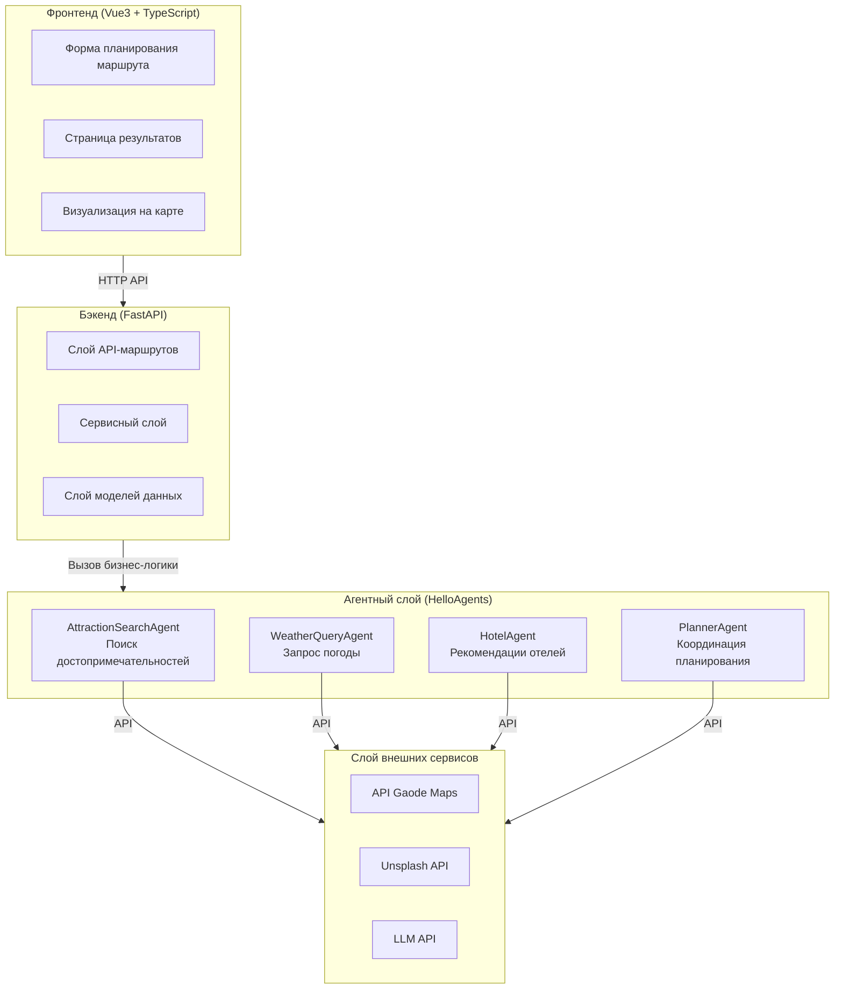
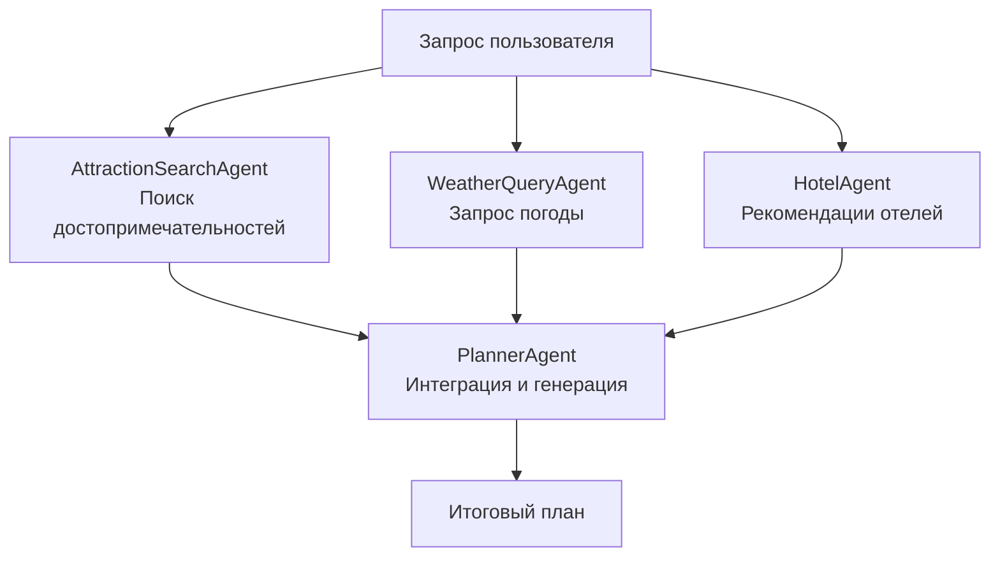
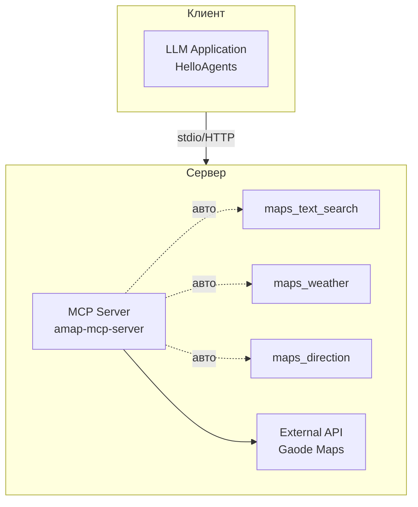
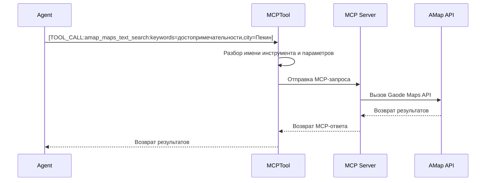

# Глава 13: Умный туристический помощник

В предыдущих главах мы с нуля построили фреймворк HelloAgents, реализовав несколько парадигм агентов, систему инструментов, механизмы памяти, протоколы коммуникации и оценку производительности. С этой главы мы переходим в совершенно новую фазу: **соединяем всё воедино и строим полноценное практическое приложение.**

Помните первого агента из главы 1? Это был простой туристический помощник, демонстрирующий базовые принципы цикла `Thought-Action-Observation`. Туристический помощник этой главы — полноценный проект, включающий следующие ключевые функции:

**(1) Умное планирование маршрута:** пользователь указывает пункт назначения, даты, предпочтения, и система автоматически генерирует полный план с достопримечательностями, ресторанами и отелями.

**(2) Визуализация на карте:** достопримечательности отмечаются на карте, маршрут прокладывается наглядно.

**(3) Расчёт бюджета:** автоматический подсчёт расходов на входные билеты, проживание, питание и транспорт с разбивкой по статьям.

**(4) Редактирование маршрута:** добавление, удаление, перестановка достопримечательностей с автоматическим обновлением карты.

**(5) Экспорт:** сохранение плана в формате PDF или изображения для удобного хранения и публикации.


## 13.1 Обзор проекта и архитектурное проектирование

### 13.1.1 Зачем нужен умный туристический помощник

Спланировать поездку — дело одновременно увлекательное и хлопотное. Нужно искать информацию о достопримечательностях, сравнивать путеводители, проверять прогноз погоды, бронировать отели, считать бюджет, прокладывать маршрут. На всё это может уйти несколько часов, а то и дней. И даже потратив столько времени, вы не уверены, разумен ли получившийся план, не пропущены ли важные места, точен ли бюджет.

У традиционного подхода к планированию поездок несколько болевых точек. Во-первых, **информация разрознена**: сведения о достопримечательностях — на туристических сайтах, погода — на метеосайтах, отели — на сайтах бронирования; нужно постоянно переключаться между ними и вручную собирать данные воедино. Во-вторых, **нет персонализации**: большинство путеводителей универсальны, они не учитывают ваши личные предпочтения, бюджет, время поездки. Наконец, **сложно корректировать** план: если захотелось что-то изменить, зачастую приходится перепланировать всё целиком — порядок объектов, время, бюджет тесно взаимосвязаны.

ИИ открывает новые возможности для решения этих проблем. Представьте: вы просто говорите системе «хочу 3 дня в Пекине, интересуюсь историей и культурой, бюджет средний» — и она автоматически строит полный маршрут: что смотреть каждый день, где обедать, в каком отеле остановиться, сколько потратить. Причём план можно корректировать: удалить неинтересный объект, изменить порядок осмотра — и система автоматически обновит карту и бюджет.

Именно такого помощника мы и строим. Это не технологическая демонстрация, а по-настоящему полезное приложение. Работая над этим проектом, вы научитесь применять ИИ к реальным задачам, проектировать мультиагентные системы и создавать полноценные веб-приложения.

### 13.1.2 Обзор технической архитектуры

Система построена по классической **архитектуре с разделением фронтенда и бэкенда** и состоит из четырёх уровней, как показано на рисунке 13.1:



*Рисунок 13.1 Техническая архитектура умного туристического помощника*

**(1) Фронтенд (Vue3 + TypeScript):** отвечает за взаимодействие с пользователем и отображение данных — заполнение форм, показ результатов, визуализация на карте.

**(2) Бэкенд (FastAPI):** отвечает за маршрутизацию API, валидацию данных, бизнес-логику.

**(3) Агентный слой (HelloAgents):** отвечает за декомпозицию задач, вызов инструментов, интеграцию результатов. Содержит 4 специализированных агента.

**(4) Слой внешних сервисов:** предоставляет данные и возможности — API Gaode Maps, Unsplash API, LLM API.

Поток данных: пользователь заполняет форму на фронтенде → бэкенд валидирует данные → вызывается агентная система → агенты последовательно запускают поиск достопримечательностей, запрос погоды, рекомендацию отелей, планирование маршрута → каждый агент вызывает внешние API по протоколу MCP → результаты интегрируются и возвращаются на фронтенд → фронтенд рендерит страницу.

Структура проекта для ориентации в исходном коде:

```
helloagents-trip-planner/
├── backend/                    # Код бэкенда
│   ├── app/
│   │   ├── agents/            # Реализации агентов
│   │   ├── api/               # Маршруты API
│   │   ├── models/            # Модели данных
│   │   ├── services/          # Сервисный слой
│   │   └── config.py          # Конфигурация
│   └── requirements.txt       # Зависимости Python
│
└── frontend/                   # Код фронтенда
    ├── src/
    │   ├── views/             # Компоненты страниц
    │   ├── services/          # Сервисы API
    │   ├── types/             # Определения типов
    │   └── router/            # Конфигурация маршрутизатора
    └── package.json           # Зависимости npm
```

Подробное описание архитектуры и потоков данных будет дано в последующих разделах.

### 13.1.3 Быстрый старт: запуск проекта за 5 минут

Прежде чем углубляться в детали реализации, давайте запустим проект и посмотрим на конечный результат. Так у вас сложится наглядное представление о системе в целом.

**Требования к окружению:**

- Python 3.10 или выше
- Node.js 16.0 или выше
- npm 8.0 или выше

**Получение API-ключей:**

Вам потребуются следующие ключи:

- API LLM (OpenAI, DeepSeek и др.)
- Web Service Key для Gaode Maps: зарегистрируйтесь на https://console.amap.com/ и создайте приложение
- Unsplash Access Key: зарегистрируйтесь на https://unsplash.com/developers и создайте приложение

Поместите все ключи в файл `.env`.

Запуск бэкенда:

```bash
# 1. Перейдите в директорию бэкенда
cd helloagents-trip-planner/backend

# 2. Установите зависимости
pip install -r requirements.txt

# 3. Настройте переменные окружения
cp .env.example .env
# Отредактируйте .env — вставьте свои API-ключи

# 4. Запустите бэкенд
uvicorn app.api.main:app --reload
# или
python run.py
```

После успешного запуска перейдите по адресу http://localhost:8000/docs — там будет документация API.

Откройте новое окно терминала:

```bash
# 1. Перейдите в директорию фронтенда
cd helloagents-trip-planner/frontend

# 2. Установите зависимости
npm install

# 3. Запустите фронтенд
npm run dev
```

После успешного запуска перейдите по адресу http://localhost:5173 — приложение готово к работе.

Знакомство с основными функциями:

На главной странице заполните форму: город назначения, даты поездки, предпочтения, бюджет, вид транспорта и тип жилья. После нажатия кнопки «Начать планирование» система отобразит индикатор загрузки, а затем откроет страницу с результатами, как показано на рисунке 13.2.

<div align="center">
  
  <p>Рисунок 13.2 Страница планирования туристического помощника</p>
</div>

После завершения загрузки страница наглядно отображает обзор маршрута, разбивку бюджета, карту достопримечательностей, подробное расписание по дням и информацию о погоде, как показано на рисунках 13.3 и 13.4.

<div align="center">
  
  <p>Рисунок 13.3 Страница с готовым планом поездки</p>
</div>

<div align="center">
  
  <p>Рисунок 13.4 Страница с готовым планом поездки</p>
</div>

Если нужна индивидуальная корректировка, нажмите кнопку «Редактировать маршрут» — можно свободно переставлять и удалять достопримечательности, как показано на рисунке 13.5. После завершения планирования в выпадающем меню «Экспорт маршрута» можно сохранить итоговый план как изображение или PDF-файл.

<div align="center">
  
  <p>Рисунок 13.5 Страница с готовым планом поездки</p>
</div>

## 13.2 Проектирование моделей данных

### 13.2.1 Поток данных в веб-приложении

При создании умного туристического помощника нужно решить одну ключевую задачу: **как представлять и передавать данные плана поездки?**

Необходимо понять, как данные движутся в полноценном веб-приложении. Что происходит, когда пользователь нажимает кнопку «Начать планирование»?

Данные формы (пункт назначения, даты, бюджет и др.) отправляются через HTTP-запрос на бэкенд-сервер. Бэкенд передаёт их в агентную систему для обработки. Агенты обращаются к Gaode Maps API, Unsplash API и другим внешним сервисам. Эти внешние API возвращают данные в разных форматах: одни используют `lng`, другие — `lon`, третьи — `longitude`. Наконец, бэкенд возвращает обработанные данные фронтенду, а тот рендерит страницу.

В этом процессе данные претерпевают множество преобразований: форма на фронтенде → HTTP-запрос → Python-объекты на бэкенде → ответы внешних API → Python-объекты на бэкенде → HTTP-ответ → TypeScript-объекты на фронтенде → отображение страницы. Без единого формата данных каждое преобразование чревато ошибками. Вот почему нам нужны **модели данных**.

### 13.2.2 От словарей к Pydantic-моделям

Вернёмся к простому прототипу из главы 1. Там мы представляли данные о достопримечательностях обычными Python-словарями:

```python
# Подход из главы 1: использование словарей
attraction = {
    "name": "Гугун",
    "location": {"lng": 116.397128, "lat": 39.916527},
    "price": 60
}

# Доступ к данным
lng = attraction["location"]["lng"]
```

Такой подход удобен на стадии прототипа, но в реальном проекте порождает множество проблем. Первая — **несогласованность имён полей**. Gaode Maps API возвращает координаты в виде строки `"116.397128,39.916527"`, которую нужно вручную разбивать на долготу и широту. Unsplash API, возможно, использует `longitude` и `latitude`. Если везде в коде применять словари, придётся обрабатывать эти расхождения в каждом месте.

Вторая проблема — **типобезопасность**. Если случайно записать `price` как строку `"60"`, Python не выдаст ошибку немедленно, но при расчёте общего бюджета что-то пойдёт не так. Хуже того, такую ошибку можно обнаружить только в процессе выполнения, а сообщение об ошибке может оказаться трудноотслеживаемым.

Наконец — **сложность сопровождения**. Когда нужно добавить новое поле (например, `rating` — рейтинг), придётся вносить изменения в множество мест кода. Если пропустить хотя бы одно — данные окажутся несогласованными.

Pydantic предлагает решение. Это библиотека валидации данных для Python, позволяющая определять структуры данных с помощью классов и автоматически обрабатывать валидацию, преобразование и сериализацию. Простой пример:

```python
from pydantic import BaseModel, Field

class Location(BaseModel):
    longitude: float = Field(..., description="Долгота")
    latitude: float = Field(..., description="Широта")

class Attraction(BaseModel):
    name: str
    location: Location
    ticket_price: int = 0

# Создание объекта
attraction = Attraction(
    name="Гугун",
    location=Location(longitude=116.397128, latitude=39.916527),
    ticket_price=60
)

# Типобезопасный доступ
lng = attraction.location.longitude  # IDE предоставляет автодополнение
```

Это даёт несколько преимуществ. Во-первых, при передаче неверного типа (например, строки вместо числа в `ticket_price`) Pydantic немедленно выбросит исключение с указанием места ошибки. Во-вторых, IDE может предоставлять автодополнение и проверку типов на основе определений классов, что значительно снижает количество опечаток. Наконец, при изменении структуры данных достаточно изменить определение класса — все места использования автоматически обновятся.

### 13.2.3 Ключевые концепции Pydantic

Прежде чем проектировать наши модели данных, разберём несколько ключевых концепций Pydantic. Основа — класс `BaseModel`; все модели данных должны наследовать от него. Для каждого поля можно указать тип, и Pydantic автоматически выполнит проверку и преобразование типов.

Поля определяются с помощью функции `Field`, которая позволяет задавать значение по умолчанию, описание, правила валидации. `...` означает, что поле обязательно; если при создании объекта оно не указано, Pydantic выбросит исключение. Для необязательных полей используется `Optional`, либо просто задаётся значение по умолчанию.

```python
from pydantic import BaseModel, Field
from typing import Optional, List

class Attraction(BaseModel):
    name: str = Field(..., description="Название достопримечательности")  # обязательное
    rating: float = Field(default=0.0, ge=0, le=5)   # значение по умолчанию, проверка диапазона
    visit_duration: int = Field(default=60, gt=0)    # больше 0
    description: Optional[str] = None               # необязательное поле
```

Pydantic поддерживает вложенные модели и списки. Одна модель может содержать другую в качестве поля, что позволяет строить сложные структуры данных. Например, достопримечательность содержит информацию о местоположении, а маршрут — список достопримечательностей.

```python
class DayPlan(BaseModel):
    date: str
    attractions: List[Attraction]   # список достопримечательностей
    hotel: Optional[Hotel] = None   # необязательная информация об отеле
```

Одна из мощнейших возможностей — **пользовательские валидаторы**. Иногда данные от внешних API не соответствуют нашим требованиям; для этого применяется декоратор `field_validator`. Например, Gaode Maps возвращает температуру в виде строки `"16°C"`, которую нужно преобразовать в число:

```python
from pydantic import field_validator

class WeatherInfo(BaseModel):
    temperature: int
    
    @field_validator('temperature', mode='before')
    def parse_temperature(cls, v):
        """Разбор строки с температурой: "16°C" -> 16"""
        if isinstance(v, str):
            v = v.replace('°C', '').replace('℃', '').strip()
            return int(v)
        return v
```

Этот валидатор выполняется автоматически до создания объекта, преобразуя строку в целое число. Благодаря этому не нужно обрабатывать формат температуры в каждом месте кода.

### 13.2.4 Проектирование моделей снизу вверх

Теперь приступим к проектированию моделей данных для туристического помощника. Хороший принцип дизайна — **снизу вверх**: сначала определяются базовые модели, затем постепенно строятся более сложные структуры. Это делает каждую модель простой, понятной и удобной в сопровождении.

Базовая модель — **информация о местоположении**. Любой объект — достопримечательность, отель, ресторан — нуждается в координатах. Определим класс `Location` для представления географических координат:

```python
class Location(BaseModel):
    """Информация о местоположении (географические координаты)"""
    longitude: float = Field(..., description="Долгота", ge=-180, le=180)
    latitude: float = Field(..., description="Широта", ge=-90, le=90)
```

Здесь используется проверка диапазона (`ge` — больше или равно, `le` — меньше или равно), гарантирующая корректность значений координат.

Следующая модель — **информация о достопримечательности**. Достопримечательность включает название, адрес, координаты, рекомендуемое время посещения, описание, рейтинг, фотографию и стоимость билета. Обратите внимание: `Location` используется как тип поля — это и есть вложенная модель:

```python
class Attraction(BaseModel):
    """Информация о достопримечательности"""
    name: str = Field(..., description="Название")
    address: str = Field(..., description="Адрес")
    location: Location = Field(..., description="Географические координаты")
    visit_duration: int = Field(..., description="Рекомендуемое время посещения (минуты)", gt=0)
    description: str = Field(..., description="Описание")
    category: Optional[str] = Field(default="Достопримечательность", description="Категория")
    rating: Optional[float] = Field(default=None, ge=0, le=5, description="Рейтинг")
    image_url: Optional[str] = Field(default=None, description="URL фотографии")
    ticket_price: int = Field(default=0, ge=0, description="Цена билета (руб.)")
```

Аналогично определяются **информация о питании** и **информация об отеле**. Структура этих моделей схожа: название, адрес, координаты, стоимость:

```python
class Meal(BaseModel):
    """Информация о питании"""
    type: str = Field(..., description="Тип питания: breakfast/lunch/dinner/snack")
    name: str = Field(..., description="Название заведения")
    address: Optional[str] = Field(default=None, description="Адрес")
    location: Optional[Location] = Field(default=None, description="Координаты")
    description: Optional[str] = Field(default=None, description="Описание")
    estimated_cost: int = Field(default=0, description="Ориентировочная стоимость (руб.)")

class Hotel(BaseModel):
    """Информация об отеле"""
    name: str = Field(..., description="Название отеля")
    address: str = Field(default="", description="Адрес")
    location: Optional[Location] = Field(default=None, description="Координаты")
    price_range: str = Field(default="", description="Ценовой диапазон")
    rating: str = Field(default="", description="Рейтинг")
    distance: str = Field(default="", description="Расстояние до достопримечательностей")
    type: str = Field(default="", description="Тип отеля")
    estimated_cost: int = Field(default=0, description="Ориентировочная стоимость (руб./ночь)")
```

**Информация о бюджете** — особая модель: вместо координат она содержит сводку расходов по статьям:

```python
class Budget(BaseModel):
    """Информация о бюджете"""
    total_attractions: int = Field(default=0, description="Суммарные расходы на билеты")
    total_hotels: int = Field(default=0, description="Суммарные расходы на проживание")
    total_meals: int = Field(default=0, description="Суммарные расходы на питание")
    total_transportation: int = Field(default=0, description="Суммарные расходы на транспорт")
    total: int = Field(default=0, description="Итого")
```

Теперь из базовых моделей собирается **однодневный маршрут**. Он включает дату, описание, вид транспорта, условия проживания, отель, список достопримечательностей и список приёмов пищи:

```python
class DayPlan(BaseModel):
    """Однодневный маршрут"""
    date: str = Field(..., description="Дата")
    day_index: int = Field(..., description="Номер дня (начиная с 0)")
    description: str = Field(..., description="Описание дня")
    transportation: str = Field(..., description="Вид транспорта")
    accommodation: str = Field(..., description="Условия проживания")
    hotel: Optional[Hotel] = Field(default=None, description="Информация об отеле")
    attractions: List[Attraction] = Field(default_factory=list, description="Список достопримечательностей")
    meals: List[Meal] = Field(default_factory=list, description="Питание")
```

Обратите внимание: `List[Attraction]` — это список достопримечательностей; `default_factory=list` задаёт пустой список по умолчанию.

**Информация о погоде** требует особой обработки, поскольку Gaode Maps возвращает температуру в нестандартном формате. Используем пользовательский валидатор:

```python
class WeatherInfo(BaseModel):
    """Информация о погоде"""
    date: str = Field(..., description="Дата")
    day_weather: str = Field(..., description="Погода днём")
    night_weather: str = Field(..., description="Погода ночью")
    day_temp: int = Field(..., description="Температура днём (°C)")
    night_temp: int = Field(..., description="Температура ночью (°C)")
    wind_direction: str = Field(..., description="Направление ветра")
    wind_power: str = Field(..., description="Сила ветра")
    
    @field_validator('day_temp', 'night_temp', mode='before')
    def parse_temperature(cls, v):
        """Разбор строки с температурой: "16°C" -> 16"""
        if isinstance(v, str):
            v = v.replace('°C', '').replace('℃', '').replace('°', '').strip()
            try:
                return int(v)
            except ValueError:
                return 0  # обработка ошибок
        return v
```

Наконец, определяем **полный план поездки** — модель верхнего уровня, объединяющую все данные:

```python
class TripPlan(BaseModel):
    """План поездки"""
    city: str = Field(..., description="Город назначения")
    start_date: str = Field(..., description="Дата начала")
    end_date: str = Field(..., description="Дата окончания")
    days: List[DayPlan] = Field(default_factory=list, description="Маршрут по дням")
    weather_info: List[WeatherInfo] = Field(default_factory=list, description="Погода")
    overall_suggestions: str = Field(..., description="Общие рекомендации")
    budget: Optional[Budget] = Field(default=None, description="Бюджет")
```

Так завершается проектирование всей системы моделей данных. От базовой `Location` — к `Attraction`, `Meal`, `Hotel`, затем к `DayPlan` и наконец к `TripPlan`: чёткая иерархическая структура.

### 13.2.5 Применение моделей данных в веб-приложении

Посмотрим, как эти модели используются в реальном веб-приложении. В FastAPI модели Pydantic можно непосредственно применять для типизации запросов и ответов. FastAPI автоматически выполняет валидацию данных, сериализацию и генерацию документации.

```python
from fastapi import FastAPI
from app.models.schemas import TripPlanRequest, TripPlan

app = FastAPI()

@app.post("/api/trip/plan", response_model=TripPlan)
async def create_trip_plan(request: TripPlanRequest) -> TripPlan:
    """
    Создание плана поездки
    
    FastAPI автоматически:
    1. Валидирует данные запроса (TripPlanRequest)
    2. Валидирует данные ответа (TripPlan)
    3. Генерирует документацию OpenAPI
    """
    trip_plan = await generate_trip_plan(request)
    return trip_plan
```

Когда пользователь отправляет POST-запрос на `/api/trip/plan`, FastAPI автоматически преобразует JSON в объект `TripPlanRequest`. Если формат данных некорректен (отсутствует обязательное поле или несовпадение типов), FastAPI автоматически вернёт ошибку 400 с указанием места ошибки.

На фронтенде тоже нужно определить соответствующие TypeScript-типы. Хотя TypeScript и Python — разные языки, структуры данных у них одинаковые:

```typescript
interface Location {
  longitude: number;
  latitude: number;
}

interface Attraction {
  name: string;
  address: string;
  location: Location;
  visit_duration: number;
  ticket_price: number;
}

interface TripPlan {
  city: string;
  start_date: string;
  end_date: string;
  days: DayPlan[];
}
```

Теперь фронтенд и бэкенд используют единый формат данных. Когда бэкенд возвращает объект `TripPlan`, фронтенд может использовать его напрямую без каких-либо преобразований. Проверка типов TypeScript также помогает избежать многих ошибок.

## 13.3 Проектирование взаимодействия мультиагентной системы

### 13.3.1 Зачем нужны несколько агентов

В главе 7 мы изучили, как строить агентов с помощью SimpleAgent. Концепция SimpleAgent проста и понятна: при каждом вызове метода `run()` агент анализирует вопрос пользователя, решает, нужен ли вызов инструмента, и возвращает результат. Такой подход очень эффективен для простых задач, но при решении задачи планирования путешествия возникают сложности.

Представьте одного агента, который должен выполнить всё планирование. Что ему нужно делать? Сначала искать информацию о достопримечательностях — для этого нужен инструмент поиска POI в Gaode Maps. Затем запрашивать погоду — нужен инструмент погодных запросов. Потом искать отели — снова инструмент поиска POI. Наконец, объединять всё это в полный план поездки.

Звучит просто, но на практике возникает первая проблема: **ограничение вызовов инструментов**. SimpleAgent за один вызов `run()` может выполнить только один инструмент. Значит, нужно вызывать `run()` несколько раз, обрабатывая одну задачу за раз. Но это порождает новую проблему: как передавать информацию между вызовами? Как результаты поиска достопримечательностей из первого вызова передать во второй? Придётся вручную управлять промежуточными результатами — код становится крайне сложным.

Конечно, можно использовать ReactAgent для решения этой проблемы. ReactAgent за один вызов может выполнить несколько инструментов, автоматически проводя многораундовые рассуждения и действия. Но это порождает новую проблему: **временны́е затраты**. Каждый раунд рассуждений ReactAgent требует обращения к LLM. Три инструмента — минимум три раунда рассуждений, то есть минимум три вызова LLM. Причём все они последовательны: каждый следующий ждёт завершения предыдущего. Суммарное время значительно возрастает.

Вторая проблема — **сложность промптов**. Если один агент должен выполнить все задачи, промпт обязан подробно описывать логику каждой из них. Например:

```python
COMPLEX_PROMPT = """Ты — ассистент по планированию путешествий. Тебе нужно:
1. Использовать maps_text_search для поиска достопримечательностей; ключевые слова определяются по предпочтениям пользователя
2. Использовать maps_weather для получения прогноза погоды на несколько дней
3. Использовать maps_text_search для поиска отелей; тип определяется требованиями пользователя
4. Интегрировать все данные в план поездки с расписанием по дням, питанием и проживанием
Важно: выполнять строго по порядку, каждый инструмент вызывать только один раз, вывод — в формате JSON...
"""
```

У такого промпта несколько проблем. Во-первых, **сложность сопровождения**: изменить логику поиска достопримечательностей (например, добавить фильтрацию по рейтингу) означает изменить весь промпт, что легко затронет другие части. Во-вторых, **вероятность ошибок**: LLM нужно одновременно понять требования нескольких задач, и она легко может запутать форматы и параметры. Наконец, **сложность отладки**: когда план не соответствует ожиданиям, трудно понять, на каком этапе произошёл сбой — поиск достопримечательностей, погодный запрос или логика интеграции?

Перед лицом этих проблем естественным образом возникает идея: а нельзя ли разложить сложную задачу на несколько простых и дать каждому агенту свою специализацию? Это и есть ключевая идея мультиагентного взаимодействия.

Представьте себе реальное туристическое агентство. Когда вы приходите за помощью в планировании поездки, вами занимается не один человек. Обычно есть специалист по достопримечательностям, специалист по отелям и координатор маршрута, который собирает всё воедино. Каждый сосредоточен на своей области, а в итоге координатор объединяет всю информацию. Такое разделение труда значительно эффективнее, чем если бы один человек делал всё.

### 13.3.2 Проектирование ролей агентов

На основе принципа декомпозиции задач мы спроектировали четыре специализированных агента, как показано на рисунке 13.6:



*Рисунок 13.6 Процесс взаимодействия мультиагентной системы*

- **AttractionSearchAgent (специалист по поиску достопримечательностей)** специализируется на поиске информации о достопримечательностях. Он понимает предпочтения пользователя (например, «история и культура», «природные пейзажи»), вызывает инструмент POI-поиска Gaode Maps и возвращает список подходящих мест. Его промпт прост: как выбирать ключевые слова по предпочтениям и как вызывать инструмент.

- **WeatherQueryAgent (специалист по погоде)** специализируется на получении погодной информации. Ему нужно только название города; он вызывает инструмент погодного запроса и возвращает прогноз на несколько дней. Задача предельно чёткая, почти без вероятности ошибки.

- **HotelAgent (специалист по отелям)** специализируется на поиске гостиниц. Он понимает требования пользователя к проживанию (например, «эконом», «люкс»), вызывает инструмент POI-поиска и возвращает список подходящих отелей.

- **PlannerAgent (специалист по маршрутам)** отвечает за интеграцию всей информации. Он получает результаты трёх предыдущих агентов плюс исходные требования пользователя (даты, бюджет и т.д.) и генерирует полный план поездки. Ему не нужно вызывать внешние инструменты — он полностью сосредоточен на интеграции информации и составлении расписания.

Теперь детально спроектируем роль и промпт каждого агента. При разработке промптов нужно учитывать несколько ключевых вопросов: какие входные данные нужны этому агенту? Какой результат он должен выдавать? Какие инструменты ему нужны? С какими проблемами он может столкнуться?

Задача **AttractionSearchAgent** — искать достопримечательности по предпочтениям пользователя. На входе — название города и предпочтения («история и культура», «природные пейзажи»). Агент вызывает инструмент `amap_maps_text_search` с параметрами «ключевые слова» и «город». На выходе — список достопримечательностей с названиями, адресами, рейтингами.

```python
ATTRACTION_AGENT_PROMPT = """Ты — специалист по поиску достопримечательностей.

**Формат вызова инструмента:**
`[TOOL_CALL:amap_maps_text_search:keywords=достопримечательности,city=город]`

**Примеры:**
- `[TOOL_CALL:amap_maps_text_search:keywords=достопримечательности,city=Пекин]`
- `[TOOL_CALL:amap_maps_text_search:keywords=музеи,city=Шанхай]`

**Важно:**
- Обязательно используй инструмент, не выдумывай информацию
- Ищи достопримечательности в {city} по предпочтениям пользователя ({preferences})
"""
```

Этот промпт лаконичен, но содержит всё необходимое: явный формат вызова инструмента, конкретные примеры и два важных принципа — обязательное использование инструмента и учёт предпочтений пользователя.

Задача **WeatherQueryAgent** ещё проще: только запросить погоду. На входе — название города, на выходе — погодная информация.

```python
WEATHER_AGENT_PROMPT = """Ты — специалист по погодным запросам.

**Формат вызова инструмента:**
`[TOOL_CALL:amap_maps_weather:city=город]`

Запроси погоду в {city}.
"""
```

Задача **HotelAgent** — поиск отелей. На входе — название города и тип жилья, на выходе — список отелей.

```python
HOTEL_AGENT_PROMPT = """Ты — специалист по рекомендациям отелей.

**Формат вызова инструмента:**
`[TOOL_CALL:amap_maps_text_search:keywords=отель,city=город]`

Найди {accommodation}-отели в {city}.
"""
```

**PlannerAgent** самый сложный, поскольку должен интегрировать все данные. На входе — запрос пользователя и результаты трёх предыдущих агентов; на выходе — полный план поездки в формате JSON.

```python
PLANNER_AGENT_PROMPT = """Ты — специалист по планированию маршрутов.

**Формат вывода:**
Строго возвращай данные в следующем JSON-формате:
{
  "city": "название города",
  "start_date": "YYYY-MM-DD",
  "end_date": "YYYY-MM-DD",
  "days": [...],
  "weather_info": [...],
  "overall_suggestions": "общие рекомендации",
  "budget": {...}
}

**Требования к планированию:**
1. weather_info должен содержать погоду на каждый день
2. Температура — только число (без °C)
3. На каждый день планировать 2–3 достопримечательности
4. Учитывать расстояния между объектами и время посещения
5. Включать завтрак, обед и ужин
6. Давать практические советы
7. Включать информацию о бюджете
"""
```

### 13.3.3 Процесс взаимодействия агентов

Посмотрим, как четыре агента взаимодействуют для выполнения задачи планирования поездки. Весь процесс делится на пять шагов:

```python
class TripPlannerAgent:
    def __init__(self):
        self.attraction_agent = SimpleAgent(name="Поиск достопримечательностей", prompt=ATTRACTION_PROMPT)
        self.weather_agent = SimpleAgent(name="Запрос погоды", prompt=WEATHER_PROMPT)
        self.hotel_agent = SimpleAgent(name="Рекомендации отелей", prompt=HOTEL_PROMPT)
        self.planner_agent = SimpleAgent(name="Планирование маршрута", prompt=PLANNER_PROMPT)

    def plan_trip(self, request: TripPlanRequest) -> TripPlan:
        # Шаг 1: Поиск достопримечательностей
        attraction_response = self.attraction_agent.run(
            f"Найди достопримечательности в {request.city} по предпочтению: {request.preferences}"
        )

        # Шаг 2: Запрос погоды
        weather_response = self.weather_agent.run(
            f"Запроси погоду в {request.city}"
        )

        # Шаг 3: Рекомендации отелей
        hotel_response = self.hotel_agent.run(
            f"Найди {request.accommodation}-отели в {request.city}"
        )

        # Шаг 4: Интеграция и генерация плана
        planner_query = self._build_planner_query(
            request, attraction_response, weather_response, hotel_response
        )
        planner_response = self.planner_agent.run(planner_query)

        # Шаг 5: Разбор JSON
        trip_plan = self._parse_trip_plan(planner_response)
        return trip_plan
```

Этот процесс последовательно выполняет четыре шага; результат каждого шага служит входом для следующего. Обратите внимание: используются модели Pydantic `TripPlanRequest` и `TripPlan`, определённые в разделе 13.2.

### 13.3.4 Построение запроса

PlannerAgent должен интегрировать все данные; его запрос должен содержать всю необходимую информацию, организованную чётко и понятно, чтобы LLM мог точно её интерпретировать.

```python
def _build_planner_query(
    self,
    request: TripPlanRequest,
    attraction_response: str,
    weather_response: str,
    hotel_response: str
) -> str:
    """Построение запроса для агента-планировщика"""
    return f"""
Составь план поездки в {request.city} на {request.days} дней на основе следующих данных:

**Запрос пользователя:**
- Пункт назначения: {request.city}
- Даты: {request.start_date} — {request.end_date}
- Длительность: {request.days} дней
- Предпочтения: {request.preferences}
- Бюджет: {request.budget}
- Транспорт: {request.transportation}
- Тип жилья: {request.accommodation}

**Достопримечательности:**
{attraction_response}

**Погода:**
{weather_response}

**Отели:**
{hotel_response}

Составь подробный план поездки с расписанием по дням, рекомендациями по питанию, информацией о проживании и разбивкой бюджета.
"""
```

Благодаря такому мультиагентному взаимодействию сложная задача планирования поездки декомпозируется на четыре простых подзадачи. Каждый агент сосредоточен на своей области, а архитектура создаёт хорошую основу для будущего расширения функциональности (например, добавление агента-рекомендатора ресторанов или агента транспортного планирования).

## 13.4 Подробное описание интеграции MCP-инструментов

### 13.4.1 Почему не вызывать API напрямую

В разделе 13.3 мы спроектировали четыре агента для совместного планирования поездки. AttractionSearchAgent, WeatherQueryAgent и HotelAgent — все они обращаются к Gaode Maps API. Возникает закономерный вопрос: почему бы не вызывать HTTP API Gaode Maps напрямую из агента?

Посмотрим, как выглядит прямой вызов API. Gaode Maps предоставляет API поиска POI; нужно сформировать HTTP-запрос, передать параметры, разобрать ответ:

```python
import requests

def search_poi(keywords: str, city: str, api_key: str):
    """Прямой вызов API поиска POI от Gaode Maps"""
    url = "https://restapi.amap.com/v3/place/text"
    params = {
        "keywords": keywords,
        "city": city,
        "key": api_key,
        "output": "json"
    }
    response = requests.get(url, params=params)
    data = response.json()
    return data
```

Выглядит просто, но на практике порождает ряд проблем. Во-первых, **агент теряет автономию**. В нашем фреймворке HelloAgents агент вызывает инструменты, распознавая специальные маркеры в промпте (например, `[TOOL_CALL:tool_name:arg1=value1]`). При прямом вызове API в коде агент лишается способности самостоятельно принимать решения — он превращается в обычный вызов функции.

Во-вторых, **сложная передача параметров**. У Gaode Maps API множество параметров: для поиска POI есть `keywords`, `city`, `types`, `offset`, `page` и более десятка других. Чтобы агент мог гибко ими пользоваться, придётся в промпте подробно описывать каждый параметр — промпт становится чрезвычайно громоздким.

В-третьих, **сложность разбора ответов**. Gaode Maps API возвращает данные в JSON-формате со сложной структурой. Нужно писать код для их разбора и извлечения нужных полей. При изменении формата ответа придётся менять код разбора.

Наконец, **неупорядоченное управление инструментами**. Gaode Maps предоставляет более десятка различных API (поиск POI, погода, маршруты и др.). Написание отдельной функции для каждого и ручная регистрация в списке инструментов агента делает код громоздким. Добавление нового API требует изменений в нескольких местах.

### 13.4.2 Интеграция MCP с Gaode Maps

MCP (Model Context Protocol) — стандартизированный протокол компании Anthropic для связи LLM с внешними инструментами. В данном разделе рассматривается интеграция MCP-сервера Gaode Maps в проект. Мы используем `amap-mcp-server` — MCP-сервер, реализованный на Node.js:



*Рисунок 13.7 Инструменты amap-mcp-server*

MCP-сервер Gaode Maps предоставляет несколько категорий инструментов, как показано в таблице 13.1:

| Категория | Инструмент | Функция |
|-----------|-----------|---------|
| POI-поиск | `amap_maps_text_search` | Текстовый поиск POI |
| POI-поиск | `amap_maps_search_detail` | Детальная информация POI |
| POI-поиск | `amap_maps_around_search` | Поиск поблизости |
| Прокладка маршрута | `amap_maps_direction_walking_by_address` | Пеший маршрут |
| Прокладка маршрута | `amap_maps_direction_driving_by_address` | Автомобильный маршрут |
| Прокладка маршрута | `amap_maps_direction_transit_integrated_by_address` | Маршрут общественным транспортом |
| Погода | `amap_maps_weather` | Запрос погоды |
| Геокодирование | `amap_maps_geocode` | Адрес → координаты |
| Геокодирование | `amap_maps_regeocode` | Координаты → адрес |

*Таблица 13.1 Категории инструментов MCP Gaode Maps*

Интеграция в HelloAgents через протокол MCP очень удобна:

```python
from hello_agents.tools import MCPTool
from app.config import get_settings

settings = get_settings()

# Создание MCP-инструмента
mcp_tool = MCPTool(
    name="amap_mcp",
    command="npx",
    args=["-y", "@sugarforever/amap-mcp-server"],
    env={"AMAP_API_KEY": settings.amap_api_key},
    auto_expand=True
)
```

Что делает этот код? `command` и `args` указывают, как запустить MCP-сервер. Команда `npx -y @sugarforever/amap-mcp-server` скачает и запустит пакет `amap-mcp-server` из npm. Параметр `env` передаёт переменные окружения — в данном случае API-ключ Gaode Maps.

**Примечание:** в части примеров этого раздела для запуска MCP (Model Context Protocol) сервисов используется `npx`. В репозитории с кодом к данной главе реально применяется `uvx`. Стоит отметить, что концептуально `npx` и `uvx` идентичны: разница только в экосистеме — `npx` предназначен для JavaScript/Node.js (пакеты из npm), а `uvx` — для Python (пакеты из PyPI). Оба подхода равнозначны, выбор остаётся за вами.

При создании объекта `MCPTool` в фоне запускается процесс MCP-сервера, а связь с ним осуществляется через стандартные потоки ввода-вывода (stdin/stdout). Это особенность протокола MCP: межпроцессное взаимодействие вместо HTTP — более эффективное и удобное в управлении.

Ключевой параметр — `auto_expand=True`. При его установке `MCPTool` автоматически запрашивает у MCP-сервера список доступных инструментов и создаёт отдельный объект Tool для каждого из них. Поэтому мы создаём один `MCPTool`, а агент получает 16 инструментов:

```python
# Создаём один MCPTool
mcp_tool = MCPTool(..., auto_expand=True)
agent.add_tool(mcp_tool)

# Агент на самом деле получает 16 инструментов!
print(list(agent.tools.keys()))
# ['amap_maps_text_search', 'amap_maps_weather', ...]
```

Рассмотрим пример: пользователь хочет найти достопримечательности в Пекине. AttractionSearchAgent получает запрос «Найди исторические и культурные достопримечательности в Пекине». Агент анализирует запрос и решает вызвать инструмент `amap_maps_text_search` с параметрами `keywords=достопримечательности, city=Пекин`.



*Рисунок 13.8 Процесс вызова MCP-инструментов*

Агент генерирует маркер вызова инструмента: `[TOOL_CALL:amap_maps_text_search:keywords=достопримечательности,city=Пекин]`. Фреймворк HelloAgents разбирает этот маркер, извлекает имя инструмента и параметры, затем вызывает соответствующий объект Tool.

Объект Tool создан автоматически `MCPTool` и отправляет запрос MCP-серверу. Конкретно — формирует сообщение в формате JSON-RPC и передаёт его через stdin:

```json
{
  "jsonrpc": "2.0",
  "method": "tools/call",
  "params": {
    "name": "amap_maps_text_search",
    "arguments": {
      "keywords": "достопримечательности",
      "city": "Пекин"
    }
  }
}
```

MCP-сервер получает сообщение, разбирает параметры и вызывает HTTP API Gaode Maps: формирует запрос, добавляет ключ API, отправляет, получает ответ.

Gaode Maps API возвращает данные в формате JSON со списком достопримечательностей, адресами, координатами и другой информацией. MCP-сервер разбирает эти данные, извлекает ключевые поля и формирует ответное сообщение, которое через stdout возвращается в `MCPTool`:

```json
{
  "jsonrpc": "2.0",
  "result": {
    "content": [
      {
        "type": "text",
        "text": "Найдены следующие достопримечательности:\n1. Запретный город — адрес: улица Цзиншань, 4, р-н Дунчэн\n2. Храм Неба — адрес: улица Тяньтань, р-н Дунчэн\n..."
      }
    ]
  }
}
```

`MCPTool` получает ответ, извлекает текстовое содержимое и возвращает его агенту. Агент использует этот результат как вывод вызова инструмента и продолжает генерацию итогового ответа.

Процесс выглядит сложным, но для агента всё сводится к знанию: «есть инструмент `amap_maps_text_search` для поиска достопримечательностей». Все низкоуровневые детали инкапсулированы в протоколе MCP и `MCPTool`.

### 13.4.3 Совместное использование MCP-экземпляра

В нашей мультиагентной системе три агента используют инструменты Gaode Maps. Должен ли каждый создавать собственный экземпляр `MCPTool`, или они могут совместно использовать один?

Если каждый агент создаёт свой `MCPTool`, одновременно будут работать три серверных процесса. Каждый будет независимо обращаться к API Gaode Maps, что может превысить лимиты запросов. К тому же несколько процессов потребляют больше памяти и процессорного времени.

Лучшее решение — совместное использование одного экземпляра `MCPTool`. Запускается один MCP-серверный процесс, через который проходят все запросы к API. Это не только экономит ресурсы, но и позволяет лучше контролировать частоту запросов.

В коде мы создаём один экземпляр `MCPTool` в конструкторе `TripPlannerAgent` и добавляем его в список инструментов каждого субагента:

```python
class TripPlannerAgent:
    def __init__(self):
        settings = get_settings()
        self.llm = HelloAgentsLLM()

        # Создание общего MCP-инструмента (один раз)
        self.mcp_tool = MCPTool(
            name="amap_mcp",
            command="npx",
            args=["-y", "@sugarforever/amap-mcp-server"],
            env={"AMAP_API_KEY": settings.amap_api_key},
            auto_expand=True
        )

        # Создание нескольких агентов с общим MCP-инструментом
        self.attraction_agent = SimpleAgent(
            name="AttractionSearchAgent",
            llm=self.llm,
            system_prompt=ATTRACTION_AGENT_PROMPT
        )
        self.attraction_agent.add_tool(self.mcp_tool)  # общий

        self.weather_agent = SimpleAgent(
            name="WeatherQueryAgent",
            llm=self.llm,
            system_prompt=WEATHER_AGENT_PROMPT
        )
        self.weather_agent.add_tool(self.mcp_tool)  # общий

        self.hotel_agent = SimpleAgent(
            name="HotelAgent",
            llm=self.llm,
            system_prompt=HOTEL_AGENT_PROMPT
        )
        self.hotel_agent.add_tool(self.mcp_tool)  # общий
```

Таким образом, все три агента получают доступ к 16 инструментам Gaode Maps, при этом в фоне работает только один MCP-серверный процесс. При вызове метода `plan_trip` трое агентов последовательно вызывают инструменты, и все запросы проходят через единый MCP-сервер к API Gaode Maps.

### 13.4.4 Интеграция с API Unsplash для получения фотографий

Помимо Gaode Maps, нам нужны фотографии достопримечательностей, чтобы план поездки выглядел живо и наглядно. Для поиска изображений мы используем Unsplash API. Стоит учитывать, что Unsplash — зарубежный сервис, и результаты поиска могут быть не вполне точными для отдельных объектов. В реальном проекте можно рассмотреть API изображений от Bing, Baidu или POI-фотографии Gaode Maps, но эти сервисы обычно платные.

Интеграция Unsplash API достаточно проста: создадим класс `UnsplashService`, инкапсулирующий вызовы API:

```python
# backend/app/services/unsplash_service.py
import requests
from typing import Optional, List, Dict
import logging

logger = logging.getLogger(__name__)

class UnsplashService:
    """Сервис для работы с изображениями Unsplash"""

    def __init__(self, access_key: str):
        self.access_key = access_key
        self.base_url = "https://api.unsplash.com"

    def search_photos(self, query: str, per_page: int = 10) -> List[Dict]:
        """Поиск изображений"""
        try:
            url = f"{self.base_url}/search/photos"
            params = {
                "query": query,
                "per_page": per_page,
                "client_id": self.access_key
            }

            response = requests.get(url, params=params, timeout=10)
            response.raise_for_status()

            data = response.json()
            results = data.get("results", [])

            # Извлечение URL изображений
            photos = []
            for result in results:
                photos.append({
                    "url": result["urls"]["regular"],
                    "description": result.get("description", ""),
                    "photographer": result["user"]["name"]
                })

            return photos

        except Exception as e:
            logger.error(f"Ошибка при поиске изображений: {e}")
            return []

    def get_photo_url(self, query: str) -> Optional[str]:
        """Получить URL одного изображения"""
        photos = self.search_photos(query, per_page=1)
        return photos[0].get("url") if photos else None
```

Этот сервис предоставляет два метода: `search_photos` ищет несколько изображений, `get_photo_url` возвращает URL одного. В маршрутах API мы используем этот сервис, чтобы добавить фотографии к каждой достопримечательности:

```python
# backend/app/api/routes/trip.py
from app.services.unsplash_service import UnsplashService

unsplash_service = UnsplashService(settings.unsplash_access_key)

@router.post("/plan", response_model=TripPlan)
async def create_trip_plan(request: TripPlanRequest) -> TripPlan:
    # Генерация плана поездки
    trip_plan = trip_planner_agent.plan_trip(request)

    # Добавление фотографий к каждой достопримечательности
    for day in trip_plan.days:
        for attraction in day.attractions:
            if not attraction.image_url:
                image_url = unsplash_service.get_photo_url(
                    f"{attraction.name} {trip_plan.city}"
                )
                attraction.image_url = image_url

    return trip_plan
```

Обратите внимание: Unsplash не обёрнут в Tool или MCP-инструмент — он вызывается напрямую из маршрута API. Поиск изображений не требует интеллектуального решения агента; это простой шаг обогащения данных. Если нужно, чтобы агент мог самостоятельно решать, добавлять ли изображения или выбирать из разных источников, — обёртку в Tool создать несложно.

## 13.5 Подробное описание разработки фронтенда

### 13.5.1 Архитектура веб-приложения с разделением фронтенда и бэкенда

Прежде чем приступить к разработке фронтенда, необходимо понять архитектурные паттерны современных веб-приложений. В ранних веб-разработках фронтенд и бэкенд были смешаны вместе — как в PHP или JSP, где HTML-шаблоны и бизнес-логика находились в одном файле. Это удобно в небольших проектах, но в крупных создаёт множество проблем: фронтенд- и бэкенд-разработчикам приходится постоянно согласовывать работу, код плохо переиспользуется, тестирование затруднено.

Современные веб-приложения повсеместно используют **разделение фронтенда и бэкенда**. Бэкенд предоставляет только API-интерфейсы, возвращая данные в формате JSON. Фронтенд — самостоятельное приложение, которое получает данные через HTTP-запросы к бэкенду и рендерит страницу. Эта архитектура имеет очевидные преимущества: фронтенд и бэкенд можно разрабатывать, развёртывать и тестировать независимо; фронтенд может быть веб-приложением, мобильным или десктопным приложением — все они используют один бэкенд API; на фронтенде можно применять современные фреймворки и инструменты, обеспечивая лучший пользовательский опыт.

В нашем проекте бэкенд написан на Python с FastAPI и предоставляет один основной API-эндпоинт `POST /api/trip/plan`, принимающий запрос на поездку и возвращающий план. Фронтенд написан на Vue 3 с TypeScript и является одностраничным приложением (SPA): пользователь заполняет форму, нажимает «Начать планирование», фронтенд отправляет HTTP-запрос бэкенду, ожидает ответа и рендерит страницу с результатами. Страница при этом не перезагружается — пользовательский опыт остаётся плавным.

Выбор стека технологий для фронтенда определяется несколькими факторами: скоростью разработки, производительностью, экосистемой, порогом входа. Как показано в таблице 13.2, в проекте выбран следующий стек:

| Технология | Назначение |
|-----------|-----------|
| Vue 3 | Фреймворк фронтенда (Composition API) |
| TypeScript | Типобезопасность |
| Vite | Инструмент сборки |
| Ant Design Vue | Библиотека UI-компонентов |
| Axios | HTTP-клиент |
| Vue Router | Управление маршрутизацией |
| @amap/amap-jsapi-loader | Загрузчик Gaode Maps |
| html2canvas | Экспорт в изображение |
| jspdf | Экспорт в PDF |

*Таблица 13.2 Стек технологий фронтенда*

Структура директорий проекта:

```
frontend/
├── src/
│   ├── views/              # Компоненты страниц
│   │   ├── Home.vue        # Главная страница (форма)
│   │   └── Result.vue      # Страница результатов
│   ├── services/           # Сервисы API
│   │   └── api.ts
│   ├── types/              # Определения типов
│   │   └── index.ts
│   ├── router/             # Конфигурация маршрутизатора
│   │   └── index.ts
│   ├── App.vue
│   └── main.ts
├── package.json
├── vite.config.ts
└── tsconfig.json
```

Директория `views` содержит компоненты страниц, `services` — логику вызовов API, `types` — определения TypeScript-типов, `router` — конфигурацию маршрутизатора.

### 13.5.2 Определения типов

В разделе 13.2 мы определили модели данных на бэкенде с помощью Pydantic: `Location`, `Attraction`, `DayPlan`, `TripPlan` и др. На фронтенде нужно определить соответствующие TypeScript-типы.

Начнём с базового типа `Location` для координат:

```typescript
// frontend/src/types/index.ts
export interface Location {
  longitude: number
  latitude: number
}
```

Это определение типа полностью соответствует модели Pydantic на бэкенде. Обратите внимание: TypeScript использует ключевое слово `interface`, поля разделяются двоеточием, значения по умолчанию не нужны.

Далее — тип `Attraction` для достопримечательности:

```typescript
export interface Attraction {
  name: string
  address: string
  location: Location
  visit_duration: number
  description: string
  category?: string
  rating?: number
  image_url?: string
  ticket_price?: number
}
```

Здесь `Location` используется как тип поля — это вложенный тип. Знак вопроса `?` обозначает необязательные поля, что соответствует `Optional` в Pydantic-модели на бэкенде.

Аналогично определяются `Meal`, `Hotel`, `Budget`, `WeatherInfo` и другие типы. Наконец — тип верхнего уровня `TripPlan`:

```typescript
export interface TripPlan {
  city: string
  start_date: string
  end_date: string
  days: DayPlan[]
  weather_info: WeatherInfo[]
  overall_suggestions: string
  budget?: Budget
}
```

И тип запроса `TripPlanRequest`, соответствующий модели запроса на бэкенде:

```typescript
export interface TripPlanRequest {
  city: string
  start_date: string
  end_date: string
  days: number
  preferences: string
  budget: string
  transportation: string
  accommodation: string
}
```

Зачем нужны эти определения типов? Во-первых, при вызове API TypeScript проверяет, соответствуют ли передаваемые данные типу `TripPlanRequest`. Если случайно записать `days` как строку — TypeScript немедленно выдаст ошибку. Во-вторых, при получении ответа API TypeScript проверяет соответствие данных типу `TripPlan`. Если структура, возвращаемая бэкендом, изменится, фронтенд это сразу обнаружит. Наконец, IDE предоставляет автодополнение на основе определений типов: при вводе `tripPlan.` IDE автоматически выводит все доступные поля.

### 13.5.3 Инкапсуляция API-сервиса

Имея определения типов, можно инкапсулировать вызовы API. Создадим файл `api.ts`, где для отправки HTTP-запросов будем использовать Axios:

```typescript
import axios from 'axios'
import type { TripPlanRequest, TripPlan } from '../types'

const api = axios.create({
  baseURL: 'http://localhost:8000/api',
  timeout: 120000, // 2-минутный таймаут
  headers: {
    'Content-Type': 'application/json'
  }
})
```

Мы создаём экземпляр Axios с базовым URL, таймаутом и заголовками запроса. Почему таймаут — 2 минуты? Генерация плана поездки требует вызова нескольких агентов, каждый из которых обращается к LLM и внешним API; весь процесс может занять 10–30 секунд. При слишком коротком таймауте запрос будет прерван.

Добавим перехватчики. Они позволяют выполнять общую логику перед отправкой запроса и после получения ответа: логирование, обработку ошибок, аутентификацию и т.д.:

```typescript
// Перехватчик запросов
api.interceptors.request.use(
  config => {
    console.log('Отправка запроса:', config)
    return config
  },
  error => Promise.reject(error)
)

// Перехватчик ответов
api.interceptors.response.use(
  response => {
    console.log('Получен ответ:', response)
    return response
  },
  error => {
    console.error('Ошибка запроса:', error)
    return Promise.reject(error)
  }
)
```

Наконец, определим API-функции — единственную точку входа для обращения фронтенда к бэкенду:

```typescript
// Генерация плана поездки
export const generateTripPlan = async (request: TripPlanRequest): Promise<TripPlan> => {
  const response = await api.post<TripPlan>('/trip/plan', request)
  return response.data
}
```

Обратите внимание на сигнатуру типов этой функции: параметр типа `TripPlanRequest`, возвращаемое значение типа `Promise<TripPlan>`. TypeScript проверяет как корректность передаваемых аргументов, так и правильность использования возвращаемого значения.

### 13.5.4 Дизайн формы на главной странице

Главная страница — точка входа для пользователя. Она содержит форму, где заполняются требования к поездке. Организация кода — на основе Composition API Vue 3:

```vue
<script setup lang="ts">
import { ref } from 'vue'
import { useRouter } from 'vue-router'
import { message } from 'ant-design-vue'
import { generateTripPlan } from '@/services/api'
import type { TripPlanRequest } from '@/types'

const router = useRouter()
const loading = ref(false)
const loadingProgress = ref(0)
const loadingStatus = ref('')

const formData = ref<TripPlanRequest>({
  city: '',
  start_date: '',
  end_date: '',
  days: 3,
  preferences: 'история и культура',
  budget: 'средний',
  transportation: 'общественный транспорт',
  accommodation: 'эконом-отель'
})
</script>
```

Здесь с помощью `ref` создаются реактивные переменные. `formData` — данные формы типа `TripPlanRequest`. `loading` указывает, идёт ли загрузка, `loadingProgress` — процент прогресса, `loadingStatus` — текст состояния загрузки.

Логика отправки формы:

```typescript
const handleSubmit = async () => {
  loading.value = true
  loadingProgress.value = 0
  
  // Имитация обновления прогресса
  const progressInterval = setInterval(() => {
    if (loadingProgress.value < 90) {
      loadingProgress.value += 10
      if (loadingProgress.value <= 30) loadingStatus.value = '🔍 Поиск достопримечательностей...'
      else if (loadingProgress.value <= 50) loadingStatus.value = '🌤️ Запрос погоды...'
      else if (loadingProgress.value <= 70) loadingStatus.value = '🏨 Подбор отелей...'
      else loadingStatus.value = '📋 Составление маршрута...'
    }
  }, 500)
  
  try {
    const response = await generateTripPlan(formData.value)
    clearInterval(progressInterval)
    loadingProgress.value = 100
    router.push({ name: 'result', state: { tripPlan: response } })
  } catch (error) {
    clearInterval(progressInterval)
    message.error('Не удалось составить план, попробуйте ещё раз')
  } finally {
    loading.value = false
  }
}
```

Этот код выполняет несколько действий. Сначала устанавливает `loading` в `true`, показывая индикатор загрузки. Затем запускает таймер, каждые 500 мс обновляющий прогресс-бар и текст состояния. Это имитация прогресса — точно знать степень готовности бэкенда мы не можем, но пользователь видит, что система работает, а не зависла. Далее вызывается `generateTripPlan` — асинхронная операция с `await`. При успехе таймер останавливается, прогресс устанавливается в 100%, и происходит переход на страницу результатов с передачей данных плана. При ошибке показывается сообщение. В любом случае — `loading` возвращается в `false`.

Шаблонная часть использует компоненты Ant Design Vue:

```vue
<template>
  <div class="home-container">
    <div class="page-header">
      <h1 class="page-title">✈️ Умный туристический помощник</h1>
      <p class="page-subtitle">Персонализированное планирование путешествий на основе ИИ</p>
    </div>
    
    <a-card class="form-card">
      <a-form :model="formData" @finish="handleSubmit">
        <a-form-item label="Город назначения" name="city" :rules="[{ required: true }]">
          <a-input v-model:value="formData.city" placeholder="Например: Пекин" />
        </a-form-item>
        
        <!-- Дополнительные поля формы... -->
        
        <a-form-item>
          <a-button type="primary" html-type="submit" size="large" :loading="loading">
            Начать планирование
          </a-button>
        </a-form-item>
        
        <!-- Прогресс-бар загрузки -->
        <a-form-item v-if="loading">
          <a-progress :percent="loadingProgress" status="active" />
          <p>{{ loadingStatus }}</p>
        </a-form-item>
      </a-form>
    </a-card>
  </div>
</template>
```

Директива `v-model:value` реализует двустороннее связывание данных: при вводе текста в поле `formData.city` обновляется автоматически; при изменении `formData.city` содержимое поля тоже меняется.

### 13.5.5 Отображение страницы результатов

Страница результатов — ядро всего приложения, где отображается сгенерированный план поездки. Она включает несколько блоков: обзор маршрута, разбивку бюджета, визуализацию на карте, подробное расписание по дням, информацию о погоде.

Визуализация на карте использует JS API Gaode Maps для отметки достопримечательностей:

```typescript
import AMapLoader from '@amap/amap-jsapi-loader'

const initMap = async () => {
  const AMap = await AMapLoader.load({
    key: 'your_amap_web_key',
    version: '2.0'
  })
  
  map = new AMap.Map('amap-container', {
    zoom: 12,
    center: [116.397128, 39.916527]
  })
  
  // Добавление маркеров достопримечательностей
  tripPlan.value.days.forEach((day) => {
    day.attractions.forEach((attraction, index) => {
      const marker = new AMap.Marker({
        position: [attraction.location.longitude, attraction.location.latitude],
        title: attraction.name,
        label: { content: `${index + 1}`, direction: 'top' }
      })
      map.add(marker)
    })
  })
}
```

Этот код загружает SDK Gaode Maps, создаёт экземпляр карты и перебирает все достопримечательности, создавая маркер для каждой. Позиция маркера — это координаты достопримечательности, полученные из объекта `Attraction` на бэкенде.

Функция экспорта использует библиотеки `html2canvas` и `jsPDF`. `html2canvas` преобразует DOM-элемент в Canvas; затем Canvas можно экспортировать как изображение или PDF:

```typescript
import html2canvas from 'html2canvas'
import jsPDF from 'jspdf'

// Экспорт в изображение
const exportAsImage = async () => {
  const element = document.getElementById('trip-plan-content')
  const canvas = await html2canvas(element, { scale: 2 })
  const link = document.createElement('a')
  link.download = `${tripPlan.value.city}-план-поездки.png`
  link.href = canvas.toDataURL()
  link.click()
}

// Экспорт в PDF
const exportAsPDF = async () => {
  const element = document.getElementById('trip-plan-content')
  const canvas = await html2canvas(element, { scale: 2 })
  const imgData = canvas.toDataURL('image/png')
  const pdf = new jsPDF('p', 'mm', 'a4')
  const imgWidth = 210
  const imgHeight = (canvas.height * imgWidth) / canvas.width
  pdf.addImage(imgData, 'PNG', 0, 0, imgWidth, imgHeight)
  pdf.save(`${tripPlan.value.city}-план-поездки.pdf`)
}
```

Благодаря этим технологиям фронтенда мы реализовали полноценное веб-приложение. Пользователь может заполнить форму в браузере, отправить запрос, дождаться сгенерированного ИИ плана поездки, просмотреть детальный маршрут, увидеть достопримечательности на карте и экспортировать всё в изображение или PDF. Весь процесс — плавный и естественный. В этом и состоит притягательность современных веб-приложений.

## 13.6 Подробное описание реализации функций

В этом разделе рассматривается реализация ключевых функций умного туристического помощника: расчёта бюджета, индикатора загрузки, редактирования маршрута, экспорта и боковой навигации.

### 13.6.1 Функция расчёта бюджета

При планировании поездки бюджет — один из важнейших факторов. Пользователь должен знать примерную стоимость поездки и распределение расходов. Наш помощник предоставляет автоматический расчёт бюджета по четырём статьям: входные билеты, проживание, питание и транспорт.

Где реализовать логику расчёта? Мы выбираем бэкенд, а именно PlannerAgent. Почему не на фронтенде? Потому что оценка бюджета требует данных о ценах на билеты, диапазоне цен на отели, стоимости питания — всё это PlannerAgent уже получает при составлении маршрута. Вычисления на фронтенде означали бы дублирование логики и снижение точности.

В промпте PlannerAgent мы явно требуем от LLM генерировать информацию о бюджете:

```python
PLANNER_AGENT_PROMPT = """
Ты — специалист по планированию маршрутов.

**Формат вывода:**
Строго возвращай данные в следующем JSON-формате:
{
  ...
  "budget": {
    "total_attractions": 180,
    "total_hotels": 1200,
    "total_meals": 480,
    "total_transportation": 200,
    "total": 2060
  }
}

**Требования к планированию:**
...
7. Включать информацию о бюджете: расходы на билеты, проживание, питание и транспорт
"""
```

LLM оценивает стоимость каждой статьи на основе достопримечательностей, отелей и питания, включённых в маршрут. Например, если маршрут включает Запретный город (билет 60 юань), Храм Неба (билет 15 юань) и Летний дворец (билет 30 юань), то суммарные расходы на билеты составят 105 юань. При 3-дневной поездке с 2 ночами в эконом-отеле (300 юань/ночь) расходы на проживание — 600 юань.

На фронтенде для отображения бюджета используется компонент Statistic из Ant Design Vue. Он специально предназначен для числовых показателей и поддерживает анимацию цифр, префиксы, суффиксы, кастомные стили:

```vue
<a-card v-if="tripPlan.budget" title="💰 Разбивка бюджета">
  <a-row :gutter="16">
    <a-col :span="6">
      <a-statistic title="Входные билеты" :value="tripPlan.budget.total_attractions" suffix="руб." />
    </a-col>
    <a-col :span="6">
      <a-statistic title="Проживание" :value="tripPlan.budget.total_hotels" suffix="руб." />
    </a-col>
    <a-col :span="6">
      <a-statistic title="Питание" :value="tripPlan.budget.total_meals" suffix="руб." />
    </a-col>
    <a-col :span="6">
      <a-statistic title="Транспорт" :value="tripPlan.budget.total_transportation" suffix="руб." />
    </a-col>
  </a-row>
  <a-divider />
  <a-row>
    <a-col :span="24" style="text-align: center;">
      <a-statistic
        title="Ориентировочный итог"
        :value="tripPlan.budget.total"
        suffix="руб."
        :value-style="{ color: '#cf1322', fontSize: '32px', fontWeight: 'bold' }"
      />
    </a-col>
  </a-row>
</a-card>
```

Здесь используется сеточная разметка (`a-row` и `a-col`) для расположения четырёх статей в ряд. Каждая статья отображается компонентом `a-statistic` с заголовком и значением. Разделитель (`a-divider`) отделяет итоговую сумму, которая выделена красным крупным шрифтом.

Обратите внимание на условный рендеринг `v-if="tripPlan.budget"`. Поскольку бюджет — необязательное поле (определено как `Optional[Budget]` в модели Pydantic), если LLM не генерирует бюджетную информацию, этот блок не отображается. Это наглядный пример устойчивой обработки данных на фронтенде.

### 13.6.2 Индикатор загрузки

Генерация плана поездки — трудоёмкая операция. Бэкенд последовательно вызывает AttractionSearchAgent, WeatherQueryAgent, HotelAgent и PlannerAgent, каждый из которых обращается к LLM и внешним API. Весь процесс может занять 10–30 секунд. Если после нажатия кнопки «Начать планирование» страница не реагирует, пользователь решит, что система зависла, и может обновить страницу или нажать кнопку повторно.

Для улучшения пользовательского опыта мы добавили индикатор загрузки с подсказками о состоянии. Это имитация прогресса, которая даёт пользователю понять, что система работает.

```typescript
const loading = ref(false)
const loadingProgress = ref(0)
const loadingStatus = ref('')

const handleSubmit = async () => {
  loading.value = true
  loadingProgress.value = 0

  // Имитация обновления прогресса
  const progressInterval = setInterval(() => {
    if (loadingProgress.value < 90) {
      loadingProgress.value += 10
      if (loadingProgress.value <= 30) loadingStatus.value = '🔍 Поиск достопримечательностей...'
      else if (loadingProgress.value <= 50) loadingStatus.value = '🌤️ Запрос погоды...'
      else if (loadingProgress.value <= 70) loadingStatus.value = '🏨 Подбор отелей...'
      else loadingStatus.value = '📋 Составление маршрута...'
    }
  }, 500)

  try {
    const response = await generateTripPlan(formData.value)
    clearInterval(progressInterval)
    loadingProgress.value = 100
    loadingStatus.value = '✅ Готово!'
    router.push({ name: 'result', state: { tripPlan: response } })
  } catch (error) {
    clearInterval(progressInterval)
    message.error('Не удалось составить план')
  } finally {
    loading.value = false
  }
}
```

### 13.6.3 Функция редактирования маршрута

Сгенерированный ИИ план поездки может не полностью совпадать с личными предпочтениями пользователя. Например, может захотеться убрать какую-то достопримечательность или изменить порядок их посещения. Для этого предусмотрена функция редактирования маршрута.

Ключевой момент реализации — **управление состоянием**. Нужно хранить два состояния: текущий план и его исходную копию. При переходе в режим редактирования сохраняется исходный вариант. При отмене редактирования — план восстанавливается из резервной копии. При сохранении изменений — обновляется текущий план:

```typescript
const editMode = ref(false)
const originalPlan = ref<TripPlan | null>(null)

// Переход в режим редактирования
const toggleEditMode = () => {
  editMode.value = true
  originalPlan.value = JSON.parse(JSON.stringify(tripPlan.value))
}
```

Обратите внимание на `JSON.parse(JSON.stringify(...))` для глубокого копирования. Почему не просто присваивание? В JavaScript объекты — ссылочный тип: прямое присваивание заставило бы `originalPlan` и `tripPlan` указывать на один объект, и изменение одного повлияло бы на другой. Глубокое копирование создаёт полностью независимую копию.

Перемещение достопримечательности — это обмен двух элементов массива:

```typescript
// Перемещение достопримечательности
const moveAttraction = (dayIndex: number, attractionIndex: number, direction: 'up' | 'down') => {
  const attractions = tripPlan.value.days[dayIndex].attractions
  const newIndex = direction === 'up' ? attractionIndex - 1 : attractionIndex + 1
  
  if (newIndex >= 0 && newIndex < attractions.length) {
    [attractions[attractionIndex], attractions[newIndex]] = 
    [attractions[newIndex], attractions[attractionIndex]]
  }
}
```

Здесь используется деструктурирующее присваивание ES6 для обмена двух элементов. `[a, b] = [b, a]` — элегантный способ без временной переменной.

Удаление достопримечательности — через метод `splice`:

```typescript
// Удаление достопримечательности
const deleteAttraction = (dayIndex: number, attractionIndex: number) => {
  tripPlan.value.days[dayIndex].attractions.splice(attractionIndex, 1)
}
```

При сохранении изменений карта переинициализируется, поскольку расположение объектов могло измениться:

```typescript
// Сохранение изменений
const saveChanges = () => {
  editMode.value = false
  message.success('Изменения сохранены')
  initMap()  // Переинициализация карты
}

// Отмена редактирования
const cancelEdit = () => {
  if (originalPlan.value) {
    tripPlan.value = originalPlan.value
  }
  editMode.value = false
}
```

В шаблоне разный UI отображается в зависимости от `editMode`. В режиме редактирования рядом с каждой достопримечательностью показываются кнопки «Вверх», «Вниз», «Удалить»:

```vue
<div v-if="editMode" class="edit-buttons">
  <a-button size="small" @click="moveAttraction(dayIndex, index, 'up')">Вверх</a-button>
  <a-button size="small" @click="moveAttraction(dayIndex, index, 'down')">Вниз</a-button>
  <a-button size="small" danger @click="deleteAttraction(dayIndex, index)">Удалить</a-button>
</div>
```

### 13.6.4 Функция экспорта

После составления удовлетворительного плана пользователь может захотеть сохранить его или поделиться с друзьями. Мы предоставляем два варианта экспорта: в изображение и в PDF.

Основа функции экспорта — библиотека `html2canvas`. Она преобразует DOM-элемент в Canvas, который затем можно сохранить как изображение. Однако здесь есть техническая сложность: карта отрисовывается в Canvas, а `html2canvas` имеет проблемы совместимости с вложенными элементами Canvas.

Мы перепробовали несколько подходов, включая конвертацию Canvas карты в изображение перед экспортом, но из-за особенностей рендеринга Canvas в Gaode Maps и ограничений CORS это не решило проблему полностью. В реальном проекте можно рассмотреть альтернативы:

1. **Использование API статической карты Gaode Maps**: вызвать инструмент `maps_staticmap` для генерации статического изображения карты вместо динамической
2. **Раздельный экспорт**: карта и содержимое маршрута экспортируются отдельно и объединяются на бэкенде
3. **Сервис скриншотов**: использовать headless-браузер (Puppeteer и т.п.) для создания скриншота на сервере
4. **Упрощённый экспорт**: скрывать карту при экспорте и экспортировать только текстовый контент

В текущей реализации мы выбрали упрощённый вариант: при экспорте карта временно скрывается, экспортируется только текстовый контент с информацией о достопримечательностях. Это не идеальное решение, но оно обеспечивает работоспособность функции.

Логика экспорта в изображение:

```typescript
import html2canvas from 'html2canvas'

const exportAsImage = async () => {
  const element = document.getElementById('trip-plan-content')
  if (!element) return
  
  const canvas = await html2canvas(element, {
    backgroundColor: '#ffffff',
    scale: 2,
    useCORS: true
  })
  
  const link = document.createElement('a')
  link.download = `${tripPlan.value.city}-план-поездки.png`
  link.href = canvas.toDataURL('image/png')
  link.click()
  message.success('Экспорт выполнен!')
}
```

`scale: 2` означает двукратное разрешение — экспортированное изображение будет чётким. `useCORS: true` разрешает загрузку изображений из других доменов, что важно для фотографий достопримечательностей (из Unsplash).

Экспорт в PDF требует дополнительного шага: конвертации Canvas в изображение, а затем добавления его в PDF:

```typescript
import jsPDF from 'jspdf'

const exportAsPDF = async () => {
  // Сначала снимаем скриншот карты
  await captureMapImage()
  
  const element = document.getElementById('trip-plan-content')
  if (!element) return
  
  const canvas = await html2canvas(element, {
    backgroundColor: '#ffffff',
    scale: 2,
    useCORS: true,
    allowTaint: true
  })
  
  // Восстанавливаем карту
  restoreMap()
  
  const pdf = new jsPDF('p', 'mm', 'a4')
  const imgData = canvas.toDataURL('image/png')
  const imgWidth = 210  // ширина A4 в мм
  const imgHeight = (canvas.height * imgWidth) / canvas.width
  
  pdf.addImage(imgData, 'PNG', 0, 0, imgWidth, imgHeight)
  pdf.save(`${tripPlan.value.city}-план-поездки.pdf`)
  message.success('Экспорт выполнен!')
}
```

Высота изображения вычисляется для сохранения пропорций. Ширина листа A4 — 210 мм; высота рассчитывается из соотношения сторон Canvas.

### 13.6.5 Боковая навигация и якорная прокрутка

Страница результатов содержит много контента: обзор маршрута, разбивку бюджета, карту, расписание по дням, погоду. Для быстрого перехода к нужному блоку без долгой прокрутки предусмотрены боковая навигация и якорная прокрутка.

Боковая навигация использует компонент Menu из Ant Design Vue:

```vue
<a-menu
  v-model:selectedKeys="[activeSection]"
  mode="inline"
  @click="scrollToSection"
>
  <a-menu-item key="overview">📋 Обзор маршрута</a-menu-item>
  <a-menu-item key="budget">💰 Бюджет</a-menu-item>
  <a-menu-item key="map">🗺️ Карта</a-menu-item>
  <a-menu-item key="days">📅 Расписание по дням</a-menu-item>
  <a-menu-item key="weather">🌤️ Погода</a-menu-item>
</a-menu>
```

При клике на пункт меню вызывается функция `scrollToSection`:

```typescript
const activeSection = ref('overview')

// Прокрутка к нужному блоку
const scrollToSection = ({ key }: { key: string }) => {
  activeSection.value = key
  const element = document.getElementById(key)
  if (element) {
    element.scrollIntoView({ behavior: 'smooth', block: 'start' })
  }
}
```

`scrollIntoView` — встроенный браузерный API, прокручивающий элемент в видимую область. `behavior: 'smooth'` — плавная прокрутка вместо мгновенного скачка. `block: 'start'` — выравнивание верхнего края элемента с верхним краем видимой области.

В шаблоне нужно добавить соответствующие `id` к каждому блоку:

```vue
<div id="overview">
  <!-- Обзор маршрута -->
</div>

<div id="budget">
  <!-- Разбивка бюджета -->
</div>

<div id="map">
  <!-- Карта -->
</div>
```

Теперь при клике на пункт бокового меню страница плавно прокручивается к соответствующему блоку.

Благодаря реализации этих функций наш умный туристический помощник не только составляет план поездки, но и обеспечивает богатое интерактивное взаимодействие: расчёт бюджета информирует о расходах, индикатор загрузки снижает тревожность ожидания, редактирование маршрута позволяет персонализировать план, экспорт делает план доступным для хранения и публикации, боковая навигация упрощает работу с длинной страницей. Совокупность этих функций образует полноценное, удобное и практичное веб-приложение.

## 13.7 Заключение

Поздравляем с завершением тринадцатой главы!

В этой главе вы не только научились строить полноценное приложение умного туристического помощника, но и освоили:

1. **Системное мышление при проектировании:** как декомпозировать сложную задачу на несколько простых
2. **Инженерные навыки:** как превращать теоретические знания в работающий код
3. **Фулстек-разработку:** как интегрировать стек технологий фронтенда и бэкенда
4. **Разработку ИИ-приложений:** как использовать LLM для создания практичных решений

Этот проект — отправная точка, а не финиш. Вы можете на его основе:

- Добавлять новые функции
- Улучшать пользовательский опыт
- Расширять на другие области (умный шопинг-помощник, умный учебный помощник и т.д.)
- Разворачивать в боевой среде для реальных пользователей

Лучший способ учиться — практиковаться. Не просто читайте код, а модифицируйте, расширяйте, оптимизируйте. Каждый опыт практики углубляет понимание мультиагентных систем.

Успехов вам на пути разработки ИИ-приложений!


