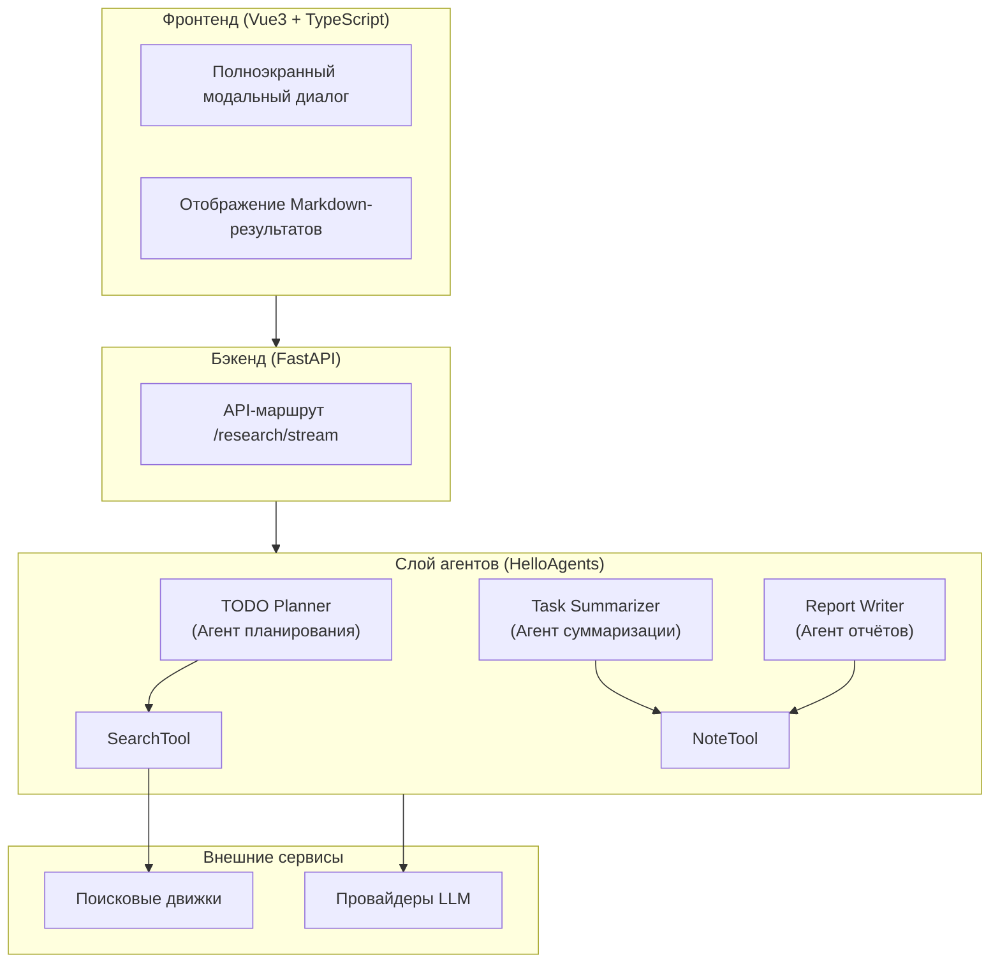
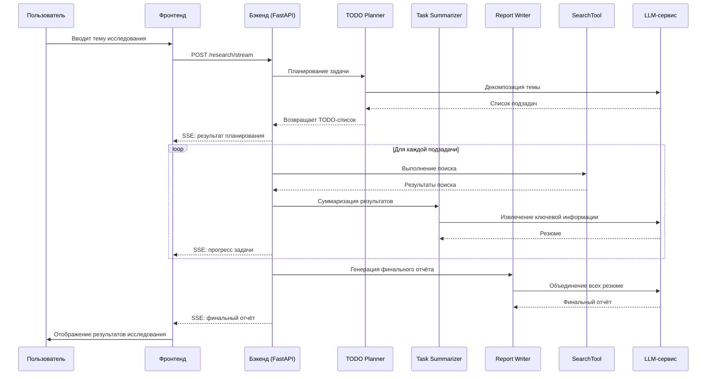
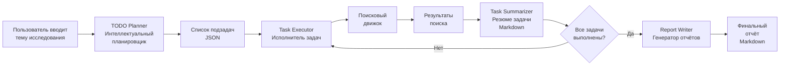
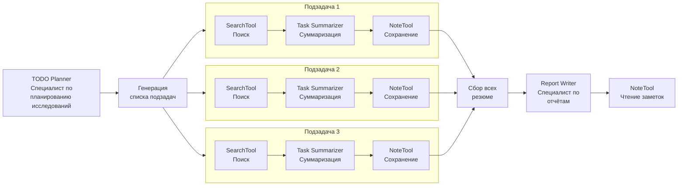
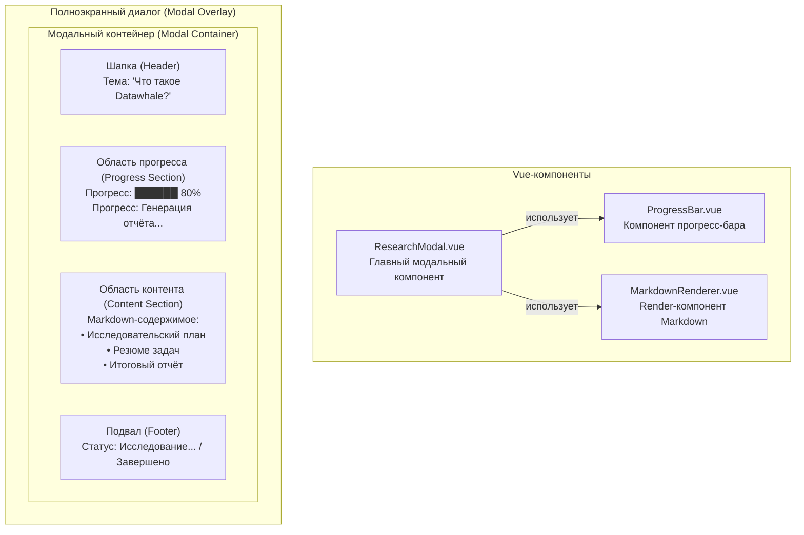
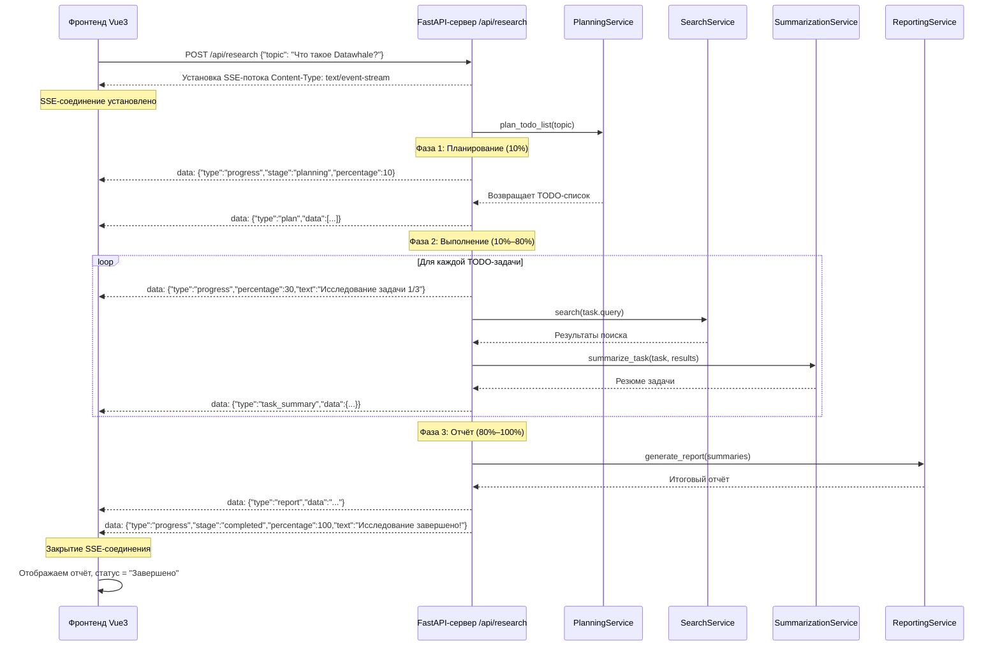

# Глава 14: Агент автоматизированных глубоких исследований

В тринадцатой главе мы познакомились с тем, как применять HelloAgents в многоагентном продукте — туристическом помощнике. В этой главе мы идём дальше и сосредотачиваемся на **приложениях, интенсивно работающих со знаниями**: построим агента-помощника, способного автоматически выполнять задачи глубокого исследования.

По сравнению с планированием путешествий, глубокое исследование значительно сложнее: информация постоянно разветвляется, факты быстро устаревают, а пользователи требуют точных ссылок на источники. Чтобы доставлять достоверные исследовательские отчёты, агент должен обладать тремя ключевыми способностями:

**(1) Декомпозиция вопроса**: разбить открытую тему пользователя на конкретные поисковые запросы.

**(2) Многораундовый сбор информации**: непрерывно добывать материал с помощью разных поисковых API, дедуплицировать и интегрировать результаты.

**(3) Рефлексия и синтез**: по промежуточным результатам выявлять пробелы в знаниях, решать, продолжать ли поиск, и генерировать структурированное резюме.

## 14.1 Обзор проекта и архитектура

### 14.1.1 Зачем нужен помощник для глубоких исследований

В эпоху информационного взрыва нам каждый день требуется быстро разбираться в новых технологиях, концепциях или событиях. У традиционного способа исследования есть несколько болевых точек.

Прежде всего — **информационная перегрузка**: поисковик возвращает тысячи ссылок, и чтобы найти что-то полезное, нужно открывать их одну за другой, читая горы текста. Далее — **отсутствие структуры**: даже найденная информация зачастую фрагментарна и лишена системной организации. Наконец — **повторяющийся труд**: при каждом новом исследовании приходится снова и снова проходить цикл «поиск → чтение → конспектирование → упорядочивание».

Именно эти проблемы и призван решить помощник для глубоких исследований. Он не просто поисковый инструмент — это исследовательский ассистент, способный самостоятельно планировать, выполнять и обобщать работу.

**Ключевые преимущества помощника для глубоких исследований:**

1. **Экономия времени**: работа на 1–2 часа сжимается до 5–10 минут.
2. **Повышение качества**: систематический исследовательский процесс исключает пропуск важной информации.
3. **Прослеживаемость**: все результаты поиска и источники фиксируются — удобно для проверки и цитирования.
4. **Расширяемость**: легко добавить новые поисковые движки, источники данных и инструменты анализа.

### 14.1.2 Обзор технической архитектуры

Система по-прежнему построена на классической **архитектуре с разделением фронтенда и бэкенда**, как показано на рисунке 14.1.



*Рисунок 14.1 Техническая архитектура помощника для глубоких исследований*

Система спроектирована в четыре уровня:

**Фронтенд (Vue3 + TypeScript)**: полноэкранный модальный диалог, визуализация результатов в формате Markdown.

**Бэкенд (FastAPI)**: API-маршрут (`/research/stream`).

**Слой агентов (HelloAgents)**: три специализированных агента (TODO Planner, Task Summarizer, Report Writer) и два ключевых инструмента (SearchTool, NoteTool).

**Слой внешних сервисов**: поисковые движки + провайдеры LLM.

Рассмотрим, как полный исследовательский запрос проходит через систему (рисунок 14.2):



*Рисунок 14.2 Поток данных в системе глубоких исследований*

1. **Ввод пользователя**: пользователь вводит тему исследования во фронтенде.
2. **Запрос фронтенда**: фронтенд подключается по SSE к `/research/stream`.
3. **Получение бэкендом**: FastAPI принимает запрос, создаёт состояние исследования.
4. **Фаза планирования**: вызов агента планирования исследования, декомпозиция на 3 подзадачи.
5. **Фаза выполнения**: последовательное выполнение каждой подзадачи:
   - поиск с помощью SearchTool,
   - суммаризация с помощью агента суммаризации,
   - сохранение результата с помощью NoteTool.
6. **Фаза отчёта**: вызов агента генерации отчёта, объединение всех резюме.
7. **Потоковая передача**: прогресс и результаты передаются на фронтенд через SSE.
8. **Отображение**: фронтенд в реальном времени обновляет список задач, прогресс-бар, лог и отчёт.

Структура директорий проекта выглядит так:

```
helloagents-deepresearch/
├── backend/                    # Код бэкенда
│   ├── src/
│   │   ├── agent.py           # Главный координатор
│   │   ├── main.py            # Точка входа FastAPI
│   │   ├── models.py          # Модели данных
│   │   ├── prompts.py         # Шаблоны промптов
│   │   ├── config.py          # Управление конфигурацией
│   │   └── services/          # Сервисный слой
│   │       ├── planner.py     # Сервис планирования
│   │       ├── summarizer.py  # Сервис суммаризации
│   │       ├── reporter.py    # Сервис отчётов
│   │       └── search.py      # Поисковый сервис
│   ├── .env                   # Переменные окружения
│   ├── pyproject.toml         # Управление зависимостями
│   └── workspace/             # Исследовательские заметки
│
└── frontend/                   # Код фронтенда
    ├── src/
    │   ├── App.vue            # Главный компонент
    │   ├── components/        # UI-компоненты
    │   │   └── ResearchModal.vue
    │   └── composables/       # Composable-функции
    │       └── useResearch.ts
    ├── package.json           # npm-зависимости
    └── vite.config.ts         # Конфигурация сборки
```

### 14.1.3 Быстрый старт: запуск проекта за 5 минут

Прежде чем погружаться в детали реализации, запустим проект и посмотрим на финальный результат — так у вас сложится интуитивное понимание всей системы.

Убедитесь, что установлены нужные версии:

```bash
python --version  # Должно быть Python 3.10.x или выше
node --version    # Должно быть v16.x.x или выше
npm --version     # Должно быть 8.x.x или выше
```

**(1) Запуск бэкенда**

```bash
# 1. Перейти в директорию бэкенда
cd helloagents-deepresearch/backend

# 2. Установить зависимости
# Вариант 1: через uv (рекомендуется — быстрее)
uv sync

# Вариант 2: через pip
pip install -e .

# 3. Настроить переменные окружения
cp .env.example .env

# 4. Отредактировать .env — вписать свои API-ключи
# Минимально необходимо:
# - LLM_PROVIDER (например: openai, deepseek, qwen)
# - LLM_API_KEY (ваш API-ключ LLM)
# - SEARCH_API (например: duckduckgo, tavily)

# 5. Запустить бэкенд
python src/main.py
```

При успешном запуске вы увидите что-то вроде:

```
INFO:     Started server process [12345]
INFO:     Waiting for application startup.
INFO:     Application startup complete.
INFO:     Uvicorn running on http://0.0.0.0:8000 (Press CTRL+C to quit)
```

**(2) Запуск фронтенда**

Откройте новое терминальное окно:

```bash
# 1. Перейти в директорию фронтенда
cd helloagents-deepresearch/frontend

# 2. Установить зависимости
npm install

# 3. Запустить фронтенд
npm run dev
```

При успешном запуске вы увидите:

```
  VITE v5.0.0  ready in 500 ms

  ➜  Local:   http://localhost:5174/
  ➜  Network: use --host to expose
  ➜  press h + enter to show help
```

**(3) Начало исследования**

Откройте в браузере `http://localhost:5174`. Вы увидите центрированную карточку ввода (рисунок 14.3). Введите тему исследования, например `Что такое организация Datawhale?`, выберите поисковый движок (если настроено несколько) и нажмите кнопку «Начать исследование».


*Рисунок 14.3 Страница поиска помощника для глубоких исследований*

Как показано на рисунке 14.4, система автоматически разворачивается на весь экран: слева — информация об исследовании, справа — прогресс и результаты в реальном времени. Весь процесс занимает 1–3 минуты в зависимости от сложности темы и скорости отклика поисковика.


*Рисунок 14.4 Помощник разворачивает исследование*

После завершения вы увидите:

- **Список задач**: все подзадачи и их статусы.
- **Журнал прогресса**: все операции, выполненные в ходе исследования.
- **Финальный отчёт**: структурированный Markdown-отчёт со сводками по всем подзадачам и ссылками на источники.

Вы успешно запустили помощника для глубоких исследований и получили первое интуитивное представление о системе.

## 14.2 Исследовательская парадигма, управляемая TODO

### 14.2.1 Что такое TODO-управляемое исследование

Традиционный поисковик способен ответить лишь на один конкретный вопрос, тогда как глубокое исследование требует ответов на целый ряд взаимосвязанных вопросов. TODO-управляемая исследовательская парадигма разбивает сложную тему на множество подзадач (TODO), выполняет их последовательно и объединяет результаты.

Ключевая идея этой парадигмы: **превратить сложную задачу «провести исследование» в процесс «планирование → выполнение → синтез»**.

Разберём на примере. Допустим, вы хотите исследовать тему «Что такое организация Datawhale?». Традиционный путь:

```
Ввод пользователя: Что такое организация Datawhale?
Поисковик: возвращает 10–20 ссылок
Пользователь: открывает ссылки одну за другой, читает, конспектирует
Результат: фрагментарная информация, без системной структуры
```

Проблема такого подхода: каждая ссылка охватывает лишь один аспект темы, структура отсутствует, нужно вручную собирать и суммировать всё в единое целое.

**TODO-управляемый подход: системное исследование**

```
Ввод пользователя: Что такое организация Datawhale?

Системное планирование:
  ├─ TODO 1: Основная информация о Datawhale (позиционирование организации)
  ├─ TODO 2: Главные проекты Datawhale (ключевое содержание)
  ├─ TODO 3: Культура сообщества Datawhale (ценности)
  └─ TODO 4: Влияние Datawhale (социальный вклад)

Системное выполнение:
  Для каждого TODO:
    1. Поиск релевантных материалов
    2. Суммаризация ключевой информации
    3. Сохранение ссылок на источники

Системный синтез:
  Генерация структурированного отчёта:
    ├─ Часть 1: Позиционирование организации (из TODO 1)
    ├─ Часть 2: Ключевое содержание (из TODO 2)
    ├─ Часть 3: Ценности (из TODO 3)
    ├─ Часть 4: Социальный вклад (из TODO 4)
    └─ Библиография: все ссылки на источники
```

Преимущества такого подхода: сложная тема разбивается на чёткие подвопросы; результаты поиска и резюме по каждой подзадаче сохраняются и легко отслеживаются; систематический процесс исключает пропуск важной информации; можно легко добавлять новые подзадачи или менять порядок выполнения.

Полная TODO-управляемая исследовательская система включает три ключевых элемента.

**(1) Интеллектуальный планировщик (TODO Planner)**: отвечает за декомпозицию темы на подзадачи. Хороший планировщик должен понимать ключевые аспекты темы и цели исследования, разбивать тему на 3–5 подзадач (слишком мало — охват неполный, слишком много — возникает избыточность) и формировать подходящие поисковые запросы для каждой подзадачи.

**(2) Исполнитель задач (Task Executor)**: отвечает за выполнение каждой подзадачи. Должен использовать поисковики для получения релевантных материалов, извлекать ключевую информацию, удаляя избыточное, и сохранять все ссылки на источники для последующей проверки.

**(3) Генератор отчётов (Report Writer)**: отвечает за объединение результатов всех подзадач. Должен организовывать контент в логическом порядке, объединять повторяющуюся информацию и добавлять ссылки на источники к каждому утверждению.

TODO-управляемый исследовательский процесс в нашем случае показан на рисунке 14.5:



*Рисунок 14.5 TODO-управляемый исследовательский процесс*

Весь процесс линеен, но на каждом этапе есть чёткие входные и выходные данные. Такой дизайн делает систему понятной и удобной для отладки.

### 14.2.2 Трёхфазный исследовательский процесс

TODO-управляемый исследовательский процесс состоит из трёх фаз: планирование (Planning), выполнение (Execution), отчёт (Reporting). За каждую фазу отвечает специализированный агент.

**(1) Фаза 1: Планирование**

Цель фазы планирования — разбить тему исследования на 3–5 подзадач. На вход система получает тему исследования и текущую дату, на выходе — список подзадач в формате JSON. Каждая подзадача содержит три поля: `title` (заголовок задачи), `intent` (цель исследования) и `query` (поисковый запрос).

Агент планирования исследования применяет разные стратегии декомпозиции в зависимости от особенностей темы: обычно он начинает с базовых концепций, затем переходит к актуальному состоянию технологии, практическому применению и тенденциям развития; при необходимости проводит сравнительный анализ. Например, для темы «Что такое организация Datawhale?» агент-планировщик может сгенерировать следующие подзадачи:

```json
[
  {
    "title": "Основная информация о Datawhale",
    "intent": "Узнать позиционирование организации, дату основания, историю развития",
    "query": "Datawhale organization introduction history 2024"
  },
  {
    "title": "Главные проекты Datawhale",
    "intent": "Ознакомиться с ключевыми открытыми проектами и учебными материалами Datawhale",
    "query": "Datawhale projects tutorials open source 2024"
  },
  ...
]
```

Хороший план должен быть исчерпывающим, логически последовательным, с точными запросами и умеренным числом пунктов.

**(2) Фаза 2: Выполнение**

На этапе выполнения система последовательно обрабатывает каждую подзадачу: ищет и суммирует релевантные материалы. Входные данные — список подзадач и конфигурация поискового движка; выходные — резюме каждой подзадачи (в формате Markdown) и список ссылок на источники.

Для каждой подзадачи исполнитель:

1. **Ищет материалы**: выполняет поиск через настроенный поисковик

   ```python
   search_results = search_tool.run({
       "input": task.query,
       "backend": "tavily",
       "mode": "structured",
       "max_results": 5
   })
   ```

2. **Получает результаты поиска**: извлекает заголовок, URL, аннотацию

   ```json
   {
     "results": [
       {
         "title": "What is a Multimodal Model?",
         "url": "https://example.com/multimodal-model",
         "snippet": "A multimodal model is an AI model that can process multiple types of data..."
       },
       ...
     ]
   }
   ```

3. **Вызывает агента суммаризации**: тот суммирует результаты поиска

   ```python
   summary = summarizer_agent.run(
       task=task,
       search_results=search_results
   )
   ```

4. **Сохраняет резюме и источники** с помощью NoteTool

   ```python
   note_tool.run({
       "action": "create",
       "title": task.title,
       "content": f"## {task.title}\n\n{summary}\n\n## Источники\n{sources}",
       "tags": ["research", "summary"]
   })
   ```

Агент суммаризации задачи извлекает ключевые тезисы из каждого результата поиска, объединяет сходную информацию, сохраняет важные числа, даты, имена и добавляет ссылки на источники к каждому утверждению. Например, для подзадачи «Основная информация о Datawhale» агент может сгенерировать:

```markdown
## Основная информация о Datawhale

Datawhale — открытая организация, специализирующаяся на Data Science и AI, основанная в 2018 году[1].
Миссия организации: «for the learner, расти вместе с обучающимися» — строить чистое учебное сообщество[2].

**Ключевое позиционирование:**

1. **Открытая образовательная платформа**: высококачественные учебные ресурсы по AI и Data Science[1]
2. **Сообщество обучающихся**: объединяет десятки тысяч изучающих и практикующих AI[3]
3. **Обмен знаниями**: пропагандирует открытый исходный код; весь контент полностью бесплатен[2]

**История развития:**

- **2018**: основание Datawhale, выпуск первого открытого учебника[1]
- **2020**: становится одним из ведущих AI-учебных сообществ[3]
- **2024**: более 50 открытых проектов, охват 100 000+ обучающихся[4]

## Источники

[1] https://github.com/datawhalechina
[2] https://datawhale.club/about
[3] https://www.zhihu.com/org/datawhale
[4] https://datawhale.cn
```

В процессе выполнения система в реальном времени передаёт информацию о прогрессе на фронтенд:

```json
{"type": "status", "message": "Поиск по теме: Основная информация о Datawhale"}
{"type": "status", "message": "Суммаризация результатов поиска..."}
{"type": "task", "task": {"id": 1, "title": "Основная информация о Datawhale", "status": "completed"}}
```

**(3) Фаза 3: Отчёт**

Цель фазы отчёта — объединить резюме всех подзадач и сгенерировать итоговый отчёт. Входные данные — резюме всех подзадач и тема исследования; выходные — итоговый отчёт в формате Markdown. Отчёт состоит из пяти частей: заголовок, обзор, детальный анализ по каждой подзадаче, заключение и список литературы. Например, для темы «Что такое организация Datawhale?» итоговый отчёт может выглядеть так:

```markdown
# Что такое организация Datawhale?

## Обзор

Этот отчёт систематически исследует открытую организацию Datawhale,
охватывая четыре аспекта: основную информацию, главные проекты,
культуру сообщества и влияние организации.

## 1. Основная информация о Datawhale

Datawhale — открытая организация, специализирующаяся на Data Science и AI, основанная в 2018 году...

(Здесь вставляется резюме подзадачи 1)

## 2. Главные проекты Datawhale

Datawhale выпустила несколько высококачественных открытых учебников, включая Hello-Agents, Joyful-Pandas и другие...

(Здесь вставляется резюме подзадачи 2)
...
## Заключение

В ходе данного исследования мы познакомились с позиционированием, ключевыми проектами,
культурой сообщества и социальным вкладом Datawhale. Datawhale — чистое учебное
сообщество, внёсшее значительный вклад в AI-образование.

## Список литературы

[1] https://github.com/datawhalechina
[2] https://datawhale.club/about
...
```

Агент-составитель отчёта организует контент в логическом порядке подзадач, добавляет краткий обзор в начале, объединяет повторяющуюся информацию, унифицирует форматирование Markdown и собирает все ссылки на источники в раздел списка литературы.

## 14.3 Проектирование системы агентов

### 14.3.1 Распределение обязанностей между агентами

В помощнике для глубоких исследований мы спроектировали трёх специализированных агентов, каждый из которых отвечает за конкретную задачу. Благодаря этому каждый агент прост, понятен и удобен в сопровождении.

В седьмой главе мы научились строить агентов с помощью `SimpleAgent`. Концепция `SimpleAgent` — простота и прямолинейность: при каждом вызове метода `run()` агент анализирует вопрос пользователя, решает, нужно ли обращаться к инструментам, и возвращает результат. Этот подход прекрасно работает для простых задач, но когда речь идёт о таком сложном деле, как глубокое исследование, нам необходима многоагентная кооперация.

Как показано в таблице 14.1, три агента отвечают соответственно за планирование, суммаризацию и генерацию отчёта.

| Agent | Обязанности | Входные данные | Выходные данные | Инструменты |
|---|---|---|---|---|
| TODO Planner | Планирование задач | Тема исследования | Список подзадач (JSON) | Нет (чистое рассуждение) |
| Task Summarizer | Суммаризация задач | Результаты поиска | Резюме (Markdown) | NoteTool (чтение/обновление заметок) |
| Report Writer | Генерация отчёта | Все резюме | Итоговый отчёт (Markdown) | NoteTool (чтение/создание заметок) |

*Таблица 14.1 Распределение обязанностей между тремя агентами*

Рассмотрим каждого агента подробнее.

**Агент 1: Специалист по планированию исследований (TODO Planner)**

**Обязанности**: декомпозиция темы исследования на 3–5 подзадач.

**Концепция проектирования**: основная задача специалиста по планированию — понять тему исследования, проанализировать её ключевые аспекты и сформировать перечень подзадач. Этот процесс похож на этап «мозгового штурма», который исследователь-человек проводит перед началом работы.

**Дизайн промпта**:

```python
todo_planner_instructions = """
Ты — специалист по планированию исследований. Твоя задача — разбить тему исследования
пользователя на 3–5 подзадач.

Текущая дата: {current_date}

Тема исследования: {research_topic}

Проанализируй эту тему и разбей её на 3–5 подзадач. Каждая подзадача должна:
1. Охватывать один важный аспект темы
2. Иметь чёткую цель исследования
3. Быть доступной для поиска через поисковый движок

Верни список подзадач в формате JSON; каждая подзадача содержит:
- title: заголовок задачи (краткий и понятный)
- intent: цель задачи (зачем это исследовать)
- query: поисковый запрос (строка для поискового движка; можно использовать английский
  для улучшения результатов поиска)

Пример вывода:
[
  {{
    "title": "Что такое мультимодальные модели",
    "intent": "Понять базовые концепции мультимодальных моделей как основу для дальнейшего исследования",
    "query": "multimodal model definition concept 2024"
  }},
  ...
]

Убедись, что:
1. Количество подзадач — от 3 до 5
2. Между подзадачами есть логическая связь (например: от базового к прикладному, от текущего состояния к тенденциям)
3. Поисковые запросы позволяют точно найти релевантные материалы
4. Возвращай только JSON, без дополнительного текста
"""
```

**Ключевые особенности**: промпт включает текущую дату для получения актуальной информации; явно требует вывода в формате JSON для удобного разбора; через пример помогает агенту понять ожидаемый формат; подчёркивает ограничения: количество подзадач, логические связи и т. д.

**Реализация**:

Здесь `ToolAwareSimpleAgent` — расширение `SimpleAgent`, подробнее описанное в разделе 14.3.2; пока не нужно углубляться в детали.

```python
class PlanningService:
    def __init__(self, llm: HelloAgentsLLM):
        self._agent = ToolAwareSimpleAgent(
            name="TODO Planner",
            system_prompt="Ты — специалист по планированию исследований",
            llm=llm,
            tool_call_listener=self._on_tool_call
        )
    
    def plan_todo_list(self, state: SummaryState) -> List[TodoItem]:
        prompt = todo_planner_instructions.format(
            current_date=get_current_date(),
            research_topic=state.research_topic,
        )
        
        response = self._agent.run(prompt)
        tasks_payload = self._extract_tasks(response)
        
        todo_items = []
        for idx, item in enumerate(tasks_payload, start=1):
            task = TodoItem(
                id=idx,
                title=item["title"],
                intent=item["intent"],
                query=item["query"],
            )
            todo_items.append(task)
        
        return todo_items
    
    def _extract_tasks(self, response: str) -> List[dict]:
        """Извлечь JSON из ответа агента"""
        # Извлекаем JSON-часть с помощью регулярного выражения
        json_match = re.search(r'\[.*\]', response, re.DOTALL)
        if json_match:
            json_str = json_match.group(0)
            return json.loads(json_str)
        else:
            raise ValueError("Не удалось извлечь JSON из ответа")
```

**Агент 2: Специалист по суммаризации задач (Task Summarizer)**

**Обязанности**: суммаризация результатов поиска, извлечение ключевой информации.

**Концепция проектирования**: основная задача специалиста по суммаризации — читать результаты поиска, извлекать ключевую информацию и представлять её в структурированном виде. Этот процесс похож на то, как исследователь-человек делает заметки после прочтения литературы.

**Дизайн промпта**:

```python
task_summarizer_instructions = """
Ты — специалист по суммаризации задач. Твоя задача — суммировать результаты поиска
и извлекать ключевую информацию.

Заголовок задачи: {task_title}
Цель задачи: {task_intent}
Поисковый запрос: {task_query}

Результаты поиска:
{search_results}

Внимательно прочитай приведённые результаты поиска, извлеки ключевую информацию
и верни резюме в формате Markdown.

Резюме должно включать:
1. **Ключевые тезисы**: основные идеи и выводы из результатов поиска
2. **Ключевые данные**: важные числа, даты, имена и т. д.
3. **Ссылки на источники**: добавь ссылки к каждому тезису (используй метки [1], [2] и т. д.)

Убедись, что:
1. Резюме краткое и понятное, без лишнего
2. Сохранены важные детали и данные
3. К каждому тезису добавлена ссылка на источник
4. Используется форматирование Markdown (заголовки, списки, жирный шрифт и т. д.)

Пример вывода:
## Ключевые тезисы

Мультимодальная модель — это модель ИИ, способная обрабатывать данные нескольких типов[1].
В отличие от традиционных одномодальных моделей, мультимодальные модели могут одновременно
понимать текст, изображения, звук и другие форматы[2].

**Ключевые характеристики:**
- Кросс-модальное понимание[1]
- Единое представление[3]
- Сквозное обучение[2]

## Источники

[1] https://example.com/source1
[2] https://example.com/source2
[3] https://example.com/source3
"""
```

**Ключевые особенности**: промпт содержит контекст задачи (заголовок, цель, запрос), чтобы агент понимал, что именно исследуется; явно требует включения ключевых тезисов, данных и ссылок на источники; подчёркивает необходимость ссылок к каждому тезису; через пример помогает агенту понять ожидаемый формат вывода.

**Реализация**:

```python
class SummarizationService:
    def __init__(self, llm: HelloAgentsLLM):
        self._agent = ToolAwareSimpleAgent(
            name="Task Summarizer",
            system_prompt="Ты — специалист по суммаризации задач",
            llm=llm,
            tool_call_listener=self._on_tool_call
        )
    
    def summarize_task(
        self,
        task: TodoItem,
        search_results: List[dict]
    ) -> str:
        # Форматируем результаты поиска
        formatted_sources = self._format_sources(search_results)
        
        prompt = task_summarizer_instructions.format(
            task_title=task.title,
            task_intent=task.intent,
            task_query=task.query,
            search_results=formatted_sources,
        )
        
        summary = self._agent.run(prompt)
        return summary
    
    def _format_sources(self, search_results: List[dict]) -> str:
        """Форматировать результаты поиска"""
        formatted = []
        for idx, result in enumerate(search_results, start=1):
            formatted.append(
                f"[{idx}] {result['title']}\n"
                f"URL: {result['url']}\n"
                f"Аннотация: {result['snippet']}\n"
            )
        return "\n".join(formatted)
```

**Агент 3: Специалист по составлению отчётов (Report Writer)**

**Обязанности**: объединение резюме всех подзадач и генерация итогового отчёта.

**Концепция проектирования**: основная задача специалиста по составлению отчётов — интегрировать резюме всех подзадач в структурированный отчёт. Этот процесс похож на то, как исследователь-человек пишет научный отчёт после завершения всех исследований.

**Дизайн промпта**:

```python
report_writer_instructions = """
Ты — специалист по составлению отчётов. Твоя задача — объединить резюме всех подзадач
и сгенерировать структурированный исследовательский отчёт.

Тема исследования: {research_topic}

Резюме подзадач:
{task_summaries}

Объедини все приведённые резюме подзадач и сгенерируй структурированный исследовательский отчёт.

Отчёт должен включать:
1. **Заголовок**: тема исследования
2. **Обзор**: краткое введение в тему исследования и структуру отчёта (2–3 абзаца)
3. **Детальный анализ по каждой подзадаче**: в логическом порядке (с заголовками второго уровня)
4. **Заключение**: основные выводы исследования (1–2 абзаца)
5. **Список литературы**: все ссылки на источники (сгруппированные по подзадачам)

Убедись, что:
1. Структура отчёта чёткая, логика последовательная
2. Повторяющаяся информация устранена
3. Все ссылки на источники сохранены
4. Используется форматирование Markdown

Пример вывода:
# Последние достижения в области мультимодальных LLM

## Обзор

Этот отчёт систематически исследует последние достижения в области мультимодальных LLM...

## 1. Что такое мультимодальные модели

(Здесь вставляется резюме подзадачи 1)

## 2. Какие мультимодальные модели появились недавно

(Здесь вставляется резюме подзадачи 2)

...

## Заключение

В ходе данного исследования мы познакомились с...

## Список литературы

### Задача 1: Что такое мультимодальные модели
[1] https://example.com/source1
...
"""
```

**Ключевые особенности**: промпт явно требует структуры, включающей заголовок, обзор, детальный анализ, заключение и список литературы; подчёркивает необходимость организации контента в логическом порядке; требует устранения повторяющейся информации; обязательно сохраняет все ссылки на источники.

**Реализация**:

```python
class ReportingService:
    def __init__(self, llm: HelloAgentsLLM):
        self._agent = ToolAwareSimpleAgent(
            name="Report Writer",
            system_prompt="Ты — специалист по составлению отчётов",
            llm=llm,
            tool_call_listener=self._on_tool_call
        )
    
    def generate_report(
        self,
        research_topic: str,
        task_summaries: List[Tuple[TodoItem, str]]
    ) -> str:
        # Форматируем резюме подзадач
        formatted_summaries = self._format_summaries(task_summaries)
        
        prompt = report_writer_instructions.format(
            research_topic=research_topic,
            task_summaries=formatted_summaries,
        )
        
        report = self._agent.run(prompt)
        return report
    
    def _format_summaries(
        self,
        task_summaries: List[Tuple[TodoItem, str]]
    ) -> str:
        """Форматировать резюме подзадач"""
        formatted = []
        for idx, (task, summary) in enumerate(task_summaries, start=1):
            formatted.append(
                f"## Задача {idx}: {task.title}\n"
                f"Цель: {task.intent}\n\n"
                f"{summary}\n"
            )
        return "\n".join(formatted)
```

### 14.3.2 Проектирование ToolAwareSimpleAgent

В седьмой главе мы реализовали `SimpleAgent` — базового агента фреймворка HelloAgents. Но в помощнике для глубоких исследований нам нужен агент, способный **фиксировать вызовы инструментов**. Именно здесь и появляется `ToolAwareSimpleAgent`.

В помощнике для глубоких исследований нам необходимо фиксировать вызовы инструментов каждого агента для:

1. **Отладки**: просмотра того, какие инструменты вызвал агент и с какими параметрами.
2. **Журналирования**: записи всех операций в ходе исследования.
3. **Анализа**: изучения поведенческих паттернов агента.
4. **Отображения прогресса**: отображения в реальном времени того, что делает агент.

`SimpleAgent` сам по себе не поддерживает прослушивание вызовов инструментов, поэтому нам нужно его расширить.

`ToolAwareSimpleAgent` добавляет к `SimpleAgent` параметр `tool_call_listener` — функцию обратного вызова, которая срабатывает при каждом вызове инструмента.

**Пример использования:**

```python
from hello_agents import ToolAwareSimpleAgent

def tool_listener(call_info):
    print(f"Агент: {call_info['agent_name']}")
    print(f"Инструмент: {call_info['tool_name']}")
    print(f"Параметры: {call_info['parsed_parameters']}")
    print(f"Результат: {call_info['result']}")

agent = ToolAwareSimpleAgent(
    name="Исследовательский помощник",
    system_prompt="Ты — исследовательский помощник",
    llm=llm,
    tool_call_listener=tool_listener
)
```

`ToolAwareSimpleAgent` наследует `SimpleAgent` и переопределяет метод `_execute_tool_call`:

```python
class ToolAwareSimpleAgent(SimpleAgent):
    def __init__(
        self,
        name: str,
        system_prompt: str,
        llm: HelloAgentsLLM,
        tool_registry: Optional[ToolRegistry] = None,
        tool_call_listener: Optional[Callable] = None,
    ):
        super().__init__(
            name=name,
            system_prompt=system_prompt,
            llm=llm,
            tool_registry=tool_registry,
        )
        self._tool_call_listener = tool_call_listener
    
    def _execute_tool_call(self, tool_name: str, parameters: str) -> str:
        """Выполнить вызов инструмента и уведомить слушателя"""
        # Разобрать параметры
        parsed_parameters = self._parse_parameters(parameters)
        
        # Вызвать инструмент
        result = super()._execute_tool_call(tool_name, parameters)
        
        # Уведомить слушателя
        if self._tool_call_listener:
            self._tool_call_listener({
                "agent_name": self.name,
                "tool_name": tool_name,
                "parsed_parameters": parsed_parameters,
                "result": result,
            })
        
        return result
```

В помощнике для глубоких исследований `ToolAwareSimpleAgent` используется для фиксации вызовов инструментов всех агентов:

```python
class DeepResearchAgent:
    def __init__(self, config: Configuration):
        self.config = config
        self.llm = HelloAgentsLLM(...)
        
        # Создаём слушателя вызовов инструментов
        def tool_listener(call_info):
            self._emit_event({
                "type": "tool_call",
                "agent": call_info["agent_name"],
                "tool": call_info["tool_name"],
                "parameters": call_info["parsed_parameters"],
            })
        
        # Создаём трёх агентов с общим слушателем
        self.planner = PlanningService(self.llm, tool_listener)
        self.summarizer = SummarizationService(self.llm, tool_listener)
        self.reporter = ReportingService(self.llm, tool_listener)
```

Таким образом, вызовы инструментов всех агентов фиксируются и через SSE передаются на фронтенд, отображаясь пользователю в реальном времени.

### 14.3.3 Паттерн кооперации агентов

Три агента взаимодействуют в режиме **последовательной кооперации**, как показано на рисунке 14.6.



*Рисунок 14.6 Поток кооперации агентов*

Особенности паттерна последовательной кооперации:

1. **Линейный поток**: агенты выполняются в фиксированном порядке.
2. **Чёткие входные/выходные данные**: входные данные каждого агента — выходные данные предыдущего.
3. **Отсутствие параллелизма**: в каждый момент времени работает только один агент.

`DeepResearchAgent` — главный координатор всей системы, оркестрирующий трёх агентов:

```python
class DeepResearchAgent:
    def run(self, research_topic: str) -> str:
        # 1. Фаза планирования
        self._emit_event({"type": "status", "message": "Планирование исследовательских задач..."})
        todo_list = self.planner.plan_todo_list(research_topic)
        self._emit_event({"type": "tasks", "tasks": todo_list})
        
        # 2. Фаза выполнения
        task_summaries = []
        for task in todo_list:
            self._emit_event({
                "type": "status",
                "message": f"Исследование задачи: {task.title}"
            })
            
            # Поиск
            search_results = self.search_service.search(task.query)
            
            # Суммаризация
            summary = self.summarizer.summarize_task(task, search_results)
            task_summaries.append((task, summary))
            
            self._emit_event({
                "type": "task_completed",
                "task_id": task.id
            })
        
        # 3. Фаза отчёта
        self._emit_event({"type": "status", "message": "Генерация отчёта..."})
        report = self.reporter.generate_report(research_topic, task_summaries)
        self._emit_event({"type": "report", "content": report})
        
        return report
```

## 14.4 Интеграция инструментов

### 14.4.1 Расширение SearchTool

В седьмой главе мы реализовали базовую версию `SearchTool` с интеграцией поисковых движков Tavily и SerpApi, продемонстрировав концепцию многоисточникового поиска. В помощнике для глубоких исследований мы существенно расширяем возможности `SearchTool`: добавляем DuckDuckGo, Perplexity, SearXNG и реализуем режим Advanced (комбинация нескольких поисковых движков). Поиск — самая ключевая функция помощника, и эти расширения позволяют системе адаптироваться к разным сценариям использования и требованиям.

Как показано в таблице 14.2, новые поисковые движки обладают разными характеристиками и подходят для разных задач.

| Поисковый движок | API-ключ | Формат ответа | Особенности | Подходит для |
|---|---|---|---|---|
| Tavily | Да | Структурированный JSON | Специально для AI, высокое качество | Продакшн |
| DuckDuckGo | Нет | Структурированный JSON | Бесплатно, без регистрации | Быстрый старт |
| Perplexity | Да | Структурированный JSON | AI-суммаризация + источники | Сложные темы |
| SearXNG | Самостоятельно | Структурированный JSON | Открытый исходный код, настраиваемый | Частное развёртывание |
| Advanced | Комбинированный | Структурированный JSON | Объединяет несколько движков | Полный охват |

*Таблица 14.2 Сравнение поисковых движков*

Отдельно рассматривать реализацию расширений мы не будем — обратитесь к исходному коду и примерам расширений из седьмой главы. `SearchTool` предоставляет единый интерфейс поиска: независимо от используемого движка, способ вызова одинаков.

В помощнике для глубоких исследований поисковый движок выбирается через конфигурационный файл:

```python
# config.py
class SearchAPI(str, Enum):
    TAVILY = "tavily"
    DUCKDUCKGO = "duckduckgo"
    PERPLEXITY = "perplexity"
    SEARXNG = "searxng"
    ADVANCED = "advanced"

class Configuration(BaseModel):
    search_api: SearchAPI = SearchAPI.DUCKDUCKGO
    # ...
```

```python
# .env
SEARCH_API=tavily
```

Пользователь может сменить поисковый движок, просто изменив файл `.env` — без правки кода.

`SearchTool` возвращает словарь, содержащий:

- `results`: список результатов поиска; каждый результат включает заголовок, URL, аннотацию.
- `backend`: использованный поисковый движок.
- `answer`: ответ, сгенерированный ИИ (только Perplexity).
- `notices`: уведомления (ограничения API, ошибки и т. д.).

Ниже — обработка некоторых особых случаев.

Результаты поиска могут содержать дублирующиеся URL — нужна дедупликация:

```python
def deduplicate_sources(sources: List[dict]) -> List[dict]:
    """Удалить дублирующиеся URL"""
    seen_urls = set()
    unique_sources = []
    
    for source in sources:
        if source["url"] not in seen_urls:
            seen_urls.add(source["url"])
            unique_sources.append(source)
    
    return unique_sources
```

Результаты поиска могут содержать большой объём текста — нужно ограничить число токенов для каждого источника:

```python
def limit_source_tokens(source: dict, max_tokens: int = 2000) -> dict:
    """Ограничить число токенов источника"""
    snippet = source["snippet"]
    
    # Грубая оценка токенов: 1 токен ≈ 4 символа
    max_chars = max_tokens * 4
    
    if len(snippet) > max_chars:
        snippet = snippet[:max_chars] + "..."
    
    return {
        **source,
        "snippet": snippet
    }
```

### 14.4.2 Использование NoteTool

В помощнике для глубоких исследований мы используем `NoteTool` для персистентного хранения прогресса исследования. `NoteTool` — встроенный инструмент, интегрированный в девятой главе; он предоставляет операции создания, чтения, обновления и удаления заметок.

В процессе исследования нам необходимо фиксировать результаты поиска, резюме и итоговый отчёт по каждой подзадаче. Эти данные должны сохраняться на диске, чтобы при прерывании исследования можно было продолжить с того же места; кроме того, это удобно для просмотра всех операций в ходе исследования и анализа качества и эффективности работы.

`NoteTool` хранит заметки в виде Markdown-файлов в указанной рабочей директории. Имя файла — идентификатор задачи; содержимое включает заголовок задачи, цель, поисковый запрос, результаты поиска и резюме.

Итоговая структура файлов выглядит примерно так:

```
workspace/
├── notes/
│   ├── 1.md  # Заметка по задаче 1
│   ├── 2.md  # Заметка по задаче 2
│   ├── 3.md  # Заметка по задаче 3
│   └── ...
└── reports/
    └── final_report.md  # Итоговый отчёт
```

В помощнике для глубоких исследований `NoteTool` используется для сохранения прогресса по каждой подзадаче:

```python
class NotesService:
    def __init__(self, workspace: str):
        self.note_tool = NoteTool(workspace=workspace)
    
    def save_task_summary(
        self,
        task: TodoItem,
        search_results: List[dict],
        summary: str
    ):
        """Сохранить резюме задачи"""
        # Форматируем содержимое заметки
        content = self._format_note_content(
            task=task,
            search_results=search_results,
            summary=summary
        )
        
        # Создаём заметку
        self.note_tool.run({
            "action": "create",
            "title": f"Задача {task.id}: {task.title}",
            "content": content,
            "tags": ["research", "summary"]
        })
    
    def _format_note_content(
        self,
        task: TodoItem,
        search_results: List[dict],
        summary: str
    ) -> str:
        """Форматировать содержимое заметки"""
        content = f"# Задача {task.id}: {task.title}\n\n"
        content += "## Информация о задаче\n\n"
        content += f"- **Цель**: {task.intent}\n"
        content += f"- **Запрос**: {task.query}\n\n"
        
        content += "## Результаты поиска\n\n"
        for idx, result in enumerate(search_results, start=1):
            content += f"[{idx}] {result['title']}\n"
            content += f"URL: {result['url']}\n"
            content += f"Аннотация: {result['snippet']}\n\n"
        
        content += f"## Резюме\n\n{summary}\n"
        
        return content
```

### 14.4.3 Управление инструментами через ToolRegistry

`ToolRegistry` — реестр инструментов фреймворка HelloAgents, также введённый в седьмой главе; он управляет регистрацией и вызовом всех инструментов. В помощнике для глубоких исследований `ToolRegistry` используется для управления `SearchTool` и `NoteTool`.

Перед созданием агента необходимо зарегистрировать инструменты:

```python
from hello_agents import ToolAwareSimpleAgent
from hello_agents.tools import ToolRegistry
from hello_agents.tools import SearchTool
from hello_agents.tools import NoteTool

# Создаём инструменты
search_tool = SearchTool(backend="hybrid")
note_tool = NoteTool(workspace="./workspace/notes")

# Создаём реестр
registry = ToolRegistry()

# Регистрируем инструменты
registry.register_tool(search_tool)
registry.register_tool(note_tool)

# Создаём агента
agent = ToolAwareSimpleAgent(
    name="Исследовательский помощник",
    system_prompt="Ты — исследовательский помощник",
    llm=llm,
    tool_registry=registry
)
```

Когда агенту нужно вызвать инструмент, он генерирует команду вызова, как показано на рисунке 14.7.

```mermaid
sequenceDiagram
    participant User as Пользователь
    participant Agent as ToolAwareSimpleAgent
    participant Registry as ToolRegistry
    participant Search as SearchTool
    participant Note as NoteTool

    User->>Agent: Запрос: "Исследуй организацию Datawhale"
    Note over Agent: 1. Генерация команды вызова инструмента
    Agent->>Agent: Генерирует команду [TOOL_CALL:search:{"input":"Datawhale","backend":"tavily"}]
    Note over Agent: 2. Разбор команды
    Agent->>Registry: Разбирает имя инструмента и параметры
    Note over Registry: 3. Поиск инструмента
    Registry->>Search: get_tool("search")
    Search-->>Registry: Найден SearchTool
    Note over Search: 4. Вызов инструмента
    Registry->>Search: run(parameters)
    Search-->>Registry: Выполнение поиска → результаты
    Note over Registry: 5. Форматирование результата
    Registry->>Agent: format_result(result)
    Agent-->>Agent: Форматированные результаты поиска
    Note over Agent: 6. Второй вызов инструмента
    Agent->>Agent: Генерирует [TOOL_CALL:note:{"action":"create","title":"Datawhale"}]
    Agent->>Registry: Разбирает имя и параметры
    Registry->>Note: get_tool("note")
    Note-->>Registry: Найден NoteTool
    Registry->>Note: run(parameters)
    Note-->>Registry: Создание заметки → ID заметки
    Registry->>Agent: format_result(result)
    Note over Agent: 7. Генерация финального ответа
    Agent-->>User: Возвращает исследовательский отчёт
```

*Рисунок 14.7 Процесс вызова инструментов*

**Процесс вызова инструментов**:

1. **Агент генерирует команду**: агент генерирует команду вызова инструмента, например `[TOOL_CALL:search_tool:{"input": "организация Datawhale", "backend": "tavily"}]`.
2. **Разбор команды**: `ToolRegistry` разбирает команду, извлекая имя инструмента и параметры.
3. **Поиск инструмента**: `ToolRegistry` находит инструмент по его имени.
4. **Вызов инструмента**: вызывается метод `run` инструмента с переданными параметрами.
5. **Возврат результата**: инструмент возвращает результат выполнения.
6. **Форматирование результата**: результат преобразуется в строку и возвращается агенту.

## 14.5 Реализация сервисного слоя

В этом разделе подробно рассматривается реализация ключевых сервисов: PlanningService, SummarizationService, ReportingService и SearchService. Эти сервисы — мост между агентами и инструментами; именно они содержат конкретную бизнес-логику.

### 14.5.1 Сервис планирования задач

`PlanningService` отвечает за вызов агента планирования исследования и декомпозицию темы на подзадачи. Это первый и ключевой шаг всего исследовательского процесса.

**(1) Реализация**

Основные обязанности сервиса:

1. **Построение промпта для планирования**: формирование промпта на основе темы исследования и текущей даты.
2. **Вызов агента планирования**: вызов агента TODO Planner для генерации списка подзадач.
3. **Разбор JSON-ответа**: извлечение списка подзадач в формате JSON из ответа агента.
4. **Валидация формата подзадач**: проверка наличия обязательных полей в каждой подзадаче (`title`, `intent`, `query`).

```python
import re
import json
from typing import List, Callable, Optional
from datetime import datetime

from hello_agents import HelloAgentsLLM
from hello_agents import ToolAwareSimpleAgent
from models import TodoItem, SummaryState
from prompts import todo_planner_instructions

class PlanningService:
    """Сервис планирования задач"""

    def __init__(
        self,
        llm: HelloAgentsLLM,
        tool_call_listener: Optional[Callable] = None
    ):
        self._llm = llm
        self._tool_call_listener = tool_call_listener

        # Создаём агента планирования
        self._agent = ToolAwareSimpleAgent(
            name="TODO Planner",
            system_prompt="Ты — специалист по планированию исследований, умеющий декомпозировать сложные темы на чёткие подзадачи.",
            llm=llm,
            tool_call_listener=tool_call_listener
        )

    def plan_todo_list(self, state: SummaryState) -> List[TodoItem]:
        """Спланировать TODO-список

        Args:
            state: состояние исследования, содержащее тему

        Returns:
            список подзадач
        """
        # Строим промпт
        prompt = todo_planner_instructions.format(
            current_date=self._get_current_date(),
            research_topic=state.research_topic,
        )

        # Вызываем агента
        response = self._agent.run(prompt)

        # Разбираем JSON
        tasks_payload = self._extract_tasks(response)

        # Валидируем и создаём TodoItem
        todo_items = []
        for idx, item in enumerate(tasks_payload, start=1):
            # Проверяем обязательные поля
            if not all(key in item for key in ["title", "intent", "query"]):
                raise ValueError(f"В задаче {idx} отсутствуют обязательные поля")

            task = TodoItem(
                id=idx,
                title=item["title"],
                intent=item["intent"],
                query=item["query"],
            )
            todo_items.append(task)

        return todo_items

    def _get_current_date(self) -> str:
        """Получить текущую дату"""
        return datetime.now().strftime("%d.%m.%Y")

    def _extract_tasks(self, response: str) -> List[dict]:
        """Извлечь JSON из ответа агента

        Ответ агента может содержать дополнительный текст, например:
        "Хорошо, я спланирую следующие задачи:\n[{...}, {...}]\nЭти задачи охватывают..."

        Нам нужно извлечь из него JSON-часть.
        """
        # Метод 1: извлечь JSON-массив с помощью регулярного выражения
        json_match = re.search(r'\[.*\]', response, re.DOTALL)
        if json_match:
            json_str = json_match.group(0)
            try:
                return json.loads(json_str)
            except json.JSONDecodeError as e:
                raise ValueError(f"Ошибка разбора JSON: {e}")

        # Метод 2: если JSON-массив не найден, попытаться разобрать весь ответ
        try:
            return json.loads(response)
        except json.JSONDecodeError:
            raise ValueError("Не удалось извлечь JSON из ответа")
```

**(2) Разбор и валидация JSON**

JSON, возвращаемый агентом, может содержать лишний текст или ошибки форматирования — нужна надёжная логика разбора.

**Типичные проблемы**:

1. **Лишний текст**: агент может добавить пояснения до или после JSON.
2. **Ошибки форматирования**: в JSON могут отсутствовать кавычки, запятые и т. д.
3. **Отсутствие полей**: в некоторых подзадачах могут отсутствовать обязательные поля.

**Решения**:

1. **Регулярные выражения**: для извлечения JSON-части.
2. **Несколько стратегий разбора**: сначала попытка извлечь JSON-массив, затем разбор всего ответа.
3. **Валидация полей**: проверка наличия обязательных полей в каждой подзадаче.

**Пример**:

```python
# Пример ответа агента 1: с лишним текстом
response1 = """
Хорошо, я спланирую следующие задачи:

[
  {
    "title": "Что такое мультимодальные модели",
    "intent": "Понять базовые концепции",
    "query": "multimodal model definition"
  },
  {
    "title": "Новейшие мультимодальные модели",
    "intent": "Узнать актуальное состояние технологии",
    "query": "latest multimodal models 2024"
  }
]

Эти задачи охватывают основную информацию об организации Datawhale и её ключевые проекты.
"""

# Извлекаем JSON
tasks1 = service._extract_tasks(response1)
# Результат: [{"title": "Основная информация о Datawhale", ...}, ...]

# Пример ответа агента 2: чистый JSON
response2 = """
[
  {"title": "Основная информация о Datawhale", "intent": "Узнать позиционирование организации", "query": "Datawhale organization introduction"},
  {"title": "Главные проекты Datawhale", "intent": "Узнать ключевое содержание", "query": "Datawhale projects tutorials 2024"}
]
"""

# Извлекаем JSON
tasks2 = service._extract_tasks(response2)
# Результат: [{"title": "Что такое мультимодальные модели", ...}, ...]
```

**(3) Оценка качества плана**

Хороший план должен соответствовать следующим критериям:

1. **Полный охват**: охватывает все важные аспекты темы.
2. **Чёткая логика**: между подзадачами есть явная логическая связь.
3. **Точные запросы**: поисковые запросы позволяют найти релевантные материалы.
4. **Умеренное число пунктов**: от 3 до 5 подзадач.

Можно добавить метод оценки:

```python
def evaluate_plan(self, todo_items: List[TodoItem]) -> dict:
    """Оценить качество плана

    Returns:
        результат оценки: балл и рекомендации
    """
    score = 100
    suggestions = []

    # Проверяем количество
    if len(todo_items) < 3:
        score -= 20
        suggestions.append("Слишком мало подзадач — возможно, упущена важная информация")
    elif len(todo_items) > 5:
        score -= 10
        suggestions.append("Слишком много подзадач — возможна избыточность")

    # Проверяем качество запросов
    for task in todo_items:
        if len(task.query.split()) < 2:
            score -= 10
            suggestions.append(f"Запрос для задачи «{task.title}» слишком короткий")

    # Проверяем логические связи
    # (здесь можно добавить более сложную логику проверки)

    return {
        "score": score,
        "suggestions": suggestions
    }
```

### 14.5.2 Сервис суммаризации

`SummarizationService` отвечает за вызов агента суммаризации задач и обработку результатов поиска. Это ключевое звено исследовательского процесса, определяющее качество исследования.

Обязанности сервиса:

1. **Форматирование результатов поиска**: преобразование результатов в удобочитаемый текст.
2. **Построение промпта суммаризации**: формирование промпта на основе информации о задаче и результатов поиска.
3. **Вызов агента суммаризации**: вызов агента Task Summarizer для генерации резюме.
4. **Извлечение ссылок на источники**: извлечение ссылок из резюме.

Основной код:

```python
from typing import List, Callable, Optional, Tuple

from hello_agents import HelloAgentsLLM
from hello_agents import ToolAwareSimpleAgent
from models import TodoItem
from prompts import task_summarizer_instructions

class SummarizationService:
    """Сервис суммаризации"""

    def __init__(
        self,
        llm: HelloAgentsLLM,
        tool_call_listener: Optional[Callable] = None
    ):
        self._llm = llm
        self._tool_call_listener = tool_call_listener

        # Создаём агента суммаризации
        self._agent = ToolAwareSimpleAgent(
            name="Task Summarizer",
            system_prompt="Ты — специалист по суммаризации задач, умеющий извлекать ключевую информацию из результатов поиска.",
            llm=llm,
            tool_call_listener=tool_call_listener
        )

    def summarize_task(
        self,
        task: TodoItem,
        search_results: List[dict]
    ) -> Tuple[str, List[str]]:
        """Суммаризировать задачу

        Args:
            task: информация о задаче
            search_results: список результатов поиска

        Returns:
            (текст резюме, список URL источников)
        """
        # Форматируем результаты поиска
        formatted_sources = self._format_sources(search_results)

        # Строим промпт
        prompt = task_summarizer_instructions.format(
            task_title=task.title,
            task_intent=task.intent,
            task_query=task.query,
            search_results=formatted_sources,
        )

        # Вызываем агента
        summary = self._agent.run(prompt)

        # Извлекаем URL источников
        source_urls = [result["url"] for result in search_results]

        return summary, source_urls

    def _format_sources(self, search_results: List[dict]) -> str:
        """Форматировать результаты поиска"""
        formatted = []
        for idx, result in enumerate(search_results, start=1):
            formatted.append(
                f"[{idx}] {result['title']}\n"
                f"URL: {result['url']}\n"
                f"Аннотация: {result['snippet']}\n"
            )
        return "\n".join(formatted)
```

### 14.5.3 Сервис генерации отчётов

`ReportingService` отвечает за вызов агента генерации отчёта и объединение резюме всех подзадач. Это последний шаг исследовательского процесса, в результате которого создаётся итоговый исследовательский отчёт.

Обязанности сервиса:

1. **Форматирование резюме подзадач**: приведение всех резюме к единому формату.
2. **Построение промпта отчёта**: формирование промпта на основе темы исследования и резюме подзадач.
3. **Вызов агента отчёта**: вызов агента Report Writer для генерации итогового отчёта.
4. **Упорядочивание ссылок**: группировка всех ссылок в раздел списка литературы.

**Реализация**:

```python
from typing import List, Callable, Optional, Tuple

from hello_agents import HelloAgentsLLM
from hello_agents import ToolAwareSimpleAgent
from models import TodoItem
from prompts import report_writer_instructions

class ReportingService:
    """Сервис генерации отчётов"""

    def __init__(
        self,
        llm: HelloAgentsLLM,
        tool_call_listener: Optional[Callable] = None
    ):
        self._llm = llm
        self._tool_call_listener = tool_call_listener

        # Создаём агента отчётов
        self._agent = ToolAwareSimpleAgent(
            name="Report Writer",
            system_prompt="Ты — специалист по составлению отчётов, умеющий интегрировать информацию и генерировать структурированные отчёты.",
            llm=llm,
            tool_call_listener=tool_call_listener
        )

    def generate_report(
        self,
        research_topic: str,
        task_summaries: List[Tuple[TodoItem, str, List[str]]]
    ) -> str:
        """Сгенерировать итоговый отчёт

        Args:
            research_topic: тема исследования
            task_summaries: список резюме подзадач; каждый элемент — (задача, резюме, URL источников)

        Returns:
            итоговый отчёт в формате Markdown
        """
        # Форматируем резюме подзадач
        formatted_summaries = self._format_summaries(task_summaries)

        # Строим промпт
        prompt = report_writer_instructions.format(
            research_topic=research_topic,
            task_summaries=formatted_summaries,
        )

        # Вызываем агента
        report = self._agent.run(prompt)

        return report

    def _format_summaries(
        self,
        task_summaries: List[Tuple[TodoItem, str, List[str]]]
    ) -> str:
        """Форматировать резюме подзадач"""
        formatted = []
        for idx, (task, summary, source_urls) in enumerate(task_summaries, start=1):
            formatted.append(
                f"## Задача {idx}: {task.title}\n\n"
                f"**Цель**: {task.intent}\n\n"
                f"{summary}\n\n"
                f"**Источники**:\n"
            )
            for url in source_urls:
                formatted.append(f"- {url}\n")
            formatted.append("\n")

        return "".join(formatted)
```

### 14.5.4 Сервис поиска

`SearchService` отвечает за оркестрацию поисковых движков, выполнение поиска и возврат результатов. Это мост между агентами и `SearchTool`. Здесь мы намеренно отказались от привычного подхода — прямого вызова инструментов из `SimpleAgent` — и пропускаем результаты выполнения `SearchTool` через промежуточный слой, прежде чем передать их агенту; это позволяет агенту сосредоточиться на обработке полученной информации.

Обязанности сервиса:

1. **Оркестрация поисковых движков**: выбор движка согласно конфигурации.
2. **Выполнение поиска**: вызов `SearchTool` для поиска.
3. **Обработка результатов**: дедупликация, ограничение токенов, форматирование.
4. **Обработка ошибок**: обработка сбоев поиска.

Основной код:

```python
from typing import List, Optional
import logging

from hello_agents.tools import SearchTool
from config import Configuration

logger = logging.getLogger(__name__)

class SearchService:
    """Сервис поиска"""

    def __init__(self, config: Configuration):
        self.config = config

        # Создаём SearchTool
        self.search_tool = SearchTool(backend="hybrid")

    def search(
        self,
        query: str,
        max_results: int = 5
    ) -> List[dict]:
        """Выполнить поиск

        Args:
            query: поисковый запрос
            max_results: максимальное число результатов

        Returns:
            список результатов поиска
        """
        try:
            # Вызываем SearchTool
            raw_response = self.search_tool.run({
                "input": query,
                "backend": self.config.search_api.value,
                "mode": "structured",
                "max_results": max_results
            })

            # Извлекаем результаты
            results = raw_response.get("results", [])

            # Обрабатываем результаты
            results = self._deduplicate_sources(results)
            results = self._limit_source_tokens(results)

            logger.info(f"Поиск успешен: «{query}» — вернул {len(results)} результатов")

            return results

        except Exception as e:
            logger.error(f"Ошибка поиска: «{query}» — {e}")
            return []

    def _deduplicate_sources(self, sources: List[dict]) -> List[dict]:
        """Удалить дублирующиеся URL"""
        seen_urls = set()
        unique_sources = []

        for source in sources:
            url = source.get("url", "")
            if url and url not in seen_urls:
                seen_urls.add(url)
                unique_sources.append(source)

        return unique_sources

    def _limit_source_tokens(
        self,
        sources: List[dict],
        max_tokens_per_source: int = 2000
    ) -> List[dict]:
        """Ограничить число токенов для каждого источника"""
        limited_sources = []

        for source in sources:
            snippet = source.get("snippet", "")

            # Грубая оценка токенов: 1 токен ≈ 4 символа
            max_chars = max_tokens_per_source * 4

            if len(snippet) > max_chars:
                snippet = snippet[:max_chars] + "..."

            limited_sources.append({
                **source,
                "snippet": snippet
            })

        return limited_sources
```

Логика выбора поискового движка в зависимости от конфигурации показана на рисунке 14.8.

```mermaid
flowchart LR
    Request["Получен запрос<br/>на поиск"]
    Config["Читаем конфигурацию<br/>SEARCH_API"]
    Check["Проверяем<br/>конфигурацию"]

    subgraph Engines["Доступные движки"]
        Hybrid["hybrid → Гибридный режим<br/>Интеллектуальный выбор"]
        Advanced["advanced → Advanced-режим<br/>Объединение движков"]
        SearXNG["searxng → SearXNG<br/>Требует адрес сервера"]
        SerpAPI["serpapi → SerpAPI<br/>Требует API-ключ"]
        Perplexity["perplexity → Perplexity<br/>Требует API-ключ"]
        DuckDuckGo["duckduckgo → DuckDuckGo<br/>Без API-ключа"]
        Tavily["tavily → Tavily<br/>Требует API-ключ"]
    end

    Execute["Выполнить поиск"]
    ResultCheck{Проверка результата}
    Fallback{"Есть резервный<br/>движок?"}
    FallbackDDG["Использовать DuckDuckGo<br/>как запасной вариант"]
    ErrorMsg["Вернуть<br/>сообщение об ошибке"]
    Process["Обработать результат"]
    Dedup["Дедупликация<br/>удаление дублей URL"]
    LimitTokens["Ограничение токенов<br/>контроль длины контента"]
    Format["Форматирование<br/>унифицированный формат"]
    Return["Вернуть<br/>результаты поиска"]

    Request --> Config --> Check
    Check --> Engines
    Engines --> Execute
    Execute --> ResultCheck
    ResultCheck -- Неудача --> Fallback
    Fallback -- Да --> FallbackDDG --> Execute
    Fallback -- Нет --> ErrorMsg --> Return
    ResultCheck -- Успех --> Process
    Process --> Dedup --> LimitTokens --> Format --> Return
```



*Рисунок 14.8 Логика оркестрации поискового движка*

**Логика оркестрации**:

1. **Читаем конфигурацию**: считываем параметр `SEARCH_API` из файла `.env`.
2. **Выбираем движок**: согласно конфигурации выбираем поисковый движок (tavily, duckduckgo, perplexity и т. д.).
3. **Выполняем поиск**: вызываем `SearchTool` для поиска.
4. **Обрабатываем результаты**: дедупликация, ограничение токенов, форматирование.
5. **Возвращаем результаты**: возвращаем обработанные результаты поиска.

Для повышения эффективности и снижения затрат можно добавить кэширование результатов поиска:

```python
import hashlib
import json
from pathlib import Path

class SearchService:
    def __init__(self, config: Configuration):
        self.config = config
        self.search_tool = SearchTool(backend="hybrid")

        # Директория кэша
        self.cache_dir = Path("./cache/search")
        self.cache_dir.mkdir(parents=True, exist_ok=True)

    def search(
        self,
        query: str,
        max_results: int = 5,
        use_cache: bool = True
    ) -> List[dict]:
        """Выполнить поиск (с кэшированием)"""
        # Генерируем ключ кэша
        cache_key = self._generate_cache_key(query, max_results)
        cache_file = self.cache_dir / f"{cache_key}.json"

        # Попытка прочитать из кэша
        if use_cache and cache_file.exists():
            logger.info(f"Загрузка из кэша: «{query}»")
            with open(cache_file, "r", encoding="utf-8") as f:
                return json.load(f)

        # Выполняем поиск
        results = self._execute_search(query, max_results)

        # Сохраняем в кэш
        if use_cache and results:
            with open(cache_file, "w", encoding="utf-8") as f:
                json.dump(results, f, ensure_ascii=False, indent=2)

        return results

    def _generate_cache_key(self, query: str, max_results: int) -> str:
        """Сгенерировать ключ кэша"""
        # Используем MD5-хэш запроса и максимального числа результатов
        content = f"{query}_{max_results}_{self.config.search_api.value}"
        return hashlib.md5(content.encode()).hexdigest()
```

Благодаря четырём ключевым сервисам (PlanningService, SummarizationService, ReportingService, SearchService) мы построили полный исследовательский процесс. Каждый сервис выполняет свою функцию и взаимодействует с другими через чёткие интерфейсы, реализуя автоматизированный процесс от темы исследования до итогового отчёта.

## 14.6 Проектирование фронтенда

В предыдущих разделах мы реализовали полную серверную часть. В этом разделе подробно рассматривается проектирование пользовательского интерфейса: полноэкранный модальный диалог, отображение прогресса в реальном времени и визуализация результатов исследования.

### 14.6.1 UI с полноэкранным модальным диалогом

Помощник для глубоких исследований использует полноэкранный модальный диалог — такой дизайн обеспечивает ряд преимуществ:

1. **Иммерсивный опыт**: полноэкранное отображение без отвлекающих факторов, полная концентрация на исследовании.
2. **Чёткая иерархия**: главная страница и страница исследования разделены.
3. **Простое закрытие**: нажатие кнопки закрытия или клавиши ESC возвращает на главную страницу.
4. **Адаптивный дизайн**: подходит для экранов разных размеров.

Как показано на рисунке 14.9, полноэкранный модальный диалог включает следующие части:



*Рисунок 14.9 UI полноэкранного модального диалога*

**Компоненты UI**:

1. **Шапка**: тема исследования и кнопка закрытия.
2. **Область прогресса**: текущий прогресс исследования (планирование, выполнение, отчёт).
3. **Область контента**: результаты исследования (в формате Markdown).
4. **Подвал**: статусная информация («Исследование...», «Завершено»).

Соответствующая реализация на Vue (ResearchModal.vue):

```vue
<template>
  <div v-if="isOpen" class="modal-overlay" @click.self="close">
    <div class="modal-container">
      <!-- Шапка -->
      <div class="modal-header">
        <h2>{{ researchTopic }}</h2>
        <button @click="close" class="close-button">
          <svg><!-- Иконка закрытия --></svg>
        </button>
      </div>
      
      <!-- Область прогресса -->
      <div class="progress-section">
        <div class="progress-bar">
          <div 
            class="progress-fill" 
            :style="{ width: progressPercentage + '%' }"
          ></div>
        </div>
        <div class="progress-text">{{ progressText }}</div>
      </div>
      
      <!-- Область контента -->
      <div class="content-section">
        <div v-if="isLoading" class="loading-spinner">
          <div class="spinner"></div>
          <p>Исследование, подождите...</p>
        </div>
        
        <div v-else class="markdown-content" v-html="renderedMarkdown"></div>
      </div>
      
      <!-- Подвал -->
      <div class="modal-footer">
        <span class="status-text">{{ statusText }}</span>
      </div>
    </div>
  </div>
</template>

<script setup lang="ts">
import { ref, computed, watch } from 'vue'
import { marked } from 'marked'

interface Props {
  isOpen: boolean
  researchTopic: string
}

const props = defineProps<Props>()
const emit = defineEmits<{
  close: []
}>()

// Состояние
const isLoading = ref(true)
const progressPercentage = ref(0)
const progressText = ref('Подготовка...')
const statusText = ref('Исследование...')
const markdownContent = ref('')

// Рендеринг Markdown
const renderedMarkdown = computed(() => {
  return marked(markdownContent.value)
})

// Закрытие модального окна
const close = () => {
  emit('close')
}

// Отслеживание клавиши ESC
const handleKeydown = (e: KeyboardEvent) => {
  if (e.key === 'Escape') {
    close()
  }
}

// При открытии добавляем слушателя клавиатуры
watch(() => props.isOpen, (isOpen) => {
  if (isOpen) {
    document.addEventListener('keydown', handleKeydown)
  } else {
    document.removeEventListener('keydown', handleKeydown)
  }
})
</script>

<style scoped>
.modal-overlay {
  position: fixed;
  top: 0;
  left: 0;
  width: 100vw;
  height: 100vh;
  background-color: rgba(0, 0, 0, 0.5);
  display: flex;
  justify-content: center;
  align-items: center;
  z-index: 1000;
}
......
</style>
```

Для адаптации к разным размерам экрана добавляем медиазапросы:

```css
/* Планшеты */
@media (max-width: 768px) {
  .modal-container {
    width: 95vw;
    height: 95vh;
  }
  
  .modal-header,
  .progress-section,
  .content-section,
  .modal-footer {
    padding: 15px 20px;
  }
}

/* Мобильные устройства */
@media (max-width: 480px) {
  .modal-container {
    width: 100vw;
    height: 100vh;
    border-radius: 0;
  }
  
  .modal-header h2 {
    font-size: 18px;
  }
}
```

### 14.6.2 Отображение прогресса в реальном времени

Помощник для глубоких исследований использует SSE для отображения прогресса в реальном времени. SSE — технология серверного пуша, позволяющая серверу активно отправлять данные клиенту; она также рассматривается в главе про протоколы.

Как показано на рисунке 14.10, процесс SSE включает следующие шаги:



*Рисунок 14.10 Процесс SSE*

**Описание процесса**:

1. **Клиент отправляет запрос**: POST-запрос на `/api/research` с темой исследования.
2. **Сервер устанавливает SSE-соединение**: возвращает ответ с типом `text/event-stream`.
3. **Сервер передаёт прогресс**: периодически отправляет прогресс (планирование, выполнение, отчёт).
4. **Клиент получает прогресс**: прослушивает SSE-события и обновляет UI.
5. **Завершение исследования**: сервер передаёт итоговый отчёт и закрывает соединение.

Для использования SSE в проекте с фронтендом и бэкендом нужна следующая конфигурация.

**SSE-эндпоинт FastAPI на бэкенде**:

```python
from fastapi import FastAPI
from fastapi.responses import StreamingResponse
from typing import AsyncGenerator
import asyncio
import json

app = FastAPI()

async def research_stream(topic: str) -> AsyncGenerator[str, None]:
    """Генератор потокового исследования
    
    Генерирует данные в формате SSE:
    data: {"type": "progress", "data": {...}}
    """
    try:
        # 1. Фаза планирования
        yield f"data: {json.dumps({'type': 'progress', 'stage': 'planning', 'percentage': 10, 'text': 'Планирование исследовательских задач...'})}\n\n"
        
        # Вызываем PlanningService
        todo_items = await planning_service.plan_todo_list(topic)
        
        yield f"data: {json.dumps({'type': 'plan', 'data': [item.dict() for item in todo_items]})}\n\n"
        
        # 2. Фаза выполнения
        task_summaries = []
        for idx, task in enumerate(todo_items, start=1):
            # Обновляем прогресс
            percentage = 10 + (idx / len(todo_items)) * 70
            yield f"data: {json.dumps({'type': 'progress', 'stage': 'executing', 'percentage': percentage, 'text': f'Исследование задачи {idx}/{len(todo_items)}: {task.title}'})}\n\n"
            
            # Поиск
            search_results = await search_service.search(task.query)
            
            # Суммаризация
            summary, source_urls = await summarization_service.summarize_task(task, search_results)
            
            task_summaries.append((task, summary, source_urls))
            
            # Передаём резюме задачи
            yield f"data: {json.dumps({'type': 'task_summary', 'task_id': task.id, 'summary': summary})}\n\n"
        
        # 3. Фаза отчёта
        yield f"data: {json.dumps({'type': 'progress', 'stage': 'reporting', 'percentage': 90, 'text': 'Генерация итогового отчёта...'})}\n\n"
        
        # Генерируем отчёт
        report = await reporting_service.generate_report(topic, task_summaries)
        
        # Передаём итоговый отчёт
        yield f"data: {json.dumps({'type': 'report', 'data': report})}\n\n"
        
        # Завершение
        yield f"data: {json.dumps({'type': 'progress', 'stage': 'completed', 'percentage': 100, 'text': 'Исследование завершено!'})}\n\n"
        
    except Exception as e:
        # Обработка ошибок
        yield f"data: {json.dumps({'type': 'error', 'message': str(e)})}\n\n"

@app.post("/api/research")
async def research(request: ResearchRequest):
    """Эндпоинт исследования (SSE)"""
    return StreamingResponse(
        research_stream(request.topic),
        media_type="text/event-stream",
        headers={
            "Cache-Control": "no-cache",
            "Connection": "keep-alive",
        }
    )
```

**Получение SSE через EventSource на фронтенде**:

```typescript
// composables/useResearch.ts
import { ref } from 'vue'

export function useResearch() {
  const isLoading = ref(false)
  const progressPercentage = ref(0)
  const progressText = ref('')
  const markdownContent = ref('')
  const error = ref<string | null>(null)
  
  const startResearch = (topic: string) => {
    isLoading.value = true
    error.value = null
    
    // Создаём EventSource
    const eventSource = new EventSource(`/api/research?topic=${encodeURIComponent(topic)}`)
    
    // Прослушиваем сообщения
    eventSource.onmessage = (event) => {
      const data = JSON.parse(event.data)
      
      switch (data.type) {
        case 'progress':
          progressPercentage.value = data.percentage
          progressText.value = data.text
          break
          
        case 'plan':
          // Отображаем результат планирования
          console.log('Результат планирования:', data.data)
          break
          
        case 'task_summary':
          // Добавляем резюме задачи в Markdown
          markdownContent.value += `\n\n## Задача ${data.task_id}\n\n${data.summary}`
          break
          
        case 'report':
          // Отображаем итоговый отчёт
          markdownContent.value = data.data
          break
          
        case 'error':
          error.value = data.message
          eventSource.close()
          isLoading.value = false
          break
          
        case 'completed':
          eventSource.close()
          isLoading.value = false
          break
      }
    }
    
    // Обработка ошибок
    eventSource.onerror = (err) => {
      console.error('Ошибка SSE:', err)
      error.value = 'Ошибка соединения, попробуйте ещё раз'
      eventSource.close()
      isLoading.value = false
    }
  }
  
  return {
    isLoading,
    progressPercentage,
    progressText,
    markdownContent,
    error,
    startResearch,
  }
}
```

**Использование в компоненте**:

```vue
<script setup lang="ts">
import { useResearch } from '@/composables/useResearch'

const { 
  isLoading, 
  progressPercentage, 
  progressText, 
  markdownContent, 
  error,
  startResearch 
} = useResearch()

const handleStartResearch = (topic: string) => {
  startResearch(topic)
}
</script>
```

### 14.6.3 Визуализация результатов исследования

Результаты исследования отображаются в формате Markdown, включающем заголовки, абзацы, списки, цитаты и другие элементы. Для преобразования Markdown в HTML мы используем библиотеку `marked` и добавляем собственные стили.

**Рендеринг Markdown**:

```typescript
import { marked } from 'marked'

// Конфигурируем marked
marked.setOptions({
  breaks: true,  // Поддержка переносов строк
  gfm: true,     // Поддержка GitHub Flavored Markdown
})

// Рендеринг
const renderedHtml = marked(markdownContent.value)
```

Исследовательский отчёт содержит большое число ссылок на источники — их нужно обрабатывать особым образом:

```markdown
## Список литературы

### Задача 1: Основная информация о Datawhale
- [Datawhale GitHub](https://github.com/datawhalechina)
- [Официальный сайт Datawhale](https://datawhale.club)

### Задача 2: Главные проекты Datawhale
- [Учебник Hello-Agents](https://github.com/datawhalechina/Hello-Agents)
......
```

Благодаря полноэкранному модальному диалогу, отображению прогресса через SSE в реальном времени и визуализации результатов в Markdown мы построили дружественный пользователю фронтенд. Пользователь может отчётливо наблюдать прогресс исследования и просматривать результаты в красивом форматированном виде.

## 14.7 Заключение

В этой главе мы с нуля построили полноценную систему агента для автоматизированных глубоких исследований. Подведём итоги по ключевым моментам.

**(1) TODO-управляемая исследовательская парадигма**

Мы предложили новую исследовательскую парадигму — TODO-управляемое исследование. Она разбивает сложную тему на выполнимые подзадачи и реализует исследование через три фазы:

- **Фаза планирования**: декомпозиция темы на 3–5 подзадач; каждая содержит заголовок, цель и поисковый запрос.
- **Фаза выполнения**: поиск и суммаризация по каждой подзадаче, генерация структурированных знаний.
- **Фаза отчёта**: объединение резюме всех подзадач, генерация итогового исследовательского отчёта.

Преимущества этой парадигмы:

1. **Высокая управляемость**: у каждой подзадачи есть чёткая цель и область.
2. **Надёжное качество**: специализированные агенты гарантируют качество на каждом этапе.
3. **Простота отладки**: каждую подзадачу можно отлаживать отдельно.
4. **Хорошая расширяемость**: легко добавлять новые подзадачи или изменять существующие.

**(2) Трёхагентная кооперативная система**

Мы спроектировали трёх специализированных агентов, каждый из которых выполняет свою функцию:

- **TODO Planner (Специалист по планированию исследований)**: декомпозиция темы на подзадачи.
- **Task Summarizer (Специалист по суммаризации задач)**: суммаризация результатов поиска для каждой подзадачи.
- **Report Writer (Специалист по составлению отчётов)**: объединение всех резюме и генерация итогового отчёта.

Преимущества такого дизайна:

1. **Чёткое распределение обязанностей**: каждый агент сосредоточен на конкретной задаче.
2. **Оптимизация промптов**: для каждого агента можно разработать специализированный промпт.
3. **Простота сопровождения**: изменение одного агента не влияет на других.
4. **Гарантия качества**: каждый агент является «экспертом» в своей области.

**(3) Проектирование ToolAwareSimpleAgent**

Мы расширили базовый агент `SimpleAgent` фреймворка HelloAgents, реализовав `ToolAwareSimpleAgent`. Этот агент обладает способностью прослушивать вызовы инструментов и может:

- **Слушать вызовы инструментов**: отслеживать каждый вызов через функцию обратного вызова.
- **Давать обратную связь в реальном времени**: передавать информацию о вызовах инструментов на фронтенд в режиме реального времени.
- **Поддерживать отладку**: фиксировать все вызовы инструментов для удобства отладки.

Этот агент интегрирован во фреймворк HelloAgents и может переиспользоваться в других проектах.

**(4) Интеграция инструментов**

Мы в полной мере использовали инструментальную систему фреймворка HelloAgents:

- **SearchTool**: расширен поддержкой большего числа поисковых движков (Tavily, DuckDuckGo, Perplexity и др.).
- **NoteTool**: персистентное хранение прогресса исследования, поддержка восстановления и аудита.
- **ToolRegistry**: централизованное управление всеми инструментами, поддержка пользовательских расширений.

Благодаря конфигурируемой архитектуре пользователь может легко переключать поисковые движки без изменения кода.

**(5) Реализация ключевых сервисов**

Мы реализовали четыре ключевых сервиса, связывающих агентов и инструменты:

- **PlanningService**: вызов агента планирования, разбор JSON, валидация формата.
- **SummarizationService**: вызов агента суммаризации, обработка результатов поиска, извлечение источников.
- **ReportingService**: вызов агента отчётов, объединение резюме, генерация отчёта.
- **SearchService**: оркестрация поисковых движков, обработка результатов, деградация при ошибках, кэширование результатов.

Каждый сервис выполняет свою функцию и взаимодействует с другими через чёткие интерфейсы, реализуя автоматизированный процесс от темы исследования до итогового отчёта.

**(6) Проектирование фронтенда**

Мы спроектировали дружественный пользователю фронтенд:

- **Полноэкранный модальный диалог**: иммерсивный опыт, чёткая иерархия.
- **SSE-прогресс в реальном времени**: прогресс исследования отображается в реальном времени, отличный пользовательский опыт.
- **Markdown-визуализация**: красивый формат, чёткая структура.

Используя технологический стек Vue 3 + TypeScript + SSE, мы реализовали современное веб-приложение.

Эти знания применимы не только к помощнику для глубоких исследований, но и к другим AI-приложениям. Надеемся, что, опираясь на материал этой главы, читатели будут исследовать новые возможности и строить ещё более мощные AI-системы.

В следующей главе мы построим многоагентную систему, интегрированную с игровым движком, — «Кибер-городок» — и исследуем сложные паттерны взаимодействия и кооперации между агентами. Следите за обновлениями!
