# Глава 15: Строим кибергород

В этой главе мы исследуем новое направление: **соединение технологий агентов с игровым движком для создания живого AI-городка**. Виртуальный мир, населённый персонажами с настоящим интеллектом.

Помните NPC из The Sims или Animal Crossing? У них есть характер, воспоминания, социальные связи. Кибергород — проект схожего толка, но принципиально отличающийся от традиционных игр: наши NPC обладают настоящим «интеллектом» — они понимают речь игрока, помнят прошлые взаимодействия и реагируют по-разному в зависимости от уровня отношений. В основе кибергорода лежат следующие возможности:

**(1) Система диалогов с умными NPC**: игрок общается с персонажами на естественном языке, а NPC отвечают согласно своей роли и памяти.

**(2) Система памяти**: у каждого NPC есть краткосрочная и долгосрочная память — он помнит историю общения с игроком.

**(3) Система симпатий**: отношение NPC к игроку меняется по мере взаимодействия — от незнакомца до близкого друга.

**(4) Игровое взаимодействие**: игрок свободно перемещается по 2D-пиксельному офису и общается с разными NPC.

**(5) Система логирования в реальном времени**: все диалоги и взаимодействия записываются для отладки и анализа.

## 15.1 Обзор проекта и архитектурное решение

### 15.1.1 Зачем строить AI-городок

В традиционных играх NPC говорят по заранее прописанным репликам или следуют ограниченным деревьям диалогов. Даже в самых сложных RPG текст диалогов написан сценаристами заранее. Подход управляем, но лишён настоящего «интеллекта» и «жизни».

Представьте, что NPC понимает всё, что вы говорите, — никаких заранее заготовленных вариантов. Вы общаетесь на естественном языке, а NPC помнит, что вы говорили в прошлый раз, каковы ваши отношения и даже ваши предпочтения. Каждый NPC имеет свою профессию, характер и стиль речи, а его отношение к вам меняется по мере общения — от незнакомца до друга и близкого товарища.

Именно такие возможности открывает AI в играх. Объединив большую языковую модель с игровым движком, можно создать NPC, которые по-настоящему «живут». Это не просто технический демо — это исследование будущего формата игр. В образовательных играх NPC могут играть роли исторических персонажей или учёных, ведя интерактивные занятия со студентами. В виртуальном офисе они могут быть коллегами и наставниками. NPC способны стать компаньонами для эмоционального общения в области психологической поддержки. И конечно, наиболее прямое применение — добавление AI-персонажей в традиционные игры для улучшения игрового опыта.

### 15.1.2 Обзор технической архитектуры

Кибергород использует **разделённую архитектуру игрового движка и бэкенд-сервиса**, состоящую из четырёх уровней, как показано на рисунке 15.1.

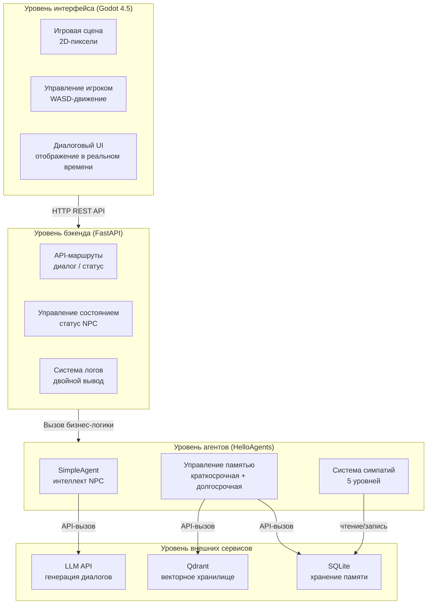

*Рисунок 15.1 Техническая архитектура кибергорода*

**Уровень интерфейса** — игровой движок Godot 4.5: рендеринг игры, управление игроком, отображение NPC и диалоговый UI. Godot — свободный движок с открытым исходным кодом, идеально подходящий для быстрой разработки пиксельных игр. **Уровень бэкенда** — фреймворк FastAPI: маршруты API, управление состоянием NPC, обработка диалогов и логирование. FastAPI — современный Python-фреймворк с отличной производительностью. **Уровень агентов** — собственный фреймворк HelloAgents: интеллект NPC, управление памятью и расчёт симпатий. Каждый NPC — отдельный экземпляр SimpleAgent со своей памятью и состоянием. **Уровень внешних сервисов** — LLM API, векторная база Qdrant и реляционная база SQLite.

Процесс передачи данных показан на рисунке 15.2:

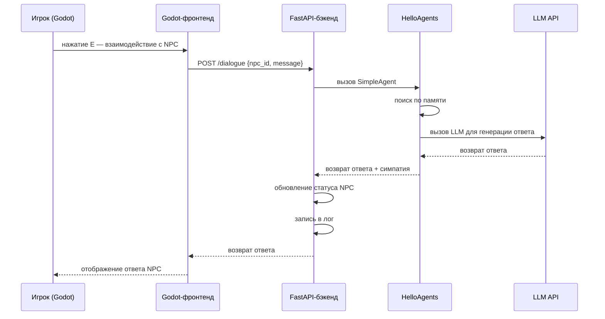

*Рисунок 15.2 Процесс передачи данных*

Игрок нажимает E в Godot для взаимодействия с NPC, Godot отправляет HTTP-запрос на диалог в FastAPI. Бэкенд вызывает SimpleAgent из HelloAgents для обработки диалога, агент извлекает релевантную историю из системы памяти, затем вызывает LLM для генерации ответа. Бэкенд обновляет состояние и симпатии NPC, записывает лог в консоль и файл, возвращает ответ на Godot-фронтенд. Godot отображает ответ NPC и обновляет UI — один полный цикл взаимодействия завершён.

Структура проекта для навигации по исходному коду:

```
Helloagents-AI-Town/
├── helloagents-ai-town/           # Проект игры на Godot
│   ├── project.godot              # Конфигурация проекта Godot
│   ├── scenes/                    # Игровые сцены
│   │   ├── main.tscn              # Главная сцена (офис)
│   │   ├── player.tscn            # Персонаж игрока
│   │   ├── npc.tscn               # Персонаж NPC
│   │   └── dialogue_ui.tscn       # Диалоговый UI
│   ├── scripts/                   # Скрипты на GDScript
│   │   ├── main.gd                # Логика главной сцены
│   │   ├── player.gd              # Управление игроком
│   │   ├── npc.gd                 # Поведение NPC
│   │   ├── dialogue_ui.gd         # Логика диалогового UI
│   │   ├── api_client.gd          # API-клиент
│   │   └── config.gd              # Управление конфигурацией
│   └── assets/                    # Игровые ресурсы
│       ├── characters/            # Спрайты персонажей
│       ├── interiors/             # Интерьеры
│       ├── ui/                    # Материалы UI
│       └── audio/                 # Звуки и музыка
│
└── backend/                       # Python-бэкенд
    ├── main.py                    # Главная программа FastAPI
    ├── agents.py                  # Система агентов NPC
    ├── relationship_manager.py    # Управление симпатиями
    ├── state_manager.py           # Управление состоянием
    ├── logger.py                  # Система логов
    ├── config.py                  # Управление конфигурацией
    ├── models.py                  # Модели данных
    ├── requirements.txt           # Python-зависимости
    └── .env.example               # Пример переменных окружения
```

Подробное описание архитектуры и потоков данных будет представлено в последующих разделах.

### 15.1.3 Быстрый старт: запустить проект за 5 минут

Прежде чем углубляться в детали реализации, давайте сначала запустим проект и посмотрим на финальный результат — так сложится наглядное представление о всей системе.

**Требования к окружению:**

- Godot 4.2 или выше
- Python 3.10 или выше
- Ключ API для LLM (OpenAI, DeepSeek, Zhipu и другие)

**Получение проекта:**

Проект находится в `code/chapter15/Helloagents-AI-Town` или доступен через клонирование репозитория hello-agents с GitHub.

**Запуск бэкенда:**

```bash
# 1. Перейти в директорию backend
cd Helloagents-AI-Town/backend

# 2. Установить зависимости
pip install -r requirements.txt

# 3. Настроить переменные окружения
cp .env.example .env
# Отредактировать .env, указав ключи API

# 4. Запустить бэкенд-сервис
python main.py
```

После успешного запуска в консоли появится:

```
============================================================
Запуск бэкенд-сервиса кибергорода...
============================================================
Все сервисы запущены!
API-адрес: http://0.0.0.0:8000
Документация API: http://0.0.0.0:8000/docs
============================================================
```

**Запуск Godot:**

Godot очень прост в установке: для Windows доступен `.exe`, для Mac — `.dmg`. Скачать можно прямо с официального сайта ([Windows](https://godotengine.org/download/windows/) / [Mac](https://godotengine.org/download/macos/)).

Откройте Godot, нажмите «Импорт», укажите путь к `Helloagents-AI-Town/helloagents-ai-town/scenes/main.tscn`, нажмите «Импортировать и редактировать». После импорта ресурсов нажмите `F5` или кнопку «Запуск».

**Знакомство с ключевыми возможностями:**

После запуска откроется пиксельный офис Datawhale, как показано на рисунке 15.3.

<div align="center">
  
  <p><em>Рисунок 15.3 Игровая сцена кибергорода</em></p>
</div>

Перемещайте персонажа клавишами WASD, а когда подойдёте к NPC, на экране появится подсказка «Нажмите E для взаимодействия». После нажатия E откроется диалоговое окно, куда можно написать любое сообщение — как показано на рисунке 15.4.

<div align="center">
  
  <p><em>Рисунок 15.4 Интерфейс диалога с NPC</em></p>
</div>

NPC отвечает согласно своей роли (Python-разработчик, продакт-менеджер, UI-дизайнер) и истории общения с вами. По ходу разговора симпатия NPC постепенно растёт: от «незнакомца» до «знакомого», потом «дружелюбного», «близкого» и даже «лучшего друга».

**Система симпатий реализована на бэкенде**: каждый диалог анализирует содержимое и тональность сообщения игрока, после чего корректирует счёт. Хотя в игровом интерфейсе числа симпатии явно не отображаются, все изменения подробно записываются в бэкенд-лог: `backend/logs/dialogue_YYYY-MM-DD.log`. В нём фиксируется: текущий счёт симпатии, найденные релевантные воспоминания, ответ NPC, изменение симпатии (+2.0, +3.0 и т.п.), причина изменения (дружелюбное приветствие, обычный разговор и т.д.), результат анализа тональности (positive, neutral и пр.). Такой подход позволяет разработчику наглядно отслеживать развитие отношений, а данные служат основой для добавления UI симпатий на фронтенде в будущем.

Посмотреть логи в реальном времени можно командой:

```bash
# из директории backend
python view_logs.py
```

Этот быстрый опыт демонстрирует основные возможности AI-городка. Далее мы разберём реализацию детально.

## 15.2 Система агентов NPC

### 15.2.1 SimpleAgent на основе HelloAgents

В кибергороде каждый NPC — самостоятельный агент. Мы используем SimpleAgent из фреймворка HelloAgents для реализации интеллекта NPC. SimpleAgent — это лёгкая реализация агента, инкапсулирующая вызовы LLM, управление сообщениями и вызовы инструментов.

Вспомним SimpleAgent из главы 7: его ядро — простой цикл диалога: принять сообщение от пользователя, вызвать LLM для генерации ответа, вернуть результат. В кибергороде мы создаём по экземпляру SimpleAgent для каждого NPC, задавая уникальный системный промпт, чтобы каждый персонаж имел отдельный характер и роль.

Вот как создаётся NPC-агент. Сначала определяем базовую информацию: идентификатор, имя, профессию и характер. Затем на основе этих данных строим системный промпт, чтобы LLM играл роль NPC. Наконец, создаём экземпляр SimpleAgent с настроенной системой памяти:

```python
from hello_agents import SimpleAgent, HelloAgentsLLM
from hello_agents.memory import MemoryManager, WorkingMemory, EpisodicMemory

def create_npc_agent(npc_id: str, name: str, role: str, personality: str):
    """Создание агента NPC"""
    # Строим системный промпт
    system_prompt = f"""Ты — {name}, {role}.
Твои черты характера: {personality}

Ты работаешь в офисе Datawhale вместе с коллегами и помогаешь развивать сообщество открытого ПО.
Общайся с игроком естественно, исходя из своей роли и характера.
Помни предыдущие разговоры и поддерживай их связность.
"""

    # Создаём экземпляр LLM
    llm = HelloAgentsLLM()

    # Создаём менеджер памяти
    memory_manager = MemoryManager(
        working_memory=WorkingMemory(capacity=10, ttl_minutes=120),
        episodic_memory=EpisodicMemory(
            db_path=f"memory_data/{npc_id}_episodic.db",
            collection_name=f"{npc_id}_memories"
        )
    )

    # Создаём агента
    agent = SimpleAgent(
        name=name,
        llm=llm,
        system_prompt=system_prompt,
        memory_manager=memory_manager
    )

    return agent
```

Этот код показывает, как создаётся агент NPC. Системный промпт задаёт личность и роль персонажа; менеджер памяти позволяет запоминать историю общения. `WorkingMemory` — краткосрочная память ёмкостью 10 сообщений, которая хранится 120 минут. `EpisodicMemory` — долгосрочная память, использующая SQLite и векторную базу Qdrant, доступная для семантического поиска по истории диалогов.

Рабочий процесс агента NPC показан на рисунке 15.5:

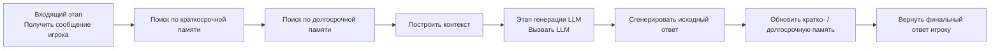

*Рисунок 15.5 Рабочий процесс агента NPC*

### 15.2.2 Ролевой облик NPC и дизайн промпта

Хороший NPC должен иметь яркий характер и чётко определённую роль. В кибергороде мы разработали трёх персонажей, представляющих разные профессии и личности.

**Чжан Сань — Python-разработчик**

Чжан Сань — опытный Python-разработчик, занимающийся ядром фреймворка HelloAgents. Характер строгий, речь прямолинейная, любит профессиональную терминологию. Предъявляет высокие требования к качеству кода, охотно делится приёмами программирования и лучшими практиками.

```python
npc_zhang = {
    "npc_id": "zhang_san",
    "name": "Чжан Сань",
    "role": "Python-разработчик",
    "personality": "Строгий, профессиональный, любит делиться техническими знаниями. Говорит прямо, заботится о качестве кода."
}
```

**Ли Сы — продакт-менеджер**

Ли Сы — опытный продакт-менеджер, отвечающий за планирование продукта HelloAgents и дизайн пользовательского опыта. Характер открытый, умеет общаться, всегда думает с точки зрения пользователя. Любит обсуждать дизайн продукта и пользовательские потребности, часто спрашивает «почему».

```python
npc_li = {
    "npc_id": "li_si",
    "name": "Ли Сы",
    "role": "Продакт-менеджер",
    "personality": "Открытый, коммуникабельный, ориентированный на пользовательский опыт. Любит смотреть на задачи с точки зрения пользователя."
}
```

**Ван У — UI-дизайнер**

Ван У — творческий UI-дизайнер, отвечающий за интерфейсный дизайн и визуальное оформление HelloAgents. Характер мягкий, эстетический вкус самобытный, острое чувство цвета и композиции. Любит обсуждать концепции дизайна и эстетику, охотно делится дизайнерскими идеями.

```python
npc_wang = {
    "npc_id": "wang_wu",
    "name": "Ван У",
    "role": "UI-дизайнер",
    "personality": "Мягкий, творческий, с самобытным эстетическим вкусом. Уделяет внимание визуальному оформлению и пользовательскому опыту."
}
```

У каждого NPC своя специфика — игрок выбирает, с кем общаться, исходя из своих интересов. Чжан Сань научит программированию, Ли Сы обсудит дизайн продукта, Ван У поделится дизайнерскими идеями.

### 15.2.3 Интеграция системы памяти

Система памяти — ключевой элемент интеллекта NPC. NPC, способный помнить прошлые разговоры, воспринимается игроком как более живой и интересный. Мы используем `WorkingMemory` и `EpisodicMemory` из HelloAgents для построения краткосрочной и долгосрочной памяти.

**Краткосрочная память** хранит недавние реплики диалога с ограниченной ёмкостью и автоматически очищается со временем. Её задача — поддерживать связность разговора, чтобы NPC понимал контекст. Например, когда игрок спрашивает «А какого она цвета?», NPC должен найти в краткосрочной памяти, что имеется в виду под «она».

**Долгосрочная память** хранит всю историю диалогов и использует векторную базу для семантического поиска. Когда игрок упоминает какую-то тему, NPC может найти в долгосрочной памяти связанные разговоры и вспомнить, что обсуждалось ранее. Например, на фразу «Помнишь тот проект, о котором мы говорили?» NPC способен найти соответствующие записи.

Архитектура системы памяти показана на рисунке 15.6:

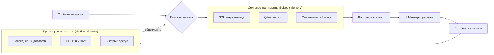

*Рисунок 15.6 Архитектура системы памяти*

На практике агент сначала получает последние реплики из краткосрочной памяти, затем извлекает релевантную историю из долгосрочной, передаёт всё это вместе в LLM — и получает более точный и персонализированный ответ:

```python
# Процесс обработки диалога агентом
def process_dialogue(agent, player_message):
    # 1. Получить последние реплики из краткосрочной памяти
    recent_messages = agent.memory_manager.working_memory.get_recent_messages(5)

    # 2. Найти релевантную историю в долгосрочной памяти
    relevant_memories = agent.memory_manager.episodic_memory.search(
        query=player_message,
        top_k=3
    )

    # 3. Построить контекст
    context = {
        "recent": recent_messages,
        "relevant": relevant_memories
    }

    # 4. Вызвать агента для генерации ответа
    reply = agent.run(player_message, context=context)

    # 5. Сохранить взаимодействие в памяти
    agent.memory_manager.add_interaction(player_message, reply)

    return reply
```

Этот процесс гарантирует, что NPC помнит историю взаимодействий с игроком и отражает это в диалоге.

### 15.2.4 Пакетная генерация диалогов: режим низкой нагрузки

На практике довольно быстро обнаруживается проблема: когда несколько игроков одновременно общаются с разными NPC, бэкенд должен параллельно обрабатывать множество LLM-запросов. Каждый запрос требует вызова API, что повышает затраты и может привести к сбоям или задержкам из-за ограничений параллелизма.

Для решения этой проблемы мы разработали **систему пакетной генерации диалогов**. Суть: объединить запросы к нескольким NPC в один вызов LLM и получить ответы для всех за один раз. По аналогии с «заготовками» в ресторане — блюда приготовлены заранее и подаются по требованию, что резко снижает затраты и задержку.

Рабочий процесс пакетной генерации показан на рисунке 15.7:

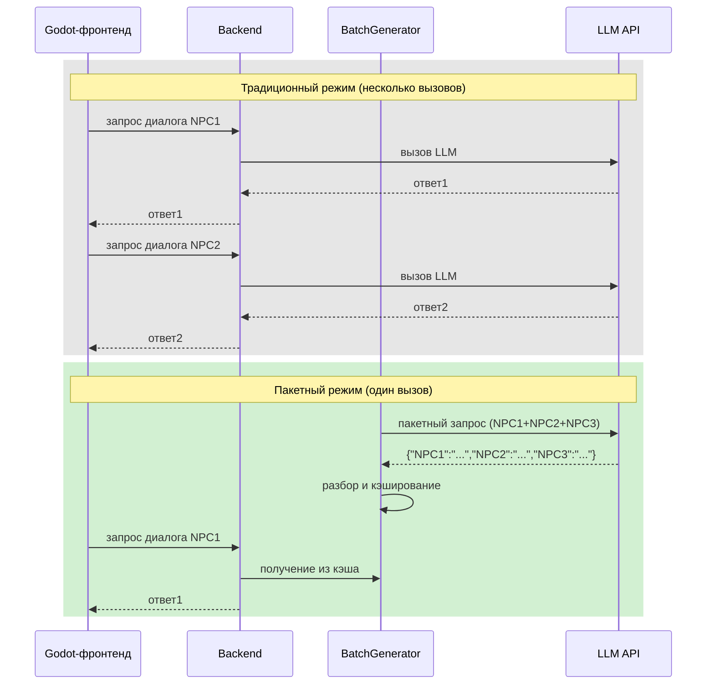

*Рисунок 15.7 Пакетная генерация vs. традиционный режим*

Реализация пакетного генератора весьма элегантна. Мы строим специальный промпт, требующий от LLM сгенерировать диалоги для всех NPC сразу в JSON-формате. Один вызов API даёт ответы для всех персонажей, снижая стоимость втрое и значительно уменьшая задержку:

```python
class NPCBatchGenerator:
    """Генератор пакетных диалогов NPC"""

    def __init__(self):
        self.llm = HelloAgentsLLM()
        self.npc_configs = NPC_ROLES  # конфигурации всех NPC

    def generate_batch_dialogues(self, context: Optional[str] = None) -> Dict[str, str]:
        """Пакетная генерация диалогов для всех NPC

        Args:
            context: контекст сцены (например, «утреннее рабочее время», «обеденный перерыв»)

        Returns:
            Dict[str, str]: отображение имени NPC на текст диалога
        """
        # Строим промпт для пакетной генерации
        prompt = self._build_batch_prompt(context)

        # Один вызов LLM генерирует все диалоги
        response = self.llm.invoke([
            {"role": "system", "content": "Ты генератор диалогов для NPC в игре. Умеешь создавать естественные и реалистичные офисные разговоры."},
            {"role": "user", "content": prompt}
        ])

        # Разбираем JSON-ответ
        dialogues = json.loads(response)
        # Формат ответа: {"Чжан Сань": "...", "Ли Сы": "...", "Ван У": "..."}

        return dialogues

    def _build_batch_prompt(self, context: Optional[str] = None) -> str:
        """Строим промпт для пакетной генерации"""
        # Определяем контекст по времени суток, если не задан
        if context is None:
            context = self._get_current_context()

        # Формируем описания NPC
        npc_descriptions = []
        for name, cfg in self.npc_configs.items():
            desc = f"- {name} ({cfg['title']}): находится в {cfg['location']}, {cfg['activity']}, характер: {cfg['personality']}"
            npc_descriptions.append(desc)

        npc_desc_text = "\n".join(npc_descriptions)

        prompt = f"""Придумай текущую реплику или описание действий для 3 NPC в офисе Datawhale.

【Сцена】{context}

【Информация о NPC】
{npc_desc_text}

【Требования к генерации】
1. Для каждого NPC — одна фраза (20–40 символов)
2. Содержание должно соответствовать роли, текущей активности и атмосфере сцены
3. Может быть монолог, описание рабочего состояния или простые размышления
4. Должно звучать естественно — как настоящие коллеги в офисе
5. **Строго придерживаться формата JSON**

【Формат вывода】(строго соблюдать)
{{"Чжан Сань": "...", "Ли Сы": "...", "Ван У": "..."}}

【Пример вывода】
{{"Чжан Сань": "Этот баг просто невозможный, уже два часа дебажу...", "Ли Сы": "Нужно пересмотреть приоритет этой фичи.", "Ван У": "Какой красивый латте-арт — вдохновение пришло!"}}

Генерируй (только JSON, никакого лишнего текста):
"""
        return prompt
```

Ключевое в этом дизайне — построение промпта. Мы явно требуем от LLM возвращать JSON и приводим пример. LLM строго следует этому формату, и нам остаётся только разобрать JSON, чтобы получить диалоги всех NPC.

Пакетная генерация даёт ещё одно преимущество: все реплики создаются в одном контексте, поэтому между ними есть определённая связность. Например, если Чжан Сань отлаживает баг, Ли Сы может предложить помощь; если Ван У работает над интерфейсом, Чжан Сань может сказать, что зайдёт посмотреть макеты. Это делает атмосферу офиса более реалистичной.

Разумеется, у пакетной генерации есть ограничения. Она лучше подходит для «фоновых реплик» или «монологов» NPC, но не для прямого взаимодействия с игроком. Для инициированных игроком диалогов по-прежнему используется отдельный агент, гарантирующий персонализированность и точность ответов. Основные сценарии применения пакетной генерации:

1. **Фоновые реплики NPC**: что NPC делают и говорят, когда игрок входит в сцену
2. **Плановое обновление**: периодическое обновление состояния и реплик NPC
3. **Атмосфера сцены**: разные диалоги утром, в полдень и вечером
4. **Снижение затрат**: при высокой нагрузке — уменьшение числа вызовов API

**Гибридный режим: пакетная генерация + мгновенный ответ**

В реализации мы применяем гибридный подход, сочетающий оба режима. Система периодически запускает пакетную генерацию в фоне, создавая «фоновые диалоги» для всех NPC в текущей сцене. Эти реплики кэшируются: когда игрок подходит к NPC, но ещё не начал взаимодействие, персонаж показывает их — например, «Дебажу код...» или «Читаю ТЗ...». Это делает NPC «живыми», а не статичными моделями.

Но как только игрок нажимает E, система немедленно переключается в режим мгновенного ответа. Бэкенд вызывает выделенный агент этого NPC, который с учётом конкретного сообщения, истории памяти и симпатий генерирует персонализированный ответ в реальном времени.

```python
# Реализация гибридного режима в main.py
@app.post("/dialogue")
async def dialogue(request: DialogueRequest):
    """Обработка диалога игрока с NPC (режим мгновенного ответа)"""
    npc_id = request.npc_id
    player_message = request.player_message
    player_name = request.player_name

    # Получить агента NPC (у каждого NPC — свой агент)
    agent = npc_agents.get(npc_id)
    if not agent:
        raise HTTPException(status_code=404, detail="NPC не найден")

    # Мгновенная генерация персонализированного ответа
    # Здесь не используется пакетная генерация — вызывается метод run агента
    reply = agent.run(player_message)

    # Обновить симпатию
    affinity_change = relationship_manager.update_affinity(
        npc_id, player_name, player_message, reply
    )

    return {
        "npc_reply": reply,
        "affinity_score": affinity_change["score"],
        "affinity_level": affinity_change["level"]
    }

# Фоновая задача: периодическое обновление фоновых диалогов
async def background_dialogue_update():
    """Фоновая задача: обновление фоновых диалогов NPC каждые 5 минут"""
    while True:
        try:
            # Использовать пакетный генератор для создания диалогов всех NPC
            batch_generator = get_batch_generator()
            dialogues = batch_generator.generate_batch_dialogues()

            # Обновить менеджер состояния
            for npc_name, dialogue in dialogues.items():
                state_manager.update_npc_background_dialogue(npc_name, dialogue)

            print(f"Фоновые диалоги обновлены: {len(dialogues)} NPC")
        except Exception as e:
            print(f"Ошибка обновления фоновых диалогов: {e}")

        # Ждать 5 минут
        await asyncio.sleep(300)
```

Преимущества гибридного режима:

1. **Снижение затрат**: фоновые диалоги генерируются пакетно — один вызов для всех NPC
2. **Гарантия качества**: взаимодействие с игроком — мгновенный ответ, персонализированный и точный
3. **Улучшение опыта**: у NPC всегда есть «фоновые реплики», они выглядят живыми; при взаимодействии ответы точные — опыт отличный
4. **Гибкая настройка**: частоту пакетной генерации можно динамически регулировать в зависимости от нагрузки на сервер

Сочетание пакетной генерации и мгновенного ответа позволяет создать систему NPC, одновременно эффективную и интеллектуальную.

## 15.3 Система симпатий

### 15.3.1 Уровни симпатии

В кибергороде отношение NPC к игроку меняется по ходу взаимодействия. Мы разработали пятиуровневую систему симпатий — от «незнакомца» до «лучшего друга», где каждый уровень имеет свой диапазон очков и соответствующее поведение.

Ключевая идея: количественное измерение отношений делает ответы NPC более реалистичными и многоуровневыми. Когда игрок только заходит в игру, все NPC относятся к нему как к незнакомцу — вежливо, но дистанцированно. По мере диалогов, если игрок ведёт себя дружелюбно, симпатия растёт, а NPC становятся всё более сердечными и разговорчивыми.

Пять уровней симпатии с диапазонами очков показаны на рисунке 15.8:

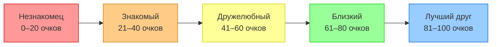

*Рисунок 15.8 Уровни симпатии*

- **Незнакомец (0–20 очков)**: NPC только познакомился с игроком, вежлив, но держит дистанцию. Ответы краткие, личной информацией не делится.

- **Знакомый (21–40 очков)**: NPC начинает запоминать игрока и готов к простому общению. Ответы становятся естественнее, иногда делится рабочей информацией.

- **Дружелюбный (41–60 очков)**: NPC считает игрока другом и охотно делится большим. Ответы подробнее, NPC сам интересуется делами игрока.

- **Близкий (61–80 очков)**: NPC очень доверяет игроку и готов к личным темам. Ответы полны тепла, NPC даёт советы и помощь.

- **Лучший друг (81–100 очков)**: NPC считает игрока лучшим другом — говорит обо всём. Ответы очень искренние, NPC делится своими мыслями и чувствами.

Такой дизайн даёт игроку чётко почувствовать, как меняются отношения с NPC, и служит основой для дальнейших игровых механик. Например, только при определённом уровне симпатии NPC может поделиться особой информацией или предложить специальное задание.

### 15.3.2 Логика расчёта симпатии

При расчёте симпатии нужно учитывать множество факторов. Нельзя просто добавлять фиксированное число за каждый диалог — это выглядело бы механически и неестественно. Хорошая система симпатий должна распознавать настроение игрока и динамически корректировать очки в зависимости от содержания разговора.

В кибергороде мы используем LLM для анализа диалога и определения тональности: дружелюбная, нейтральная или враждебная. На основе вывода корректируем очки симпатии. Этот процесс автоматический — игроку не нужно намеренно выбирать варианты ответа, общение остаётся естественным.

Процесс расчёта симпатии показан на рисунке 15.9:

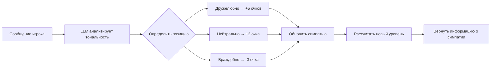

*Рисунок 15.9 Процесс расчёта симпатии*

```python
class RelationshipManager:
    """Менеджер симпатий"""

    def __init__(self):
        self.affinity_data = {}  # хранилище данных симпатии
        self.llm = HelloAgentsLLM()  # для анализа диалогов

    def analyze_sentiment(self, player_message: str, npc_reply: str) -> int:
        """Анализирует тональность диалога, возвращает изменение симпатии"""
        prompt = f"""Проанализируй отношение игрока в следующем диалоге:
Игрок: {player_message}
NPC: {npc_reply}

Определи отношение игрока:
1. Дружелюбное (+5 очков): вежливое, тёплое, благодарное или согласное
2. Нейтральное (+2 очка): обычный вопрос или констатация
3. Враждебное (-3 очка): грубое, холодное, критическое или отрицательное

Верни только число, без лишнего текста."""

        response = self.llm.think([{"role": "user", "content": prompt}])
        try:
            score_change = int(response.strip())
            return max(-3, min(5, score_change))  # ограничение от -3 до 5
        except:
            return 2  # нейтральное по умолчанию

    def update_affinity(self, npc_id: str, player_name: str,
                       player_message: str, npc_reply: str) -> dict:
        """Обновляет симпатию"""
        key = f"{npc_id}_{player_name}"

        # Получить текущую симпатию
        if key not in self.affinity_data:
            self.affinity_data[key] = {
                "score": 0,
                "level": "Незнакомец",
                "interaction_count": 0
            }

        # Анализ тональности диалога
        score_change = self.analyze_sentiment(player_message, npc_reply)

        # Обновить очки
        current_score = self.affinity_data[key]["score"]
        new_score = max(0, min(100, current_score + score_change))

        # Обновить уровень
        level = self.get_affinity_level(new_score)

        # Обновить данные
        self.affinity_data[key].update({
            "score": new_score,
            "level": level,
            "interaction_count": self.affinity_data[key]["interaction_count"] + 1
        })

        return self.affinity_data[key]

    def get_affinity_level(self, score: int) -> str:
        """Возвращает уровень симпатии по очкам"""
        if score <= 20:
            return "Незнакомец"
        elif score <= 40:
            return "Знакомый"
        elif score <= 60:
            return "Дружелюбный"
        elif score <= 80:
            return "Близкий"
        else:
            return "Лучший друг"
```

Реализация использует LLM для анализа содержания диалога и автоматического определения отношения игрока с корректировкой симпатии. Такой дизайн делает систему интеллектуальной и естественной — игроку не нужно специально угождать NPC, достаточно просто общаться.

### 15.3.3 Влияние симпатии на диалог

Симпатия — не просто число, она должна по-настоящему влиять на поведение NPC. В кибергороде мы динамически модифицируем системный промпт NPC, чтобы персонаж менял стиль ответа в зависимости от текущего уровня симпатии.

При низкой симпатии NPC остаётся вежливым, но держит дистанцию. Когда симпатия растёт, персонаж становится теплее и разговорчивее. Это изменение реализуется через динамическую корректировку системного промпта:

```python
def create_npc_agent_with_affinity(npc_id: str, name: str, role: str,
                                   personality: str, affinity_level: str):
    """Создание агента NPC с учётом симпатии"""

    # Корректируем промпт в зависимости от уровня симпатии
    affinity_prompts = {
        "Незнакомец": "Ты только познакомился с этим игроком, будь вежлив, но не слишком тёпел. Отвечай кратко и профессионально.",
        "Знакомый": "Ты уже знаком с этим игроком, общайся с ним спокойно и дружелюбно. Отвечай естественно.",
        "Дружелюбный": "Ты считаешь этого игрока другом и готов делиться большим. Отвечай подробно и тепло.",
        "Близкий": "Ты очень доверяешь этому игроку и можешь затрагивать личные темы. Отвечай с заботой.",
        "Лучший друг": "Ты считаешь этого игрока лучшим другом — можно говорить обо всём. Отвечай искренне и сердечно."
    }

    system_prompt = f"""Ты — {name}, {role}.
Твои черты характера: {personality}

Текущий уровень отношений с игроком: {affinity_level}
{affinity_prompts.get(affinity_level, affinity_prompts["Незнакомец"])}

Ты работаешь в офисе Datawhale вместе с коллегами.
Отвечай, исходя из своей роли, характера и уровня отношений с игроком.
"""

    # Создаём агента
    llm = HelloAgentsLLM()
    agent = SimpleAgent(
        name=name,
        llm=llm,
        system_prompt=system_prompt
    )

    return agent
```

Этот дизайн делает поведение NPC динамически зависимым от симпатии. Игрок отчётливо чувствует, как отношение персонажа постепенно меняется, — это значительно усиливает погружение и интерес.

## 15.4 Реализация бэкенд-сервиса

### 15.4.1 Структура FastAPI-приложения

Бэкенд кибергорода построен на FastAPI: он обрабатывает запросы от Godot-фронтенда, вызывает NPC-агенты HelloAgents, управляет состоянием NPC и симпатиями, а также ведёт логи. Чёткая структура приложения облегчает сопровождение и расширение.

FastAPI-приложение спроектировано по модульному принципу — разные функции вынесены в отдельные файлы, как показано на рисунке 15.10:

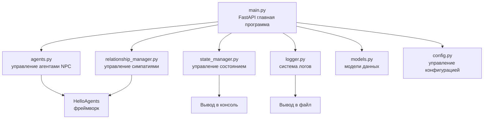

*Рисунок 15.10 Структура бэкенд-приложения*

Начнём с `main.py` — входной точки FastAPI-приложения:

```python
from fastapi import FastAPI, HTTPException
from fastapi.middleware.cors import CORSMiddleware
from pydantic import BaseModel, Field
from typing import Optional
import uvicorn

from agents import NPCAgentManager
from relationship_manager import RelationshipManager
from state_manager import StateManager
from logger import DialogueLogger
from config import settings

# Создаём FastAPI-приложение
app = FastAPI(
    title="Бэкенд-сервис кибергорода",
    description="Система диалогов AI NPC на основе HelloAgents",
    version="1.0.0"
)

# Настраиваем CORS для доступа из Godot-фронтенда
app.add_middleware(
    CORSMiddleware,
    allow_origins=["*"],  # в продакшене следует ограничить конкретными доменами
    allow_credentials=True,
    allow_methods=["*"],
    allow_headers=["*"],
)

# Инициализируем менеджеры
agent_manager = NPCAgentManager()
relationship_manager = RelationshipManager()
state_manager = StateManager()
dialogue_logger = DialogueLogger()

@app.on_event("startup")
async def startup_event():
    """Инициализация при запуске приложения"""
    print("=" * 60)
    print("Запуск бэкенд-сервиса кибергорода...")
    print("=" * 60)

    # Инициализируем агентов NPC
    agent_manager.initialize_npcs()
    print("Агенты NPC инициализированы")

    # Инициализируем менеджер состояния
    state_manager.initialize_npcs()
    print("Менеджер состояния инициализирован")

@app.get("/")
async def root():
    """Проверка работоспособности"""
    return {
        "status": "running",
        "message": "Бэкенд-сервис кибергорода работает",
        "version": "1.0.0",
        "npcs": state_manager.get_npc_count()
    }

if __name__ == "__main__":
    uvicorn.run(
        app,
        host=settings.HOST,
        port=settings.PORT,
        log_level="info"
    )
```

Этот главный файл задаёт базовую структуру FastAPI-приложения: настраивает CORS-middleware для разрешения кросс-доменных запросов и при запуске инициализирует все менеджеры. Конкретные API-маршруты разберём далее.

### 15.4.2 Дизайн API-маршрутов

Бэкенду кибергорода нужны несколько ключевых API-эндпоинтов для обработки запросов Godot-фронтенда. Добавим маршруты в `main.py`.

**Получение статуса NPC**

Этот API возвращает текущее состояние всех NPC — позицию, занятость и прочее:

```python
from models import NPCStatusResponse

@app.get("/npcs/status", response_model=NPCStatusResponse)
async def get_npc_status():
    """Получить состояние всех NPC"""
    npcs = state_manager.get_all_npc_states()
    return {"npcs": npcs}

@app.get("/npcs/{npc_id}/status")
async def get_single_npc_status(npc_id: str):
    """Получить состояние конкретного NPC"""
    npc = state_manager.get_npc_state(npc_id)
    if not npc:
        raise HTTPException(status_code=404, detail=f"NPC {npc_id} не найден")
    return npc
```

**Эндпоинт диалога**

Главный API — обработка диалога между игроком и NPC:

```python
from models import DialogueRequest, DialogueResponse

@app.post("/dialogue", response_model=DialogueResponse)
async def dialogue(request: DialogueRequest):
    """Обработать диалог игрока с NPC"""
    # 1. Проверить, существует ли NPC
    if not agent_manager.has_npc(request.npc_id):
        raise HTTPException(status_code=404, detail=f"NPC {request.npc_id} не найден")

    # 2. Проверить, свободен ли NPC
    if state_manager.is_npc_busy(request.npc_id):
        raise HTTPException(status_code=409, detail=f"NPC {request.npc_id} разговаривает с другим игроком")

    # 3. Пометить NPC как занятого
    state_manager.set_npc_busy(request.npc_id, True)

    try:
        # 4. Получить текущую симпатию
        affinity_info = relationship_manager.get_affinity(
            request.npc_id,
            request.player_name
        )

        # 5. Вызвать агента для генерации ответа
        agent = agent_manager.get_agent(request.npc_id, affinity_info["level"])
        reply = agent.run(request.player_message)

        # 6. Обновить симпатию
        new_affinity = relationship_manager.update_affinity(
            request.npc_id,
            request.player_name,
            request.player_message,
            reply
        )

        # 7. Записать лог
        dialogue_logger.log_dialogue(
            npc_id=request.npc_id,
            player_name=request.player_name,
            player_message=request.player_message,
            npc_reply=reply,
            affinity_info=new_affinity
        )

        # 8. Вернуть ответ
        return DialogueResponse(
            npc_reply=reply,
            affinity_level=new_affinity["level"],
            affinity_score=new_affinity["score"]
        )

    except Exception as e:
        dialogue_logger.log_error(f"Ошибка обработки диалога: {str(e)}")
        raise HTTPException(status_code=500, detail=f"Ошибка обработки диалога: {str(e)}")

    finally:
        # 9. Освободить NPC
        state_manager.set_npc_busy(request.npc_id, False)
```

**Запрос симпатии**

Этот API позволяет узнать симпатию между игроком и NPC:

```python
from models import AffinityInfo

@app.get("/affinity/{npc_id}/{player_name}", response_model=AffinityInfo)
async def get_affinity(npc_id: str, player_name: str):
    """Получить симпатию игрока к NPC"""
    if not agent_manager.has_npc(npc_id):
        raise HTTPException(status_code=404, detail=f"NPC {npc_id} не найден")

    affinity = relationship_manager.get_affinity(npc_id, player_name)
    return affinity
```

Порядок вызова API-маршрутов показан на рисунке 15.11:

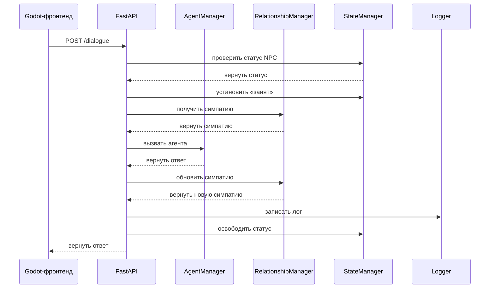

*Рисунок 15.11 Порядок вызова API*

### 15.4.3 Управление состоянием и система логов

**Менеджер состояния**

Менеджер состояния отслеживает текущий статус каждого NPC — позицию, занятость, текущее действие. Это важно для предотвращения проблем параллелизма: один NPC не должен одновременно разговаривать с несколькими игроками.

```python
# state_manager.py
from typing import Dict, List, Optional
from datetime import datetime

class StateManager:
    """Менеджер состояния NPC"""

    def __init__(self):
        self.npc_states: Dict[str, dict] = {}

    def initialize_npcs(self):
        """Инициализировать состояние NPC"""
        npcs = [
            {
                "npc_id": "zhang_san",
                "name": "Чжан Сань",
                "role": "Python-разработчик",
                "position": {"x": 300, "y": 200}
            },
            {
                "npc_id": "li_si",
                "name": "Ли Сы",
                "role": "Продакт-менеджер",
                "position": {"x": 500, "y": 200}
            },
            {
                "npc_id": "wang_wu",
                "name": "Ван У",
                "role": "UI-дизайнер",
                "position": {"x": 700, "y": 200}
            }
        ]

        for npc in npcs:
            self.npc_states[npc["npc_id"]] = {
                **npc,
                "is_busy": False,
                "current_action": "idle",
                "last_interaction": None
            }

    def get_npc_state(self, npc_id: str) -> Optional[dict]:
        """Получить состояние NPC"""
        return self.npc_states.get(npc_id)

    def get_all_npc_states(self) -> List[dict]:
        """Получить состояние всех NPC"""
        return list(self.npc_states.values())

    def is_npc_busy(self, npc_id: str) -> bool:
        """Проверить, занят ли NPC"""
        npc = self.npc_states.get(npc_id)
        return npc["is_busy"] if npc else False

    def set_npc_busy(self, npc_id: str, busy: bool):
        """Установить статус занятости NPC"""
        if npc_id in self.npc_states:
            self.npc_states[npc_id]["is_busy"] = busy
            if busy:
                self.npc_states[npc_id]["last_interaction"] = datetime.now().isoformat()

    def get_npc_count(self) -> int:
        """Получить количество NPC"""
        return len(self.npc_states)
```

**Система логов**

Система логов реализует двойной вывод: в консоль и в файл. Это удобно как для мониторинга в реальном времени, так и для сохранения истории.

```python
# logger.py
import logging
from datetime import datetime
from pathlib import Path

class DialogueLogger:
    """Логгер диалогов"""

    def __init__(self, log_dir: str = "logs"):
        self.log_dir = Path(log_dir)
        self.log_dir.mkdir(exist_ok=True)

        # Имя файла лога (по дате)
        today = datetime.now().strftime("%Y-%m-%d")
        log_file = self.log_dir / f"dialogue_{today}.log"

        # Настройка логгера
        self.logger = logging.getLogger("DialogueLogger")
        self.logger.setLevel(logging.INFO)

        # Обработчик для консоли
        console_handler = logging.StreamHandler()
        console_handler.setLevel(logging.INFO)
        console_formatter = logging.Formatter(
            '%(asctime)s - %(levelname)s - %(message)s',
            datefmt='%H:%M:%S'
        )
        console_handler.setFormatter(console_formatter)

        # Обработчик для файла
        file_handler = logging.FileHandler(log_file, encoding='utf-8')
        file_handler.setLevel(logging.INFO)
        file_formatter = logging.Formatter(
            '%(asctime)s - %(levelname)s - %(message)s',
            datefmt='%Y-%m-%d %H:%M:%S'
        )
        file_handler.setFormatter(file_formatter)

        # Добавляем обработчики
        self.logger.addHandler(console_handler)
        self.logger.addHandler(file_handler)

    def log_dialogue(self, npc_id: str, player_name: str,
                    player_message: str, npc_reply: str,
                    affinity_info: dict):
        """Записать диалог"""
        log_message = f"""
{'='*60}
NPC: {npc_id}
Игрок: {player_name}
Сообщение игрока: {player_message}
Ответ NPC: {npc_reply}
Симпатия: {affinity_info['level']} ({affinity_info['score']}/100)
Взаимодействий: {affinity_info['interaction_count']}
{'='*60}
"""
        self.logger.info(log_message)

    def log_error(self, error_message: str):
        """Записать ошибку"""
        self.logger.error(error_message)
```

Система логов отображает содержимое диалогов в консоли в реальном времени и сохраняет в файл. Каждый день логи записываются в отдельный файл — удобно для последующего анализа.

### 15.4.4 Понимание системы сцен Godot

Прежде чем строить игровые сцены, нужно разобраться с ключевой концепцией Godot — сценами (Scene) и узлами (Node). Это главное отличие Godot от других игровых движков и одна из его самых мощных особенностей.

**Что такое узел?**

Узел — базовый строительный блок Godot. Его можно сравнить с деталью Lego: каждый узел выполняет конкретную задачу. Например, `Sprite2D` отображает изображение, `AudioStreamPlayer` воспроизводит звук, `CharacterBody2D` обрабатывает физическое перемещение персонажа. Godot предлагает сотни типов узлов, каждый специализирован на одном деле.

Узлы образуют иерархию «родитель — потомок» в виде дерева. Родительский узел влияет на дочерние: перемещение родителя двигает всех потомков, скрытие родителя скрывает их тоже. Такая иерархия позволяет легко организовывать и управлять сложными игровыми объектами.

**Что такое сцена?**

Сцена — набор узлов, сохранённых в файле `.tscn`. Её можно считать «заготовкой». Например, создав сцену «Игрок» с узлами спрайта, хитбокса, звука и прочим, можно использовать её в игре многократно — каждое использование создаёт независимый экземпляр.

Сила сцен — в их переиспользуемости и модульности. Одну сцену можно инстанциировать в другой, получая вложенную структуру. Главная сцена может содержать сцену игрока, несколько сцен NPC и UI-сцену. Изменение сцены NPC автоматически влияет на все её экземпляры — обслуживание значительно упрощается.

**Простой пример**

Рассмотрим сцену «Игрок»:

```
Player (CharacterBody2D)  ← корневой узел, физическое движение
├─ AnimatedSprite2D       ← дочерний, анимация персонажа
├─ CollisionShape2D       ← дочерний, форма коллизии
└─ Camera2D               ← дочерний, камера следует за игроком
```

Четыре узла образуют дерево. `CharacterBody2D` — корень, остальные три — его потомки. К каждому узлу можно прикрепить скрипт для управления поведением; к корню — скрипт для координации всех дочерних узлов.

**Преимущества инстанциирования сцен**

В кибергороде три NPC: Чжан Сань, Ли Сы и Ван У. Без системы сцен пришлось бы создавать узлы, задавать свойства и писать скрипты для каждого отдельно — масса повторяющейся работы. С системой сцен достаточно создать одну универсальную сцену NPC, инстанциировать её трижды и через параметры скрипта задать разные имена и роли.

Если нужно добавить новую функцию всем NPC (например, облачко с репликой над головой) — достаточно изменить одну сцену NPC, и все экземпляры автоматически получат её.

## 15.5 Построение игровых сцен Godot

**Почему Godot в качестве игрового движка?**

Среди множества движков мы выбрали Godot 4.5 по нескольким соображениям:

**(1) Godot имеет естественное превосходство в 2D-разработке.** Кибергород — это изометрическая 2D-пиксельная игра, а Godot предоставляет зрелые инструменты именно для этого: TileMap, AnimatedSprite2D, CharacterBody2D — узлы, созданные для 2D. Эффективность разработки значительно выше, чем в Unity. Система сцен позволяет инкапсулировать игрока, NPC, UI в независимые сцены и компоновать их в главной — компонентный подход идеально подходит нашим задачам.

**(2) Godot полностью открытый и бесплатный.** Лицензия MIT — без роялти и отчислений, что дружественно для учебных и открытых проектов. Можно свободно модифицировать исходный код движка и коммерциализировать игру без проблем с лицензированием. Для сравнения: Unity в 2024 году ввёл политику runtime fees, вызвав широкое недовольство сообщества.

**(3) Порог входа в Godot крайне низкий.** Основной язык скриптов — GDScript, динамически типизированный язык, похожий на Python: лаконичный, понятный, с пологой кривой обучения. Для тех, кто уже знает Python, GDScript практически не требует изучения — объявление переменных, определение функций, управляющие конструкции схожи. Освоить написание игровых скриптов можно за несколько часов. Структура дерева узлов наглядна в редакторе — видна иерархия сцены, что очень удобно для новичков.

**(4) Интеграция Godot с Python-бэкендом очень проста.** Встроенный узел HTTPRequest позволяет легко общаться с FastAPI-бэкендом по HTTP. Достаточно создать один скрипт API-клиента, инкапсулирующий все вызовы, — и из игры можно использовать AI-возможности бэкенда. Такая фронтенд/бэкенд-разделённая архитектура позволяет независимо разрабатывать и тестировать игровую логику и AI-логику, существенно повышая эффективность.

Godot имеет и ограничения: в 3D он уступает Unreal Engine и Unity, поэтому для крупных 3D-игр стоит рассмотреть другие движки. Но для 2D-игр, инди-проектов и учебных задач Godot — превосходный выбор.

### 15.5.1 Дизайн сцен и организация ресурсов

После знакомства с системой сцен Godot разберём, как устроены сцены кибергорода. Вся игра состоит из четырёх ключевых сцен: Main (главная), Player (игрок), NPC (персонаж) и DialogueUI (диалоговый интерфейс). Каждая — самостоятельный модуль, который можно редактировать и тестировать отдельно, а затем объединять в единую игру.

Организация сцен кибергорода следует модульному принципу. Сначала создаём три базовых сцены: Player, NPC и DialogueUI. Затем в Main инстанциируем их и компонуем. Особо важно: три NPC (Чжан Сань, Ли Сы, Ван У) — это три экземпляра одной и той же сцены NPC, различающиеся только параметрами ролей.

Структура четырёх ключевых сцен показана на рисунке 15.12:

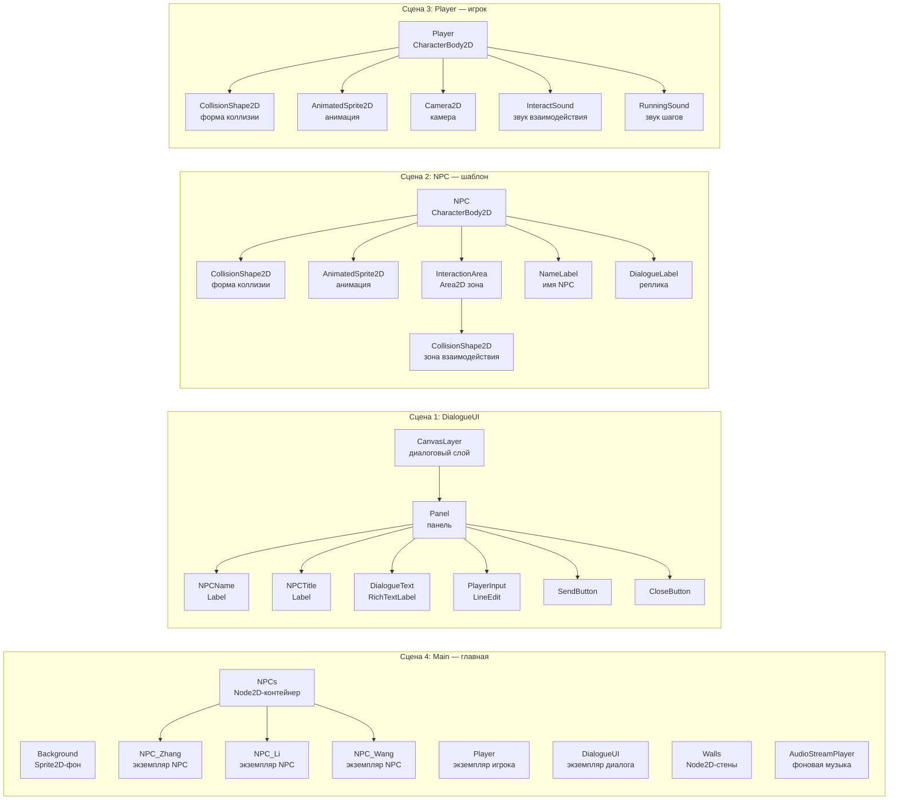

*Рисунок 15.12 Четыре ключевые сцены кибергорода*

На схеме четыре независимые сцены с их внутренней структурой. **Main** содержит фон, игрока, контейнер NPCs (с тремя экземплярами NPC), диалоговый UI, стены и фоновую музыку. Player, NPC_Zhang, NPC_Li, NPC_Wang и DialogueUI здесь — экземпляры сцен, не обычные узлы. **NPC** — универсальный шаблон: Чжан Сань, Ли Сы и Ван У — экземпляры одной и той же сцены. **DialogueUI** — CanvasLayer с панелью и UI-элементами.

Шаги по созданию сцен в Godot:

1. **Создать сцену Player**: новая сцена, корень `CharacterBody2D`, добавить дочерние `AnimatedSprite2D`, `CollisionShape2D`, `Camera2D`, `InteractSound`, `RunningSound`, сохранить как `Player.tscn`.

2. **Создать сцену NPC**: новая сцена, корень `CharacterBody2D`, добавить `CollisionShape2D`, `AnimatedSprite2D`, `InteractionArea` (Area2D, с дочерним `CollisionShape2D`), `NameLabel`, `DialogueLabel`, сохранить как `NPC.tscn`.

3. **Создать сцену DialogueUI**: новая сцена, корень `CanvasLayer`, добавить `Panel`, внутри — `NPCName`, `NPCTitle`, `DialogueText` (RichTextLabel), `PlayerInput` (LineEdit), `SendButton`, `CloseButton`, сохранить как `DialogueUI.tscn`.

4. **Создать главную сцену Main**: новая сцена, корень `Node2D`, добавить `Background` (Sprite2D) как фон, инстанциировать Player, создать узел NPCs и трижды инстанциировать NPC, инстанциировать DialogueUI, создать узел Walls, добавить `AudioStreamPlayer` для фоновой музыки.

Преимущества такой организации сцен: каждая независима и тестируется отдельно; NPC использует один шаблон — изменение одной сцены применяется ко всем экземплярам; сцены общаются через сигналы — низкая связанность, лёгкое сопровождение.

### 15.5.2 Реализация управления игроком

Персонаж игрока — важнейший элемент. Нужно реализовать управление через WASD, переключение анимаций, обнаружение коллизий, взаимодействие с NPC и звуковую систему.

Структура сцены Player: корень `CharacterBody2D` — физическое движение и коллизии; `AnimatedSprite2D` — анимация; `CollisionShape2D` — форма коллизии; `Camera2D` — следует за игроком; два `AudioStreamPlayer` — звук взаимодействия и звук ходьбы.

Скрипт управления игроком `player.gd`:

```python
extends CharacterBody2D

# Скорость передвижения
@export var speed: float = 200.0

# Ближайший NPC для взаимодействия
var nearby_npc: Node = null

# Состояние взаимодействия (запрещает движение во время диалога)
var is_interacting: bool = false

# Ссылки на узлы
@onready var animated_sprite: AnimatedSprite2D = $AnimatedSprite2D
@onready var camera: Camera2D = $Camera2D

# Ссылки на звуковые узлы
@onready var interact_sound: AudioStreamPlayer = null
@onready var running_sound: AudioStreamPlayer = null

# Состояние звука шагов
var is_playing_running_sound: bool = false

func _ready():
    # Добавить в группу player (важно! NPC ищет игрока через эту группу)
    add_to_group("player")

    # Получить звуковые узлы (опционально, ошибки не будет, если узел отсутствует)
    interact_sound = get_node_or_null("InteractSound")
    running_sound = get_node_or_null("RunningSound")

    # Включить камеру
    camera.enabled = true

    # Запустить анимацию по умолчанию
    if animated_sprite.sprite_frames != null and animated_sprite.sprite_frames.has_animation("idle"):
        animated_sprite.play("idle")

func _physics_process(_delta: float):
    # Во время взаимодействия запретить движение
    if is_interacting:
        velocity = Vector2.ZERO
        move_and_slide()
        # Анимация простоя
        if animated_sprite.sprite_frames != null and animated_sprite.sprite_frames.has_animation("idle"):
            animated_sprite.play("idle")
        # Остановить звук шагов
        stop_running_sound()
        return

    # Получить направление ввода
    var input_direction = Input.get_vector("ui_left", "ui_right", "ui_up", "ui_down")

    # Задать скорость
    velocity = input_direction * speed

    # Передвинуть и обработать коллизии
    move_and_slide()

    # Обновить анимацию и направление
    update_animation(input_direction)

    # Обновить звук шагов
    update_running_sound(input_direction)

func update_animation(direction: Vector2):
    """Обновить анимацию персонажа (поддержка 4 направлений)"""
    if animated_sprite.sprite_frames == null:
        return

    if direction.length() > 0:
        # Двигается — определить основное направление
        if abs(direction.x) > abs(direction.y):
            # Движение по горизонтали
            if direction.x > 0:
                # Вправо
                if animated_sprite.sprite_frames.has_animation("walk_right"):
                    animated_sprite.play("walk_right")
                    animated_sprite.flip_h = false
                elif animated_sprite.sprite_frames.has_animation("walk"):
                    animated_sprite.play("walk")
                    animated_sprite.flip_h = false
            else:
                # Влево
                if animated_sprite.sprite_frames.has_animation("walk_left"):
                    animated_sprite.play("walk_left")
                    animated_sprite.flip_h = false
                elif animated_sprite.sprite_frames.has_animation("walk"):
                    animated_sprite.play("walk")
                    animated_sprite.flip_h = true
        else:
            # Движение по вертикали
            if direction.y > 0:
                # Вниз
                if animated_sprite.sprite_frames.has_animation("walk_down"):
                    animated_sprite.play("walk_down")
                elif animated_sprite.sprite_frames.has_animation("walk"):
                    animated_sprite.play("walk")
            else:
                # Вверх
                if animated_sprite.sprite_frames.has_animation("walk_up"):
                    animated_sprite.play("walk_up")
                elif animated_sprite.sprite_frames.has_animation("walk"):
                    animated_sprite.play("walk")
    else:
        # Стоит на месте
        if animated_sprite.sprite_frames.has_animation("idle"):
            animated_sprite.play("idle")

func _input(event: InputEvent):
    # Нажать E для взаимодействия с NPC
    if event is InputEventKey:
        if event.pressed and not event.echo:
            if event.keycode == KEY_E or event.keycode == KEY_ENTER:
                if nearby_npc != null:
                    interact_with_npc()

func interact_with_npc():
    """Взаимодействовать с ближайшим NPC"""
    if nearby_npc != null:
        # Воспроизвести звук взаимодействия
        if interact_sound:
            interact_sound.play()

        # Отправить сигнал системе диалогов
        get_tree().call_group("dialogue_system", "start_dialogue", nearby_npc.npc_name)

func set_nearby_npc(npc: Node):
    """Установить ближайшего NPC"""
    nearby_npc = npc

func set_interacting(interacting: bool):
    """Установить состояние взаимодействия"""
    is_interacting = interacting
    if interacting:
        # Остановить звук шагов
        stop_running_sound()

func update_running_sound(direction: Vector2):
    """Обновить звук шагов"""
    if running_sound == null:
        return

    if direction.length() > 0:
        # Если движется и звук ещё не играет — запустить
        if not is_playing_running_sound:
            running_sound.play()
            is_playing_running_sound = true
    else:
        # Если остановился — остановить звук
        stop_running_sound()

func stop_running_sound():
    """Остановить звук шагов"""
    if running_sound and is_playing_running_sound:
        running_sound.stop()
        is_playing_running_sound = false
```

Скрипт реализует полное управление игроком. WASD (или стрелки) двигают персонажа, анимация меняется по направлению движения (walk_up/down/left/right). Когда игрок входит в зону NPC, тот вызывает `set_nearby_npc(self)` — устанавливает себя как объект взаимодействия. Нажатие E воспроизводит звук и уведомляет систему диалогов через `call_group()`. Во время диалога `set_interacting(true)` блокирует движение, по окончании — разблокирует. Звук шагов запускается при движении и автоматически останавливается.

### 15.5.3 Поведение NPC и взаимодействие

NPC нужны три ключевые возможности: случайное патрулирование по сцене, реакция на взаимодействие с игроком и отображение реплик. Мы используем Area2D для обнаружения игрока — когда тот входит в зону взаимодействия, NPC уведомляет его, и нажатие E начинает диалог.

Структура сцены NPC: `CharacterBody2D` — корень; `CollisionShape2D` — форма коллизии; `AnimatedSprite2D` — анимация; `InteractionArea` (Area2D) — определяет зону взаимодействия (с дочерним `CollisionShape2D`); `NameLabel` — имя NPC; `DialogueLabel` — облачко с репликой.

Скрипт NPC `npc.gd`:

```python
extends CharacterBody2D

# Информация о NPC
@export var npc_name: String = "Чжан Сань"
@export var npc_title: String = "Python-разработчик"

# Настройка внешнего вида
@export var sprite_frames: SpriteFrames = null  # кастомные спрайты

# Параметры передвижения NPC
@export var move_speed: float = 50.0          # скорость
@export var wander_enabled: bool = true        # включить патрулирование
@export var wander_range: float = 200.0        # радиус патрулирования
@export var wander_interval_min: float = 3.0   # мин. интервал (сек)
@export var wander_interval_max: float = 8.0   # макс. интервал (сек)

# Текущая реплика (получена с бэкенда)
var current_dialogue: String = ""

# Ссылки на узлы
@onready var animated_sprite: AnimatedSprite2D = $AnimatedSprite2D
@onready var interaction_area: Area2D = $InteractionArea
@onready var name_label: Label = $NameLabel
@onready var dialogue_label: Label = $DialogueLabel

# Ссылка на игрока
var player: Node = null

# Переменные патрулирования
var wander_target: Vector2 = Vector2.ZERO   # целевая позиция
var wander_timer: float = 0.0              # таймер патрулирования
var is_wandering: bool = false              # патрулирует ли сейчас
var is_interacting: bool = false           # взаимодействует ли с игроком
var spawn_position: Vector2 = Vector2.ZERO # позиция появления

func _ready():
    # Добавить в группу npcs
    add_to_group("npcs")

    # Задать имя NPC
    name_label.text = npc_name

    # Подключить сигналы зоны взаимодействия
    interaction_area.body_entered.connect(_on_body_entered)
    interaction_area.body_exited.connect(_on_body_exited)

    # Инициализировать метку реплики
    dialogue_label.text = ""
    dialogue_label.visible = false

    # Задать кастомные спрайты (если есть)
    if sprite_frames != null:
        animated_sprite.sprite_frames = sprite_frames

    # Запустить анимацию по умолчанию
    if animated_sprite.sprite_frames != null and animated_sprite.sprite_frames.has_animation("idle"):
        animated_sprite.play("idle")

    # Запомнить позицию появления
    spawn_position = global_position

    # Инициализировать таймер патрулирования
    if wander_enabled:
        wander_timer = randf_range(wander_interval_min, wander_interval_max)
        choose_new_wander_target()

func _on_body_entered(body: Node2D):
    """Игрок вошёл в зону взаимодействия"""
    if body.is_in_group("player"):
        player = body

        if player.has_method("set_nearby_npc"):
            player.set_nearby_npc(self)

func _on_body_exited(body: Node2D):
    """Игрок покинул зону взаимодействия"""
    if body.is_in_group("player"):
        if player != null and player.has_method("set_nearby_npc"):
            player.set_nearby_npc(null)
        player = null

func update_dialogue(dialogue: String):
    """Обновить реплику NPC"""
    current_dialogue = dialogue
    dialogue_label.text = dialogue
    dialogue_label.visible = true

    # Скрыть реплику через 10 секунд
    await get_tree().create_timer(10.0).timeout
    dialogue_label.visible = false

func _physics_process(delta: float):
    """Физическое обновление — обработка движения"""
    # Если взаимодействует с игроком — не двигаться
    if is_interacting:
        velocity = Vector2.ZERO
        move_and_slide()
        if animated_sprite.sprite_frames != null and animated_sprite.sprite_frames.has_animation("idle"):
            animated_sprite.play("idle")
        return

    # Если патрулирование отключено — не двигаться
    if not wander_enabled:
        return

    # Обновить таймер патрулирования
    wander_timer -= delta

    # Если таймер истёк — выбрать новую цель
    if wander_timer <= 0:
        choose_new_wander_target()
        wander_timer = randf_range(wander_interval_min, wander_interval_max)

    # Если патрулирует — двигаться к цели
    if is_wandering:
        if global_position.distance_to(wander_target) < 10:
            # Достиг цели — остановиться
            is_wandering = false
            velocity = Vector2.ZERO
            move_and_slide()
            if animated_sprite.sprite_frames != null and animated_sprite.sprite_frames.has_animation("idle"):
                animated_sprite.play("idle")
        else:
            # Продолжать движение к цели
            var direction = (wander_target - global_position).normalized()
            velocity = direction * move_speed
            move_and_slide()
            update_animation(direction)
    else:
        velocity = Vector2.ZERO
        move_and_slide()
        if animated_sprite.sprite_frames != null and animated_sprite.sprite_frames.has_animation("idle"):
            animated_sprite.play("idle")

func choose_new_wander_target():
    """Выбрать новую точку патрулирования"""
    var offset = Vector2(
        randf_range(-wander_range, wander_range),
        randf_range(-wander_range, wander_range)
    )
    wander_target = spawn_position + offset
    is_wandering = true

func update_animation(direction: Vector2):
    """Обновить анимацию"""
    if animated_sprite.sprite_frames == null:
        return

    if direction.length() > 0:
        if abs(direction.x) > abs(direction.y):
            if direction.x > 0:
                if animated_sprite.sprite_frames.has_animation("walk_right"):
                    animated_sprite.play("walk_right")
                elif animated_sprite.sprite_frames.has_animation("walk"):
                    animated_sprite.play("walk")
                    animated_sprite.flip_h = false
            else:
                if animated_sprite.sprite_frames.has_animation("walk_left"):
                    animated_sprite.play("walk_left")
                elif animated_sprite.sprite_frames.has_animation("walk"):
                    animated_sprite.play("walk")
                    animated_sprite.flip_h = true
        else:
            if direction.y > 0:
                if animated_sprite.sprite_frames.has_animation("walk_down"):
                    animated_sprite.play("walk_down")
                elif animated_sprite.sprite_frames.has_animation("walk"):
                    animated_sprite.play("walk")
            else:
                if animated_sprite.sprite_frames.has_animation("walk_up"):
                    animated_sprite.play("walk_up")
                elif animated_sprite.sprite_frames.has_animation("walk"):
                    animated_sprite.play("walk")
    else:
        if animated_sprite.sprite_frames.has_animation("idle"):
            animated_sprite.play("idle")

func set_interacting(interacting: bool):
    """Установить состояние взаимодействия"""
    is_interacting = interacting
```

Скрипт реализует полное поведение NPC. Персонаж случайно патрулирует в радиусе `wander_range` от точки появления, каждые `wander_interval_min`–`wander_interval_max` секунд выбирая новую цель и двигаясь к ней с анимацией ходьбы (walk_up/down/left/right). Когда игрок входит в InteractionArea, NPC вызывает `set_nearby_npc(self)`. После нажатия E система диалогов вызывает `set_interacting(true)` — NPC останавливается; по окончании диалога `set_interacting(false)` — возобновляет патрулирование. Главная сцена периодически вызывает `update_dialogue()` для обновления облачка с репликой.

## 15.6 Реализация взаимодействия фронтенда и бэкенда

### 15.6.1 Инкапсуляция API-клиента

Godot-фронтенд должен взаимодействовать с FastAPI-бэкендом через HTTP. Создадим скрипт API-клиента `api_client.gd`, инкапсулирующий все вызовы API, и настроим его как AutoLoad-синглтон (автозагрузку), чтобы другие скрипты могли легко его использовать.

API-клиент использует узел HTTPRequest для отправки запросов. HTTPRequest работает асинхронно — после отправки запроса игра не блокируется, а результат приходит через сигнал. Это гарантирует плавность игры даже при высокой задержке сети. Для каждого API создаётся отдельный узел HTTPRequest, что позволяет отправлять несколько запросов одновременно без взаимных помех:

```python
# api_client.gd
extends Node

# Определение сигналов
signal chat_response_received(npc_name: String, message: String)
signal chat_error(error_message: String)
signal npc_status_received(dialogues: Dictionary)
signal npc_list_received(npcs: Array)

# Узлы HTTP-запросов
var http_chat: HTTPRequest
var http_status: HTTPRequest
var http_npcs: HTTPRequest

func _ready():
    # Создать узлы HTTP-запросов
    http_chat = HTTPRequest.new()
    http_status = HTTPRequest.new()
    http_npcs = HTTPRequest.new()

    add_child(http_chat)
    add_child(http_status)
    add_child(http_npcs)

    # Подключить сигналы
    http_chat.request_completed.connect(_on_chat_request_completed)
    http_status.request_completed.connect(_on_status_request_completed)
    http_npcs.request_completed.connect(_on_npcs_request_completed)

# ==================== API диалога ====================
func send_chat(npc_name: String, message: String) -> void:
    """Отправить запрос диалога"""
    var data = {
        "npc_name": npc_name,
        "message": message
    }

    var json_string = JSON.stringify(data)
    var headers = ["Content-Type: application/json"]

    var error = http_chat.request(
        Config.API_CHAT,
        headers,
        HTTPClient.METHOD_POST,
        json_string
    )

    if error != OK:
        print("[ERROR] Ошибка отправки запроса диалога: ", error)
        chat_error.emit("Ошибка сетевого запроса")

func _on_chat_request_completed(_result: int, response_code: int, _headers: PackedStringArray, body: PackedByteArray) -> void:
    """Обработать ответ диалога"""
    if response_code != 200:
        print("[ERROR] Запрос диалога неудачен: HTTP ", response_code)
        chat_error.emit("Ошибка сервера: " + str(response_code))
        return

    var json = JSON.new()
    var parse_result = json.parse(body.get_string_from_utf8())

    if parse_result != OK:
        print("[ERROR] Ошибка разбора ответа")
        chat_error.emit("Ошибка разбора ответа")
        return

    var response = json.data

    if response.has("success") and response["success"]:
        var npc_name = response["npc_name"]
        var msg = response["message"]
        print("[INFO] Получен ответ NPC: ", npc_name, " -> ", msg)
        chat_response_received.emit(npc_name, msg)
    else:
        chat_error.emit("Диалог не удался")

# ==================== API статуса NPC ====================
func get_npc_status() -> void:
    """Получить статус NPC"""
    # Проверить, не обрабатывается ли уже запрос
    if http_status.get_http_client_status() != HTTPClient.STATUS_DISCONNECTED:
        print("[WARN] Запрос статуса NPC уже обрабатывается, пропуск")
        return

    var error = http_status.request(Config.API_NPC_STATUS)

    if error != OK:
        print("[ERROR] Ошибка получения статуса NPC: ", error)

func _on_status_request_completed(_result: int, response_code: int, _headers: PackedStringArray, body: PackedByteArray) -> void:
    """Обработать ответ статуса NPC"""
    if response_code != 200:
        print("[ERROR] Запрос статуса NPC неудачен: HTTP ", response_code)
        return

    var json = JSON.new()
    var parse_result = json.parse(body.get_string_from_utf8())

    if parse_result != OK:
        print("[ERROR] Ошибка разбора статуса NPC")
        return

    var response = json.data

    if response.has("dialogues"):
        var dialogues = response["dialogues"]
        print("[INFO] Получено обновление статуса NPC: ", dialogues.size(), " NPC")
        npc_status_received.emit(dialogues)

# ==================== API списка NPC ====================
func get_npc_list() -> void:
    """Получить список NPC"""
    var error = http_npcs.request(Config.API_NPCS)

    if error != OK:
        print("[ERROR] Ошибка получения списка NPC: ", error)

func _on_npcs_request_completed(_result: int, response_code: int, _headers: PackedStringArray, body: PackedByteArray) -> void:
    """Обработать ответ списка NPC"""
    if response_code != 200:
        print("[ERROR] Запрос списка NPC неудачен: HTTP ", response_code)
        return

    var json = JSON.new()
    var parse_result = json.parse(body.get_string_from_utf8())

    if parse_result != OK:
        print("[ERROR] Ошибка разбора списка NPC")
        return

    var response = json.data

    if response.has("npcs"):
        var npcs = response["npcs"]
        print("[INFO] Получен список NPC: ", npcs.size(), " NPC")
        npc_list_received.emit(npcs)
```

API-клиент инкапсулирует три ключевые функции: отправку запроса диалога (`send_chat`), получение статуса NPC (`get_npc_status`) и получение списка NPC (`get_npc_list`). Все HTTP-запросы асинхронные — результаты доставляются через сигналы. URL адреса берутся из синглтона Config. Система диалогов слушает `chat_response_received` для получения ответов NPC, главная сцена слушает `npc_status_received` для обновления реплик персонажей.

### 15.6.2 Реализация диалогового UI

Диалоговый UI — интерфейс взаимодействия игрока с NPC. Нужен лаконичный красивый диалоговый блок с именем и должностью NPC, полем отображения диалога, полем ввода и кнопками.

Структура диалогового UI показана на рисунке 15.13:

```
DialogueUI (CanvasLayer)
└── Panel (фоновая панель диалога)
    ├── NPCName (Label — имя NPC)
    ├── NPCTitle (Label — должность)
    ├── DialogueText (RichTextLabel — содержание диалога)
    ├── PlayerInput (LineEdit — поле ввода)
    ├── SendButton (кнопка «Отправить»)
    └── CloseButton (кнопка «Закрыть»)
```

*Рисунок 15.13 Структура диалогового UI*

Дизайн очень прост. DialogueUI — CanvasLayer, то есть всегда отображается поверх остального и не перекрывается другими объектами. Panel — фон диалога, закреплённый в нижней части экрана. NPCName показывает имя персонажа, NPCTitle — должность, DialogueText использует RichTextLabel (поддерживает форматирование — цвет, жирный и пр.), PlayerInput — LineEdit для ввода текста, SendButton и CloseButton — кнопки отправки и закрытия.

Скрипт `dialogue_ui.gd`:

```python
# dialogue_ui.gd
extends CanvasLayer

# Ссылки на UI-узлы
@onready var panel = $Panel
@onready var npc_name_label = $Panel/NPCName
@onready var npc_title_label = $Panel/NPCTitle
@onready var dialogue_text = $Panel/DialogueText
@onready var input_field = $Panel/PlayerInput
@onready var send_button = $Panel/SendButton
@onready var close_button = $Panel/CloseButton

# API-клиент
var api_client: Node = null

# Имя NPC текущего диалога
var current_npc_name: String = ""

func _ready():
    # Скрыть диалоговое окно при инициализации
    visible = false

    # Подключить сигналы кнопок
    send_button.pressed.connect(_on_send_button_pressed)
    close_button.pressed.connect(_on_close_button_pressed)
    input_field.text_submitted.connect(_on_text_submitted)

    # Получить API-клиент
    api_client = get_node_or_null("/root/APIClient")

func start_dialogue(npc_name: String):
    """Начать диалог с NPC"""
    current_npc_name = npc_name

    # Задать информацию о NPC
    npc_name_label.text = npc_name
    npc_title_label.text = get_npc_title(npc_name)

    # Очистить содержимое диалога
    dialogue_text.clear()
    dialogue_text.append_text("[color=gray]Диалог с " + npc_name + " начат...[/color]\n")

    # Очистить поле ввода
    input_field.text = ""

    # Показать диалоговое окно
    show_dialogue()

    # Поставить фокус на поле ввода
    input_field.grab_focus()

func show_dialogue():
    """Показать диалоговое окно"""
    visible = true

    # Уведомить игрока о переходе в режим взаимодействия (запрет движения)
    var player = get_tree().get_first_node_in_group("player")
    if player and player.has_method("set_interacting"):
        player.set_interacting(true)

func hide_dialogue():
    """Скрыть диалоговое окно"""
    visible = false
    current_npc_name = ""

    # Уведомить игрока о выходе из режима взаимодействия (разрешить движение)
    var player = get_tree().get_first_node_in_group("player")
    if player and player.has_method("set_interacting"):
        player.set_interacting(false)

func _on_send_button_pressed():
    """Нажата кнопка «Отправить»"""
    send_message()

func _on_close_button_pressed():
    """Нажата кнопка «Закрыть»"""
    hide_dialogue()

func _on_text_submitted(_text: String):
    """Нажат Enter в поле ввода"""
    send_message()

func send_message():
    """Отправить сообщение"""
    var message = input_field.text.strip_edges()

    if message.is_empty():
        return

    if current_npc_name.is_empty():
        return

    # Показать сообщение игрока
    dialogue_text.append_text("\n[color=cyan]Игрок:[/color] " + message + "\n")

    # Очистить поле ввода
    input_field.text = ""

    # Заблокировать ввод на время ожидания
    input_field.editable = false
    send_button.disabled = true

    # Отправить API-запрос
    if api_client:
        api_client.send_chat_request(current_npc_name, message)

func on_chat_response_received(npc_name: String, response: String):
    """Получен ответ NPC"""
    if npc_name == current_npc_name:
        # Показать ответ NPC
        dialogue_text.append_text("[color=yellow]" + npc_name + ":[/color] " + response + "\n")

        # Разблокировать ввод
        input_field.editable = true
        send_button.disabled = false
        input_field.grab_focus()

func get_npc_title(npc_name: String) -> String:
    """Получить должность NPC"""
    var titles = {
        "Чжан Сань": "Python-разработчик",
        "Ли Сы": "Продакт-менеджер",
        "Ван У": "UI-дизайнер"
    }
    return titles.get(npc_name, "")
```

Диалоговый UI реализует полный функционал. Игрок вводит сообщение и отправляет; RichTextLabel с `append_text` отображает диалог с форматированием (цвет, стиль). Все вызовы API асинхронны — поле ввода блокируется на время ожидания, предотвращая повторную отправку. При открытии диалогового окна игрок переходит в режим взаимодействия (движение запрещено), при закрытии — восстанавливается.

### 15.6.3 Объединение в главной сцене

Наконец, соберём всё воедино в главной сцене: управление игроком, взаимодействие с NPC, диалоговый UI и обновление статуса NPC. Скрипт главной сцены `main.gd` координирует компоненты и периодически запрашивает статус NPC с бэкенда для обновления реплик:

```python
# main.gd
extends Node2D

# Ссылки на NPC
@onready var npc_zhang: Node2D = $NPCs/NPC_Zhang
@onready var npc_li: Node2D = $NPCs/NPC_Li
@onready var npc_wang: Node2D = $NPCs/NPC_Wang

# API-клиент
var api_client: Node = null

# Таймер обновления статуса NPC
var status_update_timer: float = 0.0

func _ready():
    print("[INFO] Инициализация главной сцены")

    # Получить API-клиент
    api_client = get_node_or_null("/root/APIClient")
    if api_client:
        api_client.npc_status_received.connect(_on_npc_status_received)

        # Сразу запросить статус NPC
        api_client.get_npc_status()
    else:
        print("[ERROR] API-клиент не найден")

func _process(delta: float):
    # Периодически обновлять статус NPC
    status_update_timer += delta
    if status_update_timer >= Config.NPC_STATUS_UPDATE_INTERVAL:
        status_update_timer = 0.0
        if api_client:
            api_client.get_npc_status()

func _on_npc_status_received(dialogues: Dictionary):
    """Получено обновление статуса NPC"""
    print("[INFO] Обновление статуса NPC: ", dialogues)

    # Обновить реплики каждого NPC
    for npc_name in dialogues:
        var dialogue = dialogues[npc_name]
        update_npc_dialogue(npc_name, dialogue)

func update_npc_dialogue(npc_name: String, dialogue: String):
    """Обновить реплику конкретного NPC"""
    var npc_node = get_npc_node(npc_name)
    if npc_node and npc_node.has_method("update_dialogue"):
        npc_node.update_dialogue(dialogue)

func get_npc_node(npc_name: String) -> Node2D:
    """Получить узел NPC по имени"""
    match npc_name:
        "Чжан Сань":
            return npc_zhang
        "Ли Сы":
            return npc_li
        "Ван У":
            return npc_wang
        _:
            return null
```

Ключевая функция скрипта главной сцены — периодическое получение статуса NPC с бэкенда. В `_ready()` получаем ссылку на синглтон APIClient, подключаем сигнал `npc_status_received` и сразу запрашиваем статус. В `_process()` таймер через каждые `Config.NPC_STATUS_UPDATE_INTERVAL` секунд (по умолчанию 30) вызывает `get_npc_status()`. При получении обновления `_on_npc_status_received()` обходит всех NPC и вызывает `update_dialogue()` для обновления реплики. Таким образом, даже если игрок не взаимодействует с NPC, над персонажами всё равно периодически появляются реплики.

Полный процесс взаимодействия фронтенда и бэкенда показан на рисунке 15.14:

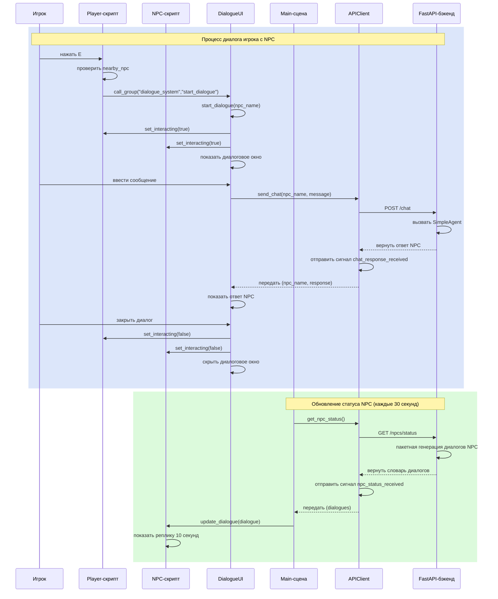

*Рисунок 15.14 Полный процесс взаимодействия фронтенда и бэкенда*

На этом реализованы все функции взаимодействия фронтенда и бэкенда. Игрок свободно перемещается по сцене, общается с NPC на естественном языке. Главная сцена периодически запрашивает статус NPC и обновляет реплики — NPC ведут себя как живые, даже без взаимодействия с игроком. Система использует сигналы — компоненты слабо связаны, легко сопровождаются и расширяются.

## 15.7 Заключение и перспективы

### 15.7.1 Обзор главы

В этой главе мы реализовали целостный AI-проект — Кибергород. Он соединил фреймворк HelloAgents с игровым движком Godot и породил живой виртуальный мир. Подведём итог того, что мы изучили.

**Архитектурное проектирование**

Мы применили разделение на игровой движок и бэкенд-сервис: фронтенд-рендеринг, бэкенд-логика и AI-интеллект разнесены по разным слоям. Godot отвечает за игровую графику и взаимодействие с игроком, FastAPI — за API-сервисы и управление состоянием, HelloAgents — за интеллект NPC и систему памяти. Такая многоуровневая архитектура позволяет разрабатывать и тестировать каждую часть независимо и создаёт хорошую основу для дальнейшего расширения.

**Система агентов NPC**

С помощью `SimpleAgent` из HelloAgents мы создали отдельного агента для каждого NPC. У каждого NPC есть собственная ролевая установка, характер и система памяти. Через тщательно подобранные системные промпты Чжан Сань стал педантичным Python-инженером, Ли Сы — общительным продакт-менеджером, а Ван У — креативным UI-дизайнером. Эти NPC не только понимают реплики игрока, но и отвечают в соответствии со своими ролевыми особенностями.

**Память и система симпатий**

Мы реализовали двухуровневую память: краткосрочная память поддерживает связность диалога, долгосрочная — хранит всю историю взаимодействий. Благодаря семантическому поиску в векторной БД NPC может вспоминать ранее обсуждавшиеся темы. Система симпатий заставляет отношение NPC к игроку меняться по мере общения — от незнакомца к близкому другу, и каждый уровень проявляется в поведении. Эти решения делают NPC более живыми и интересными.

**Построение игровой сцены**

С помощью Godot мы построили пиксельную офисную сцену, реализовали управление игроком, перемещение NPC, обнаружение взаимодействия и UI диалогов. Модульность системы сцен позволяет легко добавлять новых NPC, новые сцены и новый функционал. Лаконичный синтаксис GDScript делает реализацию игровой логики наглядной и эффективной.

**Связь фронтенда и бэкенда**

Связь Godot-фронтенда с FastAPI-бэкендом реализована через HTTP REST API. Асинхронные запросы и сигнальная система гарантируют плавность игры — даже при высоких сетевых задержках это не влияет на впечатления игрока. Инкапсуляция API-клиента позволяет другим скриптам удобно обращаться к бэкенд-сервисам, а UI диалогов даёт игроку естественное общение с NPC.

Технологический стек проекта показан на рисунке 15.15:

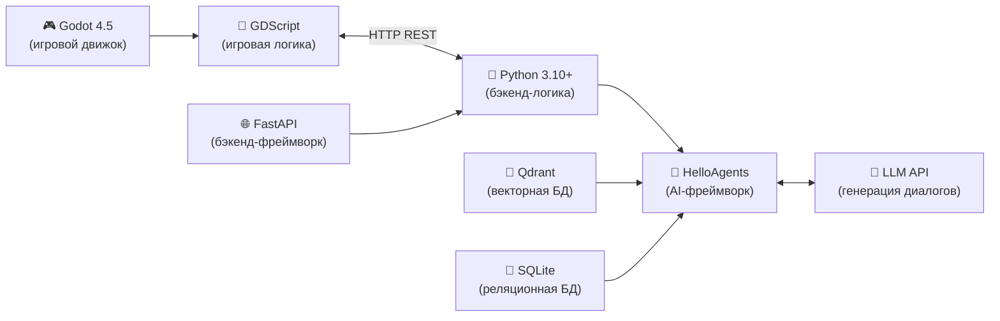
*Рисунок 15.15 Технологический стек Кибергорода*

### 15.7.2 Направления для расширения

Кибергород — это только отправная точка, и развивать его можно по многим направлениям. Эти расширения сделают проект интереснее и заодно откроют новые возможности применения AI в играх.

**(1) Поддержка многопользовательской онлайн-игры**

Сейчас Кибергород — однопользовательский. Его можно превратить в многопользовательскую онлайн-игру: несколько игроков одновременно входят в один офис, взаимодействуют с NPC и друг с другом. Для этого понадобится WebSocket-связь в реальном времени и БД для персистентного хранения данных игроков и состояния NPC. NPC смогут запоминать взаимодействия с разными игроками и поддерживать отдельный уровень симпатии для каждого.

**(2) Система заданий**

Для NPC можно спроектировать систему заданий. Когда уровень симпатии игрока с NPC достигает определённой отметки, NPC предлагает особое задание: Чжан Сань может попросить помочь с отладкой кода, Ли Сы — собрать отзывы пользователей, Ван У — оценить макет дизайна. За выполнение задания — награда и дополнительный рост симпатии.

**(3) Взаимодействие NPC между собой**

Сейчас NPC общаются только с игроком, но можно дать им возможность общаться и друг с другом. Чжан Сань обсуждает требования к продукту с Ли Сы, Ли Сы обсуждает дизайн интерфейса с Ван У, Ван У обсуждает техническую реализацию с Чжан Санем. Эти взаимодействия могут происходить в фоне, а игрок может наблюдать за их разговорами — мир станет ощутимо живее.

**(4) Эмоциональная система**

Помимо симпатии у NPC можно реализовать более сложную эмоциональную систему. Радость, грусть, злость, восторг — разные эмоции влияют на стиль ответа и поведение. В хорошем настроении NPC охотнее делится информацией, в плохом — сухо отвечает.

**(5) Динамические события**

Можно проектировать динамические события, которые сделают мир разнообразнее: регулярные планёрки, где все NPC и игрок обсуждают прогресс проекта; празднование дня рождения какого-то из NPC; внезапные срочные задания, требующие совместной работы. Такие события вносят изменчивость и интерес.

**(6) Расширение мира**

Сейчас в Кибергороде только одна офисная сцена, но мир можно расширить: добавить кафе, библиотеку, парк — у каждого места свои NPC и свой стиль взаимодействия. Игрок свободно перемещается между сценами и исследует более просторный виртуальный мир.

**(7) Индивидуальное обучение**

NPC может запоминать предпочтения и привычки конкретного игрока. Если игрок часто обсуждает Python с Чжан Санем, NPC запомнит интерес к программированию и в будущем сам инициирует разговоры на эту тему. Если игрок чаще играет вечером, NPC станет вечером заметно активнее.

### 15.7.3 Размышления и взгляд в будущее

Кибергород демонстрирует огромный потенциал AI в играх. В традиционных играх NPC ограничены заранее прописанными диалоговыми деревьями и скриптами; AI-NPC же понимают и порождают естественный язык — игрок получает настоящий диалог. Это не только повышает погружение, но и открывает новые возможности для геймдизайна.

Но у AI-NPC есть и сложности. Во-первых, стоимость: каждый диалог требует обращения к LLM API, что не бесплатно. Для крупной многопользовательской игры суммарные расходы могут оказаться весьма значительными. Во-вторых, задержки: инференс LLM требует времени, и при сетевой задержке игроку придётся ждать ответа NPC несколько секунд. И, наконец, контроль контента: то, что генерирует LLM, не полностью предсказуемо, поэтому нужно тщательно проработанные промпты и механизмы фильтрации.

Несмотря на эти сложности, у AI-NPC многообещающее будущее. По мере развития LLM-технологий инференс становится быстрее, а стоимость — ниже. Активно развиваются локальные малые LLM, которые в перспективе будут запускаться прямо на устройстве игрока — без сетевых запросов. Сочетание AI и игр откроет игрокам беспрецедентный опыт.

В пятой части (глава о дипломном проекте) мы изучим, как с помощью одного и нескольких агентов строить универсального агента — это будет ваше пространство для творчества, оставайтесь с нами!

