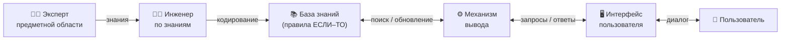
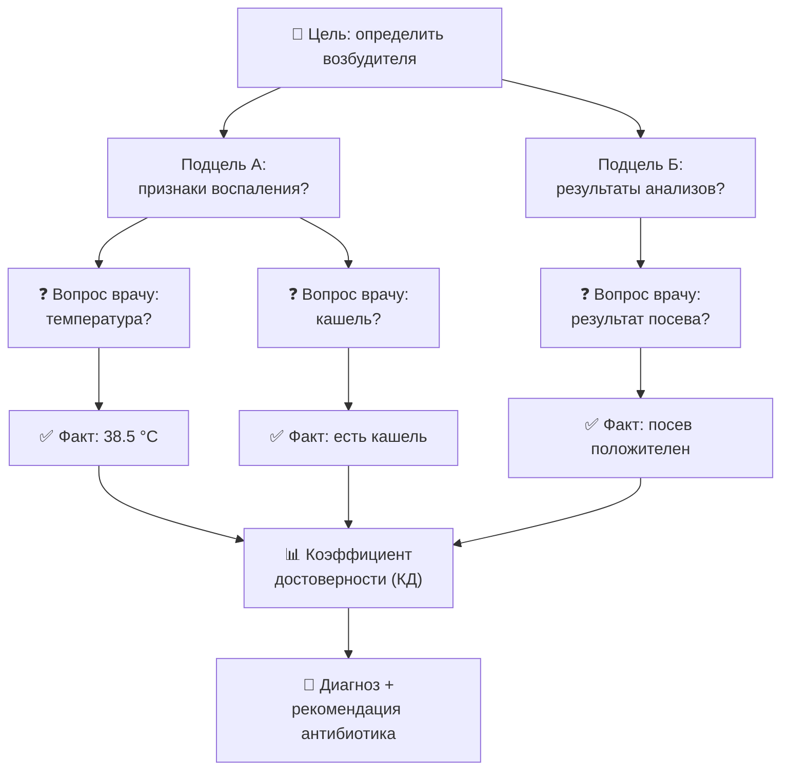
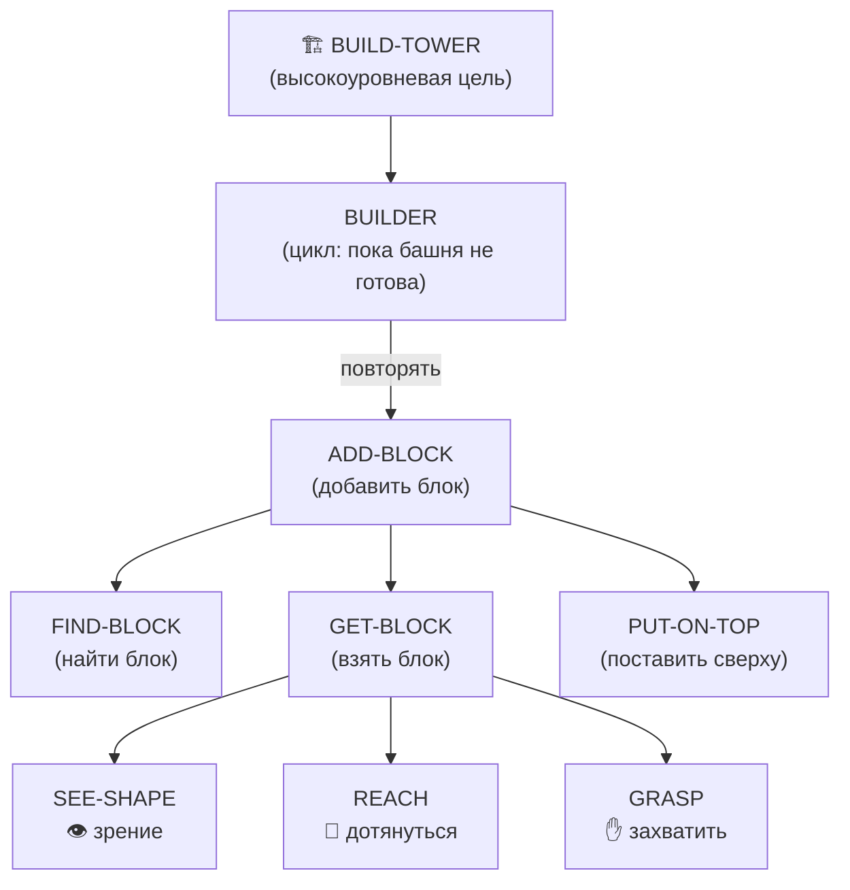
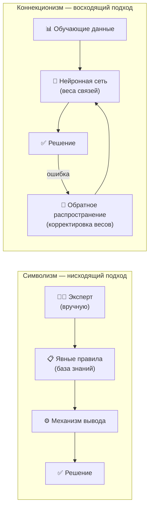
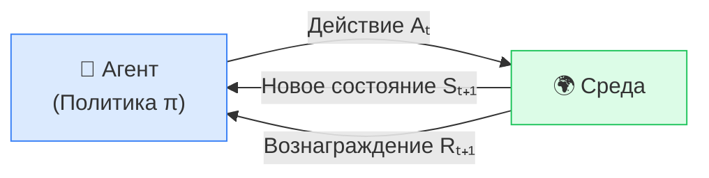
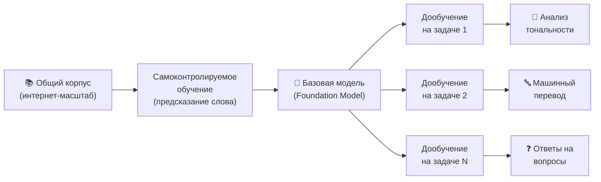
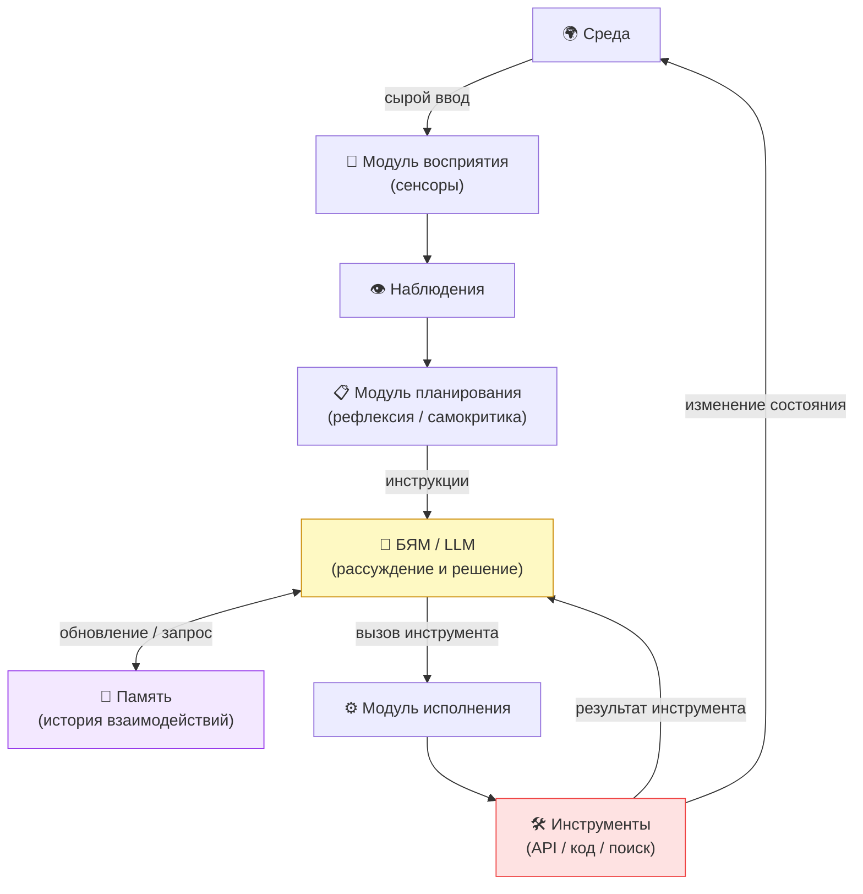

# Глава 2: Схемы в формате Mermaid — тест

> Экспериментальный файл. Оригинальный перевод не изменён.
> Здесь — схемы из главы 2, перерисованные как Mermaid-диаграммы с подписями на русском.

---

## Рисунок 2.3 — Общая архитектура экспертных систем

---

## Рисунок 2.4 — Обратная цепочка рассуждений MYCIN

---

## Рисунок 2.6 — Иерархия агентов при строительстве башни («Общество разума»)

---

## Рисунок 2.7 — Символизм vs Коннекционизм

---

## Рисунок 2.8 — Ключевой контур взаимодействия в обучении с подкреплением

---

## Рисунок 2.9 — Парадигма «предобучение → дообучение»

---

## Рисунок 2.10 — Архитектура ключевых компонентов LLM-агента

