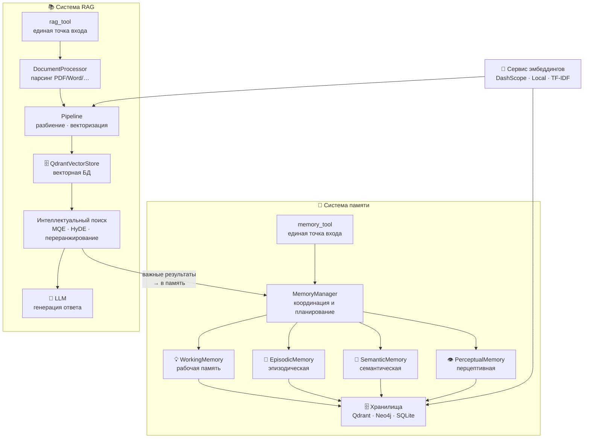
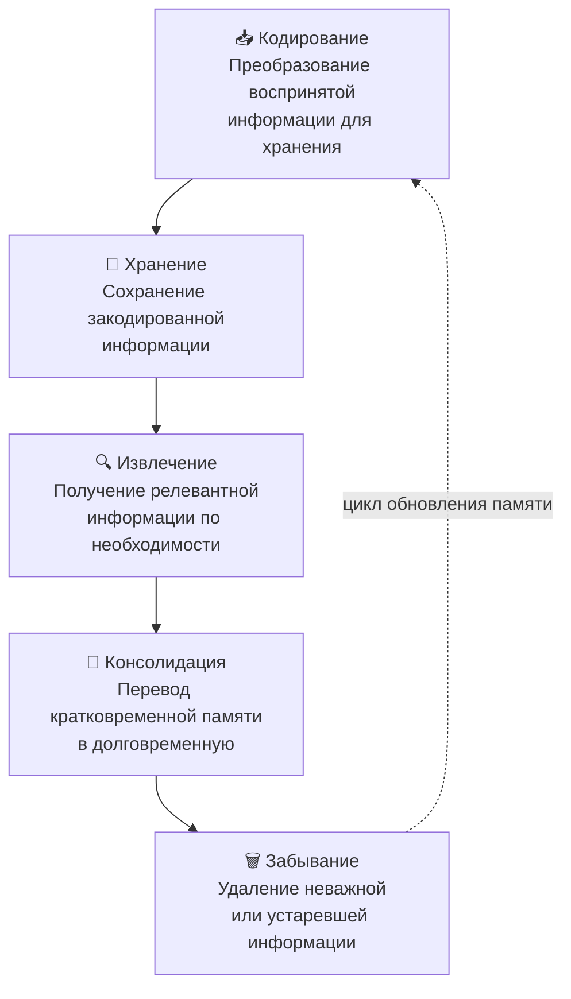
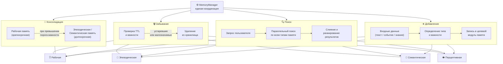
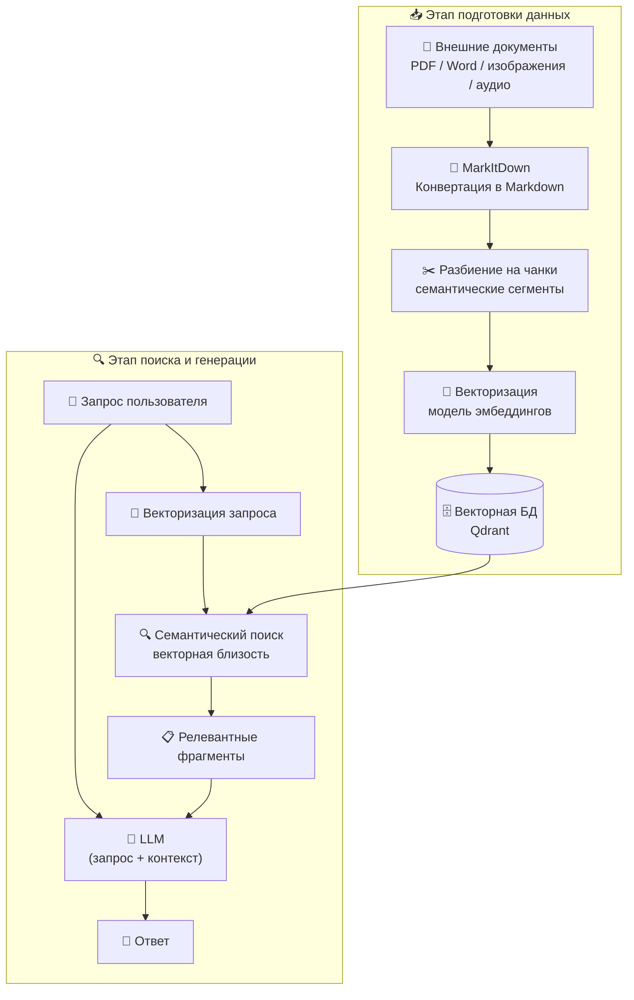
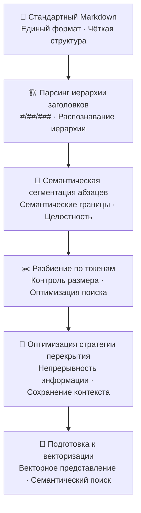
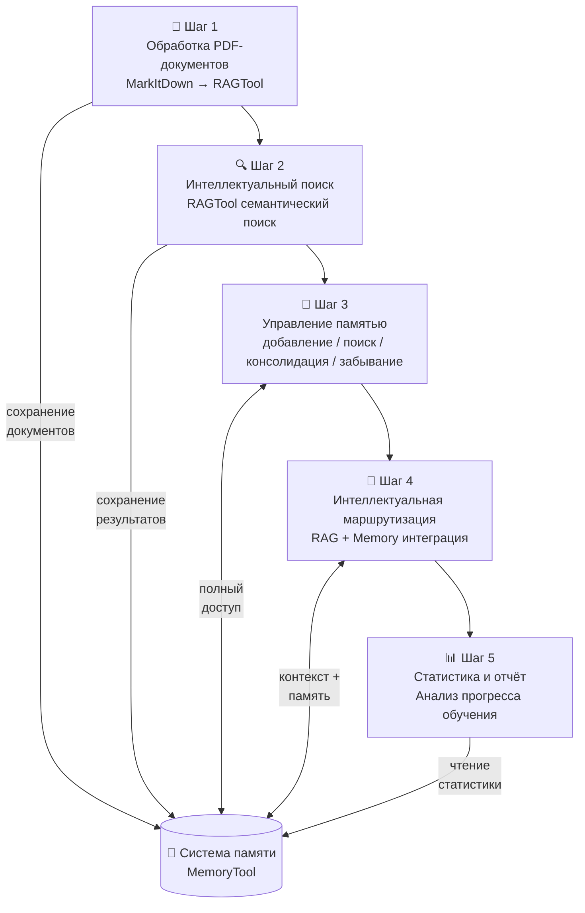

# Глава 8: Память и поиск

В предыдущих главах мы построили базовую архитектуру фреймворка HelloAgents, реализовав различные парадигмы агентов и систему инструментов. Однако нашему фреймворку всё ещё не хватает одной ключевой возможности — **памяти**. Если агент не может помнить предыдущие взаимодействия или учиться на прошлом опыте, его эффективность в длительных разговорах и сложных задачах будет существенно ограничена.

В этой главе мы добавим во фреймворк HelloAgents, построенный в главе 7, два ключевых компонента: **систему памяти** и **генерацию с дополнением из базы знаний (RAG)**. Мы будем следовать подходу «расширение фреймворка + углублённое понимание теории», вникая в теоретические основы Memory и RAG в процессе реализации, и в итоге создадим агентную систему с полноценными возможностями памяти и поиска знаний.


## 8.1 От когнитивной науки к памяти агентов

### 8.1.1 Вдохновение от систем памяти человека

Прежде чем строить систему памяти агента, давайте сначала разберёмся, как люди обрабатывают и хранят информацию — с точки зрения когнитивной науки. Память человека — это многоуровневая когнитивная система, которая не только хранит информацию, но и классифицирует и организует её по важности, времени и контексту. Когнитивная психология предлагает классическую теоретическую модель для понимания структуры и процессов памяти<sup>[1]</sup>, показанную на рисунке 8.1.

<div align="center">
  
  <p>Рисунок 8.1 Иерархическая структура системы памяти человека</p>
</div>

Согласно исследованиям когнитивной психологии, память человека делится на следующие уровни:

1. **Сенсорная память**: очень короткая продолжительность (0,5–3 секунды), огромная ёмкость; отвечает за временное хранение всей информации, поступающей от органов чувств
2. **Рабочая память**: короткая продолжительность (15–30 секунд), ограниченная ёмкость (7±2 элемента); отвечает за обработку информации в текущих задачах
3. **Долговременная память**: длительная (может сохраняться всю жизнь), практически неограниченная ёмкость; делится на:
   - **Процедурная память**: навыки и привычки (например, езда на велосипеде)
   - **Декларативная память**: знания, которые можно выразить словами; делится на:
     - **Семантическая память**: общие знания и концепции (например, «Москва — столица России»)
     - **Эпизодическая память**: личный опыт и события (например, «содержание вчерашнего совещания»)

### 8.1.2 Зачем агентам нужны память и RAG

Опираясь на устройство памяти человека, мы можем понять, почему агентам тоже нужны аналогичные возможности. Важная черта человеческого интеллекта — способность помнить прошлый опыт, учиться на нём и применять в новых ситуациях. Точно так же по-настоящему интеллектуальному агенту нужна память. У агентов на основе LLM, как правило, есть два фундаментальных ограничения: **забывание состояния диалога** и **ограниченность встроенных знаний**.

**(1) Ограничение 1: забывание диалога из-за отсутствия состояния**

Современные большие языковые модели, несмотря на свои возможности, по своей природе **не имеют состояния**. Это означает, что каждый запрос пользователя (или вызов API) — независимое вычисление без связи с предыдущими. Модель сама по себе не «помнит» содержание предыдущего разговора. Это порождает ряд проблем:

1. **Потеря контекста**: в длинных разговорах важная ранняя информация может быть утеряна из-за ограничений контекстного окна
2. **Отсутствие персонализации**: агент не может запоминать предпочтения, привычки и конкретные потребности пользователя
3. **Ограниченная способность к обучению**: нет возможности учиться на прошлых успехах или неудачах
4. **Проблемы согласованности**: в многоходовых разговорах могут появляться противоречивые ответы

Понять эту проблему поможет конкретный пример:

```python
# Использование агента из главы 7
from hello_agents import SimpleAgent, HelloAgentsLLM

agent = SimpleAgent(name="Ассистент по обучению", llm=HelloAgentsLLM())

# Первый разговор
response1 = agent.run("Меня зовут Иван, я изучаю Python и освоил базовый синтаксис")
print(response1)  # "Отлично! Базовый синтаксис Python — важный фундамент для программирования..."
 
# Второй разговор (новая сессия)
response2 = agent.run("Ты помнишь мой прогресс в обучении?")
print(response2)  # "Извините, я не знаю о вашем прогрессе в обучении..."
```

Чтобы решить эту проблему, нашему фреймворку нужна система памяти.

**(2) Ограничение 2: ограниченность встроенных знаний модели**

Помимо забывания истории разговора, ещё одно ключевое ограничение LLM — **статичность и ограниченность знаний**. Эти знания целиком основаны на обучающих данных, что порождает ряд проблем:

1. **Устаревание знаний**: у больших моделей есть дата отсечения обучающих данных — они не могут получать последнюю информацию
2. **Узкоспециализированные знания**: у универсальных моделей может не хватать глубины в конкретных предметных областях
3. **Фактическая точность**: поиск внешних данных помогает снизить галлюцинации модели
4. **Объяснимость**: ссылки на источники информации повышают достоверность ответов

Именно для преодоления этого ограничения возникла технология RAG. Её ключевая идея: до генерации ответа извлечь наиболее релевантную информацию из внешней базы знаний (документы, базы данных, API) и передать её модели как контекст.

### 8.1.3 Архитектура системы памяти и RAG

Опираясь на фреймворк из главы 7 и вдохновение от когнитивной науки, мы разработали многоуровневую архитектуру системы памяти и RAG, показанную на рисунке 8.2. Эта архитектура не только следует иерархической структуре памяти человека, но и в полной мере учитывает масштабируемость инженерной реализации. В реализации мы проектируем память и RAG как два независимых инструмента: `memory_tool` отвечает за хранение и поддержку информации о взаимодействиях в ходе разговора, а `rag_tool` — за извлечение релевантной информации из предоставленных пользователем баз знаний в качестве контекста и может автоматически сохранять важные результаты поиска в систему памяти.


*Рисунок 8.2 Общая архитектура системы памяти и RAG в HelloAgents*

Система памяти имеет четырёхуровневую архитектуру:

```
Система памяти HelloAgents
├── Инфраструктурный уровень
│   ├── MemoryManager — менеджер памяти (единое планирование и координация)
│   ├── MemoryItem — структура данных памяти (стандартизированный элемент памяти)
│   ├── MemoryConfig — управление конфигурацией (настройки параметров системы)
│   └── BaseMemory — базовый класс памяти (общие определения интерфейсов)
├── Уровень типов памяти
│   ├── WorkingMemory — рабочая память (временная информация, управление TTL)
│   ├── EpisodicMemory — эпизодическая память (конкретные события, временная последовательность)
│   ├── SemanticMemory — семантическая память (абстрактные знания, граф-отношения)
│   └── PerceptualMemory — перцептивная память (мультимодальные данные)
├── Уровень хранилищ
│   ├── QdrantVectorStore — векторное хранилище (высокопроизводительный семантический поиск)
│   ├── Neo4jGraphStore — граф-хранилище (управление графом знаний)
│   └── SQLiteDocumentStore — документное хранилище (структурированная персистентность)
└── Уровень сервиса эмбеддингов
    ├── DashScopeEmbedding — эмбеддинги Tongyi Qianwen (облачный API)
    ├── LocalTransformerEmbedding — локальные эмбеддинги (офлайн-развёртывание)
    └── TFIDFEmbedding — TF-IDF эмбеддинги (лёгкий запасной вариант)
```

Система RAG сосредоточена на получении и использовании внешних знаний:

```
Система RAG HelloAgents
├── Уровень обработки документов
│   ├── DocumentProcessor — обработчик документов (парсинг множества форматов)
│   ├── Document — объект документа (управление метаданными)
│   └── Pipeline — RAG-конвейер (сквозная обработка)
├── Уровень эмбеддингов
│   └── Единый интерфейс эмбеддингов — повторное использование сервиса эмбеддингов системы памяти
├── Уровень векторного хранилища
│   └── QdrantVectorStore — векторная база данных (изоляция по пространствам имён)
└── Уровень интеллектуального поиска и ответов
    ├── Мультистратегический поиск — векторный поиск + MQE + HyDE
    ├── Построение контекста — интеллектуальное слияние и усечение фрагментов
    └── Генерация с улучшением LLM — точные ответы на основе контекста
```

### 8.1.4 Цели обучения и быстрое знакомство

Взглянем сначала на ключевые учебные материалы главы 8:

```
hello-agents/
├── hello_agents/
│   ├── memory/                   # Модуль системы памяти
│   │   ├── base.py               # Базовые структуры данных (MemoryItem, MemoryConfig, BaseMemory)
│   │   ├── manager.py            # Менеджер памяти (единая координация и планирование)
│   │   ├── embedding.py          # Единый сервис эмбеддингов (DashScope/Local/TFIDF)
│   │   ├── types/                # Реализации типов памяти
│   │   │   ├── working.py        # Рабочая память (управление TTL, только в памяти)
│   │   │   ├── episodic.py       # Эпизодическая память (последовательность событий, SQLite+Qdrant)
│   │   │   ├── semantic.py       # Семантическая память (граф знаний, Qdrant+Neo4j)
│   │   │   └── perceptual.py     # Перцептивная память (мультимодальная, SQLite+Qdrant)
│   │   ├── storage/              # Реализации хранилищ
│   │   │   ├── qdrant_store.py   # Векторное хранилище Qdrant (высокопроизводительный поиск)
│   │   │   ├── neo4j_store.py    # Граф-хранилище Neo4j (управление графом знаний)
│   │   │   └── document_store.py # Документное хранилище SQLite (структурированная персистентность)
│   │   └── rag/                  # Система RAG
│   │       ├── pipeline.py       # RAG-конвейер (сквозная обработка)
│   │       └── document.py       # Обработчик документов (парсинг множества форматов)
│   └── tools/builtin/            # Расширенные встроенные инструменты
│       ├── memory_tool.py        # Инструмент памяти (возможности памяти агента)
│       └── rag_tool.py           # RAG-инструмент (возможности интеллектуального поиска)
└──
```

**Быстрый старт: установка фреймворка HelloAgents**

Чтобы читатели могли быстро познакомиться со всеми возможностями главы, мы предоставляем готовый к установке Python-пакет. Версию, соответствующую этой главе, можно установить следующими командами:

```bash
# Если в версии 0.2.0 модели недоступны, см. issue#320 или переключитесь на версию 0.2.9.
pip install "hello-agents[all]==0.2.0"
python -m spacy download zh_core_web_sm
python -m spacy download en_core_web_sm
```

Кроме того, в файле `.env` необходимо настроить API-ключи для графовой базы данных, векторной базы данных, LLM и сервиса эмбеддингов. В руководстве в качестве векторной базы данных используется Qdrant, в качестве графовой — Neo4J, а для эмбеддингов предпочтительна платформа Bailian. Если API недоступен, можно переключиться на локально развёрнутую модель.

```bash
# ================================
# Конфигурация векторной базы данных Qdrant — получить API-ключ: https://cloud.qdrant.io/
# ================================
# Использование облачного сервиса Qdrant (рекомендуется)
QDRANT_URL=https://your-cluster.qdrant.tech:6333
QDRANT_API_KEY=your_qdrant_api_key_here

# Или локальный Qdrant (требуется Docker)
# QDRANT_URL=http://localhost:6333
# QDRANT_API_KEY=

# Конфигурация коллекции Qdrant
QDRANT_COLLECTION=hello_agents_vectors
QDRANT_VECTOR_SIZE=384
QDRANT_DISTANCE=cosine
QDRANT_TIMEOUT=30

# ================================
# Конфигурация графовой базы данных Neo4j — получить API-ключ: https://neo4j.com/cloud/aura/
# ================================
# Использование облачного сервиса Neo4j Aura (рекомендуется)
NEO4J_URI=neo4j+s://your-instance.databases.neo4j.io
NEO4J_USERNAME=neo4j
NEO4J_PASSWORD=your_neo4j_password_here

# Или локальный Neo4j (требуется Docker)
# NEO4J_URI=bolt://localhost:7687
# NEO4J_USERNAME=neo4j
# NEO4J_PASSWORD=hello-agents-password

# Параметры подключения Neo4j
NEO4J_DATABASE=neo4j
NEO4J_MAX_CONNECTION_LIFETIME=3600
NEO4J_MAX_CONNECTION_POOL_SIZE=50
NEO4J_CONNECTION_TIMEOUT=60

# ==========================
# Пример конфигурации эмбеддингов — получить из консоли Alibaba Cloud: https://dashscope.aliyun.com/
# ==========================
# - Если пусто, dashscope по умолчанию использует text-embedding-v3; local — sentence-transformers/all-MiniLM-L6-v2
EMBED_MODEL_TYPE=dashscope
EMBED_MODEL_NAME=
EMBED_API_KEY=
EMBED_BASE_URL=
```

Изучение этой главы можно вести двумя путями:

1. **Практическое знакомство**: установить фреймворк через `pip`, запустить примеры кода и быстро опробовать различные функции
2. **Глубокое изучение**: следовать содержанию главы, реализовывать каждый компонент с нуля и глубоко понять философию проектирования фреймворка и детали реализации

Рекомендуем придерживаться учебного пути «сначала попробовать, потом реализовать». В этой главе мы предоставляем полные тестовые файлы. Вы можете переписать ключевые функции и запустить тесты, чтобы проверить правильность своей реализации.

Следуя принципам проектирования из главы 7, мы инкапсулируем возможности памяти и RAG в стандартные инструменты, не создавая новых классов агентов. Прежде чем начать, потратьте 30 секунд, чтобы познакомиться с созданием агента с памятью и RAG с помощью Hello-agents!

```python
# Настройте API LLM в файле .env в той же папке
from hello_agents import SimpleAgent, HelloAgentsLLM, ToolRegistry
from hello_agents.tools import MemoryTool, RAGTool

# Создание экземпляра LLM
llm = HelloAgentsLLM()

# Создание агента
agent = SimpleAgent(
    name="Интеллектуальный ассистент",
    llm=llm,
    system_prompt="Вы ИИ-ассистент с возможностями памяти и поиска знаний"
)

# Создание реестра инструментов
tool_registry = ToolRegistry()

# Добавление инструмента памяти
memory_tool = MemoryTool(user_id="user123")
tool_registry.register_tool(memory_tool)

# Добавление RAG-инструмента
rag_tool = RAGTool(knowledge_base_path="./knowledge_base")
tool_registry.register_tool(rag_tool)

# Настройка инструментов для агента
agent.tool_registry = tool_registry

# Начало разговора
response = agent.run("Привет! Запомни, пожалуйста: меня зовут Иван, я разработчик на Python")
print(response)
```

При правильной настройке вы увидите следующий вывод:

```bash
[OK] SQLite database tables and indexes created
[OK] SQLite document storage initialized: ./memory_data\memory.db
INFO:hello_agents.memory.storage.qdrant_store:✅ Successfully connected to Qdrant cloud service: ...
INFO:hello_agents.memory.storage.qdrant_store:✅ Using existing Qdrant collection: hello_agents_vectors
INFO:hello_agents.memory.types.semantic:✅ Embedding model ready, dimension: 1024
INFO:hello_agents.memory.types.semantic:✅ Qdrant vector database initialization complete
INFO:hello_agents.memory.storage.neo4j_store:✅ Successfully connected to Neo4j cloud service: ...
INFO:hello_agents.memory.types.semantic:✅ Neo4j graph database initialization complete
INFO:hello_agents.memory.manager:MemoryManager initialization complete, enabled memory types: ['working', 'episodic', 'semantic']
✅ Tool 'memory' registered.
✅ RAG tool initialization successful: namespace=default, collection=rag_knowledge_base
✅ Tool 'rag' registered.
Привет, Иван! Приятно познакомиться. Как разработчику на Python, вам наверняка интересно программирование. Если у вас есть технические вопросы или вы хотите обсудить темы, связанные с Python, — обращайтесь в любое время. Чем я могу вам помочь?
```

## 8.2 Система памяти: наделяем агента памятью

### 8.2.1 Рабочий процесс системы памяти

Прежде чем переходить к реализации кода, нужно определить рабочий процесс системы памяти. Этот процесс опирается на модель памяти из когнитивной науки и отображает каждый когнитивный этап на конкретные технические компоненты и операции. Понимание этого отображения поможет нам при последующей реализации кода.


*Рисунок 8.3 Когнитивный процесс формирования памяти*

Как показано на рисунке 8.3, согласно исследованиям когнитивной науки, формирование памяти человека проходит следующие этапы:

1. **Кодирование**: преобразование воспринятой информации в форму, пригодную для хранения
2. **Хранение**: сохранение закодированной информации в системе памяти
3. **Извлечение**: при необходимости — получение релевантной информации из памяти
4. **Консолидация**: перевод кратковременной памяти в долговременную
5. **Забывание**: удаление неважной или устаревшей информации

На основе этого вдохновения мы спроектировали полноценную систему памяти для HelloAgents. Её ключевая идея — имитация того, как мозг человека обрабатывает разные типы информации: память делится на несколько специализированных модулей с интеллектуальным механизмом управления. На рисунке 8.4 детально показан рабочий процесс системы, включая ключевые этапы добавления, поиска, консолидации и забывания памяти.


*Рисунок 8.4 Полный рабочий процесс системы памяти HelloAgents*

Наша система памяти состоит из четырёх типов модулей памяти, каждый из которых оптимизирован под конкретные сценарии применения и жизненные циклы.

**Рабочая память** играет роль «кратковременной памяти» агента и используется главным образом для хранения контекстной информации текущего разговора. Для обеспечения высокой скорости доступа и отклика её ёмкость намеренно ограничена (например, по умолчанию 50 элементов), а жизненный цикл привязан к одной сессии — данные автоматически очищаются после её завершения.

**Эпизодическая память** отвечает за долговременное хранение конкретных событий взаимодействий и опыта обучения агента. В отличие от рабочей памяти, эпизодическая содержит богатую контекстную информацию и поддерживает ретроспективный поиск по временной последовательности или теме — это основа для того, чтобы агент мог «вспоминать» и учиться на прошлом опыте.

В дополнение к конкретным событиям есть **семантическая память**, хранящая более абстрактные знания, концепции и правила. Например, предпочтения пользователя, усвоенные в ходе разговоров, инструкции, которых нужно придерживаться долгосрочно, или ключевые знания по предметной области — всё это подходит для хранения здесь. Эта память обладает высокой персистентностью и важностью, являясь ядром для формирования «системы знаний» агента и ассоциативного рассуждения.

Наконец, для взаимодействия со всё более богатым мультимедийным контентом мы ввели **перцептивную память**. Этот модуль специально обрабатывает мультимодальную информацию — изображения, аудио и т.д. — и поддерживает межмодальный поиск. Жизненный цикл управляется динамически на основе важности информации и доступного объёма хранилища.

### 8.2.2 Быстрое знакомство: начало работы с памятью за 30 секунд

Перед изучением деталей реализации давайте быстро познакомимся с базовыми функциями системы памяти:

```python
from hello_agents import SimpleAgent, HelloAgentsLLM, ToolRegistry
from hello_agents.tools import MemoryTool

# Создание агента с возможностью памяти
llm = HelloAgentsLLM()
agent = SimpleAgent(name="Ассистент с памятью", llm=llm)

# Создание инструмента памяти
memory_tool = MemoryTool(user_id="user123")
tool_registry = ToolRegistry()
tool_registry.register_tool(memory_tool)
agent.tool_registry = tool_registry

# Знакомство с функциями памяти
print("=== Добавление нескольких воспоминаний ===")

# Добавление первого воспоминания
result1 = memory_tool.execute("add", content="Пользователь Иван — разработчик на Python, специализируется на машинном обучении и анализе данных", memory_type="semantic", importance=0.8)
print(f"Воспоминание 1: {result1}")

# Добавление второго воспоминания
result2 = memory_tool.execute("add", content="Мария — фронтенд-разработчик, владеет React и Vue.js", memory_type="semantic", importance=0.7)
print(f"Воспоминание 2: {result2}")

# Добавление третьего воспоминания
result3 = memory_tool.execute("add", content="Алексей — продакт-менеджер, отвечает за проектирование UX и анализ требований", memory_type="semantic", importance=0.6)
print(f"Воспоминание 3: {result3}")

print("\n=== Поиск конкретных воспоминаний ===")
# Поиск воспоминаний о фронтенд-разработке
print("🔍 Ищем 'фронтенд-разработчик':")
result = memory_tool.execute("search", query="фронтенд-разработчик", limit=3)
print(result)

print("\n=== Сводка по памяти ===")
result = memory_tool.execute("summary")
print(result)
```

### 8.2.3 Подробное описание MemoryTool

Теперь разберём конкретные операции, поддерживаемые MemoryTool, постепенно углубляясь в базовую реализацию. MemoryTool как единый интерфейс системы памяти следует архитектурному паттерну «единая точка входа, распределённая обработка»:

````python
def execute(self, action: str, **kwargs) -> str:
    """Выполнить операцию с памятью

    Поддерживаемые операции:
    - add: добавить воспоминание (4 типа: working/episodic/semantic/perceptual)
    - search: поиск в памяти
    - summary: сводка по памяти
    - stats: статистика
    - update: обновить воспоминание
    - remove: удалить воспоминание
    - forget: забыть воспоминания (несколько стратегий)
    - consolidate: консолидировать память (кратковременная → долговременная)
    - clear_all: очистить всю память
    """

    if action == "add":
        return self._add_memory(**kwargs)
    elif action == "search":
        return self._search_memory(**kwargs)
    elif action == "summary":
        return self._get_summary(**kwargs)
    # ... другие операции
````

Такой единый интерфейс `execute` упрощает вызовы со стороны агента. Конкретная операция задаётся параметром `action`, а `**kwargs` позволяет каждой операции иметь собственные требования к параметрам. Рассмотрим несколько важных операций.

**(1) Операция add**

Операция `add` — фундамент системы памяти. Она имитирует процесс кодирования мозгом человека воспринятой информации в память. При реализации мы не только сохраняем содержимое воспоминания, но и добавляем к каждому воспоминанию богатую контекстную информацию, которая сыграет важную роль при последующем поиске и управлении.

````python
def _add_memory(
    self,
    content: str = "",
    memory_type: str = "working",
    importance: float = 0.5,
    file_path: str = None,
    modality: str = None,
    **metadata
) -> str:
    """Добавить воспоминание"""
    try:
        # Убедиться, что ID сессии существует
        if self.current_session_id is None:
            self.current_session_id = f"session_{datetime.now().strftime('%Y%m%d_%H%M%S')}"

        # Поддержка файлов для перцептивной памяти
        if memory_type == "perceptual" and file_path:
            inferred = modality or self._infer_modality(file_path)
            metadata.setdefault("modality", inferred)
            metadata.setdefault("raw_data", file_path)

        # Добавить информацию о сессии в метаданные
        metadata.update({
            "session_id": self.current_session_id,
            "timestamp": datetime.now().isoformat()
        })

        memory_id = self.memory_manager.add_memory(
            content=content,
            memory_type=memory_type,
            importance=importance,
            metadata=metadata,
            auto_classify=False
        )

        return f"✅ Воспоминание добавлено (ID: {memory_id[:8]}...)"

    except Exception as e:
        return f"❌ Ошибка добавления воспоминания: {str(e)}"
````

Реализация решает три ключевые задачи: автоматическое управление ID сессий (каждое воспоминание чётко привязано к сессии), интеллектуальная обработка мультимодальных данных (автоматическое определение типа файла и сохранение связанных метаданных), и автоматическое дополнение контекстной информации (добавление метки времени и данных сессии к каждому воспоминанию). Параметр `importance` (по умолчанию 0,5) используется для обозначения уровня важности воспоминания, значение от 0,0 до 1,0. Этот механизм имитирует оценку мозгом важности разной информации. Такой подход позволяет агенту автоматически различать разговоры из разных временных периодов и предоставлять богатую контекстную информацию для последующего поиска и управления.

Для каждого типа памяти мы приводим разные примеры использования:

```python
# 1. Рабочая память — временная информация, ограниченная ёмкость
memory_tool.execute("add",
    content="Пользователь только что задал вопрос о функциях Python",
    memory_type="working",
    importance=0.6
)

# 2. Эпизодическая память — конкретные события и опыт
memory_tool.execute("add",
    content="15 марта 2024 года пользователь Иван завершил свой первый проект на Python",
    memory_type="episodic",
    importance=0.8,
    event_type="milestone",
    location="Платформа онлайн-обучения"
)

# 3. Семантическая память — абстрактные знания и концепции
memory_tool.execute("add",
    content="Python — интерпретируемый объектно-ориентированный язык программирования",
    memory_type="semantic",
    importance=0.9,
    knowledge_type="factual"
)

# 4. Перцептивная память — мультимодальная информация
memory_tool.execute("add",
    content="Пользователь загрузил скриншот кода Python с определениями функций",
    memory_type="perceptual",
    importance=0.7,
    modality="image",
    file_path="./uploads/code_screenshot.png"
)
```

**(2) Операция search**

Операция `search` — ключевая функция системы памяти. Она должна быстро найти наиболее релевантный контент по запросу среди большого числа воспоминаний — что включает несколько шагов: семантическое понимание, вычисление релевантности и ранжирование результатов.

````python
def _search_memory(
    self,
    query: str,
    limit: int = 5,
    memory_types: List[str] = None,
    memory_type: str = None,
    min_importance: float = 0.1
) -> str:
    """Поиск в памяти"""
    try:
        # Нормализация параметров
        if memory_type and not memory_types:
            memory_types = [memory_type]

        results = self.memory_manager.retrieve_memories(
            query=query,
            limit=limit,
            memory_types=memory_types,
            min_importance=min_importance
        )

        if not results:
            return f"🔍 Воспоминания по запросу '{query}' не найдены"

        # Форматирование результатов
        formatted_results = []
        formatted_results.append(f"🔍 Найдено {len(results)} связанных воспоминаний:")

        for i, memory in enumerate(results, 1):
            memory_type_label = {
                "working": "Рабочая память",
                "episodic": "Эпизодическая память",
                "semantic": "Семантическая память",
                "perceptual": "Перцептивная память"
            }.get(memory.memory_type, memory.memory_type)

            content_preview = memory.content[:80] + "..." if len(memory.content) > 80 else memory.content
            formatted_results.append(
                f"{i}. [{memory_type_label}] {content_preview} (Важность: {memory.importance:.2f})"
            )

        return "\n".join(formatted_results)

    except Exception as e:
        return f"❌ Ошибка поиска в памяти: {str(e)}"
````

Операция поиска поддерживает как единственное, так и множественное число параметров типа памяти (`memory_type` и `memory_types`), позволяя пользователям выражать свои потребности наиболее естественным способом. Параметр `min_importance` (по умолчанию 0,1) используется для фильтрации воспоминаний низкого качества. Примеры использования поиска:

```python
# Базовый поиск
result = memory_tool.execute("search", query="программирование на Python", limit=5)

# Поиск по конкретному типу памяти
result = memory_tool.execute("search",
    query="прогресс обучения",
    memory_type="episodic",
    limit=3
)

# Поиск по нескольким типам
result = memory_tool.execute("search",
    query="определение функции",
    memory_types=["semantic", "episodic"],
    min_importance=0.5
)
```

**(3) Операция forget**

Механизм забывания — наиболее «когнитивно-научная» функция. Он имитирует процесс избирательного забывания мозгом человека и поддерживает три стратегии: по важности (удаление незначимых воспоминаний), по времени (удаление устаревших воспоминаний) и по ёмкости (удаление наименее важных воспоминаний, когда хранилище заполняется).

````python
def _forget(self, strategy: str = "importance_based", threshold: float = 0.1, max_age_days: int = 30) -> str:
    """Забыть воспоминания (поддерживает несколько стратегий)"""
    try:
        count = self.memory_manager.forget_memories(
            strategy=strategy,
            threshold=threshold,
            max_age_days=max_age_days
        )
        return f"🧹 Забыто воспоминаний: {count} (стратегия: {strategy})"
    except Exception as e:
        return f"❌ Ошибка забывания воспоминаний: {str(e)}"
````

**Применение трёх стратегий забывания:**

```python
# 1. Забывание по важности — удалить воспоминания ниже порога важности
memory_tool.execute("forget",
    strategy="importance_based",
    threshold=0.2
)

# 2. Забывание по времени — удалить воспоминания старше указанного числа дней
memory_tool.execute("forget",
    strategy="time_based",
    max_age_days=30
)

# 3. Забывание по ёмкости — удалить наименее важные, когда число воспоминаний превышает лимит
memory_tool.execute("forget",
    strategy="capacity_based",
    threshold=0.3
)
```

**(4) Операция consolidate**

````python
def _consolidate(self, from_type: str = "working", to_type: str = "episodic", importance_threshold: float = 0.7) -> str:
    """Консолидировать воспоминания (перевести важные кратковременные в долговременные)"""
    try:
        count = self.memory_manager.consolidate_memories(
            from_type=from_type,
            to_type=to_type,
            importance_threshold=importance_threshold,
        )
        return f"🔄 Консолидировано воспоминаний в долговременную память: {count} ({from_type} → {to_type}, порог={importance_threshold})"
    except Exception as e:
        return f"❌ Ошибка консолидации воспоминаний: {str(e)}"
````

Операция consolidate опирается на концепцию консолидации памяти в нейронауках, имитируя процесс перевода кратковременной памяти в долговременную. По умолчанию рабочие воспоминания с важностью выше 0,7 переводятся в эпизодическую память. Этот порог гарантирует, что долгосрочно сохраняется только по-настоящему важная информация. Весь процесс автоматизирован — пользователю не нужно вручную выбирать конкретные воспоминания. Система интеллектуально определяет подходящие воспоминания и выполняет преобразование типа.

**Примеры применения консолидации памяти:**

```python
# Перевести важные рабочие воспоминания в эпизодическую память
memory_tool.execute("consolidate",
    from_type="working",
    to_type="episodic",
    importance_threshold=0.7
)

# Перевести важные эпизодические воспоминания в семантическую память
memory_tool.execute("consolidate",
    from_type="episodic",
    to_type="semantic",
    importance_threshold=0.8
)
```

Благодаря совместной работе этих ключевых операций MemoryTool выстраивает полноценную систему управления жизненным циклом памяти. От создания воспоминания, поиска, получения сводки — до забывания, консолидации и управления — всё образует замкнутый цикл интеллектуального управления памятью, наделяя агента по-настоящему человекоподобными возможностями памяти.

### 8.2.4 Подробное описание MemoryManager

Разобравшись с интерфейсным дизайном MemoryTool, углубимся в базовую реализацию и посмотрим, как MemoryTool взаимодействует с MemoryManager. Этот многоуровневый дизайн воплощает принцип разделения ответственности в программной инженерии. MemoryTool сосредоточен на пользовательском интерфейсе и обработке параметров, тогда как MemoryManager отвечает за основную логику управления памятью.

MemoryTool создаёт экземпляр MemoryManager при инициализации и включает различные типы модулей памяти в соответствии с конфигурацией. Такой дизайн позволяет пользователям выбирать, какие типы памяти включить исходя из конкретных потребностей — обеспечивая полноту функционала и избегая излишнего расхода ресурсов.

````python
class MemoryTool(Tool):
    """Инструмент памяти — предоставляет функции памяти для агента"""

    def __init__(
        self,
        user_id: str = "default_user",
        memory_config: MemoryConfig = None,
        memory_types: List[str] = None
    ):
        super().__init__(
            name="memory",
            description="Инструмент памяти — может хранить и извлекать историю разговоров, знания и опыт"
        )

        # Инициализация менеджера памяти
        self.memory_config = memory_config or MemoryConfig()
        self.memory_types = memory_types or ["working", "episodic", "semantic"]

        self.memory_manager = MemoryManager(
            config=self.memory_config,
            user_id=user_id,
            enable_working="working" in self.memory_types,
            enable_episodic="episodic" in self.memory_types,
            enable_semantic="semantic" in self.memory_types,
            enable_perceptual="perceptual" in self.memory_types
        )
````

MemoryManager как основной координатор системы памяти отвечает за управление различными типами модулей памяти и предоставляет единый интерфейс для операций.

````python
class MemoryManager:
    """Менеджер памяти — единый интерфейс для операций с памятью"""

    def __init__(
        self,
        config: Optional[MemoryConfig] = None,
        user_id: str = "default_user",
        enable_working: bool = True,
        enable_episodic: bool = True,
        enable_semantic: bool = True,
        enable_perceptual: bool = False
    ):
        self.config = config or MemoryConfig()
        self.user_id = user_id

        # Инициализация компонентов хранения и поиска
        self.store = MemoryStore(self.config)
        self.retriever = MemoryRetriever(self.store, self.config)

        # Инициализация различных типов памяти
        self.memory_types = {}

        if enable_working:
            self.memory_types['working'] = WorkingMemory(self.config, self.store)

        if enable_episodic:
            self.memory_types['episodic'] = EpisodicMemory(self.config, self.store)

        if enable_semantic:
            self.memory_types['semantic'] = SemanticMemory(self.config, self.store)

        if enable_perceptual:
            self.memory_types['perceptual'] = PerceptualMemory(self.config, self.store)
````

### 8.2.5 Четыре типа памяти

Теперь углубимся в конкретную реализацию четырёх типов памяти. Каждый тип имеет свои уникальные характеристики и сценарии применения.

**(1) Рабочая память**

Рабочая память — наиболее активная часть системы памяти. Она отвечает за хранение временной информации в текущей сессии разговора. Акцент при проектировании рабочей памяти — на быстром доступе и автоматической очистке, что обеспечивает скорость отклика системы и эффективность использования ресурсов.

Рабочая память использует чисто оперативное хранение в сочетании с механизмом TTL (Time To Live) для автоматической очистки. Преимущество такого подхода — исключительно высокая скорость доступа, но это также означает, что содержимое рабочей памяти будет потеряно при перезапуске системы. Эта характеристика идеально соответствует назначению рабочей памяти: хранению временной и изменчивой информации.

````python
class WorkingMemory:
    """Реализация рабочей памяти
    Характеристики:
    - Ограниченная ёмкость (по умолчанию 50 элементов) + автоматическая очистка по TTL
    - Хранение только в RAM, исключительно быстрый доступ
    - Гибридный поиск: TF-IDF векторизация + сопоставление ключевых слов
    """

    def __init__(self, config: MemoryConfig):
        self.max_capacity = config.working_memory_capacity or 50
        self.max_age_minutes = config.working_memory_ttl or 60
        self.memories = []

    def add(self, memory_item: MemoryItem) -> str:
        """Добавить рабочее воспоминание"""
        self._expire_old_memories()  # Очистка устаревших

        if len(self.memories) >= self.max_capacity:
            self._remove_lowest_priority_memory()  # Управление ёмкостью

        self.memories.append(memory_item)
        return memory_item.id

    def retrieve(self, query: str, limit: int = 5, **kwargs) -> List[MemoryItem]:
        """Гибридный поиск: TF-IDF векторизация + сопоставление ключевых слов"""
        self._expire_old_memories()

        # Попытка векторного поиска по TF-IDF
        vector_scores = self._try_tfidf_search(query)

        # Вычисление комплексного балла
        scored_memories = []
        for memory in self.memories:
            vector_score = vector_scores.get(memory.id, 0.0)
            keyword_score = self._calculate_keyword_score(query, memory.content)

            # Гибридное скоринг
            base_relevance = vector_score * 0.7 + keyword_score * 0.3 if vector_score > 0 else keyword_score
            time_decay = self._calculate_time_decay(memory.timestamp)
            importance_weight = 0.8 + (memory.importance * 0.4)

            final_score = base_relevance * time_decay * importance_weight
            if final_score > 0:
                scored_memories.append((final_score, memory))

        scored_memories.sort(key=lambda x: x[0], reverse=True)
        return [memory for _, memory in scored_memories[:limit]]
````

Поиск в рабочей памяти использует гибридную стратегию: сначала пробует семантический поиск по TF-IDF, а при неудаче переходит к сопоставлению ключевых слов. Такой дизайн обеспечивает надёжный поиск в самых разных условиях. Алгоритм скоринга объединяет семантическое сходство, временной спад и вес важности. Формула итогового балла: `(сходство × временной спад) × (0.8 + важность × 0.4)`.

**(2) Эпизодическая память**

Эпизодическая память отвечает за хранение конкретных событий и опыта. Акцент при проектировании — на сохранении целостности событий и связей по временной последовательности. Эпизодическая память использует гибридное хранилище SQLite + Qdrant: SQLite отвечает за структурированные данные и сложные запросы, Qdrant — за эффективный векторный поиск.

````python
class EpisodicMemory:
    """Реализация эпизодической памяти
    Характеристики:
    - Гибридная архитектура хранения SQLite+Qdrant
    - Поддержка поиска по временной последовательности и на уровне сессии
    - Структурированная фильтрация + семантический векторный поиск
    """

    def __init__(self, config: MemoryConfig):
        self.doc_store = SQLiteDocumentStore(config.database_path)
        self.vector_store = QdrantVectorStore(config.qdrant_url, config.qdrant_api_key)
        self.embedder = create_embedding_model_with_fallback()
        self.sessions = {}  # Индекс сессий

    def add(self, memory_item: MemoryItem) -> str:
        """Добавить эпизодическое воспоминание"""
        # Создать объект эпизода
        episode = Episode(
            episode_id=memory_item.id,
            session_id=memory_item.metadata.get("session_id", "default"),
            timestamp=memory_item.timestamp,
            content=memory_item.content,
            context=memory_item.metadata
        )

        # Обновить индекс сессий
        session_id = episode.session_id
        if session_id not in self.sessions:
            self.sessions[session_id] = []
        self.sessions[session_id].append(episode.episode_id)

        # Персистентное хранение (SQLite + Qdrant)
        self._persist_episode(episode)
        return memory_item.id

    def retrieve(self, query: str, limit: int = 5, **kwargs) -> List[MemoryItem]:
        """Гибридный поиск: структурированная фильтрация + семантический векторный поиск"""
        # 1. Структурированная предфильтрация (временной диапазон, важность и т.д.)
        candidate_ids = self._structured_filter(**kwargs)

        # 2. Векторный семантический поиск
        hits = self._vector_search(query, limit * 5, kwargs.get("user_id"))

        # 3. Комплексное скоринг и сортировка
        results = []
        for hit in hits:
            if self._should_include(hit, candidate_ids, kwargs):
                score = self._calculate_episode_score(hit)
                memory_item = self._create_memory_item(hit)
                results.append((score, memory_item))

        results.sort(key=lambda x: x[0], reverse=True)
        return [item for _, item in results[:limit]]

    def _calculate_episode_score(self, hit) -> float:
        """Алгоритм скоринга эпизодической памяти"""
        vec_score = float(hit.get("score", 0.0))
        recency_score = self._calculate_recency(hit["metadata"]["timestamp"])
        importance = hit["metadata"].get("importance", 0.5)

        # Формула скоринга: (векторное сходство × 0.8 + свежесть × 0.2) × вес важности
        base_relevance = vec_score * 0.8 + recency_score * 0.2
        importance_weight = 0.8 + (importance * 0.4)

        return base_relevance * importance_weight
````

Реализация поиска в эпизодической памяти демонстрирует сложный механизм многофакторного скоринга. Он учитывает не только семантическое сходство, но и временну́ю свежесть, с окончательной корректировкой по весу важности. Формула: `(векторное сходство × 0.8 + свежесть × 0.2) × (0.8 + важность × 0.4)`, что гарантирует семантическую и временну́ю релевантность результатов.

**(3) Семантическая память**

Семантическая память — наиболее сложная часть системы. Она отвечает за хранение абстрактных концепций, правил и знаний. Акцент при проектировании — на структурированном представлении знаний и возможностях интеллектуального рассуждения. Семантическая память использует гибридную архитектуру из графовой базы данных Neo4j и векторной базы данных Qdrant: это позволяет системе выполнять как быстрый семантический поиск, так и сложное реляционное рассуждение на основе графа знаний.

````python
class SemanticMemory(BaseMemory):
    """Реализация семантической памяти

    Характеристики:
    - Использует предобученные модели HuggingFace для эмбеддинга текста
    - Векторный поиск для быстрого сопоставления схожести
    - Хранение сущностей и отношений в графе знаний
    - Гибридная стратегия поиска: векторный + граф + семантическое рассуждение
    """

    def __init__(self, config: MemoryConfig, storage_backend=None):
        super().__init__(config, storage_backend)

        # Модель эмбеддингов (предоставляется централизованно)
        self.embedding_model = get_text_embedder()

        # Профессиональные базы данных
        self.vector_store = QdrantConnectionManager.get_instance(**qdrant_config)
        self.graph_store = Neo4jGraphStore(**neo4j_config)

        # Кэш сущностей и отношений
        self.entities: Dict[str, Entity] = {}
        self.relations: List[Relation] = []

        # NLP-процессор (поддерживает русский, китайский и английский)
        self.nlp = self._init_nlp()
````

Процесс добавления в семантическую память воплощает полный рабочий процесс построения графа знаний. Система не только сохраняет содержимое воспоминания, но и автоматически извлекает сущности и отношения для построения структурированных представлений знаний:

```python
def add(self, memory_item: MemoryItem) -> str:
    """Добавить семантическое воспоминание"""
    # 1. Генерация векторного представления текста
    embedding = self.embedding_model.encode(memory_item.content)

    # 2. Извлечение сущностей и отношений
    entities = self._extract_entities(memory_item.content)
    relations = self._extract_relations(memory_item.content, entities)

    # 3. Сохранение в графовую базу данных Neo4j
    for entity in entities:
        self._add_entity_to_graph(entity, memory_item)

    for relation in relations:
        self._add_relation_to_graph(relation, memory_item)

    # 4. Сохранение в векторную базу данных Qdrant
    metadata = {
        "memory_id": memory_item.id,
        "entities": [e.entity_id for e in entities],
        "entity_count": len(entities),
        "relation_count": len(relations)
    }

    self.vector_store.add_vectors(
        vectors=[embedding.tolist()],
        metadata=[metadata],
        ids=[memory_item.id]
    )
```

Поиск в семантической памяти реализует гибридную стратегию, сочетая семантическое понимание векторного поиска и реляционное рассуждение граф-поиска:

```python
def retrieve(self, query: str, limit: int = 5, **kwargs) -> List[MemoryItem]:
    """Поиск в семантической памяти"""
    # 1. Векторный поиск
    vector_results = self._vector_search(query, limit * 2, user_id)

    # 2. Граф-поиск
    graph_results = self._graph_search(query, limit * 2, user_id)

    # 3. Гибридное ранжирование
    combined_results = self._combine_and_rank_results(
        vector_results, graph_results, query, limit
    )

    return combined_results[:limit]
```

Алгоритм гибридного ранжирования использует многофакторный механизм скоринга:

```python
def _combine_and_rank_results(self, vector_results, graph_results, query, limit):
    """Гибридное ранжирование результатов"""
    combined = {}

    # Слияние результатов векторного и граф-поиска
    for result in vector_results:
        combined[result["memory_id"]] = {
            **result,
            "vector_score": result.get("score", 0.0),
            "graph_score": 0.0
        }

    for result in graph_results:
        memory_id = result["memory_id"]
        if memory_id in combined:
            combined[memory_id]["graph_score"] = result.get("similarity", 0.0)
        else:
            combined[memory_id] = {
                **result,
                "vector_score": 0.0,
                "graph_score": result.get("similarity", 0.0)
            }

    # Вычисление гибридного балла
    for memory_id, result in combined.items():
        vector_score = result["vector_score"]
        graph_score = result["graph_score"]
        importance = result.get("importance", 0.5)

        # Базовый балл релевантности
        base_relevance = vector_score * 0.7 + graph_score * 0.3

        # Вес важности [0.8, 1.2]
        importance_weight = 0.8 + (importance * 0.4)

        # Итоговый балл: сходство × вес важности
        combined_score = base_relevance * importance_weight
        result["combined_score"] = combined_score

    # Сортировка и возврат
    sorted_results = sorted(
        combined.values(),
        key=lambda x: x["combined_score"],
        reverse=True
    )

    return sorted_results[:limit]
```

Формула скоринга для семантической памяти: `(векторное сходство × 0.7 + граф-сходство × 0.3) × (0.8 + важность × 0.4)`. Ключевые идеи дизайна:

- **Вес векторного поиска (0.7)**: семантическое сходство — главный фактор; гарантирует, что результаты семантически связаны с запросом
- **Вес граф-поиска (0.3)**: реляционное рассуждение как дополнение; выявляет неявные связи между концепциями
- **Диапазон веса важности [0.8, 1.2]**: предотвращает чрезмерное влияние важности на ранжирование по сходству, сохраняя точность поиска

**(4) Перцептивная память**

Перцептивная память поддерживает хранение и поиск данных в нескольких модальностях: текст, изображения, аудио. Используется стратегия хранения с разделением по модальности — отдельные векторные коллекции для данных разных модальностей. Такой дизайн избегает проблем несовпадения размерностей и обеспечивает точность поиска:

````python
class PerceptualMemory(BaseMemory):
    """Реализация перцептивной памяти

    Характеристики:
    - Поддержка мультимодальных данных (текст, изображения, аудио и т.д.)
    - Межмодальный поиск по схожести
    - Семантическое понимание перцептивных данных
    - Поддержка генерации и поиска контента
    """

    def __init__(self, config: MemoryConfig, storage_backend=None):
        super().__init__(config, storage_backend)

        # Мультимодальные энкодеры
        self.text_embedder = get_text_embedder()
        self._clip_model = self._init_clip_model()  # Кодирование изображений
        self._clap_model = self._init_clap_model()  # Кодирование аудио

        # Векторные хранилища по модальностям
        self.vector_stores = {
            "text": QdrantConnectionManager.get_instance(
                collection_name="perceptual_text",
                vector_size=self.vector_dim
            ),
            "image": QdrantConnectionManager.get_instance(
                collection_name="perceptual_image",
                vector_size=self._image_dim
            ),
            "audio": QdrantConnectionManager.get_instance(
                collection_name="perceptual_audio",
                vector_size=self._audio_dim
            )
        }
````

Поиск в перцептивной памяти поддерживает как внутримодальный, так и межмодальный режимы. Внутримодальный поиск использует специализированные энкодеры для точного сопоставления, тогда как межмодальный требует более сложных механизмов семантического выравнивания:

```python
def retrieve(self, query: str, limit: int = 5, **kwargs) -> List[MemoryItem]:
    """Поиск в перцептивной памяти (фильтрация по модальности; векторный поиск + слияние по времени и важности)"""
    user_id = kwargs.get("user_id")
    target_modality = kwargs.get("target_modality")
    query_modality = kwargs.get("query_modality", target_modality or "text")

    # Векторный поиск по той же модальности
    try:
        query_vector = self._encode_data(query, query_modality)
        store = self._get_vector_store_for_modality(target_modality or query_modality)

        where = {"memory_type": "perceptual"}
        if user_id:
            where["user_id"] = user_id
        if target_modality:
            where["modality"] = target_modality

        hits = store.search_similar(
            query_vector=query_vector,
            limit=max(limit * 5, 20),
            where=where
        )
    except Exception:
        hits = []

    # Слияние результатов (векторное сходство + временна́я свежесть + вес важности)
    results = []
    for hit in hits:
        vector_score = float(hit.get("score", 0.0))
        recency_score = self._calculate_recency_score(hit["metadata"]["timestamp"])
        importance = hit["metadata"].get("importance", 0.5)

        # Алгоритм скоринга
        base_relevance = vector_score * 0.8 + recency_score * 0.2
        importance_weight = 0.8 + (importance * 0.4)
        combined_score = base_relevance * importance_weight

        results.append((combined_score, self._create_memory_item(hit)))

    results.sort(key=lambda x: x[0], reverse=True)
    return [item for _, item in results[:limit]]
```

Формула скоринга для перцептивной памяти: `(векторное сходство × 0.8 + временна́я свежесть × 0.2) × (0.8 + важность × 0.4)`. Механизм скоринга также поддерживает межмодальный поиск — семантическое выравнивание данных разных модальностей (текст, изображения, аудио) через единое векторное пространство. При межмодальном поиске система автоматически корректирует веса скоринга, обеспечивая разнообразие и точность результатов. Кроме того, расчёт временно́й свежести использует модель экспоненциального спада:

```python
def _calculate_recency_score(self, timestamp: str) -> float:
    """Вычислить балл временно́й свежести"""
    try:
        memory_time = datetime.fromisoformat(timestamp)
        current_time = datetime.now()
        age_hours = (current_time - memory_time).total_seconds() / 3600

        # Экспоненциальный спад: высокий балл в течение 24 часов, затем постепенное снижение
        decay_factor = 0.1  # Коэффициент спада
        recency_score = math.exp(-decay_factor * age_hours / 24)

        return max(0.1, recency_score)  # Минимальный базовый балл 0.1
    except Exception:
        return 0.5  # Балл по умолчанию — средний
```

Эта модель временно́го спада имитирует кривую забывания из теории памяти человека, гарантируя, что система перцептивной памяти при поиске отдаёт приоритет более свежим воспоминаниям.

## 8.3 Система RAG: усиление поиска знаний

### 8.3.1 Основы RAG

Прежде чем погружаться в реализацию системы RAG в HelloAgents, давайте кратко разберём базовые концепции, историю развития и ключевые принципы технологии RAG. Поскольку этот текст не строится на RAG как основе, мы лишь быстро повторим соответствующие концепции, чтобы лучше понять технические решения и инновации в дизайне системы.

**(1) Что такое RAG?**

Retrieval-Augmented Generation (RAG, генерация с дополнением из базы знаний) — технология, сочетающая поиск информации и генерацию текста. Её ключевая идея: до генерации ответа сначала извлечь релевантную информацию из внешней базы знаний, а затем предоставить эту информацию как контекст большой языковой модели — тем самым генерируются более точные и надёжные ответы.

Аббревиатуру RAG можно расшифровать по частям. **Retrieval (поиск)** — запрос релевантного контента из базы знаний; **Augmented (дополнение)** — встраивание результатов поиска в промпт для помощи генерации; **Generation (генерация)** — вывод ответов, сочетающих точность и прозрачность.

**(2) Базовый рабочий процесс**

Полный рабочий процесс RAG-приложения делится на два ключевых этапа. На **этапе подготовки данных** система строит внешние знания в виде базы данных для поиска через **извлечение данных**, **разбиение текста** и **векторизацию**. Затем на **этапе применения** система обрабатывает **запросы** пользователей, **извлекает** релевантную информацию из базы данных, **встраивает её в промпт** и наконец использует LLM для **генерации ответов**.

**(3) История развития**

**Первый этап: Naive RAG (2020–2021).** Это начальный этап технологии RAG с простым и прямым процессом, известным как режим «Извлечь и прочитать». **Метод поиска**: главным образом традиционные алгоритмы сопоставления ключевых слов — `TF-IDF` или `BM25`. Они вычисляют частоту терминов и частоту документов для оценки релевантности: хорошее буквальное сопоставление, но трудности с пониманием семантического сходства. **Режим генерации**: контент найденных документов напрямую конкатенируется в контекст промпта без обработки, затем отправляется в генерирующую модель.

**Второй этап: Advanced RAG (2022–2023).** По мере зрелости векторных баз данных и технологий эмбеддинга RAG перешёл в стадию быстрого развития. Исследователи и разработчики внедрили множество техник оптимизации на различных этапах «поиска» и «генерации». **Метод поиска**: переход к семантическому поиску на основе **плотных эмбеддингов** — конвертация текста в многомерные векторы позволила модели понимать и сопоставлять семантическое сходство, а не только ключевые слова. **Режим генерации**: внедрение таких оптимизаций, как переформулировка запроса, разбиение документов на чанки, повторное ранжирование и т.д.

**Третий этап: Modular RAG (2023 — настоящее время).** Опираясь на Advanced RAG, современные RAG-системы развиваются в сторону модульности, автоматизации и интеллектуальности. Различные части системы проектируются как независимые подключаемые и компонуемые модули для адаптации к более разнообразным и сложным сценариям. **Методы поиска**: гибридный поиск, расширение с несколькими запросами, гипотетическое встраивание документов и т.д. **Режимы генерации**: рассуждение через цепочку мыслей, саморефлексия и коррекция и т.д.

### 8.3.2 Принцип работы системы RAG

Прежде чем углубляться в детали реализации, воспользуемся блок-схемой для наглядного представления полного рабочего процесса RAG-системы HelloAgents:


*Рисунок 8.5 Ключевой принцип работы системы RAG*

Как показано на рисунке 8.5, система RAG работает в двух основных режимах:
1. **Рабочий процесс обработки данных**: обработка и хранение документов базы знаний. Здесь мы используем инструмент `MarkItDown` с идеей единообразного преобразования всех поступающих внешних источников знаний в формат Markdown для обработки.
2. **Рабочий процесс поиска и генерации**: поиск релевантной информации по запросу и генерация ответов.

### 8.3.3 Быстрое знакомство: начало работы с RAG за 30 секунд

Давайте быстро познакомимся с базовыми функциями системы RAG:

```python
from hello_agents import SimpleAgent, HelloAgentsLLM, ToolRegistry
from hello_agents.tools import RAGTool

# Создание агента с возможностью RAG
llm = HelloAgentsLLM()
agent = SimpleAgent(name="Ассистент по знаниям", llm=llm)

# Создание RAG-инструмента
rag_tool = RAGTool(
    knowledge_base_path="./knowledge_base",
    collection_name="test_collection",
    rag_namespace="test"
)

tool_registry = ToolRegistry()
tool_registry.register_tool(rag_tool)
agent.tool_registry = tool_registry

# Знакомство с функциями RAG
# Добавление первого знания
result1 = rag_tool.execute("add_text",
    text="Python — высокоуровневый язык программирования, впервые выпущенный Гвидо ван Россумом в 1991 году. Философия дизайна Python делает акцент на читаемости кода и лаконичном синтаксисе.",
    document_id="python_intro")
print(f"Знание 1: {result1}")

# Добавление второго знания
result2 = rag_tool.execute("add_text",
    text="Машинное обучение — раздел искусственного интеллекта, использующий алгоритмы для обучения компьютеров выявлению паттернов из данных. Включает три основных типа: обучение с учителем, без учителя и с подкреплением.",
    document_id="ml_basics")
print(f"Знание 2: {result2}")

# Добавление третьего знания
result3 = rag_tool.execute("add_text",
    text="RAG (Retrieval-Augmented Generation, генерация с дополнением из базы знаний) — технология ИИ, сочетающая поиск информации и генерацию текста. Усиливает возможности LLM через поиск релевантных знаний.",
    document_id="rag_concept")
print(f"Знание 3: {result3}")


print("\n=== Поиск в базе знаний ===")
result = rag_tool.execute("search",
    query="История языка программирования Python",
    limit=3,
    min_score=0.1
)
print(result)

print("\n=== Статистика базы знаний ===")
result = rag_tool.execute("stats")
print(result)
```

Далее рассмотрим конкретную реализацию RAG-системы HelloAgents.

### 8.3.4 Архитектурный дизайн системы RAG

В этом разделе мы используем подход, отличный от объяснения системы памяти. Поскольку `Memory_tool` — это системная реализация, а RAG в нашем дизайне определён как инструмент, организованный в виде конвейера. Основную архитектуру нашей RAG-системы можно охарактеризовать как паттерн «пять уровней, семь шагов»:

```
Уровень пользователя: единый интерфейс RAGTool
  ↓
Прикладной уровень: интеллектуальный поиск и ответы, управление
  ↓
Уровень обработки: парсинг документов, разбиение на чанки, векторизация
  ↓
Уровень хранения: векторная база данных, документное хранилище
  ↓
Базовый уровень: модель эмбеддингов, LLM, базы данных
```

Преимущество многоуровневого дизайна в том, что каждый уровень можно независимо оптимизировать и заменять, сохраняя стабильность всей системы. Например, вы можете легко переключить модель эмбеддингов с sentence-transformers на Bailian API, не затрагивая вышестоящую бизнес-логику. Аналогично, код рабочего процесса обработки полностью переиспользуем — можно выбрать нужные части и встроить в свой проект. RAGTool служит единой точкой входа в систему RAG, предоставляя лаконичный API-интерфейс.

````python
class RAGTool(Tool):
    """RAG-инструмент

    Предоставляет полные возможности RAG:
    - Добавление документов множества форматов (PDF, Office, изображения, аудио и т.д.)
    - Интеллектуальный поиск и выборка
    - Генерация ответов с улучшением LLM
    - Управление базой знаний
    """

    def __init__(
        self,
        knowledge_base_path: str = "./knowledge_base",
        qdrant_url: str = None,
        qdrant_api_key: str = None,
        collection_name: str = "rag_knowledge_base",
        rag_namespace: str = "default"
    ):
        # Инициализация RAG-конвейера
        self._pipelines: Dict[str, Dict[str, Any]] = {}
        self.llm = HelloAgentsLLM()

        # Создание конвейера по умолчанию
        default_pipeline = create_rag_pipeline(
            qdrant_url=self.qdrant_url,
            qdrant_api_key=self.qdrant_api_key,
            collection_name=self.collection_name,
            rag_namespace=self.rag_namespace
        )
        self._pipelines[self.rag_namespace] = default_pipeline
````

Весь рабочий процесс обработки выглядит так:
```
Документ любого формата → конвертация MarkItDown → текст Markdown → интеллектуальное разбиение → векторизация → хранение и поиск
```

**(1) Загрузка мультимодальных документов**

Одно из ключевых преимуществ RAG-системы — мощные возможности обработки мультимодальных документов. Система использует MarkItDown как единый движок конвертации документов, поддерживая почти все распространённые форматы. MarkItDown — это универсальный инструмент конвертации документов с открытым исходным кодом от Microsoft. Он является ключевым компонентом RAG-системы HelloAgents, отвечающим за единообразное преобразование документов любого формата в структурированный Markdown-текст. Независимо от того, поступает ли на вход PDF, Word, Excel, изображение или аудио — всё в итоге конвертируется в стандартный Markdown-формат и поступает в единый рабочий процесс разбиения, векторизации и хранения.

```python
def _convert_to_markdown(path: str) -> str:
    """
    Универсальный считыватель документов с использованием MarkItDown и улучшенной обработкой PDF.
    Ключевая функция: конвертация документов любого формата в текст Markdown

    Поддерживаемые форматы:
    - Документы: PDF, Word, Excel, PowerPoint
    - Изображения: JPG, PNG, GIF (через OCR)
    - Аудио: MP3, WAV, M4A (через транскрипцию)
    - Текст: TXT, CSV, JSON, XML, HTML
    - Код: Python, JavaScript, Java и т.д.
    """
    if not os.path.exists(path):
        return ""

    # Улучшенная обработка для PDF
    ext = (os.path.splitext(path)[1] or '').lower()
    if ext == '.pdf':
        return _enhanced_pdf_processing(path)

    # Единообразная конвертация через MarkItDown для других форматов
    md_instance = _get_markitdown_instance()
    if md_instance is None:
        return _fallback_text_reader(path)

    try:
        result = md_instance.convert(path)
        markdown_text = getattr(result, "text_content", None)
        if isinstance(markdown_text, str) and markdown_text.strip():
            print(f"[RAG] Конвертация MarkItDown успешна: {path} -> {len(markdown_text)} символов Markdown")
            return markdown_text
        return ""
    except Exception as e:
        print(f"[WARNING] Ошибка конвертации MarkItDown {path}: {e}")
        return _fallback_text_reader(path)
```

**(2) Интеллектуальная стратегия разбиения на чанки**

После конвертации через MarkItDown все документы приводятся к стандартному формату Markdown. Это создаёт структурную основу для последующего интеллектуального разбиения. HelloAgents реализует стратегию разбиения специально для формата Markdown, в полной мере используя его структурные характеристики для точной сегментации.

Рабочий процесс разбиения с учётом структуры Markdown:



Поскольку все документы конвертированы в Markdown, система может использовать структуру заголовков Markdown (#, ##, ### и т.д.) для точной семантической сегментации:

```python
def _split_paragraphs_with_headings(text: str) -> List[Dict]:
    """Разбить абзацы по иерархии заголовков, сохраняя семантическую целостность"""
    lines = text.splitlines()
    heading_stack: List[str] = []
    paragraphs: List[Dict] = []
    buf: List[str] = []
    char_pos = 0

    def flush_buf(end_pos: int):
        if not buf:
            return
        content = "\n".join(buf).strip()
        if not content:
            return
        paragraphs.append({
            "content": content,
            "heading_path": " > ".join(heading_stack) if heading_stack else None,
            "start": max(0, end_pos - len(content)),
            "end": end_pos,
        })

    for ln in lines:
        raw = ln
        if raw.strip().startswith("#"):
            # Обработка строки-заголовка
            flush_buf(char_pos)
            level = len(raw) - len(raw.lstrip('#'))
            title = raw.lstrip('#').strip()

            if level <= 0:
                level = 1
            if level <= len(heading_stack):
                heading_stack = heading_stack[:level-1]
            heading_stack.append(title)

            char_pos += len(raw) + 1
            continue

        # Накопление содержимого абзаца
        if raw.strip() == "":
            flush_buf(char_pos)
            buf = []
        else:
            buf.append(raw)
        char_pos += len(raw) + 1

    flush_buf(char_pos)

    if not paragraphs:
        paragraphs = [{"content": text, "heading_path": None, "start": 0, "end": len(text)}]

    return paragraphs
```

На основе сегментации абзацев Markdown система выполняет интеллектуальное разбиение по числу токенов. Поскольку на входе уже структурированный Markdown-текст, система может точнее контролировать границы чанков, обеспечивая как пригодность каждого чанка для векторизации, так и сохранение структуры Markdown:

```python
def _chunk_paragraphs(paragraphs: List[Dict], chunk_tokens: int, overlap_tokens: int) -> List[Dict]:
    """Интеллектуальное разбиение на чанки по числу токенов"""
    chunks: List[Dict] = []
    cur: List[Dict] = []
    cur_tokens = 0
    i = 0

    while i < len(paragraphs):
        p = paragraphs[i]
        p_tokens = _approx_token_len(p["content"]) or 1

        if cur_tokens + p_tokens <= chunk_tokens or not cur:
            cur.append(p)
            cur_tokens += p_tokens
            i += 1
        else:
            # Генерация текущего чанка
            content = "\n\n".join(x["content"] for x in cur)
            start = cur[0]["start"]
            end = cur[-1]["end"]
            heading_path = next((x["heading_path"] for x in reversed(cur) if x.get("heading_path")), None)

            chunks.append({
                "content": content,
                "start": start,
                "end": end,
                "heading_path": heading_path,
            })

            # Построение секции перекрытия
            if overlap_tokens > 0 and cur:
                kept: List[Dict] = []
                kept_tokens = 0
                for x in reversed(cur):
                    t = _approx_token_len(x["content"]) or 1
                    if kept_tokens + t > overlap_tokens:
                        break
                    kept.append(x)
                    kept_tokens += t
                cur = list(reversed(kept))
                cur_tokens = kept_tokens
            else:
                cur = []
                cur_tokens = 0

    # Обработка последнего чанка
    if cur:
        content = "\n\n".join(x["content"] for x in cur)
        start = cur[0]["start"]
        end = cur[-1]["end"]
        heading_path = next((x["heading_path"] for x in reversed(cur) if x.get("heading_path")), None)

        chunks.append({
            "content": content,
            "start": start,
            "end": end,
            "heading_path": heading_path,
        })

    return chunks
```

Для совместимости с разными языками система реализует алгоритм оценки числа токенов для смешанного текста (кириллица, латиница, иероглифы), что критически важно для точного контроля размера чанков:

```python
def _approx_token_len(text: str) -> int:
    """Приближённая оценка числа токенов, поддерживает смешанный текст (CJK + другие языки)"""
    # CJK-символы считаются по 1 токену
    cjk = sum(1 for ch in text if _is_cjk(ch))
    # Остальные символы — по токенизации по пробелам
    non_cjk_tokens = len([t for t in text.split() if t])
    return cjk + non_cjk_tokens

def _is_cjk(ch: str) -> bool:
    """Определить, является ли символ CJK"""
    code = ord(ch)
    return (
        0x4E00 <= code <= 0x9FFF or  # Единые идеографические символы CJK
        0x3400 <= code <= 0x4DBF or  # Дополнение A
        0x20000 <= code <= 0x2A6DF or # Дополнение B
        0x2A700 <= code <= 0x2B73F or # Дополнение C
        0x2B740 <= code <= 0x2B81F or # Дополнение D
        0x2B820 <= code <= 0x2CEAF or # Дополнение E
        0xF900 <= code <= 0xFAFF      # CJK-совместимые идеографические символы
    )
```

**(3) Единые эмбеддинги и векторное хранилище**

Модель эмбеддингов — ядро системы RAG. Она отвечает за преобразование текста в многомерные векторы, позволяя компьютерам понимать и сравнивать семантическое сходство текстов. Возможности поиска RAG-системы во многом определяются качеством модели эмбеддингов и эффективностью векторного хранилища. HelloAgents реализует единый интерфейс эмбеддингов. В демонстрационных целях здесь используется Bailian API. Если он не настроен, можно переключиться на локальную модель `all-MiniLM-L6-v2`. Если оба варианта недоступны, в качестве запасного также настроен алгоритм TF-IDF. В реальном использовании вы можете заменить его на желаемую модель или API или попробовать расширить фреймворк.

```python
def index_chunks(
    store = None,
    chunks: List[Dict] = None,
    cache_db: Optional[str] = None,
    batch_size: int = 64,
    rag_namespace: str = "default"
) -> None:
    """
    Индексирование Markdown-чанков с единым эмбеддингом и хранением в Qdrant.
    Использует Bailian API с запасным вариантом — sentence-transformers.
    """
    if not chunks:
        print("[RAG] Нет чанков для индексирования")
        return

    # Использование единой модели эмбеддингов
    embedder = get_text_embedder()
    dimension = get_dimension(384)

    # Создание хранилища Qdrant по умолчанию
    if store is None:
        store = _create_default_vector_store(dimension)
        print(f"[RAG] Создано хранилище Qdrant по умолчанию с размерностью {dimension}")

    # Предобработка Markdown для улучшения качества эмбеддингов
    processed_texts = []
    for c in chunks:
        raw_content = c["content"]
        processed_content = _preprocess_markdown_for_embedding(raw_content)
        processed_texts.append(processed_content)

    print(f"[RAG] Начало эмбеддинга: всего_текстов={len(processed_texts)} размер_пакета={batch_size}")

    # Пакетное кодирование
    vecs: List[List[float]] = []
    for i in range(0, len(processed_texts), batch_size):
        part = processed_texts[i:i+batch_size]
        try:
            # Использование единого embedder (кэширование выполняется внутри)
            part_vecs = embedder.encode(part)
            # ... стандартизация формата и проверка размерности ...
        except Exception as e:
            print(f"[WARNING] Ошибка кодирования пакета {i}: {e}")

        print(f"[RAG] Прогресс эмбеддинга: {min(i+batch_size, len(processed_texts))}/{len(processed_texts)}")
```

### 8.3.5 Продвинутые стратегии поиска

Возможности поиска RAG-системы — это её ключевое конкурентное преимущество. На практике между формулировкой запросов пользователей и фактическим содержимым документов могут быть расхождения, из-за которых релевантные документы не находятся. Для решения этой проблемы HelloAgents реализует три взаимодополняющие продвинутые стратегии поиска: расширение запроса (Multi-Query Expansion, MQE), гипотетическое встраивание документов (Hypothetical Document Embeddings, HyDE) и единый расширенный фреймворк поиска.

**(1) Расширение запроса (MQE)**

Multi-Query Expansion (MQE) — техника улучшения полноты поиска за счёт генерации семантически эквивалентных разнообразных запросов. Ключевой инсайт метода: один и тот же вопрос может быть выражен множеством способов, а разные формулировки могут совпасть с разными релевантными документами. Например, «как изучить Python» можно расширить до «самоучитель Python для начинающих», «методы обучения Python», «руководство по программированию на Python» и т.д. Параллельно выполняя эти расширенные запросы и объединяя результаты, система покрывает более широкий круг релевантных документов, не упуская важную информацию из-за расхождений в формулировках.

Преимущество MQE в том, что он автоматически понимает множество возможных смыслов запросов пользователей — особенно эффективен для неоднозначных запросов или запросов с профессиональной терминологией. Система использует LLM для генерации расширенных запросов, обеспечивая их разнообразие и семантическую релевантность:

```python
def _prompt_mqe(query: str, n: int) -> List[str]:
    """Использовать LLM для генерации разнообразных расширений запроса"""
    try:
        from ...core.llm import HelloAgentsLLM
        llm = HelloAgentsLLM()
        prompt = [
            {"role": "system", "content": "Вы ассистент для расширения поисковых запросов. Генерируйте семантически эквивалентные или дополняющие запросы. Будьте кратки, избегайте знаков препинания."},
            {"role": "user", "content": f"Исходный запрос: {query}\nПожалуйста, предоставьте {n} запросов с разными формулировками, по одному на строку."}
        ]
        text = llm.invoke(prompt)
        lines = [ln.strip("- \t") for ln in (text or "").splitlines()]
        outs = [ln for ln in lines if ln]
        return outs[:n] or [query]
    except Exception:
        return [query]
```

**(2) Гипотетическое встраивание документов (HyDE)**

Hypothetical Document Embeddings (HyDE) — инновационная техника поиска. Её ключевая идея — «искать ответ через ответ». Традиционные методы поиска используют вопросы для сопоставления с документами, но между вопросами и ответами в семантическом пространстве часто существует распределённый разрыв — вопросы обычно являются вопросительными предложениями, тогда как содержимое документов — утвердительными. HyDE заставляет LLM сначала сгенерировать гипотетический абзац-ответ, а затем использует этот абзац для поиска реальных документов, тем самым сокращая семантический разрыв между запросами и документами.

Преимущество метода в том, что гипотетические ответы ближе к реальным ответам в семантическом пространстве, что позволяет точнее совпасть с релевантными документами. Даже если содержание гипотетического ответа не полностью верное, ключевые термины, концепции и стиль изложения в нём эффективно направляют систему поиска к правильным документам. Особенно для запросов в профессиональных областях HyDE может генерировать гипотетические документы с отраслевой терминологией, значительно улучшая точность поиска:

```python
def _prompt_hyde(query: str) -> Optional[str]:
    """Сгенерировать гипотетический документ для улучшения поиска"""
    try:
        from ...core.llm import HelloAgentsLLM
        llm = HelloAgentsLLM()
        prompt = [
            {"role": "system", "content": "На основе вопроса пользователя напишите абзац с возможным ответом для использования в качестве документа в векторном поиске (без анализа процесса)."},
            {"role": "user", "content": f"Вопрос: {query}\nПожалуйста, напишите напрямую абзац среднего размера, объективный, содержащий ключевую терминологию."}
        ]
        return llm.invoke(prompt)
    except Exception:
        return None
```

**(3) Расширенный фреймворк поиска**

HelloAgents интегрирует стратегии MQE и HyDE в единый расширенный фреймворк поиска. Система позволяет пользователям выбирать, какие стратегии включить для конкретных сценариев — через параметры `enable_mqe` и `enable_hyde`: для сценариев с высоким требованием к полноте можно включить обе стратегии одновременно; для чувствительных к производительности — использовать только базовый поиск.

Основной механизм расширенного поиска — трёхшаговый процесс «расширить — найти — объединить». Сначала система генерирует несколько расширенных запросов на основе исходного (включая разнообразные запросы от MQE и гипотетические документы от HyDE); затем параллельно выполняет векторный поиск для каждого расширенного запроса, получая пул документов-кандидатов; наконец объединяет все результаты через дедупликацию и сортировку по баллу, возвращая наиболее релевантные top-k документы. Изящество дизайна — в расширении пула кандидатов через параметр `candidate_pool_multiplier` (по умолчанию 4), обеспечивая достаточно кандидатов для отбора, при этом исключая дублирующийся контент через интеллектуальную дедупликацию.

```python
def search_vectors_expanded(
    store = None,
    query: str = "",
    top_k: int = 8,
    rag_namespace: Optional[str] = None,
    only_rag_data: bool = True,
    score_threshold: Optional[float] = None,
    enable_mqe: bool = False,
    mqe_expansions: int = 2,
    enable_hyde: bool = False,
    candidate_pool_multiplier: int = 4,
) -> List[Dict]:
    """
    Поиск с расширением запроса, используя единые эмбеддинги и Qdrant.
    """
    if not query:
        return []

    # Создание хранилища по умолчанию
    if store is None:
        store = _create_default_vector_store()

    # Расширение запроса
    expansions: List[str] = [query]

    if enable_mqe and mqe_expansions > 0:
        expansions.extend(_prompt_mqe(query, mqe_expansions))
    if enable_hyde:
        hyde_text = _prompt_hyde(query)
        if hyde_text:
            expansions.append(hyde_text)

    # Дедупликация и обрезка
    uniq: List[str] = []
    for e in expansions:
        if e and e not in uniq:
            uniq.append(e)
    expansions = uniq[: max(1, len(uniq))]

    # Распределение пула кандидатов
    pool = max(top_k * candidate_pool_multiplier, 20)
    per = max(1, pool // max(1, len(expansions)))

    # Построение фильтра RAG-данных
    where = {"memory_type": "rag_chunk"}
    if only_rag_data:
        where["is_rag_data"] = True
        where["data_source"] = "rag_pipeline"
    if rag_namespace:
        where["rag_namespace"] = rag_namespace

    # Сбор результатов по всем расширенным запросам
    agg: Dict[str, Dict] = {}
    for q in expansions:
        qv = embed_query(q)
        hits = store.search_similar(
            query_vector=qv,
            limit=per,
            score_threshold=score_threshold,
            where=where
        )
        for h in hits:
            mid = h.get("metadata", {}).get("memory_id", h.get("id"))
            s = float(h.get("score", 0.0))
            if mid not in agg or s > float(agg[mid].get("score", 0.0)):
                agg[mid] = h

    # Сортировка по баллу и возврат
    merged = list(agg.values())
    merged.sort(key=lambda x: float(x.get("score", 0.0)), reverse=True)
    return merged[:top_k]
```

На практике совместное использование этих трёх стратегий работает лучше всего. MQE превосходит в обработке разнообразия формулировок, HyDE — в устранении семантического разрыва, а единый фреймворк обеспечивает качество и разнообразие результатов. Для общих запросов рекомендуется включать MQE; для запросов в профессиональных областях — включать оба: MQE и HyDE; для чувствительных к производительности сценариев можно использовать только базовый поиск или только MQE.

Конечно, существует ещё множество интересных методов. Здесь мы лишь слегка коснулись темы. В реальных сценариях использования также нужно будет экспериментировать, чтобы найти решения, подходящие для конкретной задачи.

## 8.4 Создание интеллектуального ассистента для работы с документами

В предыдущих разделах мы подробно рассмотрели дизайн и реализацию системы памяти и системы RAG в HelloAgents. Теперь покажем на полноценном практическом кейсе, как органично объединить эти две системы для создания интеллектуального ассистента для работы с документами.

### 8.4.1 Постановка задачи и цели кейса

В реальной работе нам часто приходится обрабатывать большое количество технической документации, научных статей, руководств по продуктам и других PDF-файлов. Традиционные методы чтения документов неэффективны — трудно быстро найти ключевую информацию, не говоря уже об установлении связей между знаниями.

В этом кейсе мы используем публичный бета-PDF-документ `Happy-LLM-0727.pdf` из другого практического руководства Datawhale по большим моделям — Happy-LLM — в качестве примера для создания **веб-приложения на основе Gradio**, демонстрирующего, как использовать RAGTool и MemoryTool для построения полноценного интерактивного учебного ассистента. PDF можно получить по этой [ссылке](https://github.com/datawhalechina/happy-llm/releases/download/v1.0.1/Happy-LLM-0727.pdf).

Мы хотим реализовать следующие функции:

1. **Интеллектуальная обработка документов**: использование MarkItDown для унифицированной конвертации PDF в Markdown, интеллектуальная стратегия разбиения на основе структуры Markdown, эффективная векторизация и построение индекса

2. **Продвинутый поиск и ответы**: расширение запроса (MQE) для улучшения полноты поиска, гипотетическое встраивание документов (HyDE) для повышения точности поиска, контекстно-зависимые интеллектуальные ответы

3. **Многоуровневое управление памятью**: рабочая память для текущих задач обучения и контекста, эпизодическая память для событий обучения и истории запросов, семантическая память для концептуальных знаний и понимания, перцептивная память для характеристик документов и мультимодальной информации

4. **Персонализированная поддержка обучения**: персонализированные рекомендации на основе истории обучения, консолидация памяти и избирательное забывание, генерация учебных отчётов и отслеживание прогресса

Для более чёткого понимания рабочего процесса всей системы рисунок 8.6 показывает связи и потоки данных между пятью шагами. Эти пять шагов образуют полный замкнутый цикл: шаг 1 записывает информацию из обработанных PDF-документов в систему памяти, результаты поиска шага 2 также записываются в систему памяти, шаг 3 демонстрирует полный функционал системы памяти (добавление, поиск, консолидация, забывание), шаг 4 интегрирует RAG и Memory для обеспечения интеллектуальной маршрутизации, а шаг 5 собирает всю статистику для генерации учебных отчётов.


*Рисунок 8.6 Пятишаговый рабочий процесс интеллектуального ассистента для работы с документами*

Далее покажем, как реализовать это веб-приложение. Всё приложение разделено на три ключевые части:

1. **Основной класс ассистента (PDFLearningAssistant)**: инкапсулирует логику вызова RAGTool и MemoryTool
2. **Веб-интерфейс Gradio**: обеспечивает удобный интерфейс взаимодействия с пользователем (эту часть можно изучать по примеру кода)
3. **Другие ключевые функции**: ведение заметок, обзор обучения, просмотр статистики и генерация отчётов

### 8.4.2 Реализация основного класса ассистента

Сначала реализуем основной класс ассистента `PDFLearningAssistant`, инкапсулирующий логику вызова RAGTool и MemoryTool.

**(1) Инициализация класса**

```python
class PDFLearningAssistant:
    """Интеллектуальный ассистент для работы с документами"""

    def __init__(self, user_id: str = "default_user"):
        """Инициализация учебного ассистента

        Args:
            user_id: ID пользователя, для изоляции данных разных пользователей
        """
        self.user_id = user_id
        self.session_id = f"session_{datetime.now().strftime('%Y%m%d_%H%M%S')}"

        # Инициализация инструментов
        self.memory_tool = MemoryTool(user_id=user_id)
        self.rag_tool = RAGTool(rag_namespace=f"pdf_{user_id}")

        # Статистика обучения
        self.stats = {
            "session_start": datetime.now(),
            "documents_loaded": 0,
            "questions_asked": 0,
            "concepts_learned": 0
        }

        # Текущий загруженный документ
        self.current_document = None
```

При этой инициализации мы приняли несколько ключевых проектных решений:

**Инициализация MemoryTool**: изоляция памяти на уровне пользователя через параметр `user_id`. Воспоминания об обучении разных пользователей полностью независимы — у каждого своя рабочая, эпизодическая, семантическая и перцептивная память.

**Инициализация RAGTool**: изоляция пространства имён базы знаний через параметр `rag_namespace`. Используя `f"pdf_{user_id}"` как пространство имён, каждый пользователь имеет собственную независимую базу знаний по PDF.

**Управление сессиями**: `session_id` используется для отслеживания полного процесса одной учебной сессии, что облегчает последующий анализ и обзор учебного пути.

**Статистическая информация**: словарь `stats` записывает ключевые метрики обучения для генерации учебных отчётов.

**(2) Загрузка PDF-документов**

```python
def load_document(self, pdf_path: str) -> Dict[str, Any]:
    """Загрузить PDF-документ в базу знаний

    Args:
        pdf_path: Путь к PDF-файлу

    Returns:
        Dict: Результат с полями success и message
    """
    if not os.path.exists(pdf_path):
        return {"success": False, "message": f"Файл не существует: {pdf_path}"}

    start_time = time.time()

    # [RAGTool] Обработка PDF: конвертация MarkItDown → интеллектуальное разбиение → векторизация
    result = self.rag_tool.execute(
        "add_document",
        file_path=pdf_path,
        chunk_size=1000,
        chunk_overlap=200
    )

    process_time = time.time() - start_time

    if result.get("success", False):
        self.current_document = os.path.basename(pdf_path)
        self.stats["documents_loaded"] += 1

        # [MemoryTool] Запись в учебную память
        self.memory_tool.execute(
            "add",
            content=f"Загружен документ «{self.current_document}»",
            memory_type="episodic",
            importance=0.9,
            event_type="document_loaded",
            session_id=self.session_id
        )

        return {
            "success": True,
            "message": f"Загрузка успешна! (Время: {process_time:.1f}с)",
            "document": self.current_document
        }
    else:
        return {
            "success": False,
            "message": f"Ошибка загрузки: {result.get('error', 'Неизвестная ошибка')}"
        }
```

Весь рабочий процесс обработки PDF запускается всего одной строкой кода:

```python
result = self.rag_tool.execute(
    "add_document",
    file_path=pdf_path,
    chunk_size=1000,
    chunk_overlap=200
)
```

Этот вызов запускает полный рабочий процесс RAGTool (конвертация MarkItDown, улучшенная обработка, интеллектуальное разбиение, векторизация и хранение). Эти внутренние детали подробно рассмотрены в разделе 8.3. Нам нужно сосредоточиться только на:

- **Тип операции**: `"add_document"` — добавить документ в базу знаний
- **Путь к файлу**: `file_path` — путь к PDF-файлу
- **Параметры разбиения**: `chunk_size=1000, chunk_overlap=200` — управление разбиением текста
- **Возвращаемый результат**: словарь со статусом обработки и статистической информацией

После успешной загрузки документа мы используем MemoryTool для записи в эпизодическую память:

```python
self.memory_tool.execute(
    "add",
    content=f"Загружен документ «{self.current_document}»",
    memory_type="episodic",
    importance=0.9,
    event_type="document_loaded",
    session_id=self.session_id
)
```

**Почему эпизодическая память?** Потому что это конкретное, датированное событие — подходящее для записи в эпизодическую память. Параметр `session_id` связывает это событие с текущей учебной сессией, что облегчает последующий обзор учебного пути.

Эта запись в память закладывает основу для последующих персонализированных услуг:

- Пользователь спрашивает «Какие документы я загружал раньше?» → поиск в эпизодической памяти
- Система может отслеживать учебный путь пользователя и использование документов

### 8.4.3 Функция интеллектуальных ответов

После загрузки документа пользователи могут задавать вопросы о нём. Реализуем метод `ask` для обработки вопросов пользователей:

```python
def ask(self, question: str, use_advanced_search: bool = True) -> str:
    """Задать вопрос о документе

    Args:
        question: Вопрос пользователя
        use_advanced_search: Использовать ли продвинутый поиск (MQE + HyDE)

    Returns:
        str: Ответ
    """
    if not self.current_document:
        return "⚠️ Пожалуйста, сначала загрузите документ!"

    # [MemoryTool] Записать вопрос в рабочую память
    self.memory_tool.execute(
        "add",
        content=f"Вопрос: {question}",
        memory_type="working",
        importance=0.6,
        session_id=self.session_id
    )

    # [RAGTool] Использовать продвинутый поиск для получения ответа
    answer = self.rag_tool.execute(
        "ask",
        question=question,
        limit=5,
        enable_advanced_search=use_advanced_search,
        enable_mqe=use_advanced_search,
        enable_hyde=use_advanced_search
    )

    # [MemoryTool] Записать в эпизодическую память
    self.memory_tool.execute(
        "add",
        content=f"Изучение темы '{question}'",
        memory_type="episodic",
        importance=0.7,
        event_type="qa_interaction",
        session_id=self.session_id
    )

    self.stats["questions_asked"] += 1

    return answer
```

Когда мы вызываем `self.rag_tool.execute("ask", ...)`, RAGTool внутренне выполняет следующий рабочий процесс продвинутого поиска:

1. **Расширение запроса (MQE)**:

   ```python
   # Генерация разнообразных запросов
   expanded_queries = self._generate_multi_queries(question)
   # Например, для «Что такое большая языковая модель?» может быть сгенерировано:
   # - «Какое определение у большой языковой модели?»
   # - «Объясните, что такое большие языковые модели»
   # - «Что означает аббревиатура LLM?»
   ```

   MQE генерирует семантически эквивалентные, но по-разному сформулированные запросы через LLM, понимая намерение пользователя с нескольких углов и улучшая полноту поиска на 30–50%.

2. **Гипотетическое встраивание документов (HyDE)**:

   - Генерация гипотетических документов-ответов для сокращения семантического разрыва между запросами и документами
   - Использование векторов гипотетических ответов для поиска

Внутренняя реализация этих продвинутых техник поиска подробно рассмотрена в разделе 8.3.5.

### 8.4.4 Другие ключевые функции

Помимо загрузки документов и интеллектуальных ответов, нам также нужно реализовать ведение заметок, обзор обучения, просмотр статистики и генерацию отчётов:

```python
def add_note(self, content: str, concept: Optional[str] = None):
    """Добавить учебную заметку"""
    self.memory_tool.execute(
        "add",
        content=content,
        memory_type="semantic",
        importance=0.8,
        concept=concept or "general",
        session_id=self.session_id
    )
    self.stats["concepts_learned"] += 1

def recall(self, query: str, limit: int = 5) -> str:
    """Обзор учебного пути"""
    result = self.memory_tool.execute(
        "search",
        query=query,
        limit=limit
    )
    return result

def get_stats(self) -> Dict[str, Any]:
    """Получить статистику обучения"""
    duration = (datetime.now() - self.stats["session_start"]).total_seconds()
    return {
        "Продолжительность сессии": f"{duration:.0f}с",
        "Загружено документов": self.stats["documents_loaded"],
        "Задано вопросов": self.stats["questions_asked"],
        "Учебных заметок": self.stats["concepts_learned"],
        "Текущий документ": self.current_document or "Не загружен"
    }

def generate_report(self, save_to_file: bool = True) -> Dict[str, Any]:
    """Сгенерировать учебный отчёт"""
    memory_summary = self.memory_tool.execute("summary", limit=10)
    rag_stats = self.rag_tool.execute("stats")

    duration = (datetime.now() - self.stats["session_start"]).total_seconds()
    report = {
        "session_info": {
            "session_id": self.session_id,
            "user_id": self.user_id,
            "start_time": self.stats["session_start"].isoformat(),
            "duration_seconds": duration
        },
        "learning_metrics": {
            "documents_loaded": self.stats["documents_loaded"],
            "questions_asked": self.stats["questions_asked"],
            "concepts_learned": self.stats["concepts_learned"]
        },
        "memory_summary": memory_summary,
        "rag_status": rag_stats
    }

    if save_to_file:
        report_file = f"learning_report_{self.session_id}.json"
        with open(report_file, 'w', encoding='utf-8') as f:
            json.dump(report, f, ensure_ascii=False, indent=2, default=str)
        report["report_file"] = report_file

    return report
```

Эти методы реализуют:

- **add_note**: сохранение учебных заметок в семантическую память
- **recall**: поиск учебного пути в системе памяти
- **get_stats**: получение статистики текущей сессии
- **generate_report**: генерация подробного учебного отчёта и сохранение в JSON-файл

### 8.4.5 Демонстрация результатов работы

Далее — демонстрация результатов работы. Как показано на рисунке 8.7, после входа на главную страницу необходимо сначала инициализировать ассистента — это операции загрузки базы данных, модели, API и т.д. Затем передать PDF-документ и нажать кнопку загрузки.

<div align="center">
  
  <p>Рисунок 8.7 Главная страница ассистента для работы с документами</p>
</div>

Первая функция — интеллектуальные ответы на вопросы: поиск по загруженным документам и возврат источников ссылок и вычисленного сходства с релевантными материалами. Это демонстрация возможностей RAG-инструмента, как показано на рисунке 8.8.

<div align="center">
  
  <p>Рисунок 8.8 Функция интеллектуальных ответов на вопросы</p>
</div>

Вторая функция — учебные заметки. Как показано на рисунке 8.9, можно выбрать связанные концепции и написать содержание заметки. Эта часть использует инструмент Memory и будет хранить ваши личные заметки в базе данных для удобной статистики и последующего формирования общих учебных отчётов.

<div align="center">
  
  <p>Рисунок 8.9 Функция учебных заметок</p>
</div>

Наконец — статистика учебного прогресса и генерация отчётов. Как показано на рисунке 8.10, во время использования ассистента можно видеть количество загруженных документов, заданных вопросов и сделанных заметок. В итоге результаты ответов и заметки сводятся в JSON-документ и возвращаются.

<div align="center">
  
  <p>Рисунок 8.10 Статистика прогресса и генерация отчёта</p>
</div>

Через этот кейс с ассистентом для работы с документами мы продемонстрировали, как использовать RAGTool и MemoryTool для создания полноценной **веб-системы интеллектуальных ответов по документам**. Полный код доступен в `code/chapter8/11_Q&A_Assistant.py`. После запуска перейдите по адресу `http://localhost:7860`, чтобы использовать этого интеллектуального учебного ассистента.

Рекомендуем читателям лично запустить этот кейс, познакомиться с возможностями RAG и Memory, а затем расширить и настроить его для создания интеллектуальных приложений под собственные нужды!

## 8.5 Итоги главы и взгляд в будущее

В этой главе мы успешно добавили во фреймворк HelloAgents два ключевых компонента: систему памяти и систему RAG.

Читателям, желающим глубоко изучить и применить материал этой главы, мы даём следующие рекомендации:

1. С нуля спроектировать базовый модуль памяти вручную и постепенно итерировать, добавляя более сложные функции.

2. Пробовать и оценивать различные модели эмбеддингов и стратегии поиска в проектах, чтобы найти оптимальное решение для конкретных задач.

3. Применить освоенные системы памяти и RAG в реальном личном проекте, тестируя и совершенствуя возможности на практике.

**Углублённое изучение**

1. Следить за передовыми репозиториями по памяти и RAG, изучать лучшие реализации.
2. Исследовать возможности применения архитектуры RAG к мультимодальным (текст + изображения) или межмодальным сценариям.
3. Участвовать в open-source проекте HelloAgents, внося свои идеи и код.

Изучив эту главу, вы освоили не только технологии реализации систем Memory и RAG, но и — что важнее — поняли, как трансформировать теории когнитивной науки в практические инженерные решения. Этот междисциплинарный способ мышления заложит прочный фундамент для вашего дальнейшего развития в области ИИ.

Наконец, подведём итог полной системе знаний этой главы с помощью интеллект-карты, показанной на рисунке 8.11:

<div align="center">
  
  <p>Рисунок 8.11 Сводная интеллект-карта знаний главы 8 Hello-agents</p>
</div>

В этой главе продемонстрированы возможности системы памяти фреймворка HelloAgents и технологии RAG. Мы успешно построили по-настоящему «интеллектуального» учебного ассистента. Эту архитектуру можно легко распространить на другие сценарии применения: обслуживание клиентов, техническая поддержка, личные ассистенты и другие области.

В следующей главе мы продолжим изучать, как с помощью контекстной инженерии ещё больше улучшить качество диалога и пользовательский опыт агентов. Следите за обновлениями!

## Упражнения

> **Примечание**: для некоторых упражнений нет стандартных ответов. Основная цель — развить у обучающихся комплексное понимание систем памяти и технологии RAG, а также практические навыки.

1. В этой главе представлены четыре типа памяти: рабочая, эпизодическая, семантическая и перцептивная. Проанализируйте:

   - В разделе 8.2.5 у каждого типа памяти есть уникальная формула скоринга. Сравните механизмы скоринга эпизодической и семантической памяти и объясните, почему эпизодическая придаёт больший вес «временно́й свежести» (0.2), а семантическая — «граф-поиску» (0.3)?
   - Если бы вы проектировали «персонального ассистента по управлению здоровьем» (нужно записывать данные о питании, физических нагрузках и сне пользователя и давать советы по здоровью), как бы вы сочетали эти четыре типа памяти? Предложите конкретные сценарии применения для каждого типа.
   - Рабочая память использует механизм TTL для автоматической очистки устаревших данных. Подумайте: в каких ситуациях важные рабочие воспоминания должны быть «консолидированы» в долговременную память? Как спроектировать условие автоматического запуска консолидации?

2. В системе RAG из раздела 8.3 мы используем MarkItDown для унифицированной конвертации документов разных форматов в Markdown. Поразмышляйте глубже:

   > **Примечание**: это практическое задание — рекомендуется реальная реализация

   - Текущая стратегия разбиения основана на иерархии заголовков Markdown (#, ##, ###). Если обрабатывать документы без чёткой структуры заголовков (например, романы, правовые нормы), как следует оптимизировать стратегию разбиения? Попробуйте реализовать алгоритм разбиения на основе «семантических границ».
   - В разделе 8.3.5 представлены две продвинутые стратегии поиска: MQE и HyDE. Выберите практический сценарий (например, ответы на вопросы по технической документации, поиск медицинских знаний), сравните эффективность базового поиска, MQE и HyDE, проанализируйте их применимые сценарии.
   - Качество поиска в системе RAG во многом зависит от выбора модели эмбеддингов. Сравните три решения эмбеддинга из этой главы (Bailian API, локальный Transformer, TF-IDF) по параметрам точности, скорости, стоимости, офлайн-развёртывания и дайте рекомендации по выбору.

3. Механизм «забывания» в системе памяти — важный дизайн, имитирующий человеческое познание. На основе MemoryTool из раздела 8.2.3 выполните следующую расширенную практику:

   > **Примечание**: это практическое задание — рекомендуется реальная реализация

   - В текущей реализации предусмотрены три стратегии забывания: по важности, по времени, по ёмкости. Разработайте и реализуйте стратегию «интеллектуального забывания», комплексно учитывающую важность, частоту доступа, временной спад и другие факторы — используя взвешенный скоринг для решения, какие воспоминания забыть.
   - В долгосрочно работающих агентных системах база данных памяти может накапливать большой объём данных. Спроектируйте механизм «архивирования памяти»: переносить давно неиспользуемые, но потенциально ценные воспоминания в «холодное хранилище» с восстановлением при необходимости. Как интегрировать этот механизм с существующими четырьмя типами памяти?
   - Подумайте: если агенту нужно «забыть» определённую конфиденциальную информацию (например, персональные данные пользователей), достаточно ли просто удалить её из базы данных? При использовании векторных баз данных и граф-баз данных, как обеспечить полное удаление данных?

4. В кейсе «Интеллектуальный учебный ассистент» из раздела 8.4 мы объединили MemoryTool и RAGTool. Проанализируйте глубже:

   - Метод `ask()` в кейсе использует и RAG-поиск, и поиск в памяти. Проанализируйте: в каких ситуациях следует отдавать приоритет RAG? В каких — Memory? Как спроектировать механизм «интеллектуальной маршрутизации» для автоматического выбора наиболее подходящего метода поиска?
   - Текущий учебный отчёт (`generate_report()`) содержит только статистическую информацию. Расширьте эту функцию и разработайте более интеллектуальный генератор учебных отчётов: способный анализировать учебный путь пользователя, выявлять пробелы в знаниях и рекомендовать следующий учебный контент. Какие типы памяти и стратегии поиска для этого нужны?
   - Предположим, вы хотите развернуть этот учебный ассистент как многопользовательский веб-сервис, где каждый пользователь имеет независимую память и базу знаний. Спроектируйте решение изоляции данных: как реализовать изоляцию данных на уровне пользователей в Qdrant и Neo4j? Как оптимизировать производительность поиска в многопользовательских сценариях?

5. Семантическая память использует граф-базу данных Neo4j для хранения графа знаний. Поразмышляйте:

   - В реализации семантической памяти из раздела 8.2.5 система автоматически извлекает сущности и отношения для построения графа знаний. Проанализируйте: насколько точно это автоматическое извлечение? В каких ситуациях могут быть извлечены неверные сущности или отношения? Как спроектировать механизм «оценки качества графа знаний»?
   - Важное преимущество графов знаний — поддержка сложного реляционного рассуждения. Разработайте сценарий запроса, в полной мере использующий возможности граф-запросов Neo4j (например, многошаговые отношения, поиск путей) для выполнения задач, недоступных чистому векторному поиску.
   - Сравните гибридную стратегию семантической памяти «векторный поиск + граф-поиск» с чистым векторным поиском: при каких типах запросов граф-поиск даёт значительный прирост производительности? Проиллюстрируйте конкретными примерами.

## Список литературы

[1] Atkinson, R. C., & Shiffrin, R. M. (1968). Human memory: A proposed system and its control processes. In *Psychology of learning and motivation* (Vol. 2, pp. 89-195). Academic press.
