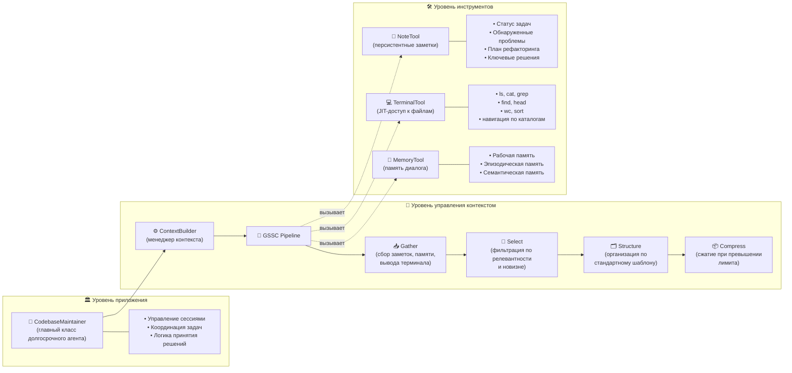

# Глава 9: Контекстная инженерия

В предыдущих главах мы рассмотрели системы памяти и RAG для агентов. Однако, чтобы агент стабильно «думал» и «действовал» в реально сложных сценариях, одних лишь памяти и поиска недостаточно — нужна инженерная методология, позволяющая непрерывно и систематически формировать для модели правильный «контекст». Именно этому посвящена данная глава: **контекстной инженерии** (Context Engineering). Её фокус — «как перед каждым обращением к модели собрать и оптимизировать входной контекст многократно применимым, измеримым и эволюционируемым способом», тем самым повышая корректность, надёжность и эффективность работы<sup>[1][2]</sup>.

Чтобы читатель мог быстро ознакомиться с полным функционалом этой главы, мы предоставляем готовый к установке Python-пакет. Версию, соответствующую данной главе, можно установить командой:

```bash
pip install "hello-agents[all]==0.2.8"
```

Глава знакомит с ключевыми концепциями и практиками контекстной инженерии, а также расширяет фреймворк HelloAgents конструктором контекста и двумя вспомогательными инструментами:

- **ContextBuilder** (`hello_agents/context/builder.py`): конструктор контекста, реализующий пайплайн GSSC (Gather–Select–Structure–Compress) и предоставляющий единый интерфейс управления контекстом.
- **NoteTool** (`hello_agents/tools/builtin/note_tool.py`): инструмент структурированных заметок с поддержкой управления персистентной памятью агента.
- **TerminalTool** (`hello_agents/tools/builtin/terminal_tool.py`): терминальный инструмент с поддержкой операций над файловой системой и JIT-извлечения контекста для агента.

Все три компонента вместе образуют законченное решение для контекстной инженерии — ключевое для реализации управления долгосрочными задачами и агентного поиска. О каждом из них рассказывается подробно в последующих разделах.

Помимо установки фреймворка, необходимо настроить API-ключ LLM в файле `.env`. Примеры в этой главе в основном используют большие языковые модели для управления контекстом и интеллектуального принятия решений.

После настройки можно начинать изучение материала главы!

## 9.1 Что такое контекстная инженерия

После того как проектирование промптов (Prompt Engineering) на протяжении нескольких лет занимало центральное место в прикладном AI, на горизонте появился новый термин: **контекстная инженерия** (Context Engineering). Сегодня разработка систем на основе языковых моделей — это уже не только поиск «правильных формулировок» в промпте, но и ответ на более широкий вопрос: **какая конфигурация контекста с наибольшей вероятностью заставит модель вести себя так, как мы ожидаем?**

Под «контекстом» понимается совокупность токенов, подаваемых при сэмплировании из большой языковой модели (LLM). Инженерная задача состоит в том, чтобы **максимизировать полезность этих токенов** при неотъемлемых ограничениях LLM, добиваясь стабильного получения ожидаемых результатов. Для эффективного использования LLM часто требуется «мыслить в терминах контекста» — то есть при каждом обращении анализировать общее состояние, видимое модели, и предугадывать, какое поведение это состояние может вызвать.

<div align="center">
  
  <p>Рисунок 9.1 Проектирование промптов vs. контекстная инженерия</p>
</div>

В этом разделе мы исследуем складывающуюся область контекстной инженерии и сформируем уточнённую ментальную модель для построения **управляемых и эффективных** агентов.

**Контекстная инженерия vs. проектирование промптов**

Как показано на рисунке 9.1, с точки зрения ведущих разработчиков моделей, контекстная инженерия является естественным развитием проектирования промптов. Проектирование промптов сосредоточено на том, как писать и организовывать инструкции для LLM ради лучших результатов (написание системных промптов, структурированные стратегии); контекстная же инженерия занимается тем, **как планировать и поддерживать «оптимальный информационный набор (токены)» на этапе инференса**, включая не только сам промпт, но и всю прочую информацию, попадающую в контекстное окно.

На ранних стадиях LLM-разработки промпт зачастую был основной областью работы, поскольку большинство сценариев (кроме обычного чата) требовали тонкой настройки промптов для однократной классификации или генерации текста. Как следует из названия, суть проектирования промптов — «как писать эффективные промпты», особенно системные. Однако по мере того как мы начинаем проектировать более мощных агентов, работающих дольше и в несколько раундов инференса, нам нужны стратегии управления **всем состоянием контекста** — системными инструкциями, инструментами, MCP (Model Context Protocol), внешними данными, историей сообщений и т. д.

Агент, работающий в цикле, непрерывно генерирует данные, которые могут быть релевантны следующему раунду инференса. Эту информацию необходимо **периодически уточнять**. Поэтому «искусство и техника» контекстной инженерии состоит в том, чтобы **выявлять, какой контент заслуживает попадания в ограниченное контекстное окно** из непрерывно расширяющейся «вселенной информации-кандидата».

## 9.2 Почему контекстная инженерия важна

Несмотря на то что модели становятся всё быстрее и способны обрабатывать данные бо́льших масштабов, мы наблюдаем следующее: подобно людям, LLM на каком-то этапе начинают «блуждать» или «теряться». Бенчмарки типа «иголка в стоге сена» выявляют явление **«деградации контекста»** (context rot): по мере роста числа токенов в контекстном окне точность воспроизведения информации из контекста снижается.

Разные модели могут демонстрировать более плавные кривые деградации, однако эта характеристика проявляется практически у всех. Поэтому **контекст необходимо рассматривать как ограниченный ресурс с убывающей предельной отдачей**. Подобно тому как у людей ограничен объём рабочей памяти, у LLM есть «бюджет внимания». Каждый новый токен расходует часть этого бюджета, поэтому необходимо тщательнее отбирать токены, которые мы передаём модели.

Этот дефицит не случаен — он обусловлен архитектурными ограничениями LLM. Трансформеры позволяют каждому токену устанавливать связи со **всеми** токенами контекста, теоретически формируя \(n^2\) попарных отношений внимания. По мере роста длины контекста способность модели моделировать эти попарные отношения «растягивается», что создаёт естественное противоречие между «масштабом контекста» и «концентрацией внимания». Кроме того, паттерны внимания модели формируются на основе распределения обучающих данных — короткие последовательности встречаются значительно чаще длинных, поэтому у модели меньше опыта с «зависимостями на полную длину контекста» и меньше специализированных параметров.

Методы интерполяции позиционного кодирования позволяют моделям «адаптироваться» к последовательностям длиннее обучающих во время инференса, однако ценой некоторой точности понимания позиций токенов. В целом эти факторы вместе формируют **градиент производительности**, а не «обрывистый» коллапс: модели по-прежнему мощны в длинных контекстах, но по сравнению с короткими их точность при извлечении информации и длинном рассуждении снижается.

Исходя из этой реальности, **осознанная контекстная инженерия** становится необходимостью для создания надёжных агентов.

### 9.2.1 «Анатомия» эффективного контекста

В условиях ограниченного «бюджета внимания» цель превосходной контекстной инженерии такова: **максимизировать вероятность получения ожидаемого результата при минимальном количестве токенов с высокой плотностью сигнала**. На практике мы рекомендуем выстраивать работу вокруг следующих компонентов:

- **Системный промпт**: чёткий и однозначный язык, иерархия информации «в самый раз». Типичные ловушки на двух крайностях:
  - Избыточное кодирование: написание сложной, хрупкой логики if-else прямо в промпте — высокие долгосрочные затраты на сопровождение и нестабильность.
  - Чрезмерная расплывчатость: только макроцели и общие рекомендации, без **конкретных сигналов** об ожидаемом результате или предположение неверного «общего контекста».
  
  Рекомендуется разбивать промпты на секции (например, `<background_information>`, `<instructions>`, руководство по инструментам, описание вывода и т. д.), разделённые XML/Markdown. Вне зависимости от формата — стремитесь к **«минимально необходимому информационному набору, полностью описывающему ожидаемое поведение»** («минимальный» ≠ «кратчайший»). Сначала запустите на лучшей модели с минимальным промптом, затем добавляйте чёткие инструкции и примеры исходя из режимов отказов.

- **Инструменты**: инструменты определяют контракт между агентом и пространством информации/действий, и должны способствовать эффективности — возвращать **дружелюбную к токенам** информацию, поощряя эффективное поведение агента. Инструменты должны:
  - Иметь единственную ответственность с минимальным перекрытием, чёткую семантику интерфейса;
  - Быть устойчивы к ошибкам;
  - Иметь чёткие и недвусмысленные описания параметров, полностью использующие сильные стороны модели в выражении и рассуждении.
  
  Типичный режим отказа — «раздутые наборы инструментов»: размытые функциональные границы, из-за чего само решение «какой инструмент использовать» становится неоднозначным. **Если инженеры-люди не могут определить, какой инструмент использовать, — не ожидайте, что агент справится лучше**. Тщательное выявление «минимального жизнеспособного набора инструментов (MVTS)» нередко значительно улучшает стабильность и сопровождаемость при долгосрочных взаимодействиях.

- **Примеры (few-shot)**: всегда рекомендуется приводить примеры, но не рекомендуется набивать в промпты «все граничные условия». Тщательно отбирайте **разнообразные и типичные** примеры, непосредственно иллюстрирующие «ожидаемое поведение». Для LLM **хорошие примеры стоят тысячи слов**.

Общий принцип: **достаточно, но компактно**. Как показано на рисунке 9.2, это динамическое извлечение, поступающее во время выполнения.

<div align="center">
  
  <p>Рисунок 9.2 Калибровка системного промпта</p>
</div>

### 9.2.2 Извлечение контекста и агентный поиск

Краткое определение: **Агент = LLM, автономно вызывающий инструменты в цикле**. По мере роста возможностей базовых моделей уровень автономности агентов повышается: они могут самостоятельнее исследовать сложные пространства задач и восстанавливаться после ошибок.

Инженерная практика постепенно переходит от «однократного извлечения перед инференсом (embedding retrieval)» к **«контексту точно вовремя (Just-in-time, JIT)»**. Последний подход отказывается от предварительной загрузки всех релевантных данных, поддерживая вместо этого **лёгкие ссылки** (пути к файлам, запросы к хранилищам, URL и т. д.) и динамически загружая нужные данные через инструменты во время выполнения. Это позволяет модели формулировать целевые запросы, кэшировать необходимые результаты и анализировать большие объёмы данных командами вроде `head`/`tail` — не загружая сразу целые блоки данных в контекст. Когнитивный паттерн здесь ближе к человеческому: мы не запоминаем всю информацию, а используем внешние индексы — файловые системы, входящие сообщения, закладки — для извлечения по мере необходимости.

Кроме экономии места, **метаданные самих ссылок** могут помочь уточнить поведение: иерархия директорий, соглашения об именовании, временные метки — всё это неявно передаёт «назначение и актуальность». Например, `tests/test_utils.py` и `src/core/test_utils.py` несут разную семантическую нагрузку.

Предоставление агентам возможности автономной навигации и извлечения также реализует **последовательное раскрытие (progressive disclosure)**: каждый шаг взаимодействия порождает новый контекст, который, в свою очередь, направляет следующее решение — размер файла намекает на сложность, именование намекает на назначение, временные метки намекают на релевантность. Агенты могут наращивать понимание послойно, удерживая в рабочей памяти лишь «текущий необходимый подмножества», а «ведение заметок» — для дополнительной персистентности, тем самым поддерживая сосредоточенность, а не «тонув в стремлении к полноте».

Компромисс таков: исследование в режиме выполнения часто медленнее предвычисленного извлечения и требует «самоуверенного» инженерного проектирования, чтобы у модели были нужные инструменты и эвристики. Без направления агенты могут злоупотреблять инструментами, гнаться за тупиками или упускать ключевую информацию, вызывая расход контекста.

Во многих сценариях **гибридная стратегия** эффективнее: предварительно загружать небольшое количество «высокоценного» контекста для скорости, затем позволять агентам продолжать автономное исследование по мере необходимости. Выбор границ зависит от динамики задачи и требований к актуальности. В инженерии можно предварительно загружать файлы наподобие «описания соглашений проекта (README/guides)», предоставляя при этом примитивы `glob`, `grep`, позволяющие агентам JIT-извлекать конкретные файлы — тем самым обходя накопленные издержки устаревших индексов и сложных синтаксических деревьев.

### 9.2.3 Контекстная инженерия для долгосрочных задач

Долгосрочные задачи требуют от агентов поддержания когерентности, согласованности контекста и целенаправленности в последовательностях действий, превышающих контекстное окно. Например, масштабные миграции кодовых баз, систематические исследования, занимающие часы. Бесконечное увеличение контекстного окна не решает проблем «загрязнения контекста» и снижения релевантности, поэтому необходимы инженерные подходы, напрямую работающие с этими ограничениями: **уплотнение (Compaction)**, **структурированное ведение заметок** и **архитектуры с субагентами**.

- **Уплотнение (Compaction)**
  - Определение: когда диалог приближается к лимиту контекста, выполняется высококачественное суммирование с последующим перезапуском нового контекстного окна с этим резюме — для поддержания долгосрочной когерентности.
  - Практика: модель сжимает и сохраняет архитектурные решения, нерешённые дефекты, детали реализации, отбрасывая повторяющиеся выводы инструментов и шум; новое окно несёт сжатое резюме + несколько недавних наиболее релевантных артефактов (например, «недавно открытые файлы»).
  - Рекомендации по настройке: сначала оптимизировать **полноту** (не упустить ключевую информацию), затем — **точность** (убрать избыточное); безопасное «лёгкое» сжатие — это очистка «вызовов инструментов и их результатов в глубокой истории».

- **Структурированное ведение заметок**
  - Определение: также называется «памятью агента». Агенты записывают ключевую информацию в **персистентное хранилище вне контекста** с фиксированной периодичностью, извлекая её по требованию на последующих этапах.
  - Ценность: поддержание персистентного состояния и зависимостей при минимальных расходах контекста. Например, ведение TODO-списков, `NOTES.md` проекта, индексов ключевых выводов/зависимостей/блокеров, поддержание прогресса и согласованности на протяжении десятков вызовов инструментов и нескольких сбросов контекста.
  - Примечание: равно эффективно в некодовых сценариях (например, долгосрочные стратегические задачи, управление целями и статистический учёт в играх/симуляциях). В комбинации с `MemoryTool` из Главы 8 легко реализуется и извлекается во время выполнения файловая/векторная внешняя память.

- **Архитектуры с субагентами**
  - Идея: главный агент отвечает за высокоуровневое планирование и синтез, тогда как несколько специализированных субагентов каждый углублённо работает, вызывает инструменты и исследует в «чистых контекстных окнах», возвращая в итоге лишь **сжатые резюме** (как правило, 1000–2000 токенов).
  - Преимущества: разделение ответственностей. Сложные контексты поиска остаются внутренними для субагентов, а главный агент фокусируется на интеграции и рассуждении; подходит для сложных исследовательских/аналитических задач, требующих параллельного изучения.
  - Опыт: публичные мультиагентные исследовательские системы показывают, что этот паттерн имеет значительные преимущества перед одноагентными базовыми линиями в сложных исследовательских задачах.

Для выбора между методами можно руководствоваться следующими эмпирическими правилами:

- **Уплотнение**: подходит для задач, требующих длительной непрерывности диалога, с акцентом на «эстафете» контекста.
- **Структурированное ведение заметок**: подходит для итеративной разработки и исследований с контрольными точками/поэтапными результатами.
- **Архитектуры с субагентами**: подходит для сложных исследований и анализа, выигрывающих от параллельного изучения.

Даже по мере непрерывного улучшения возможностей моделей «поддержание когерентности и сосредоточенности при длительных взаимодействиях» остаётся ключевым вызовом при создании надёжных агентов. Тщательная и систематическая контекстная инженерия надолго сохранит своё ключевое значение.

## 9.3 Практика в Hello-Agents: ContextBuilder

В этом разделе подробно рассматривается практика контекстной инженерии во фреймворке HelloAgents. Мы постепенно покажем, как построить производственную систему управления контекстом: от мотивации и ключевых структур данных, через детали реализации, к законченным примерам. Философия проектирования ContextBuilder — «просто и эффективно»: без излишней сложности, с единым отбором на основе оценок «релевантности + актуальности», что соответствует инженерной ориентации фреймворка Agent на модульность и сопровождаемость.

### 9.3.1 Мотивация и цели проектирования

Прежде чем строить ContextBuilder, необходимо чётко определить его цели проектирования и ключевую ценность. Превосходная система управления контекстом должна решать следующие ключевые задачи:

1. **Единая точка входа**: абстрагировать «Gather–Select–Structure–Compress» как многократно применимый пайплайн, сокращая шаблонный код в реализациях агентов. Это позволяет разработчикам не писать логику управления контекстом заново в каждом агенте.

2. **Устойчивая форма**: выводить шаблон контекста с фиксированной структурой, упрощая отладку, A/B-тестирование и оценку. Принята структура с секциями:
   - `[Role & Policies]`: роль агента и принципы поведения
   - `[Task]`: конкретная текущая задача
   - `[State]`: текущее состояние и контекстная информация агента
   - `[Evidence]`: доказательства, извлечённые из внешних баз знаний
   - `[Context]`: история диалога и связанные воспоминания
   - `[Output]`: ожидаемый формат и требования к выводу

3. **Страж бюджета**: по возможности удерживать высокоценную информацию в рамках бюджета токенов, предоставляя резервные стратегии сжатия для контекстов, выходящих за лимит.

4. **Минимум правил**: не вводить измерения классификации вроде источника/приоритета — это ведёт к росту сложности. Практика показывает, что простой механизм оценки на основе релевантности и актуальности достаточно эффективен в большинстве сценариев.

### 9.3.2 Ключевые структуры данных

Реализация ContextBuilder опирается на две ключевые структуры данных, определяющие конфигурацию системы и единицы информации.

**(1) ContextPacket: пакет информации-кандидата**

```python
from dataclasses import dataclass
from typing import Optional, Dict, Any
from datetime import datetime

@dataclass
class ContextPacket:
    """Пакет информации-кандидата

    Атрибуты:
        content: содержимое информации
        timestamp: метка времени
        token_count: количество токенов
        relevance_score: оценка релевантности (0.0–1.0)
        metadata: опциональные метаданные
    """
    content: str
    timestamp: datetime
    token_count: int
    relevance_score: float = 0.5
    metadata: Optional[Dict[str, Any]] = None

    def __post_init__(self):
        """Постинициализационная обработка"""
        if self.metadata is None:
            self.metadata = {}
        # Ограничиваем оценку релевантности допустимым диапазоном
        self.relevance_score = max(0.0, min(1.0, self.relevance_score))
```

`ContextPacket` — базовая единица информации в системе. Каждая информация-кандидат инкапсулируется в ContextPacket, содержащий ключевые атрибуты: содержимое, временну́ю метку, количество токенов и оценку релевантности. Эта унифицированная структура данных упрощает последующую логику отбора и сортировки.

**(2) ContextConfig: управление конфигурацией**

```python
@dataclass
class ContextConfig:
    """Конфигурация построения контекста

    Атрибуты:
        max_tokens: максимальное количество токенов
        reserve_ratio: доля, резервируемая для системных инструкций (0.0–1.0)
        min_relevance: минимальный порог релевантности
        enable_compression: включить ли сжатие
        recency_weight: вес актуальности (0.0–1.0)
        relevance_weight: вес релевантности (0.0–1.0)
    """
    max_tokens: int = 3000
    reserve_ratio: float = 0.2
    min_relevance: float = 0.1
    enable_compression: bool = True
    recency_weight: float = 0.3
    relevance_weight: float = 0.7

    def __post_init__(self):
        """Валидация параметров конфигурации"""
        assert 0.0 <= self.reserve_ratio <= 1.0, "reserve_ratio должен быть в диапазоне [0, 1]"
        assert 0.0 <= self.min_relevance <= 1.0, "min_relevance должен быть в диапазоне [0, 1]"
        assert abs(self.recency_weight + self.relevance_weight - 1.0) < 1e-6, \
            "recency_weight + relevance_weight должны в сумме давать 1.0"
```

`ContextConfig` инкапсулирует все настраиваемые параметры, делая поведение системы гибко регулируемым. Особого внимания заслуживает параметр `reserve_ratio`, гарантирующий, что ключевая информация — такая как системные инструкции — всегда имеет достаточно места и не вытесняется другой информацией.

### 9.3.3 Подробное описание пайплайна GSSC

Ядро ContextBuilder — пайплайн GSSC (Gather–Select–Structure–Compress), разбивающий процесс построения контекста на четыре чётких этапа. Рассмотрим детали реализации каждого этапа.

**(1) Gather: сбор информации из множества источников**

Первый этап — сбор информации-кандидата из нескольких источников. Ключевые требования к этому этапу: отказоустойчивость и гибкость.

```python
def _gather(
    self,
    user_query: str,
    conversation_history: Optional[List[Message]] = None,
    system_instructions: Optional[str] = None,
    custom_packets: Optional[List[ContextPacket]] = None
) -> List[ContextPacket]:
    """Сбор всей информации-кандидата

    Аргументы:
        user_query: запрос пользователя
        conversation_history: история диалога
        system_instructions: системные инструкции
        custom_packets: пользовательские пакеты информации

    Возвращает:
        List[ContextPacket]: список пакетов информации-кандидата
    """
    packets = []

    # 1. Добавляем системные инструкции (наивысший приоритет, без оценки)
    if system_instructions:
        packets.append(ContextPacket(
            content=system_instructions,
            timestamp=datetime.now(),
            token_count=self._count_tokens(system_instructions),
            relevance_score=1.0,  # Системные инструкции всегда сохраняются
            metadata={"type": "system_instruction", "priority": "high"}
        ))

    # 2. Извлекаем релевантные воспоминания из системы памяти
    if self.memory_tool:
        try:
            memory_results = self.memory_tool.run({
                "action": "search",
                "query": user_query,
                "limit": 10,
                "min_importance": 0.3
            })
            # Разбираем результаты памяти и конвертируем в ContextPacket
            memory_packets = self._parse_memory_results(memory_results, user_query)
            packets.extend(memory_packets)
        except Exception as e:
            print(f"[WARNING] Извлечение из памяти не удалось: {e}")

    # 3. Извлекаем релевантные знания из RAG-системы
    if self.rag_tool:
        try:
            rag_results = self.rag_tool.run({
                "action": "search",
                "query": user_query,
                "limit": 5,
                "min_score": 0.3
            })
            # Разбираем результаты RAG и конвертируем в ContextPacket
            rag_packets = self._parse_rag_results(rag_results, user_query)
            packets.extend(rag_packets)
        except Exception as e:
            print(f"[WARNING] Извлечение RAG не удалось: {e}")

    # 4. Добавляем историю диалога (оставляем только последние N записей)
    if conversation_history:
        recent_history = conversation_history[-5:]  # По умолчанию — последние 5
        for msg in recent_history:
            packets.append(ContextPacket(
                content=f"{msg.role}: {msg.content}",
                timestamp=msg.timestamp if hasattr(msg, 'timestamp') else datetime.now(),
                token_count=self._count_tokens(msg.content),
                relevance_score=0.6,  # Базовая релевантность исторических сообщений
                metadata={"type": "conversation_history", "role": msg.role}
            ))

    # 5. Добавляем пользовательские пакеты информации
    if custom_packets:
        packets.extend(custom_packets)

    print(f"[ContextBuilder] Собрано {len(packets)} пакетов информации-кандидата")
    return packets
```

Эта реализация демонстрирует несколько важных инженерных соображений:

- **Механизм отказоустойчивости**: каждый вызов внешнего источника данных обёрнут в try-except — сбой одного источника не влияет на весь процесс.
- **Обработка приоритетов**: системные инструкции помечаются как высокоприоритетные, что гарантирует их сохранение.
- **Ограничение истории**: история диалога ограничена самыми последними записями, чтобы исторические данные не заполняли контекстное окно целиком.

**(2) Select: интеллектуальный отбор информации**

Второй этап — оценка и отбор информации-кандидата на основе релевантности и актуальности. Это ядро всего пайплайна, непосредственно определяющее качество итогового контекста.

```python
def _select(
    self,
    packets: List[ContextPacket],
    user_query: str,
    available_tokens: int
) -> List[ContextPacket]:
    """Отбор наиболее релевантных пакетов информации

    Аргументы:
        packets: список пакетов информации-кандидата
        user_query: запрос пользователя (для вычисления релевантности)
        available_tokens: доступное количество токенов

    Возвращает:
        List[ContextPacket]: список отобранных пакетов информации
    """
    # 1. Разделяем системные инструкции и прочую информацию
    system_packets = [p for p in packets if p.metadata.get("type") == "system_instruction"]
    other_packets = [p for p in packets if p.metadata.get("type") != "system_instruction"]

    # 2. Вычисляем токены, занятые системными инструкциями
    system_tokens = sum(p.token_count for p in system_packets)
    remaining_tokens = available_tokens - system_tokens

    if remaining_tokens <= 0:
        print("[WARNING] Системные инструкции заняли весь бюджет токенов")
        return system_packets

    # 3. Вычисляем комплексные оценки для прочей информации
    scored_packets = []
    for packet in other_packets:
        # Вычисляем оценку релевантности (если ещё не вычислена)
        if packet.relevance_score == 0.5:  # Значение по умолчанию, нужен пересчёт
            relevance = self._calculate_relevance(packet.content, user_query)
            packet.relevance_score = relevance

        # Вычисляем оценку актуальности
        recency = self._calculate_recency(packet.timestamp)

        # Комплексная оценка = вес релевантности × релевантность + вес актуальности × актуальность
        combined_score = (
            self.config.relevance_weight * packet.relevance_score +
            self.config.recency_weight * recency
        )

        # Фильтруем информацию ниже порога минимальной релевантности
        if packet.relevance_score >= self.config.min_relevance:
            scored_packets.append((combined_score, packet))

    # 4. Сортируем по убыванию оценки
    scored_packets.sort(key=lambda x: x[0], reverse=True)

    # 5. Жадный отбор: заполняем от высшей оценки к низшей до достижения лимита токенов
    selected = system_packets.copy()
    current_tokens = system_tokens

    for score, packet in scored_packets:
        if current_tokens + packet.token_count <= available_tokens:
            selected.append(packet)
            current_tokens += packet.token_count
        else:
            # Бюджет токенов исчерпан, останавливаем отбор
            break

    print(f"[ContextBuilder] Отобрано {len(selected)} пакетов, всего {current_tokens} токенов")
    return selected

def _calculate_relevance(self, content: str, query: str) -> float:
    """Вычисляет релевантность контента запросу

    Использует простой алгоритм перекрытия ключевых слов.
    В продакшне можно заменить вычислением векторного сходства.

    Аргументы:
        content: текст контента
        query: текст запроса

    Возвращает:
        float: оценка релевантности (0.0–1.0)
    """
    # Токенизация (простая реализация, можно использовать более сложные токенизаторы)
    content_words = set(content.lower().split())
    query_words = set(query.lower().split())

    if not query_words:
        return 0.0

    # Сходство Жаккара
    intersection = content_words & query_words
    union = content_words | query_words

    return len(intersection) / len(union) if union else 0.0

def _calculate_recency(self, timestamp: datetime) -> float:
    """Вычисляет оценку временно́й актуальности

    Использует модель экспоненциального затухания: высокая оценка в течение 24 часов,
    затем постепенное убывание.

    Аргументы:
        timestamp: метка времени информации

    Возвращает:
        float: оценка актуальности (0.0–1.0)
    """
    import math

    age_hours = (datetime.now() - timestamp).total_seconds() / 3600

    # Экспоненциальное затухание: высокая оценка в течение 24 часов, затем постепенное убывание
    decay_factor = 0.1  # Коэффициент затухания
    recency_score = math.exp(-decay_factor * age_hours / 24)

    return max(0.1, min(1.0, recency_score))  # Ограничиваем диапазоном [0.1, 1.0]
```

Ключевой алгоритм этапа отбора отражает несколько важных инженерных соображений:

- **Механизм оценки**: взвешенная комбинация релевантности и актуальности с настраиваемыми весами.
- **Жадный алгоритм**: заполнение от высшей оценки к низшей, что гарантирует отбор наиценнейшей информации в рамках ограниченного бюджета.
- **Механизм фильтрации**: отсев низкокачественной информации через параметр `min_relevance`.

**(3) Structure: структурированный вывод**

Третий этап — организация отобранной информации в структурированный шаблон контекста.

```python
def _structure(self, selected_packets: List[ContextPacket], user_query: str) -> str:
    """Организует отобранные пакеты информации в структурированный шаблон контекста

    Аргументы:
        selected_packets: список отобранных пакетов информации
        user_query: запрос пользователя

    Возвращает:
        str: структурированная строка контекста
    """
    # Группируем по типу
    system_instructions = []
    evidence = []
    context = []

    for packet in selected_packets:
        packet_type = packet.metadata.get("type", "general")

        if packet_type == "system_instruction":
            system_instructions.append(packet.content)
        elif packet_type in ["rag_result", "knowledge"]:
            evidence.append(packet.content)
        else:
            context.append(packet.content)

    # Строим структурированный шаблон
    sections = []

    # [Role & Policies]
    if system_instructions:
        sections.append("[Role & Policies]\n" + "\n".join(system_instructions))

    # [Task]
    sections.append(f"[Task]\n{user_query}")

    # [Evidence]
    if evidence:
        sections.append("[Evidence]\n" + "\n---\n".join(evidence))

    # [Context]
    if context:
        sections.append("[Context]\n" + "\n".join(context))

    # [Output]
    sections.append("[Output]\nПожалуйста, дайте точный, основанный на доказательствах ответ, используя информацию выше.")

    return "\n\n".join(sections)
```

Этап структурирования организует разрозненные пакеты информации в чёткие секции. Это решение имеет несколько преимуществ:

- **Читаемость**: чёткие секции упрощают понимание структуры контекста как людьми, так и моделями.
- **Отлаживаемость**: легче локализовать проблему — можно быстро определить, в какой области находится проблемная информация.
- **Расширяемость**: для добавления новых источников информации достаточно создать новые секции.

**(4) Compress: резервное сжатие**

Четвёртый этап — сжатие контекстов, выходящих за лимит.

```python
def _compress(self, context: str, max_tokens: int) -> str:
    """Сжимает контекст, превышающий лимит

    Аргументы:
        context: исходный контекст
        max_tokens: максимальный лимит токенов

    Возвращает:
        str: сжатый контекст
    """
    current_tokens = self._count_tokens(context)

    if current_tokens <= max_tokens:
        return context  # Сжатие не требуется

    print(f"[ContextBuilder] Контекст превысил лимит ({current_tokens} > {max_tokens}), выполняем сжатие")

    # Посекционное сжатие: сохраняем структурную целостность
    sections = context.split("\n\n")
    compressed_sections = []
    current_total = 0

    for section in sections:
        section_tokens = self._count_tokens(section)

        if current_total + section_tokens <= max_tokens:
            # Сохраняем полностью
            compressed_sections.append(section)
            current_total += section_tokens
        else:
            # Сохраняем частично
            remaining_tokens = max_tokens - current_total
            if remaining_tokens > 50:  # Сохраняем не менее 50 токенов
                # Простое усечение (в продакшне можно использовать суммаризацию LLM)
                truncated = self._truncate_text(section, remaining_tokens)
                compressed_sections.append(truncated + "\n[... Контент сжат ...]")
            break

    compressed_context = "\n\n".join(compressed_sections)
    final_tokens = self._count_tokens(compressed_context)
    print(f"[ContextBuilder] Сжатие завершено: {current_tokens} -> {final_tokens} токенов")

    return compressed_context

def _truncate_text(self, text: str, max_tokens: int) -> str:
    """Усекает текст до указанного числа токенов

    Аргументы:
        text: исходный текст
        max_tokens: максимальное количество токенов

    Возвращает:
        str: усечённый текст
    """
    # Простая реализация: оцениваем по соотношению символов
    # В продакшне следует использовать точный токенизатор
    char_per_token = len(text) / self._count_tokens(text) if self._count_tokens(text) > 0 else 4
    max_chars = int(max_tokens * char_per_token)

    return text[:max_chars]

def _count_tokens(self, text: str) -> int:
    """Оценивает количество токенов в тексте

    Аргументы:
        text: текстовый контент

    Возвращает:
        int: количество токенов
    """
    # Простая оценка: китайский символ ≈ 1 токен, английское слово ≈ 1,3 токена
    # В продакшне следует использовать настоящий токенизатор
    chinese_chars = sum(1 for ch in text if '一' <= ch <= '鿿')
    english_words = len([w for w in text.split() if w])

    return int(chinese_chars + english_words * 1.3)
```

Проектирование этапа сжатия воплощает принцип «поддержания структурной целостности». Даже при жёстких ограничениях бюджета токенов система старается сохранить ключевую информацию из каждой секции.

### 9.3.4 Полный пример использования

Теперь продемонстрируем, как использовать ContextBuilder в реальных проектах на полном примере.

**(1) Базовое использование**

```python
from hello_agents.context import ContextBuilder, ContextConfig
from hello_agents.tools import MemoryTool, RAGTool
from hello_agents.core.message import Message
from datetime import datetime

# 1. Инициализируем инструменты
memory_tool = MemoryTool(user_id="user123")
rag_tool = RAGTool(knowledge_base_path="./knowledge_base")

# 2. Создаём ContextBuilder
config = ContextConfig(
    max_tokens=3000,
    reserve_ratio=0.2,
    min_relevance=0.2,
    enable_compression=True
)

builder = ContextBuilder(
    memory_tool=memory_tool,
    rag_tool=rag_tool,
    config=config
)

# 3. Подготавливаем историю диалога
conversation_history = [
    Message(content="Я разрабатываю инструмент анализа данных", role="user", timestamp=datetime.now()),
    Message(content="Отлично! Инструменты анализа данных обычно работают с большими объёмами данных. Какой технологический стек планируете использовать?", role="assistant", timestamp=datetime.now()),
    Message(content="Планирую использовать Python и Pandas, модуль чтения CSV уже готов", role="user", timestamp=datetime.now()),
    Message(content="Хороший выбор! Pandas очень мощен для обработки данных. Далее, вероятно, потребуется очистка и преобразование данных.", role="assistant", timestamp=datetime.now()),
]

# 4. Добавляем воспоминания
memory_tool.run({
    "action": "add",
    "content": "Пользователь разрабатывает инструмент анализа данных на Python и Pandas",
    "memory_type": "semantic",
    "importance": 0.8
})

memory_tool.run({
    "action": "add",
    "content": "Завершена разработка модуля чтения CSV",
    "memory_type": "episodic",
    "importance": 0.7
})

# 5. Строим контекст
context = builder.build(
    user_query="Как оптимизировать использование памяти в Pandas?",
    conversation_history=conversation_history,
    system_instructions="Вы — старший консультант по инженерии данных на Python. Ваши ответы должны: 1) содержать конкретные практические советы 2) объяснять технические принципы 3) приводить примеры кода"
)

print("=" * 80)
print("Построенный контекст:")
print("=" * 80)
print(context)
print("=" * 80)
```

**(2) Демонстрация результата выполнения**

После выполнения приведённого кода вы увидите следующий структурированный вывод контекста:

```
================================================================================
Построенный контекст:
================================================================================
[Role & Policies]
Вы — старший консультант по инженерии данных на Python. Ваши ответы должны: 1) содержать конкретные практические советы 2) объяснять технические принципы 3) приводить примеры кода

[Task]
Как оптимизировать использование памяти в Pandas?

[Evidence]
Ключевые стратегии оптимизации памяти в Pandas:
1. Используйте подходящие типы данных (например, category вместо object)
2. Читайте большие файлы по частям (chunks)
3. Используйте параметр chunksize
---
Оптимизация типов данных может значительно сократить потребление памяти. Например, замена int64 на int32 экономит 50% памяти.

[Context]
user: Я разрабатываю инструмент анализа данных
assistant: Отлично! Инструменты анализа данных обычно работают с большими объёмами данных. Какой технологический стек планируете использовать?
user: Планирую использовать Python и Pandas, модуль чтения CSV уже готов
assistant: Хороший выбор! Pandas очень мощен для обработки данных. Далее, вероятно, потребуется очистка и преобразование данных.
Memory: Пользователь разрабатывает инструмент анализа данных на Python и Pandas
Memory: Завершена разработка модуля чтения CSV

[Output]
Пожалуйста, дайте точный, основанный на доказательствах ответ, используя информацию выше.
================================================================================
```

Этот структурированный контекст содержит всю необходимую информацию:

- **[Role & Policies]**: чётко определяет роль AI и требования к ответам.
- **[Task]**: однозначно выражает вопрос пользователя.
- **[Evidence]**: релевантные знания, извлечённые из RAG-системы.
- **[Context]**: история диалога и связанные воспоминания, дающие достаточный фоновый контекст.
- **[Output]**: направляет LLM в организации ответа.

**(3) Интеграция с агентом**

Наконец, покажем, как интегрировать ContextBuilder в агент:

```python
from hello_agents import SimpleAgent, HelloAgentsLLM, ToolRegistry
from hello_agents.context import ContextBuilder, ContextConfig
from hello_agents.tools import MemoryTool, RAGTool

class ContextAwareAgent(SimpleAgent):
    """Агент с поддержкой осознанности контекста"""

    def __init__(self, name: str, llm: HelloAgentsLLM, **kwargs):
        super().__init__(name=name, llm=llm, system_prompt=kwargs.get("system_prompt", ""))

        # Инициализируем конструктор контекста
        self.memory_tool = MemoryTool(user_id=kwargs.get("user_id", "default"))
        self.rag_tool = RAGTool(knowledge_base_path=kwargs.get("knowledge_base_path", "./kb"))

        self.context_builder = ContextBuilder(
            memory_tool=self.memory_tool,
            rag_tool=self.rag_tool,
            config=ContextConfig(max_tokens=4000)
        )

        self.conversation_history = []

    def run(self, user_input: str) -> str:
        """Запускает агента, автоматически строя оптимизированный контекст"""

        # 1. Используем ContextBuilder для построения оптимизированного контекста
        optimized_context = self.context_builder.build(
            user_query=user_input,
            conversation_history=self.conversation_history,
            system_instructions=self.system_prompt
        )

        # 2. Вызываем LLM с оптимизированным контекстом
        messages = [
            {"role": "system", "content": optimized_context},
            {"role": "user", "content": user_input}
        ]
        response = self.llm.invoke(messages)

        # 3. Обновляем историю диалога
        from hello_agents.core.message import Message
        from datetime import datetime

        self.conversation_history.append(
            Message(content=user_input, role="user", timestamp=datetime.now())
        )
        self.conversation_history.append(
            Message(content=response, role="assistant", timestamp=datetime.now())
        )

        # 4. Записываем важные взаимодействия в систему памяти
        self.memory_tool.run({
            "action": "add",
            "content": f"Q: {user_input}\nA: {response[:200]}...",  # Краткое содержание
            "memory_type": "episodic",
            "importance": 0.6
        })

        return response

# Пример использования
agent = ContextAwareAgent(
    name="Консультант по анализу данных",
    llm=HelloAgentsLLM(),
    system_prompt="Вы — старший консультант по инженерии данных на Python.",
    user_id="user123",
    knowledge_base_path="./data_science_kb"
)

response = agent.run("Как оптимизировать использование памяти в Pandas?")
print(response)
```

Таким образом, ContextBuilder становится «мозгом управления контекстом» агента: автоматически обрабатывает сбор, фильтрацию и организацию информации, позволяя агенту всегда рассуждать и генерировать ответы в условиях оптимального контекста.

### 9.3.5 Лучшие практики и рекомендации по оптимизации

При практическом применении ContextBuilder стоит обратить внимание на следующие лучшие практики:

1. **Динамическая регулировка бюджета токенов**: корректируйте `max_tokens` в зависимости от сложности задачи — используйте меньший бюджет для простых задач и увеличивайте для сложных.

2. **Оптимизация вычисления релевантности**: в продакшне замените простое перекрытие ключевых слов вычислением векторного сходства для повышения качества поиска.

3. **Механизм кэширования**: для неизменяемых системных инструкций и контента базы знаний реализуйте механизм кэширования во избежание повторных вычислений.

4. **Мониторинг и логирование**: записывайте статистику каждого построения контекста (число отобранных единиц информации, коэффициент использования токенов и т. д.) для последующей оптимизации.

5. **A/B-тестирование**: для ключевых параметров (таких как вес релевантности, вес актуальности) находите оптимальную конфигурацию с помощью A/B-тестирования.

## 9.4 NoteTool: структурированные заметки

NoteTool — это компонент структурированной внешней памяти, предназначенный для «долгосрочных задач». Он использует файлы Markdown в качестве носителя: заголовок содержит YAML front matter с ключевой информацией, а тело — статусы, выводы, блокеры и пункты действий. Такой дизайн сочетает удобочитаемость для человека, дружественность к системам контроля версий и лёгкость повторного включения в контекст, что делает NoteTool важным инструментом для создания долгосрочных агентов.

### 9.4.1 Философия проектирования и сценарии применения

Прежде чем погружаться в детали реализации, разберёмся в философии проектирования и типичных сценариях применения NoteTool.

**(1) Зачем нужен NoteTool?**

В Главе 8 мы познакомились с MemoryTool, предоставляющим мощные возможности управления памятью. Однако MemoryTool ориентирован прежде всего на **диалоговую память** — кратковременную рабочую, эпизодическую и семантическую. Для **проектно-ориентированных задач**, требующих долгосрочного отслеживания и структурированного управления, нужен более лёгкий и удобочитаемый для человека способ записи.

NoteTool заполняет этот пробел, предоставляя:

- **Структурированную запись**: формат Markdown + YAML, пригодный как для машинного разбора, так и для чтения и редактирования человеком.
- **Дружественность к версионированию**: текстовый формат, нативно поддерживающий системы контроля версий, такие как Git.
- **Малые накладные расходы**: не требует сложных операций с базами данных, подходит для лёгкого отслеживания состояния.
- **Гибкую категоризацию**: гибкая организация заметок через `type` и `tags` с поддержкой многомерного поиска.

**(2) Типичные сценарии применения**

NoteTool особенно подходит для следующих сценариев:

**Сценарий 1: Долгосрочное сопровождение проекта**

Представьте, что агент помогает выполнить задачу по крупному рефакторингу кодовой базы, которая может занять дни или даже недели. NoteTool может записывать:

- `task_state`: статус и прогресс задачи на текущем этапе.
- `conclusion`: ключевые выводы после завершения каждого этапа.
- `blocker`: обнаруженные проблемы и блокеры.
- `action`: планы следующих действий.

```python
# Запись статуса задачи
notes.run({
    "action": "create",
    "title": "Проект рефакторинга — Фаза 1",
    "content": "Завершён рефакторинг слоя модели данных, покрытие тестами достигло 85%. Далее — рефакторинг слоя бизнес-логики.",
    "note_type": "task_state",
    "tags": ["refactoring", "phase1"]
})

# Запись блокера
notes.run({
    "action": "create",
    "title": "Проблема конфликта зависимостей",
    "content": "Обнаружена несовместимость версий некоторых сторонних библиотек, требует решения. Область влияния: 3 модуля слоя бизнес-логики.",
    "note_type": "blocker",
    "tags": ["dependency", "urgent"]
})
```

**Сценарий 2: Управление исследовательскими задачами**

Интеллектуальный исследовательский помощник, проводящий обзор литературы, может использовать NoteTool для записи:

- Ключевых тезисов каждой статьи (`conclusion`).
- Тем, требующих углублённого изучения (`action`).
- Важных ссылок (`reference`).

**Сценарий 3: Взаимодействие с ContextBuilder**

Перед каждым раундом диалога агент может извлечь релевантные заметки через операции `search` или `list` и включить их в контекст:

```python
# В методе run агента
def run(self, user_input: str) -> str:
    # 1. Извлекаем релевантные заметки
    relevant_notes = self.note_tool.run({
        "action": "search",
        "query": user_input,
        "limit": 3
    })

    # 2. Преобразуем содержимое заметок в ContextPacket
    note_packets = []
    for note in relevant_notes:
        note_packets.append(ContextPacket(
            content=note['content'],
            timestamp=note['updated_at'],
            token_count=self._count_tokens(note['content']),
            relevance_score=0.7,
            metadata={"type": "note", "note_type": note['type']}
        ))

    # 3. Передаём заметки при построении контекста
    context = self.context_builder.build(
        user_query=user_input,
        custom_packets=note_packets,
        ...
    )
```

### 9.4.2 Подробное описание формата хранения

NoteTool использует гибридный формат Markdown + YAML, обеспечивающий баланс между структурированностью и читаемостью.

**(1) Формат файла заметки**

Каждая заметка — отдельный файл `.md` следующего формата:

```markdown
---
id: note_20250119_153000_0
title: Прогресс проекта — Фаза 1
type: task_state
tags: [refactoring, phase1, backend]
created_at: 2025-01-19T15:30:00
updated_at: 2025-01-19T15:30:00
---

# Прогресс проекта — Фаза 1

## Статус выполнения

Завершён рефакторинг слоя модели данных. Основные изменения:

1. Унифицированы соглашения об именовании классов-сущностей
2. Введены аннотации типов для улучшения сопровождаемости кода
3. Оптимизирована производительность запросов к базе данных

## Покрытие тестами

- Покрытие модульными тестами: 85%
- Покрытие интеграционными тестами: 70%

## Следующие шаги

1. Рефакторинг слоя бизнес-логики
2. Решение проблем с конфликтами зависимостей
3. Увеличить покрытие интеграционными тестами до 85%
```

Преимущества этого формата:

- **Метаданные YAML**: машиночитаемые, поддерживают точное извлечение и поиск по полям.
- **Тело в Markdown**: удобочитаемое для человека, поддерживает богатое форматирование (заголовки, списки, блоки кода и т. д.).
- **Имя файла как ID**: упрощает управление; имя файла каждой заметки является её уникальным идентификатором.

**(2) Индексный файл**

NoteTool поддерживает файл `notes_index.json` для быстрого поиска и управления заметками:

```json
{
  "note_20250119_153000_0": {
    "id": "note_20250119_153000_0",
    "title": "Прогресс проекта — Фаза 1",
    "type": "task_state",
    "tags": ["refactoring", "phase1", "backend"],
    "created_at": "2025-01-19T15:30:00",
    "updated_at": "2025-01-19T15:30:00",
    "file_path": "./notes/note_20250119_153000_0.md"
  }
}
```

Роль этого индексного файла:

- **Быстрый поиск**: не нужно открывать каждый файл — поиск ведётся напрямую по индексу.
- **Управление метаданными**: централизованное хранение метаданных всех заметок.
- **Проверка целостности**: возможность обнаружения отсутствующих или повреждённых файлов.

### 9.4.3 Подробное описание ключевых операций

NoteTool предоставляет семь ключевых операций, охватывающих полный жизненный цикл управления заметками.

**(1) create: создание заметки**

```python
def _create_note(
    self,
    title: str,
    content: str,
    note_type: str = "general",
    tags: Optional[List[str]] = None
) -> str:
    """Создаёт заметку

    Аргументы:
        title: заголовок заметки
        content: содержимое заметки (формат Markdown)
        note_type: тип заметки (task_state/conclusion/blocker/action/reference/general)
        tags: список тегов

    Возвращает:
        str: ID заметки
    """
    from datetime import datetime

    # 1. Генерируем уникальный ID
    timestamp = datetime.now().strftime('%Y%m%d_%H%M%S')
    note_id = f"note_{timestamp}_{len(self.index)}"

    # 2. Строим метаданные
    metadata = {
        "id": note_id,
        "title": title,
        "type": note_type,
        "tags": tags or [],
        "created_at": datetime.now().isoformat(),
        "updated_at": datetime.now().isoformat()
    }

    # 3. Строим полное содержимое Markdown-файла
    md_content = self._build_markdown(metadata, content)

    # 4. Сохраняем в файл
    file_path = os.path.join(self.workspace, f"{note_id}.md")
    with open(file_path, 'w', encoding='utf-8') as f:
        f.write(md_content)

    # 5. Обновляем индекс
    metadata["file_path"] = file_path
    self.index[note_id] = metadata
    self._save_index()

    return note_id

def _build_markdown(self, metadata: Dict, content: str) -> str:
    """Строит содержимое Markdown-файла (YAML + тело)"""
    import yaml

    # YAML front matter
    yaml_header = yaml.dump(metadata, allow_unicode=True, sort_keys=False)

    # Итоговый формат
    return f"---\n{yaml_header}---\n\n{content}"
```

Пример использования:

```python
from hello_agents.tools import NoteTool

notes = NoteTool(workspace="./project_notes")

note_id = notes.run({
    "action": "create",
    "title": "Проект рефакторинга — Фаза 1",
    "content": """## Статус выполнения
Завершён рефакторинг слоя модели данных, покрытие тестами достигло 85%.

## Следующие шаги
Рефакторинг слоя бизнес-логики""",
    "note_type": "task_state",
    "tags": ["refactoring", "phase1"]
})

print(f"✅ Заметка успешно создана, ID: {note_id}")
```

**(2) read: чтение заметки**

```python
def _read_note(self, note_id: str) -> Dict:
    """Читает содержимое заметки

    Аргументы:
        note_id: ID заметки

    Возвращает:
        Dict: словарь с метаданными и содержимым
    """
    if note_id not in self.index:
        raise ValueError(f"Заметка не существует: {note_id}")

    file_path = self.index[note_id]["file_path"]

    # Читаем файл
    with open(file_path, 'r', encoding='utf-8') as f:
        raw_content = f.read()

    # Разбираем метаданные YAML и тело Markdown
    metadata, content = self._parse_markdown(raw_content)

    return {
        "metadata": metadata,
        "content": content
    }

def _parse_markdown(self, raw_content: str) -> Tuple[Dict, str]:
    """Разбирает Markdown-файл (разделяет YAML и тело)"""
    import yaml

    # Ищем разделители YAML
    parts = raw_content.split('---\n', 2)

    if len(parts) >= 3:
        # Есть YAML front matter
        yaml_str = parts[1]
        content = parts[2].strip()
        metadata = yaml.safe_load(yaml_str)
    else:
        # Метаданных нет, всё — тело
        metadata = {}
        content = raw_content.strip()

    return metadata, content
```

**(3) update: обновление заметки**

```python
def _update_note(
    self,
    note_id: str,
    title: Optional[str] = None,
    content: Optional[str] = None,
    note_type: Optional[str] = None,
    tags: Optional[List[str]] = None
) -> str:
    """Обновляет заметку

    Аргументы:
        note_id: ID заметки
        title: новый заголовок (опционально)
        content: новое содержимое (опционально)
        note_type: новый тип (опционально)
        tags: новые теги (опционально)

    Возвращает:
        str: сообщение о результате операции
    """
    if note_id not in self.index:
        raise ValueError(f"Заметка не существует: {note_id}")

    # 1. Читаем существующую заметку
    note = self._read_note(note_id)
    metadata = note["metadata"]
    old_content = note["content"]

    # 2. Обновляем поля
    if title:
        metadata["title"] = title
    if note_type:
        metadata["type"] = note_type
    if tags is not None:
        metadata["tags"] = tags
    if content is not None:
        old_content = content

    # Обновляем метку времени
    from datetime import datetime
    metadata["updated_at"] = datetime.now().isoformat()

    # 3. Перестраиваем и сохраняем
    md_content = self._build_markdown(metadata, old_content)
    file_path = metadata["file_path"]

    with open(file_path, 'w', encoding='utf-8') as f:
        f.write(md_content)

    # 4. Обновляем индекс
    self.index[note_id] = metadata
    self._save_index()

    return f"✅ Заметка обновлена: {metadata['title']}"
```

**(4) search: поиск заметок**

```python
def _search_notes(
    self,
    query: str,
    limit: int = 10,
    note_type: Optional[str] = None,
    tags: Optional[List[str]] = None
) -> List[Dict]:
    """Поиск заметок

    Аргументы:
        query: поисковый запрос
        limit: ограничение количества возвращаемых результатов
        note_type: фильтр по типу (опционально)
        tags: фильтр по тегам (опционально)

    Возвращает:
        List[Dict]: список совпадающих заметок
    """
    results = []
    query_lower = query.lower()

    for note_id, metadata in self.index.items():
        # Фильтр по типу
        if note_type and metadata.get("type") != note_type:
            continue

        # Фильтр по тегам
        if tags:
            note_tags = set(metadata.get("tags", []))
            if not note_tags.intersection(tags):
                continue

        # Читаем содержимое заметки
        try:
            note = self._read_note(note_id)
            content = note["content"]
            title = metadata.get("title", "")

            # Ищем в заголовке и содержимом
            if query_lower in title.lower() or query_lower in content.lower():
                results.append({
                    "note_id": note_id,
                    "title": title,
                    "type": metadata.get("type"),
                    "tags": metadata.get("tags", []),
                    "content": content,
                    "updated_at": metadata.get("updated_at")
                })
        except Exception as e:
            print(f"[WARNING] Не удалось прочитать заметку {note_id}: {e}")
            continue

    # Сортируем по времени обновления
    results.sort(key=lambda x: x["updated_at"], reverse=True)

    return results[:limit]
```

**(5) list: перечисление заметок**

```python
def _list_notes(
    self,
    note_type: Optional[str] = None,
    tags: Optional[List[str]] = None,
    limit: int = 20
) -> List[Dict]:
    """Перечисляет заметки (в обратном хронологическом порядке по времени обновления)

    Аргументы:
        note_type: фильтр по типу (опционально)
        tags: фильтр по тегам (опционально)
        limit: ограничение количества возвращаемых результатов

    Возвращает:
        List[Dict]: список метаданных заметок
    """
    results = []

    for note_id, metadata in self.index.items():
        # Фильтр по типу
        if note_type and metadata.get("type") != note_type:
            continue

        # Фильтр по тегам
        if tags:
            note_tags = set(metadata.get("tags", []))
            if not note_tags.intersection(tags):
                continue

        results.append(metadata)

    # Сортируем по времени обновления
    results.sort(key=lambda x: x.get("updated_at", ""), reverse=True)

    return results[:limit]
```

**(6) summary: сводка заметок**

```python
def _summary(self) -> Dict[str, Any]:
    """Генерирует сводную статистику по заметкам

    Возвращает:
        Dict: статистическая информация
    """
    total_count = len(self.index)

    # Подсчёт по типу
    type_counts = {}
    for metadata in self.index.values():
        note_type = metadata.get("type", "general")
        type_counts[note_type] = type_counts.get(note_type, 0) + 1

    # Недавно обновлённые заметки
    recent_notes = sorted(
        self.index.values(),
        key=lambda x: x.get("updated_at", ""),
        reverse=True
    )[:5]

    return {
        "total_notes": total_count,
        "type_distribution": type_counts,
        "recent_notes": [
            {
                "id": note["id"],
                "title": note.get("title", ""),
                "type": note.get("type"),
                "updated_at": note.get("updated_at")
            }
            for note in recent_notes
        ]
    }
```

**(7) delete: удаление заметки**

```python
def _delete_note(self, note_id: str) -> str:
    """Удаляет заметку

    Аргументы:
        note_id: ID заметки

    Возвращает:
        str: сообщение о результате операции
    """
    if note_id not in self.index:
        raise ValueError(f"Заметка не существует: {note_id}")

    # 1. Удаляем файл
    file_path = self.index[note_id]["file_path"]
    if os.path.exists(file_path):
        os.remove(file_path)

    # 2. Убираем из индекса
    title = self.index[note_id].get("title", note_id)
    del self.index[note_id]
    self._save_index()

    return f"✅ Заметка удалена: {title}"
```

### 9.4.4 Глубокая интеграция с ContextBuilder

Истинная мощь NoteTool раскрывается в сочетании с ContextBuilder. Продемонстрируем эту интеграцию через полный кейс.

**(1) Постановка сценария**

Предположим, мы создаём долгосрочного помощника по проекту, которому необходимо:

1. Записывать поэтапный прогресс проекта.
2. Отслеживать нерешённые вопросы.
3. Автоматически просматривать релевантные заметки при каждом диалоге.
4. Давать согласованные рекомендации на основе исторических заметок.

**(2) Пример реализации**

```python
from hello_agents import SimpleAgent, HelloAgentsLLM
from hello_agents.context import ContextBuilder, ContextConfig, ContextPacket
from hello_agents.tools import MemoryTool, RAGTool, NoteTool
from datetime import datetime

class ProjectAssistant(SimpleAgent):
    """Долгосрочный помощник по проекту, интегрирующий NoteTool и ContextBuilder"""

    def __init__(self, name: str, project_name: str, **kwargs):
        super().__init__(name=name, llm=HelloAgentsLLM(), **kwargs)

        self.project_name = project_name

        # Инициализируем инструменты
        self.memory_tool = MemoryTool(user_id=project_name)
        self.rag_tool = RAGTool(knowledge_base_path=f"./{project_name}_kb")
        self.note_tool = NoteTool(workspace=f"./{project_name}_notes")

        # Инициализируем конструктор контекста
        self.context_builder = ContextBuilder(
            memory_tool=self.memory_tool,
            rag_tool=self.rag_tool,
            config=ContextConfig(max_tokens=4000)
        )

        self.conversation_history = []

    def run(self, user_input: str, note_as_action: bool = False) -> str:
        """Запускает помощника, автоматически интегрируя заметки"""

        # 1. Извлекаем релевантные заметки из NoteTool
        relevant_notes = self._retrieve_relevant_notes(user_input)

        # 2. Преобразуем заметки в ContextPacket
        note_packets = self._notes_to_packets(relevant_notes)

        # 3. Строим оптимизированный контекст
        context = self.context_builder.build(
            user_query=user_input,
            conversation_history=self.conversation_history,
            system_instructions=self._build_system_instructions(),
            custom_packets=note_packets
        )

        # 4. Вызываем LLM
        response = self.llm.invoke(context)

        # 5. При необходимости записываем взаимодействие как заметку
        if note_as_action:
            self._save_as_note(user_input, response)

        # 6. Обновляем историю диалога
        self._update_history(user_input, response)

        return response

    def _retrieve_relevant_notes(self, query: str, limit: int = 3) -> List[Dict]:
        """Извлекает релевантные заметки"""
        try:
            # Приоритетно извлекаем заметки типа blocker и action
            blockers = self.note_tool.run({
                "action": "list",
                "note_type": "blocker",
                "limit": 2
            })

            # Общий поиск
            search_results = self.note_tool.run({
                "action": "search",
                "query": query,
                "limit": limit
            })

            # Объединяем и дедублируем
            all_notes = {note['note_id']: note for note in blockers + search_results}
            return list(all_notes.values())[:limit]

        except Exception as e:
            print(f"[WARNING] Извлечение заметок не удалось: {e}")
            return []

    def _notes_to_packets(self, notes: List[Dict]) -> List[ContextPacket]:
        """Преобразует заметки в пакеты контекста"""
        packets = []

        for note in notes:
            content = f"[Заметка: {note['title']}]\n{note['content']}"

            packets.append(ContextPacket(
                content=content,
                timestamp=datetime.fromisoformat(note['updated_at']),
                token_count=len(content) // 4,  # Простая оценка
                relevance_score=0.75,  # Заметки имеют высокую релевантность
                metadata={
                    "type": "note",
                    "note_type": note['type'],
                    "note_id": note['note_id']
                }
            ))

        return packets

    def _save_as_note(self, user_input: str, response: str):
        """Сохраняет взаимодействие как заметку"""
        try:
            # Определяем, какой тип заметки сохранить
            if "проблема" in user_input.lower() or "блокер" in user_input.lower():
                note_type = "blocker"
            elif "план" in user_input.lower() or "следующий" in user_input.lower():
                note_type = "action"
            else:
                note_type = "conclusion"

            self.note_tool.run({
                "action": "create",
                "title": f"{user_input[:30]}...",
                "content": f"## Вопрос\n{user_input}\n\n## Анализ\n{response}",
                "note_type": note_type,
                "tags": [self.project_name, "auto_generated"]
            })

        except Exception as e:
            print(f"[WARNING] Не удалось сохранить заметку: {e}")

    def _build_system_instructions(self) -> str:
        """Строит системные инструкции"""
        return f"""Вы — долгосрочный помощник по проекту {self.project_name}.

Ваши обязанности:
1. Давать согласованные рекомендации на основе исторических заметок
2. Отслеживать прогресс проекта и нерешённые вопросы
3. Ссылаться на релевантные исторические заметки в ответах
4. Предоставлять конкретные, практически применимые рекомендации по следующим шагам

Примечания:
- Приоритизируйте вопросы, отмеченные как блокеры
- В рекомендациях указывайте источник (заметки, память или база знаний)
- Поддерживайте осведомлённость об общем прогрессе проекта"""

    def _update_history(self, user_input: str, response: str):
        """Обновляет историю диалога"""
        from hello_agents.core.message import Message

        self.conversation_history.append(
            Message(content=user_input, role="user", timestamp=datetime.now())
        )
        self.conversation_history.append(
            Message(content=response, role="assistant", timestamp=datetime.now())
        )

        # Ограничиваем длину истории
        if len(self.conversation_history) > 10:
            self.conversation_history = self.conversation_history[-10:]

# Пример использования
assistant = ProjectAssistant(
    name="Помощник по проекту",
    project_name="data_pipeline_refactoring"
)

# Первое взаимодействие: запись статуса проекта
response = assistant.run(
    "Мы завершили рефакторинг слоя модели данных, покрытие тестами достигло 85%. Следующий план — рефакторинг слоя бизнес-логики.",
    note_as_action=True
)

# Второе взаимодействие: постановка проблемы
response = assistant.run(
    "При рефакторинге слоя бизнес-логики столкнулся с конфликтами версий зависимостей. Как их решить?"
)

# Просмотр сводки заметок
summary = assistant.note_tool.run({"action": "summary"})
print(summary)
```

**(3) Демонстрация результата выполнения**

```bash
[ContextBuilder] Собрано 8 пакетов информации-кандидата
[ContextBuilder] Отобрано 7 пакетов, всего 3500 токенов

✅ Ответ помощника:

Я заметил, что эта проблема упоминалась в ранее записанных заметках. Согласно заметке [Проект рефакторинга — Фаза 1], текущее покрытие тестами достигло 85%, что является хорошей основой.

Относительно конфликтов версий зависимостей рекомендую:

1. **Изолировать виртуальной средой**: создайте отдельную виртуальную среду для слоя бизнес-логики, чтобы избежать конфликтов зависимостей с другими модулями
2. **Зафиксировать версии**: явно укажите точные версии всех зависимостей в requirements.txt
3. **Использовать pipdeptree**: проанализируйте дерево зависимостей для нахождения источника конфликтов

Отмечу эту проблему как блокер и рекомендую приоритизировать её решение.

[Источник: Заметка note_20250119_153000_0, база знаний проекта]

---

📋 Сводка заметок:
{
  "total_notes": 2,
  "type_distribution": {
    "action": 1,
    "blocker": 1
  },
  "recent_notes": [
    {
      "id": "note_20250119_154500_1",
      "title": "При рефакторинге слоя бизнес-логики столкнулся с конфликтами версий зависимостей...",
      "type": "blocker",
      "updated_at": "2025-01-19T15:45:00"
    },
    {
      "id": "note_20250119_153000_0",
      "title": "Завершили рефакторинг слоя модели данных...",
      "type": "action",
      "updated_at": "2025-01-19T15:30:00"
    }
  ]
}
```

### 9.4.5 Лучшие практики

При практическом использовании NoteTool следующие рекомендации помогут создавать более мощных долгосрочных агентов:

1. **Рациональная классификация заметок**:
   - `task_state`: запись поэтапного прогресса и статусов.
   - `conclusion`: запись важных выводов и открытий.
   - `blocker`: запись блокирующих проблем, наивысший приоритет.
   - `action`: запись планов следующих действий.
   - `reference`: запись важных справочных материалов.

2. **Регулярная очистка и архивирование**:
   - Для решённых блокеров обновляйте статус до conclusion.
   - Устаревшие планы действий своевременно удаляйте или обновляйте.
   - Используйте теги для управления версиями, например `["v1.0", "completed"]`.

3. **Взаимодействие с ContextBuilder**:
   - Извлекайте релевантные заметки перед каждым раундом диалога.
   - Устанавливайте разные оценки релевантности в зависимости от типа заметки (blocker > action > conclusion).
   - Ограничивайте количество заметок во избежание перегрузки контекста.

4. **Сотрудничество человека и машины**:
   - Заметки в читаемом формате Markdown поддерживают ручное редактирование.
   - Используйте Git для контроля версий, чтобы отслеживать эволюцию заметок.
   - На ключевых этапах вручную просматривайте заметки, сгенерированные агентом.

5. **Автоматизированные рабочие процессы**:
   - Регулярно генерируйте сводные отчёты по заметкам.
   - Автоматически создавайте документы о прогрессе проекта на основе заметок.
   - Синхронизируйте содержимое заметок с другими системами (Notion, Confluence и т. д.).

## 9.5 TerminalTool: мгновенный доступ к файловой системе

В предыдущих главах мы познакомились с MemoryTool и RAGTool, предоставляющими соответственно диалоговую память и поиск по базе знаний. Однако во многих практических сценариях агентам требуется **мгновенный доступ и исследование файловой системы** — просмотр лог-файлов, анализ структуры кодовой базы, извлечение файлов конфигурации и т. д. Именно для этого предназначен TerminalTool.

TerminalTool предоставляет агентам **безопасную возможность выполнения командной строки**, поддерживая распространённые команды файловой системы и обработки текста, при этом обеспечивая безопасность системы через многоуровневые механизмы защиты. Этот дизайн реализует концепцию «контекста точно вовремя (JIT)», упомянутую в разделе 9.2.2: агентам не нужно предварительно загружать все файлы — они исследуют и извлекают по мере необходимости.

### 9.5.1 Философия проектирования и механизмы безопасности

**(1) Зачем нужен TerminalTool?**

При создании долгосрочных агентов мы часто сталкиваемся со следующими сценариями:

**Сценарий 1: Исследование кодовой базы**

Ассистент разработчика должен помочь пользователю понять структуру крупной кодовой базы:

```python
# Традиционный подход: предварительная индексация всех файлов (высокие затраты, может устареть)
rag_tool.add_document("./project/**/*.py")  # Долго, занимает много памяти

# Подход TerminalTool: мгновенное исследование
terminal.run({"command": "find . -name '*.py' -type f"})  # Быстро, в реальном времени
terminal.run({"command": "grep -r 'class UserService' ."})  # Точная локализация
terminal.run({"command": "head -n 50 src/services/user.py"})  # Просмотр по требованию
```

**Сценарий 2: Анализ лог-файлов**

Ассистент по эксплуатации должен анализировать логи приложения:

```python
# Проверить размер лог-файла
terminal.run({"command": "ls -lh /var/log/app.log"})

# Просмотреть последние ошибки
terminal.run({"command": "tail -n 100 /var/log/app.log | grep ERROR"})

# Подсчитать распределение типов ошибок
terminal.run({"command": "grep ERROR /var/log/app.log | cut -d':' -f3 | sort | uniq -c"})
```

**Сценарий 3: Предварительный просмотр файлов данных**

Ассистент по анализу данных должен быстро понять структуру файлов данных:

```python
# Просмотреть первые строки CSV-файла
terminal.run({"command": "head -n 5 data/sales.csv"})

# Подсчитать количество строк
terminal.run({"command": "wc -l data/*.csv"})

# Просмотреть названия столбцов
terminal.run({"command": "head -n 1 data/sales.csv | tr ',' '\n'"})
```

Общая характеристика этих сценариев: **нужен реальный, лёгкий доступ к файловой системе, а не предварительная индексация и векторизация**. TerminalTool разработан именно для такого «исследовательского» рабочего процесса.

**(2) Подробное описание механизмов безопасности**

Возможность выполнения команд агентами — мощный, но опасный функционал. TerminalTool обеспечивает безопасность системы через многоуровневые механизмы защиты:

**Первый уровень: белый список команд**

Разрешены только безопасные команды только для чтения; любые операции, способные модифицировать систему, полностью запрещены:

```python
ALLOWED_COMMANDS = {
    # Перечисление файлов и информация
    'ls', 'dir', 'tree',
    # Просмотр содержимого файлов
    'cat', 'head', 'tail', 'less', 'more',
    # Поиск файлов
    'find', 'grep', 'egrep', 'fgrep',
    # Обработка текста
    'wc', 'sort', 'uniq', 'cut', 'awk', 'sed',
    # Операции с директориями
    'pwd', 'cd',
    # Информация о файлах
    'file', 'stat', 'du', 'df',
    # Прочее
    'echo', 'which', 'whereis',
}
```

При попытке агента выполнить команду вне белого списка запрос немедленно отклоняется:

```python
terminal.run({"command": "rm -rf /"})
# ❌ Команда не разрешена: rm
# Разрешённые команды: cat, cd, cut, dir, du, ...
```

**Второй уровень: ограничение рабочей директории (песочница)**

TerminalTool может обращаться только к указанной рабочей директории и её поддиректориям — доступ к другим частям системы невозможен:

```python
# Указываем рабочую директорию при инициализации
terminal = TerminalTool(workspace="./project")

# Разрешено: доступ к файлам внутри рабочей директории
terminal.run({"command": "cat ./src/main.py"})  # ✅

# Запрещено: доступ к файлам вне рабочей директории
terminal.run({"command": "cat /etc/passwd"})  # ❌ Выход за пределы рабочей директории

# Запрещено: выход через ..
terminal.run({"command": "cd ../../../etc"})  # ❌ Выход за пределы рабочей директории
```

Этот механизм песочницы гарантирует, что даже при аномальном поведении агента он не сможет затронуть другие части системы.

**Третий уровень: контроль таймаута**

Каждая команда имеет ограничение времени выполнения для предотвращения бесконечных циклов или исчерпания ресурсов:

```python
terminal = TerminalTool(
    workspace="./project",
    timeout=30  # Таймаут 30 секунд
)

# Если выполнение команды превышает 30 секунд
terminal.run({"command": "find / -name '*.log'"})
# ❌ Превышено время выполнения команды (более 30 секунд)
```

**Четвёртый уровень: ограничение размера вывода**

Ограничение размера вывода команды предотвращает переполнение памяти:

```python
terminal = TerminalTool(
    workspace="./project",
    max_output_size=10 * 1024 * 1024  # 10 МБ
)

# Если вывод превышает 10 МБ
terminal.run({"command": "cat huge_file.log"})
# ... (первые 10 МБ содержимого) ...
# ⚠️ Вывод усечён (превышено 10485760 байт)
```

Благодаря этим четырём уровням механизмов безопасности TerminalTool предоставляет мощные возможности, максимально обеспечивая при этом безопасность системы.

### 9.5.2 Подробное описание ключевой функциональности

Реализация TerminalTool сосредоточена на двух ключевых функциях: выполнении команд и навигации по директориям.

**(1) Выполнение команд**

Ключевой метод `_execute_command` отвечает за фактическое выполнение команд:

```python
def _execute_command(self, command: str) -> str:
    """Выполняет команду"""
    try:
        # Выполняем команду в текущей директории
        result = subprocess.run(
            command,
            shell=True,
            cwd=str(self.current_dir),  # Выполняем в текущей рабочей директории
            capture_output=True,
            text=True,
            timeout=self.timeout,
            env=os.environ.copy()
        )

        # Объединяем стандартный вывод и стандартный поток ошибок
        output = result.stdout
        if result.stderr:
            output += f"\n[stderr]\n{result.stderr}"

        # Проверяем размер вывода
        if len(output) > self.max_output_size:
            output = output[:self.max_output_size]
            output += f"\n\n⚠️ Вывод усечён (превышено {self.max_output_size} байт)"

        # Добавляем информацию о коде возврата
        if result.returncode != 0:
            output = f"⚠️ Код возврата команды: {result.returncode}\n\n{output}"

        return output if output else "✅ Команда выполнена успешно (нет вывода)"

    except subprocess.TimeoutExpired:
        return f"❌ Превышено время выполнения команды (более {self.timeout} секунд)"
    except Exception as e:
        return f"❌ Выполнение команды не удалось: {e}"
```

Ключевые аспекты этой реализации:

- **Осведомлённость о текущей директории**: использование параметра `cwd` для выполнения команд в правильной директории.
- **Обработка ошибок**: захват и объединение стандартного потока ошибок, полная диагностическая информация.
- **Проверка кода возврата**: ненулевые коды возврата помечаются как предупреждения.
- **Отказоустойчивый дизайн**: таймауты и исключения обрабатываются корректно, не вызывая аварийного завершения агента.

**(2) Навигация по директориям**

Специальная обработка команды `cd` поддерживает навигацию агента по файловой системе:

```python
def _handle_cd(self, parts: List[str]) -> str:
    """Обрабатывает команду cd"""
    if not self.allow_cd:
        return "❌ Команда cd отключена"

    if len(parts) < 2:
        # cd без параметров, возвращаем текущую директорию
        return f"Текущая директория: {self.current_dir}"

    target_dir = parts[1]

    # Обработка относительных путей
    if target_dir == "..":
        new_dir = self.current_dir.parent
    elif target_dir == ".":
        new_dir = self.current_dir
    elif target_dir == "~":
        new_dir = self.workspace
    else:
        new_dir = (self.current_dir / target_dir).resolve()

    # Проверяем, находится ли путь внутри рабочей директории
    try:
        new_dir.relative_to(self.workspace)
    except ValueError:
        return f"❌ Выход за пределы рабочей директории: {new_dir}"

    # Проверяем существование директории
    if not new_dir.exists():
        return f"❌ Директория не существует: {new_dir}"

    if not new_dir.is_dir():
        return f"❌ Не является директорией: {new_dir}"

    # Обновляем текущую директорию
    self.current_dir = new_dir
    return f"✅ Переключились в директорию: {self.current_dir}"
```

Этот дизайн поддерживает многоэтапное исследование файловой системы агентом:

```python
# Шаг 1: Просмотр структуры проекта
terminal.run({"command": "ls -la"})

# Шаг 2: Переход в директорию с исходным кодом
terminal.run({"command": "cd src"})

# Шаг 3: Поиск конкретных файлов
terminal.run({"command": "find . -name '*service*.py'"})

# Шаг 4: Просмотр содержимого файла
terminal.run({"command": "cat user_service.py"})
```

### 9.5.3 Типичные паттерны использования

TerminalTool поддерживает различные распространённые паттерны работы с файловой системой.

**(1) Исследовательская навигация**

Агенты могут исследовать кодовые базы шаг за шагом, подобно разработчикам-людям:

```python
from hello_agents.tools import TerminalTool

terminal = TerminalTool(workspace="./my_project")

# Шаг 1: Просмотр корневой директории проекта
print(terminal.run({"command": "ls -la"}))
"""
total 24
drwxr-xr-x  6 user  staff   192 Jan 19 16:00 .
drwxr-xr-x  5 user  staff   160 Jan 19 15:30 ..
-rw-r--r--  1 user  staff  1234 Jan 19 15:30 README.md
drwxr-xr-x  4 user  staff   128 Jan 19 15:30 src
drwxr-xr-x  3 user  staff    96 Jan 19 15:30 tests
-rw-r--r--  1 user  staff   456 Jan 19 15:30 requirements.txt
"""

# Шаг 2: Просмотр структуры директории с исходным кодом
terminal.run({"command": "cd src"})
print(terminal.run({"command": "tree"}))

# Шаг 3: Поиск конкретных паттернов
print(terminal.run({"command": "grep -r 'def process' ."}))
```

**(2) Анализ файлов данных**

Быстрое понимание структуры и содержимого файлов данных:

```python
terminal = TerminalTool(workspace="./data")

# Просмотр первых строк CSV-файла
print(terminal.run({"command": "head -n 5 sales_2024.csv"}))
"""
date,product,quantity,revenue
2024-01-01,Widget A,150,4500.00
2024-01-01,Widget B,200,8000.00
2024-01-02,Widget A,180,5400.00
2024-01-02,Widget C,120,3600.00
"""

# Подсчёт общего числа строк
print(terminal.run({"command": "wc -l *.csv"}))
"""
  10234 sales_2024.csv
   8567 sales_2023.csv
  18801 total
"""

# Извлечение и подсчёт категорий продуктов
print(terminal.run({"command": "tail -n +2 sales_2024.csv | cut -d',' -f2 | sort | uniq -c"}))
"""
  3456 Widget A
  4123 Widget B
  2655 Widget C
"""
```

**(3) Анализ лог-файлов**

Анализ логов приложения в реальном времени для быстрого обнаружения проблем:

```python
terminal = TerminalTool(workspace="/var/log")

# Просмотр последних ошибок
print(terminal.run({"command": "tail -n 50 app.log | grep ERROR"}))

# Подсчёт распределения типов ошибок
print(terminal.run({"command": "grep ERROR app.log | awk '{print $4}' | sort | uniq -c | sort -rn"}))
"""
  245 DatabaseConnectionError
  123 TimeoutException
   67 ValidationError
   34 AuthenticationError
"""

# Поиск логов за определённый временной период
print(terminal.run({"command": "grep '2024-01-19 15:' app.log | tail -n 20"}))
```

**(4) Анализ кодовой базы**

Помощь в проверке и понимании кода:

```python
terminal = TerminalTool(workspace="./codebase")

# Подсчёт строк кода
print(terminal.run({"command": "find . -name '*.py' -exec wc -l {} + | tail -n 1"}))

# Поиск всех комментариев TODO
print(terminal.run({"command": "grep -rn 'TODO' --include='*.py'"}))

# Нахождение определения конкретной функции
print(terminal.run({"command": "grep -rn 'def process_data' --include='*.py'"}))

# Просмотр реализации функции
print(terminal.run({"command": "sed -n '/def process_data/,/^def /p' src/processor.py | head -n -1"}))
```

### 9.5.4 Взаимодействие с другими инструментами

Истинная мощь TerminalTool раскрывается в его совместном использовании с MemoryTool, NoteTool и ContextBuilder.

**(1) Взаимодействие с MemoryTool**

Информация, обнаруженная TerminalTool, может сохраняться в системе памяти:

```python
# Используем TerminalTool для обнаружения структуры проекта
structure = terminal.run({"command": "tree -L 2 src"})

# Сохраняем в семантическую память
memory_tool.run({
    "action": "add",
    "content": f"Структура проекта:\n{structure}",
    "memory_type": "semantic",
    "importance": 0.8,
    "metadata": {"type": "project_structure"}
})
```

**(2) Взаимодействие с NoteTool**

Важные открытия могут быть записаны как структурированные заметки:

```python
# Обнаруживаем узкое место производительности
log_analysis = terminal.run({"command": "grep 'slow query' app.log | tail -n 10"})

# Записываем как заметку-блокер
note_tool.run({
    "action": "create",
    "title": "Проблема медленных запросов к базе данных",
    "content": f"## Описание проблемы\nОбнаружены множественные медленные запросы, влияющие на производительность системы\n\n## Анализ логов\n```\n{log_analysis}\n```\n\n## Следующие шаги\n1. Проанализировать медленные SQL-запросы\n2. Добавить индексы\n3. Оптимизировать логику запросов",
    "note_type": "blocker",
    "tags": ["performance", "database"]
})
```

**(3) Взаимодействие с ContextBuilder**

Вывод TerminalTool может быть частью контекста:

```python
# Исследуем кодовую базу
code_structure = terminal.run({"command": "ls -R src"})
recent_changes = terminal.run({"command": "git log --oneline -10"})

# Преобразуем в ContextPacket
from hello_agents.context import ContextPacket
from datetime import datetime

packets = [
    ContextPacket(
        content=f"Структура кодовой базы:\n{code_structure}",
        timestamp=datetime.now(),
        token_count=len(code_structure) // 4,
        relevance_score=0.7,
        metadata={"type": "code_structure", "source": "terminal"}
    ),
    ContextPacket(
        content=f"Недавние коммиты:\n{recent_changes}",
        timestamp=datetime.now(),
        token_count=len(recent_changes) // 4,
        relevance_score=0.8,
        metadata={"type": "git_history", "source": "terminal"}
    )
]

# Включаем эту информацию при построении контекста
context = context_builder.build(
    user_query="Как рефакторить модуль пользовательского сервиса?",
    custom_packets=packets
)
```

## 9.6 Долгосрочный агент на практике: ассистент по сопровождению кодовой базы

Теперь интегрируем ContextBuilder, NoteTool и TerminalTool, чтобы создать законченного долгосрочного агента — **ассистента по сопровождению кодовой базы**. Этот ассистент способен:

1. Исследовать и понимать структуру кодовой базы.
2. Записывать обнаруженные проблемы и точки улучшения.
3. Отслеживать долгосрочные задачи рефакторинга.
4. Сохранять когерентность в условиях ограничений контекстного окна.

### 9.6.1 Постановка сценария и анализ требований

**Бизнес-сценарий**

Предположим, мы сопровождаем Python-веб-приложение среднего масштаба. Кодовая база содержит около 50 Python-файлов, построена на Flask и охватывает модели данных, бизнес-логику, API-интерфейсы и прочие модули, при этом накопив определённый технический долг, требующий постепенного устранения. В этом сценарии нам нужен интеллектуальный ассистент, помогающий: исследовать кодовую базу, понимать структуру проекта, зависимости и стиль кода; выявлять проблемы в коде (дублирование, избыточную сложность, отсутствие тестов и т. д.); отслеживать ход выполнения задач, записывать to-do, выполненные работы и блокеры; давать согласованные рекомендации по рефакторингу на основе исторического контекста.

**Вызовы и решения**

Этот сценарий представляет несколько типичных проблем долгосрочных задач. Первая — превышение информацией объёма контекстного окна: вся кодовая база может содержать десятки тысяч строк кода, которые невозможно разместить в контекстном окне целиком. Решение — использование TerminalTool для мгновенного исследования кода по мере необходимости, просматривая конкретные файлы только тогда, когда это нужно. Вторая — управление состоянием между сессиями: задача рефакторинга может длиться несколько дней, и необходимо поддерживать прогресс между сессиями. Решение — использование NoteTool для записи поэтапного прогресса, задач и ключевых решений. Наконец, качество и релевантность контекста: каждый диалог должен просматривать релевантную историческую информацию, не будучи перегружен нерелевантной. Используем ContextBuilder для интеллектуальной фильтрации и организации контекста, обеспечивая высокую плотность сигнала.

### 9.6.2 Архитектура системы

Наш ассистент по сопровождению кодовой базы использует трёхуровневую архитектуру, показанную на рисунке 9.3:


*Рисунок 9.3 Трёхуровневая архитектура ассистента по сопровождению кодовой базы*

### 9.6.3 Ключевая реализация

Реализуем ключевой класс этой системы:

```python
from typing import Dict, Any, List, Optional
from datetime import datetime
import json

from hello_agents import SimpleAgent, HelloAgentsLLM
from hello_agents.context import ContextBuilder, ContextConfig, ContextPacket
from hello_agents.tools import MemoryTool, NoteTool, TerminalTool
from hello_agents.core.message import Message


class CodebaseMaintainer:
    """Ассистент по сопровождению кодовой базы — пример долгосрочного агента

    Интегрирует ContextBuilder + NoteTool + TerminalTool + MemoryTool
    Реализует кросс-сессионное управление задачами сопровождения кодовой базы
    """

    def __init__(
        self,
        project_name: str,
        codebase_path: str,
        llm: Optional[HelloAgentsLLM] = None
    ):
        self.project_name = project_name
        self.codebase_path = codebase_path
        self.session_id = f"session_{datetime.now().strftime('%Y%m%d_%H%M%S')}"

        # Инициализируем LLM
        self.llm = llm or HelloAgentsLLM()

        # Инициализируем инструменты
        self.memory_tool = MemoryTool(user_id=project_name)
        self.note_tool = NoteTool(workspace=f"./{project_name}_notes")
        self.terminal_tool = TerminalTool(workspace=codebase_path, timeout=60)

        # Инициализируем конструктор контекста
        self.context_builder = ContextBuilder(
            memory_tool=self.memory_tool,
            rag_tool=None,  # В этом сценарии RAG не используется
            config=ContextConfig(
                max_tokens=4000,
                reserve_ratio=0.15,
                min_relevance=0.2,
                enable_compression=True
            )
        )

        # История диалога
        self.conversation_history: List[Message] = []

        # Статистика
        self.stats = {
            "session_start": datetime.now(),
            "commands_executed": 0,
            "notes_created": 0,
            "issues_found": 0
        }

        print(f"✅ Ассистент по сопровождению кодовой базы инициализирован: {project_name}")
        print(f"📁 Рабочая директория: {codebase_path}")
        print(f"🆔 ID сессии: {self.session_id}")

    def run(self, user_input: str, mode: str = "auto") -> str:
        """Запускает ассистента

        Аргументы:
            user_input: ввод пользователя
            mode: режим работы
                - "auto": автоматическое решение об использовании инструментов
                - "explore": фокус на исследовании кода
                - "analyze": фокус на анализе проблем
                - "plan": фокус на планировании задач

        Возвращает:
            str: ответ ассистента
        """
        print(f"\n{'='*80}")
        print(f"👤 Пользователь: {user_input}")
        print(f"{'='*80}\n")

        # Шаг 1: Предварительная обработка в зависимости от режима
        pre_context = self._preprocess_by_mode(user_input, mode)

        # Шаг 2: Извлечение релевантных заметок
        relevant_notes = self._retrieve_relevant_notes(user_input)
        note_packets = self._notes_to_packets(relevant_notes)

        # Шаг 3: Построение оптимизированного контекста
        context = self.context_builder.build(
            user_query=user_input,
            conversation_history=self.conversation_history,
            system_instructions=self._build_system_instructions(mode),
            custom_packets=note_packets + pre_context
        )

        # Шаг 4: Вызов LLM
        print("🤖 Думаю...")
        response = self.llm.invoke(context)

        # Шаг 5: Постобработка
        self._postprocess_response(user_input, response)

        # Шаг 6: Обновление истории диалога
        self._update_history(user_input, response)

        print(f"\n🤖 Ассистент: {response}\n")
        print(f"{'='*80}\n")

        return response

    def _preprocess_by_mode(
        self,
        user_input: str,
        mode: str
    ) -> List[ContextPacket]:
        """Предварительная обработка в зависимости от режима, сбор релевантной информации"""
        packets = []

        if mode == "explore" or mode == "auto":
            # Режим исследования: автоматически просматриваем структуру проекта
            print("🔍 Исследую структуру кодовой базы...")

            structure = self.terminal_tool.run({"command": "find . -type f -name '*.py' | head -n 20"})
            self.stats["commands_executed"] += 1

            packets.append(ContextPacket(
                content=f"[Структура кодовой базы]\n{structure}",
                timestamp=datetime.now(),
                token_count=len(structure) // 4,
                relevance_score=0.6,
                metadata={"type": "code_structure", "source": "terminal"}
            ))

        if mode == "analyze":
            # Режим анализа: проверяем сложность кода и проблемы
            print("📊 Анализирую качество кода...")

            # Подсчёт строк кода
            loc = self.terminal_tool.run({"command": "find . -name '*.py' -exec wc -l {} + | tail -n 1"})

            # Поиск TODO и FIXME
            todos = self.terminal_tool.run({"command": "grep -rn 'TODO\\|FIXME' --include='*.py' | head -n 10"})

            self.stats["commands_executed"] += 2

            packets.append(ContextPacket(
                content=f"[Статистика кода]\n{loc}\n\n[Задачи к выполнению]\n{todos}",
                timestamp=datetime.now(),
                token_count=(len(loc) + len(todos)) // 4,
                relevance_score=0.7,
                metadata={"type": "code_analysis", "source": "terminal"}
            ))

        if mode == "plan":
            # Режим планирования: загружаем недавние заметки
            print("📋 Загружаю планирование задач...")

            task_notes = self.note_tool.run({
                "action": "list",
                "note_type": "task_state",
                "limit": 3
            })

            if task_notes:
                content = "\n".join([f"- {note['title']}" for note in task_notes])
                packets.append(ContextPacket(
                    content=f"[Текущие задачи]\n{content}",
                    timestamp=datetime.now(),
                    token_count=len(content) // 4,
                    relevance_score=0.8,
                    metadata={"type": "task_plan", "source": "notes"}
                ))

        return packets

    def _retrieve_relevant_notes(self, query: str, limit: int = 3) -> List[Dict]:
        """Извлекает релевантные заметки"""
        try:
            # Приоритетно извлекаем блокеры
            blockers = self.note_tool.run({
                "action": "list",
                "note_type": "blocker",
                "limit": 2
            })

            # Поиск релевантных заметок
            search_results = self.note_tool.run({
                "action": "search",
                "query": query,
                "limit": limit
            })

            # Объединяем и дедублируем
            all_notes = {note.get('note_id') or note.get('id'): note for note in (blockers or []) + (search_results or [])}
            return list(all_notes.values())[:limit]

        except Exception as e:
            print(f"[WARNING] Извлечение заметок не удалось: {e}")
            return []

    def _notes_to_packets(self, notes: List[Dict]) -> List[ContextPacket]:
        """Преобразует заметки в пакеты контекста"""
        packets = []

        for note in notes:
            # Устанавливаем разные оценки релевантности в зависимости от типа заметки
            relevance_map = {
                "blocker": 0.9,
                "action": 0.8,
                "task_state": 0.75,
                "conclusion": 0.7
            }

            note_type = note.get('type', 'general')
            relevance = relevance_map.get(note_type, 0.6)

            content = f"[Заметка: {note.get('title', 'Без заголовка')}]\nТип: {note_type}\n\n{note.get('content', '')}"

            packets.append(ContextPacket(
                content=content,
                timestamp=datetime.fromisoformat(note.get('updated_at', datetime.now().isoformat())),
                token_count=len(content) // 4,
                relevance_score=relevance,
                metadata={
                    "type": "note",
                    "note_type": note_type,
                    "note_id": note.get('note_id') or note.get('id')
                }
            ))

        return packets

    def _build_system_instructions(self, mode: str) -> str:
        """Строит системные инструкции"""
        base_instructions = f"""Вы — ассистент по сопровождению кодовой базы проекта {self.project_name}.

Ваши ключевые возможности:
1. Использование TerminalTool для исследования кодовой базы (ls, cat, grep, find и т. д.)
2. Использование NoteTool для записи открытий и задач
3. Предоставление согласованных рекомендаций на основе исторических заметок

ID текущей сессии: {self.session_id}
"""

        mode_specific = {
            "explore": """
Текущий режим: исследование кодовой базы

Вам следует:
- Активно использовать терминальные команды для понимания структуры кода
- Выявлять ключевые модули и файлы
- Записывать архитектуру проекта в заметки
""",
            "analyze": """
Текущий режим: анализ качества кода

Вам следует:
- Находить проблемы в коде (дублирование, сложность, TODO и т. д.)
- Оценивать качество кода
- Записывать обнаруженные проблемы как заметки blocker или action
""",
            "plan": """
Текущий режим: планирование задач

Вам следует:
- Просматривать исторические заметки и задачи
- Разрабатывать план следующих действий
- Обновлять заметки о статусе задач
""",
            "auto": """
Текущий режим: автоматическое решение

Вам следует:
- Гибко выбирать стратегии в зависимости от потребностей пользователя
- Использовать инструменты при необходимости
- Поддерживать профессионализм и практичность в ответах
"""
        }

        return base_instructions + mode_specific.get(mode, mode_specific["auto"])

    def _postprocess_response(self, user_input: str, response: str):
        """Постобработка: анализ ответа, автоматическая запись важной информации"""

        # При обнаружении проблем автоматически создаём заметку-блокер
        if any(keyword in response.lower() for keyword in ["проблема", "ошибка", "блокер", "issue", "bug", "error"]):
            try:
                self.note_tool.run({
                    "action": "create",
                    "title": f"Обнаружена проблема: {user_input[:30]}...",
                    "content": f"## Ввод пользователя\n{user_input}\n\n## Анализ проблемы\n{response[:500]}...",
                    "note_type": "blocker",
                    "tags": [self.project_name, "auto_detected", self.session_id]
                })
                self.stats["notes_created"] += 1
                self.stats["issues_found"] += 1
                print("📝 Автоматически создана заметка о проблеме")
            except Exception as e:
                print(f"[WARNING] Не удалось создать заметку: {e}")

        # При планировании задач автоматически создаём заметку action
        elif any(keyword in user_input.lower() for keyword in ["план", "следующий", "задача", "todo"]):
            try:
                self.note_tool.run({
                    "action": "create",
                    "title": f"Планирование задач: {user_input[:30]}...",
                    "content": f"## Обсуждение\n{user_input}\n\n## План действий\n{response[:500]}...",
                    "note_type": "action",
                    "tags": [self.project_name, "planning", self.session_id]
                })
                self.stats["notes_created"] += 1
                print("📝 Автоматически создана заметка с планом действий")
            except Exception as e:
                print(f"[WARNING] Не удалось создать заметку: {e}")

    def _update_history(self, user_input: str, response: str):
        """Обновляет историю диалога"""
        self.conversation_history.append(
            Message(content=user_input, role="user", timestamp=datetime.now())
        )
        self.conversation_history.append(
            Message(content=response, role="assistant", timestamp=datetime.now())
        )

        # Ограничиваем длину истории (сохраняем последние 10 раундов диалога)
        if len(self.conversation_history) > 20:
            self.conversation_history = self.conversation_history[-20:]

    # === Вспомогательные методы ===

    def explore(self, target: str = ".") -> str:
        """Исследует кодовую базу"""
        return self.run(f"Пожалуйста, исследуйте структуру кода {target}", mode="explore")

    def analyze(self, focus: str = "") -> str:
        """Анализирует качество кода"""
        query = "Пожалуйста, проанализируйте качество кода" + (f", с акцентом на {focus}" if focus else "")
        return self.run(query, mode="analyze")

    def plan_next_steps(self) -> str:
        """Планирует следующие шаги"""
        return self.run("Исходя из текущего прогресса, запланируйте следующие шаги", mode="plan")

    def execute_command(self, command: str) -> str:
        """Выполняет терминальную команду"""
        result = self.terminal_tool.run({"command": command})
        self.stats["commands_executed"] += 1
        return result

    def create_note(
        self,
        title: str,
        content: str,
        note_type: str = "general",
        tags: List[str] = None
    ) -> str:
        """Создаёт заметку"""
        result = self.note_tool.run({
            "action": "create",
            "title": title,
            "content": content,
            "note_type": note_type,
            "tags": tags or [self.project_name]
        })
        self.stats["notes_created"] += 1
        return result

    def get_stats(self) -> Dict[str, Any]:
        """Получает статистику"""
        duration = (datetime.now() - self.stats["session_start"]).total_seconds()

        # Получаем сводку заметок
        try:
            note_summary = self.note_tool.run({"action": "summary"})
        except:
            note_summary = {}

        return {
            "session_info": {
                "session_id": self.session_id,
                "project": self.project_name,
                "duration_seconds": duration
            },
            "activity": {
                "commands_executed": self.stats["commands_executed"],
                "notes_created": self.stats["notes_created"],
                "issues_found": self.stats["issues_found"]
            },
            "notes": note_summary
        }

    def generate_report(self, save_to_file: bool = True) -> Dict[str, Any]:
        """Генерирует отчёт о сессии"""
        report = self.get_stats()

        if save_to_file:
            report_file = f"maintainer_report_{self.session_id}.json"
            with open(report_file, 'w', encoding='utf-8') as f:
                json.dump(report, f, ensure_ascii=False, indent=2, default=str)
            report["report_file"] = report_file
            print(f"📄 Отчёт сохранён: {report_file}")

        return report
```

### 9.6.4 Полный пример использования

Продемонстрируем рабочий процесс этого долгосрочного агента на полном сценарии использования:

```python
# ========== Инициализация ассистента ==========

from hello_agents import HelloAgentsLLM

maintainer = CodebaseMaintainer(
    project_name="my_flask_app",
    codebase_path="./my_flask_app",
    llm=HelloAgentsLLM()
)


# ========== День 1: Исследование кодовой базы ==========
# 1. Начальное исследование
response = maintainer.explore()
"""
🔍 Исследую структуру кодовой базы...
🤖 Думаю...

🤖 Ассистент: Я просканировал кодовую базу — это Flask-веб-приложение,
содержащее преимущественно следующие модули:

📁 Структура проекта:
- app/
  ├── models/      # Модели данных (User, Product, Order и т. д.)
  ├── routes/      # API-маршруты
  ├── services/    # Бизнес-логика
  └── utils/       # Утилиты
- tests/           # Файлы тестов
- migrations/      # Миграции БД
- config.py        # Файл конфигурации

Всего около 3 500 строк Python-кода.

Рекомендуемые следующие шаги:
1. Проверить определения ключевых моделей
2. Проверить маршруты и API-дизайн
3. Оценить покрытие тестами
"""

# 2. Углублённый анализ конкретного модуля
response = maintainer.run("Пожалуйста, проанализируйте дизайн моделей данных в директории app/models/")
"""
🤖 Ассистент: Я проверил директорию app/models/ и обнаружил следующие модели данных:

1. User (user.py)
   - Поля: id, username, email, password_hash, created_at
   - Связи: один-ко-многим Order
   - Проблема: ⚠️ Отсутствует индекс, поле email не имеет ограничения уникальности

2. Product (product.py)
   - Поля: id, name, description, price, stock
   - Статус: ✅ Хороший дизайн

3. Order (order.py)
   - Поля: id, user_id, product_id, quantity, status
   - Проблема: ⚠️ Отсутствует поле времени создания, что затрудняет анализ данных

Рекомендации:
1. Добавить ограничение уникальности для User.email
2. Добавить поля created_at и updated_at в Order
3. Рассмотреть поддержку мягкого удаления

Я зафиксировал эти проблемы как заметки-блокеры.
"""
# [Автоматически создана заметка-блокер]


# ========== День 2: Анализ качества кода ==========

# 1. Общий анализ качества
response = maintainer.analyze()
"""
📊 Анализирую качество кода...
🤖 Думаю...

🤖 Ассистент: Отчёт об анализе качества кода:

📊 Статистика кода:
- Всего строк: 3 542
- Средняя длина файла: около 150 строк
- Самый большой файл: services/order_service.py (456 строк)

⚠️ Обнаруженные проблемы:

1. Дублирование кода (ВЫСОКИЙ):
   - user_service.py и product_service.py содержат схожую CRUD-логику
   - Рекомендация: выделить базовый класс BaseService

2. Избыточная сложность (СРЕДНИЙ):
   - Метод process_order в order_service.py имеет 8 уровней вложенности
   - Рекомендация: разбить на несколько небольших методов

3. Недостаток тестов (ВЫСОКИЙ):
   - Покрытие тестами — только 45%
   - Директория services/ полностью не покрыта тестами

4. TODO/FIXME (12 элементов):
   - Большинство — комментарии вида «оптимизировать позже»
   - Рекомендация: устранить или оформить как формальные задачи

Я зафиксировал эти проблемы в заметках с указанием приоритетов.
"""
# [Автоматически создано несколько заметок-блокеров]


# ========== День 3: Планирование задач рефакторинга ==========

# 1. Обзор прогресса
response = maintainer.plan_next_steps()
"""
📋 Загружаю планирование задач...
🤖 Думаю...

🤖 Ассистент: По результатам исследования и анализа за прошедшие два дня
расставлены приоритеты задач рефакторинга:

🔴 Высокий приоритет (выполнить на этой неделе):
1. [blocker] Добавить ограничение уникальности для User.email
   - Риск: низкий, только миграция БД
   - Трудозатраты: 1 час

2. [blocker] Выделить BaseService для сокращения дублирования кода
   - Риск: средний, затрагивает несколько сервисных классов
   - Трудозатраты: полдня

3. [blocker] Рефакторинг метода process_order
   - Риск: высокий, ключевая бизнес-логика
   - Трудозатраты: 1 день (включая написание тестов)

🟡 Средний приоритет (следующая неделя):
4. Добавить модульные тесты для services/
5. Очистить TODO-комментарии
6. Добавить поля времени в Order

🟢 Низкий приоритет (по готовности):
7. Оптимизация производительности
8. Обновление документации
"""

# 2. Ручное создание детального плана рефакторинга
maintainer.create_note(
    title="Еженедельный план рефакторинга — Неделя 1",
    content="""## Цели
Завершить оптимизацию слоя модели данных

## Чек-лист задач
- [ ] Добавить ограничение уникальности для User.email
- [ ] Добавить поля created_at, updated_at в Order
- [ ] Написать скрипты миграции БД
- [ ] Обновить связанные тест-кейсы

## График
- Понедельник: проектирование скриптов миграции
- Вт–Ср: выполнение миграции и тестирование
- Четверг: обновление тест-кейсов
- Пятница: Code Review

## Риски
- Миграция БД может повлиять на производственную среду, выполнять в нерабочее время
- Существующие данные могут содержать дублирующиеся email, предварительная очистка обязательна
""",
    note_type="task_state",
    tags=["refactoring", "week1", "high_priority"]
)

print("✅ Создан детальный план рефакторинга")


# ========== Через неделю: проверка прогресса ==========

# Просмотр сводки заметок
summary = maintainer.note_tool.run({"action": "summary"})
print("📊 Сводка заметок:")
print(json.dumps(summary, indent=2, ensure_ascii=False))
"""
{
  "total_notes": 8,
  "type_distribution": {
    "blocker": 3,
    "action": 2,
    "task_state": 2,
    "conclusion": 1
  },
  "recent_notes": [
    {
      "id": "note_20250119_160000_7",
      "title": "Еженедельный план рефакторинга — Неделя 1",
      "type": "task_state",
      "updated_at": "2025-01-19T16:00:00"
    },
    ...
  ]
}
"""

# Генерация полного отчёта
report = maintainer.generate_report()
print("\n📄 Отчёт о сессии:")
print(json.dumps(report, indent=2, ensure_ascii=False))
"""
{
  "session_info": {
    "session_id": "session_20250119_150000",
    "project": "my_flask_app",
    "duration_seconds": 172800  # 2 дня
  },
  "activity": {
    "commands_executed": 24,
    "notes_created": 8,
    "issues_found": 3
  },
  "notes": { ... }
}
"""
```

### 9.6.5 Анализ результатов

Из этого полного кейса видны несколько ключевых характеристик долгосрочных агентов. Первая — **кросс-сессионная когерентность**: агент поддерживает согласованность задач на протяжении нескольких дней и сессий через NoteTool. Проблемы, исследованные в первый день, автоматически учитываются при анализе во второй; планирование на третий день способно синтезировать все открытия предыдущих двух; через неделю полная история сохранена.

Вторая — **интеллектуальное управление контекстом**: ContextBuilder обеспечивает высококачественный контекст для каждого диалога, автоматически собирая релевантные заметки (особенно типа blocker), динамически корректируя стратегии предобработки в зависимости от режима диалога и отбирая наиболее релевантную информацию в рамках бюджета токенов.

Третья — **мгновенный доступ к файловой системе**: TerminalTool поддерживает гибкое исследование кода без необходимости предварительной индексации всей кодовой базы; возможен мгновенный просмотр конкретных файлов и сложная обработка текста (grep, awk и т. д.).

Четвёртая — **автоматизированное управление знаниями**: система автоматически управляет обнаруженными знаниями, создавая заметки-блокеры при обнаружении проблем, заметки action при обсуждении планов и автоматически сохраняя ключевую информацию в системе памяти.

Наконец, **сотрудничество человека и машины**: система поддерживает гибкие режимы взаимодействия, где агенты могут автоматически выполнять исследование и анализ, люди могут вмешиваться и направлять через систему заметок, и поддерживается ручное создание детальных планировочных заметок.

Этот базовый фреймворк можно дополнительно расширить: интегрировать RAGTool для построения векторных индексов кодовых баз с семантическим поиском; разбить на специализированных разведчиков, аналитиков и планировщиков для реализации мультиагентного сотрудничества; интегрировать инструменты тестирования для автоматической верификации результатов рефакторинга; выполнять git-команды через TerminalTool для отслеживания изменений кода; строить визуальные интерфейсы с использованием Gradio/Streamlit.

## 9.7 Итоги главы

В этой главе мы глубоко изучили теоретические основы и инженерные практики контекстной инженерии.

### Теоретический уровень

1. **Сущность контекстной инженерии**: эволюция от «проектирования промптов» к «контекстной инженерии», в основе — управление ограниченным бюджетом внимания.
2. **Деградация контекста**: понимание снижения производительности при длинных контекстах, осознание контекста как ограниченного ресурса.
3. **Три ключевые стратегии**: уплотнение, структурированное ведение заметок, архитектуры с субагентами.

### Инженерная практика

1. **ContextBuilder**: реализация пайплайна GSSC, единый интерфейс управления контекстом.
2. **NoteTool**: гибридный формат Markdown+YAML, поддержка структурированной долгосрочной памяти.
3. **TerminalTool**: безопасный инструмент командной строки, поддержка мгновенного доступа к файловой системе.
4. **Долгосрочный агент**: интеграция трёх инструментов, создание кросс-сессионного ассистента по сопровождению кодовой базы.

### Ключевые выводы

- **Многоуровневый дизайн**: мгновенный доступ (TerminalTool) + память сессии (MemoryTool) + персистентные заметки (NoteTool).
- **Интеллектуальная фильтрация**: механизм оценки на основе релевантности и актуальности.
- **Безопасность прежде всего**: многоуровневые механизмы безопасности обеспечивают стабильность системы.
- **Сотрудничество человека и машины**: баланс между автоматизацией и управляемостью.

Изучив эту главу, вы овладели не только ключевыми технологиями контекстной инженерии, но, что важнее, поняли, как строить агентные системы, способные поддерживать когерентность и эффективность на протяжении длительного времени. Эти навыки станут важной основой для создания производственных агентных приложений.

В следующей главе мы исследуем протоколы коммуникации агентов и узнаем, как обеспечить более широкое взаимодействие агентов с внешним миром.

## Упражнения

> **Примечание**: часть упражнений не имеет стандартных ответов. Акцент сделан на формировании у учащихся всестороннего понимания и практических навыков в области контекстной инженерии и управления долгосрочными задачами.

1. В этой главе рассмотрено различие между контекстной инженерией и проектированием промптов. Проанализируйте:

   - В разделе 9.1 упоминается: «контекст необходимо рассматривать как ограниченный ресурс с убывающей предельной отдачей». Объясните, что такое явление «деградации контекста»? Почему необходимо тщательно управлять контекстом даже тогда, когда модели поддерживают 100K или 200K контекстных окон?
   - Предположим, вы хотите создать «ассистента по проверке кода», которому необходимо анализировать кодовую базу из 50 файлов. Сравните две стратегии: (1) загрузить всё содержимое файлов в контекст сразу; (2) использовать JIT-контекст, извлекая файлы по требованию через инструменты. Проанализируйте преимущества, недостатки и применимые сценарии каждой.
   - В разделе 9.2.1 упомянуты две крайние ловушки системных промптов: «избыточное кодирование» и «чрезмерная расплывчатость». Приведите практический пример каждой и объясните, как найти правильный баланс.

2. Пайплайн GSSC (Gather–Select–Structure–Compress) — ключевая технология этой главы. Подумайте глубже:

   > **Примечание**: это практическое задание, рекомендуется выполнить его руками.

   - В реализации ContextBuilder из раздела 9.3 каждый из четырёх этапов несёт свою ответственность. Проанализируйте: если один из этапов даёт сбой (например, этап Select отбирает нерелевантную информацию, или этап Compress переусердствует, приводя к потере информации) — как это повлияет на производительность агента?
   - На основе кода из раздела 9.3.4 добавьте в ContextBuilder функцию «оценки качества контекста»: после каждого построения контекста автоматически оценивать плотность информации, релевантность и полноту контекста, предоставляя рекомендации по оптимизации.
   - Этап «сжатия» в пайплайне GSSC использует LLM для интеллектуальной суммаризации. Подумайте: в каких случаях простое усечение или стратегия скользящего окна могут быть предпочтительнее суммаризации LLM? Спроектируйте гибридную стратегию сжатия, сочетающую преимущества нескольких методов.

3. NoteTool и TerminalTool — ключевые инструменты для долгосрочных задач. На основе разделов 9.4 и 9.5 выполните следующие практические расширения:

   > **Примечание**: это практическое задание, рекомендуется выполнить его руками.

   - NoteTool использует иерархическую систему заметок (заметки проекта, задачи, временные заметки). Спроектируйте механизм «автоматической организации заметок»: когда временных заметок накапливается определённое количество, агент автоматически анализирует их, повышает важную информацию до задач или заметок проекта и очищает избыточное содержимое.
   - TerminalTool предоставляет возможности работы с файловой системой, однако раздел 9.5.2 акцентирует внимание на безопасном дизайне. Проанализируйте: достаточны ли текущие механизмы безопасности (проверка пути, белый список команд, проверка разрешений)? Если агенту требуется доступ к конфиденциальным файлам или выполнение опасных операций — как спроектировать процесс «совместного утверждения человеком и машиной»?
   - Сочетая NoteTool и TerminalTool, спроектируйте «интеллектуального ассистента по рефакторингу кода»: анализирует структуру кодовой базы, записывает планы рефакторинга, поэтапно выполняет операции рефакторинга, отслеживает прогресс и возникающие проблемы в заметках. Нарисуйте полную схему рабочего процесса.

4. В кейсе «управление долгосрочными задачами» из раздела 9.6 мы увидели ценность контекстной инженерии в практических приложениях. Проанализируйте глубже:

   - Кейс использует стратегию «многоуровневого управления контекстом»: мгновенный доступ (TerminalTool) + память сессии (MemoryTool) + персистентные заметки (NoteTool). Проанализируйте: как должны координироваться эти три уровня? Какая информация в каком уровне должна размещаться? Как избежать избыточности и несогласованности информации?
   - Предположим, во время выполнения задачи происходит сбой (системный крах, разрыв соединения) — агенту необходимо восстановить состояние из заметок и продолжить выполнение. Спроектируйте механизм «возобновления с точки прерывания»: как записывать в заметки достаточную информацию о состоянии? Как верифицировать корректность восстановленного состояния?
   - Долгосрочные задачи часто подразумевают параллельное или последовательное выполнение нескольких подзадач. Спроектируйте систему «управления зависимостями задач»: способную выражать зависимости между задачами (например, «задача B должна выполняться после завершения задачи A»), автоматически планируя порядок выполнения. Как эта система должна интегрироваться с NoteTool?

5. В этой главе неоднократно упоминается концепция «последовательного раскрытия». Подумайте:

   - В разделе 9.2.2 последовательное раскрытие описывается как «каждый шаг взаимодействия порождает новый контекст, который, в свою очередь, направляет следующее решение». Спроектируйте конкретный сценарий применения (например, написание научной статьи, отладка сложной проблемы), демонстрируя, как последовательное раскрытие помогает агентам более эффективно выполнять задачи.
   - Потенциальный риск последовательного раскрытия — «неэффективное исследование»: агент может тратить время на неважные детали или упускать ключевую информацию. Спроектируйте механизм «направленного исследования»: с помощью эвристических правил или метакогнитивных стратегий помогайте агенту принимать более умные решения о том, «что исследовать дальше».
   - Сравните «последовательное раскрытие» с традиционным «единовременной загрузкой всего контекста»: в задачах какого типа первое имеет явные преимущества? В задачах какого типа второй подход может быть предпочтительнее? Приведите не менее 3 примеров задач разных типов.

## Литература

[1] Anthropic. Effective Context Engineering for AI Agents. `https://www.anthropic.com/engineering/effective-context-engineering-for-ai-agents`

[2] David Kim. Context-Engineering (GitHub). `https://github.com/davidkimai/Context-Engineering`
